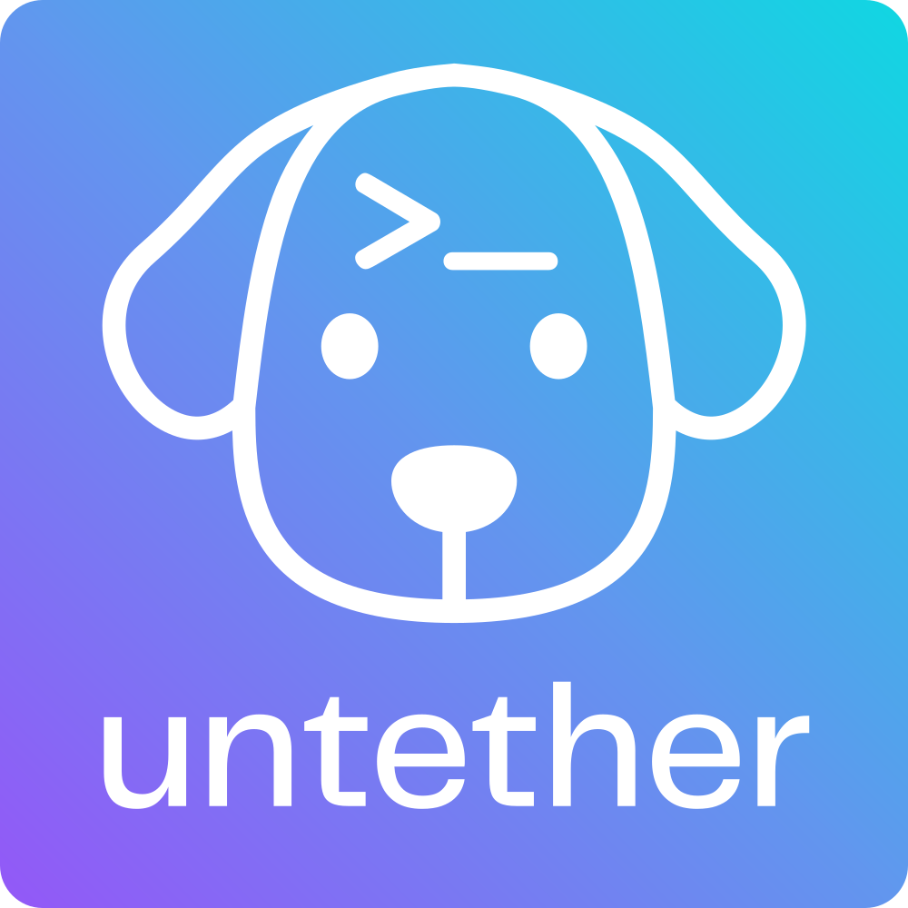

<p align="center">
  
</p>

<p align="center">
  <strong>Telegram bridge for AI coding agents.</strong><br>
  Send tasks by voice or text, stream progress live, and approve changes — from your phone, anywhere.
</p>

<p align="center">
  Works with <a href="https://docs.anthropic.com/en/docs/claude-code">Claude Code</a> · <a href="https://github.com/openai/codex">Codex</a> · <a href="https://github.com/opencode-ai/opencode">OpenCode</a> · <a href="https://github.com/nicholasgasior/pi">Pi</a>
</p>

<p align="center">
  <a href="https://github.com/littlebearapps/untether/actions/workflows/ci.yml"></a>
  <a href="https://pypi.org/project/untether/"></a>
  <a href="https://pypi.org/project/untether/"></a>
  <a href="https://github.com/littlebearapps/untether/blob/master/LICENSE"></a>
</p>

<p align="center">
  <a href="#-quick-start">Quick Start</a> · <a href="#-features">Features</a> · <a href="#-supported-engines">Engines</a> · <a href="#-commands">Commands</a> · <a href="#-contributing">Contributing</a>
</p>

---

Your AI coding agents need a terminal, but you don't need to sit at one. Untether runs on your machine and connects your agents to a Telegram bot. Send a task from your phone — by voice or text — and watch your agent work in real time. When it needs permission, tap a button. When it's done, read the result. No desk, no SSH, no screen sharing.

---

## ⚡ Quick start

```sh
uv tool install untether        # recommended
# or
pipx install untether            # alternative
```

```sh
untether                        # run setup wizard
```

The wizard creates a Telegram bot, picks your workflow, and connects your chat. Then send a message to your bot:

> fix the failing tests in src/auth

That's it. Your agent runs on your machine, streams progress to Telegram, and you can reply to continue the conversation.

**Tip:** Already have a bot token? Pass it directly: `untether --bot-token YOUR_TOKEN`

---

## 🎯 Features

- 📡 **Progress streaming** — watch your agent work in real time; see tool calls, file changes, and elapsed time as they happen
- 🔐 **Interactive permissions** — approve plan transitions and clarifying questions with inline buttons; tools auto-execute, with progressive cooldown after "Pause & Outline Plan"
- 📋 **Plan mode** — toggle per chat with `/planmode`; choose full manual approval, auto-approved transitions, or no plan phase
- 📁 **Projects and worktrees** — register repos with `untether init`, target with `/myproject @feat/thing`, run branches in isolated worktrees in parallel
- 💰 **Cost and usage tracking** — per-run and daily budgets, subscription usage in the footer, `/usage` for detailed breakdowns, optional auto-cancel
- 🏷 **Model and mode metadata** — every completed message shows the model and permission mode (e.g. `🏷 sonnet · plan`) across all engines
- 🎙️ **Voice notes** — dictate tasks instead of typing; Untether transcribes via a configurable Whisper-compatible endpoint
- 📎 **File transfer** — upload files to your repo or download results back
- ⏰ **Scheduled tasks** — cron expressions and webhook triggers
- 💬 **Forum topics** — map Telegram topics to projects and branches
- 📤 **Session export** — `/export` for markdown or JSON transcripts
- 🗂️ **File browser** — `/browse` to navigate project files with inline buttons
- 🧩 **Plugin system** — extend with custom engines, transports, and commands
- 💬 **Conversation modes** — assistant (ongoing chat), workspace (forum topics per project), or handoff (reply-to-continue with terminal resume)

---

## 🔌 Supported engines

| Engine | Install | What it's good at |
|--------|---------|-------------------|
| [Claude Code](https://docs.anthropic.com/en/docs/claude-code) | `npm i -g @anthropic-ai/claude-code` | Complex refactors, architecture, long context |
| [Codex](https://github.com/openai/codex) | `npm i -g @openai/codex` | Fast edits, shell commands, quick fixes |
| [OpenCode](https://github.com/opencode-ai/opencode) | `npm i -g opencode-ai@latest` | 75+ providers via Models.dev, local models |
| [Pi](https://github.com/mariozechner/pi-coding-agent) | `npm i -g @mariozechner/pi-coding-agent` | Multi-provider auth, conversational |

**Note:** Use your existing Claude or ChatGPT subscription — no extra API keys needed (unless you want API billing).

---

## 🤖 Commands

| Command | What it does |
|---------|-------------|
| `/cancel` | Stop the running agent |
| `/agent` | Show or set the engine for this chat |
| `/model` | Override the model for an engine |
| `/planmode` | Toggle plan mode (on/auto/off) |
| `/usage` | Show API costs for the current session |
| `/export` | Export session transcript |
| `/browse` | Browse project files |
| `/new` | Clear stored sessions |
| `/file put/get` | Transfer files |
| `/topic` | Create or bind forum topics |
| `/restart` | Gracefully restart Untether (drains active runs first) |

Prefix any message with `/<engine>` to pick an engine for that task, or `/<project>` to target a repo:

> /claude /myproject @feat/auth implement OAuth2

---

## ⚙️ Configuration

Untether reads `~/.untether/untether.toml`. The setup wizard creates this for you, or configure manually:

```toml
default_engine = "codex"

[transports.telegram]
bot_token = "123456789:ABC..."
chat_id = 123456789
session_mode = "chat"

[projects.myapp]
path = "~/dev/myapp"
default_engine = "claude"

[cost_budget]
enabled = true
max_cost_per_run = 2.00
max_cost_per_day = 10.00
```

See the [full configuration reference](https://github.com/littlebearapps/untether/blob/master/docs/reference/config.md) for all options.

**Warning:** Never commit your `untether.toml` — it contains your bot token. The default location (`~/.untether/`) keeps it outside your repos.

---

## 📦 Requirements

- **Python 3.12+** — `uv python install 3.14`
- **uv** — `curl -LsSf https://astral.sh/uv/install.sh | sh`
- At least one agent CLI on PATH: `codex`, `claude`, `opencode`, or `pi`

---

## 📖 Engine guides

Detailed setup and usage for each engine:

- [Claude Code guide](https://github.com/littlebearapps/untether/blob/master/docs/reference/runners/claude/runner.md) — permission modes, plan mode, cost tracking, interactive approvals
- [Codex guide](https://github.com/littlebearapps/untether/blob/master/docs/reference/runners/codex/exec-json-cheatsheet.md) — profiles, extra args, exec mode
- [OpenCode guide](https://github.com/littlebearapps/untether/blob/master/docs/reference/runners/opencode/runner.md) — model selection, 75+ providers, local models
- [Pi guide](https://github.com/littlebearapps/untether/blob/master/docs/reference/runners/pi/runner.md) — multi-provider auth, model and provider selection
- [Configuration reference](https://github.com/littlebearapps/untether/blob/master/docs/reference/config.md) — full walkthrough of `untether.toml`
- [Troubleshooting guide](https://github.com/littlebearapps/untether/blob/master/docs/how-to/troubleshooting.md) — common issues and solutions

---

## 📚 Documentation

Full documentation is available in the [`docs/`](https://github.com/littlebearapps/untether/tree/master/docs) directory.

- [Install and onboard](https://github.com/littlebearapps/untether/blob/master/docs/tutorials/install.md) — setup wizard walkthrough
- [First run](https://github.com/littlebearapps/untether/blob/master/docs/tutorials/first-run.md) — send your first task
- [Interactive approval](https://github.com/littlebearapps/untether/blob/master/docs/how-to/interactive-approval.md) — approve and deny tool calls from Telegram
- [Plan mode](https://github.com/littlebearapps/untether/blob/master/docs/how-to/plan-mode.md) — control plan transitions and progressive cooldown
- [Cost budgets](https://github.com/littlebearapps/untether/blob/master/docs/how-to/cost-budgets.md) — per-run and daily budget limits
- [Webhooks and cron](https://github.com/littlebearapps/untether/blob/master/docs/how-to/webhooks-and-cron.md) — automated runs from external events
- [Projects and branches](https://github.com/littlebearapps/untether/blob/master/docs/tutorials/projects-and-branches.md) — multi-repo workflows
- [Multi-engine workflows](https://github.com/littlebearapps/untether/blob/master/docs/tutorials/multi-engine.md) — switching between agents
- [Architecture](https://github.com/littlebearapps/untether/blob/master/docs/explanation/architecture.md) — how the pieces fit together

---

## 🤝 Contributing

Found a bug? Got an idea? [Open an issue](https://github.com/littlebearapps/untether/issues) — we'd love to hear from you.

Want to contribute code? See [CONTRIBUTING.md](https://github.com/littlebearapps/untether/blob/master/CONTRIBUTING.md) for development setup, testing, and guidelines.

---

## 🙏 Acknowledgements

Untether is a fork of [takopi](https://github.com/banteg/takopi) by [@banteg](https://github.com/banteg), which provided the original Telegram-to-Codex bridge. Untether extends it with interactive permission control, multi-engine support, plan mode, cost tracking, and many other features.

---

## 📄 Licence

[MIT](https://github.com/littlebearapps/untether/blob/master/LICENSE) — Made by [Little Bear Apps](https://github.com/littlebearapps) 🐶
