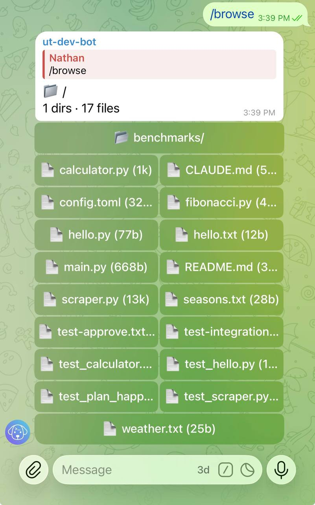

# Browse project files

Browse your project's directory tree and preview files without leaving [Telegram](https://telegram.org) — check a config, review a file, or orient yourself in the repo from your phone or any device.

## Start browsing

Send `/browse` to open the project root:

```
/browse
```

Untether replies with a directory listing rendered as inline keyboard buttons. Each button is a file or directory you can tap.

`/browse` needs a project root: the chat must be bound to a project (`chat_id` under `[projects.<alias>]`), or `default_project` must be set in `untether.toml`. Otherwise it refuses rather than guessing a directory ([#389](https://github.com/littlebearapps/untether/issues/389)):

!!! untether "Untether"
    No project directory for this chat. Bind the chat to a project (chat_id under [projects.&lt;alias&gt;]) or set default_project in untether.toml.



!!! untether "Untether"
    📁 /<br>
    3 dirs · 4 files

    `📂 docs/` · `📂 src/`<br>
    `📂 tests/` · `📄 .gitignore (1k)`<br>
    `📄 CHANGELOG.md (12k)` · `📄 README.md (4k)`<br>
    `📄 pyproject.toml (2k)`

## Navigate directories

Tap a directory button to drill into it. The listing updates in place, showing the contents of the selected directory.

## Preview a file

Tap a file button to see a syntax-highlighted preview. Previews show up to **25 lines** and **2,000 characters** of the file content, which is enough to check config files, review small modules, or confirm file structure.

!!! untether "Untether"
    📄 src/main.py
    ```python
    import sys
    from pathlib import Path

    from untether.app import create_app

    def main():
        app = create_app()
        app.run()
    ```

## Go back

Below the project root, each listing starts with a `📂 ..` button that moves up one level. A file preview has a `📂 Back` button that returns to its directory.

## Browse a specific path

Pass a path argument to jump directly to a directory or file:

```
/browse src/
/browse package.json
```

If the path is a directory, Untether shows its listing. If it's a file, you get the preview directly.

## Limits and filtering

The file browser applies sensible defaults to keep listings readable:

| Limit | Value |
|-------|-------|
| Max entries per listing | 20 |
| Hidden paths (any component starting with `.`) | Denied in listings, previews and direct paths, except `.github` and `.gitignore` |
| `[transports.telegram.files] deny_globs` | Applied to listings, previews and direct paths (e.g. `.env`, `key.pem`, `.ssh/…`) |
| Excluded directories (listing only) | `__pycache__`, `node_modules`, `.git`, `.venv`, `venv` |

If a directory has more than 20 entries, only the first 20 are shown. Use `/browse path/to/subdir` to navigate deeper.

Refused paths get a short reply instead of a preview: `Path denied by rule: <glob>`, `Hidden paths can't be browsed.`, `Path outside project.` or `Path could not be resolved (symlink loop?).` A denied path gets the same reply whether or not it exists.

## Path traversal protection

The browser cannot navigate outside the project root. Paths are checked after symlinks are resolved, so neither `..` nor an in-root symlink pointing elsewhere (e.g. `home → ~`) can escape the project directory; such links are left out of listings. Button ids are scoped to the chat that created them, so a button id from another chat reads as expired ([#389](https://github.com/littlebearapps/untether/issues/389)).

## Related

- [Projects](projects.md) — register repos and set project roots
- [Commands & directives](../reference/commands-and-directives.md) — full command reference
