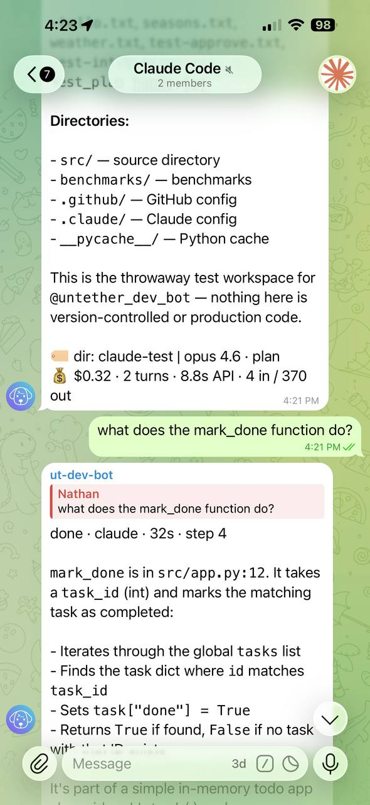

# Chat sessions

Chat sessions store one resume token per engine per chat (per sender in group chats), so new messages can auto-resume without replying. Reply-to-continue still works and updates the stored session for that engine.

!!! tip "Assistant and workspace workflows"
    If you chose **assistant** or **workspace** during [onboarding](../tutorials/install.md), chat sessions are already enabled. This guide covers how they work and how to customize them.

## Enable chat sessions

If you chose **handoff** during onboarding and want to switch to chat mode:

=== "untether config"

    ```sh
    untether config set transports.telegram.session_mode "chat"
    ```

=== "toml"

    ```toml
    [transports.telegram]
    session_mode = "chat" # stateless | chat
    ```

With `session_mode = "chat"`, new messages in the chat continue the current thread automatically.

!!! user "You"
    explain the auth flow

!!! untether "Untether"
    done · claude · 15s · step 4

    The auth flow uses JWT tokens…

!!! user "You"
    now add rate limiting to it



The second message automatically continues the same session — no reply needed.

## Reset a session

Use `/new` to clear the stored session for the current scope:

- In a private chat, it resets the chat.
- In a group, it resets **your** session in that chat.
- In a forum topic, it resets the topic session.

See `/new` in [Commands & directives](../reference/commands-and-directives.md).

## Resume lines and branching

Chat sessions do not remove reply-to-continue. If resume lines are visible, you can reply to any older message to branch the conversation.

If you prefer a cleaner chat, hide resume lines:

=== "untether config"

    ```sh
    untether config set transports.telegram.show_resume_line false
    ```

=== "toml"

    ```toml
    [transports.telegram]
    show_resume_line = false
    ```

## How it behaves in groups

In group chats, Untether stores a session per sender, so different people can work independently in the same chat.

## How session persistence works

When `session_mode = "chat"`, Untether stores resume tokens in a JSON state file next to your config:

- **Assistant mode**: `telegram_chat_sessions_state.json` — one token per engine per chat
- **Workspace mode**: `telegram_topics_state.json` — one token per engine per forum topic

When you send a message, Untether checks the state file for a stored resume token matching the current engine and scope (chat or topic). If found, the engine continues that session. If not, a new session starts.

The `/new` command clears stored tokens for the current scope. Switching to a different engine also starts a fresh session (each engine has its own token).

!!! note "Handoff mode has no state file"
    In handoff mode (`session_mode = "stateless"`), no sessions are stored. Each message starts fresh. Continue a session by replying to its bot message or using `/continue`.

## Working directory changes

When `session_mode = "chat"` is enabled, Untether clears stored chat sessions on startup if the current working directory differs from the one recorded in `telegram_chat_sessions_state.json`. This avoids resuming directory-bound sessions from a different project.

## Related

- [Conversation modes](../tutorials/conversation-modes.md)
- [Cross-environment resume](cross-environment-resume.md) — pick up CLI sessions from Telegram with `/continue`
- [Forum topics](topics.md)
- [Commands & directives](../reference/commands-and-directives.md)
