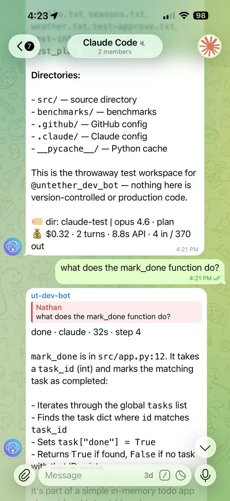

# Chat sessions

Chat sessions store one resume token per engine per chat (per sender in group chats), so new messages can auto-resume without replying. Reply-to-continue still works and updates the stored session for that engine.

!!! tip "Assistant and workspace workflows"
    If you chose **assistant** or **workspace** during [onboarding](../tutorials/install.md), chat sessions are already enabled. This guide covers how they work and how to customise them.

## Enable chat sessions

If you chose **handoff** during onboarding and want to switch to chat mode:

=== "untether config"

    ```sh
    untether config set transports.telegram.session_mode "chat"
    ```

=== "toml"

    ```toml
    [transports.telegram]
    session_mode = "chat" # stateless | chat
    ```

With `session_mode = "chat"`, new messages in the chat continue the current thread automatically.

!!! user "You"
    explain the auth flow

!!! untether "Untether"
    done · claude · 15s · step 4

    The auth flow uses JWT tokens…

!!! user "You"
    now add rate limiting to it



The second message automatically continues the same session — no reply needed.

## Reset a session

Use `/new` to cancel any running task and clear the stored session for the current scope:

- In a private chat, it resets the chat.
- In a group, it resets **your** session in that chat.
- In a forum topic, it resets the topic session.

See `/new` in [Commands & directives](../reference/commands-and-directives.md).

## Resume lines and branching

Chat sessions do not remove reply-to-continue. If resume lines are visible, you can reply to any older message to branch the conversation.

If you prefer a cleaner chat, hide resume lines:

=== "untether config"

    ```sh
    untether config set transports.telegram.show_resume_line false
    ```

=== "toml"

    ```toml
    [transports.telegram]
    show_resume_line = false
    ```

## Replying to a message or a quote

When you reply to a message, the agent sees what you replied to, so "what does this error mean?" or "do the second step" has something to point at ([#904](https://github.com/littlebearapps/untether/issues/904), community PR [#736](https://github.com/littlebearapps/untether/pull/736)). Untether adds the replied message's text (or a media caption) after your prompt. If you select part of a message and use Telegram's **Quote** option, only the selected quote is passed.

This works for every engine and on every kind of reply: one that starts a new run, one that resumes a session through its resume line, a follow-up into a Claude session that is still open, and a [steer](steer-follow-ups.md). Before v0.36.0 a reply only told Untether which session to continue; the agent never saw the message you replied to.

The reference is added in a labelled `<telegram_reply_context>` block that tells the agent it is reference data, not instructions, and Untether's own resume lines are removed from it. `<`, `>` and `&` in the replied text are HTML-escaped (`&lt;`, `&gt;`, `&amp;`) so it can't close the block early. It is capped at 4,000 characters; anything longer is cut off with a `[… reply context truncated by Untether …]` note. In a forum topic, a plain message (which Telegram sends as a reply to the topic's first message) carries no reply context.

## How it behaves in groups

In group chats, Untether stores a session per sender, so different people can work independently in the same chat.

## Topics in a private chat

If you use Telegram's topics in a private chat with the bot, each topic keeps its own session, separate from the main thread ([#734](https://github.com/littlebearapps/untether/issues/734)). Before v0.36.0 every follow-up in a private-chat topic quietly started a fresh session.

## While Claude is still working

With Claude Code, a session usually stays open after its answer while background tasks run (see [Troubleshooting → Messages arrive after the run finished](troubleshooting.md#messages-arrive-after-the-run-finished)). A message you send then goes straight into that same session once the current turn ends, rather than waiting for the background work. To have a message read *during* the current turn instead, use [steer](steer-follow-ups.md). An open session is closed after 4 hours in total, however busy it is; if background tasks are still running then, the next message starts a fresh session. Raise `[watchdog] live_session_max_s` for longer runs (see [Troubleshooting → Session closed after 4 hours](troubleshooting.md#session-closed-after-4-hours-and-the-next-message-started-fresh)). `/new` or `/cancel` closes a session that is only idling after its answer; `/cancel` replies `nothing running in this chat — closed the idle session.` (or says what pending `/at` runs and loops it dropped) ([#902](https://github.com/littlebearapps/untether/issues/902)).

## Sending several messages quickly

Messages you send within about a second of each other (`forward_coalesce_s`, default 1 s) are merged, in order, into one prompt, so a thought split across a few quick messages runs once ([#794](https://github.com/littlebearapps/untether/issues/794)). Messages that can't share a run — a reply to a different message, a voice note next to text, a directive, or a context change — run separately.

Commands act as a barrier. `/cancel`, `/new` and `/continue` drop anything still waiting in that window and say so (`🗑️ Dropped 2 messages sent just before /new — send them again if you still need them.`), so a message meant for the old session never lands in the new one. Any other command lets the waiting messages run first ([#807](https://github.com/littlebearapps/untether/issues/807)).

## How session persistence works

When `session_mode = "chat"`, Untether stores resume tokens in a JSON state file next to your config:

- **Assistant mode**: `telegram_chat_sessions_state.json` — one token per engine per chat
- **Workspace mode**: `telegram_topics_state.json` — one token per engine per forum topic

When you send a message, Untether checks the state file for a stored resume token matching the current engine and scope (chat or topic). If found, the engine continues that session. If not, a new session starts.

The `/new` command cancels any running task and clears stored tokens for the current scope. Switching to a different engine also starts a fresh session (each engine has its own token).

!!! note "Handoff mode has no state file"
    In handoff mode (`session_mode = "stateless"`), no chat sessions are stored. Each message starts fresh. Continue a session by replying to its bot message or using `/continue`. Forum topics are the exception: with topics enabled, each topic keeps its own session in `telegram_topics_state.json` whatever the session mode.

## Working directory changes

When `session_mode = "chat"` is enabled, Untether clears stored chat sessions on startup if the current working directory differs from the one recorded in `telegram_chat_sessions_state.json`. This avoids resuming directory-bound sessions from a different project.

## Related

- [Conversation modes](../tutorials/conversation-modes.md)
- [Cross-environment resume](cross-environment-resume.md) — pick up CLI sessions from Telegram with `/continue`
- [Forum topics](topics.md)
- [Commands & directives](../reference/commands-and-directives.md)
