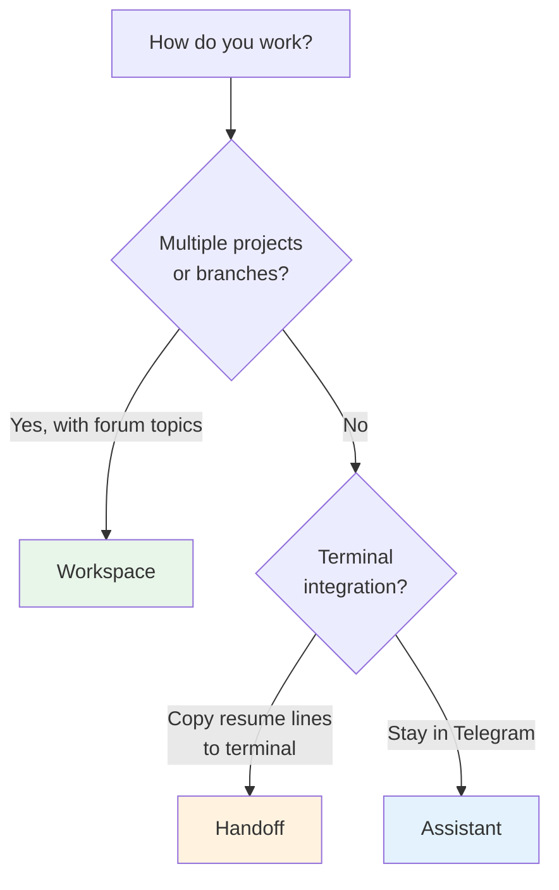
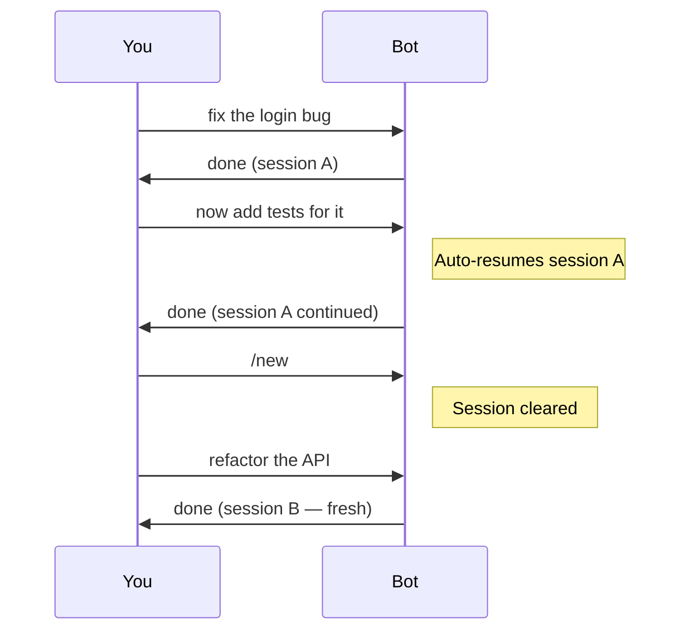
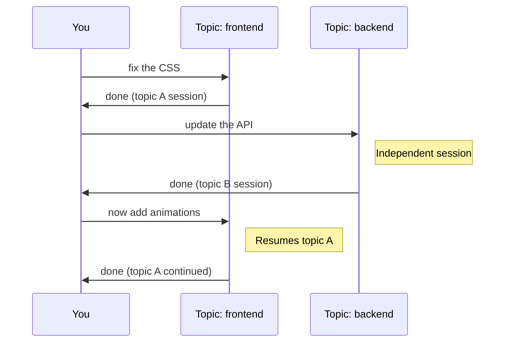
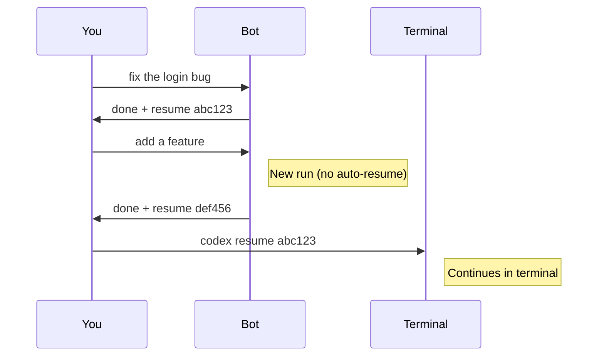

# Choose a workflow mode

Untether has three workflow modes that control how conversations continue and how sessions are organised. Each mode suits a different working style.

## Which mode is right for me?



**Quick decision:**

- **Assistant** — you want a simple chat that remembers context. Just type and go. *(recommended for most users)*
- **Workspace** — you manage multiple projects and want each Telegram forum topic bound to a project/branch.
- **Handoff** — you switch between Telegram and terminal, copying resume lines to continue sessions in your IDE.

## Mode comparison

| | Assistant | Workspace | Handoff |
|---|---|---|---|
| **Session** | Auto-resume | Auto-resume per topic | Reply-to-continue |
| **Resume line** | Hidden | Hidden | Shown |
| **Topics** | Off | On | Off |
| **Best for** | Solo dev, mobile | Teams, multi-project | Terminal workflow |
| **`/new`** | Resets session | Resets topic session | No effect |

## How each mode works

### Assistant

Messages automatically continue your last session — no need to reply to a specific message. Use `/new` to start fresh.



### Workspace

Each forum topic maintains its own independent session. Topics can be bound to specific projects and branches via `/ctx set`.



### Handoff

Every message starts a new run. Resume lines are always shown so you can copy them to continue in terminal. Reply to a bot message to continue that session in Telegram.



## Configuration

Each mode is defined by three settings in `untether.toml`:

=== "Assistant"

    ```toml
    [transports.telegram]
    session_mode = "chat"
    show_resume_line = false

    [transports.telegram.topics]
    enabled = false
    ```

=== "Workspace"

    ```toml
    [transports.telegram]
    session_mode = "chat"
    show_resume_line = false

    [transports.telegram.topics]
    enabled = true
    scope = "auto"
    ```

=== "Handoff"

    ```toml
    [transports.telegram]
    session_mode = "stateless"
    show_resume_line = true

    [transports.telegram.topics]
    enabled = false
    ```

## Switching modes

To change modes, edit the three settings in your `untether.toml` and restart:

```bash
systemctl --user restart untether  # or untether-dev
```

**No data is lost** when switching modes. Session state files are preserved — they just won't be used if you switch from chat to stateless mode. Switching back restores them.

!!! tip "Check your mode"
    The startup message shows your current mode: `mode: assistant`, `mode: workspace`, or `mode: handoff`. You can also check via `/config` — look at the "Resume line" setting (on = handoff, off = assistant/workspace).

## Workspace prerequisites

Workspace mode requires additional setup:

1. **Forum-enabled supergroup** — create a Telegram group and enable Topics in group settings
2. **Bot as admin** — add your bot to the group and promote to admin
3. **Manage Topics permission** — the bot needs `can_manage_topics` to create/edit topics (optional — existing topics work without it)

See [Forum topics](topics.md) for detailed setup instructions.

## Related

- [Workflow modes reference](../reference/modes.md) — authoritative settings table
- [Configuration reference](../reference/config.md) — all `untether.toml` options
- [Conversation modes tutorial](../tutorials/conversation-modes.md) — step-by-step walkthrough
- [Forum topics](topics.md) — workspace-specific setup
- [Cross-environment resume](cross-environment-resume.md) — handoff terminal workflow
