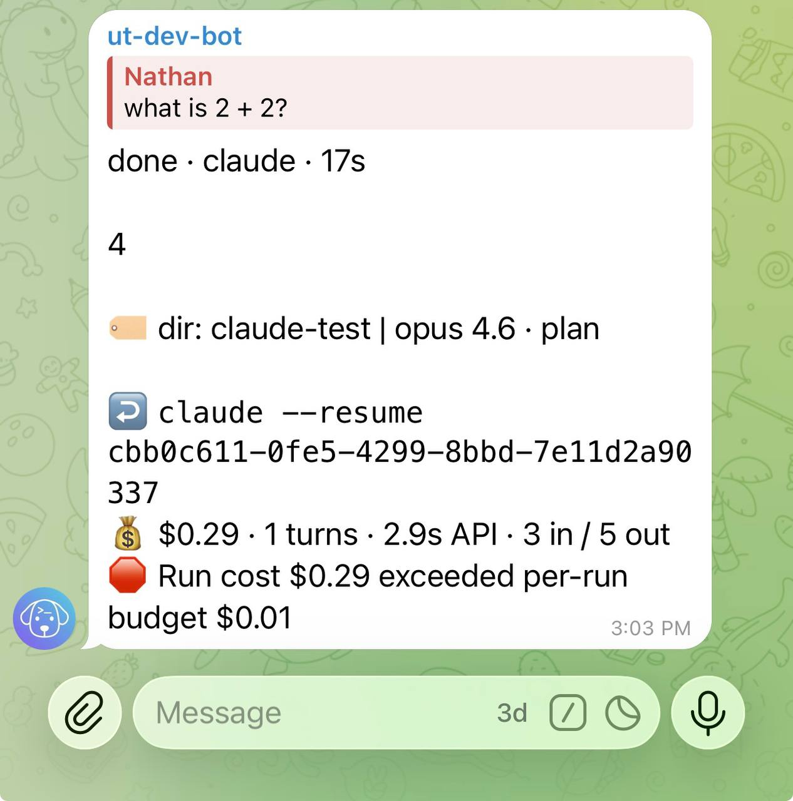
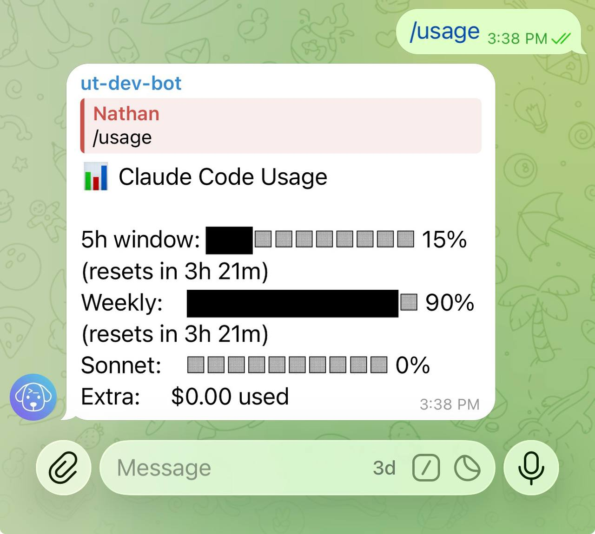

# Cost budgets

Running agents remotely means they can rack up costs while you're not watching. Untether tracks API costs per run and per day, with configurable budget limits, warning thresholds, and auto-cancel to keep spending under control — even when you're away from the screen.

## Configure budgets

=== "untether config"

    ```sh
    untether config set cost_budget.enabled true
    untether config set cost_budget.max_cost_per_run 2.00
    untether config set cost_budget.max_cost_per_day 10.00
    ```

=== "toml"

    ```toml
    [cost_budget]
    enabled = true
    max_cost_per_run = 2.00
    max_cost_per_day = 10.00
    ```

| Setting | Default | Description |
|---------|---------|-------------|
| `enabled` | `false` | Enable cost tracking and budget enforcement |
| `max_cost_per_run` | (none) | Maximum cost for a single run (USD) |
| `max_cost_per_day` | (none) | Maximum total cost per day (USD) |
| `warn_at_pct` | `70` | Show a warning when this percentage of the budget is reached |
| `auto_cancel` | `false` | Automatically cancel the run when a budget is exceeded |

## How it works

After each run completes, Untether checks the reported cost against your budgets:

1. **Per-run check**: if the run cost exceeds `max_cost_per_run`, you get an alert
2. **Daily check**: if the cumulative daily cost exceeds `max_cost_per_day`, you get an alert
3. **Warning threshold**: at `warn_at_pct` (default 70%) of either budget, you get an early warning

!!! note "Token-only engines"
    Engines that don't report USD costs (Codex, Pi, Gemini CLI, Amp) show token counts in the footer instead (e.g. `💰 26.0k in / 71 out`). Budget alerts only apply to engines that report USD costs.

### Alert levels

| Alert | Icon | Meaning |
|-------|------|---------|
| Warning | `???` | Cost is approaching the budget threshold |
| Exceeded | `????` | Cost has exceeded the budget |

When `auto_cancel = true` and a budget is exceeded, Untether cancels the run automatically. Otherwise, you see the alert but the run continues.

!!! untether "Untether"
    ⚠️ **cost warning** — run cost $1.45 is 73% of $2.00 per-run budget

{ loading=lazy }

### Daily reset

The daily cost counter resets at midnight (local time, based on the server clock). Each new day starts from zero.

## Check current usage

Use the `/usage` command in Telegram to see your Claude Code subscription usage:

```
/usage
```

This shows:

- **5h window**: usage percentage and time until reset
- **Weekly**: 7-day usage percentage and time until reset
- **Per-model breakdown**: Sonnet and Opus usage (if applicable)
- **Extra credits**: any overage credits used

The `/usage` command reads your Claude Code OAuth credentials to fetch live data from the Anthropic API. If you see "No Claude credentials found", run `claude login` in your terminal.

!!! untether "Untether"
    **Claude Code usage**

    **5h window**: 42% used (2h 6m left)<br>
    **Weekly**: 28% used (5d 2h left)

    sonnet: 38% · opus: 4%<br>
    extra credits: $0.00

{ loading=lazy }

## Subscription usage footer

Untether can show subscription usage in the footer of completed messages. This is configured in the `[footer]` section:

=== "toml"

    ```toml
    [footer]
    show_usage = true
    ```

When enabled, completed messages show a line like:

```
5h: 45% (2h 15m) | 7d: 30% (4d 3h)
```

This tells you how much of your 5-hour and 7-day rate limits you've used, and when they reset.

## Historical statistics

For historical run data beyond the current session, use the `/stats` command:

```
/stats
```

This shows per-engine session statistics (runs, actions, duration) across today, this week, and all time. Pass an engine name to filter (e.g. `/stats claude`). Data is persisted in the config directory and auto-pruned after 90 days.

## Related

- [Configuration](../reference/config.md) — full config reference for budget settings
- [Commands & directives](../reference/commands-and-directives.md) — `/stats` and `/usage` command reference
- [Troubleshooting](troubleshooting.md) — credential issues with `/usage`
