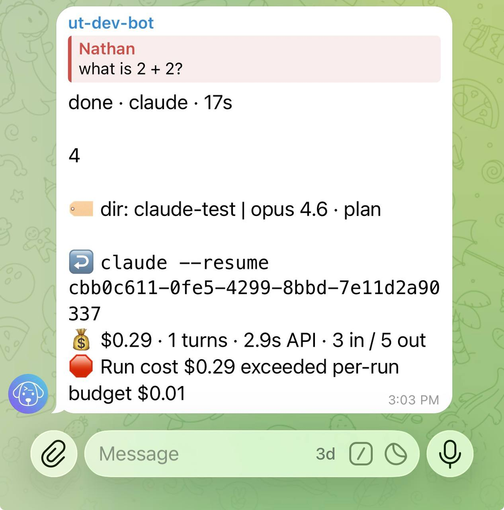
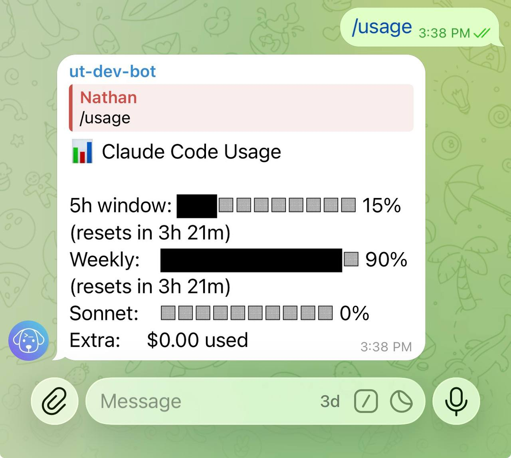

# Cost budgets

Running agents remotely means they can rack up costs while you're not watching. Untether tracks API costs per run and per day, with configurable budget limits, warning thresholds, and auto-cancel to keep spending under control — even when you're away from the screen.

## Configure budgets

=== "untether config"

    ```sh
    untether config set cost_budget.enabled true
    untether config set cost_budget.max_cost_per_run 2.00
    untether config set cost_budget.max_cost_per_day 10.00
    ```

=== "toml"

    ```toml
    [cost_budget]
    enabled = true
    max_cost_per_run = 2.00
    max_cost_per_day = 10.00
    ```

| Setting | Default | Description |
|---------|---------|-------------|
| `enabled` | `false` | Enable cost tracking and budget enforcement |
| `max_cost_per_run` | (none) | Maximum cost for a single run (USD) |
| `max_cost_per_day` | (none) | Maximum total cost per day (USD) |
| `warn_at_pct` | `70` | Show a warning when this percentage of the budget is reached |
| `auto_cancel` | `false` | Automatically cancel the run when a budget is exceeded |
| `warn_run_above_usd` | (unset = $20) | Flag any single run that costs more than this, even with `enabled = false`; `0` turns it off |
| `notify_run_outlier` | `true` | Post the one-line chat notice for an outlier run (the log line is written either way) |

## Per-chat overrides

You can toggle budgets on or off per chat without editing the config file. Open `/config` → **Cost & Usage** and use the toggle buttons:

- **Budget enabled** — turn budget tracking on or off for this chat
- **Budget auto-cancel** — enable or disable automatic run cancellation when a budget is exceeded

These override the global `[cost_budget]` settings for the specific chat. Clear the override to revert to the global setting. See [Inline settings](inline-settings.md) for the full `/config` menu reference.

!!! warning "Loop mode and budgets"
    If you turn on Loop mode in `/config → 🔁 Loop mode`, autonomous loop fires count toward the same daily and per-run budget caps as manual runs. There is no separate per-loop budget — the existing `max_cost_per_day` cap auto-cancels any loop iteration that would exceed it. **Set a budget before turning on Loop mode** to bound your exposure. See [Schedule tasks → Loop mode](schedule-tasks.md#loop-mode) for the full picture. ([#289](https://github.com/littlebearapps/untether/issues/289))

## How it works

After each run completes, Untether checks the reported cost against your budgets:

1. **Per-run check**: if the run cost exceeds `max_cost_per_run`, you get an alert
2. **Daily check**: if the cumulative daily cost exceeds `max_cost_per_day`, you get an alert
3. **Warning threshold**: at `warn_at_pct` (default 70%) of either budget, you get an early warning

!!! note "Claude costs are per run"
    Claude reports a running total for the whole session, including earlier runs you resumed. Since v0.35.5 Untether subtracts what the session had already cost, so budgets, `/stats` and the footer see only this run's spend. A turn that Claude runs on its own after a background task counts as its own small run ([#778](https://github.com/littlebearapps/untether/issues/778)).

!!! note "Token-only engines"
    Engines that don't report USD costs (Codex, Pi, and OpenCode on its free tier) show token counts in the footer instead, marked `🔢` (e.g. `🔢12.3k/400`, input/output); `💰` means the footer carries a cost ([#417](https://github.com/littlebearapps/untether/issues/417)). Codex reports a running total for the whole thread, so since v0.35.5 Untether shows each run's own share; a figure that is still the whole thread (for example the first `/continue` of a thread started outside Untether) is labelled `· thread total` ([#419](https://github.com/littlebearapps/untether/issues/419)). Gemini CLI and AMP (both deprecated) surface `total_cost_usd` when their CLI reports one. Budget alerts apply only to the USD-reporting path.

### Expensive single runs

Even with no budget configured, a single run that costs more than `warn_run_above_usd` ($20 unless you set it) adds one line to its final message, whatever your footer settings ([#702](https://github.com/littlebearapps/untether/issues/702)):

```
💸 This run cost $24.30 (over the $20.00 alert)
```

It also logs `cost.run_outlier` with the run's shape (turns, cost per turn, duration and token counts), so you can tell one long task from a session whose context has grown expensive ([#717](https://github.com/littlebearapps/untether/issues/717)). The line is skipped when a budget alert already covered the run. Separately, if spend is neither shown (`[footer] show_api_cost = false`) nor bounded (no `[cost_budget]`), Untether logs one `config.cost_visibility_gap` warning per start ([#658](https://github.com/littlebearapps/untether/issues/658)).

### Alert levels

| Alert | Icon | Meaning |
|-------|------|---------|
| Warning | ⚠️ | Cost is approaching the budget threshold |
| Exceeded | 🛑 | Cost has exceeded the budget |

When `auto_cancel = true` and a budget is exceeded, Untether cancels the run automatically. Otherwise, you see the alert but the run continues.

!!! untether "Untether"
    ⚠️ Run cost $1.45 is 73% of per-run budget $2.00



### Daily reset

The daily cost counter resets at midnight (local time, based on the server clock). Each new day starts from zero.

## Check current usage

Use the `/usage` command in Telegram to see your Claude Code subscription usage:

```
/usage
```

This shows:

- **5h window**: usage percentage and time until reset
- **Weekly**: 7-day usage percentage and time until reset
- **Per-model breakdown**: Sonnet and Opus usage (if applicable)
- **Extra**: overage credits used, when extra usage is turned on for your account

The `/usage` command reads your Claude Code OAuth credentials to fetch live data from the Anthropic API. If you see "No Claude credentials found", run `claude login` in your terminal.

!!! untether "Untether"
    📊 Claude Code Usage

    5h window: ████░░░░░░ 42% (resets in 2h 6m)<br>
    Weekly:    ███░░░░░░░ 28% (resets in 5d 2h)<br>
    Sonnet:    ████░░░░░░ 38%<br>
    Opus:      ░░░░░░░░░░ 4%

### Other engines

Codex, OpenCode and the other engines don't report subscription quota, so in their chats `/usage` shows the token totals of the chat's last session of that engine instead: the session total, the last run, the run count, and the last run's cost when the engine reports one. Codex reports a running total for the whole thread, so Untether records each run's difference — the footer (`🔢12.3k/400`) shows *this run's* tokens, and `/usage` shows the thread total. A token-only footer uses `🔢`; `💰` means the footer carries a cost.

!!! untether "Untether"
    📊 **codex** · last session in this chat<br>
    Session `019dc356…` · 3 runs<br>
    **Session total:** 168k in (142k cached) · 1.6k out (reasoning 900)<br>
    **Last run:** 12k in · 400 out<br>
    Quota and plan limits are not available for codex — its exec mode doesn't report them. Transcript: /export

The history behind `/usage` is kept in memory, so straight after a restart it says there is no completed run yet; send a prompt first.



## Subscription usage footer

Untether can show subscription usage in the footer of completed messages. This is configured in the `[footer]` section:

=== "toml"

    ```toml
    [footer]
    show_subscription_usage = true
    ```

When enabled, completed messages show a line like:

```
⚡ 5h: 45% | 7d: 30%
```

This tells you how much of your 5-hour and 7-day rate limits you've used. A window's reset time is added once it passes 50%, for example `⚡ 5h: 72% (1h 14m) | 7d: 30%`. See [Subscription usage](subscription-usage.md) for details.

## Historical statistics

For historical run data beyond the current session, use the `/stats` command:

```
/stats
```

This shows per-engine session statistics (runs, actions, duration) across today, this week, and all time. Pass an engine name to filter (e.g. `/stats claude`). Data is persisted in the config directory and auto-pruned after 90 days.

## Related

- [Configuration](../reference/config.md) — full config reference for budget settings
- [Commands & directives](../reference/commands-and-directives.md) — `/stats` and `/usage` command reference
- [Troubleshooting](troubleshooting.md) — credential issues with `/usage`
