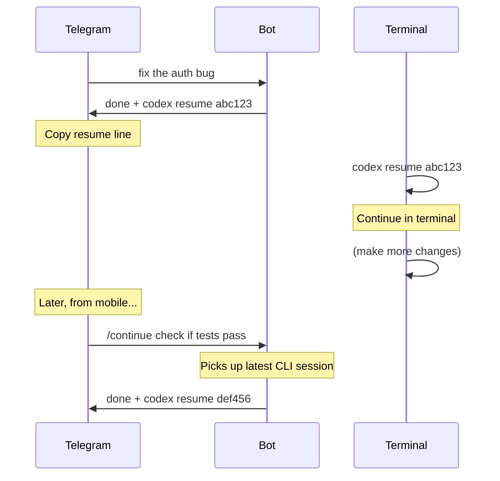

# Cross-environment resume

Resume a coding session you started in your terminal — from Telegram, while away from your desk.

## How it works

Each engine CLI stores sessions per directory. Untether projects map to directories. `/continue` tells the engine to resume the most recent session in the project directory, regardless of whether it was started from Untether or directly in the CLI.

## Prerequisites

1. **Same directory** — the Untether project must point to the same directory as the CLI session. Register it with `untether init`.
2. **Session finished** — the CLI session must have completed (or been stopped). You cannot resume a session that is still actively running in another process.

## Usage

```text
/continue                           # resume with no new prompt
/continue add tests for the auth    # resume with a follow-up prompt
```

## Example workflow

1. On your laptop, start a coding session:

    ```sh
    cd ~/myproject
    claude "refactor the auth module"
    ```

2. The session finishes (or you stop it). You leave the house.

3. On your phone, open Telegram and go to the chat bound to `~/myproject`:

    !!! user "You"
        /continue now add tests for the refactored code

4. Untether passes `--continue` to Claude Code, which finds the most recent session in `~/myproject` and resumes it with your new prompt.

## Engine support

| Engine | Supported | CLI flag used | Notes |
|--------|:---------:|---------------|-------|
| Claude Code | ✅ | `--continue` | Tested, works reliably |
| Codex CLI | ✅ | `resume --last` | Tested, works reliably |
| Gemini CLI | ✅ | `--resume latest` | Tested, works reliably |
| OpenCode | ✅ | `--continue` | Tested via dev bot; requires latest OpenCode version |
| Pi | ✅ | `--continue` | Requires `provider` config for OAuth subscriptions (see below) |
| Amp | — | N/A | Requires explicit thread ID; no "most recent" mode |

### Pi provider configuration

Pi stores OAuth subscription credentials under provider names like `openai-codex`, but its `--print` mode defaults to the `openai` API key provider. To use your ChatGPT subscription with `/continue`, set the provider in your Untether config:

```toml
[engines.pi]
provider = "openai-codex"
```

Or for Gemini CLI subscriptions: `provider = "google-gemini-cli"`.

## Handoff mode: terminal-first workflow

If you use **handoff mode** (`session_mode = "stateless"`), every Telegram message starts a fresh run and the resume line is always visible. This is designed for developers who switch between Telegram and terminal:



**The workflow:**

1. Send a task from Telegram while away from desk
2. Bot completes it and shows `codex resume abc123`
3. Back at desk: paste `codex resume abc123` in terminal to continue with full IDE context
4. Later, from mobile: use `/continue` to pick up where the terminal left off

This works because resume tokens are stored per-directory, not per-transport. Both Telegram and terminal sessions use the same underlying engine session store.

## Tips

- Use `/new` first if you want to clear any stored Untether session before continuing a CLI session.
- If the most recent session in the directory was an Untether session (not a CLI one), `/continue` will resume that instead. To target a specific older session, use [reply-to-continue](../explanation/routing-and-sessions.md) instead.

## Related

- [Chat sessions](chat-sessions.md) — auto-resume within the same chat
- [Routing & sessions](../explanation/routing-and-sessions.md) — all four continuation methods
- [Commands & directives](../reference/commands-and-directives.md)
