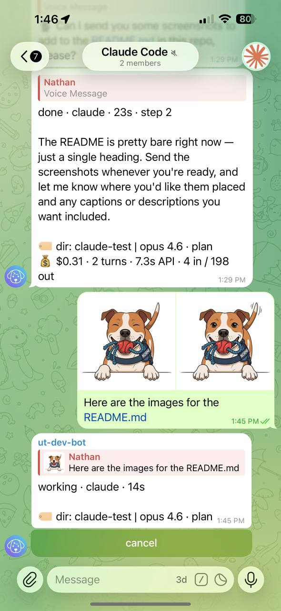
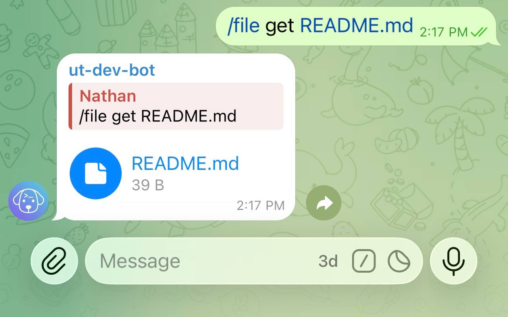

# File transfer

Send files to your repo or pull results back — directly from Telegram on any device. Useful when you need to share a spec, screenshot, or config file with your agent without opening a terminal.

## Enable file transfer

=== "untether config"

    ```sh
    untether config set transports.telegram.files.enabled true
    untether config set transports.telegram.files.auto_put true
    untether config set transports.telegram.files.auto_put_mode "upload"
    untether config set transports.telegram.files.uploads_dir "incoming"
    untether config set transports.telegram.files.allowed_user_ids "[123456789]"
    untether config set transports.telegram.files.deny_globs '[".git/**", ".env", ".envrc", "**/*.pem", "**/.ssh/**"]'
    ```

=== "toml"

    ```toml
    [transports.telegram.files]
    enabled = true
    auto_put = true
    auto_put_mode = "upload" # upload | prompt
    uploads_dir = "incoming"
    allowed_user_ids = [123456789]
    deny_globs = [".git/**", ".env", ".envrc", "**/*.pem", "**/.ssh/**"]
    ```

Notes:

- File transfer is **disabled by default**.
- If `allowed_user_ids` is empty, private chats are allowed and group usage requires admin privileges.

## Upload a file (`/file put`)

Send a document with a caption:

```
/file put <path>
```

Examples:

```
/file put docs/spec.pdf
/file put /happy-gadgets @feat/camera assets/logo.png
```

If you send a file **without a caption**, Untether saves it to `incoming/<original_filename>`.

!!! note "iOS: captions on documents"
    Telegram on iOS doesn't always show a caption field when sending files via the "File" picker — the file sends immediately. To add a `/file put <path>` caption on iOS, send photos (which always show the caption field) or use **Telegram Desktop / macOS**, which shows a caption field for all file types. Alternatively, skip the caption and let files auto-save to `incoming/`.

Use `--force` to overwrite:

```
/file put --force docs/spec.pdf
```

!!! untether "Untether"
    📄 saved `docs/spec.pdf` (42 KB)



## Fetch a file (`/file get`)

Send:

```
/file get <path>
```

Directories are zipped automatically.

!!! untether "Untether"
    📎 `src/main.py` (1.2 KB)



## Related

- [Commands & directives](../reference/commands-and-directives.md)
- [Config reference](../reference/config.md)
