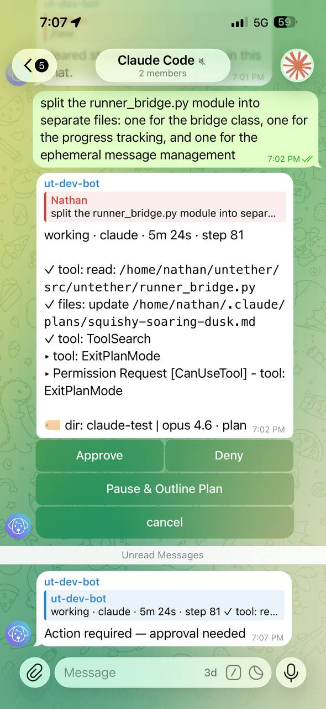
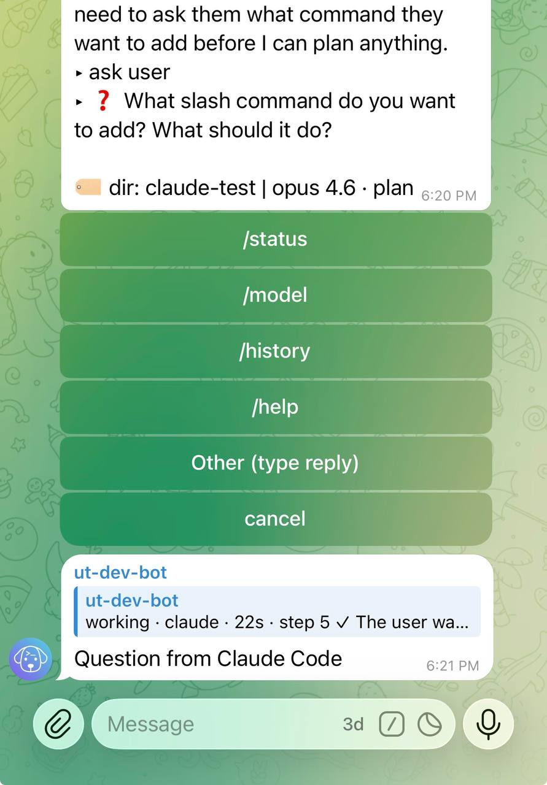

# Interactive approval

When Claude Code runs in permission mode, Untether shows inline buttons in Telegram so you can approve or deny tool calls from your phone.

## When buttons appear

Buttons appear when Claude Code wants to:

- **Edit or create a file** (Edit, Write, MultiEdit)
- **Run a shell command** (Bash)
- **Exit plan mode** (ExitPlanMode)
- **Ask you a question** (AskUserQuestion)

Other tool calls (Read, Glob, Grep, WebSearch, etc.) are auto-approved — they don't change anything, so you won't be interrupted for them.

## The three buttons

When a permission request arrives, you see a message with the tool name and a compact diff preview, plus three buttons:

| Button | What it does |
|--------|-------------|
| **Approve** | Let Claude Code proceed with the action |
| **Deny** | Block the action and ask Claude Code to explain what it was about to do |
| **Pause & Outline Plan** | Stop Claude Code and require a written plan before continuing (only appears for ExitPlanMode) |

Buttons clear immediately when you tap them — no waiting for a spinner.

!!! untether "Untether"
    ▸ Permission Request [CanUseTool] - tool: Edit (file_path=src/main.py) 
    📝 src/main.py 
    `- import sys` 
    `+ import sys` 
    `+ from pathlib import Path`

Approve
Deny
Pause &amp; Outline Plan

## Diff previews

For tools that modify files, the approval message includes a compact diff so you can see what's about to change before deciding:

- **Edit**: 📝 file path, removed lines (`- old`) and added lines (`+ new`), up to 4 lines each
- **Write**: 📝 file path, then the first 8 lines of content to be written
- **Bash**: `$ command` (up to 200 characters)

This lets you make informed approve/deny decisions without leaving Telegram.

!!! untether "Untether"
    ▸ Permission Request [CanUseTool] - tool: Edit (file_path=src/main.py) 
    📝 src/main.py 
    `- import sys` 
    `+ import sys` 
    `+ from pathlib import Path`

## Answering questions

When Claude Code calls `AskUserQuestion`, Untether renders the question with interactive option buttons in Telegram:

- **Option buttons** — tap any option to answer instantly. Claude Code receives your choice and continues.
- **"Other (type reply)"** — tap this to type a custom answer. Send your reply as a regular message and Untether routes it back to Claude Code.
- **Multi-question flows** — if Claude Code asks multiple questions, they appear one at a time (e.g. "1 of 3"). Answer each to step through the sequence.
- **Deny** — tap Deny to dismiss the question. Claude Code proceeds with its default assumptions.

Toggle ask mode on or off via `/config` → Ask mode. When off, questions are auto-denied and Claude Code proceeds with defaults.

!!! untether "Untether"
    ❓ Which test framework should I use?

pytest
unittest

Other (type reply)
Deny

## Push notifications

When approval buttons appear, Untether sends a separate notification message so you don't miss it — even if your phone is locked or you're in another app.

## Ephemeral cleanup

Approval-related messages (notifications, button messages) are automatically deleted when the run finishes, keeping your chat clean.

## Auto-approve configuration

You can configure which tools require approval and which are auto-approved. By default, only `ExitPlanMode` and `AskUserQuestion` require user interaction — all other tools are approved automatically.

To change this behaviour, adjust the permission mode. See [Plan mode](plan-mode.md) for details.

## Engine-specific approval policies

Claude Code is the only engine with interactive mid-run approval buttons. Other engines offer pre-run policies that control what the agent is allowed to do before it starts:

### Codex CLI — Approval policy

Toggle via `/config` → **Approval policy**:

| Policy | CLI flag | Behaviour |
|--------|----------|-----------|
| **Full auto** (default) | (none) | All tools approved — Codex runs without restriction |
| **Safe** | `--ask-for-approval untrusted` | Only trusted commands run; untrusted tools are blocked |

This is a pre-run policy — Codex doesn't pause mid-run to ask for permission. The policy is set before the run starts.

### Gemini CLI — Approval mode

Toggle via `/config` → **Approval mode**:

| Mode | CLI flag | Behaviour |
|------|----------|-----------|
| **Read-only** (default) | (none) | Write tools blocked — Gemini can only read files |
| **Edit files** | `--approval-mode auto_edit` | File reads and writes OK, shell commands blocked |
| **Full access** | `--approval-mode yolo` | All tools approved — full autonomy |

This is also a pre-run policy. Gemini CLI doesn't have interactive mid-run approval.

Both policies persist per chat via `/config` and can be cleared back to the default. See [Inline settings](inline-settings.md) for the full `/config` menu reference.

## Related

- [Plan mode](plan-mode.md) — control when and how approval requests appear
- [Inline settings](inline-settings.md) — `/config` menu for toggling approval policies
- [Commands & directives](../reference/commands-and-directives.md) — full command reference
- [Claude Code runner](../reference/runners/claude/runner.md) — technical details of the control channel
