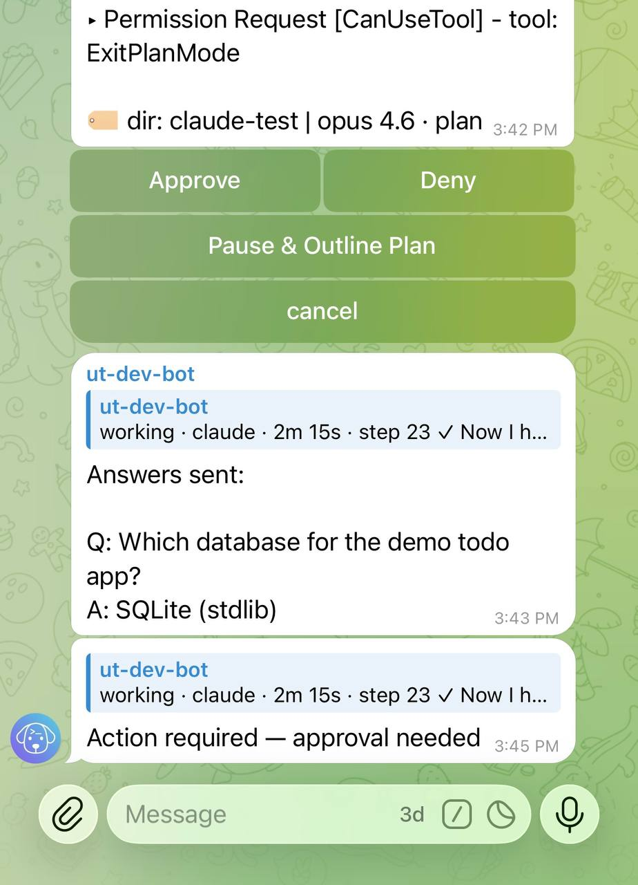
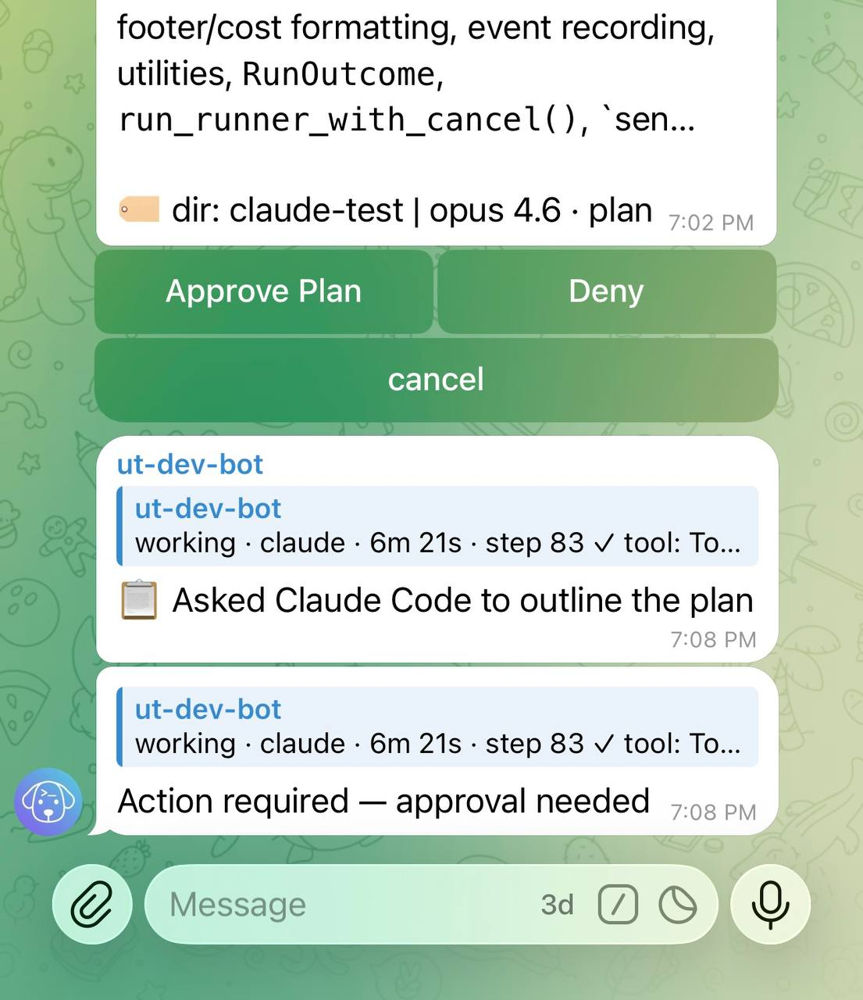

# Plan mode

When you're away from the terminal, you need confidence that your agent won't go off-script. Plan mode controls how Claude Code handles permission requests through Untether — require manual approval from your phone, auto-approve transitions, or let Claude Code run freely.

## Permission modes

| Mode | `/planmode` command | CLI flag | Behaviour |
|------|-------------------|----------|-----------|
| **Plan** | `/planmode on` | `--permission-mode plan` | All tool calls and plan transitions require Telegram approval |
| **Auto** | `/planmode auto` | `--permission-mode plan` | Tools are auto-approved; ExitPlanMode is also auto-approved (no buttons) |
| **Accept edits** | `/planmode off` | `--permission-mode acceptEdits` | No approval buttons — Claude Code runs without interruption |

**Plan** is the most interactive mode. You see every file edit, shell command, and plan transition as inline buttons.

**Auto** is the recommended default for most users. Tools run without interruption, but Claude Code still goes through a plan phase. ExitPlanMode is silently approved so you don't need to tap a button for every plan-to-execution transition.

**Accept edits** skips permission control entirely. Use this when you trust the agent to make changes autonomously.

## Setting the mode

Toggle per chat:

```
/planmode on       # enable plan mode
/planmode auto     # plan mode with auto-approved transitions
/planmode off      # disable plan mode
/planmode          # toggle: if currently on/auto, turn off; otherwise turn on
/planmode show     # show current mode
/planmode clear    # remove override, use engine config default
```

Mode is stored per chat and persists across sessions. New runs in the chat use the configured mode.

## "Pause & Outline Plan"

When Claude Code tries to exit plan mode (ExitPlanMode), you see three buttons instead of two:

- **Approve** — let Claude Code proceed to execution
- **Deny** — block and ask Claude Code to explain
- **Pause & Outline Plan** — require a written plan first

<div markdown>

!!! untether "Untether"
    ▸ Permission Request [CanUseTool] - tool: ExitPlanMode

<div class="tg-buttons">
<span class="tg-btn">Approve</span>
<span class="tg-btn">Deny</span>
<span class="tg-btn">Pause &amp; Outline Plan</span>
</div>

</div>



Tapping "Pause & Outline Plan" tells Claude Code to stop and write a comprehensive plan as a visible message in the chat. The plan must include:

1. Every file to be created or modified (full paths)
2. What changes will be made in each file
3. The order and phases of execution
4. Key decisions, trade-offs, and risks
5. The expected end result

This is useful when you want to review the approach before Claude Code starts making changes.

## Outline rendering

Outlines render as **formatted Telegram text** — headings, bold, code blocks, and lists display properly instead of raw markdown. This makes long outlines much easier to read on a phone.

For long outlines that span multiple messages, **Approve Plan / Deny buttons appear on the last message** so you don't need to scroll back up to find them. After you tap Approve or Deny, the outline messages and their notification are **automatically deleted**, keeping the chat clean.



<div markdown>

!!! untether "Untether"
    Here's my plan:

    1. **Read** `src/main.py` to understand current structure
    2. **Edit** `src/main.py` to refactor the `process()` function
    3. **Run** tests to verify no regressions

<div class="tg-buttons">
<span class="tg-btn">Approve Plan</span>
<span class="tg-btn">Deny</span>
</div>

</div>

## Progressive cooldown

After you tap "Pause & Outline Plan", the ExitPlanMode request is held open — Claude Code stays alive while you read the outline. A cooldown window prevents Claude Code from immediately retrying:

| Click count | Cooldown |
|-------------|----------|
| 1st | 30 seconds |
| 2nd | 60 seconds |
| 3rd | 90 seconds |
| 4th+ | 120 seconds (maximum) |

During the cooldown, any ExitPlanMode attempt is automatically denied, but **Approve Plan / Deny buttons** are shown in Telegram so you can approve the plan as soon as you've read it. The cooldown resets when you explicitly Approve or Deny.

This prevents the agent from bulldozing through when you've asked it to slow down and explain its approach, while still giving you a one-tap way to approve once you're satisfied.


<div markdown>

!!! untether "Untether"
    ▸ Plan outlined — approve to proceed

<div class="tg-buttons">
<span class="tg-btn">Approve Plan</span>
<span class="tg-btn">Deny</span>
</div>

</div>

## Related

- [Interactive approval](interactive-approval.md) — how approval buttons and diff previews work
- [Configuration](../reference/config.md) — setting default permission mode in `untether.toml`
