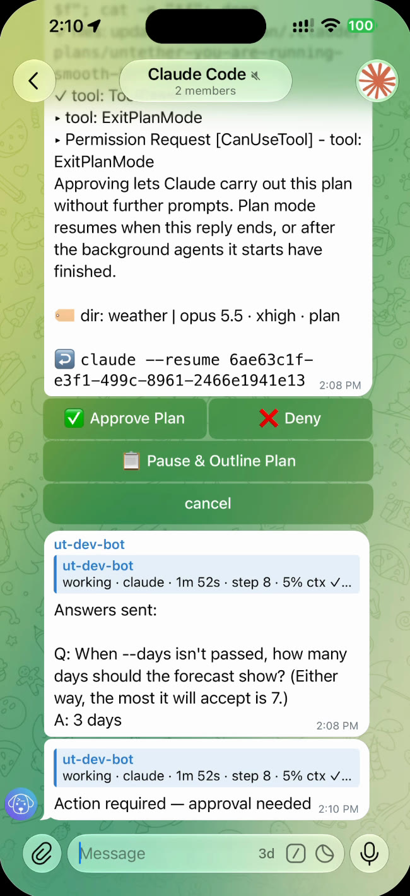
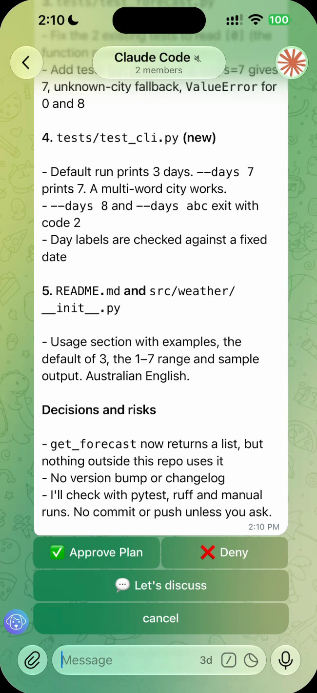
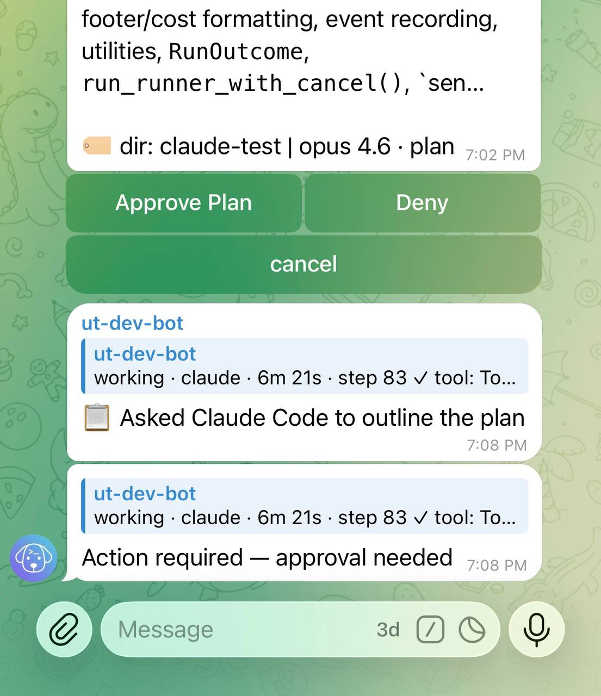

# Plan mode

When you're away from the terminal, you need confidence that your agent won't go off-script. Plan mode controls how Claude Code handles permission requests through Untether — require manual approval from your phone, auto-approve transitions, or let Claude Code run freely.

## Permission modes

| Mode | `/planmode` command | CLI flag | Behaviour |
|------|-------------------|----------|-----------|
| **Plan** | `/planmode on` | `--permission-mode plan` | All tool calls and plan transitions require Telegram approval |
| **Plan-auto** | `/planmode plan-auto` | `--permission-mode plan` | Tools are auto-approved; ExitPlanMode is also auto-approved (no buttons) |
| **Auto** | `/planmode auto` | `--permission-mode auto` | Claude Code's own auto mode — a classifier approves routine work and blocks risky actions. No plan phase |
| **Accept edits** | `/planmode off` | `--permission-mode acceptEdits` | No plan phase; file edits run freely, other actions ask for approval |

**Plan** is the most interactive mode. You see every file edit, shell command, and plan transition as inline buttons.

**Plan-auto** keeps the plan phase but approves the plan-to-execution transition for you, so you don't tap a button for every ExitPlanMode.

**Auto** hands the decision to Claude Code's own classifier rather than to Untether. Routine work — local edits, installing declared dependencies, read-only requests — runs without prompting, while risky actions are blocked: sending sensitive data to external endpoints, production deploys, force pushes, `rm -rf` on unresolvable targets. There's no plan phase at all. Questions the agent asks you still arrive as option buttons, and if the classifier blocks the same action repeatedly, Claude Code falls back to prompting you in Telegram.

**Accept edits** has no plan phase. Reads, file edits inside the project and common filesystem commands run without buttons; anything else (most shell commands, web fetches, MCP tools) shows Approve / Deny buttons unless your Claude Code `permissions.allow` rules already allow it. Before v0.35.5, Untether pre-approved `Bash`, `Read`, `Edit` and `Write` and approved everything else silently, so this mode never prompted ([#749](https://github.com/littlebearapps/untether/issues/749)). To keep the old hands-off behaviour, use **Plan-auto** or **Auto**, or add allow rules to your Claude Code settings.

!!! note "Renamed in v0.35.5"
    **Plan-auto** was called **auto** before v0.35.5. Claude Code introduced its own `auto` mode, and the two names collided — Untether's version shadowed it, so the real one was unreachable. Per-chat settings you made through `/planmode` or `/config` are migrated for you the first time v0.35.5 starts. If you set `permission_mode = "auto"` in `untether.toml` and want the old behaviour, change it to `"plan-auto"`; Untether logs a warning at startup (and on a config reload that changes the list) naming every place it sees the ambiguous value.

    Auto mode needs a recent model (Opus 4.6+, Sonnet 4.6+, or Fable 5) and an organisation that hasn't disabled it.

## Setting the mode

Toggle per chat:

```
/planmode on         # enable plan mode
/planmode plan-auto  # plan mode with auto-approved transitions
/planmode auto       # Claude Code's own classifier-gated auto mode
/planmode off        # disable plan mode
/planmode            # toggle: if currently on/plan-auto, turn off; otherwise turn on
/planmode show       # show current mode
/planmode clear      # remove override, use engine config default
```

Mode is stored per chat and persists across sessions. New runs in the chat use the configured mode.

## "Pause & Outline Plan"

When Claude Code tries to exit plan mode (ExitPlanMode), you see three buttons instead of two:

- **Approve Plan** — let Claude Code carry out the plan
- **Deny** — block and ask Claude Code to explain
- **Pause & Outline Plan** — require a written plan first

In a plan chat the request also says what approving does: *Approving lets Claude carry out this plan without further prompts. Plan mode resumes when this reply ends, or after the background agents it starts have finished.* In a chat where Claude Code switched to plan mode on its own (`/planmode off`), it reads *Approving ends planning; Claude still asks before each action.*

<div markdown>

!!! untether "Untether"
    ▸ Permission Request [CanUseTool] - tool: ExitPlanMode<br>
    Approving lets Claude carry out this plan without further prompts. Plan mode resumes when this reply ends, or after the background agents it starts have finished.

<div class="tg-buttons">
<span class="tg-btn">Approve Plan</span>
<span class="tg-btn">Deny</span>
<span class="tg-btn">Pause &amp; Outline Plan</span>
</div>

</div>



Tapping "Pause & Outline Plan" tells Claude Code to stop and write a comprehensive plan as a visible message in the chat. The plan must include:

1. Every file to be created or modified (full paths)
2. What changes will be made in each file
3. The order and phases of execution
4. Key decisions, trade-offs, and risks
5. The expected end result

This is useful when you want to review the approach before Claude Code starts making changes.

## Outline rendering

Outlines render as **formatted Telegram text** — headings, bold, code blocks, and lists display properly instead of raw markdown. This makes long outlines much easier to read on a phone.

For long outlines that span multiple messages, **Approve Plan / Let's discuss / Deny buttons appear on the last message** so you don't need to scroll back up to find them. After you act, the outline messages and their notification are **automatically deleted**, keeping the chat clean.



<div markdown>

!!! untether "Untether"
    Here's my plan:

    1. **Read** `src/main.py` to understand current structure
    2. **Edit** `src/main.py` to refactor the `process()` function
    3. **Run** tests to verify no regressions

<div class="tg-buttons">
<span class="tg-btn">Approve Plan</span>
<span class="tg-btn">Deny</span>
</div>
<div class="tg-buttons">
<span class="tg-btn">Let's discuss</span>
</div>

</div>

- Tap **Approve Plan** to let Claude Code proceed with implementation
- Tap **Deny** to stop Claude Code and provide different direction
- Tap **Let's discuss** to talk about the plan before deciding — Claude Code will ask what you'd like to change and wait for your reply

## The outline gate

After you tap "Pause & Outline Plan", Untether gates ExitPlanMode until it has a readable outline to show you:

- On current Claude Code CLIs the plan body arrives with the ExitPlanMode call itself, so the very next attempt is **held open** — the plan is posted to the chat and Claude Code stays alive while you read it.
- If Claude Code retries **without** providing an outline (no plan body and no substantial chat text), the attempt is automatically denied with an instruction to write the outline first.

Either way, **Approve Plan / Let's discuss / Deny buttons** appear in Telegram so you can act as soon as you've read the outline. This keeps the agent from bulldozing through when you've asked it to slow down and explain its approach, while still giving you a one-tap way to approve once you're satisfied.

*(Earlier versions also enforced a 30–120s escalating cooldown here — a workaround for a Claude Code v2.1.72-2.1.74 retry loop that was fixed upstream and retired in v0.35.4.)*



<div markdown>

!!! untether "Untether"
    ▸ Plan outlined — approve to proceed

<div class="tg-buttons">
<span class="tg-btn">Approve Plan</span>
<span class="tg-btn">Deny</span>
</div>
<div class="tg-buttons">
<span class="tg-btn">Let's discuss</span>
</div>

</div>

## Auto-approval after plan approval

A plan approval covers the reply it was given in. Once you approve a plan, whether directly or with **Approve Plan** after an outline, the Edit, Write and Bash calls in the rest of that reply skip their per-tool diff previews. You have already reviewed the plan, so asking again for each tool would be redundant.

The approval ends with that reply. Claude Code keeps its process open after replying, so background jobs can report back and your next message goes straight in. Before v0.35.5 an approval carried on through every later message in that process, for up to four hours. Now:

- your next message, and any background wake-up, gets per-tool approvals again ([#383](https://github.com/littlebearapps/untether/issues/383));
- an **Approve Plan** tapped after an outline also covers your *next* message, so "outline → Approve Plan → go ahead" still needs only one tap. The second message after it asks again;
- **plan mode resumes when the reply ends.** Approving a plan takes Claude Code out of plan mode, and an open session used to stay out of it. Untether now switches it back when the reply ends, so your next message is planned again, and in a `plan` chat so is a background job's wake-up (a finished background task, a Monitor line, a scheduled wake-up): if it wants to act, you get a new plan to approve. In a `plan-auto` chat your messages are re-planned (and approved for you) but wake-ups aren't, since planning them would add cost and no check.

- **background agents the approved reply starts finish the job unplanned.** A background agent follows the session's mode, so switching back to plan mode under it would tell it to stop and plan halfway through the work you approved. Untether waits instead: plan mode comes back once those agents have finished (or have shown no activity for the background hold, `post_result_bg_max_hold`, 30 minutes by default). Anything that runs in the meantime, such as a message you send or another background job reporting back, is not re-planned, and its reply starts with *⚠️ Not re-planned: the approved plan's background agents are still running. Plan mode resumes when they finish.* Agents started by a later reply don't extend the wait.

One limit. A wake-up that starts the very moment the reply ends (or the moment the approved agents finish) can take its first step before plan mode is back; it is planned from its next step.

To turn the switch-back off, set `rearm_plan_mode = false` under `[watchdog]` in `untether.toml` (read at each new session). An approval then lasts until the session closes, as before v0.35.5.

## The plan in the final message

Untether deletes the plan messages once you tap a button. If Claude Code then finishes with only a short reply, Untether adds the plan to the top of the final message under **📋 Plan (approved):** so you still have it on your phone.

Only a plan you actually approved gets that header. That means you tapped Approve, `plan-auto` approved it for you, or you tapped Approve Plan after an outline. A plan you denied is never shown there, and neither is one that timed out. **Pause & Outline Plan** and **Let's discuss** don't reject the plan, so if you approve the same plan after the outline or the discussion, it is shown as usual.

Claude Code keeps the plan in a plan file and also sends a copy with its plan request. When it writes the file and asks for approval in the same step, that copy can still hold the *previous* plan. Untether takes the plan from the file instead, so the plan under the header is the one you approved. If Claude Code doesn't use a plan file and the copy matches a plan you denied, Untether leaves the plan out rather than label the denied text as approved ([#793](https://github.com/littlebearapps/untether/issues/793)).

## Per-cron override (scheduled runs) {#cron-override}

When a scheduled cron fires into a plan-mode chat, the default behaviour is to inherit the chat's plan mode — which means the cron run pauses for an approval nobody's awake to give. Set `permission_mode` on the cron itself to override just that run:

```toml
[[triggers.crons]]
id = "daily-summary"
schedule = "0 8 * * *"
chat_id = -1001234567890
engine = "claude"
prompt = "Post yesterday's key events."
permission_mode = "auto"        # or "plan-auto"
```

For unattended crons, `auto` is usually the better choice: Claude Code's classifier judges each action on its own terms and blocks risky ones, whereas `plan-auto` waves through the plan gate and then lets the rest of the run proceed unchecked. Use `plan-auto` when you specifically want the plan phase — for example so the plan itself gets posted to the chat for you to read later.

!!! warning "`auto` changed meaning in v0.35.5"
    Before v0.35.5, `permission_mode = "auto"` on a cron meant plan mode with the plan gate auto-approved. It now selects Claude Code's own auto mode. Existing crons keep working but behave differently — set `"plan-auto"` to restore the previous behaviour. Untether logs one warning at startup, and again if a config reload changes the list, naming every engine setting and cron that uses `"auto"`. It also warns at startup about crons set to `default`, `manual`, `acceptEdits` or `plan`, which wait for a tap nobody gives, and logs the same warning when a cron or webhook fires into a chat whose mode will ask for approval.

Precedence: cron `permission_mode` > per-chat `/planmode` > engine config default. The rest of the chat's interactive traffic continues to honour plan mode. See [Schedule tasks — Autonomous crons](schedule-tasks.md#autonomous-crons) for the full reference.

## Related

- [Interactive approval](interactive-approval.md) — how approval buttons and diff previews work
- [Schedule tasks](schedule-tasks.md#autonomous-crons) — per-cron permission override
- [Configuration](../reference/config.md) — setting default permission mode in `untether.toml`
