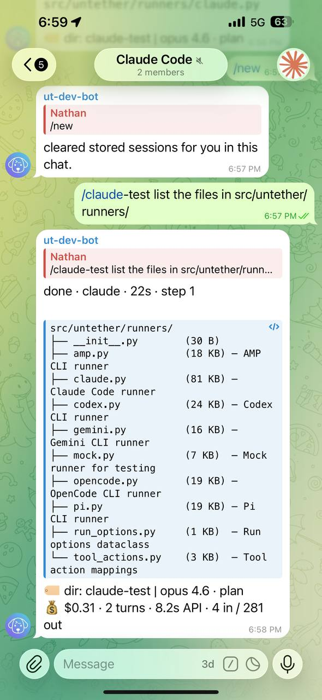

# Route by chat

Bind a Telegram chat to a project so messages in that chat automatically route to the right repo.

## Capture a chat id and save it to a project

Run:

```sh
untether chat-id --project happy-gadgets
```

Then send any message in the target chat. Untether captures the `chat_id` and updates your config:

=== "untether config"

    ```sh
    untether config set projects.happy-gadgets.path "~/dev/happy-gadgets"
    untether config set projects.happy-gadgets.chat_id -1001234567890
    ```

=== "toml"

    ```toml
    [projects.happy-gadgets]
    path = "~/dev/happy-gadgets"
    chat_id = -1001234567890
    ```

Messages from that chat now default to the project.

{ loading=lazy }

!!! user "You"
    fix the failing tests

!!! untether "Untether"
    done · codex · 8s · step 3

    Fixed the two failing assertions in test_auth.py…

    dir: happy-gadgets<br>
    `codex resume abc123`

## Rules for chat ids

- Each `projects.*.chat_id` must be unique.
- A project `chat_id` must not match `transports.telegram.chat_id`.
- Telegram uses positive IDs for private chats and negative IDs for groups/supergroups.

## Capture a chat id without saving

```sh
untether chat-id
```

## Related

- [Topics](topics.md)
- [Context resolution](../reference/context-resolution.md)
