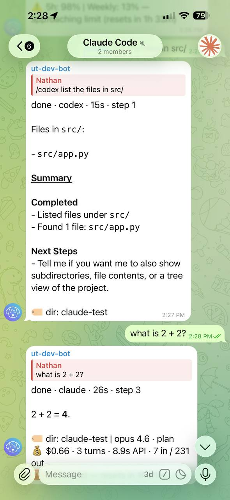

# Switch engines

Different tasks suit different agents. Switch engines on the fly — use Claude Code for deep refactors, Codex for quick fixes — without restarting or reconfiguring anything.

## Use an engine for one message

Prefix the first non-empty line with an engine directive:

```
/codex hard reset the timeline
/claude shrink and store artifacts forever
/opencode hide their paper until they reply
/pi render a diorama of this timeline
/gemini analyse the codebase architecture
/amp review recent changes
```

Directives are only parsed at the start of the first non-empty line.

!!! untether "Untether"
    working · codex · 5s · step 1

    ✓ Read `src/timeline.py`

    🏷 codex



## Set a default engine for the current scope

Use `/agent`:

```
/agent
/agent set claude
/agent clear
```

- Inside a forum topic, `/agent set` affects that topic.
- In normal chats, it affects the whole chat.
- In group chats, only admins can change defaults.

Selection precedence (highest to lowest): resume token → `/<engine-id>` directive → topic default → chat default → project default → global default.

## Engine installation

Untether shells out to engine CLIs. Install them and make sure they’re on your `PATH`
(`codex`, `claude`, `opencode`, `pi`, `gemini`, `amp`). Authentication is handled by each CLI.

## Feature differences

Not all features are available on every engine. See the [engine compatibility matrix](https://github.com/littlebearapps/untether#engine-compatibility) in the README for a full breakdown of which features (interactive permissions, plan mode, reasoning levels, etc.) each engine supports.

## Related

- [Commands & directives](../reference/commands-and-directives.md)
- [Config reference](../reference/config.md)
- [Multi-engine workflows](../tutorials/multi-engine.md) — tutorial on using multiple engines
