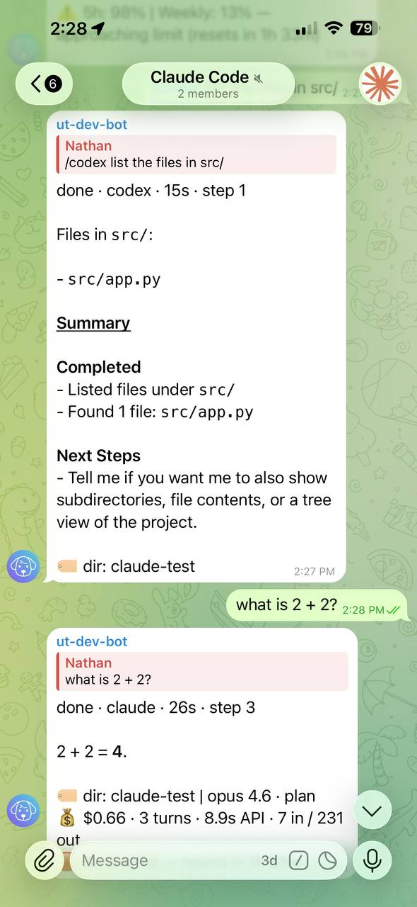

# Switch engines

Different tasks suit different agents. Switch engines on the fly — use Claude Code for deep refactors, Codex for quick fixes — without restarting or reconfiguring anything.

## Use an engine for one message

Prefix the first non-empty line with an engine directive:

```
/codex hard reset the timeline
/claude shrink and store artifacts forever
/opencode hide their paper until they reply
/pi render a diorama of this timeline
/antigravity sketch the timeline as a table
```

Directives are only parsed at the start of the first non-empty line.

!!! untether "Untether"
    working · codex · 5s · step 1

    ✓ Read `src/timeline.py`

    🏷 codex



## Set a default engine for the current scope

Use `/agent`:

```
/agent
/agent set claude
/agent clear
```

- Inside a forum topic, `/agent set` affects that topic.
- In normal chats, it affects the whole chat.
- In group chats, only admins can change defaults.

Selection precedence (highest to lowest): resume token → `/<engine-id>` directive → topic default → chat default → project default → global default.

## Engine installation

Untether shells out to engine CLIs. Install them and make sure they’re on your `PATH`
(`codex`, `claude`, `opencode`, `pi`, `agy`). Authentication is handled by each CLI. For OpenCode, install the 1.x CLI (`npm install -g opencode-ai@1`): OpenCode 2.x (`@opencode/cli`) isn't supported yet, and Untether refuses a run on it before anything starts ([#970](https://github.com/littlebearapps/untether/issues/970)).

!!! warning "Deprecated engines"

    The `gemini` and `amp` directives still work, but both engines are
    **deprecated and no longer supported**: they are still included, but get
    no fixes, are excluded from testing, and may be removed in a future
    release. Gemini CLI no longer authenticates individual or free Google
    accounts (upstream end-of-life, 18 June 2026, [announcement](https://developers.googleblog.com/an-important-update-transitioning-gemini-cli-to-antigravity-cli/) — use [Antigravity CLI](https://antigravity.google) instead;
    Untether supports it as its own `antigravity` engine, see [below](#antigravity-cli)),
    and Untether's Amp integration is unmaintained. `/config` → **Engine & model**
    marks both with ⚠️; they can still be selected. See
    [deprecated engines](https://github.com/littlebearapps/untether#deprecated-engines)
    in the README.

## Antigravity CLI

Antigravity CLI (`agy`) is Google's successor to Gemini CLI. Untether supports agy 1.3.1 or newer as the
`antigravity` engine ([#558](https://github.com/littlebearapps/untether/issues/558)).

!!! warning "Read this before using Antigravity with a Google account sign-in"
    Google's [Antigravity terms](https://antigravity.google/terms) say: "Using third party software, tools, or
    services to access the Service (e.g. using OpenClaw with Antigravity OAuth) is a breach of this Agreement. Such
    actions may be grounds for suspension or termination of your Antigravity and/or Gemini CLI accounts." The
    [Antigravity FAQ](https://antigravity.google/docs/faq) recommends "a Gemini Enterprise or Google AI Studio API
    key" for third-party coding agents.

    Untether runs Google's own `agy` binary on your machine and never reads or reuses your Google credentials, but it
    is still third-party software driving the CLI, and Google does block accounts. **We recommend a Gemini API key or
    an Enterprise sign-in.** If you use a Google account sign-in anyway, you accept that risk for that account. This
    isn't legal advice. The full quotes are in the
    [Antigravity runner reference](../reference/runners/antigravity/runner.md).

**1. Install agy** on the machine that runs Untether:

```sh
curl -fsSL https://antigravity.google/cli/install.sh | bash
```

**2. Choose how agy signs in.** Untether never signs in for you.

- **Gemini API key (recommended).** Add `"modelProvider": "gemini"` to agy's settings file
  (`~/.gemini/antigravity-cli/settings.json`) and put `GEMINI_API_KEY` in Untether's environment. You need both:
  the key alone does nothing. Google bills this per token.
- **Gemini Enterprise / Google Cloud (recommended).** Set `AGY_ADC_AUTH=true`, `GOOGLE_CLOUD_QUOTA_PROJECT` and
  `GOOGLE_CLOUD_LOCATION` in Untether's environment, with Application Default Credentials on the host.
- **Google account.** Run `agy` once in a terminal on the host and finish the sign-in. Read the warning above
  first. In chats that use this route, Untether adds a one-time notice to the first Antigravity answer.

**3. Give the chat a project.** Antigravity edits files in its working directory, so Untether won't run it without
one. Bind the chat with `/ctx set <project>` or use a chat that already routes to a project.

**4. Select it:** `/agent set antigravity`, or `/antigravity <prompt>` for one message.

**5. Pick a permission mode** in `/config` → **Permission mode**. The default, **Workspace**, lets Antigravity edit
files in the project but blocks its shell, web and MCP calls; **Full access** approves everything. See
[Antigravity CLI — Permission mode](interactive-approval.md#antigravity-cli-permission-mode).

Not available for Antigravity yet: approval buttons, plan approval, question buttons, `/steer` and live sessions.
If something goes wrong, see [Troubleshooting](troubleshooting.md#antigravity-cli).

## Feature differences

Not all features are available on every engine. See the [engine compatibility matrix](https://github.com/littlebearapps/untether/blob/master/docs/reference/runners/index.md) for a full breakdown of which features (interactive permissions, plan mode, reasoning levels, etc.) each engine supports.

## Related

- [Commands & directives](../reference/commands-and-directives.md)
- [Config reference](../reference/config.md)
- [Multi-engine workflows](../tutorials/multi-engine.md) — tutorial on using multiple engines
