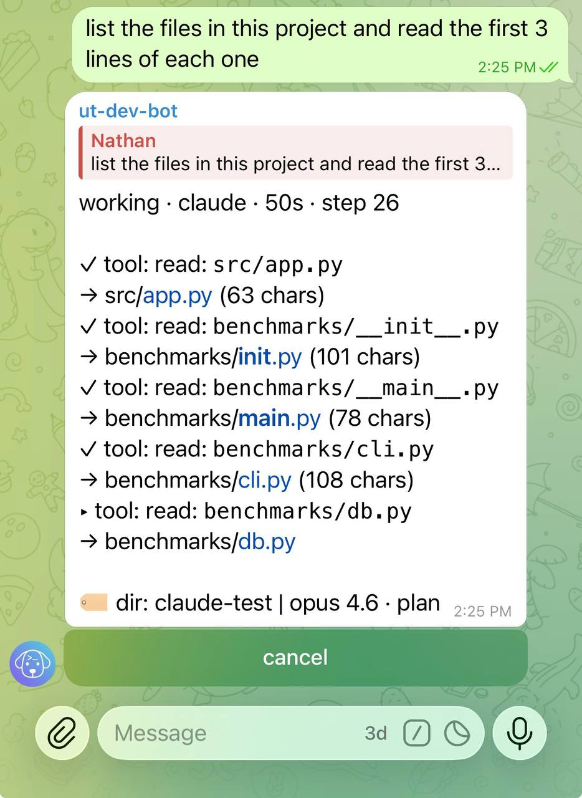

# Verbose progress mode

Untether shows progress messages as the agent works, updating in real time. Control how much detail you see — from compact summaries to full tool details — so you can follow along from your phone or get a quick glance from [Telegram](https://telegram.org) on any device.

## Enable verbose mode

Send `/verbose on` to see full details for each action:

```
/verbose on
```

In verbose mode, progress messages include file paths, command text, glob patterns, and other tool-specific details alongside the action status.

## Compact mode

Send `/verbose off` to switch back to compact summaries:

```
/verbose off
```

Compact mode shows only the action status and title — no extra detail. This is the default.

## Compare the two

Here's the same action shown in both modes:

!!! note "Compact"
    ```
    ...tool: edit: Update import order
    ```

!!! note "Verbose"
    ```
    ...tool: edit: Update import order
       file: src/untether/runner_bridge.py
       - from untether.events import EventFactory
       + from untether.events import EventFactory, StartedEvent
    ```

Verbose mode adds context lines underneath each action, so you can see exactly what the agent is doing without waiting for the final answer.



## Set global default in config

To make verbose the default for all chats:

=== "untether config"

    ```sh
    untether config set progress.verbosity "verbose"
    ```

=== "toml"

    ```toml title="~/.untether/untether.toml"
    [progress]
    verbosity = "verbose"  # verbose | compact
    ```

## Adjust max action lines

Control how many actions appear in the progress message. Actions beyond this limit are collapsed:

=== "untether config"

    ```sh
    untether config set progress.max_actions 10
    ```

=== "toml"

    ```toml title="~/.untether/untether.toml"
    [progress]
    max_actions = 10  # 0-50, default 5
    ```

Set to `0` to hide the action list entirely, or increase it to see more history.

!!! tip "Hot-reload"
    `[progress]` settings (`verbosity`, `max_actions`, `heartbeat_interval`, `min_render_interval`, `group_chat_rps`) hot-reload — editing them in `untether.toml` applies on the next run without restart ([#269](https://github.com/littlebearapps/untether/issues/269)).

## Long-running tool tail (heartbeat)

Long-running tool calls (Bash, BashOutput, ScheduleWakeup, Monitor, KillShell, …) get an automatic elapsed-time tail on the progress message after ~60 s — `▸ Bash · 3m 47s · npm run build` — so a glancing user can answer "is it alive? what's it doing? for how long?" without waiting for the next JSONL event ([#481](https://github.com/littlebearapps/untether/issues/481)). The tail appears regardless of `/verbose` state.

In **verbose** mode the tool's `format_verbose_detail` line additionally renders:

- `BashOutput` — the last line of `result_preview` (so 10-min Cloudflare deploy polls show `→ Deploy Production: in_progress` instead of a static `▸ BashOutput`)
- `ScheduleWakeup` — countdown + reason: `→ fires in 4m 12s · "build check"`
- `Monitor` — countdown remaining
- `KillShell` — target shell id

Tune the heartbeat tick via `[progress] heartbeat_interval` (5–120 s, default 30 s) — every tick walks the open-action set and forces a re-render whenever any action is older than 60 s. Strict "rolling stdout sub-line every 5 s" cannot be achieved without upstream Claude Code changes; the BashOutput-polling path is the proxy and refreshes at each polling cycle (~15 s in practice).

## Per-chat override

The `/verbose` toggle overrides the global config for the current chat. This override persists until you clear it or restart Untether.

## Clear override

Remove the per-chat setting to revert to the global config value:

```
/verbose clear
```

## Related

- [Configuration](../reference/config.md) — full config reference for progress settings
- [Chat sessions](chat-sessions.md) — session management and per-chat state
