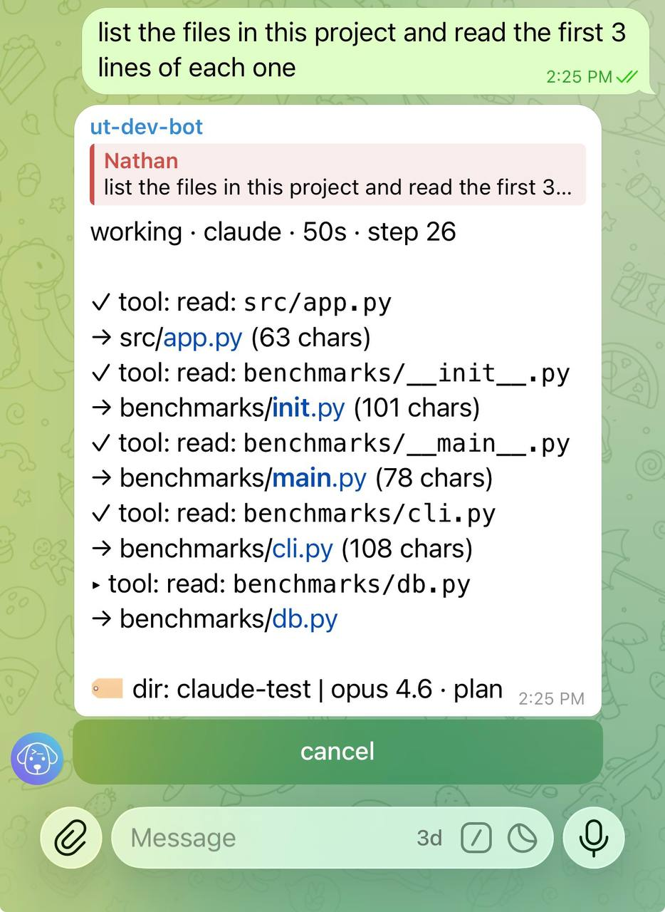

# Verbose progress mode

Untether shows progress messages as the agent works, updating in real time. Control how much detail you see — from compact summaries to full tool details — so you can follow along from your phone or get a quick glance from [Telegram](https://telegram.org) on any device.

## Enable verbose mode

Send `/verbose on` to see full details for each action:

```
/verbose on
```

In verbose mode, progress messages include file paths, command text, glob patterns, and other tool-specific details alongside the action status.

## Compact mode

Send `/verbose off` to switch back to compact summaries:

```
/verbose off
```

Compact mode shows only the action status and title — no extra detail. This is the default.

## Compare the two

Here's the same action shown in both modes:

!!! note "Compact"
    ```
    ...tool: edit: Update import order
    ```

!!! note "Verbose"
    ```
    ...tool: edit: Update import order
       file: src/untether/runner_bridge.py
       - from untether.events import EventFactory
       + from untether.events import EventFactory, StartedEvent
    ```

Verbose mode adds context lines underneath each action, so you can see exactly what the agent is doing without waiting for the final answer.



## Read the status line

The first line of every progress message and final answer is the status line:

```
done · claude · 1m 36s · step 10 · 62% ctx
```

It shows the state (`working`, `done`, `error`, `cancelled`), the engine, the elapsed time, the number of steps so far and, for Claude, how full the context window is (`62% ctx`). The context value appears once Claude's context window is known — at the latest by the final of the first run on a model after a restart — and disappears after a compaction until Claude's next response. It reads a little lower than `/context` in the terminal while Claude is working through tool calls. Turn it off with `[progress] show_context_usage = false`.

When Claude compacts its context, the progress message shows one row for it (a single step):

```
▸ 🗜️ Compacting context…
🗜️ Context compacted · 182k → 41k tokens (auto)
```

Completed status rows that start with their own emoji (🗜️, ⚠️, ⏳, 🛡️, ↪️, ℹ️) show that emoji instead of a ✓, so a warning never reads as a finished step ([#868](https://github.com/littlebearapps/untether/issues/868)).

`(auto)` is Claude compacting on its own as the window fills. `(manual)` is a `/compact` you sent as a follow-up while the session was still live, and that reply's body is the same `🗜️ Context compacted …` line. A failed compaction shows `🗜️ Compaction failed · <reason>`. Compaction counts as activity, not as a stall.

Other rows a Claude run can show, all new in v0.35.5:

| Row | Meaning |
|---|---|
| `🔁 API error 529 (overloaded) — retrying in 8s (attempt 2/10)` | Claude Code is backing off before retrying the API; see [Troubleshooting → Rate-limit and API-retry notes](troubleshooting.md#rate-limit-and-api-retry-notes-claude) |
| `⚠️ 5h limit 85% used — resets 17:30` | Heads-up that your subscription window is nearly used |
| `↪️ steer received: …` | A message you [steered](steer-follow-ups.md) into the run was read |
| `🛡️ … safeguards stopped a response · …` | Anthropic's safeguards stopped a response; see [Troubleshooting](troubleshooting.md#safeguards-stopped-a-response) |
| `↪️ Switched model … → …` | Claude Code switched to its fallback model for this turn |

## Set global default in config

To make verbose the default for all chats:

=== "untether config"

    ```sh
    untether config set progress.verbosity "verbose"
    ```

=== "toml"

    ```toml title="~/.untether/untether.toml"
    [progress]
    verbosity = "verbose"  # verbose | compact
    ```

## Adjust max action lines

Control how many actions appear in the progress message. Actions beyond this limit are collapsed:

=== "untether config"

    ```sh
    untether config set progress.max_actions 10
    ```

=== "toml"

    ```toml title="~/.untether/untether.toml"
    [progress]
    max_actions = 10  # 0-50, default 5
    ```

Set to `0` to hide the action list entirely, or increase it to see more history.

!!! tip "Hot-reload"
    `[progress]` settings (`verbosity`, `max_actions`, `heartbeat_interval`, `min_render_interval`, `group_chat_rps`, `show_background_tasks`, `background_tasks_max_rows`, `consolidate_wake_turns`, `show_context_usage`) hot-reload — editing them in `untether.toml` applies on the next run without restart ([#269](https://github.com/littlebearapps/untether/issues/269)). Since v0.35.5 `verbosity`, `max_actions` and `show_context_usage` also reach the next turn of a Claude session that is still open ([#863](https://github.com/littlebearapps/untether/issues/863)).

## Long-running tool tail (heartbeat)

Long-running tool calls (Bash, BashOutput, ScheduleWakeup, Monitor, KillShell, …) get an automatic elapsed-time tail on the progress message after ~60 s — `▸ Bash · 3m 47s · npm run build` — so a glancing user can answer "is it alive? what's it doing? for how long?" without waiting for the next JSONL event ([#481](https://github.com/littlebearapps/untether/issues/481)). The tail appears regardless of `/verbose` state.

In **verbose** mode the tool's `format_verbose_detail` line additionally renders:

- `BashOutput` — the last line of `result_preview` (so 10-min Cloudflare deploy polls show `→ Deploy Production: in_progress` instead of a static `▸ BashOutput`)
- `ScheduleWakeup` — countdown + reason: `→ fires in 4m 12s · "build check"`
- `Monitor` — countdown remaining
- `KillShell` — target shell id

Tune the heartbeat tick via `[progress] heartbeat_interval` (5–120 s, default 30 s) — every tick walks the open-action set and forces a re-render whenever any action is older than 60 s. Strict "rolling stdout sub-line every 5 s" cannot be achieved without upstream Claude Code changes; the BashOutput-polling path is the proxy and refreshes at each polling cycle (~15 s in practice).

## Background tasks (Claude)

When Claude launches background work — a background `Agent`, `Bash run_in_background`, or a `Monitor` — Untether shows it live, using the task events Claude Code already reports ([#777](https://github.com/littlebearapps/untether/issues/777)).

**While the run is working**, the progress message gets a block below the action lines, one row per running background task:

```
⏳ background (2)
🤖 verifier · 3m12s · 52k tok · 7 tools · Running tests
🐚 gh run watch · 1m05s
```

Agents (🤖) show elapsed time, tokens, tool calls and the current step; shell tasks and Monitors (🐚) show elapsed time. Only background work is listed — a subagent's own tool calls are not, and a subagent's background task is folded into its agent's row until that agent ends (then it gets its own row, since it still keeps the session open). "tok" counts tokens (it includes cached and system-prompt tokens), not cost. The block refreshes with the progress message and on the heartbeat tick.

**After Claude answers**, if background work is still running, Untether sends one silent status message replying to the prompt that launched it and edits it in place — at most every 30 s, sooner when a task finishes:

```
⏳ background (1) · 1 done
🤖 verifier · 4m02s · 58k tok · 9 tools · Running tests
✅ gh run watch · 1m40s
```

When the last task finishes the message is finalised (`✅ all 2 background tasks done`, with ❌ failed / ⏹️ stopped rows where relevant). If the session closes first — `/cancel`, `/new`, the background hold limit, a restart — the remaining rows are marked ⏹️ stopped with the reason, so the message never keeps saying "running". Claude's own report on a finished task still arrives as a normal message. `/ping` shows `⏳ background: N tasks running` for the chat while any are live.

### Quiet acknowledgements

Claude often answers each background task finishing with a one-liner — "the lint sweep is back, waiting on the others" — and the CLI tends to answer the same finish twice. With `consolidate_wake_turns` on (the default), those short replies don't arrive as separate pushed messages: they are added, in full, under the task's row in the status message, which is edited silently ([#785](https://github.com/littlebearapps/untether/issues/785)):

```
⏳ background (1) · 1 done
🤖 sweep two · 2m40s · 61k tok · 12 tools · Running checks
✅ sweep one · 1m55s · 48k tok
   ↳ Sweep one is back; waiting on sweep two.
```

A wake turn still arrives as its own message when it runs a tool (up to three `Read` / `Glob` / `Grep` calls to collect a result don't count — [#813](https://github.com/littlebearapps/untether/issues/813)), asks for an approval or a question, writes more than ~300 characters, fails, or finishes the last running task (normally Claude's compiled report) — so each batch of background work still gets the push you're waiting for, once. If every reply in a batch folded, a short pushed `✅ all N background tasks done` notice arrives when the last task ends. A short reply to a Monitor tick or a `ScheduleWakeup` that fired with nothing new folds the same way (shown as a 💬 line).

=== "toml"

    ```toml title="~/.untether/untether.toml"
    [progress]
    show_background_tasks = true      # default true
    background_tasks_max_rows = 5     # 1-20; "+N more" beyond it
    consolidate_wake_turns = true     # default true; false = one message per wake turn
    ```

## Per-chat override

The `/verbose` toggle overrides the global config for the current chat. This override persists until you clear it or restart Untether.

## Clear override

Remove the per-chat setting to revert to the global config value:

```
/verbose clear
```

## Related

- [Configuration](../reference/config.md) — full config reference for progress settings
- [Chat sessions](chat-sessions.md) — session management and per-chat state
