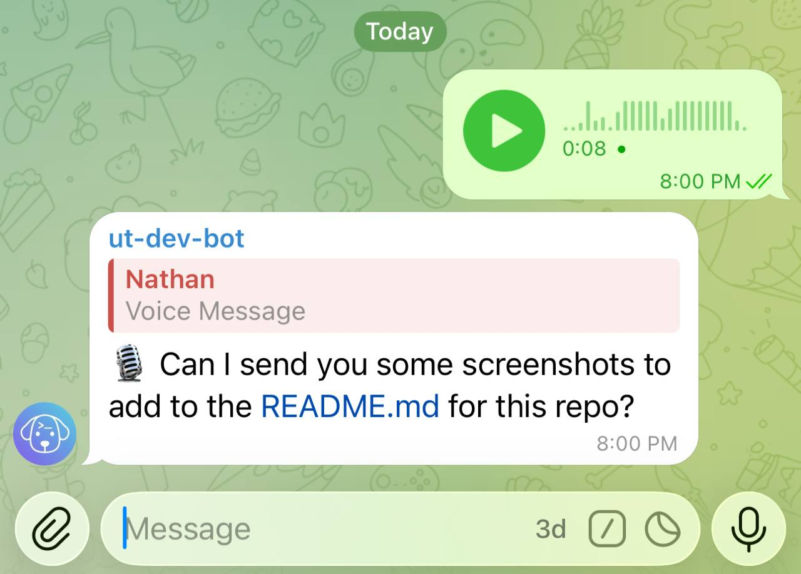

# Voice notes

Dictate coding tasks hands-free — while walking, driving, or away from a keyboard. Untether transcribes your Telegram voice notes via a Whisper-compatible endpoint and runs them as normal text prompts.

## Enable transcription

=== "untether config"

    ```sh
    untether config set transports.telegram.voice_transcription true
    untether config set transports.telegram.voice_transcription_model "gpt-4o-mini-transcribe"

    # local OpenAI-compatible transcription server (optional)
    untether config set transports.telegram.voice_transcription_base_url "http://localhost:8000/v1"
    untether config set transports.telegram.voice_transcription_api_key "local"
    untether config set transports.telegram.voice_transcription_language "en"
    ```

=== "toml"

    ```toml
    [transports.telegram]
    voice_transcription = true
    voice_transcription_model = "gpt-4o-mini-transcribe" # optional
    voice_transcription_base_url = "http://localhost:8000/v1" # optional
    voice_transcription_api_key = "local" # optional
    voice_transcription_url_allowlist = ["127.0.0.0/8"] # required for a loopback/private endpoint (see below)
    voice_transcription_language = "en" # optional ISO-639-1 hint — stops wrong-language guesses on short notes
    ```

Set `OPENAI_API_KEY` in your environment (or `voice_transcription_api_key` in config).

To use a local OpenAI-compatible Whisper server, set `voice_transcription_base_url`
(and `voice_transcription_api_key` if the server expects one). This keeps engine
requests on their own base URL without relying on `OPENAI_BASE_URL`. If your server
requires a specific model name, set `voice_transcription_model` (for example,
`whisper-1`).

!!! warning "Local/private endpoints need an allowlist (v0.35.4+)"
    Since v0.35.4 the transcription base URL is SSRF-validated ([#381](https://github.com/littlebearapps/untether/issues/381)) — a loopback or private-network host (like `http://localhost:8000/v1`) is **rejected** to stop a misconfigured URL exfiltrating voice audio to an internal service. To use a local Whisper server, opt it back in with a CIDR/IP allowlist:

    ```toml
    voice_transcription_url_allowlist = ["127.0.0.0/8"]   # or your private range, e.g. an Azure private-link CIDR
    ```

    The default public path (`api.openai.com`, i.e. `base_url` unset) skips validation and needs no allowlist.

!!! tip "Hot-reload"
    Voice transcription settings (`voice_transcription`, model, base URL, API key) can be toggled by editing `untether.toml` — changes take effect immediately without restarting (requires `watch_config = true`).

## Behavior

When you send a voice note, Untether transcribes it and runs the result as a normal text message.
If transcription fails, you’ll get an error message and the run is skipped.

!!! user "You"
    🎤 *(voice note — 0:12)*

!!! untether "Untether"
    📝 *"Add error handling to the upload function and make sure it retries on timeout"*

    working · claude · 0s

    ▸ Read `src/upload.py`



## Related

- [Config reference](../reference/config.md)
