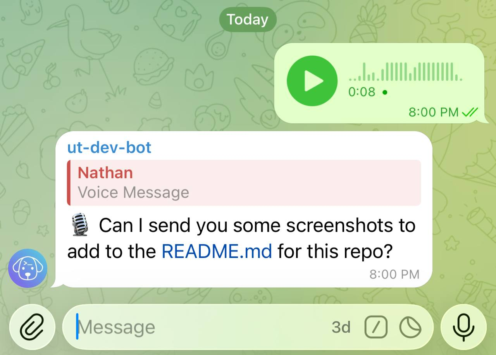

# Voice notes

Dictate coding tasks hands-free — while walking, driving, or away from a keyboard. Untether transcribes your Telegram voice notes via a Whisper-compatible endpoint and runs them as normal text prompts.

## Enable transcription

=== "untether config"

    ```sh
    untether config set transports.telegram.voice_transcription true
    untether config set transports.telegram.voice_transcription_model "gpt-4o-mini-transcribe"

    # local OpenAI-compatible transcription server (optional)
    untether config set transports.telegram.voice_transcription_base_url "http://localhost:8000/v1"
    untether config set transports.telegram.voice_transcription_api_key "local"
    untether config set transports.telegram.voice_transcription_url_allowlist '["127.0.0.0/8"]'
    untether config set transports.telegram.voice_transcription_language "en"
    ```

=== "toml"

    ```toml
    [transports.telegram]
    voice_transcription = true
    voice_transcription_model = "gpt-4o-mini-transcribe" # optional
    voice_transcription_base_url = "http://localhost:8000/v1" # optional
    voice_transcription_api_key = "local" # optional
    voice_transcription_url_allowlist = ["127.0.0.0/8"] # required for a loopback/private endpoint (see below)
    voice_transcription_language = "en" # optional ISO-639-1 hint — stops wrong-language guesses on short notes
    ```

Set `OPENAI_API_KEY` in your environment (or `voice_transcription_api_key` in config).

To use a local OpenAI-compatible Whisper server, set `voice_transcription_base_url`
(and `voice_transcription_api_key` if the server expects one). This keeps engine
requests on their own base URL without relying on `OPENAI_BASE_URL`. If
`voice_transcription_base_url` is unset, the OpenAI client falls back to `OPENAI_BASE_URL`
when that environment variable is set, and to `api.openai.com` otherwise. If your server
requires a specific model name, set `voice_transcription_model` (for example,
`whisper-1`).

!!! warning "Local/private endpoints need an allowlist (v0.35.4+)"
    Since v0.35.4 the transcription base URL is SSRF-validated ([#381](https://github.com/littlebearapps/untether/issues/381)) — a loopback or private-network host (like `http://localhost:8000/v1`) is **rejected** to stop a misconfigured URL exfiltrating voice audio to an internal service. To use a local Whisper server, opt it back in with a CIDR/IP allowlist:

    ```toml
    voice_transcription_url_allowlist = ["127.0.0.0/8"]   # or your private range, e.g. an Azure private-link CIDR
    ```

    The default public path (`api.openai.com`, i.e. `base_url` unset) skips validation and needs no allowlist.

    A private or loopback **IP literal** (such as `http://127.0.0.1:8000/v1`) without a matching allowlist entry fails at config load (`voice_transcription_base_url is not permitted`, with the entry to add). A **hostname** such as `localhost` can only be checked once it is resolved, so it is refused when a voice note is transcribed.

    Since v0.36.0 ([#679](https://github.com/littlebearapps/untether/issues/679)), a refused voice note gets a reply that names the blocked host and the exact entry to add, for example `voice_transcription_url_allowlist = ["127.0.0.0/8"]` for `localhost`. For a private or tailnet host (Tailscale uses `100.64.0.0/10`), the reply suggests that single IP rather than the whole range. The same check runs at startup and after a hot-reload of a voice endpoint key, so a blocked endpoint shows up in the log as `voice.base_url.not_permitted` before anyone sends a voice note. Link-local and cloud-metadata addresses (`169.254.x`) are never suggested.

!!! tip "Hot-reload"
    Voice transcription settings (`voice_transcription`, model, base URL, API key, prompt) can be toggled by editing `untether.toml` — changes take effect immediately without restarting (requires `watch_config = true`).

## Improve recognition of names

Speech-to-text tends to mangle tool and project names ("Clawed Code", "trollo") while getting the rest of the sentence right. Untether sends the transcription API a short vocabulary hint so those words come out right ([#703](https://github.com/littlebearapps/untether/issues/703), [#789](https://github.com/littlebearapps/untether/issues/789)). The built-in hint is:

```
Claude, Claude Code, CLAUDE.md, AGENTS.md, Codex, OpenCode, Untether, Telegram, MCP, CLI, repo, changelog, PyPI
```

Set your own with `voice_transcription_prompt`. It **replaces** the built-in hint rather than adding to it, so include any of those words you still want:

```toml
[transports.telegram]
voice_transcription_prompt = "Claude Code, CLAUDE.md, Codex, Trello, happy-gadgets, Cloudflare"
```

- Leave the key out to use the built-in hint; set it to `""` to send no hint at all.
- Keep it to a comma-separated list of names, well under Whisper's ~224-token prompt window (Whisper keeps only the last ~224 tokens). The value is limited to 1,000 characters.
- The prompt is never written to the logs, so private project names are safe to include.

A hint only nudges the model, and Whisper still often writes the name *Claude* as "Clawde". Untether therefore also fixes the known misspellings in the transcript itself ([#789](https://github.com/littlebearapps/untether/issues/789)): "Clawde" / "Clawd" become `Claude`, "Clawed Code" / "Corde Code" become `Claude Code`, and "Claw.md" / "Clawde.md" become `CLAUDE.md`. Ordinary words are left alone ("the cat clawed" stays as it is). This applies whatever your `voice_transcription_prompt` is, and the `🎙` echo shows the corrected text.

## Behaviour

When you send a voice note, Untether transcribes it and runs the result as a normal text message.
Untether echoes the transcript back as a `🎙 …` reply before the run starts; set `voice_show_transcription = false` under `[transports.telegram]` to skip the echo. If transcription fails, you’ll get an error message and the run is skipped. In a chat set to [steer](steer-follow-ups.md), a voice note sent while Claude is working is steered into the run like a typed message.

!!! user "You"
    🎤 *(voice note — 0:12)*

!!! untether "Untether"
    🎙 Add error handling to the upload function and make sure it retries on timeout

    working · claude · 0s

    ▸ Read `src/upload.py`



## Related

- [Config reference](../reference/config.md)
