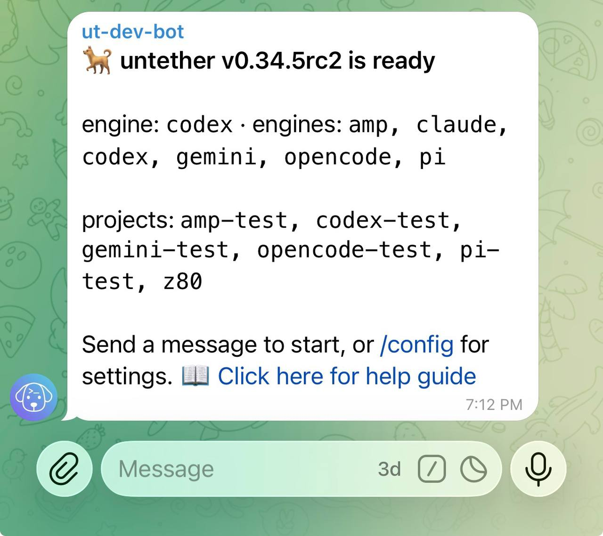

# Install and onboard

This tutorial walks you through installing Untether, creating a Telegram bot, and generating your config file. Once set up, you can send coding tasks from your phone while you're out, review results on your tablet, or keep working from your laptop — anywhere [Telegram](https://telegram.org) runs.

**What you'll have at the end:** A working `~/.untether/untether.toml` with your bot token, chat ID, workflow settings, and default engine.

## 1. Install Python and uv

Install `uv`, the modern Python [package manager](https://docs.astral.sh/uv/):

```sh
curl -LsSf https://astral.sh/uv/install.sh | sh
```

Install Python 3.12 or newer with uv (3.14 recommended):

```sh
uv python install 3.14
```

## 2. Install Untether

```sh
uv tool install -U untether
```

Verify it's installed:

```sh
untether --version
```

You should see the installed version number (e.g. `0.34.5`).

## 3. Install agent CLIs

Untether shells out to agent CLIs. Install the ones you plan to use (or install them all now):

### Codex

```sh
npm install -g @openai/codex
```

Untether uses the official Codex CLI, so your existing ChatGPT subscription applies. Run `codex` and sign in with your ChatGPT account.

### Claude Code

```sh
npm install -g @anthropic-ai/claude-code
```

Untether uses the official Claude Code CLI, so your existing Claude subscription applies. Run `claude` and log in with your Claude account. Untether defaults to subscription billing unless you opt into API billing in config.

!!! note "macOS credentials"
    On macOS, Claude Code stores OAuth credentials in macOS Keychain rather than a plain-text file. Untether handles both automatically — just make sure you've run `claude login` at least once before starting Untether.

### OpenCode

```sh
npm install -g opencode-ai@latest
```

OpenCode supports logging in with Anthropic for your Claude subscription or with OpenAI for your ChatGPT subscription, and it can connect to 75+ providers via Models.dev (including local models).

### Pi

```sh
npm install -g @mariozechner/pi-coding-agent
```

Pi can authenticate via a provider login or use API billing. You can log in with Anthropic (Claude subscription), OpenAI (ChatGPT subscription), GitHub Copilot, Google Cloud Code Assist (Gemini CLI), or Antigravity (Gemini 3, Claude, GPT-OSS), or choose API billing instead.

### Gemini CLI

```sh
npm install -g @google/gemini-cli
```

Gemini CLI uses Google AI Studio or Vertex AI for authentication. Run `gemini` and sign in with your Google account. Supports plan mode, sandboxing, and automatic model routing (Pro for planning, Flash for implementation).

### AMP

```sh
npm install -g @sourcegraph/amp
```

AMP is the Sourcegraph coding agent. Run `amp login` to authenticate. Supports mode selection (`--mode deep|free|rush|smart`), thread sharing, and a rich permission system.

## 4. Run onboarding

Start Untether without a config file. It will detect this and launch the setup wizard:

```sh
untether
```

You'll see:

```
step 1: bot token

? do you already have a bot token from @BotFather? (yes/no)
```

If you don't have a bot token yet, answer **n** and Untether will show you the steps.

## 5. Create a Telegram bot

If you answered **n**, follow these steps (or skip to step 6 if you already have a token):

1. Open Telegram and message [@BotFather](https://t.me/BotFather)
2. Send `/newbot` or use the mini app
3. Choose a display name (the obvious choice is "untether")
4. Choose a username ending in `bot` (e.g., `my_untether_bot`)

!!! user "You"
    /newbot

!!! untether "BotFather"
    Alright, a new bot. How are we going to call it? Please choose a name for your bot.

!!! user "You"
    untether

!!! untether "BotFather"
    Good. Now let's choose a username for your bot...

BotFather will congratulate you on your new bot and will reply with your token:

```
Done! Congratulations on your new bot. You will find it at
t.me/my_untether_bot. You can now add a description, about
section and profile picture for your bot, see /help for a
list of commands.

Use this token to access the HTTP API:
123456789:ABCdefGHIjklMNOpqrsTUVwxyz

Keep your token secure and store it safely, it can be used
by anyone to control your bot.
```

Copy the token (the `123456789:ABC...` part).

<!-- TODO: capture screenshot -->
<!--  -->

!!! warning "Keep your token secret"
    Anyone with your bot token can control your bot. Don't commit it to git or share it publicly.

## 6. Enter your bot token

Paste your token when prompted:

```
? paste your bot token: ****
  validating...
  connected to @my_untether_bot
```

Untether validates the token by calling the Telegram API. If it fails, double-check you copied the full token.

## 7. Pick your workflow

Untether shows three workflow previews:

=== "assistant"

    ongoing chat

    <div class="workflow-preview">
    <div class="msg msg-you">make happy wings fit</div><div class="clearfix"></div>
    <div class="msg msg-bot">done · codex · 8s · step 3</div><div class="clearfix"></div>
    <div class="msg msg-you">carry heavy creatures</div><div class="clearfix"></div>
    <div class="msg msg-bot">done · codex · 12s · step 5</div><div class="clearfix"></div>
    <div class="msg msg-you"><span class="cmd">/new</span></div><div class="clearfix"></div>
    <div class="msg msg-you">add flower pin</div><div class="clearfix"></div>
    <div class="msg msg-bot">done · codex · 6s · step 2</div><div class="clearfix"></div>
    </div>

=== "workspace"

    topics per branch

    <div class="workflow-preview">
    <div class="topic-bar"><span class="topic-active">happian @memory-box</span><span class="topic">untether @master</span></div>
    <div class="msg msg-you">store artifacts forever</div><div class="clearfix"></div>
    <div class="msg msg-bot">done · codex · 10s · step 4</div><div class="clearfix"></div>
    <div class="msg msg-you">also freeze them</div><div class="clearfix"></div>
    <div class="msg msg-bot">done · codex · 6s · step 2</div><div class="clearfix"></div>
    </div>

=== "handoff"

    reply to continue

    <div class="workflow-preview">
    <div class="msg msg-you">make it go back in time</div><div class="clearfix"></div>
    <div class="msg msg-bot">done · codex · 8s · step 3<br><span class="resume">codex resume <span class="id-1">abc123</span></span></div><div class="clearfix"></div>
    <div class="msg msg-you">add reconciliation ribbon</div><div class="clearfix"></div>
    <div class="msg msg-bot">done · codex · 3s · step 1<br><span class="resume">codex resume <span class="id-2">def456</span></span></div><div class="clearfix"></div>
    <div class="msg msg-you"><div class="reply-quote">done · codex · 8s · step 3</div>more than once</div><div class="clearfix"></div>
    <div class="msg msg-bot">done · codex · 8s · step 5<br><span class="resume">codex resume <span class="id-1">abc123</span></span></div><div class="clearfix"></div>
    </div>

```
? how will you use untether?
 ❯ assistant (ongoing chat, /new to reset)
   workspace (projects + branches, i'll set those up)
   handoff (reply to continue, terminal resume)
```

<!-- TODO: capture screenshot -->
<!--  -->

Each choice automatically configures conversation mode, topics, and resume lines:

| Workflow | Best for | What it does |
|----------|----------|--------------|
| **assistant** | Single developer, private chat | Chat mode (auto-resume), topics off, resume lines hidden. Use `/new` to start fresh. |
| **workspace** | Teams, multiple projects/branches | Chat mode, topics on, resume lines hidden. Each topic binds to a repo/branch. |
| **handoff** | Terminal-based workflow | Stateless (reply-to-continue), resume lines always shown. Copy resume line to terminal. |

!!! tip "Not sure which to pick?"
    Start with **assistant** (recommended). You can always change settings later in your config file.

## 8. Connect your chat

Depending on your workflow choice, Untether shows different instructions:

**For assistant or handoff:**

```
step 3: connect chat

  1. open a chat with @my_untether_bot
  2. send /start
  waiting for message...
```

**For workspace:**

```
step 3: connect chat

  set up a topics group:
  1. create a group and enable topics (settings → topics)
  2. add @my_untether_bot as admin with "manage topics"
  3. send any message in the group
  waiting for message...
```

Once Untether receives your message:

```
  got chat_id 123456789 for @yourusername (private chat)
```

!!! warning "Workspace requires a forum group"
    If you chose workspace and the chat isn't a forum-enabled supergroup with proper bot permissions, Untether will warn you and offer to switch to assistant mode instead.

## 9. Choose your default engine

Untether scans your PATH for installed agent CLIs:

```
step 4: default engine

untether runs these engines on your computer. switch anytime with /agent.

  engine    status         install command
  ───────────────────────────────────────────
  codex     ✓ installed
  claude    ✓ installed
  opencode  ✗ not found    npm install -g opencode-ai@latest
  pi        ✗ not found    npm install -g @mariozechner/pi-coding-agent
  gemini    ✗ not found    npm install -g @google/gemini-cli
  amp       ✗ not found    npm install -g @sourcegraph/amp

? choose default engine:
 ❯ codex
   claude
```

Pick whichever you prefer. You can switch engines per-message with `/codex`, `/claude`, etc., or change the default anytime via `/config` in Telegram.

## 10. Choose your workflow mode

Untether supports three workflow modes that control how conversations continue:

| Mode | Best for | How it works |
|------|----------|-------------|
| **Assistant** | Solo dev, private chat | Messages auto-resume your last session. Use `/new` to start fresh. *(recommended)* |
| **Workspace** | Teams, multiple projects | Forum topics, each bound to a project/branch. Independent sessions per topic. |
| **Handoff** | Terminal-first workflow | Every message is a new run. Resume lines shown for copying to terminal. |

The onboarding wizard configures this automatically based on your setup (private chat = assistant, forum group = workspace). You can change modes later by editing three settings in your config file — see [Choose a workflow mode](../how-to/choose-a-mode.md) for details.

## 11. Save your config

```
step 5: save config

? save config to ~/.untether/untether.toml? (yes/no)
```

Press **y** or **Enter** to save. You'll see:

```
✓ setup complete. starting untether...
```

Untether is now running and listening for messages!

!!! untether "Untether"
    🐕 untether v0.34.0 is ready

    engine: `codex` · projects: `0`<br>
    working in: /Users/you/dev/your-project



## What just happened

Your config file lives at `~/.untether/untether.toml`. The exact contents depend on your workflow choice:

=== "assistant"

    === "untether config"

        ```sh
        untether config set default_engine "codex"
        untether config set transport "telegram"
        untether config set transports.telegram.bot_token "..."
        untether config set transports.telegram.chat_id 123456789
        untether config set transports.telegram.session_mode "chat"
        untether config set transports.telegram.show_resume_line false
        untether config set transports.telegram.topics.enabled false
        untether config set transports.telegram.topics.scope "auto"
        ```

    === "toml"

        ```toml title="~/.untether/untether.toml"
        default_engine = "codex"
        transport = "telegram"

        [transports.telegram]
        bot_token = "..."
        chat_id = 123456789
        session_mode = "chat"       # auto-resume
        show_resume_line = false    # cleaner chat

        [transports.telegram.topics]
        enabled = false
        scope = "auto"
        ```

=== "workspace"

    === "untether config"

        ```sh
        untether config set default_engine "codex"
        untether config set transport "telegram"
        untether config set transports.telegram.bot_token "..."
        untether config set transports.telegram.chat_id -1001234567890
        untether config set transports.telegram.session_mode "chat"
        untether config set transports.telegram.show_resume_line false
        untether config set transports.telegram.topics.enabled true
        untether config set transports.telegram.topics.scope "auto"
        ```

    === "toml"

        ```toml title="~/.untether/untether.toml"
        default_engine = "codex"
        transport = "telegram"

        [transports.telegram]
        bot_token = "..."
        chat_id = -1001234567890    # forum group
        session_mode = "chat"
        show_resume_line = false

        [transports.telegram.topics]
        enabled = true              # topics on
        scope = "auto"
        ```

=== "handoff"

    === "untether config"

        ```sh
        untether config set default_engine "codex"
        untether config set transport "telegram"
        untether config set transports.telegram.bot_token "..."
        untether config set transports.telegram.chat_id 123456789
        untether config set transports.telegram.session_mode "stateless"
        untether config set transports.telegram.show_resume_line true
        untether config set transports.telegram.topics.enabled false
        untether config set transports.telegram.topics.scope "auto"
        ```

    === "toml"

        ```toml title="~/.untether/untether.toml"
        default_engine = "codex"
        transport = "telegram"

        [transports.telegram]
        bot_token = "..."
        chat_id = 123456789
        session_mode = "stateless"  # reply-to-continue
        show_resume_line = true     # always show resume lines

        [transports.telegram.topics]
        enabled = false
        scope = "auto"
        ```

This config file controls all of Untether's behavior. You can edit it directly or change most settings from Telegram using the `/config` inline menu — no file editing needed.

[Full config reference →](../reference/config.md)

## Re-running onboarding

If you ever need to reconfigure:

```sh
untether --onboard
```

This will prompt you to update your existing config (it won't overwrite without asking).

## Troubleshooting

**"error: missing untether config"**

Run `untether` in a terminal with a TTY. The setup wizard only runs interactively.

**"failed to connect, check the token and try again"**

Make sure you copied the full token from BotFather, including the numbers before the colon.

**Bot doesn't respond to /start**

If you're still in onboarding, your terminal should show "waiting...". If you accidentally closed it, run `untether` again and restart the setup.

**"error: already running"**

You can only run one Untether instance per bot token. Find and stop the other process, or remove the stale lock file at `~/.untether/untether.lock`.

## Next

Learn more about conversation modes and how your workflow choice affects follow-ups.

[Conversation modes →](conversation-modes.md)
