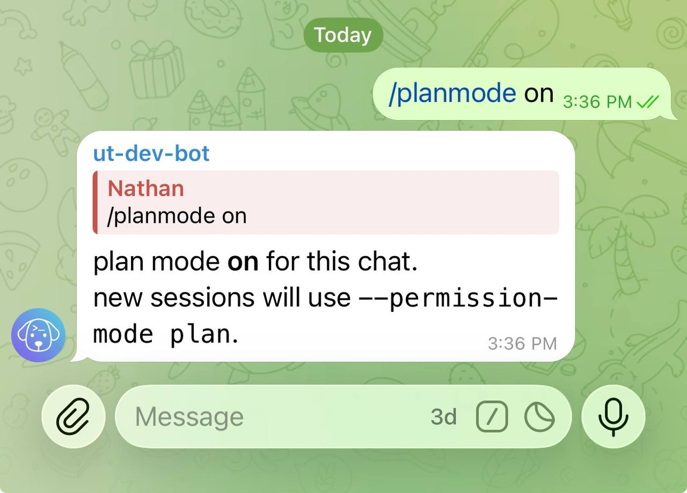
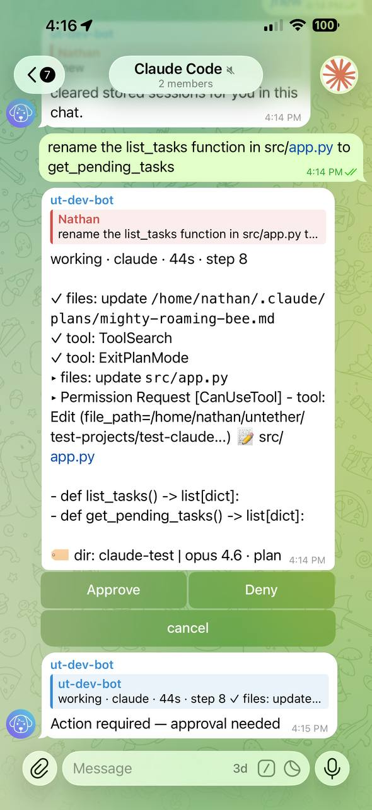
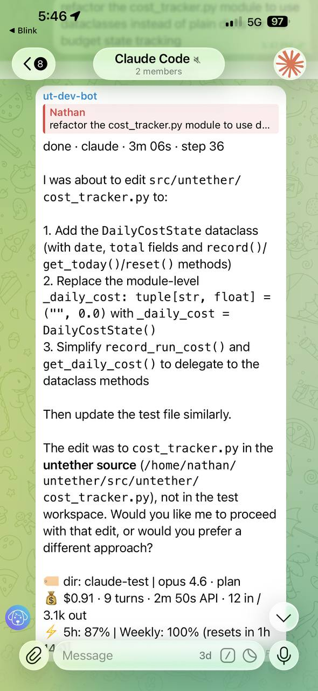
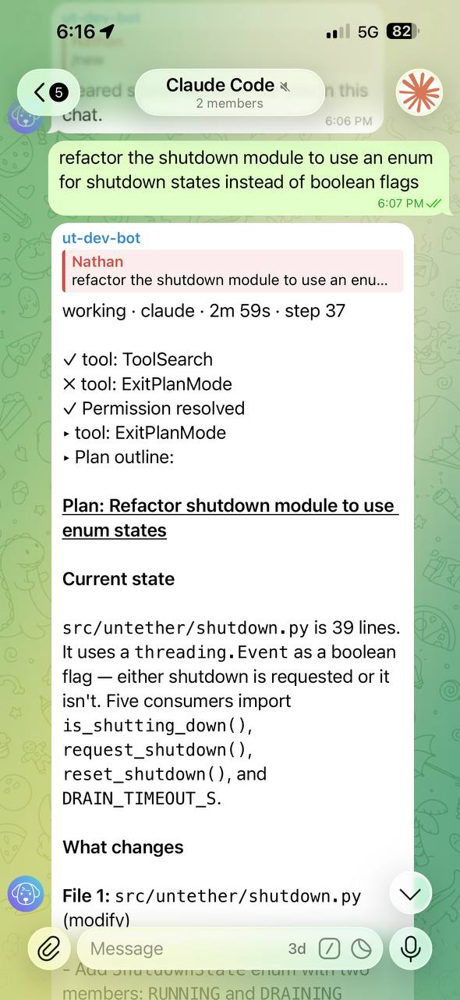
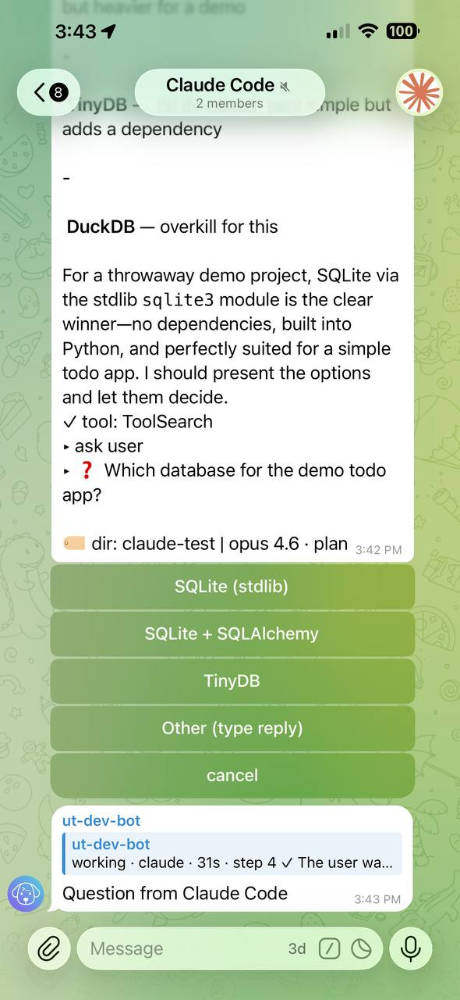
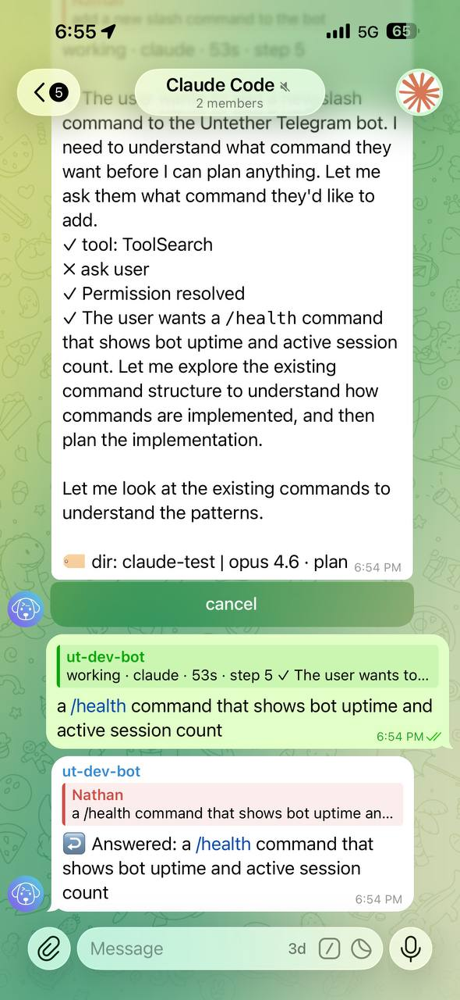
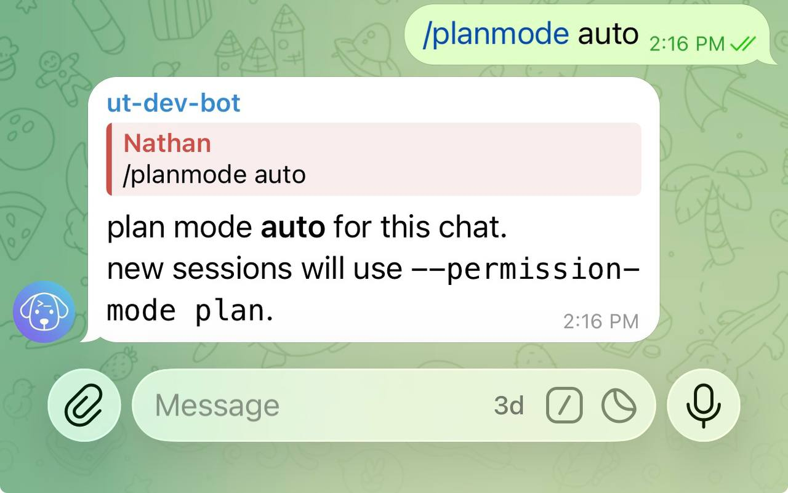
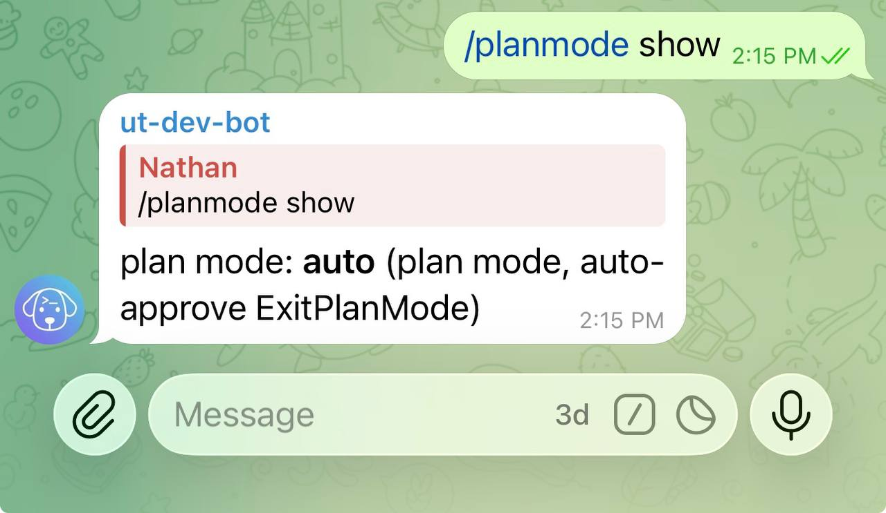

# Interactive control

This tutorial walks you through Untether's interactive permission system — approving, denying, and shaping agent actions from [Telegram](https://telegram.org) on whatever device is in your hand. Stay in control while you're away from the terminal.

**What you'll learn:** How to control Claude Code's actions in real time with Telegram buttons, how to request and review a plan before execution, and how to answer agent questions from anywhere.

!!! note "Claude Code only"
    Interactive approval buttons (Approve / Deny / Pause & Outline Plan) are a Claude Code feature. Other engines run non-interactively. Codex CLI has a pre-run [approval policy](../how-to/inline-settings.md) in `/config` (full auto vs safe) and Gemini CLI has a 3-tier [approval mode](../how-to/inline-settings.md) (read-only / edit files / full access), but neither has per-tool interactive buttons.

## 1. Understand permission modes

Untether offers three permission modes that control how much oversight you have:

| Mode | Command | What happens |
|------|---------|-------------|
| **Plan** | `/planmode on` | Every tool call shows Approve / Deny buttons. Full control. |
| **Auto** | `/planmode auto` | Tools are auto-approved. Plan transitions are also auto-approved. Hands-off. |
| **Accept edits** | `/planmode off` | No approval buttons at all. Claude Code runs autonomously. |

For this tutorial, we'll use **Plan** mode so you can see every interaction.

## 2. Enable plan mode

Open your Telegram chat with the bot and send:

```
/planmode on
```

!!! untether "Untether"
    plan mode: **on**



The bot confirms that plan mode is now active. This setting is stored per chat and persists across sessions.

## 3. Send a task

Send Claude Code a task that will require file changes:

```
add a comment to the top of README.md explaining what this project does
```

Claude Code starts working and you'll see a progress message stream in.

## 4. See approval buttons

When Claude Code wants to modify a file, Untether intercepts the tool call and shows you what's about to happen. You'll see a message like:

<div markdown>

!!! untether "Untether"
    ▸ Permission Request [CanUseTool] - tool: Edit (file_path=README.md)<br>
    📝 README.md<br>
    `- # My Project`<br>
    `+ # My Project`<br>
    `+ # A tool for managing widgets`

<div class="tg-buttons">
<span class="tg-btn">Approve</span>
<span class="tg-btn">Deny</span>
<span class="tg-btn">Pause &amp; Outline Plan</span>
</div>

</div>

The message includes:

- **Request type and tool name** with key parameters (e.g. file path, command)
- **Diff preview** — 📝 file path, removed lines (`- old`) and added lines (`+ new`)
- **Three buttons**: Approve, Deny, and Pause & Outline Plan



Your phone will also buzz with a push notification so you don't miss it.

## 5. Approve a tool call

Tap **Approve** to let Claude Code proceed with the action. The button clears instantly — no spinner, no waiting. Claude Code continues with its work.

!!! untether "Untether"
    working · claude · 8s · step 2

    ✓ Read `README.md`<br>
    ▸ Edit `README.md`

You may see several approval requests in a row as Claude Code works through multiple steps.

## 6. Deny a tool call

If something doesn't look right, tap **Deny** instead. Claude Code receives a denial message explaining that you've blocked the action and asking it to communicate via visible text instead.

!!! untether "Untether"
    I was going to add a comment to the top of README.md with a project description. Would you prefer I explain what I had in mind first, or should I take a different approach?



This is useful when you want Claude Code to explain its reasoning before making changes. After denying, Claude Code will typically describe what it was trying to do and ask for guidance.

## 7. Use "Pause & Outline Plan"

The third button — **Pause & Outline Plan** — is the most powerful. It appears when Claude Code tries to exit plan mode (transition from planning to execution).

Tap it to require Claude Code to write a comprehensive plan as a visible message before doing anything. The plan must include:

1. Every file to be created or modified (full paths)
2. What changes will be made in each file
3. The execution order and phases
4. Key decisions and trade-offs
5. The expected end result

The outline renders as **formatted Telegram text** — headings, bold, code blocks, and lists display properly instead of raw markdown:

!!! untether "Untether"
    Here's my plan:

    1. **Read** `README.md` to understand current content
    2. **Edit** `README.md` to add a project description comment at line 1
    3. **Verify** the comment is correctly formatted

    Files to modify: `README.md`



After Claude Code writes the outline, **Approve Plan** and **Deny** buttons appear automatically on the last message of the outline — no need to scroll back up or type "approved":

<div class="tg-buttons">
<span class="tg-btn">Approve Plan</span>
<span class="tg-btn">Deny</span>
</div>


- Tap **Approve Plan** to let Claude Code proceed with implementation
- Tap **Deny** to stop Claude Code and provide different direction

!!! tip "Progressive cooldown"
    After tapping "Pause & Outline Plan", a cooldown prevents Claude Code from immediately retrying. The cooldown starts at 30 seconds and escalates up to 120 seconds if Claude Code keeps retrying. This ensures the agent pauses long enough for you to read the outline.

## 8. Answer a question

Sometimes Claude Code needs to ask you something — like which approach to take or what naming convention to use. When Claude Code calls `AskUserQuestion`, you'll see the question in the chat with a ❓ prefix and **option buttons** for each choice:

<div markdown>

!!! untether "Untether"
    ❓ What naming convention should I use for the new variables?

<div class="tg-buttons">
<span class="tg-btn">snake_case</span>
<span class="tg-btn">camelCase</span>
</div>
<div class="tg-buttons">
<span class="tg-btn">Other (type reply)</span>
<span class="tg-btn">Deny</span>
</div>

</div>



**Tap an option button** to select your answer. Claude Code receives your choice and continues immediately.

For multi-question flows (1 of N, 2 of N), each question appears in sequence after you answer the previous one.

If none of the options fit, tap **Other (type reply)** and type a custom answer as text. Untether routes your reply back to Claude Code, which reads it and continues.

!!! user "You"
    Use snake_case for all variable names



Untether routes your reply back to Claude Code, which reads it and continues.

You can also tap **Deny** to dismiss the question if it's not relevant.

!!! tip "Ask mode toggle"
    Control whether Claude Code asks interactive questions via `/config` → **Ask mode**. When off, Claude Code proceeds with reasonable defaults instead of asking.

## 9. Switch to auto mode

Once you're comfortable with how Claude Code works, you might want less interruption. Switch to auto mode:

```
/planmode auto
```

!!! untether "Untether"
    plan mode: **auto**



In auto mode, tool calls (Edit, Write, Bash) are still auto-approved — Claude Code works without interruption. Plan transitions are also auto-approved, so you won't see ExitPlanMode buttons. The agent preamble still requests summaries and structured output.

## 10. Return to default

To turn off plan mode entirely:

```
/planmode off
```

This sets Claude Code to `acceptEdits` mode — no approval buttons at all. Claude Code runs autonomously, which is the fastest option for trusted tasks.

To check your current mode at any time:

```
/planmode show
```

!!! untether "Untether"
    plan mode: **auto** (plan mode, auto-approve ExitPlanMode)



## What just happened

Key concepts:

- **Permission modes** control the level of oversight: plan (full control), auto (hands-off with plans), off (fully autonomous)
- **Approval buttons** appear inline in Telegram when Claude Code needs permission — Approve, Deny, or Pause & Outline Plan
- **Diff previews** show you exactly what will change before you approve
- **"Pause & Outline Plan"** forces Claude Code to write a visible plan before executing
- **Outline formatting** — plans render as proper Telegram text with headings, bold, and lists; buttons appear on the last message; outline messages are cleaned up after you act on them
- **AskUserQuestion** lets you answer Claude Code's questions with option buttons or a text reply
- **Push notifications** ensure you don't miss approval requests, even from another app
- **Ephemeral cleanup** automatically removes button messages when the run finishes

## Troubleshooting

**Approval buttons don't appear**

Check that you're using Claude Code (`/claude` prefix or `/agent set claude`) and that plan mode is on (`/planmode show`). Other engines don't support interactive approval.

**Buttons appear but nothing happens when I tap them**

Check your internet connection. If the tap doesn't register, try again — Untether answers callbacks immediately so there should be no delay.

**Claude Code keeps retrying after I tap "Pause & Outline Plan"**

This is the progressive cooldown at work. Claude Code may retry ExitPlanMode during the cooldown window, but each retry is auto-denied. Wait for Claude Code to write the outline, then use the Approve Plan / Deny buttons that appear.

**I don't get push notifications for approval requests**

Make sure Telegram notifications are enabled for this chat. Untether sends a separate notification message when buttons appear, but Telegram's notification settings control whether you see it.

## Next

Now that you can control your agent interactively, learn how to target specific repos and branches.

[Projects and branches →](projects-and-branches.md)
