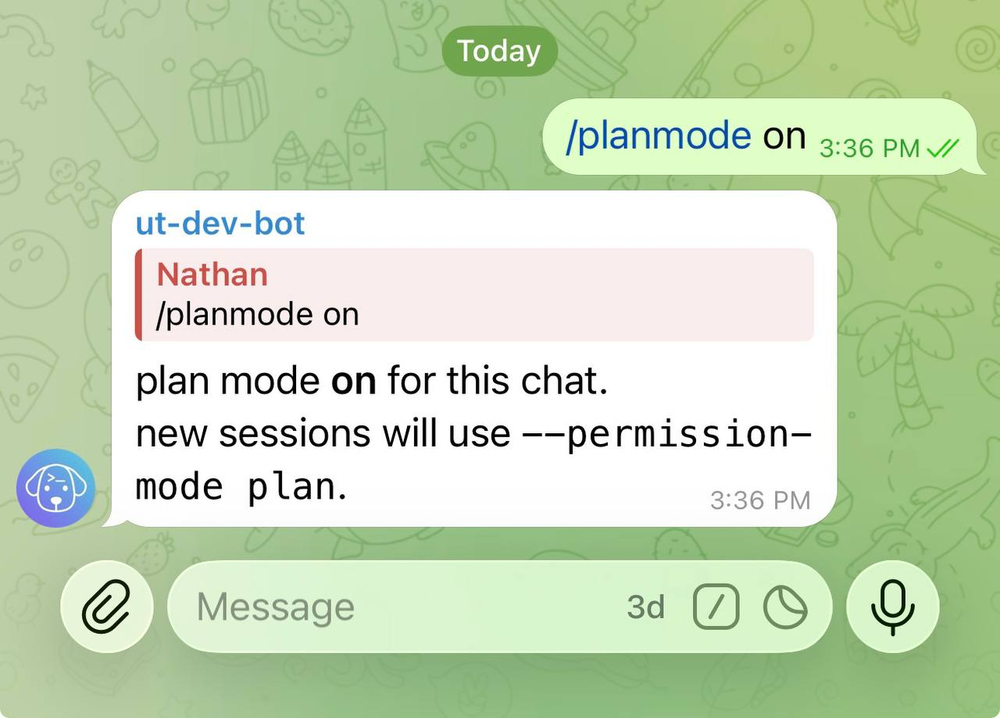
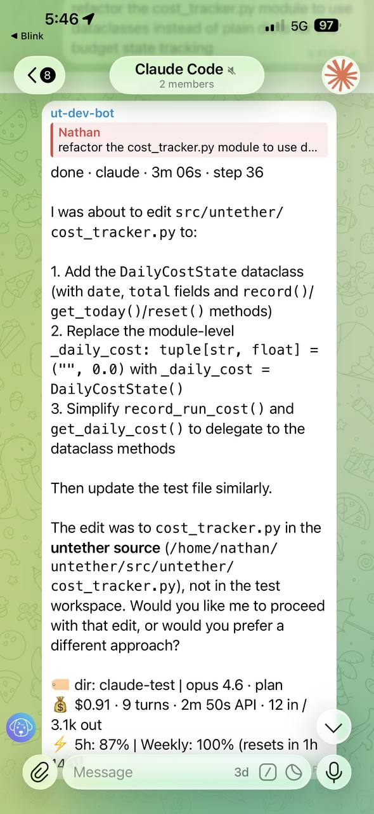
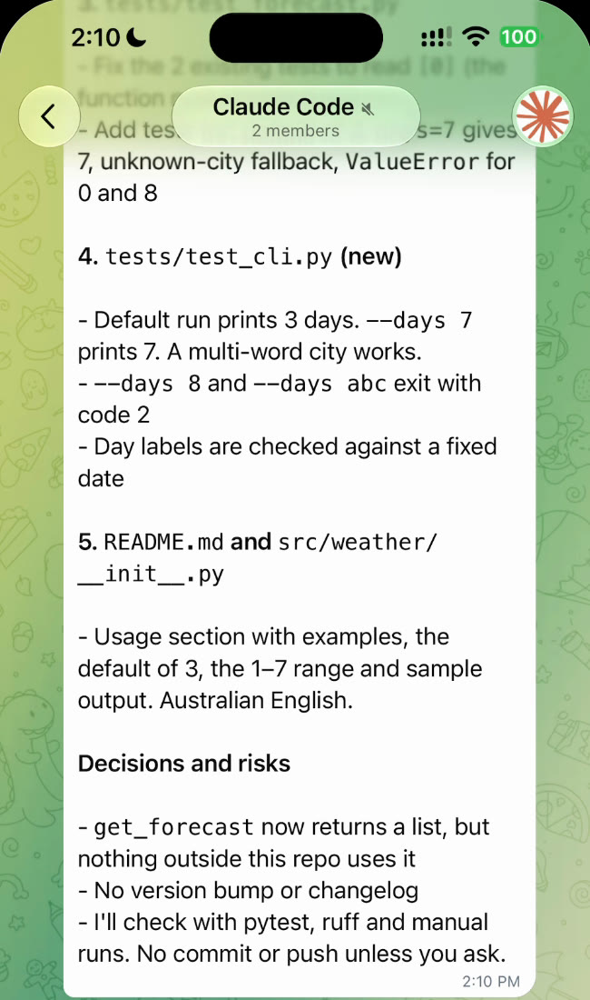
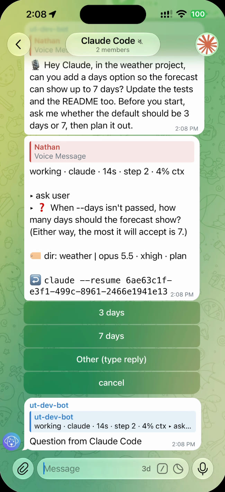
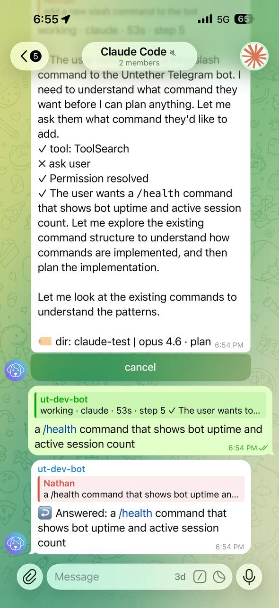
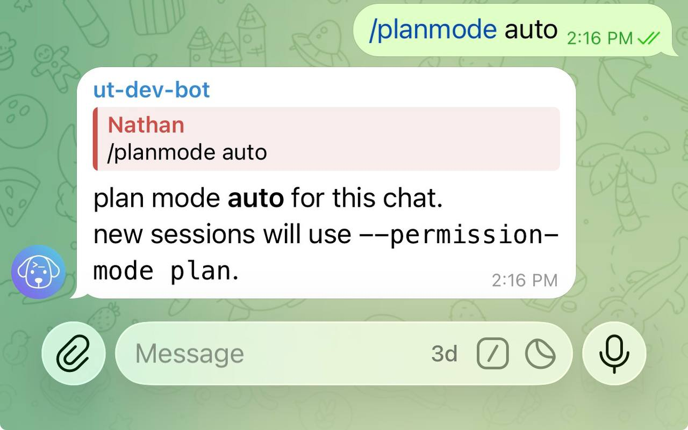
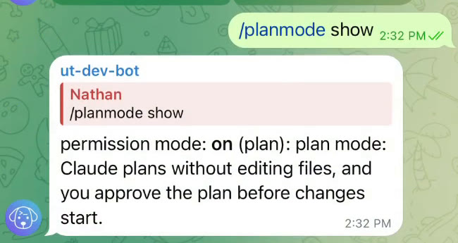

# Interactive control

This tutorial walks you through Untether's interactive permission system — approving, denying, and shaping agent actions from [Telegram](https://telegram.org) on whatever device is in your hand. Stay in control while you're away from the terminal.

**What you'll learn:** How to control Claude Code's actions in real time with Telegram buttons, how to request and review a plan before execution, and how to answer agent questions from anywhere.

!!! note "Claude Code only"
    Interactive approval buttons (Approve / Deny / Pause & Outline Plan) are a Claude Code feature. Other engines run non-interactively. Codex CLI has a pre-run [approval policy](../how-to/inline-settings.md) in `/config` (full auto vs safe = read-only sandbox) and Gemini CLI has a 3-tier [approval mode](../how-to/inline-settings.md) (read-only / edit files / full access), but neither has per-tool interactive buttons.

## 1. Understand permission modes

Untether offers four permission modes that control how much oversight you have:

| Mode | Command | What happens |
|------|---------|-------------|
| **Plan** | `/planmode on` | Claude plans without editing files and you approve the plan before changes start. Reads and searches run without buttons. |
| **Plan-auto** | `/planmode plan-auto` | Tools are auto-approved. Plan transitions are also auto-approved. Hands-off. |
| **Auto** | `/planmode auto` | Claude Code's own auto mode — a classifier approves routine work and blocks risky actions. No plan phase. |
| **Accept edits** | `/planmode off` | No plan phase. File edits and common filesystem commands run without asking; other actions (shell commands, web fetches, MCP tools) show Approve / Deny buttons unless your Claude Code settings already allow them. |

For this tutorial, use **Plan** mode so you can see the plan approval flow.

## 2. Enable plan mode

Open your Telegram chat with the bot and send:

```
/planmode on
```

!!! untether "Untether"
    permission mode **on** for this chat: plan mode: Claude plans without editing files, and you approve the plan before changes start.<br>
    applies from your next message (`--permission-mode plan`). Until then, the current run and any background wake-ups keep the old mode.



The bot confirms that plan mode is now active. This setting is stored per chat and persists across sessions; it takes effect from your next message.

## 3. Send a task

Send Claude Code a task that will require file changes:

```
add a comment to the top of README.md explaining what this project does
```

Claude Code starts working and you'll see a progress message stream in.

## 4. See approval buttons

When Claude Code needs your go-ahead, Untether intercepts the request and shows you what's about to happen. In plan mode the main checkpoint is the **plan approval** (step 7). Individual tool calls come to you too when **Diff preview** is on in `/config`, and with `/planmode off` for anything beyond file edits (a shell command shows as `$ <command>`). A file edit looks like this:

<div markdown>

!!! untether "Untether"
    ▸ Permission Request [CanUseTool] - tool: Edit (file_path=README.md)

    ```diff
    📝 README.md
    - # My Project
    + # My Project
    + # A tool for managing widgets
    ```

<div class="tg-buttons">
<span class="tg-btn">✅ Approve</span>
<span class="tg-btn">❌ Deny</span>
</div>

</div>

The message includes:

- **Request type and tool name** with key parameters (e.g. file path, command)
- **Diff preview** — 📝 file path, removed lines (`- old`) and added lines (`+ new`) in a monospace `diff` block
- **Buttons**: ✅ Approve and ❌ Deny. A plan approval (Claude Code asking to leave plan mode) reads **✅ Approve Plan** instead and adds a third button, **📋 Pause & Outline Plan** (step 7)


Your phone will also buzz with a push notification so you don't miss it.

## 5. Approve a tool call

Tap **Approve** to let Claude Code proceed with the action. The button clears instantly — no spinner, no waiting. Claude Code continues with its work.

!!! untether "Untether"
    working · claude · 8s · step 2

    ✓ Read `README.md`<br>
    ▸ Edit `README.md`

You may see several approval requests in a row as Claude Code works through multiple steps.

## 6. Deny a tool call

If something doesn't look right, tap **Deny** instead. Claude Code receives a denial message explaining that you've blocked the action and asking it to communicate via visible text instead.

!!! untether "Untether"
    I was going to add a comment to the top of README.md with a project description. Would you prefer I explain what I had in mind first, or should I take a different approach?



This is useful when you want Claude Code to explain its reasoning before making changes. After denying, Claude Code will typically describe what it was trying to do and ask for guidance.

## 7. Use "Pause & Outline Plan"

In plan mode, when Claude Code has a plan and tries to exit plan mode (the move from planning to execution), you get **✅ Approve Plan**, **❌ Deny** and a third button — **📋 Pause & Outline Plan** — which is the most powerful. The message also says what approving does: Claude carries out the plan without further prompts, and plan mode resumes when that reply ends (or once any background agents it started have finished).

Tap it to require Claude Code to write a comprehensive plan as a visible message before doing anything. The plan must include:

1. Every file to be created or modified (full paths)
2. What changes will be made in each file
3. The execution order and phases
4. Key decisions and trade-offs
5. The expected end result

The outline renders as **formatted Telegram text** — headings, bold, code blocks, and lists display properly instead of raw markdown:

!!! untether "Untether"
    Here's my plan:

    1. **Read** `README.md` to understand current content
    2. **Edit** `README.md` to add a project description comment at line 1
    3. **Verify** the comment is correctly formatted

    Files to modify: `README.md`



After Claude Code writes the outline, **Approve Plan**, **Deny**, and **Let's discuss** buttons appear automatically on the last message of the outline — no need to scroll back up or type "approved":

<div class="tg-buttons">
<span class="tg-btn">✅ Approve Plan</span>
<span class="tg-btn">❌ Deny</span>
</div>
<div class="tg-buttons">
<span class="tg-btn">💬 Let's discuss</span>
</div>


- Tap **Approve Plan** to let Claude Code proceed with implementation. The approval covers that reply only: your next message starts in plan mode again
- Tap **Deny** to stop Claude Code and provide different direction
- Tap **Let's discuss** to talk about the plan before deciding — Claude Code will ask what you'd like to change and wait for your reply

!!! tip "Outline gate"
    After tapping "Pause & Outline Plan", Untether holds ExitPlanMode open until Claude Code provides a readable outline — the plan is posted to the chat and the agent stays alive while you read it. If Claude Code retries *without* an outline, that attempt is auto-denied with an instruction to write the outline first. *(Earlier versions also enforced a 30–120s escalating cooldown here — a workaround for a Claude Code v2.1.72–2.1.74 retry loop that was fixed upstream and retired in v0.35.4.)*

## 8. Answer a question

Sometimes Claude Code needs to ask you something — like which approach to take or what naming convention to use. When Claude Code calls `AskUserQuestion`, you'll see the question in the chat with a ❓ prefix and **option buttons** for each choice:

<div markdown>

!!! untether "Untether"
    ❓ What naming convention should I use for the new variables?

<div class="tg-buttons">
<span class="tg-btn">snake_case</span>
<span class="tg-btn">camelCase</span>
</div>
<div class="tg-buttons">
<span class="tg-btn">Other (type reply)</span>
<span class="tg-btn">Deny</span>
</div>

</div>



**Tap an option button** to select your answer. Claude Code receives your choice and continues immediately.

For multi-question flows (1 of N, 2 of N), each question appears in sequence after you answer the previous one.

If none of the options fit, tap **Other (type reply)** and type a custom answer as text. Untether routes your reply back to Claude Code, which reads it and continues.

!!! user "You"
    Use snake_case for all variable names



Untether routes your reply back to Claude Code, which reads it and continues.

You can also tap **Deny** to dismiss the question if it's not relevant.

!!! tip "Ask mode toggle"
    Control whether Claude Code asks interactive questions via `/config` → **Ask mode**. When off, Claude Code proceeds with reasonable defaults instead of asking.

## 9. Switch to plan-auto mode

Once you're comfortable with how Claude Code works, you might want less interruption. Switch to plan-auto mode:

```
/planmode plan-auto
```

!!! untether "Untether"
    permission mode **plan-auto** for this chat: plan mode, but the plan is approved for you: no plan buttons.<br>
    applies from your next message (`--permission-mode plan`). Until then, the current run and any background wake-ups keep the old mode.



In plan-auto mode, tool calls (Edit, Write, Bash) are auto-approved — Claude Code works without interruption. Plan transitions are also auto-approved, so you won't see ExitPlanMode buttons. The agent preamble still requests summaries and structured output.

`/planmode auto` is different: it hands approval to Claude Code's own classifier, which runs routine work and blocks risky actions. See [Plan mode](../how-to/plan-mode.md).

## 10. Skip the plan phase

To drop the plan phase (Claude Code's `acceptEdits` mode):

```
/planmode off
```

This sets Claude Code to `acceptEdits` mode: no plan phase, and file edits run without buttons. Since v0.35.5, anything `acceptEdits` doesn't cover (most shell commands, web fetches, MCP tools) shows Approve / Deny buttons, unless your Claude Code `permissions.allow` rules already allow it.

To go back to the engine's default instead, send `/planmode clear`.

To check your current mode at any time:

```
/planmode show
```

!!! untether "Untether"
    permission mode: **plan-auto** (plan): plan mode, but the plan is approved for you: no plan buttons.



## What just happened

Key concepts:

- **Permission modes** control the level of oversight: `on` (plan mode: Claude plans without editing files, and you approve the plan before changes start), `plan-auto` (plan mode, but the plan is approved for you: no plan buttons), `auto` (Claude Code's auto mode: a classifier approves routine actions and blocks risky ones; no plan phase) and `off` (`acceptEdits`: no plan phase; file edits and common filesystem commands run, and other tools ask you first)
- **Approval buttons** appear inline in Telegram when Claude Code needs permission — Approve, Deny, or Pause & Outline Plan; after an outline is written, you also get **Let's discuss** to talk about the plan
- **Diff previews** show you exactly what will change before you approve
- **"Pause & Outline Plan"** forces Claude Code to write a visible plan before executing
- **Plan approvals are per reply** — approving a plan lets Claude Code carry it out without further prompts, then plan mode resumes for your next message
- **Outline formatting** — plans render as proper Telegram text with headings, bold, and lists; buttons appear on the last message; outline messages are cleaned up after you act on them
- **AskUserQuestion** lets you answer Claude Code's questions with option buttons or a text reply
- **Push notifications** ensure you don't miss approval requests, even from another app
- **Ephemeral cleanup** automatically removes button messages when the run finishes

## Troubleshooting

**Approval buttons don't appear**

Check that you're using Claude Code (`/claude` prefix or `/agent set claude`) and that plan mode is on (`/planmode show`). Other engines don't support interactive approval.

**Buttons appear but nothing happens when I tap them**

Check your internet connection. If the tap doesn't register, try again — Untether answers callbacks immediately so there should be no delay. A toast saying `Already answered`, `No longer needed` or `This request has expired` means the request was already settled (or Claude Code withdrew it), so the tap was ignored. Buttons also only work in the chat they were posted in.

**Claude Code keeps retrying after I tap "Pause & Outline Plan"**

Until Claude Code writes an outline, each ExitPlanMode retry is auto-denied with an instruction to provide the plan first — this is the outline gate. Wait for Claude Code to write the outline, then use the Approve Plan / Let's discuss / Deny buttons that appear. *(The 30–120s escalating cooldown earlier versions used here was retired in v0.35.4 — the upstream retry loop it worked around is fixed.)*

**I don't get push notifications for approval requests**

Make sure Telegram notifications are enabled for this chat. Untether sends a separate notification message when buttons appear, but Telegram's notification settings control whether you see it.

## Next

Now that you can control your agent interactively, learn how to target specific repos and branches.

[Projects and branches →](projects-and-branches.md)
