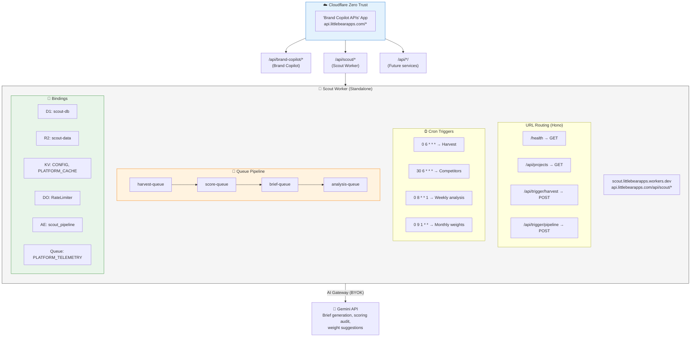
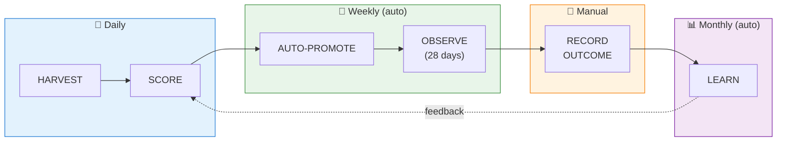
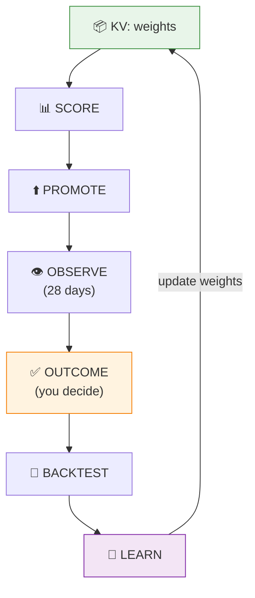
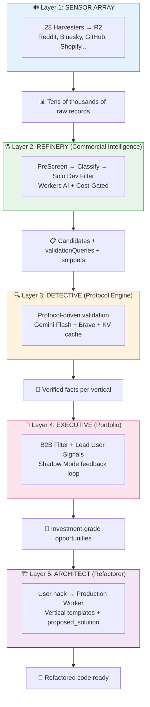
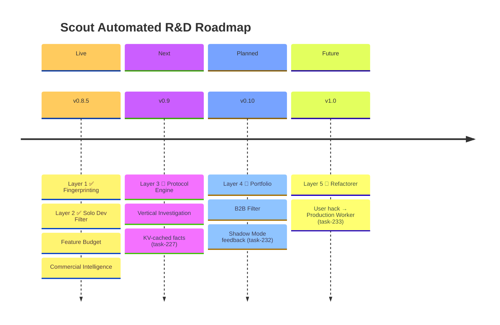
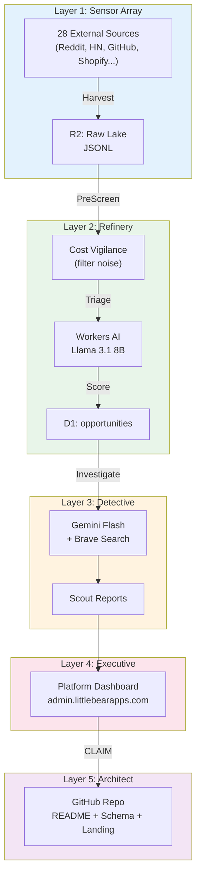
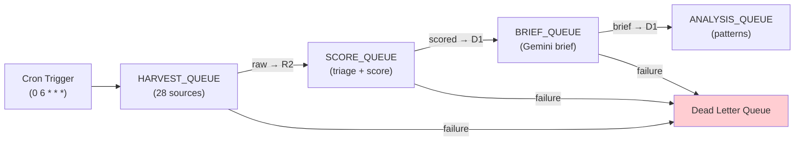
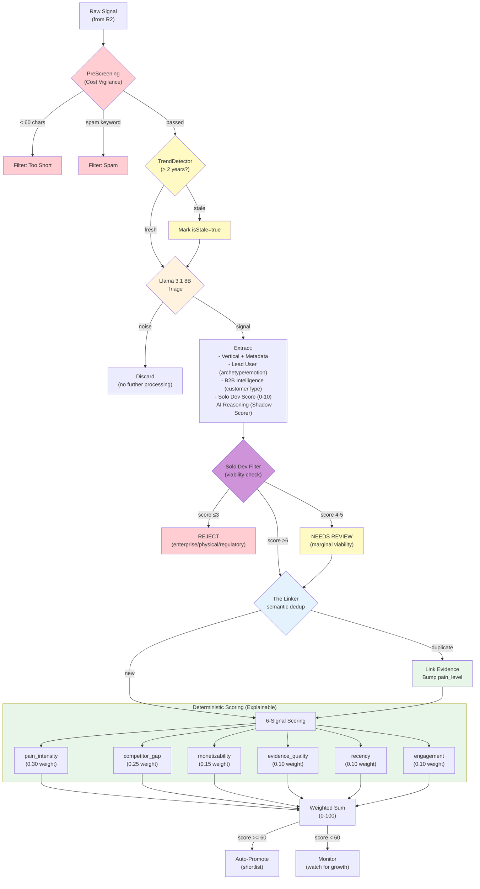
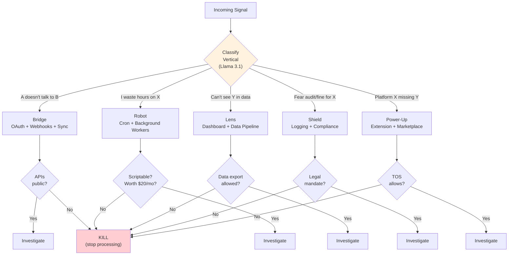
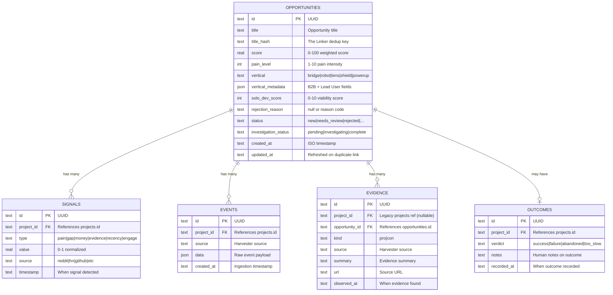

# scout Code Summary

**Version:** v0.8.5
**Generated:** 2026-01-21
**Repository:** [littlebearapps/scout](https://github.com/littlebearapps/scout)

---


This file is a merged representation of a subset of the codebase, containing specifically included files and files not matching ignore patterns, combined into a single document by Repomix.
The content has been processed where comments have been removed, empty lines have been removed.

# File Summary

## Purpose
This file contains a packed representation of a subset of the repository's contents that is considered the most important context.
It is designed to be easily consumable by AI systems for analysis, code review,
or other automated processes.

## File Format
The content is organized as follows:
1. This summary section
2. Repository information
3. Directory structure
4. Repository files (if enabled)
5. Multiple file entries, each consisting of:
  a. A header with the file path (## File: path/to/file)
  b. The full contents of the file in a code block

## Usage Guidelines
- This file should be treated as read-only. Any changes should be made to the
  original repository files, not this packed version.
- When processing this file, use the file path to distinguish
  between different files in the repository.
- Be aware that this file may contain sensitive information. Handle it with
  the same level of security as you would the original repository.

## Notes
- Some files may have been excluded based on .gitignore rules and Repomix's configuration
- Binary files are not included in this packed representation. Please refer to the Repository Structure section for a complete list of file paths, including binary files
- Only files matching these patterns are included: workers/src/**/*.ts, CLAUDE.md, quickrefs/*.md
- Files matching these patterns are excluded: **/*.test.ts, **/__tests__/**, **/node_modules/**, backlog/archive/**, backlog/completed/**, docs/archived/**, docs/plans/**, **/dist/**, **/coverage/**, **/.wrangler/**, *.lock, *.log, repomix-*.md, repomix-*.xml
- Files matching patterns in .gitignore are excluded
- Files matching default ignore patterns are excluded
- Code comments have been removed from supported file types
- Empty lines have been removed from all files
- Files are sorted by Git change count (files with more changes are at the bottom)

# Directory Structure
```
quickrefs/
  ai-scoring.md
  api-rate-limits.md
  architecture.md
  d1-costs.md
  ENGINE_LAYERS.md
  observability.md
  outcome-tracking.md
  platform-sdk.md
  roadmap.md
  testing.md
  troubleshooting.md
  VISUAL_MAP.md
workers/
  src/
    ai/
      cost-tracker.ts
      scoring-auditor.ts
      weight-suggester.ts
      workers-ai-tracker.ts
    analysis/
      backtest.ts
      baseline-calculator.ts
      brief-validator.ts
      enhanced-evidence.ts
      evidence-collector.ts
      html-digest.ts
      index.ts
      learning-pass.ts
    durable/
      rate-limiter.ts
    handlers/
      ai-health.ts
      analysis.ts
      auto-promote.ts
      brief.ts
      competitors.ts
      daily-dispatch.ts
      dlq.ts
      harvest.ts
      harvester-status.ts
      health.ts
      kpi-dashboard.ts
      kpi.ts
      monitoring.ts
      outcomes.ts
      score.ts
      serp.ts
      ui.ts
      usage-monitor.ts
    harvesters/
      layer1/
        apple-app-store.ts
        bluesky-bronze.ts
        bluesky-pain.ts
        cfpb.ts
        dataforseo.ts
        devto-bronze.ts
        devto.ts
        g2-capterra.ts
        github-discussions.ts
        github-trending.ts
        github.ts
        google-trends.ts
        hackernews.ts
        helpers.ts
        hn-jobs.ts
        huggingface.ts
        index.ts
        lemmy.ts
        libraries-io.ts
        mastodon-bronze.ts
        mastodon.ts
        npm-registry.ts
        nvd.ts
        openalex.ts
        podcast-index.ts
        producthunt.ts
        pypi.ts
        reddit.ts
        rss.ts
        rubygems.ts
        sec-edgar.ts
        shopify-community.ts
        stackoverflow.ts
        types.ts
        usaspending.ts
        wikipedia-trends.ts
        x-twitter.ts
        youtube.ts
      layer2/
        index.ts
        types.ts
    lib/
      platform-sdk/
        constants.ts
        index.ts
        proxy.ts
        telemetry.ts
        types.ts
      ae-helpers.ts
      ai-config.ts
      api-cost-tracker.ts
      api-response.ts
      api-validation.ts
      circuit-breaker.ts
      cron-idempotent.ts
      csv-parser.ts
      d1-utils.ts
      features.ts
      graphql-metrics.ts
      healthcheck.ts
      llm-utils.ts
      metrics-buffer.ts
      metrics.ts
      notifications.ts
      outcome-validation.ts
      pipeline-run.ts
      pipeline-runs.ts
      rate-limit-helper.ts
      retention.ts
      string-utils.ts
    middleware/
      admin-auth.ts
      auth.ts
      tracing.ts
    routes/
      admin.ts
      ai.ts
      analysis.ts
      competitors.ts
      dispatch.ts
      dlq.ts
      health.ts
      index.ts
      kpi.ts
      misc.ts
      monitor.ts
      opportunities.ts
      outcomes.ts
      projects.ts
      promote.ts
      serp.ts
      triggers.ts
      ui.ts
    scoring/
      competitor-check.ts
      competitor-discovery.ts
      competitor-snapshot.ts
      index.ts
      platform-readiness.ts
      pre-screening.ts
      serp-saturation.ts
      signal-correlator.ts
      solo-dev-filter.ts
      trend-detector.ts
      types.ts
    utils/
      db.ts
      r2-tracked.ts
    workflows/
      triage-workflow.ts
    index.ts
CLAUDE.md
```

# Files

## File: quickrefs/ai-scoring.md
`````markdown
# AI Scoring Intelligence - Quick Reference

v0.5.5 AI-assisted scoring calibration troubleshooting guide.

## Signal Weights (v0.6.2)

Updated weights with recency/engagement signals for improved differentiation:

| Signal | Weight | Description |
|--------|--------|-------------|
| pain_intensity | 0.30 | Keyword-based pain point detection |
| competitor_gap | 0.25 | SERP saturation (inverse) |
| monetizability | 0.15 | Commercial intent signals |
| evidence_quality | 0.10 | Event freshness + diversity |
| recency | 0.10 | Discovery/activity freshness (14-day half-life) |
| engagement | 0.10 | Stars, votes, comments (log-scaled) |

**Files**: `workers/src/handlers/score.ts` (calculateRecency, calculateEngagement)

## Components Overview

| Component | File | Purpose |
|-----------|------|---------|
| Scoring Auditor | `workers/src/ai/scoring-auditor.ts` | Bi-weekly scoring drift detection |
| Brief Validator | `workers/src/analysis/brief-validator.ts` | Per-brief quality scoring |
| Weight Suggester | `workers/src/ai/weight-suggester.ts` | Monthly weight proposals |
| Cost Tracker | `workers/src/ai/cost-tracker.ts` | LLM spend monitoring |
| AI Config | `workers/src/lib/ai-config.ts` | KV feature flags |
| Cron Idempotent | `workers/src/lib/cron-idempotent.ts` | Duplicate run prevention |

## API Operations

**Setup** (define once):
```bash
export SCOUT="https://api.littlebearapps.com/api/scout"
export CF_ID=$(security find-generic-password -s "CF-Access-Scout-Pipeline-ClientID" -w)
export CF_SEC=$(security find-generic-password -s "CF-Access-Scout-Pipeline-ClientSecret" -w)
export BEARER=$(security find-generic-password -s "SCOUT_CRON_BEARER_TOKEN" -w)
export ADMIN=$(security find-generic-password -s "SCOUT_ADMIN_BEARER_TOKEN" -w)
alias scout='curl -H "CF-Access-Client-Id:$CF_ID" -H "CF-Access-Client-Secret:$CF_SEC"'
```

**Endpoints** (use `scout` alias):
| Operation | Method | Endpoint | Auth |
|-----------|--------|----------|------|
| Manual audit | POST | `/api/trigger/audit` | Bearer |
| Latest audit | GET | `/api/audit/latest` | Bearer |
| Costs | GET | `/api/ai/costs/summary?period={day,week}` | Bearer |
| Weights | GET | `/api/weights/current` | Bearer |
| Pending proposals | GET | `/api/weights/pending` | Bearer |
| Approve proposal | POST | `/api/weights/approve/{runId}` | Admin |
| Reject proposal | POST | `/api/weights/reject/{runId}` | Admin |
| Outcome count | GET | `/api/outcomes/count` | - |
| Record outcome | POST | `/api/outcomes/record` | Admin |

**Examples**:
```bash
scout -H "Authorization: Bearer $BEARER" "$SCOUT/api/audit/latest" | jq .
scout -X POST -H "Authorization: Bearer $ADMIN" "$SCOUT/api/weights/approve/RUN_ID"
scout -X POST -H "Authorization: Bearer $ADMIN" -H "Content-Type: application/json" \
  -d '{"project_id":"cand_xxx","action":"shipped","realized":{"stars_delta":50}}' \
  "$SCOUT/api/outcomes/record"
```

## Troubleshooting

### Cron Not Running

**Symptoms**: Audit or weight suggestion cron not firing

**Check cron_runs table**:
```bash
# Via D1 console or MCP
SELECT * FROM cron_runs ORDER BY started_at DESC LIMIT 10;
```

**Possible causes**:
- `status = 'running'` but stale (>10 min) - Will auto-recover next run
- `status = 'completed'` for today - Already ran today, wait until tomorrow
- Lock held in KV - Check `lock:audit` or `lock:weight_suggestion` keys

**Recovery**:
```bash
# Clear stale KV lock (if needed)
npx wrangler kv key delete --namespace-id=YOUR_KV_ID "lock:audit" --remote
```

### Budget Exceeded

**Symptoms**: LLM calls failing, costs approaching $2/week

**Check current spend**:
```bash
curl ".../api/ai/costs/summary?period=week" | jq '.data.budget_used_pct'
```

**Recovery options**:
1. Wait for new week (budget resets Sunday)
2. Temporarily disable LLM in KV:
   ```bash
   npx wrangler kv key put --namespace-id=YOUR_KV_ID "ai_analysis/config" \
     '{"disable_all_llm_analysis": true}' --remote
   ```

### Weight Suggester Status

**Current**: ✅ Unblocked (52 outcomes, threshold 30 met as of 2025-12-07)

**Check**:
```bash
curl ".../api/outcomes/count" | jq '.data'
# Status: ready=true when count >= 30
```

**If blocked**: Record outcomes via `/api/outcomes/record` (see quickrefs/outcome-tracking.md)

### Audit Results Empty

**Symptoms**: `/api/audit/latest` returns empty

**Possible causes**:
1. No audit has run yet - Check `cron_runs` table
2. No candidates to audit - Check `projects` table for scored candidates
3. LLM disabled - Check KV config

**Debug**:
```bash
# Check for audit results
SELECT COUNT(*) FROM audit_results;

# Check for auditable candidates
SELECT COUNT(*) FROM projects WHERE status = 'scored' AND score >= 40;
```

### Pending Proposals Not Appearing

**Symptoms**: `/api/weights/pending` returns empty but expect proposals

**Check**:
```bash
SELECT * FROM learning_proposals ORDER BY run_at DESC LIMIT 5;
```

**Possible causes**:
- Proposals already approved/rejected (`status != 'pending'`)
- Not enough outcome data to generate proposals
- Weight suggester hasn't run this month

## KV Configuration Reference

**Namespace**: `CONFIG`
**Key**: `ai_analysis/config`

| Flag | Default | Description |
|------|---------|-------------|
| `brief_validator_enabled` | true | Enable brief validation |
| `scoring_auditor_enabled` | true | Enable scoring audits |
| `weight_suggester_enabled` | true | Enable weight proposals |
| `brief_validator_mode` | "rules" | "rules", "hybrid", or "llm_only" |
| `use_llm_for_audit` | true | Use LLM for audit analysis |
| `use_ai_gateway` | true | Route through AI Gateway |
| `fallback_to_direct_gemini` | true | Fallback if gateway fails |
| `llm_validation_daily_budget_cents` | 50 | Daily LLM budget |
| `cost_tracking_enabled` | true | Track LLM costs |
| `disable_all_llm_analysis` | false | Kill switch for all LLM |

### Update Config

```bash
npx wrangler kv key put --namespace-id=YOUR_KV_ID "ai_analysis/config" \
  '{"brief_validator_mode": "hybrid"}' --remote
```

## Budget Reference

| Period | Budget | Typical Usage |
|--------|--------|---------------|
| Day | $0.30 | ~3-5 audits |
| Week | $2.00 | Bi-weekly audits + briefs |
| Month | $8.00 | All AI features |

**Cost per operation** (gemini-2.5-flash):
- Audit (per candidate): ~$0.0001
- Brief validation: ~$0.0005
- Weight suggestion: ~$0.002

## Brief Validator Required Sections

Briefs must include these 8 sections for full completeness score:

| Section | Header | Content |
|---------|--------|---------|
| Summary | `## Summary` | 2-3 sentence overview |
| Problem | `## Problem` | Pain point with examples |
| Target Users | `## Target Users` | Bullet list of personas |
| Solution | `## Solution` | High-level approach |
| MVP Features | `## MVP Features` | Numbered list (5-7) |
| Timeline | `## Timeline` | 14-day implementation plan |
| Risks | `## Risks` | Top 3 with mitigations |
| Success Metrics | `## Success Metrics` | Quantifiable goals |

**Check validation scores**:
```bash
curl ".../api/debug/query" -d '{"sql": "SELECT overall_score, completeness FROM brief_validations ORDER BY validated_at DESC LIMIT 5"}'
```

## Related Files

- `workers/src/index.ts` - API routes (~1600 lines)
- `workers/src/ai/scoring-auditor.ts` - Audit logic (~400 lines)
- `workers/src/ai/weight-suggester.ts` - Weight proposals (~350 lines)
- `workers/src/analysis/brief-validator.ts` - Brief scoring (~470 lines)
- `workers/src/handlers/brief.ts` - Brief generation prompt (~365 lines)
- `workers/src/lib/ai-config.ts` - Feature flags (~185 lines)
- `workers/src/lib/cron-idempotent.ts` - Cron helpers (~345 lines)
`````

## File: quickrefs/api-rate-limits.md
`````markdown
# API Rate Limits & Cost Tracking - Quick Reference

Scout external API rate limiting and cost monitoring guide (task-112).

## API Rate Limits Overview

| API            | Limit  | Window   | Cost/Request | Type          |
| -------------- | ------ | -------- | ------------ | ------------- |
| GitHub         | 5,000  | 1 hour   | Free         | Authenticated |
| Gemini         | 60     | 1 minute | Token-based  | Free tier     |
| Product Hunt   | 450    | 24 hours | Free         | GraphQL       |
| DataForSEO     | 100    | 1 hour   | ~$0.003      | **Paid**      |
| Hacker News    | 1,000  | 1 hour   | Free         | Algolia       |
| Dev.to         | 300    | 1 minute | Free         | Forem         |
| Stack Exchange | 10,000 | 24 hours | Free         | With API key  |
| Bluesky        | 300    | 1 hour   | Free         | Public API    |
| Lemmy          | 300    | 1 hour   | Free         | REST API      |
| Mastodon       | 200    | 1 hour   | Free         | REST API      |

### Layer 1 Harvesters (v0.7.10) - 27 Working, 2 Blocked

| Source             | Limit   | Window | Status | Notes                                                         |
| ------------------ | ------- | ------ | ------ | ------------------------------------------------------------- |
| `reddit`           | 30      | 1 day  | ✅     | Composio SDK (OAuth)                                          |
| `devto-layer1`     | 30      | 1 min  | ✅     | REST, filters `comments_count > 5`                            |
| `mastodon-layer1`  | 60      | 5 min  | ✅     | REST, filters `replies_count > 0`                             |
| `bluesky-pain`     | 50      | 1 min  | ✅     | Requires app password auth                                    |
| `hn-jobs`          | 10      | 1 min  | ✅     | Firebase API, polite rate                                     |
| `openalex`         | 100     | 1 min  | ✅     | REST, mailto for polite pool                                  |
| `cfpb`             | 50      | 1 min  | ✅     | Consumer complaints API                                       |
| `nvd`              | 50      | 30s    | ✅     | NIST NVD with API key                                         |
| `x-twitter`        | 25 runs | 1 day  | ✅     | Apify scrape.badger/twitter-tweets-scraper (~$0.20/1K tweets) |
| `huggingface`      | 50      | 1 min  | ✅     | HF Hub API                                                    |
| `wikipedia-trends` | 10      | 1 min  | ✅     | Wikimedia pageviews (1-day lag)                               |
| `google-trends`    | 1       | 1 hr   | ✅     | Google Trends RSS feed                                        |
| ~~`chromestats`~~  | -       | -      | ❌     | **REMOVED** - Code deleted 2026-01-17 (R2 CSVs preserved)     |
| `apple-app-store`  | 30      | 12 hr  | ✅     | iTunes RSS (charts + reviews, pain signals 1-3 stars)         |
| `youtube`          | 10      | 1 day  | ✅     | YouTube Data API v3 (10k units/day, search=100, comments=1)   |
| `g2-capterra`      | 8       | 1 day  | ✅     | Google CSE (100/day free), B2B review snippets                |
| ~~`usaspending`~~  | -       | -      | ⚠️     | **BLOCKED** - HTTP 525 TLS                                    |
| ~~`libraries-io`~~ | -       | -      | ⚠️     | **BLOCKED** - HTTP 502 IP block                               |

**Migrated from Bronze (task-153)** - now use unified Layer 1 architecture:
| Source | Limit | Window | Notes |
|--------|-------|--------|-------|
| `github` | 5,000 | 1 hr | Authenticated |
| `hackernews` | 1,000 | 1 hr | Algolia API |
| `devto-bronze` | 300 | 1 min | Tag-based |
| `lemmy` | 300 | 1 hr | programming.dev |
| `mastodon-bronze` | 200 | 1 hr | hachyderm.io |
| `bluesky-bronze` | 300 | 1 hr | Firehose |
| `github_discussions` | 5,000 | 1 hr | GraphQL, shared quota |
| `github_trending` | 5,000 | 1 hr | Search, shared quota |
| `producthunt` | 450 | 24 hr | GraphQL |
| `stackoverflow` | 10,000 | 24 hr | With API key |
| `rss` | 20 | 1 hr | Platform changelogs |
| `dataforseo` | 100 | 1 hr | **PAID** (~$0.003/req) |

## Budget Limits

| Period  | Limit | Warning (80%) |
| ------- | ----- | ------------- |
| Daily   | $0.25 | $0.20         |
| Weekly  | $1.50 | $1.20         |
| Monthly | $5.00 | $4.00         |

## Architecture

```
Harvester → RateLimitHelper.consume() → RateLimiter DO
         ↓
    API Call (if allowed)
         ↓
    ApiCostTracker.trackApiCall() → Analytics Engine (scout_pipeline)
         ↓
    Budget Check (DataForSEO only)
         ↓
    Slack Alert (if warning/exceeded)
```

## Key Files

| File                                   | Purpose                          |
| -------------------------------------- | -------------------------------- |
| `workers/src/lib/rate-limit-helper.ts` | Rate limit consumption helper    |
| `workers/src/lib/api-cost-tracker.ts`  | Cost tracking & budget checking  |
| `workers/src/durable/rate-limiter.ts`  | Durable Object for rate limiting |
| `workers/src/lib/notifications.ts`     | Budget alert notifications       |
| `workers/src/harvesters/layer1/`       | All harvesters (unified Layer 1) |

## Common Operations

**Setup** (define once, same as ai-scoring.md):

```bash
export SCOUT="https://api.littlebearapps.com/api/scout"
export CF_ID=$(security find-generic-password -s "CF-Access-Scout-Pipeline-ClientID" -w)
export CF_SEC=$(security find-generic-password -s "CF-Access-Scout-Pipeline-ClientSecret" -w)
export BEARER=$(security find-generic-password -s "SCOUT_CRON_BEARER_TOKEN" -w)
alias scout='curl -H "CF-Access-Client-Id:$CF_ID" -H "CF-Access-Client-Secret:$CF_SEC"'
```

**Endpoints** (use `scout` alias):
| Operation | Method | Endpoint | Auth |
|-----------|--------|----------|------|
| Rate limit status | GET | `/api/ratelimit/status` | Bearer |
| Cost summary | GET | `/api/costs/summary?period={day,week,month}` | Bearer |
| Budget status | GET | `/api/costs/budget` | Bearer |
| Reset rate limit | POST | `/api/ratelimit/reset` | Admin |

**Examples**:

```bash
scout -H "Authorization: Bearer $BEARER" "$SCOUT/api/ratelimit/status" | jq .
scout -H "Authorization: Bearer $BEARER" "$SCOUT/api/costs/summary?period=week" | jq .
```

**Analytics Engine schema**: `index1='api_costs'`, `blob1`=api, `blob2`=endpoint, `double1`=cost_usd, `double2`=request_count

## Troubleshooting

### Rate Limit Exceeded

**Symptom**: Harvester logs show "Rate limit exceeded, retry after Xms"

**Resolution**:

1. Check rate limit status via API (see above)
2. Wait for window to reset (automatic)
3. If urgent, reset via admin endpoint:

```bash
curl -X POST "https://api.littlebearapps.com/api/scout/api/ratelimit/reset" \
  -H "CF-Access-Client-Id: $CF_CLIENT_ID" \
  -H "CF-Access-Client-Secret: $CF_CLIENT_SECRET" \
  -H "Authorization: Bearer $ADMIN_TOKEN" \
  -H "Content-Type: application/json" \
  -d '{"service": "github"}'
```

### Budget Exceeded (DataForSEO Blocked)

**Symptom**: ntfy.sh alert "API Budget EXCEEDED", DataForSEO calls return empty

**Impact**: Only DataForSEO is blocked; free APIs continue working

**Resolution**:

1. Wait for next billing cycle (month resets)
2. Or increase budget in `api-cost-tracker.ts`:
   ```typescript
   export const MONTHLY_API_BUDGET_USD = 10.0; // Was 5.0
   ```
3. Redeploy worker

### Budget Warning Notifications

**Symptom**: ntfy.sh alert "API Budget Warning"

**Meaning**: Usage at 80% of daily/weekly/monthly limit

**Action**: Monitor usage, consider reducing DataForSEO calls

### Missing Cost Data

**Symptom**: `/api/costs/summary` shows 0 requests

**Check**:

1. Verify Analytics Engine is receiving data - check wrangler.jsonc has `ANALYTICS` binding
2. Trigger a harvest to generate cost entries
3. Check harvester logs for `[API Cost Tracker]` entries

## Analytics Engine Schema

API costs migrated from D1 to Analytics Engine (2026-01-03). Historical data archived to R2.

```
Dataset: scout_pipeline
index1: 'api_costs'
blob1: api name (github, dataforseo, etc.)
blob2: endpoint
double1: cost_usd
double2: request_count
```

**Archive**: `R2 scout-data/archives/api_costs_2026-01-03.json` (7,224 records)

## Notification Events

| Event                    | Priority | When                         |
| ------------------------ | -------- | ---------------------------- |
| Budget Warning (Daily)   | high     | Daily spend ≥ 80% of $0.25   |
| Budget Warning (Weekly)  | high     | Weekly spend ≥ 80% of $1.50  |
| Budget Warning (Monthly) | high     | Monthly spend ≥ 80% of $5.00 |
| Budget Exceeded          | urgent   | Monthly spend ≥ $5.00        |

Notifications sent via Slack webhook (requires `SLACK_WEBHOOK_URL` secret configured).

## See Also

- `quickrefs/troubleshooting.md` - General Workers troubleshooting
- `quickrefs/ai-scoring.md` - LLM cost tracking (separate from API costs)
- `workers/src/durable/rate-limiter.ts` - Durable Object implementation
`````

## File: quickrefs/architecture.md
`````markdown
# Quick Reference: Architecture

## Cloudflare Workers Architecture (v0.6 - Production)

> **Status**: Scout runs on Cloudflare Workers as of 2025-11-27.
> **Full Design Doc**: `docs/plans/scout-cloudflare-migration-design.md`



### Architecture Decision: Standalone Worker

**Why standalone Worker (not Platform Dashboard)?**

| Requirement     | Pages Functions   | Workers Unbound |
| --------------- | ----------------- | --------------- |
| CPU Limit       | 50ms (hard limit) | **30s** ✅      |
| Queue Consumers | ❌ Not supported  | ✅ Full support |
| Cron Triggers   | ❌ Not supported  | ✅ Full support |
| Durable Objects | ⚠️ Limited        | ✅ Full support |

Scout requires 10-30s CPU for brief generation, 5-10s for backtesting.

### Browse UI Integration (v0.6.5 - Complete)

Platform Dashboard (`admin.littlebearapps.com/scout/*`) hosts UI pages that fetch from Scout Worker API via service binding.

**Pages**:

- `/scout` - Dashboard with KPIs, recent projects, health
- `/scout/projects` - All projects with filters/sort/pagination
- `/scout/shortlist` - Score ≥60 projects for review
- `/scout/promoted` - Promoted with outcome tracking
- `/scout/outcomes` - Calibration data
- `/scout/project/[id]` - Detail with signals, outcomes

**Files** (in Platform Dashboard repo):

- `src/pages/api/scout/[...path].ts` - API proxy
- `src/pages/scout/*.astro` - UI pages
- `src/components/scout/*.astro` - Reusable components
- `src/lib/scout/types.ts` - TypeScript interfaces

---

## API Authentication

**See**: `CLAUDE.md` API Authentication section for full details.

| Layer        | Keys (Keychain)                                  | Purpose              |
| ------------ | ------------------------------------------------ | -------------------- |
| Zero Trust   | `CF-Access-Scout-Pipeline-ClientID/ClientSecret` | Network access       |
| Bearer CRON  | `SCOUT_CRON_BEARER_TOKEN`                        | Automated triggers   |
| Bearer ADMIN | `SCOUT_ADMIN_BEARER_TOKEN`                       | Sensitive operations |

---

## Custom Domain Configuration

**wrangler.jsonc**:

```jsonc
"routes": [
  { "pattern": "api.littlebearapps.com/api/scout/*", "zone_name": "littlebearapps.com" }
]
```

**Hono basePath** (`src/index.ts`):

```typescript
const app = new Hono<{ Bindings: Env }>().basePath("/api/scout");
```

**URL Mapping**:
| Custom Domain URL | Worker Route | Handler |
|-------------------|--------------|---------|
| `/api/scout/health` | `/health` | `app.get('/health')` |
| `/api/scout/api/projects` | `/api/projects` | `app.get('/api/projects')` |
| `/api/scout/api/trigger/harvest` | `/api/trigger/harvest` | `app.post('/api/trigger/harvest')` |

---

## Directory Structure

```
scout/
├── workers/              # Cloudflare Worker source (ACTIVE)
│   ├── src/
│   │   ├── index.ts      # Main entry point (Hono app)
│   │   ├── handlers/     # Route handlers
│   │   ├── lib/          # Shared utilities
│   │   └── middleware/   # Auth middleware
│   ├── wrangler.jsonc    # Worker configuration
│   └── docs/             # Worker-specific docs
├── backlog/              # Task management
├── docs/                 # Documentation & plans
├── quickrefs/            # Quick reference guides
├── CLAUDE.md             # Project context
├── README.md             # Project overview
└── CHANGELOG_LOCAL.md    # Version history
```

---

## Layer 1 Harvesters (v0.8.2)

Raw data ingestion to R2 (JSONL). **28 working** sources, 2 blocked.

**Active Sources**: reddit, devto-layer1, mastodon-layer1, bluesky-pain, hn-jobs, openalex, cfpb, nvd, x-twitter, huggingface, wikipedia-trends, google-trends, apple-app-store, podcast-index, sec-edgar, github, hackernews, devto-bronze, lemmy, mastodon-bronze, bluesky-bronze, github_discussions, github_trending, producthunt, stackoverflow, rss, dataforseo, shopify-community

**Removed**: chromestats (2026-01-17 - code deleted, D1 tables dropped, R2 CSVs preserved)

**Blocked**: usaspending (HTTP 525), libraries-io (HTTP 502)

**Files**: `workers/src/harvesters/layer1/`, `workers/src/handlers/layer1.ts`

**Triggers**: 12 crons enabled. Manual: `/api/trigger/layer1?source=<source>`

---

## Layer 2 Processing

**Status**: ✅ Active via `triage-workflow.ts` (v0.8.5)

Layer 2 triage processes Layer 1 signals through Workers AI classification, Solo Dev Filter, and The Linker deduplication.

**Active Components**:

- `workflows/triage-workflow.ts` - AI classification + Solo Dev Filter + The Linker + metadata extraction
- `handlers/score.ts` - 6-signal weighted scoring
- `handlers/brief.ts` - Brief generation (Gemini)

**Solo Dev Filter** (v0.8.5): Viability scoring for indie hackers. Score ≤3 → `rejected` (enterprise/physical/regulatory), 4-5 → `needs_review` (marginal), ≥6 → `new` (good fit). D1 columns: `solo_dev_score`, `rejection_reason`.

**The Linker** (v0.8.1): Deduplicates opportunities using `title_hash` (normalized first 4 words, hashed). O(1) lookup via partial index. When duplicate found: links as evidence, bumps `pain_level`, refreshes `updated_at`.

**Removed** (2026-01-17): Chrome Stats Layer 2 processor - consumed 95%+ of resources, code deleted, R2 CSVs preserved at `layer1/chromestats/` (~48 GB).

---

## D1 Database Schema

**Projects** (opportunities):

```sql
CREATE TABLE projects (
  id TEXT PRIMARY KEY,
  name TEXT NOT NULL,
  score REAL,
  confidence REAL,
  status TEXT,
  created_at TEXT,
  updated_at TEXT
);
```

**Signals** (evidence):

```sql
CREATE TABLE signals (
  id TEXT PRIMARY KEY,
  project_id TEXT,
  type TEXT,
  value REAL,
  source TEXT,
  timestamp TEXT
);
```

**Events** (raw ingested data):

```sql
CREATE TABLE events (
  id TEXT PRIMARY KEY,
  project_id TEXT,
  source TEXT,
  data TEXT,
  created_at TEXT
);
```

---

## D1 Compound Indexes (v0.7.7)

Optimized for common query patterns. Reduces rows_read by 50-90%.

**Core Tables** (migration 0014):
| Index | Table | Pattern |
|-------|-------|---------|
| `idx_projects_status_score` | projects | `WHERE status=? ORDER BY score DESC` |

Note: `pipeline_runs` and `ai_costs` tables migrated to Analytics Engine (v0.7.8).

**ChromeStats Tables**: DROPPED (2026-01-14), code DELETED (2026-01-17) - All `cs_*` tables, indexes, and processor code removed.

---

## API Pagination (v0.7.7)

Opportunities endpoints support both cursor-based (O(1)) and offset-based (O(n)) pagination.

**Cursor format**: `field:value` or composite `field1:val1,field2:val2`

> Note: ChromeStats API endpoints have been removed (2026-01-17). See "Layer 2 Processing" section.

**Backwards compatible**: If only `offset` provided, uses traditional OFFSET pagination.
`````

## File: quickrefs/d1-costs.md
`````markdown
# D1 Cost Management & Cron Re-enablement

**Created**: 2026-01-08
**Updated**: 2026-01-14
**Purpose**: Define go/no-go thresholds and checklist for safe cron re-enablement

## Current Status (2026-01-14)

**Database size**: 57 MB (down from 6 GB)

**Chrome Stats DISABLED**:

- All 13 `cs_*` D1 tables DROPPED (freed ~6 GB)
- Feature flag: `CHROMESTATS_ENABLED=false` in `wrangler.jsonc`
- R2 CSV files preserved (~48 GB at `layer1/chromestats/`)
- Re-enabling requires user confirmation + ~$15 D1 reimport cost

**All 12 crons ENABLED** (2026-01-17) - Layer 1 harvesters + pipeline crons restored.

## Alert Thresholds

| Metric           | Green (Go) | Yellow (Caution) | Red (Stop) |
| ---------------- | ---------- | ---------------- | ---------- |
| Daily D1 writes  | <200k      | 200k-300k        | >333k      |
| Writes per 5 min | <10k       | 10k-30k          | >50k       |
| DLQ messages/day | 0          | 1-5              | >5         |
| Queue drain time | <30min     | 30-60min         | >60min     |
| Monthly cost     | <$5        | $5-8             | >$10       |

## Budget

```
Target: $10/month max
D1 pricing: $1 per 1M writes
Monthly limit: 10M writes
Daily limit: ~333k writes

Current estimate: ~35k writes/day = ~$1.07/month (SAFE)
```

## Pre-Enablement Checklist

### Phase 2 - Low Volume Crons

| Cron                              | Status   | Notes                     |
| --------------------------------- | -------- | ------------------------- |
| Usage Monitoring (`0 4 * * *`)    | [x] Safe | Read-only, minimal writes |
| Evidence Collection (`0 5 * * *`) | [x] Safe | Batched via `db.batch()`  |
| Podcast Index (`0 */6 * * *`)     | [x] Safe | Idempotent via ingest_log |

### Phase 3 - Layer 1 Harvesters

| Check             | Status       | Evidence                                              |
| ----------------- | ------------ | ----------------------------------------------------- |
| Idempotent writes | [x] Verified | `ON CONFLICT DO NOTHING` in ingest_log                |
| Deduplication     | [x] Verified | `deduplicateRecords()` in helpers.ts:218-282          |
| Retry safe        | [x] Verified | `max_retries=2` (layer1-queue) for faster DLQ routing |

**Crons to enable**:

- Layer 1 Harvest (`0 3 * * *`)
- Daily Harvest (`0 6 * * *`)

### Phase 4 - Full Restoration

| Cron                                | Status   | Notes                       |
| ----------------------------------- | -------- | --------------------------- |
| Weekly Auto-Promote (`0 7 * * SUN`) | [x] Safe | Low frequency               |
| Weekly Analysis (`0 8 * * 1`)       | [x] Safe | Batched brief writes        |
| Bi-weekly Audit (`0 10 * * 1,4`)    | [x] Safe | Low frequency               |
| Monthly Calibration (`0 9 1 * *`)   | [x] Safe | Once per month              |
| Monthly Weights (`0 10 2 * *`)      | [x] Safe | Once per month              |
| Monthly Cleanup (`0 12 1 * *`)      | [x] Safe | Deletes use indexed columns |

## Monitoring Commands

```bash
# Set credentials
CF_CLIENT_ID=$(security find-generic-password -s "CF-Access-Scout-Pipeline-ClientID" -w)
CF_CLIENT_SECRET=$(security find-generic-password -s "CF-Access-Scout-Pipeline-ClientSecret" -w)
BEARER=$(security find-generic-password -s "SCOUT_CRON_BEARER_TOKEN" -w)

# Health check
curl -s "https://api.littlebearapps.com/api/scout/health" \
  -H "CF-Access-Client-Id: $CF_CLIENT_ID" \
  -H "CF-Access-Client-Secret: $CF_CLIENT_SECRET" | jq .

# DLQ check (should be 0)
curl -s "https://api.littlebearapps.com/api/scout/api/dlq?limit=20" \
  -H "CF-Access-Client-Id: $CF_CLIENT_ID" \
  -H "CF-Access-Client-Secret: $CF_CLIENT_SECRET" \
  -H "Authorization: Bearer $BEARER" | jq ".messages | length"

# Processing status (NOTE: ChromeStats endpoints return 503 - disabled)
# curl -s "https://api.littlebearapps.com/api/scout/api/chromestats/processing/status" \
#   -H "CF-Access-Client-Id: $CF_CLIENT_ID" \
#   -H "CF-Access-Client-Secret: $CF_CLIENT_SECRET" \
#   -H "Authorization: Bearer $BEARER" | jq .
```

## Dashboard Checks

1. **Cloudflare Dashboard** → D1 → scout-db → Metrics tab
2. Compare writes before/after each phase
3. Target: <100k writes on processing days

## Rollback Plan

If D1 costs spike or errors occur:

1. **Immediate**: Disable crons in `wrangler.jsonc`, redeploy
2. **Investigate**: Check DLQ, Cloudflare logs, DO status
3. **Fix**: Address root cause before re-enabling
4. **Gradual**: Re-enable one cron at a time with monitoring

## Enablement Procedure

```bash
cd workers

# Edit wrangler.jsonc - uncomment desired crons
# Deploy
npx wrangler deploy

# Commit
git add wrangler.jsonc
git commit -m "chore: enable Phase N crons"
git push
```

## Future Optimizations

Not blocking re-enablement, but could reduce costs further:

| Optimization     | Table    | Expected Savings |
| ---------------- | -------- | ---------------- |
| Add content_hash | signals  | 50-80%           |
| Change detection | projects | 30-50%           |

## Related Documentation

- **Write Model**: `docs/d1-write-model.md`
- **Observability**: `quickrefs/observability.md` (D1 Alert Thresholds section)
- **Parent task**: `backlog/tasks/task-214`
`````

## File: quickrefs/ENGINE_LAYERS.md
`````markdown
# Quick Reference: Engine Layers

Technical map of Scout's 5-layer funnel architecture with file paths and Cloudflare bindings.

---

## Layer Quick Reference

| Layer | Name         | Job                 | Status     | Key Files                         |
| ----- | ------------ | ------------------- | ---------- | --------------------------------- |
| 1     | Sensor Array | Don't miss anything | ✅ Live    | `harvesters/layer1/*.ts`          |
| 2     | Refinery     | Is this signal?     | ✅ Live    | `handlers/score.ts`, `workflows/` |
| 3     | Detective    | Worth building?     | 🚧 Next    | TBD                               |
| 4     | Executive    | Show diamonds       | 🔮 Partial | Platform Dashboard                |
| 5     | Architect    | Hello World         | 🔮 Future  | TBD                               |

---

## Data Flow Diagram

```
┌─────────────────────────────────────────────────────────────────────────────┐
│ EXTERNAL SOURCES (28 APIs)                                                  │
│ Reddit, Dev.to, GitHub, HN, Bluesky, ProductHunt, Stack Overflow, etc.     │
└────────────────────────────────┬────────────────────────────────────────────┘
                                 │ Layer 1: Harvest
                                 ▼
┌─────────────────────────────────────────────────────────────────────────────┐
│ R2: scout-data bucket                                                       │
│ layer1/{source}/{YYYY}/{MM}/{DD}/{source}_{timestamp}.jsonl                 │
└────────────────────────────────┬────────────────────────────────────────────┘
                                 │ Layer 2: Triage + Score
                                 ▼
┌─────────────────────────────────────────────────────────────────────────────┐
│ Workers AI (Llama 3.1 8B) → Solo Dev Filter → The Linker → D1: opportunities│
│ Classify verticals, viability score (≤3 reject), link duplicates, scoring   │
└────────────────────────────────┬────────────────────────────────────────────┘
                                 │ Layer 3: Investigate (Planned)
                                 ▼
┌─────────────────────────────────────────────────────────────────────────────┐
│ Gemini Flash + Brave Search  →  D1: scout_reports                           │
│ Deep research + kill conditions                                              │
└────────────────────────────────┬────────────────────────────────────────────┘
                                 │ Layer 4: Present
                                 ▼
┌─────────────────────────────────────────────────────────────────────────────┐
│ Platform Dashboard (admin.littlebearapps.com/scout/*)                       │
│ Browse, filter by vertical, CLAIM ideas                                      │
└────────────────────────────────┬────────────────────────────────────────────┘
                                 │ Layer 5: Scaffold (Future)
                                 ▼
┌─────────────────────────────────────────────────────────────────────────────┐
│ GitHub API + Templates  →  New Repository                                   │
│ README, schema.sql, landing-page.copy, vertical-specific code               │
└─────────────────────────────────────────────────────────────────────────────┘
```

---

## Layer 1: Sensor Array

**Job**: Don't miss anything - harvest raw data from 28 sources.

**Cloudflare Bindings**:

- R2: `scout-data` (raw JSONL/CSV storage)
- D1: `ingest_log` (deduplication tracking)
- DO: `RATE_LIMITER` (API rate limiting)

**Key Files**:
| File | Purpose |
|------|---------|
| `workers/src/harvesters/layer1/index.ts` | Harvester registry |
| `workers/src/harvesters/layer1/types.ts` | `Layer1RawRecord` schema |
| `workers/src/harvesters/layer1/helpers.ts` | Dedup, R2 paths, fingerprinting, payload protection |
| `workers/src/handlers/harvest.ts` | Queue message handler |

**Content Fingerprinting** (v0.8.5): Cross-source deduplication using djb2 hash of normalized title + text.

- Format: `cfp_<11-char-hash>` (e.g., `cfp_0001k2j3m4n`)
- D1 columns: `ingest_log.fingerprint`, `occurrence_count`, `last_seen`
- Detects same topic across sources (e.g., Reddit AND HN discussing same pain point)
- When duplicate fingerprint: increments `occurrence_count`, updates `last_seen`

**Sources by Category**:
| Category | Sources |
|----------|---------|
| Social | Reddit, Dev.to, Mastodon, Bluesky, Lemmy, HN |
| Code | GitHub (3), npm, PyPI, HuggingFace, Stack Overflow |
| Money | App Store, G2, ProductHunt, SEC-EDGAR |
| Trends | Google Trends, Wikipedia, Podcast Index |
| Security | NVD (CVEs), CFPB |
| Ecosystem | Shopify Community |

**Trigger**: `POST /api/trigger/layer1?source=<name>`

---

## Layer 2: Refinery

**Job**: Is this noise, or is this a signal?

**Cloudflare Bindings**:

- Workers AI: `AI` (Llama 3.1 8B classification)
- D1: `projects`, `signals`, `opportunities`
- KV: `CONFIG` (weights, thresholds)
- Queues: `SCORE_QUEUE`, `BRIEF_QUEUE`

**Key Files**:
| File | Purpose |
|------|---------|
| `workers/src/workflows/triage-workflow.ts` | Durable workflow + The Linker |
| `workers/src/handlers/score.ts` | 6-signal weighted scoring |
| `workers/src/handlers/brief.ts` | Brief generation (Gemini) |

**The Linker** (v0.8.1): Deduplicates opportunities using `title_hash` (normalized first 4 words, hashed). O(1) lookup via partial index `idx_opportunities_title_hash`. When duplicate found: links as evidence via `opportunity_id` FK, bumps `pain_level` (+1, capped at 10), refreshes `updated_at`.

**Signal Weights** (v0.6.2):
| Signal | Weight | Calculation |
|--------|--------|-------------|
| pain_intensity | 0.30 | Keyword detection (frustrated, broken, need, time, money) |
| competitor_gap | 0.25 | 1 - SERP saturation |
| monetizability | 0.15 | Commercial keywords + engagement signals |
| evidence_quality | 0.10 | Freshness + source diversity |
| recency | 0.10 | 14-day exponential decay |
| engagement | 0.10 | Log-scaled stars/votes/comments |

**Vertical Classification**:
| Vertical | Signal | Metadata Fields |
|----------|--------|-----------------|
| `integration` | "A doesn't talk to B" | `source_a`, `source_b`, `sync_direction` |
| `automation` | "I waste hours on X" | `trigger_type`, `frequency`, `manual_time_estimate` |
| `compliance` | "Fear audit/fine" | `regulation`, `deadline`, `fine_risk` |
| `analytics` | "Can't see Y in data" | `data_source`, `missing_view`, `export_format` |
| `plugin` | "Platform X missing Y" | `platform`, `extension_type`, `marketplace` |

**Lead User Classification** (v0.8.2):
| Field | Values | Description |
|-------|--------|-------------|
| `userArchetype` | `LeadUser`, `Complainer`, `General` | Von Hippel classification |
| `emotionClass` | `Frustration`, `Desire`, `Apathy`, `Confusion` | Emotional signal type |

- **LeadUser**: Expert solving own problem (technical depth, workarounds tried)
- **Complainer**: Venting without detail (emotional, vague, no solutions)
- **General**: Neutral inquiry or observation

**B2B Intelligence** (v0.8.2):
| Field | Values | Description |
|-------|--------|-------------|
| `customerType` | `B2B`, `Consumer`, `Prosumer` | Target market classification |
| `validationQueries` | `string[]` | 3 search queries for Layer 3 competitor research |

- **B2B**: Business context (company, team, org, enterprise, API, workflow)
- **Consumer**: Personal use (individual, hobby, personal project)
- **Prosumer**: Professional individual (freelancer, solopreneur, power user)

**Solo Dev Filter** (v0.8.5): Viability scoring for indie hackers - rejects opportunities unsuitable for solo development.

| Score | Action      | Status         | Examples                                              |
| ----- | ----------- | -------------- | ----------------------------------------------------- |
| 0-3   | Auto-reject | `rejected`     | Physical logistics, enterprise sales, regulatory risk |
| 4-5   | Flag review | `needs_review` | Marginal viability, needs human assessment            |
| 6-10  | Pass        | `new`          | Good solo dev fit, code-first opportunities           |

**Rejection Reasons**:

- `physical_logistics`: Requires shipping, hardware, inventory
- `enterprise_sales`: Long sales cycles, procurement, RFP
- `regulatory_risk`: FDA, FINRA, HIPAA compliance
- `operational_intensity`: 24/7 ops, multi-timezone support
- `high_capital`: Requires >$10K upfront investment
- `marketplace_dynamics`: Two-sided marketplace, critical mass required

**D1 columns**: `opportunities.solo_dev_score`, `rejection_reason`

**Analytics**: `solodev.rejection`, `solodev.flagged` indexes in Analytics Engine

**PreScreening** (v0.8.2): Cost Vigilance - filters noise BEFORE LLM inference:

- Skip if content < 60 chars
- Skip if spam keywords detected (homework, essay, casino, lottery, crypto pump, dating app)
- Logs filtered items as `prescreening.filtered` to Analytics Engine

**TrendDetector** (v0.8.2): Flags signals > 2 years old as `isStale` in vertical_metadata.

**Daily Dispatch** (The Governor, v0.8.3): Orders pending opportunities by effective priority:

- Formula: `pain_level + B2B boost (+1) + stale penalty (-3)`
- B2B opportunities get +1 (higher budgets)
- Stale opportunities get -3 (deprioritised)
- Example: Stale B2B pain=10 scores 10+1-3=8, Fresh Consumer pain=8 scores 8+0+0=8

**Output**: D1 `opportunities` table with `vertical`, `vertical_metadata` (JSON), `pain_level`, `status`, `title_hash` (dedup key), `solo_dev_score` (0-10), `rejection_reason`, `investigation_status` (Governor: pending/investigating/complete/expired), `updated_at` (refreshed on duplicate link)

---

## Layer 3: Detective (Planned)

**Job**: Is this worth building? Deep investigation with kill conditions.

**Planned Bindings**:

- AI Gateway: Gemini 2.5 Flash (BYOK)
- KV: Brave Search cache (24h TTL)
- D1: `scout_reports`

**Planned Files**:
| File | Purpose |
|------|---------|
| `workers/src/workflows/detective-workflow.ts` | Investigation orchestrator |
| `workers/src/investigator/*.ts` | Per-vertical investigators |
| `workers/src/lib/brave-search-client.ts` | Cached web search |

**Kill Conditions by Vertical**:
| Vertical | Key Questions | Kill If |
|----------|---------------|---------|
| Bridge | APIs available? Auth method? | No public API on either side |
| Robot | Scriptable? Time saved worth $20/mo? | Requires human judgment |
| Lens | Data export allowed? <50 competitors? | Platform blocks data |
| Shield | Legal mandate? Fine amount? | No regulatory requirement |
| Power-Up | TOS allows? Moat exists? | TOS violation or >100 similar |

**Output**: Scout Report with verdict, confidence, competitors, feature spec, business case

**Budget**: ~$1.40/week (score ≥60, cap 50/day)

---

## Layer 4: Executive (Partial)

**Job**: Show me the diamonds - present top 5% for human decision.

**Current Implementation**:

- Platform Dashboard: `admin.littlebearapps.com/scout/*`
- Pages: `/scout`, `/scout/projects`, `/scout/shortlist`, `/scout/promoted`
- API: Service binding to Scout Worker

**Key APIs**:
| Endpoint | Purpose |
|----------|---------|
| `GET /api/projects` | List with pagination |
| `GET /api/outcomes` | Track decision quality |
| `POST /api/outcomes/record` | Record what happened |

**Gap**: Vertical filtering, Scout Report display, CLAIM workflow

---

## Layer 5: Architect (Future)

**Job**: Get me to Hello World - scaffold a new project.

**Planned Stack**:

- GitHub API: Repo creation
- Template Engine: Vertical-specific scaffolds
- Claude Code: Intelligent generation

**Vertical Templates**:
| Vertical | Generated Assets |
|----------|-----------------|
| Bridge | OAuth strategies, webhook handler, sync worker |
| Robot | Cron template, config UI, notifications |
| Lens | D1 time-series schema, Tremor dashboard |
| Shield | Audit log, PDF reports, policy engine |
| Power-Up | manifest.json, content scripts, build pipeline |

---

## Cross-Layer Infrastructure

**Queue Pipeline**:

```
HARVEST_QUEUE → SCORE_QUEUE → BRIEF_QUEUE → ANALYSIS_QUEUE
                         ↓
               PLATFORM_TELEMETRY (usage tracking)
```

**Platform SDK** (v0.8.5): Feature-level circuit breakers for cost control (65% handler coverage).

- 23 features across 10 categories (harvest, triage, ai, analysis, scoring, evidence, outcomes, dispatch, ui, kpi, etc.)
- When feature exceeds hourly budget → auto-disable for 1 hour
- KV: `PLATFORM_CACHE` (budget state), Queue: `PLATFORM_TELEMETRY` (usage events)
- Files: `lib/platform-sdk/`, `lib/features.ts`

**Durable Objects**:

- `RATE_LIMITER`: Per-API rate limiting

**Analytics Engine**: Dataset `scout_pipeline`

- Pipeline metrics: starts, completions, failures
- AI costs: per-model token usage
- Storage: R2/D1/KV operations

**Observability**:

- Health: `GET /health?include=queues,rate-limits,pipeline`
- Logs: Cloudflare Workers Observability MCP
- Costs: `GET /api/costs/summary?period=week`

---

## File Structure

```
workers/src/
├── harvesters/layer1/     # Layer 1: 28 source harvesters
├── workflows/             # Layer 2: Triage workflow
├── handlers/
│   ├── harvest.ts         # Layer 1 queue consumer (budget-wrapped)
│   ├── score.ts           # Layer 2 scoring logic
│   ├── brief.ts           # Layer 2 brief generation (budget-wrapped)
│   ├── analysis.ts        # Analysis jobs (budget-wrapped)
│   └── daily-dispatch.ts  # Layer 2 opportunity ordering (The Governor)
├── scoring/
│   ├── pre-screening.ts   # Cost Vigilance: filter noise before LLM
│   └── solo-dev-filter.ts # Viability scoring (≤3 reject, 4-5 review, ≥6 pass)
├── analysis/              # Backtest, learning, evidence
├── ai/                    # AI Gateway, cost tracking (budget-wrapped)
├── lib/
│   ├── platform-sdk/      # Platform SDK (circuit breakers, telemetry)
│   ├── features.ts        # 23 feature definitions + source mapping
│   ├── string-utils.ts    # Payload truncation (D1 protection)
│   └── ...                # Other shared utilities
├── durable/               # Durable Objects
└── routes/                # API routes
```
`````

## File: quickrefs/observability.md
`````markdown
# Scout Observability Guide

Quick reference for Scout's error logging, stack traces, metrics, and observability.

## Configuration Status

| Component             | Status        | Notes                                              |
| --------------------- | ------------- | -------------------------------------------------- |
| Source Maps           | ✅ Enabled    | `upload_source_maps: true` - readable stack traces |
| Workers Observability | ✅ Enabled    | 100% logs, 10% traces                              |
| Logpush               | ❌ Disabled   | Using Workers Observability instead                |
| Analytics Engine      | ✅ Configured | `scout_pipeline` dataset                           |
| AI Gateway            | ✅ Working    | 408+ requests logged, tracking tokens/cost         |
| Healthchecks.io       | ✅ Active     | Per-cron monitoring                                |

## Viewing Logs

### Real-time Logs (wrangler tail)

```bash
cd workers
npx wrangler tail scout --format=json
```

### Workers Observability (Dashboard)

1. Cloudflare Dashboard → Workers & Pages → scout
2. Click "Logs" tab for real-time logs
3. Click "Metrics" for request metrics

### MCP Tools (Claude Code Desktop)

```
mcp__cloudflare-observability__query_worker_observability
mcp__cloudflare-ai-gateway__list_logs
```

## CLI-Only Observability (Claude Code Web)

For Claude Code Web (claude.ai/code) which cannot use MCP servers, use these CLI alternatives.
Requires `CLOUDFLARE_API_TOKEN` and `CLOUDFLARE_ACCOUNT_ID` environment variables.

### Live Logs (wrangler tail)

```bash
cd workers
npx wrangler tail scout                       # All logs (streaming)
npx wrangler tail scout --status=error        # Errors only
npx wrangler tail scout --status=ok           # Successful only
npx wrangler tail scout --method=POST         # Filter by HTTP method
npx wrangler tail scout --search="error"      # Search in log content
npx wrangler tail scout --format=json         # JSON for parsing
npx wrangler tail scout --format=pretty       # Human-readable (default)
```

### D1 Database Queries

```bash
# Recent errors in ingest_log
npx wrangler d1 execute scout-db --remote --command \
  "SELECT * FROM ingest_log WHERE status='error' ORDER BY created_at DESC LIMIT 10"

# Source activity last 24h
npx wrangler d1 execute scout-db --remote --command \
  "SELECT source, COUNT(*) as cnt FROM ingest_log WHERE created_at > datetime('now', '-1 day') GROUP BY source ORDER BY cnt DESC"

# Recent opportunities
npx wrangler d1 execute scout-db --remote --command \
  "SELECT id, title, score, status, created_at FROM opportunities ORDER BY created_at DESC LIMIT 10"

# Pipeline run history
npx wrangler d1 execute scout-db --remote --command \
  "SELECT * FROM pipeline_runs ORDER BY started_at DESC LIMIT 5"
```

### Health Check

```bash
# Requires CF Access headers (get from keychain or env)
curl -s "https://api.littlebearapps.com/api/scout/health" \
  -H "CF-Access-Client-Id: $CF_ACCESS_CLIENT_ID" \
  -H "CF-Access-Client-Secret: $CF_ACCESS_CLIENT_SECRET" | jq
```

### Deployment Status

```bash
cd workers
npx wrangler deployments list                 # Recent deployments
npx wrangler deployments view <deployment-id> # Deployment details
```

### Queue Status

```bash
npx wrangler queues list                      # List all queues
# Note: Queue depth requires dashboard - no CLI command
```

### KV Namespace

```bash
# List keys in CONFIG namespace
npx wrangler kv key list --namespace-id=8a4c4d6a23024f9ca942a87208794ab8

# Get specific key
npx wrangler kv key get --namespace-id=8a4c4d6a23024f9ca942a87208794ab8 "weights"
```

### R2 Storage

```bash
npx wrangler r2 object list scout-data                    # List objects
npx wrangler r2 object list scout-data --prefix=layer1/   # Filter by prefix
npx wrangler r2 object get scout-data <key> --file=out.json  # Download object
```

### Analytics Engine (via GraphQL API)

Analytics Engine requires GraphQL - no wrangler command available.

```bash
# Daily cost summary (last 7 days)
curl -s -X POST "https://api.cloudflare.com/client/v4/graphql" \
  -H "Authorization: Bearer $CLOUDFLARE_API_TOKEN" \
  -H "Content-Type: application/json" \
  -d '{
    "query": "{ viewer { accounts(filter:{accountTag:\"'$CLOUDFLARE_ACCOUNT_ID'\"}) { workersAnalyticsEngineAdaptiveGroups(limit:50, filter:{datetime_geq:\"'$(date -u -d '7 days ago' +%Y-%m-%dT%H:%M:%SZ)'\", dataset:\"scout_pipeline\"}, orderBy:[datetime_ASC]) { dimensions { blob1 datetime } sum { double1 } count } } } }"
  }' | jq '.data.viewer.accounts[0].workersAnalyticsEngineAdaptiveGroups'

# Error count by component (last 24h)
curl -s -X POST "https://api.cloudflare.com/client/v4/graphql" \
  -H "Authorization: Bearer $CLOUDFLARE_API_TOKEN" \
  -H "Content-Type: application/json" \
  -d '{
    "query": "{ viewer { accounts(filter:{accountTag:\"'$CLOUDFLARE_ACCOUNT_ID'\"}) { workersAnalyticsEngineAdaptiveGroups(limit:20, filter:{datetime_geq:\"'$(date -u -d '24 hours ago' +%Y-%m-%dT%H:%M:%SZ)'\", dataset:\"scout_pipeline\", index1:\"error.count\"}) { dimensions { blob1 blob2 } count } } } }"
  }' | jq '.data.viewer.accounts[0].workersAnalyticsEngineAdaptiveGroups'

# Workers AI cost (last 24h)
curl -s -X POST "https://api.cloudflare.com/client/v4/graphql" \
  -H "Authorization: Bearer $CLOUDFLARE_API_TOKEN" \
  -H "Content-Type: application/json" \
  -d '{
    "query": "{ viewer { accounts(filter:{accountTag:\"'$CLOUDFLARE_ACCOUNT_ID'\"}) { workersAnalyticsEngineAdaptiveGroups(limit:20, filter:{datetime_geq:\"'$(date -u -d '24 hours ago' +%Y-%m-%dT%H:%M:%SZ)'\", dataset:\"scout_pipeline\", index1:\"workersai.cost\"}) { dimensions { blob1 blob2 } sum { double1 } count } } } }"
  }' | jq '.data.viewer.accounts[0].workersAnalyticsEngineAdaptiveGroups'
```

### Workers Invocations (via GraphQL API)

```bash
# Request count and error rate (last 24h)
curl -s -X POST "https://api.cloudflare.com/client/v4/graphql" \
  -H "Authorization: Bearer $CLOUDFLARE_API_TOKEN" \
  -H "Content-Type: application/json" \
  -d '{
    "query": "{ viewer { accounts(filter:{accountTag:\"'$CLOUDFLARE_ACCOUNT_ID'\"}) { workersInvocationsAdaptive(limit:100, filter:{scriptName:\"scout\", datetime_geq:\"'$(date -u -d '24 hours ago' +%Y-%m-%dT%H:%M:%SZ)'\"}) { sum { requests errors subrequests } dimensions { status } } } } }"
  }' | jq '.data.viewer.accounts[0].workersInvocationsAdaptive'
```

### Quick Debugging Checklist (CLI)

1. **Check health**: `curl .../health | jq`
2. **Check recent errors**: `npx wrangler tail scout --status=error`
3. **Check D1 ingest_log**: Query for `status='error'`
4. **Check deployments**: `npx wrangler deployments list`
5. **Check queues**: Dashboard (no CLI for depth)

## Analytics Engine Metrics

Scout records the following metrics to Analytics Engine (`scout_pipeline` dataset):

### Pipeline Metrics

| Index                  | Blob1     | Blob2 | Double | Description                 |
| ---------------------- | --------- | ----- | ------ | --------------------------- |
| `harvest.events_count` | source    | -     | count  | Events harvested per source |
| `harvest.duration_ms`  | source    | -     | ms     | Harvest duration            |
| `score.candidates`     | "batch"   | -     | count  | Candidates scored           |
| `score.duration_ms`    | "batch"   | -     | ms     | Scoring duration            |
| `brief.generated`      | projectId | -     | 1      | Brief generated             |
| `brief.duration_ms`    | projectId | -     | ms     | Generation time             |
| `brief.tokens`         | projectId | -     | count  | Tokens used                 |
| `queue.processed`      | queueName | -     | count  | Messages processed          |
| `queue.duration_ms`    | queueName | -     | ms     | Processing time             |

### Cron Metrics

| Index              | Blob1    | Blob2           | Double | Description           |
| ------------------ | -------- | --------------- | ------ | --------------------- |
| `cron.duration_ms` | cronType | -               | ms     | Execution duration    |
| `cron.status`      | cronType | success/failure | 1      | Success/failure count |

### Error Metrics

| Index         | Blob1     | Blob2     | Double | Description         |
| ------------- | --------- | --------- | ------ | ------------------- |
| `error.count` | component | errorType | 1      | Error count by type |

### AI Metrics (Gemini via AI Gateway)

| Index         | Blob1 | Blob2          | Double | Description   |
| ------------- | ----- | -------------- | ------ | ------------- |
| `ai.request`  | model | cache_hit/miss | 1      | Request count |
| `ai.tokens`   | model | -              | count  | Token usage   |
| `ai.cost_usd` | model | -              | cents  | Cost in USD   |

### Workers AI Metrics (Triage Workflow) - Added v0.7.9

| Index               | Blob1 | Blob2         | Doubles                            | Description               |
| ------------------- | ----- | ------------- | ---------------------------------- | ------------------------- |
| `workersai.cost`    | model | component     | costUsd, inputTokens, outputTokens | Per-request cost tracking |
| `workersai.request` | model | success/error | 1, durationMs                      | Request count and latency |

### R2 Storage Metrics - Added v0.7.9

| Index       | Blob1  | Blob2     | Doubles                          | Description       |
| ----------- | ------ | --------- | -------------------------------- | ----------------- |
| `r2.put`    | bucket | keyPrefix | sizeBytes, durationMs, success   | PUT operations    |
| `r2.get`    | bucket | keyPrefix | sizeBytes, durationMs, success   | GET operations    |
| `r2.head`   | bucket | keyPrefix | sizeBytes, durationMs, success   | HEAD operations   |
| `r2.delete` | bucket | keyPrefix | 0, durationMs, success           | DELETE operations |
| `r2.list`   | bucket | prefix    | objectCount, durationMs, success | LIST operations   |

### Durable Object Metrics - Added v0.7.9

| Index           | Blob1  | Blob2  | Doubles             | Description        |
| --------------- | ------ | ------ | ------------------- | ------------------ |
| `do.checkpoint` | doName | -      | bytesWritten        | State persistence  |
| `do.alarm`      | doName | -      | durationMs, success | Alarm execution    |
| `do.request`    | doName | method | durationMs          | HTTP request to DO |

### Queue Metrics - Added v0.7.9

| Index        | Blob1     | Doubles      | Description            |
| ------------ | --------- | ------------ | ---------------------- |
| `queue.send` | queueName | messageCount | Messages sent to queue |

### KV Metrics - Added v0.7.9

| Index       | Blob1     | Blob2     | Doubles               | Description          |
| ----------- | --------- | --------- | --------------------- | -------------------- |
| `kv.get`    | namespace | keyPrefix | sizeBytes, durationMs | KV GET operations    |
| `kv.put`    | namespace | keyPrefix | sizeBytes, durationMs | KV PUT operations    |
| `kv.delete` | namespace | keyPrefix | 0, durationMs         | KV DELETE operations |
| `kv.list`   | namespace | prefix    | 0, durationMs         | KV LIST operations   |

### Workflow Metrics - Added v0.7.9

| Index           | Blob1        | Blob2    | Doubles             | Description             |
| --------------- | ------------ | -------- | ------------------- | ----------------------- |
| `workflow.step` | workflowName | stepName | durationMs, success | Workflow step execution |

### Rate Limit Metrics

| Index                   | Blob1 | Double                           | Description                       |
| ----------------------- | ----- | -------------------------------- | --------------------------------- |
| `ratelimit.remaining`   | api   | count                            | Remaining quota                   |
| `ratelimit.utilization` | api   | 0-1                              | Utilization (1.0 = exhausted)     |
| `ratelimit.breach`      | api   | requestedTokens, availableTokens | Rate limit exceeded (task-216.14) |

### Other Metrics

| Index                | Blob1           | Blob2 | Double | Description              |
| -------------------- | --------------- | ----- | ------ | ------------------------ |
| `dlq.messages`       | originalQueue   | -     | count  | DLQ message count        |
| `promote.count`      | auto/force/skip | -     | count  | Promotion actions        |
| `promote.top_score`  | action          | -     | score  | Top score promoted       |
| `evidence.refreshed` | "weekly"        | -     | count  | Projects refreshed       |
| `evidence.collected` | "weekly"        | -     | count  | Evidence items collected |

## Structured Logging Pattern (v0.8.3)

All error logging uses structured JSON for Workers Observability queryability.

### Standard Pattern

```typescript
} catch (error) {
  console.error(
    JSON.stringify({
      level: 'error',
      source: 'component-name',
      action: 'specific_action_failed',
      contextId: someId,           // Relevant IDs for correlation
      contextValue: someValue,     // Relevant context
      error: error instanceof Error ? error.message : String(error),
    })
  );
  // Handle error (throw, return, or continue)
}
```

### Log Levels

| Level   | Use Case                         | Example                       |
| ------- | -------------------------------- | ----------------------------- |
| `error` | Failures requiring attention     | API errors, DB failures       |
| `warn`  | Fallbacks with degraded behavior | Parse failures using defaults |
| `info`  | Expected fallbacks               | Optional body not provided    |
| `debug` | Low-priority diagnostics         | Malformed JSONL lines         |

### Queryable Fields

All logs include these standard fields for MCP filtering:

- `$metadata.level` - Filter by severity
- `source` - Filter by module (e.g., `scoring-auditor`, `weight-suggester`)
- `action` - Filter by specific operation (e.g., `audit_candidate_failed`)

### MCP Query Example

```typescript
mcp__cloudflare -
  observability__query_worker_observability({
    query: {
      view: "events",
      parameters: {
        filters: [
          {
            key: "source",
            operation: "eq",
            type: "string",
            value: "scoring-auditor",
          },
          {
            key: "$metadata.level",
            operation: "eq",
            type: "string",
            value: "error",
          },
        ],
      },
      timeframe: { reference: "now", offset: "-24h" },
    },
  });
```

### Files Using Structured Logging

| File                           | Logged Actions                                                        |
| ------------------------------ | --------------------------------------------------------------------- |
| `harvesters/layer1/helpers.ts` | `oversized_payload_skipped`                                           |
| `workflows/triage-workflow.ts` | `ai_classify_failed`, `json_parse_failed`                             |
| `handlers/monitoring.ts`       | `github_graphql_*`, `evidence_collection_failed`                      |
| `handlers/competitors.ts`      | `github_search_*`, `snapshot_failed`                                  |
| `handlers/auto-promote.ts`     | `promote_failed`, `brief_generation_failed`                           |
| `routes/triggers.ts`           | `harvest_body_parse_fallback`, `layer1_body_parse_fallback`           |
| `ai/scoring-auditor.ts`        | `audit_candidate_failed`, `assessment_parse_fallback`, `quarantine_*` |
| `ai/weight-suggester.ts`       | `config_weights_parse_fallback`, `analysis_response_parse_failed`     |

## Known Observability Gaps

### 1. Silent Health Check Failures

Health check helper functions don't log errors to console:

- **Files**: `ai-health.ts` lines 63, 80, 121, 155
- **Impact**: Errors only visible in HTTP response, not in logs
- **Fix**: Add `console.error` before returning error status

### 2. Slack Notifications (v0.8.3)

Slack webhook notifications configured via `SLACK_WEBHOOK_URL` secret. Sends Block Kit formatted messages for:

| Event                  | Priority | Trigger                         |
| ---------------------- | -------- | ------------------------------- |
| `harvestComplete`      | info     | Harvest batch completed         |
| `highScoringCandidate` | high     | Score ≥ 75 candidate discovered |
| `briefGenerated`       | info     | Brief successfully generated    |
| `lowQualityBrief`      | warning  | Brief validation score < 0.6    |
| `dlqMessage`           | warning  | Message sent to DLQ             |
| `dlqSizeAlert`         | urgent   | DLQ > 100 messages              |
| `pipelineError`        | high     | Pipeline error occurred         |
| `budgetWarning`        | high     | API budget at 80%               |
| `budgetExceeded`       | urgent   | Monthly budget exceeded         |
| `autoPromotion`        | info     | Project auto-promoted           |
| `outcomesReady`        | info     | Outcomes ready for recording    |
| `evidenceRefresh`      | info     | Weekly evidence collection done |

**File**: `workers/src/lib/notifications.ts`

### 3. Limited Alerting Gaps

- ❌ No alerts when errors exceed threshold
- ❌ No alerts when rate limits approach exhaustion
- **Mitigation**: Healthchecks.io monitors cron success/failure + threshold alerts

### 3. Queue Depth Not Visible

Cannot query current queue depth via Workers API:

- **Impact**: Cannot monitor queue backlog
- **Workaround**: Check Cloudflare Dashboard → Queues

## Alerting Strategy

**Current** (v0.7.9): Healthchecks.io with 8 cron checks + 2 threshold alerts.

**Implemented Alerts**:

- ✅ **DLQ > 100 messages/24h** - `alert-dlq-size` pings `/fail` on threshold
- ✅ **D1 writes > 50M/day** - `alert-d1-cost-spike` pings `/fail` on threshold

**Future Alerts** (priority order):

1. **Error rate spike** (Med) - AE SQL query + webhook in `weekly_analysis`
2. **AI budget > 80%** (Med) - `ai-health.ts` returns `degraded`, add notification
3. **Rate limit > 0.9** (Low) - AE query, harvests will fail

**Quick Wins**: DLQ count in `/health` ✅, CF Dashboard notifications (Workers + Queues)

## Healthchecks.io Integration

**Cron Checks** (ping on success):

| Cron           | Check Name          | Expected          |
| -------------- | ------------------- | ----------------- |
| `0 6 * * *`    | daily_harvest       | Daily 5pm AEDT    |
| `0 5 * * *`    | daily_evidence      | Daily 4pm AEDT    |
| `5 6 * * *`    | daily_layer2        | Daily 5:05pm AEDT |
| `0 7 * * SUN`  | weekly_promote      | Sunday 6pm AEDT   |
| `0 8 * * 1`    | weekly_analysis     | Monday 7pm AEDT   |
| `0 10 * * 1,4` | biweekly_audit      | Mon+Thu 9pm AEDT  |
| `0 9 1 * *`    | monthly_calibration | 1st 8pm AEDT      |
| `0 10 2 * *`   | monthly_weights     | 2nd 9pm AEDT      |

**Threshold Alerts** (ping `/fail` when exceeded):

| Alert         | Trigger           | Check Name            |
| ------------- | ----------------- | --------------------- |
| D1 Cost Spike | Writes >50M/day   | `alert-d1-cost-spike` |
| DLQ Size      | >100 messages/24h | `alert-dlq-size`      |

## Debugging Workflow

1. **Check health**: `GET /health` - shows D1, R2, KV, Queue status
2. **Check DLQ**: `GET /api/dlq` - shows failed messages
3. **Check logs**: `npx wrangler tail scout --format=json`
4. **Check metrics**: Cloudflare Dashboard → Workers → Metrics
5. **Check AI Gateway**: `mcp__cloudflare-ai-gateway__list_logs`
6. **Check Healthchecks**: healthchecks.io dashboard

## Analytics Engine Queries (v0.7.9)

All queries use dataset `scout_pipeline`. Common pattern:

```sql
-- Template: Replace {INDEX} with metric type
SELECT blob1, blob2, COUNT(*), SUM(double1), AVG(double2)
FROM scout_pipeline WHERE index1 = '{INDEX}' AND timestamp >= now() - INTERVAL '24 HOURS'
GROUP BY blob1, blob2 ORDER BY COUNT(*) DESC
```

**Key Index Values**:
| Query Type | index1 | blob1 | blob2 | double1 | double2 |
|------------|--------|-------|-------|---------|---------|
| Workers AI | `workersai.cost` | model | component | cost_usd | input_tokens |
| Gemini AI | `ai.cost_usd` | model | - | cost_usd | - |
| R2 ops | `r2.put/get/list` | bucket | key_prefix | bytes | duration_ms |
| DO | `do.checkpoint/alarm` | do_name | method | bytes/duration | success |
| Rate limits | `ratelimit.breach` | api | - | requested | available |
| Errors | `error.count` | component | error_type | - | - |
| Queues | `queue.send` | queue_name | - | msg_count | - |
| Workflow | `workflow.step` | workflow | step | duration_ms | success |

**Cost Summary Query**:

```sql
SELECT 'Workers AI' as svc, SUM(double1) FROM scout_pipeline WHERE index1='workersai.cost' AND timestamp>=now()-INTERVAL '24H'
UNION ALL SELECT 'Gemini', SUM(double1) FROM scout_pipeline WHERE index1='ai.cost_usd' AND timestamp>=now()-INTERVAL '24H'
UNION ALL SELECT 'R2 A', COUNT(*)*4.50/1e6 FROM scout_pipeline WHERE index1 IN ('r2.put','r2.list') AND timestamp>=now()-INTERVAL '24H'
UNION ALL SELECT 'R2 B', COUNT(*)*0.36/1e6 FROM scout_pipeline WHERE index1 IN ('r2.get','r2.head') AND timestamp>=now()-INTERVAL '24H'
```

## Dashboard SQL Queries (v0.7.9)

Ready-to-use queries for Analytics Engine. Use with MCP `query_worker_observability` or CF Dashboard SQL API.

### Cost Analysis Queries

**Daily AI Cost Breakdown**:

```sql
SELECT
  DATE(timestamp) as day,
  blob1 as model,
  COUNT(*) as requests,
  SUM(double1) as total_cost_usd,
  SUM(double2) as input_tokens,
  SUM(double3) as output_tokens
FROM scout_pipeline
WHERE index1 = 'workersai.cost'
  AND timestamp >= now() - INTERVAL '7 DAYS'
GROUP BY day, model
ORDER BY day DESC, total_cost_usd DESC
```

**Hourly Cost Trend (last 24h)**:

```sql
SELECT
  intDiv(toUnixTimestamp(timestamp), 3600) * 3600 as hour_bucket,
  SUM(double1) as cost_usd
FROM scout_pipeline
WHERE index1 IN ('workersai.cost', 'ai.cost_usd')
  AND timestamp >= now() - INTERVAL '24 HOURS'
GROUP BY hour_bucket
ORDER BY hour_bucket
```

### Workers AI Queries

**Request Success Rate**:

```sql
SELECT
  blob1 as model,
  blob2 as status,
  COUNT(*) as count,
  AVG(double2) as avg_duration_ms
FROM scout_pipeline
WHERE index1 = 'workersai.request'
  AND timestamp >= now() - INTERVAL '24 HOURS'
GROUP BY model, status
```

**Cost by Component**:

```sql
SELECT
  blob2 as component,
  COUNT(*) as requests,
  SUM(double1) as total_cost,
  AVG(double1) as avg_cost_per_request
FROM scout_pipeline
WHERE index1 = 'workersai.cost'
  AND timestamp >= now() - INTERVAL '24 HOURS'
GROUP BY component
ORDER BY total_cost DESC
```

### R2 Storage Queries

**R2 Operations Summary**:

```sql
SELECT
  index1 as operation,
  COUNT(*) as count,
  SUM(double1) as total_bytes,
  AVG(double2) as avg_duration_ms,
  SUM(CASE WHEN double3 = 1 THEN 1 ELSE 0 END) as successes
FROM scout_pipeline
WHERE index1 LIKE 'r2.%'
  AND timestamp >= now() - INTERVAL '24 HOURS'
GROUP BY operation
ORDER BY count DESC
```

**R2 Operations by Key Prefix**:

```sql
SELECT
  blob2 as key_prefix,
  COUNT(*) as operations,
  SUM(double1) as bytes_transferred
FROM scout_pipeline
WHERE index1 IN ('r2.put', 'r2.get')
  AND timestamp >= now() - INTERVAL '24 HOURS'
GROUP BY key_prefix
ORDER BY bytes_transferred DESC
LIMIT 20
```

### Durable Objects Queries

**DO Checkpoint Activity**:

```sql
SELECT
  blob1 as do_name,
  COUNT(*) as checkpoints,
  SUM(double1) as total_bytes,
  AVG(double1) as avg_bytes_per_checkpoint
FROM scout_pipeline
WHERE index1 = 'do.checkpoint'
  AND timestamp >= now() - INTERVAL '24 HOURS'
GROUP BY do_name
```

**DO Alarm Performance**:

```sql
SELECT
  blob1 as do_name,
  COUNT(*) as alarms,
  AVG(double1) as avg_duration_ms,
  SUM(CASE WHEN double2 = 1 THEN 1 ELSE 0 END) as successes,
  SUM(CASE WHEN double2 = 0 THEN 1 ELSE 0 END) as failures
FROM scout_pipeline
WHERE index1 = 'do.alarm'
  AND timestamp >= now() - INTERVAL '24 HOURS'
GROUP BY do_name
```

### Queue Queries

**Queue Send Volume**:

```sql
SELECT
  blob1 as queue_name,
  COUNT(*) as send_operations,
  SUM(double1) as total_messages
FROM scout_pipeline
WHERE index1 = 'queue.send'
  AND timestamp >= now() - INTERVAL '24 HOURS'
GROUP BY queue_name
ORDER BY total_messages DESC
```

### KV Queries

**KV Operations by Namespace**:

```sql
SELECT
  index1 as operation,
  blob1 as namespace,
  COUNT(*) as count,
  SUM(double1) as total_bytes,
  AVG(double2) as avg_duration_ms
FROM scout_pipeline
WHERE index1 LIKE 'kv.%'
  AND timestamp >= now() - INTERVAL '24 HOURS'
GROUP BY operation, namespace
ORDER BY count DESC
```

### Workflow Queries

**Workflow Step Performance**:

```sql
SELECT
  blob1 as workflow,
  blob2 as step,
  COUNT(*) as executions,
  AVG(double1) as avg_duration_ms,
  percentile(double1, 0.95) as p95_duration_ms,
  SUM(CASE WHEN double2 = 1 THEN 1 ELSE 0 END) as successes
FROM scout_pipeline
WHERE index1 = 'workflow.step'
  AND timestamp >= now() - INTERVAL '24 HOURS'
GROUP BY workflow, step
ORDER BY avg_duration_ms DESC
```

### D1 Alert Thresholds

| Metric       | Green (Safe) | Yellow (Warning) | Red (Critical) |
| ------------ | ------------ | ---------------- | -------------- |
| Writes/5min  | <10,000      | 10k-30k          | >50,000        |
| Writes/day   | <200,000     | 200k-300k        | >333,000       |
| Monthly cost | <$5          | $5-8             | >$10           |

**Budget**: $10/month max = 10M writes/month = ~333k writes/day

**Cost Calculation**: D1 charges $1 per 1M writes. Layer 1 harvesters are idempotent (no retry amplification). Layer 2 ChromeStats is hash-optimized (94% write reduction). Current estimate: ~35k writes/day = ~$1.05/month.

**See also**: `quickrefs/d1-costs.md` for re-enablement checklist, `docs/d1-write-model.md` for per-cron estimates.

### D1 Write Monitoring Queries

**D1 Write Volume (5-minute buckets)**:

```sql
SELECT
  intDiv(toUnixTimestamp(timestamp), 300) * 300 as bucket,
  blob2 as table_name,
  SUM(double2) as rows_written
FROM scout_pipeline
WHERE index1 = 'd1.query'
  AND timestamp >= now() - INTERVAL '1 HOUR'
GROUP BY bucket, table_name
ORDER BY bucket, rows_written DESC
```

**High Write Operations Alert Query**:

```sql
SELECT
  COUNT(*) as write_ops,
  SUM(double2) as total_rows_written
FROM scout_pipeline
WHERE index1 = 'd1.query'
  AND double2 > 0
  AND timestamp >= now() - INTERVAL '5 MINUTES'
HAVING total_rows_written > 10000
```

### Rate Limit Queries

**Rate Limit Breaches**:

```sql
SELECT
  blob1 as api,
  COUNT(*) as breach_count,
  AVG(double1) as avg_requested_tokens,
  AVG(double2) as avg_available_tokens
FROM scout_pipeline
WHERE index1 = 'ratelimit.breach'
  AND timestamp >= now() - INTERVAL '24 HOURS'
GROUP BY api
ORDER BY breach_count DESC
```

### Error Queries

**Error Summary**:

```sql
SELECT
  blob1 as component,
  blob2 as error_type,
  COUNT(*) as count
FROM scout_pipeline
WHERE index1 = 'error.count'
  AND timestamp >= now() - INTERVAL '24 HOURS'
GROUP BY component, error_type
ORDER BY count DESC
```

### Vertical Metadata Queries

**Vertical Metadata Extraction Stats**:

```sql
SELECT
  blob1 as vertical,
  COUNT(*) as extractions,
  SUM(CASE WHEN blob2 = 'success' THEN 1 ELSE 0 END) as successes,
  SUM(CASE WHEN blob2 = 'validation_failed' THEN 1 ELSE 0 END) as validation_failures,
  AVG(double1) as avg_latency_ms
FROM scout_pipeline
WHERE index1 = 'triage.vertical_metadata'
  AND timestamp >= now() - INTERVAL '24 HOURS'
GROUP BY vertical
ORDER BY extractions DESC
```

## MCP Query Examples

### Using query_worker_observability for Analytics Engine

Note: Workers Observability MCP tool queries worker logs, not Analytics Engine directly.
For Analytics Engine SQL queries, use the CF Dashboard SQL API or REST API.

**Worker logs with specific message pattern**:

```typescript
mcp__cloudflare -
  observability__query_worker_observability({
    query: {
      view: "events",
      queryId: "vertical-metadata-events",
      limit: 20,
      parameters: {
        filters: [
          {
            key: "$metadata.service",
            operation: "eq",
            type: "string",
            value: "scout",
          },
          {
            key: "$metadata.message",
            operation: "includes",
            type: "string",
            value: "vertical_metadata",
          },
        ],
      },
      timeframe: { reference: "2026-01-08T12:00:00Z", offset: "-24h" },
    },
  });
```

**Calculate error rate over time**:

```typescript
mcp__cloudflare -
  observability__query_worker_observability({
    query: {
      view: "calculations",
      queryId: "error-rate",
      limit: 100,
      parameters: {
        filters: [
          {
            key: "$metadata.service",
            operation: "eq",
            type: "string",
            value: "scout",
          },
        ],
        calculations: [{ operator: "count", alias: "total" }],
        groupBys: [{ type: "string", value: "$metadata.level" }],
      },
      timeframe: { reference: "2026-01-08T12:00:00Z", offset: "-1h" },
    },
  });
```

## Related Documentation

- **Architecture**: `quickrefs/architecture.md`
- **Troubleshooting**: `quickrefs/troubleshooting.md`
- **AI Scoring**: `quickrefs/ai-scoring.md`
- **API Rate Limits**: `quickrefs/api-rate-limits.md`
`````

## File: quickrefs/outcome-tracking.md
`````markdown
# Outcome Tracking Lifecycle

**Purpose**: Track what happens to high-scoring opportunities to calibrate scoring accuracy.

## Pipeline Overview



## Phases

### Phase 1: Discovery & Scoring (Automated Daily)

- Harvesters collect from HN, Dev.to, ProductHunt, StackOverflow, etc.
- Events scored with weighted signals
- Projects stored with `status='scored'`

### Phase 2: Promotion (Automated Weekly)

- Top 5 projects with `score >= 75` auto-promoted
- Creates immutable **decision snapshot** (predicted score, weights hash)
- Creates **outcome record** with 28-day observation window
- Project `status` → `'promoted'`

**Config** (KV):

- `auto_promote_threshold`: 75
- `auto_promote_limit`: 5
- `auto_promote_enabled`: true

**Manual override**:

- `POST /api/promote/force/:id` - Force-promote a project
- `POST /api/promote/skip/:id` - Skip a project from auto-promotion

### Phase 3: Observation (Automated Weekly)

- Evidence collection refreshes pro/con signals
- Competitor discovery finds adjacent products
- Competitor snapshots track their metrics

### Phase 4: Outcome Recording (Manual)

After 28 days, you receive notification and decide what happened.

**Record via API**: `PUT /api/outcomes/{outcomeId}` (see API Endpoints below)

**Actions**:
| Action | Meaning |
|--------|---------|
| `shipped` | Built and launched publicly |
| `built` | Built but not launched yet |
| `spiked` | Prototyped/explored, decided not to pursue |
| `deferred` | Good idea, not right time |
| `rejected` | Decided against after analysis |
| `abandoned` | Started but didn't finish |
| `pivoted` | Evolved into something else |
| `paused` | On hold, may return |

### Phase 5: Calibration (Automated Monthly)

- **Backtest**: Compare predicted vs actual outcomes
- **Learning pass**: Propose weight adjustments
- **Weight suggester**: AI reviews and suggests changes
- You approve/reject weight changes

## API Endpoints

| Endpoint                    | Auth       | Purpose                         |
| --------------------------- | ---------- | ------------------------------- |
| `GET /api/outcomes`         | Zero Trust | List all outcomes               |
| `GET /api/outcomes/summary` | Zero Trust | Aggregate statistics            |
| `POST /api/outcomes/init`   | Bearer     | Manually promote project        |
| `PUT /api/outcomes/:id`     | Bearer     | Record outcome                  |
| `GET /api/monitor/promoted` | Zero Trust | View promoted projects & status |

## Monitoring Dashboard

`GET /api/monitor/promoted` returns:

- `underObservation`: Projects still in 28-day window
- `readyForOutcome`: Projects past horizon, need your input
- `completed`: Outcomes recorded

## Database Tables

| Table                  | Purpose                                                  |
| ---------------------- | -------------------------------------------------------- |
| `decisions`            | Immutable snapshots of predicted score at promotion time |
| `outcomes`             | Tracks observation window and realized metrics           |
| `evidence`             | Pro/con signals collected during observation             |
| `competitors`          | Adjacent products discovered                             |
| `competitor_snapshots` | Point-in-time metrics for competitors                    |

## Feedback Loop



## Manual Outcome Recording

**Setup** (same as ai-scoring.md):

```bash
export SCOUT="https://api.littlebearapps.com/api/scout"
export CF_ID=$(security find-generic-password -s "CF-Access-Scout-Pipeline-ClientID" -w)
export CF_SEC=$(security find-generic-password -s "CF-Access-Scout-Pipeline-ClientSecret" -w)
export ADMIN=$(security find-generic-password -s "SCOUT_ADMIN_BEARER_TOKEN" -w)
alias scout='curl -H "CF-Access-Client-Id:$CF_ID" -H "CF-Access-Client-Secret:$CF_SEC"'
```

**Record outcome** (`POST /api/outcomes/record`):

```bash
scout -X POST -H "Authorization: Bearer $ADMIN" -H "Content-Type: application/json" \
  -d '{"project_id":"cand_2025_xxx","action":"rejected","notes":"Not aligned with LBA"}' \
  "$SCOUT/api/outcomes/record"
```

**Required**: `project_id` (string), `action` (shipped|built|spiked|deferred|rejected|abandoned|pivoted|paused)

**Optional**: `realized.stars_delta`, `realized.downloads_delta`, `realized.signups`, `realized.revenue_delta`, `notes` (max 1000 chars), `decided_at` (ISO-8601)

### Validation

API validates: project exists, no duplicate actions, valid action enum, schema types.

### Auto-Promoted Projects

Weekly cron creates outcome shells (`action=NULL`). Use same `/api/outcomes/record` endpoint - API auto-detects shell and updates it.

### Check Progress

`GET /api/outcomes/count` returns `{count, threshold:30, ready, remaining, breakdown}`

Once `ready: true`, Weight Suggester monthly cron analyzes outcomes and proposes calibration.

## Status

**Weight Suggester**: ✅ Unblocked (52 outcomes recorded, threshold 30 met as of 2025-12-07)
`````

## File: quickrefs/platform-sdk.md
`````markdown
# Platform SDK Integration

**Last Updated**: 2026-01-21

---

## Overview

Scout uses the Platform SDK for feature-level budget tracking and circuit breakers. All Cloudflare resource usage (D1, KV, R2, AI, Queues) is automatically tracked via proxied env bindings.

**Central docs**: `platform/main/docs/quickrefs/feature-budget-integration.md`

---

## Files

```
workers/src/lib/
├── platform-sdk/          # SDK from Platform (do not modify locally)
│   ├── index.ts           # Public exports
│   ├── proxy.ts           # Env binding proxies (D1, KV, R2, AI, etc.)
│   ├── telemetry.ts       # Queue-based telemetry
│   ├── types.ts           # TypeScript types
│   └── constants.ts       # SDK constants
└── features.ts            # Scout's feature ID definitions
```

---

## Feature IDs (23)

Scout defines 23 features in `lib/features.ts` with 65% handler coverage:

| Category       | Feature ID                   | Usage                               |
| -------------- | ---------------------------- | ----------------------------------- |
| **harvest**    | `scout:harvest:social`       | Reddit, Mastodon, Bluesky, Lemmy, X |
|                | `scout:harvest:github`       | Repos, discussions, trending        |
|                | `scout:harvest:news`         | HN, DevTo, SO, ProductHunt          |
|                | `scout:harvest:registries`   | npm, PyPI, RubyGems, HuggingFace    |
|                | `scout:harvest:research`     | OpenAlex, CFPB, NVD, SEC, Trends    |
|                | `scout:harvest:commerce`     | App Store, Shopify, G2, RSS         |
| **triage**     | `scout:triage:classify`      | Workers AI classification           |
|                | `scout:triage:linker`        | Deduplication                       |
| **ai**         | `scout:ai:brief`             | Gemini brief generation             |
|                | `scout:ai:scoring-audit`     | Weekly scoring audit                |
|                | `scout:ai:weight-suggester`  | Monthly weight suggestions          |
| **analysis**   | `scout:analysis:backtest`    | Monthly backtesting                 |
|                | `scout:analysis:learning`    | Monthly learning pass               |
|                | `scout:analysis:evidence`    | Evidence collection                 |
| **scoring**    | `scout:scoring:pipeline`     | Score calculation                   |
| **heartbeat**  | `scout:heartbeat:health`     | Health monitoring (\*/10 cron)      |
| **evidence**   | `scout:evidence:serp`        | SERP evidence collection            |
| **outcomes**   | `scout:outcome:recording`    | Outcome recording                   |
| **dispatch**   | `scout:dispatch:daily`       | Daily dispatch to Detective         |
| **competitor** | `scout:competitor:discovery` | Competitor discovery                |
| **promotion**  | `scout:promote:auto`         | Auto-promotion system               |
| **monitoring** | `scout:monitor:evidence`     | Evidence monitoring                 |
| **ui**         | `scout:ui:browse`            | Static UI generation                |
| **kpi**        | `scout:kpi:analytics`        | KPI dashboard                       |
| **queue**      | `scout:queue:dlq`            | Dead letter queue                   |

---

## Bindings Required

```jsonc
// wrangler.jsonc
{
  "kv_namespaces": [
    { "binding": "PLATFORM_CACHE", "id": "..." }, // Circuit breaker state
  ],
  "queues": {
    "producers": [
      { "queue": "platform-telemetry", "binding": "PLATFORM_TELEMETRY" },
    ],
  },
}
```

---

## Usage Patterns

### Proxy Pattern (most handlers)

```typescript
import {
  withFeatureBudget,
  completeTracking,
  CircuitBreakerError,
} from "../lib/platform-sdk";
import { HARVEST_SOCIAL } from "../lib/features";

async function handle(env: Env, ctx: ExecutionContext) {
  try {
    const trackedEnv = withFeatureBudget(env, HARVEST_SOCIAL, { ctx });

    // Use trackedEnv - all D1/KV/R2/AI ops auto-tracked
    await trackedEnv.DB.prepare("...").run();

    await completeTracking(trackedEnv); // Flush metrics to queue
    return result;
  } catch (e) {
    if (e instanceof CircuitBreakerError) {
      console.warn(`Circuit breaker: ${e.featureId}`);
      return emptyResult; // Graceful degradation
    }
    throw e;
  }
}
```

### Check-Only Pattern (workflows)

```typescript
import { isFeatureEnabled } from "../lib/platform-sdk";
import { TRIAGE_CLASSIFY } from "../lib/features";

// Returns true if feature is enabled (no circuit breaker active)
const enabled = await isFeatureEnabled(
  TRIAGE_CLASSIFY,
  this.env.PLATFORM_CACHE,
);
if (!enabled) {
  return { skipped: true, reason: "circuit_breaker" };
}
```

### Heartbeat Pattern (cron)

```typescript
import { health } from '../lib/platform-sdk';
import { HEARTBEAT_HEALTH } from '../lib/features';

// Checks control plane (KV) and data plane (Queue), reports status
const result = await health(HEARTBEAT_HEALTH, env.PLATFORM_CACHE, env.PLATFORM_TELEMETRY, ctx);
console.log(JSON.stringify({ healthy: result.healthy, ... }));
```

---

## Test Environment

The SDK proxy doesn't work with vitest-pool-workers miniflare D1. Handlers check `env.ENVIRONMENT === 'test'` to bypass:

```typescript
const trackedEnv =
  env.ENVIRONMENT === "test"
    ? env
    : withFeatureBudget(env, FEATURE_ID, { ctx });
```

---

## Circuit Breaker Control

Set via Platform Dashboard or KV:

```bash
# Disable a feature (STOP circuit breaker)
wrangler kv:key put --namespace-id=<PLATFORM_CACHE_ID> \
  "cb:scout:harvest:social" '{"status":"STOP","reason":"manual"}' --remote

# Re-enable
wrangler kv:key delete --namespace-id=<PLATFORM_CACHE_ID> \
  "cb:scout:harvest:social" --remote
```

---

## Related

- **Platform integration guide**: `platform/main/docs/quickrefs/feature-budget-integration.md`
- **Platform SDK rollout**: `platform/main/docs/quickrefs/platform-sdk-rollout.md`
- **Observability**: `quickrefs/observability.md`
`````

## File: quickrefs/roadmap.md
`````markdown
# Scout Roadmap - Quick Reference

5-Layer Funnel Architecture: Wide at top (catch everything), narrow at bottom (high-value ready-to-build).

**Technical details**: See `quickrefs/ENGINE_LAYERS.md` for file paths, bindings, and implementation.

---

## The 5 Verticals

Verticals define **software patterns** (not industries) that guide investigation and scaffolding:

| Internal      | Display     | Signal                   | Pattern                         |
| ------------- | ----------- | ------------------------ | ------------------------------- |
| `integration` | Bridge 🔗   | "A doesn't talk to B"    | OAuth + webhooks + sync         |
| `automation`  | Robot 🤖    | "I waste hours on X"     | Cron + background workers       |
| `analytics`   | Lens 🔍     | "Can't see Y in my data" | Dashboard + data pipeline       |
| `compliance`  | Shield 🛡️   | "Fear audit/fine for X"  | Logging + reports + enforcement |
| `plugin`      | Power-Up ⚡ | "Platform X missing Y"   | Extension APIs + marketplace    |

**Usage**: Layer 2 classifies → Layer 3 investigates → Layer 5 scaffolds with vertical templates.

---

## Layer Status Overview

| Layer | Name         | Status         | Job                       |
| ----- | ------------ | -------------- | ------------------------- |
| 1     | Sensor Array | **✅ Live**    | "Don't miss anything"     |
| 2     | Refinery     | **✅ Live**    | "Commercial Intelligence" |
| 3     | Detective    | **🚧 Next**    | "Vertical Investigation"  |
| 4     | Executive    | **🔮 Planned** | "Portfolio Investment"    |
| 5     | Architect    | **🔮 Future**  | "Solution Refactoring"    |

---

## Visual Funnel



---

## Layer 1: Sensor Array (Cost-Gated)

**Status**: ✅ Live | **v0.8.5**

**Job**: Don't miss anything - harvest from 28 sources with per-category circuit breakers.

**Categories**: Social (Reddit, Bluesky, Mastodon, HN), Code (GitHub, npm, Stack Overflow), Money (ProductHunt, App Store), Trends (Google Trends, Podcast Index), Security (NVD, CFPB), Ecosystem (Shopify Community)

**Cost Control**: Feature Budget wraps each category - auto-disables for 1 hour if hourly budget exceeded

**Content Fingerprinting** (v0.8.5): Cross-source deduplication using djb2 hash. Detects same topic across sources (e.g., Reddit AND HN discussing same pain point).

**Remaining**: Unblock usaspending (HTTP 525), libraries-io (HTTP 502)

---

## Layer 2: Refinery (Commercial Intelligence)

**Status**: ✅ Live | **v0.8.5**

**Job**: Commercial Intelligence - extract B2B tags, solution snippets, and vertical segments.

**Pipeline**: PreScreening → Classify into Verticals → Lead User + B2B Intelligence → Solo Dev Filter → The Linker (dedup) → Extract metadata → Score

**Output**: ~50-100 candidates/day → D1 `opportunities` table with Layer 3 handoff data

**Features** (v0.8.5): PreScreening (Cost Vigilance), Feature Budget circuit breakers, B2B Intelligence (customerType, validationQueries), TrendDetector (stale signals), Lead User classification (Von Hippel), emotion classification, Shadow Scorer (AI reasoning), semantic dedup, The Linker (title_hash), vertical_metadata JSON, friendly vertical names, proposed_solution_snippet extraction, **Solo Dev Filter** (viability scoring: ≤3 reject, 4-5 review, ≥6 pass)

---

## L2 → L3 Data Handoff

Layer 2 now outputs structured intelligence for downstream layers:

| Field                       | Purpose                                                        | Consumer |
| --------------------------- | -------------------------------------------------------------- | -------- |
| `verticalSegment`           | The Playbook - which investigation protocol to run             | Layer 3  |
| `customerType`              | The Budget - B2B/Consumer/Prosumer classification              | Layer 4  |
| `validationQueries`         | The Search Plan - 3 pre-computed queries for fact verification | Layer 3  |
| `proposed_solution_snippet` | The Blueprint - user's original hack/workaround                | Layer 5  |

This handoff enables **protocol-driven** downstream processing rather than ad-hoc LLM prompting.

---

## Layer 3: Detective (Protocol Engine)

**Status**: 🚧 Next | **v0.9**

**Job**: Vertical Investigation - Protocol-driven validation using pre-computed queries from L2 to check API feasibility (Bridge), Compliance risks (Shield), or Review Sentiment (Power-Up). Caches facts in KV.

**Per-Vertical Protocols**:
| Vertical | Protocol | Kill If |
|----------|----------|---------|
| Bridge | Check API docs exist, auth method, rate limits | No public API on either side |
| Robot | Verify scriptable endpoints, estimate time savings | Requires human judgment |
| Lens | Confirm data export allowed, format available | Platform blocks data access |
| Shield | Validate regulatory mandate, deadline, fine risk | No legal requirement |
| Power-Up | Check TOS compliance, competitor saturation | TOS violation or >100 similar |

**Input from L2**: `validationQueries` (3 pre-computed search queries per opportunity)

**Output**: Verified facts + Scout Report with verdict, competitors, feature spec

**Budget**: ~$1.40/week (Gemini Flash + Brave Search, cap 50/day, KV-cached)

---

## Layer 4: Executive (Portfolio Investment)

**Status**: 🔮 Planned | **v0.10**

**Job**: Portfolio Investment - Filters for B2B budgets & Lead User signals. Manages the 'Shadow Mode' feedback loop to retrain L2 weights.

**Current**: Basic browse UI in Platform Dashboard (`/scout/*`)

**Investment Criteria**:

- B2B opportunities prioritised (higher budgets, clearer ROI)
- Lead User signals weighted heavily (Von Hippel: experts solving own problems)
- Shadow Mode: Human decisions feed back to recalibrate L2 scoring weights

**Gap**: Vertical filtering, Scout Report display, one-click CLAIM workflow, feedback loop integration

---

## Layer 5: Architect (Solution Refactoring)

**Status**: 🔮 Future | **v1.0**

**Job**: Solution Refactoring - The Golden Spike. Takes the `proposed_solution_snippet` (user hack) from L2 and refactors it into a production Cloudflare Worker using vertical templates.

**Flow**: CLAIM idea → Extract `proposed_solution_snippet` → Apply Vertical Template → Refactor to Production Worker → Init Repo

**Input from L2**: `proposed_solution_snippet` - the user's original workaround/hack that proves the need

**Output**: Production-ready Cloudflare Worker, README.md, schema.sql, landing-page.copy - built FROM the user's code, not from scratch

---

## Roadmap Timeline



---

## Key Metrics by Layer

| Layer | Input               | Output               | Success Metric                    |
| ----- | ------------------- | -------------------- | --------------------------------- |
| 1     | External APIs       | Raw records          | Coverage (sources/day)            |
| 2     | Raw records         | Candidates + Queries | B2B Tag Accuracy                  |
| 3     | Candidates          | Verified Facts       | Fact Verification Rate            |
| 4     | Verified Facts      | Portfolio Items      | B2B/B2C Split & Dealflow Quality  |
| 5     | Portfolio + Snippet | Production Workers   | Snippet Utilisation (hack → prod) |

---

## Related Documentation

- **North Star**: `docs/PURPOSE.md` - Mission, value proposition
- **Technical Map**: `quickrefs/ENGINE_LAYERS.md` - File paths, bindings, implementations
- **AI Scoring**: `quickrefs/ai-scoring.md` - Layer 2 scoring details
- **Outcome Tracking**: `quickrefs/outcome-tracking.md` - Calibration feedback loop
- **API Rate Limits**: `quickrefs/api-rate-limits.md` - Layer 1 harvester limits
`````

## File: quickrefs/testing.md
`````markdown
# Quick Reference: Testing

## Test Suite Overview

Scout uses `@cloudflare/vitest-pool-workers` for native Workers testing.

**Run tests**:

```bash
cd workers
npm test
```

**Results**: 551 passing, 12 skipped (DO tests)

---

## Test Files

| File                      | Tests | Coverage                        |
| ------------------------- | ----- | ------------------------------- |
| `health.test.ts`          | 6     | `/health` endpoint + bindings   |
| `harvest.test.ts`         | 6     | Harvest handler + D1/R2         |
| `score.test.ts`           | 6     | Scoring logic + pain detection  |
| `api.test.ts`             | 7     | `/api/projects`, `/api/metrics` |
| `brief.test.ts`           | 3     | Brief trigger + R2 storage      |
| `analysis.test.ts`        | 8     | Backtests, baselines, evidence  |
| `dlq.test.ts`             | 2     | DLQ message storage             |
| `kv.test.ts`              | 5     | KV CONFIG weights/thresholds    |
| `auth.test.ts`            | 15    | Bearer/Admin token validation   |
| `cron.test.ts`            | 15    | All 3 cron triggers             |
| `kpi.test.ts`             | 8     | KPI dashboard endpoints         |
| `durable-object.test.ts`  | 11\*  | RateLimiter DO                  |
| `solo-dev-filter.test.ts` | 45    | Viability scoring + rejections  |

\*Skipped due to [vitest-pool-workers isolated storage limitation](https://developers.cloudflare.com/workers/testing/vitest-integration/known-issues/#isolated-storage)

---

## Configuration

**vitest.config.ts**:

```typescript
import { defineWorkersConfig } from "@cloudflare/vitest-pool-workers/config";

export default defineWorkersConfig({
  test: {
    poolOptions: {
      workers: {
        wrangler: { configPath: "./wrangler.jsonc" },
        isolatedStorage: true,
      },
    },
  },
});
```

**Key Features**:

- Tests run inside actual Workers runtime (Miniflare)
- `isolatedStorage: true` - each test gets clean D1/R2/KV state
- `SELF` fetcher for HTTP endpoint testing
- `env` object for direct binding access

---

## Writing Tests

**HTTP endpoint test**:

```typescript
import { describe, it, expect } from "vitest";
import { SELF } from "cloudflare:test";

describe("Health endpoint", () => {
  it("returns 200", async () => {
    const response = await SELF.fetch("http://worker/api/scout/health");
    expect(response.status).toBe(200);
  });
});
```

**Direct binding test**:

```typescript
import { env } from "cloudflare:test";

it("reads from D1", async () => {
  const { results } = await env.DB.prepare("SELECT * FROM projects").all();
  expect(results).toBeDefined();
});
```

---

## Schema Setup

Tests use `src/__tests__/setup.ts` which creates all D1 tables before tests run:

- `projects`, `signals`, `events`, `evidence`
- `outcomes`, `pipeline_runs`, `backtest_runs`, `backtest_results`
- `learning_proposals`, `baselines`, `dlq_messages`, `ai_costs`
- `calibration_curve` VIEW

---

## Known Limitations

1. **Durable Objects**: Isolated storage cleanup fails with multiple DO calls per test
2. **Auth tokens**: Tests use mock tokens; real token validation requires env vars
3. **External APIs**: GitHub/Gemini calls are skipped when tokens not configured

---

## See Also

- **Task-71**: Implementation details in backlog
- **Cloudflare Docs**: [Vitest Integration](https://developers.cloudflare.com/workers/testing/vitest-integration/)
`````

## File: quickrefs/troubleshooting.md
`````markdown
# Scout Observability Reference

## Workers Logs (MCP)

```typescript
// Errors (last hour)
mcp__cloudflare -
  observability__query_worker_observability({
    query: {
      view: "events",
      queryId: "scout-errors",
      limit: 20,
      parameters: {
        filters: [
          {
            key: "$metadata.service",
            operation: "eq",
            type: "string",
            value: "scout",
          },
          {
            key: "$metadata.level",
            operation: "eq",
            type: "string",
            value: "error",
          },
        ],
      },
      timeframe: { reference: "NOW", offset: "-1h" },
    },
  });

// Warnings: change level to "warn"
// Crons: change level filter to message includes "Cron triggered", offset "-24h"
// Queues: message includes "Processing"
```

**Log patterns**: `Cron triggered: 0 6 * * *` (harvest), `0 7 * * SUN` (promote), `Brief generated`, `StackOverflow: Circuit breaker open`

## D1 Database (MCP)

```typescript
mcp__cloudflare -
  bindings__d1_database_query({
    database_id: "5031466c-6381-4f5a-8e68-cdef801def76",
    sql: "SELECT * FROM dlq_messages ORDER BY received_at DESC LIMIT 10",
  });
```

**Key queries**:

- DLQ: `SELECT * FROM dlq_messages ORDER BY received_at DESC LIMIT 10`
- Outcomes: `SELECT COUNT(*) FROM outcomes` (need 30+ for Weight Suggester)

Note: `pipeline_runs` and `ai_costs` migrated to Analytics Engine (v0.7.8). Query via health endpoint `?include=pipeline` or AE SQL API.

## AI Gateway (MCP)

```typescript
// Recent requests
mcp__cloudflare -
  ai -
  gateway__list_logs({ gateway_id: "scout-ai-gateway", per_page: 20 });

// Failures only
mcp__cloudflare -
  ai -
  gateway__list_logs({
    gateway_id: "scout-ai-gateway",
    success: false,
    per_page: 20,
  });

// Request/response body
mcp__cloudflare -
  ai -
  gateway__get_log_request_body({
    gateway_id: "scout-ai-gateway",
    log_id: "...",
  });
mcp__cloudflare -
  ai -
  gateway__get_log_response_body({
    gateway_id: "scout-ai-gateway",
    log_id: "...",
  });
```

## Workers Builds (MCP)

```typescript
mcp__cloudflare - builds__workers_get_worker({ scriptName: "scout" }); // Get worker ID
mcp__cloudflare - builds__workers_builds_set_active_worker({ workerId: "..." });
mcp__cloudflare -
  builds__workers_builds_list_builds({ workerId: "...", perPage: 10 });
mcp__cloudflare - builds__workers_builds_get_build_logs({ buildUUID: "..." }); // Debug failures
```

## Health & DLQ (API)

```bash
# Health check
curl "https://api.littlebearapps.com/api/scout/health?include=queues,rate-limits,pipeline" \
  -H "CF-Access-Client-Id: $(security find-generic-password -s 'CF-Access-Scout-Pipeline-ClientID' -w)" \
  -H "CF-Access-Client-Secret: $(security find-generic-password -s 'CF-Access-Scout-Pipeline-ClientSecret' -w)"

# DLQ (add Authorization: Bearer $BEARER for CRON token, $ADMIN for delete/reprocess)
# GET /api/dlq - list messages
# DELETE /api/dlq?queue=score-queue - clear by queue
# POST /api/dlq/reprocess - re-queue messages
```

## Common Issues

| Issue            | Check                                                                       |
| ---------------- | --------------------------------------------------------------------------- |
| Cron didn't run  | Query logs for "Cron triggered", health endpoint `?include=pipeline`        |
| Harvest 0 events | Check errors in logs, verify `npx wrangler secret list`                     |
| Queue stuck      | Check DLQ, query queue errors. Note: brief-queue only active when score>=60 |
| Brief failed     | Check AI Gateway logs, health endpoint for AI costs                         |
| Empty outcomes   | Expected: outcomes populate when features run (need 30+)                    |

## Auth Reference

| Level      | Keychain                                         | Endpoints                                 |
| ---------- | ------------------------------------------------ | ----------------------------------------- |
| Zero Trust | `CF-Access-Scout-Pipeline-ClientID/ClientSecret` | All endpoints                             |
| + CRON     | `SCOUT_CRON_BEARER_TOKEN`                        | `/api/trigger/*`, `/api/dlq` GET          |
| + ADMIN    | `SCOUT_ADMIN_BEARER_TOKEN`                       | `/api/outcomes/record`, `/api/dlq` DELETE |

## Analytics Engine Metrics

Dataset `scout_pipeline` (v0.7.9 expanded):

- **Pipeline**: `pipeline.started`, `pipeline.completed`, `pipeline.failed`, `pipeline.progress`
- **AI**: `ai.cost`, `ai.request`, `workersai.cost`, `workersai.request`
- **Storage**: `r2.put`, `r2.get`, `r2.delete`, `r2.list`, `r2.head`
- **Durable Objects**: `do.checkpoint`, `do.alarm`, `do.request`
- **Queues/KV**: `queue.send`, `kv.get`, `kv.put`, `kv.delete`
- **Workflow**: `workflow.step` with duration and success

**Full reference**: See `quickrefs/observability.md` for complete metrics schema and dashboard queries.
`````

## File: quickrefs/VISUAL_MAP.md
`````markdown
# Visual Architecture Map

**Purpose**: Rich visual diagrams for human viewing on GitHub or [mermaid.live](https://mermaid.live).

> **For Claude Code**: Prefer `ENGINE_LAYERS.md` (ASCII diagrams, file paths, detailed specs).
> **For humans**: View on GitHub (desktop or mobile) for rendered Mermaid diagrams.

---

## Diagram 1: 5-Layer Funnel

The complete pipeline from raw signals to scaffolded repositories.



**Layer Status**:
| Layer | Status | Description |
|-------|--------|-------------|
| 1 | Live | 28 harvesters, daily cron, content fingerprinting, feature budget |
| 2 | Live | PreScreening + AI triage + Solo Dev Filter + The Linker + 6-signal scoring |
| 3 | Next | Gemini + Brave research |
| 4 | Partial | Dashboard exists, needs Scout Reports |
| 5 | Future | Template scaffolding |

**Cost Control**: Feature Budget (v0.8.5) adds per-feature circuit breakers via `PLATFORM_TELEMETRY` queue.

---

## Diagram 2: Queue Pipeline

Message flow through Cloudflare Queues with dead letter handling.



**Queue Configuration**:

- `max_retries`: layer1=2, harvest=1, score/brief/analysis=1 (idempotent ops retry once)
- `max_batch_size: 10`
- `max_concurrency`: varies by queue (3-10)
- `PLATFORM_TELEMETRY`: Usage events for feature budget tracking (not shown)

---

## Diagram 3: Scoring Flowchart

How raw signals become scored opportunities (deterministic vs probabilistic).



**Signal Formulas** (see `ENGINE_LAYERS.md` for details):

- `pain_intensity`: Keyword detection (frustrated, broken, need, time, money)
- `competitor_gap`: 1 - SERP saturation
- `monetizability`: Commercial keywords + engagement signals
- `evidence_quality`: Freshness + source diversity
- `recency`: 14-day exponential decay
- `engagement`: Log-scaled stars/votes/comments

---

## Diagram 4: Vertical Decision Tree

Classification into 5 software patterns with kill conditions.



**Vertical Metadata Extracted**:
| Vertical | Fields |
|----------|--------|
| Bridge | `source_a`, `source_b`, `sync_direction` |
| Robot | `trigger_type`, `frequency`, `manual_time_estimate` |
| Lens | `data_source`, `missing_view`, `export_format` |
| Shield | `regulation`, `deadline`, `fine_risk` |
| Power-Up | `platform`, `extension_type`, `marketplace` |
| All | `userArchetype`, `emotionClass` (Lead User), `customerType` (B2B Intelligence), `validationQueries` (Layer 3 Bridge), `isStale` (TrendDetector) |

---

## Diagram 5: D1 Schema ERD

Core database tables and relationships.



**Additional Tables** (see migrations for full schema):

- `ingest_log` - Deduplication tracking
- `cron_runs` - Pipeline execution history
- `projects` - Legacy table (SIGNALS, EVENTS, OUTCOMES still reference this)

---

## Logic Ledger

How processing moves from probabilistic (LLM) to deterministic (code).

| Layer | Step          | Process Type      | Logic                       | Why This Design                            |
| ----- | ------------- | ----------------- | --------------------------- | ------------------------------------------ |
| L1    | Harvest       | Deterministic     | API calls → R2 JSONL        | "Don't miss anything" - breadth over depth |
| L1    | Fingerprint   | Deterministic     | djb2 hash of content        | Cross-source deduplication (same topic)    |
| L2    | PreScreen     | Deterministic     | Length + spam checks        | Cost Vigilance: filter before LLM spend    |
| L2    | TrendDetect   | Deterministic     | Date comparison (2 yrs)     | Flag stale signals for lower priority      |
| L2    | Triage        | **Probabilistic** | Llama 3.1 classification    | Fast ($0), cheap vertical assignment       |
| L2    | SoloDevFilter | Deterministic     | Score ≤3 reject, 4-5 review | Focus on code-first indie opportunities    |
| L2    | Score         | Deterministic     | 6-signal weighted sum       | Reproducible, explainable, auditable       |
| L2    | Brief         | **Probabilistic** | Gemini Flash generation     | Creative synthesis requires LLM            |
| L3    | Investigate   | **Probabilistic** | Gemini + Brave Search       | Deep research requires reasoning           |
| L3    | Kill          | Deterministic     | Rule-based conditions       | Hard gates prevent wasted effort           |
| L4    | Present       | Deterministic     | SQL queries + UI            | Consistent dashboard experience            |
| L5    | Scaffold      | **Probabilistic** | Claude Code generation      | Intelligent code requires LLM              |

**Key Principle**: Use LLMs for judgment, use code for rules.

---

## Related Documentation

| Document              | Focus                                | Best For                    |
| --------------------- | ------------------------------------ | --------------------------- |
| `ENGINE_LAYERS.md`    | Technical specs, file paths          | Claude Code, implementation |
| `PURPOSE.md`          | Mission, North Star, success metrics | Strategy, stakeholders      |
| `roadmap.md`          | Vision, timeline, verticals          | Planning, prioritization    |
| `architecture.md`     | Cloudflare bindings, routing, crons  | Infrastructure, debugging   |
| `ai-scoring.md`       | Signal weights, calibration          | Scoring adjustments         |
| `outcome-tracking.md` | Feedback loop, calibration           | Learning from results       |

---

## Editing These Diagrams

1. **Copy code**: `cat quickrefs/VISUAL_MAP.md` on VPS
2. **Edit**: Paste into [mermaid.live](https://mermaid.live)
3. **Preview**: Real-time rendering in browser
4. **Save**: Copy back to VPS, commit, push
5. **View**: Rendered on GitHub at repo URL

**Quick copy function** (add to `~/.zshrc`):

````bash
function mermaid-copy() {
    sed -n '/```mermaid/,/```$/p' "$1" | head -n -1 | tail -n +2
}
````
`````

## File: workers/src/ai/cost-tracker.ts
`````typescript
import { type AnalyticsEngineDataset } from '../lib/metrics';
import { toAEDatetime, queryAnalyticsEngine } from '../lib/ae-helpers';
export interface LLMCost {
  timestamp: string;
  component: 'auditor' | 'validator' | 'suggester' | 'brief' | 'digest';
  model: string;
  input_tokens: number;
  output_tokens: number;
  cost_usd: number;
}
export interface CostSummary {
  period_start: string;
  period_end: string;
  total_cost_usd: number;
  total_requests: number;
  total_input_tokens: number;
  total_output_tokens: number;
  by_component: Record<
    string,
    { requests: number; cost_usd: number; input_tokens: number; output_tokens: number }
  >;
  by_model: Record<string, { requests: number; cost_usd: number }>;
  budget_usd: number;
  budget_remaining_usd: number;
  budget_exceeded: boolean;
}
export const MODEL_PRICING: Record<string, { input: number; output: number }> = {
  'gemini-2.5-flash': { input: 0.075 / 1_000_000, output: 0.3 / 1_000_000 },
  'gemini-3-pro-preview': { input: 1.25 / 1_000_000, output: 5.0 / 1_000_000 },
  default: { input: 0.5 / 1_000_000, output: 2.0 / 1_000_000 },
};
export const WEEKLY_BUDGET_USD = 2.0;
export const DAILY_BUDGET_USD = 0.5;
export const BUDGET_WARNING_THRESHOLD = 0.8;
export interface BudgetCheckResult {
  allowed: boolean;
  reason?: string;
  degradedMode?: 'rules_only' | 'skip';
  dailyUsed: number;
  dailyRemaining: number;
  weeklyUsed: number;
  weeklyRemaining: number;
  warningLevel?: 'daily_warning' | 'weekly_warning' | 'daily_exceeded' | 'weekly_exceeded';
}
export class AICostTracker {
  private costs: LLMCost[] = [];
  private analytics?: AnalyticsEngineDataset;
  private accountId?: string;
  private apiToken?: string;
  constructor(analytics?: AnalyticsEngineDataset, accountId?: string, apiToken?: string) {
    this.analytics = analytics;
    this.accountId = accountId;
    this.apiToken = apiToken;
  }
  calculateCost(model: string, inputTokens: number, outputTokens: number): number {
    const pricing = MODEL_PRICING[model] || MODEL_PRICING.default;
    return inputTokens * pricing.input + outputTokens * pricing.output;
  }
  async trackCost(
    _db: D1Database,
    component: LLMCost['component'],
    model: string,
    inputTokens: number,
    outputTokens: number
  ): Promise<LLMCost> {
    const cost = this.calculateCost(model, inputTokens, outputTokens);
    const entry: LLMCost = {
      timestamp: new Date().toISOString(),
      component,
      model,
      input_tokens: inputTokens,
      output_tokens: outputTokens,
      cost_usd: cost,
    };
    if (this.analytics) {
      try {
        this.analytics.writeDataPoint({
          indexes: ['ai.cost'],
          blobs: [component, model],
          doubles: [cost, inputTokens, outputTokens],
        });
      } catch (aeError) {
        console.warn('[AI Cost Tracker] Analytics Engine write failed:', aeError);
      }
    }
    this.costs.push(entry);
    if (this.accountId && this.apiToken) {
      try {
        const weeklyCost = await this.getWeeklyCost();
        if (weeklyCost > WEEKLY_BUDGET_USD) {
          console.warn(
            `[AI Cost Tracker] Weekly budget exceeded: $${weeklyCost.toFixed(4)} / $${WEEKLY_BUDGET_USD}`
          );
        }
      } catch (error) {
        console.error('[AI Cost Tracker] Budget check failed:', error);
      }
    }
    return entry;
  }
  async getWeeklyCost(_db?: D1Database): Promise<number> {
    if (!this.accountId || !this.apiToken) {
      return 0;
    }
    const weekStart = this.getWeekStart();
    const sql = `
      SELECT SUM(double1) as total
      FROM scout_pipeline
      WHERE index1 = 'ai.cost'
        AND timestamp >= toDateTime('${toAEDatetime(weekStart)}')
    `;
    try {
      const result = await queryAnalyticsEngine(this.accountId, this.apiToken, sql);
      return (result.data[0]?.total as number) || 0;
    } catch (error) {
      console.error('getWeeklyCost AE query failed:', error);
      return 0;
    }
  }
  async getDailyCost(_db?: D1Database): Promise<number> {
    if (!this.accountId || !this.apiToken) {
      return 0;
    }
    const dayStart = this.getDayStart();
    const sql = `
      SELECT SUM(double1) as total
      FROM scout_pipeline
      WHERE index1 = 'ai.cost'
        AND timestamp >= toDateTime('${toAEDatetime(dayStart)}')
    `;
    try {
      const result = await queryAnalyticsEngine(this.accountId, this.apiToken, sql);
      return (result.data[0]?.total as number) || 0;
    } catch (error) {
      console.error('getDailyCost AE query failed:', error);
      return 0;
    }
  }
  async checkBudget(_db?: D1Database): Promise<BudgetCheckResult> {
    const [dailyUsed, weeklyUsed] = await Promise.all([this.getDailyCost(), this.getWeeklyCost()]);
    const dailyRemaining = Math.max(0, DAILY_BUDGET_USD - dailyUsed);
    const weeklyRemaining = Math.max(0, WEEKLY_BUDGET_USD - weeklyUsed);
    if (weeklyUsed >= WEEKLY_BUDGET_USD) {
      console.warn(
        `[AI Cost Tracker] Weekly budget exceeded: $${weeklyUsed.toFixed(4)} / $${WEEKLY_BUDGET_USD}`
      );
      return {
        allowed: false,
        reason: `Weekly budget exceeded ($${weeklyUsed.toFixed(2)} / $${WEEKLY_BUDGET_USD})`,
        degradedMode: 'skip',
        dailyUsed,
        dailyRemaining,
        weeklyUsed,
        weeklyRemaining,
        warningLevel: 'weekly_exceeded',
      };
    }
    if (dailyUsed >= DAILY_BUDGET_USD) {
      console.warn(
        `[AI Cost Tracker] Daily budget exceeded: $${dailyUsed.toFixed(4)} / $${DAILY_BUDGET_USD}`
      );
      return {
        allowed: false,
        reason: `Daily budget exceeded ($${dailyUsed.toFixed(2)} / $${DAILY_BUDGET_USD})`,
        degradedMode: 'rules_only',
        dailyUsed,
        dailyRemaining,
        weeklyUsed,
        weeklyRemaining,
        warningLevel: 'daily_exceeded',
      };
    }
    let warningLevel: BudgetCheckResult['warningLevel'];
    if (weeklyUsed >= WEEKLY_BUDGET_USD * BUDGET_WARNING_THRESHOLD) {
      console.log(
        `[AI Cost Tracker] Weekly budget warning: $${weeklyUsed.toFixed(4)} / $${WEEKLY_BUDGET_USD} (${((weeklyUsed / WEEKLY_BUDGET_USD) * 100).toFixed(0)}%)`
      );
      warningLevel = 'weekly_warning';
    } else if (dailyUsed >= DAILY_BUDGET_USD * BUDGET_WARNING_THRESHOLD) {
      console.log(
        `[AI Cost Tracker] Daily budget warning: $${dailyUsed.toFixed(4)} / $${DAILY_BUDGET_USD} (${((dailyUsed / DAILY_BUDGET_USD) * 100).toFixed(0)}%)`
      );
      warningLevel = 'daily_warning';
    }
    return {
      allowed: true,
      dailyUsed,
      dailyRemaining,
      weeklyUsed,
      weeklyRemaining,
      warningLevel,
    };
  }
  async getCostSummary(
    _db?: D1Database,
    startDate?: string,
    _endDate?: string
  ): Promise<CostSummary> {
    const periodStart = startDate || this.getWeekStart();
    const periodEnd = new Date().toISOString();
    if (!this.accountId || !this.apiToken) {
      return {
        period_start: periodStart,
        period_end: periodEnd,
        total_cost_usd: 0,
        total_requests: 0,
        total_input_tokens: 0,
        total_output_tokens: 0,
        by_component: {},
        by_model: {},
        budget_usd: WEEKLY_BUDGET_USD,
        budget_remaining_usd: WEEKLY_BUDGET_USD,
        budget_exceeded: false,
      };
    }
    const componentSql = `
      SELECT
        blob1 as component,
        COUNT(*) as requests,
        SUM(double1) as cost_usd,
        SUM(double2) as input_tokens,
        SUM(double3) as output_tokens
      FROM scout_pipeline
      WHERE index1 = 'ai.cost'
        AND timestamp >= toDateTime('${toAEDatetime(periodStart)}')
      GROUP BY blob1
      ORDER BY cost_usd DESC
    `;
    const modelSql = `
      SELECT
        blob2 as model,
        COUNT(*) as requests,
        SUM(double1) as cost_usd
      FROM scout_pipeline
      WHERE index1 = 'ai.cost'
        AND timestamp >= toDateTime('${toAEDatetime(periodStart)}')
      GROUP BY blob2
      ORDER BY cost_usd DESC
    `;
    const byComponent: Record<
      string,
      { requests: number; cost_usd: number; input_tokens: number; output_tokens: number }
    > = {};
    const byModel: Record<string, { requests: number; cost_usd: number }> = {};
    let totalCost = 0;
    let totalRequests = 0;
    let totalInputTokens = 0;
    let totalOutputTokens = 0;
    try {
      const [componentResult, modelResult] = await Promise.all([
        queryAnalyticsEngine(this.accountId, this.apiToken, componentSql),
        queryAnalyticsEngine(this.accountId, this.apiToken, modelSql),
      ]);
      for (const row of componentResult.data || []) {
        const component = row.component as string;
        const requests = (row.requests as number) || 0;
        const cost = (row.cost_usd as number) || 0;
        const inputTokens = (row.input_tokens as number) || 0;
        const outputTokens = (row.output_tokens as number) || 0;
        byComponent[component] = {
          requests,
          cost_usd: cost,
          input_tokens: inputTokens,
          output_tokens: outputTokens,
        };
        totalCost += cost;
        totalRequests += requests;
        totalInputTokens += inputTokens;
        totalOutputTokens += outputTokens;
      }
      for (const row of modelResult.data || []) {
        const model = row.model as string;
        const requests = (row.requests as number) || 0;
        const cost = (row.cost_usd as number) || 0;
        byModel[model] = { requests, cost_usd: cost };
      }
    } catch (error) {
      console.error('getCostSummary AE query failed:', error);
    }
    return {
      period_start: periodStart,
      period_end: periodEnd,
      total_cost_usd: totalCost,
      total_requests: totalRequests,
      total_input_tokens: totalInputTokens,
      total_output_tokens: totalOutputTokens,
      by_component: byComponent,
      by_model: byModel,
      budget_usd: WEEKLY_BUDGET_USD,
      budget_remaining_usd: Math.max(0, WEEKLY_BUDGET_USD - totalCost),
      budget_exceeded: totalCost > WEEKLY_BUDGET_USD,
    };
  }
  private getWeekStart(): string {
    const now = new Date();
    const dayOfWeek = now.getUTCDay();
    const diff = now.getUTCDate() - dayOfWeek;
    const weekStart = new Date(now.setUTCDate(diff));
    weekStart.setUTCHours(0, 0, 0, 0);
    return weekStart.toISOString();
  }
  private getDayStart(): string {
    const now = new Date();
    now.setUTCHours(0, 0, 0, 0);
    return now.toISOString();
  }
}
export const AI_COSTS_TABLE_SQL = `
-- DEPRECATED: ai_costs table dropped, data in Analytics Engine
-- See: workers/migrations/0017_drop_ai_costs.sql
`;
`````

## File: workers/src/ai/scoring-auditor.ts
`````typescript
import type { Env } from '../index';
import { AICostTracker } from './cost-tracker';
import { Metrics } from '../lib/metrics';
import { trackedR2Put } from '../utils/r2-tracked';
import { withFeatureBudget, completeTracking, CircuitBreakerError } from '../lib/platform-sdk';
import { AI_SCORING_AUDIT } from '../lib/features';
export type ScoreAssessment = 'appropriate' | 'overconfident' | 'underconfident' | 'anomaly';
export interface AuditResult {
  id: string;
  audit_date: string;
  project_id: string;
  project_title: string;
  current_score: number;
  current_confidence: number;
  signals: Record<string, number>;
  score_assessment: ScoreAssessment;
  explanation: string;
  confidence_in_assessment: number;
  model_used: string;
  cost_usd: number;
}
export interface AuditReport {
  audit_id: string;
  audit_date: string;
  candidates_audited: number;
  assessments: {
    appropriate: number;
    overconfident: number;
    underconfident: number;
    anomaly: number;
  };
  results: AuditResult[];
  total_cost_usd: number;
  model_used: string;
  markdown: string;
}
interface AuditCandidate {
  id: string;
  title: string;
  score: number;
  confidence: number;
  signals: Record<string, number>;
  selection_reason: 'highest_score' | 'largest_error' | 'anomaly' | 'random';
  prediction_error?: number;
}
export interface QuarantineAuditItem {
  id: string;
  source: string;
  source_id: string;
  quarantine_reason: string;
  verdict: 'promote' | 'confirm';
  llm_reasoning: string;
}
export interface QuarantineAuditResult {
  reviewed: number;
  promoted: number;
  confirmed: number;
  items: QuarantineAuditItem[];
}
export class ScoringAuditor {
  private model = 'gemini-2.5-flash';
  constructor() {
  }
  async runAudit(
    env: Env,
    maxCandidates = 50,
    metrics?: Metrics,
    ctx?: ExecutionContext
  ): Promise<AuditReport> {
    const auditDate = new Date().toISOString().split('T')[0];
    const auditId = `audit_${auditDate}_${Math.random().toString(36).slice(2, 8)}`;
    try {
      const trackedEnv = withFeatureBudget(env, AI_SCORING_AUDIT, { ctx });
      const m = metrics || new Metrics(trackedEnv);
      console.log(`Starting scoring audit: ${auditId}`);
      const candidates = await this.selectCandidates(trackedEnv.DB, maxCandidates);
      console.log(`Selected ${candidates.length} candidates for audit`);
      const results: AuditResult[] = [];
      let totalCost = 0;
      for (const candidate of candidates) {
        try {
          const result = await this.auditCandidate(trackedEnv, candidate, auditDate);
          results.push(result);
          totalCost += result.cost_usd;
          await this.storeResult(trackedEnv.DB, result);
        } catch (error) {
          console.error(
            JSON.stringify({
              level: 'error',
              source: 'scoring-auditor',
              action: 'audit_candidate_failed',
              candidateId: candidate.id,
              candidateTitle: candidate.title,
              error: error instanceof Error ? error.message : String(error),
            })
          );
        }
      }
      const assessments = {
        appropriate: results.filter((r) => r.score_assessment === 'appropriate').length,
        overconfident: results.filter((r) => r.score_assessment === 'overconfident').length,
        underconfident: results.filter((r) => r.score_assessment === 'underconfident').length,
        anomaly: results.filter((r) => r.score_assessment === 'anomaly').length,
      };
      const markdown = this.generateMarkdownReport(
        auditId,
        auditDate,
        results,
        assessments,
        totalCost
      );
      const report: AuditReport = {
        audit_id: auditId,
        audit_date: auditDate,
        candidates_audited: results.length,
        assessments,
        results,
        total_cost_usd: totalCost,
        model_used: this.model,
        markdown,
      };
      await trackedR2Put(
        trackedEnv.STORAGE,
        `audits/${auditId}.json`,
        JSON.stringify(report, null, 2),
        undefined,
        m
      );
      await trackedR2Put(
        trackedEnv.STORAGE,
        `audits/${auditDate}.audit.md`,
        markdown,
        undefined,
        m
      );
      console.log(`Audit complete: ${results.length} candidates, $${totalCost.toFixed(4)}`);
      await completeTracking(trackedEnv);
      return report;
    } catch (e) {
      if (e instanceof CircuitBreakerError) {
        console.warn(
          JSON.stringify({
            level: 'warn',
            source: 'scoring-auditor',
            action: 'budget_exceeded',
            feature: AI_SCORING_AUDIT,
            message: 'Scoring audit skipped - circuit breaker active',
          })
        );
        return {
          audit_id: auditId,
          audit_date: auditDate,
          candidates_audited: 0,
          assessments: { appropriate: 0, overconfident: 0, underconfident: 0, anomaly: 0 },
          results: [],
          total_cost_usd: 0,
          model_used: this.model,
          markdown: '# Audit Skipped\n\nCircuit breaker active - budget exceeded.',
        };
      }
      throw e;
    }
  }
  private async selectCandidates(db: D1Database, maxCandidates: number): Promise<AuditCandidate[]> {
    const candidates: AuditCandidate[] = [];
    const seen = new Set<string>();
    const highestCount = Math.floor(maxCandidates * 0.4);
    const { results: highest } = await db
      .prepare(
        `
      SELECT p.id, p.title, p.score, p.confidence
      FROM projects p
      WHERE p.status = 'scored' AND p.score > 0
      ORDER BY p.score DESC
      LIMIT ?
    `
      )
      .bind(highestCount)
      .all<{ id: string; title: string; score: number; confidence: number }>();
    for (const row of highest || []) {
      if (!seen.has(row.id)) {
        seen.add(row.id);
        const signals = await this.getSignals(db, row.id);
        candidates.push({
          ...row,
          signals,
          selection_reason: 'highest_score',
        });
      }
    }
    const errorCount = Math.floor(maxCandidates * 0.2);
    const { results: largestErrors } = await db
      .prepare(
        `
      SELECT br.project_id as id, p.title, p.score, p.confidence, ABS(br.prediction_error) as error
      FROM backtest_results br
      JOIN projects p ON br.project_id = p.id
      WHERE br.run_id = (SELECT run_id FROM backtest_runs ORDER BY run_at DESC LIMIT 1)
      ORDER BY ABS(br.prediction_error) DESC
      LIMIT ?
    `
      )
      .bind(errorCount)
      .all<{ id: string; title: string; score: number; confidence: number; error: number }>();
    for (const row of largestErrors || []) {
      if (!seen.has(row.id)) {
        seen.add(row.id);
        const signals = await this.getSignals(db, row.id);
        candidates.push({
          id: row.id,
          title: row.title,
          score: row.score,
          confidence: row.confidence,
          signals,
          selection_reason: 'largest_error',
          prediction_error: row.error,
        });
      }
    }
    const anomalyCount = Math.floor(maxCandidates * 0.2);
    const { results: anomalies } = await db
      .prepare(
        `
      SELECT p.id, p.title, p.score, p.confidence
      FROM projects p
      WHERE p.status = 'scored'
        AND p.score > 0
        AND (
          -- High score but low confidence
          (p.score >= 60 AND p.confidence < 0.3)
          -- OR low score but high confidence
          OR (p.score < 40 AND p.confidence > 0.7)
        )
      ORDER BY ABS(p.score - 50) DESC
      LIMIT ?
    `
      )
      .bind(anomalyCount)
      .all<{ id: string; title: string; score: number; confidence: number }>();
    for (const row of anomalies || []) {
      if (!seen.has(row.id)) {
        seen.add(row.id);
        const signals = await this.getSignals(db, row.id);
        candidates.push({
          ...row,
          signals,
          selection_reason: 'anomaly',
        });
      }
    }
    const randomCount = maxCandidates - candidates.length;
    if (randomCount > 0) {
      const { results: random } = await db
        .prepare(
          `
        SELECT p.id, p.title, p.score, p.confidence
        FROM projects p
        WHERE p.status = 'scored'
          AND p.score > 0
          AND p.id NOT IN (${Array(seen.size).fill('?').join(',')})
        ORDER BY RANDOM()
        LIMIT ?
      `
        )
        .bind(...Array.from(seen), randomCount)
        .all<{ id: string; title: string; score: number; confidence: number }>();
      for (const row of random || []) {
        if (!seen.has(row.id)) {
          seen.add(row.id);
          const signals = await this.getSignals(db, row.id);
          candidates.push({
            ...row,
            signals,
            selection_reason: 'random',
          });
        }
      }
    }
    return candidates;
  }
  private async getSignals(db: D1Database, projectId: string): Promise<Record<string, number>> {
    const { results } = await db
      .prepare('SELECT signal_type, value FROM signals WHERE project_id = ?')
      .bind(projectId)
      .all<{ signal_type: string; value: number }>();
    const signals: Record<string, number> = {};
    for (const row of results || []) {
      signals[row.signal_type] = row.value;
    }
    return signals;
  }
  private async auditCandidate(
    env: Env,
    candidate: AuditCandidate,
    auditDate: string
  ): Promise<AuditResult> {
    const prompt = this.buildAuditPrompt(candidate);
    const response = await this.callGemini(env, prompt);
    const assessment = this.parseAssessment(response);
    const inputTokens = Math.ceil(prompt.length / 4);
    const outputTokens = Math.ceil(response.length / 4);
    const costTracker = new AICostTracker(env.ANALYTICS, env.CF_ACCOUNT_ID, env.CF_API_TOKEN);
    const cost = await costTracker.trackCost(
      env.DB,
      'auditor',
      this.model,
      inputTokens,
      outputTokens
    );
    return {
      id: `audit_result_${Date.now()}_${Math.random().toString(36).slice(2, 8)}`,
      audit_date: auditDate,
      project_id: candidate.id,
      project_title: candidate.title,
      current_score: candidate.score,
      current_confidence: candidate.confidence,
      signals: candidate.signals,
      score_assessment: assessment.type,
      explanation: assessment.explanation,
      confidence_in_assessment: assessment.confidence,
      model_used: this.model,
      cost_usd: cost.cost_usd,
    };
  }
  private buildAuditPrompt(candidate: AuditCandidate): string {
    return `You are an expert opportunity analyst. Evaluate whether the scoring for this candidate is appropriate.
CANDIDATE:
- Title: ${candidate.title}
- Current Score: ${candidate.score}/100
- Confidence: ${(candidate.confidence * 100).toFixed(1)}%
- Selection Reason: ${candidate.selection_reason}
${candidate.prediction_error ? `- Previous Prediction Error: ${candidate.prediction_error.toFixed(2)}` : ''}
SIGNAL VALUES:
${Object.entries(candidate.signals)
  .map(([k, v]) => `- ${k}: ${v.toFixed(2)}`)
  .join('\n')}
SIGNAL WEIGHTS (v0.5.1):
- pain_intensity: 40%
- competitor_gap: 35%
- monetizability: 20%
- evidence_quality: 5%
TASK:
Assess whether the score is appropriate given the signals. Consider:
1. Do the signals justify the score level?
2. Is the confidence level appropriate for the evidence?
3. Are there any red flags or unusual patterns?
EXAMPLE 1 - Appropriate score:
Input: Score 72, Confidence 68%, pain_intensity: 7.2, competitor_gap: 6.8, monetizability: 5.5
Output:
{
  "assessment": "appropriate",
  "confidence": 4,
  "explanation": "Score of 72 aligns well with strong pain (7.2) and competitor gap (6.8). The 68% confidence is reasonable given moderate monetizability evidence."
}
EXAMPLE 2 - Overconfident score:
Input: Score 85, Confidence 82%, pain_intensity: 5.1, competitor_gap: 4.2, monetizability: 3.8
Output:
{
  "assessment": "overconfident",
  "confidence": 5,
  "explanation": "Score of 85 is too high for mediocre signals (all below 5.5). Expected score range: 45-55. This may indicate harvester bias or data quality issues."
}
Now evaluate the candidate above. Respond in this exact JSON format:
{
  "assessment": "appropriate" | "overconfident" | "underconfident" | "anomaly",
  "confidence": 1-5,
  "explanation": "Brief explanation (2-3 sentences)"
}`;
  }
  private async callGemini(env: Env, prompt: string): Promise<string> {
    const useAiGateway = env.CF_ACCOUNT_ID && env.AI_GATEWAY_ID && env.CF_AIG_TOKEN;
    if (!useAiGateway && !env.GEMINI_API_KEY) {
      return JSON.stringify({
        assessment: 'appropriate',
        confidence: 3,
        explanation:
          'Unable to perform LLM assessment - missing configuration. Score appears reasonable based on signal values.',
      });
    }
    let url: string;
    const headers: Record<string, string> = {
      'Content-Type': 'application/json',
    };
    if (useAiGateway) {
      const baseUrl = `https://gateway.ai.cloudflare.com/v1/${env.CF_ACCOUNT_ID}/${env.AI_GATEWAY_ID}/google-ai-studio`;
      url = `${baseUrl}/v1beta/models/${this.model}:generateContent`;
      headers['cf-aig-authorization'] = `Bearer ${env.CF_AIG_TOKEN}`;
      console.log('Using AI Gateway with BYOK (stored API key)');
    } else {
      url = `https://generativelanguage.googleapis.com/v1beta/models/${this.model}:generateContent`;
      headers['x-goog-api-key'] = env.GEMINI_API_KEY!;
      console.log('Using direct Gemini API');
    }
    const response = await fetch(url, {
      method: 'POST',
      headers,
      body: JSON.stringify({
        contents: [{ role: 'user', parts: [{ text: prompt }] }],
        generationConfig: {
          temperature: 0.3,
        },
      }),
    });
    if (!response.ok) {
      const error = await response.text();
      throw new Error(`Gemini API error: ${response.status} - ${error}`);
    }
    const data = (await response.json()) as {
      candidates?: Array<{ content?: { parts?: Array<{ text?: string }> } }>;
    };
    return data.candidates?.[0]?.content?.parts?.[0]?.text || '';
  }
  /**
   * Parse LLM assessment response
   */
  private parseAssessment(response: string): {
    type: ScoreAssessment;
    confidence: number;
    explanation: string;
  } {
    try {
      // Extract JSON from response
      const jsonMatch = response.match(/\{[\s\S]*\}/);
      if (!jsonMatch) {
        throw new Error('No JSON found in response');
      }
      const parsed = JSON.parse(jsonMatch[0]) as {
        assessment: string;
        confidence: number;
        explanation: string;
      };
      const validTypes: ScoreAssessment[] = [
        'appropriate',
        'overconfident',
        'underconfident',
        'anomaly',
      ];
      const type = validTypes.includes(parsed.assessment as ScoreAssessment)
        ? (parsed.assessment as ScoreAssessment)
        : 'appropriate';
      return {
        type,
        confidence: Math.min(5, Math.max(1, parsed.confidence || 3)),
        explanation: parsed.explanation || 'Assessment completed.',
      };
    } catch (error) {
      console.warn(
        JSON.stringify({
          level: 'warn',
          source: 'scoring-auditor',
          action: 'assessment_parse_fallback',
          message: 'Unable to parse LLM response, defaulting to appropriate',
          responsePreview: response.slice(0, 200),
          error: error instanceof Error ? error.message : String(error),
        })
      );
      return {
        type: 'appropriate',
        confidence: 2,
        explanation: 'Unable to parse LLM response. Defaulting to appropriate.',
      };
    }
  }
  private async storeResult(db: D1Database, result: AuditResult): Promise<void> {
    await db
      .prepare(
        `
      INSERT INTO audit_results (id, audit_date, project_id, score_assessment, explanation, confidence_in_assessment, model_used, cost_usd)
      VALUES (?, ?, ?, ?, ?, ?, ?, ?)
    `
      )
      .bind(
        result.id,
        result.audit_date,
        result.project_id,
        result.score_assessment,
        result.explanation,
        result.confidence_in_assessment,
        result.model_used,
        result.cost_usd
      )
      .run();
  }
  private generateMarkdownReport(
    auditId: string,
    auditDate: string,
    results: AuditResult[],
    assessments: AuditReport['assessments'],
    totalCost: number
  ): string {
    const lines: string[] = [
      `# Scoring Audit Report`,
      ``,
      `**Audit ID**: ${auditId}`,
      `**Date**: ${auditDate}`,
      `**Candidates Audited**: ${results.length}`,
      `**Total Cost**: $${totalCost.toFixed(4)}`,
      ``,
      `## Assessment Summary`,
      ``,
      `| Assessment | Count | Percentage |`,
      `|------------|-------|------------|`,
      `| Appropriate | ${assessments.appropriate} | ${((assessments.appropriate / results.length) * 100).toFixed(1)}% |`,
      `| Overconfident | ${assessments.overconfident} | ${((assessments.overconfident / results.length) * 100).toFixed(1)}% |`,
      `| Underconfident | ${assessments.underconfident} | ${((assessments.underconfident / results.length) * 100).toFixed(1)}% |`,
      `| Anomaly | ${assessments.anomaly} | ${((assessments.anomaly / results.length) * 100).toFixed(1)}% |`,
      ``,
    ];
    // Add issues section if any non-appropriate
    const issues = results.filter((r) => r.score_assessment !== 'appropriate');
    if (issues.length > 0) {
      lines.push(`## Issues Found`, ``);
      for (const issue of issues) {
        lines.push(
          `### ${issue.project_title}`,
          ``,
          `- **Score**: ${issue.current_score} (${issue.score_assessment})`,
          `- **Confidence**: ${(issue.current_confidence * 100).toFixed(1)}%`,
          `- **Assessment Confidence**: ${issue.confidence_in_assessment}/5`,
          `- **Explanation**: ${issue.explanation}`,
          ``
        );
      }
    }
    lines.push(`---`, `*Generated by Scout v0.6 Scoring Auditor*`, `*Model: ${this.model}*`);
    return lines.join('\n');
  }
  /**
   * Audit quarantined items to detect heuristic drift
   *
   * Samples 5 random quarantined items and asks LLM to review if they
   * were correctly filtered. False positives are promoted back to 'pending'.
   */
  async auditQuarantine(env: Env): Promise<QuarantineAuditResult> {
    // Sample 5 random quarantined items
    const quarantined = await env.DB.prepare(
      `SELECT id, source, source_id, raw_path, quarantine_reason, ingested_at
       FROM ingest_log
       WHERE status = 'quarantined'
       ORDER BY RANDOM()
       LIMIT 5`
    ).all<{
      id: string;
      source: string;
      source_id: string;
      raw_path: string;
      quarantine_reason: string;
      ingested_at: string;
    }>();
    if (!quarantined.results || quarantined.results.length === 0) {
      return { reviewed: 0, promoted: 0, confirmed: 0, items: [] };
    }
    const results: QuarantineAuditItem[] = [];
    let promoted = 0;
    let confirmed = 0;
    for (const item of quarantined.results) {
      try {
        const rawContent = await this.fetchRawContent(env, item.raw_path, item.source_id);
        const prompt = `You are reviewing a quarantined item that was filtered by heuristic rules.
Quarantine Reason: ${item.quarantine_reason}
Source: ${item.source}
Content:
${rawContent}
Question: Is this a legitimate micro-SaaS opportunity signal that was incorrectly quarantined?
Consider: Does it discuss pain points, feature requests, workflow problems, or tool frustrations that could indicate a business opportunity?
Respond with JSON:
{
  "verdict": "promote" | "confirm",
  "reasoning": "Brief explanation"
}
Use "promote" if this is a valid signal incorrectly quarantined.
Use "confirm" if the quarantine was correct (spam/noise/irrelevant).`;
        const response = await this.callGemini(env, prompt);
        let verdict: 'promote' | 'confirm' = 'confirm';
        let reasoning = 'Unable to parse LLM response';
        try {
          const jsonMatch = response.match(/\{[\s\S]*\}/);
          if (jsonMatch) {
            const parsed = JSON.parse(jsonMatch[0]) as { verdict: string; reasoning: string };
            verdict = parsed.verdict === 'promote' ? 'promote' : 'confirm';
            reasoning = parsed.reasoning || 'No reasoning provided';
          }
        } catch (parseError) {
          console.warn(
            JSON.stringify({
              level: 'warn',
              source: 'scoring-auditor',
              action: 'quarantine_verdict_parse_failed',
              itemId: item.id,
              itemSource: item.source,
              responsePreview: response.slice(0, 200),
              error: parseError instanceof Error ? parseError.message : String(parseError),
            })
          );
          reasoning = 'Failed to parse LLM response';
        }
        if (verdict === 'promote') {
          await env.DB.prepare(
            `UPDATE ingest_log SET status = 'pending', quarantine_reason = NULL WHERE id = ?`
          )
            .bind(item.id)
            .run();
          promoted++;
          console.warn(
            `[Heuristic Drift] Promoted false positive: ${item.source}/${item.source_id} - ${reasoning}`
          );
        } else {
          confirmed++;
        }
        results.push({
          id: item.id,
          source: item.source,
          source_id: item.source_id,
          quarantine_reason: item.quarantine_reason,
          verdict,
          llm_reasoning: reasoning,
        });
      } catch (error) {
        console.error(
          JSON.stringify({
            level: 'error',
            source: 'scoring-auditor',
            action: 'quarantine_audit_item_failed',
            itemId: item.id,
            itemSource: item.source,
            itemSourceId: item.source_id,
            error: error instanceof Error ? error.message : String(error),
          })
        );
        confirmed++;
        results.push({
          id: item.id,
          source: item.source,
          source_id: item.source_id,
          quarantine_reason: item.quarantine_reason,
          verdict: 'confirm',
          llm_reasoning: `Error during audit: ${String(error)}`,
        });
      }
    }
    console.log(
      `Quarantine audit complete: reviewed=${quarantined.results.length}, promoted=${promoted}, confirmed=${confirmed}`
    );
    return {
      reviewed: quarantined.results.length,
      promoted,
      confirmed,
      items: results,
    };
  }
  private async fetchRawContent(env: Env, rawPath: string, sourceId: string): Promise<string> {
    try {
      const obj = await env.STORAGE.get(rawPath);
      if (!obj) return '[Content not found in R2]';
      const text = await obj.text();
      const lines = text.split('\n').filter(Boolean);
      for (const line of lines) {
        try {
          const record = JSON.parse(line) as { id?: string; title?: string; text?: string };
          if (record.id === sourceId) {
            return `Title: ${record.title || 'N/A'}\nText: ${record.text || 'N/A'}`;
          }
        } catch (parseError) {
          console.log(
            JSON.stringify({
              level: 'debug',
              source: 'scoring-auditor',
              action: 'jsonl_line_parse_skip',
              rawPath,
              sourceId,
              linePreview: line.slice(0, 100),
              error: parseError instanceof Error ? parseError.message : String(parseError),
            })
          );
          continue;
        }
      }
      return '[Record not found in JSONL file]';
    } catch (e) {
      return `[Error fetching content: ${e}]`;
    }
  }
}
`````

## File: workers/src/ai/weight-suggester.ts
`````typescript
import type { Env } from '../index';
import { AICostTracker } from './cost-tracker';
import { withFeatureBudget, completeTracking, CircuitBreakerError } from '../lib/platform-sdk';
import { AI_WEIGHT_SUGGESTER } from '../lib/features';
export interface SignalWeights {
  pain_intensity: number;
  monetizability: number;
  competitor_gap: number;
  evidence_quality: number;
  impact_depth: number;
  solution_gap: number;
  product_fit: number;
}
export const DEFAULT_WEIGHTS: SignalWeights = {
  pain_intensity: 0.4,
  monetizability: 0.2,
  competitor_gap: 0.35,
  evidence_quality: 0.05,
  impact_depth: 0.0,
  solution_gap: 0.0,
  product_fit: 0.0,
};
export interface WeightProposal {
  signal: keyof SignalWeights;
  current_weight: number;
  proposed_weight: number;
  delta: number;
  delta_pct: number;
  direction: 'increase' | 'decrease';
  confidence: 'low' | 'medium' | 'high';
  rationale: string;
  supporting_evidence: string[];
}
export interface MispredictionSummary {
  project_id: string;
  title: string;
  predicted_score: number;
  predicted_confidence: number;
  realized_outcome: boolean;
  stars_delta: number;
  downloads_delta: number;
  signups: number;
  error_direction: 'overconfident' | 'underconfident';
  signals: Record<string, number>;
}
export interface SuggestionRunResult {
  run_id: string;
  run_at: string;
  mispredictions_analyzed: number;
  audits_analyzed: number;
  current_brier: number;
  proposals: WeightProposal[];
  validation_brier: number | null;
  improvement_pct: number | null;
  summary: string;
  cost_usd: number;
}
export class WeightSuggester {
  constructor() {
  }
  async runSuggestion(env: Env, ctx?: ExecutionContext): Promise<SuggestionRunResult> {
    try {
      const trackedEnv = withFeatureBudget(env, AI_WEIGHT_SUGGESTER, { ctx });
      const runId = `suggest_${new Date().toISOString().replace(/[-:]/g, '').slice(0, 15)}`;
      const runAt = new Date().toISOString();
      const mispredictions = await this.getMispredictions(trackedEnv.DB);
      const auditResults = await this.getAuditResults(trackedEnv.DB);
      const currentBrier = await this.getCurrentBrier(trackedEnv.DB);
      const currentWeights = await this.getCurrentWeights(trackedEnv);
      if (mispredictions.length < 5) {
        const emptyResult: SuggestionRunResult = {
          run_id: runId,
          run_at: runAt,
          mispredictions_analyzed: mispredictions.length,
          audits_analyzed: auditResults.length,
          current_brier: currentBrier,
          proposals: [],
          validation_brier: null,
          improvement_pct: null,
          summary: `Insufficient data: Only ${mispredictions.length} mispredictions found. Need at least 5 for reliable analysis.`,
          cost_usd: 0,
        };
        await this.storeResult(trackedEnv.DB, emptyResult);
        await completeTracking(trackedEnv);
        return emptyResult;
      }
      const analysisResult = await this.analyzeWithLLM(
        trackedEnv,
        mispredictions,
        auditResults,
        currentWeights,
        currentBrier
      );
      const validatedProposals = this.validateProposals(analysisResult.proposals, currentWeights);
      const validationMetrics = this.calculateValidationMetrics(validatedProposals, currentBrier);
      const runResult: SuggestionRunResult = {
        run_id: runId,
        run_at: runAt,
        mispredictions_analyzed: mispredictions.length,
        audits_analyzed: auditResults.length,
        current_brier: currentBrier,
        proposals: validatedProposals,
        validation_brier: validationMetrics.estimated_brier,
        improvement_pct: validationMetrics.improvement_pct,
        summary: analysisResult.summary,
        cost_usd: analysisResult.cost_usd,
      };
      await this.storeResult(trackedEnv.DB, runResult);
      await this.storeReport(trackedEnv.STORAGE, runResult);
      await completeTracking(trackedEnv);
      return runResult;
    } catch (e) {
      if (e instanceof CircuitBreakerError) {
        console.warn(
          JSON.stringify({
            level: 'warn',
            source: 'weight-suggester',
            action: 'budget_exceeded',
            feature: AI_WEIGHT_SUGGESTER,
            message: 'Weight suggestion skipped - circuit breaker active',
          })
        );
        return {
          run_id: '',
          run_at: new Date().toISOString(),
          mispredictions_analyzed: 0,
          audits_analyzed: 0,
          current_brier: 0,
          proposals: [],
          validation_brier: null,
          improvement_pct: null,
          summary: 'Weight suggestion skipped - circuit breaker active',
          cost_usd: 0,
        };
      }
      throw e;
    }
  }
  private async getMispredictions(db: D1Database): Promise<MispredictionSummary[]> {
    const { results } = await db
      .prepare(
        `
        SELECT
          br.project_id,
          p.title,
          br.predicted_score,
          br.predicted_confidence,
          br.realized_outcome,
          br.realized_stars_delta,
          br.realized_downloads_delta,
          br.realized_signups,
          br.prediction_error,
          br.confidence_bin
        FROM backtest_results br
        JOIN projects p ON br.project_id = p.id
        JOIN backtest_runs runs ON br.run_id = runs.run_id
        WHERE runs.run_at >= datetime('now', '-90 days')
        AND br.prediction_error > 0.2
        ORDER BY br.prediction_error DESC
        LIMIT 50
      `
      )
      .all<{
        project_id: string;
        title: string;
        predicted_score: number;
        predicted_confidence: number;
        realized_outcome: number;
        realized_stars_delta: number;
        realized_downloads_delta: number;
        realized_signups: number;
        prediction_error: number;
        confidence_bin: string;
      }>();
    const mispredictions: MispredictionSummary[] = [];
    for (const row of results || []) {
      const signals = await this.getSignalsForProject(db, row.project_id);
      mispredictions.push({
        project_id: row.project_id,
        title: row.title || 'Unknown',
        predicted_score: row.predicted_score,
        predicted_confidence: row.predicted_confidence,
        realized_outcome: row.realized_outcome === 1,
        stars_delta: row.realized_stars_delta || 0,
        downloads_delta: row.realized_downloads_delta || 0,
        signups: row.realized_signups || 0,
        error_direction:
          row.predicted_confidence > (row.realized_outcome === 1 ? 1 : 0)
            ? 'overconfident'
            : 'underconfident',
        signals,
      });
    }
    return mispredictions;
  }
  private async getSignalsForProject(
    db: D1Database,
    projectId: string
  ): Promise<Record<string, number>> {
    const { results } = await db
      .prepare('SELECT signal_type, value FROM signals WHERE project_id = ?')
      .bind(projectId)
      .all<{ signal_type: string; value: number }>();
    const signals: Record<string, number> = {};
    for (const row of results || []) {
      signals[row.signal_type] = row.value;
    }
    return signals;
  }
  private async getAuditResults(
    db: D1Database
  ): Promise<{ project_id: string; assessment: string; explanation: string }[]> {
    const { results } = await db
      .prepare(
        `
        SELECT project_id, score_assessment, explanation
        FROM audit_results
        WHERE audit_date >= datetime('now', '-30 days')
        AND score_assessment IN ('overconfident', 'underconfident', 'anomaly')
        ORDER BY audit_date DESC
        LIMIT 30
      `
      )
      .all<{ project_id: string; score_assessment: string; explanation: string }>();
    return (results || []).map((r) => ({
      project_id: r.project_id,
      assessment: r.score_assessment,
      explanation: r.explanation || '',
    }));
  }
  /**
   * Get current Brier score from most recent backtest
   */
  private async getCurrentBrier(db: D1Database): Promise<number> {
    const result = await db
      .prepare(
        `
        SELECT brier_score
        FROM backtest_runs
        ORDER BY run_at DESC
        LIMIT 1
      `
      )
      .first<{ brier_score: number }>();
    return result?.brier_score || 0.25; // Default to random baseline
  }
  /**
   * Get current weights from config KV
   */
  private async getCurrentWeights(env: Env): Promise<SignalWeights> {
    try {
      const configStr = await env.CONFIG.get('signal_weights');
      if (configStr) {
        return JSON.parse(configStr) as SignalWeights;
      }
    } catch (error) {
      console.warn(
        JSON.stringify({
          level: 'warn',
          source: 'weight-suggester',
          action: 'config_weights_parse_fallback',
          message: 'Failed to parse signal_weights from config, using defaults',
          error: error instanceof Error ? error.message : String(error),
        })
      );
    }
    return DEFAULT_WEIGHTS;
  }
  private async analyzeWithLLM(
    env: Env,
    mispredictions: MispredictionSummary[],
    auditResults: { project_id: string; assessment: string; explanation: string }[],
    currentWeights: SignalWeights,
    currentBrier: number
  ): Promise<{ proposals: WeightProposal[]; summary: string; cost_usd: number }> {
    const prompt = this.buildAnalysisPrompt(
      mispredictions,
      auditResults,
      currentWeights,
      currentBrier
    );
    const model = 'gemini-2.5-flash';
    const useAiGateway = env.CF_ACCOUNT_ID && env.AI_GATEWAY_ID && env.CF_AIG_TOKEN;
    if (!useAiGateway && !env.GEMINI_API_KEY) {
      throw new Error(
        'Either AI Gateway (CF_ACCOUNT_ID, AI_GATEWAY_ID, CF_AIG_TOKEN) or GEMINI_API_KEY must be configured'
      );
    }
    let endpoint: string;
    const headers: Record<string, string> = {
      'Content-Type': 'application/json',
    };
    if (useAiGateway) {
      const baseUrl = `https://gateway.ai.cloudflare.com/v1/${env.CF_ACCOUNT_ID}/${env.AI_GATEWAY_ID}/google-ai-studio`;
      endpoint = `${baseUrl}/v1beta/models/${model}:generateContent`;
      headers['cf-aig-authorization'] = `Bearer ${env.CF_AIG_TOKEN}`;
      console.log('Using AI Gateway with BYOK (stored API key)');
    } else {
      endpoint = `https://generativelanguage.googleapis.com/v1beta/models/${model}:generateContent?key=${env.GEMINI_API_KEY}`;
      console.log('Using direct Gemini API');
    }
    const response = await fetch(endpoint, {
      method: 'POST',
      headers,
      body: JSON.stringify({
        contents: [{ parts: [{ text: prompt }] }],
        generationConfig: {
          temperature: 0.3,
        },
      }),
    });
    if (!response.ok) {
      const error = await response.text();
      throw new Error(`Gemini API error: ${response.status} - ${error}`);
    }
    const data = (await response.json()) as {
      candidates: { content: { parts: { text: string }[] } }[];
      usageMetadata?: { promptTokenCount: number; candidatesTokenCount: number };
    };
    const inputTokens = data.usageMetadata?.promptTokenCount || 0;
    const outputTokens = data.usageMetadata?.candidatesTokenCount || 0;
    const costTracker = new AICostTracker(env.ANALYTICS, env.CF_ACCOUNT_ID, env.CF_API_TOKEN);
    const cost = costTracker.calculateCost('gemini-2.5-flash', inputTokens, outputTokens);
    await costTracker.trackCost(env.DB, 'suggester', 'gemini-2.5-flash', inputTokens, outputTokens);
    const text = data.candidates?.[0]?.content?.parts?.[0]?.text || '';
    const parsed = this.parseAnalysisResponse(text, currentWeights);
    return {
      proposals: parsed.proposals,
      summary: parsed.summary,
      cost_usd: cost,
    };
  }
  /**
   * Build analysis prompt for LLM
   */
  private buildAnalysisPrompt(
    mispredictions: MispredictionSummary[],
    auditResults: { project_id: string; assessment: string; explanation: string }[],
    currentWeights: SignalWeights,
    currentBrier: number
  ): string {
    const overconfident = mispredictions.filter((m) => m.error_direction === 'overconfident');
    const underconfident = mispredictions.filter((m) => m.error_direction === 'underconfident');
    const overconfidentSignals = this.calculateSignalMeans(overconfident);
    const underconfidentSignals = this.calculateSignalMeans(underconfident);
    return `You are an ML calibration expert analyzing scoring model performance.
## Current State
- Brier Score: ${currentBrier.toFixed(4)} (lower is better, 0.25 = random baseline)
- Mispredictions: ${mispredictions.length} (${overconfident.length} overconfident, ${underconfident.length} underconfident)
- Audit anomalies: ${auditResults.length}
## Current Signal Weights
${Object.entries(currentWeights)
  .map(([k, v]) => `- ${k}: ${(v * 100).toFixed(1)}%`)
  .join('\n')}
## Overconfident Cases (predicted high, actual low)
Count: ${overconfident.length}
Average signal values:
${Object.entries(overconfidentSignals)
  .map(([k, v]) => `- ${k}: ${v.toFixed(2)}`)
  .join('\n')}
Example cases:
${overconfident
  .slice(0, 3)
  .map(
    (m) =>
      `- "${m.title}": predicted ${(m.predicted_confidence * 100).toFixed(0)}% confidence, actual: failed`
  )
  .join('\n')}
## Underconfident Cases (predicted low, actual high)
Count: ${underconfident.length}
Average signal values:
${Object.entries(underconfidentSignals)
  .map(([k, v]) => `- ${k}: ${v.toFixed(2)}`)
  .join('\n')}
Example cases:
${underconfident
  .slice(0, 3)
  .map(
    (m) =>
      `- "${m.title}": predicted ${(m.predicted_confidence * 100).toFixed(0)}% confidence, actual: success with ${m.stars_delta} stars`
  )
  .join('\n')}
## Audit Anomalies
${auditResults
  .slice(0, 5)
  .map((a) => `- ${a.assessment}: ${a.explanation.slice(0, 100)}`)
  .join('\n')}
## Task
Analyze the misprediction patterns and suggest weight adjustments:
1. Look for signals that are systematically over/under-weighted
2. Consider which signals correlate with success vs failure
3. Propose adjustments with clear rationale
## Constraints
- Maximum delta: ±20% per signal per run
- Weights must sum to 1.0 (100%)
- Only adjust signals with clear evidence
- Confidence levels: low (<5 supporting cases), medium (5-10), high (>10)
## Output Format (JSON)
{
  "summary": "Brief analysis summary (2-3 sentences)",
  "proposals": [
    {
      "signal": "signal_name",
      "direction": "increase|decrease",
      "delta_pct": 5,
      "confidence": "low|medium|high",
      "rationale": "Clear explanation",
      "supporting_evidence": ["Evidence point 1", "Evidence point 2"]
    }
  ]
}
## Example Response
Given: Brier 0.22, 8 overconfident cases with high pain_intensity (avg 7.8) but low actual success, 4 underconfident cases with strong competitor_gap (avg 6.5) that succeeded:
{
  "summary": "Pain intensity is over-weighted, leading to overconfident predictions for projects with strong complaints but weak market positioning. Competitor gap signal is under-weighted despite correlating well with realized success.",
  "proposals": [
    {
      "signal": "pain_intensity",
      "direction": "decrease",
      "delta_pct": 10,
      "confidence": "medium",
      "rationale": "8 overconfident failures had avg pain_intensity of 7.8 vs 5.2 for successes. High pain alone does not predict market success.",
      "supporting_evidence": [
        "8/12 failures had pain_intensity > 7.0",
        "Pain-only projects had 33% success rate vs 67% portfolio average",
        "Audit flagged 3 high-pain projects as overconfident"
      ]
    },
    {
      "signal": "competitor_gap",
      "direction": "increase",
      "delta_pct": 8,
      "confidence": "medium",
      "rationale": "Underconfident successes had avg competitor_gap of 6.5 vs 4.1 for failures. Market positioning is a stronger success predictor than currently weighted.",
      "supporting_evidence": [
        "4/4 underconfident successes had competitor_gap > 6.0",
        "Competitor gap correlates 0.42 with realized outcome",
        "Top 3 portfolio wins all had competitor_gap > 7.0"
      ]
    }
  ]
}
Respond ONLY with the JSON object, no additional text.`;
  }
  /**
   * Calculate mean signal values for a group of mispredictions
   */
  private calculateSignalMeans(mispredictions: MispredictionSummary[]): Record<string, number> {
    const sums: Record<string, number> = {};
    const counts: Record<string, number> = {};
    for (const m of mispredictions) {
      for (const [signal, value] of Object.entries(m.signals)) {
        sums[signal] = (sums[signal] || 0) + value;
        counts[signal] = (counts[signal] || 0) + 1;
      }
    }
    const means: Record<string, number> = {};
    for (const signal of Object.keys(sums)) {
      means[signal] = sums[signal] / counts[signal];
    }
    return means;
  }
  /**
   * Parse LLM analysis response
   */
  private parseAnalysisResponse(
    text: string,
    currentWeights: SignalWeights
  ): { proposals: WeightProposal[]; summary: string } {
    try {
      // Extract JSON from response (handle markdown code blocks)
      const jsonMatch = text.match(/\{[\s\S]*\}/);
      if (!jsonMatch) {
        return { proposals: [], summary: 'Failed to parse LLM response' };
      }
      const data = JSON.parse(jsonMatch[0]) as {
        summary: string;
        proposals: {
          signal: string;
          direction: 'increase' | 'decrease';
          delta_pct: number;
          confidence: 'low' | 'medium' | 'high';
          rationale: string;
          supporting_evidence: string[];
        }[];
      };
      const proposals: WeightProposal[] = data.proposals.map((p) => {
        const signalKey = p.signal as keyof SignalWeights;
        const currentWeight = currentWeights[signalKey] || 0;
        const delta = (p.direction === 'increase' ? 1 : -1) * (p.delta_pct / 100);
        const proposedWeight = Math.max(0, Math.min(1, currentWeight + delta));
        return {
          signal: signalKey,
          current_weight: currentWeight,
          proposed_weight: proposedWeight,
          delta: delta,
          delta_pct: p.delta_pct,
          direction: p.direction,
          confidence: p.confidence,
          rationale: p.rationale,
          supporting_evidence: p.supporting_evidence || [],
        };
      });
      return { proposals, summary: data.summary };
    } catch (error) {
      console.error(
        JSON.stringify({
          level: 'error',
          source: 'weight-suggester',
          action: 'analysis_response_parse_failed',
          textPreview: text.slice(0, 200),
          error: error instanceof Error ? error.message : String(error),
        })
      );
      return { proposals: [], summary: 'Failed to parse LLM response' };
    }
  }
  /**
   * Validate proposals against constraints
   */
  private validateProposals(
    proposals: WeightProposal[],
    currentWeights: SignalWeights
  ): WeightProposal[] {
    const validated: WeightProposal[] = [];
    for (const proposal of proposals) {
      // Check signal exists
      if (!(proposal.signal in currentWeights)) {
        continue;
      }
      // Enforce max delta of 20%
      if (Math.abs(proposal.delta_pct) > 20) {
        proposal.delta_pct = 20;
        proposal.delta = (proposal.direction === 'increase' ? 1 : -1) * 0.2;
        proposal.proposed_weight = Math.max(
          0,
          Math.min(1, proposal.current_weight + proposal.delta)
        );
      }
      // Enforce min delta of 1%
      if (Math.abs(proposal.delta_pct) < 1) {
        continue;
      }
      validated.push(proposal);
    }
    // Limit to top 3 proposals
    return validated.slice(0, 3);
  }
  /**
   * Calculate validation metrics (estimated improvement)
   */
  private calculateValidationMetrics(
    proposals: WeightProposal[],
    currentBrier: number
  ): { estimated_brier: number; improvement_pct: number } {
    if (proposals.length === 0) {
      return { estimated_brier: currentBrier, improvement_pct: 0 };
    }
    // Conservative estimate: each high-confidence proposal reduces Brier by ~2%
    // medium by ~1%, low by ~0.5%
    let improvementFactor = 0;
    for (const p of proposals) {
      switch (p.confidence) {
        case 'high':
          improvementFactor += 0.02;
          break;
        case 'medium':
          improvementFactor += 0.01;
          break;
        case 'low':
          improvementFactor += 0.005;
          break;
      }
    }
    const estimatedBrier = currentBrier * (1 - improvementFactor);
    const improvementPct = ((currentBrier - estimatedBrier) / currentBrier) * 100;
    return {
      estimated_brier: estimatedBrier,
      improvement_pct: improvementPct,
    };
  }
  /**
   * Store suggestion result to database
   */
  private async storeResult(db: D1Database, result: SuggestionRunResult): Promise<void> {
    await db
      .prepare(
        `
        INSERT INTO learning_proposals (
          run_id, run_at, outcomes_count, current_brier,
          proposals, validation_brier, improvement_pct, status
        ) VALUES (?, ?, ?, ?, ?, ?, ?, 'pending')
      `
      )
      .bind(
        result.run_id,
        result.run_at,
        result.mispredictions_analyzed,
        result.current_brier,
        JSON.stringify(result.proposals),
        result.validation_brier,
        result.improvement_pct
      )
      .run();
  }
  /**
   * Store markdown report to R2
   */
  private async storeReport(storage: R2Bucket, result: SuggestionRunResult): Promise<void> {
    const report = this.generateReport(result);
    const key = `reports/weight-suggestions/${result.run_at.slice(0, 10)}.md`;
    await storage.put(key, report, {
      customMetadata: {
        run_id: result.run_id,
        proposals_count: result.proposals.length.toString(),
      },
    });
  }
  private generateReport(result: SuggestionRunResult): string {
    const date = new Date(result.run_at).toISOString().slice(0, 10);
    return `# Weight Suggestion Report - ${date}
## Summary
${result.summary}
## Analysis Metrics
| Metric | Value |
|--------|-------|
| Mispredictions Analyzed | ${result.mispredictions_analyzed} |
| Audit Anomalies | ${result.audits_analyzed} |
| Current Brier Score | ${result.current_brier.toFixed(4)} |
| Estimated Brier | ${result.validation_brier?.toFixed(4) || 'N/A'} |
| Estimated Improvement | ${result.improvement_pct?.toFixed(1) || 0}% |
| LLM Cost | $${result.cost_usd.toFixed(4)} |
## Proposed Adjustments
${
  result.proposals.length === 0
    ? '_No adjustments proposed. Insufficient data or model already well-calibrated._'
    : result.proposals
        .map(
          (p, i) => `### ${i + 1}. ${p.signal}
- **Direction**: ${p.direction === 'increase' ? '📈' : '📉'} ${p.direction}
- **Current Weight**: ${(p.current_weight * 100).toFixed(1)}%
- **Proposed Weight**: ${(p.proposed_weight * 100).toFixed(1)}%
- **Delta**: ${p.direction === 'increase' ? '+' : '-'}${p.delta_pct}%
- **Confidence**: ${p.confidence === 'high' ? '🟢' : p.confidence === 'medium' ? '🟡' : '🔴'} ${p.confidence}
**Rationale**: ${p.rationale}
**Supporting Evidence**:
${p.supporting_evidence.map((e) => `- ${e}`).join('\n')}
`
        )
        .join('\n')
}
## Approval Required
⚠️ These proposals require human approval before applying.
To approve:
\`\`\`bash
# Review proposals
scout learn status
# Approve and apply
scout learn approve ${result.run_id}
\`\`\`
To reject:
\`\`\`bash
scout learn reject ${result.run_id} --reason "Your reason"
\`\`\`
---
Generated: ${result.run_at}
Run ID: ${result.run_id}
`;
  }
  async applyProposals(env: Env, runId: string): Promise<void> {
    const result = await env.DB.prepare(
      'SELECT * FROM learning_proposals WHERE run_id = ? AND status = ?'
    )
      .bind(runId, 'pending')
      .first<{ proposals: string }>();
    if (!result) {
      throw new Error(`No pending proposal found with run_id: ${runId}`);
    }
    const proposals = JSON.parse(result.proposals) as WeightProposal[];
    const currentWeights = await this.getCurrentWeights(env);
    for (const p of proposals) {
      currentWeights[p.signal] = p.proposed_weight;
    }
    const sum = Object.values(currentWeights).reduce((a, b) => a + b, 0);
    if (sum > 0) {
      for (const key of Object.keys(currentWeights) as (keyof SignalWeights)[]) {
        currentWeights[key] = currentWeights[key] / sum;
      }
    }
    await env.CONFIG.put('signal_weights', JSON.stringify(currentWeights));
    await env.DB.prepare('UPDATE learning_proposals SET status = ? WHERE run_id = ?')
      .bind('applied', runId)
      .run();
  }
  async rejectProposals(env: Env, runId: string, reason: string): Promise<void> {
    await env.DB.prepare('UPDATE learning_proposals SET status = ? WHERE run_id = ?')
      .bind(`rejected: ${reason}`, runId)
      .run();
  }
}
`````

## File: workers/src/ai/workers-ai-tracker.ts
`````typescript
import { type AnalyticsEngineDataset, type Metrics } from '../lib/metrics';
import { toAEDatetime, queryAnalyticsEngine } from '../lib/ae-helpers';
export const WORKERS_AI_PRICING: Record<string, { input: number; output: number }> = {
  '@cf/meta/llama-3.1-8b-instruct-fp8': {
    input: 0.152 / 1_000_000,
    output: 0.287 / 1_000_000,
  },
  default: {
    input: 0.2 / 1_000_000,
    output: 0.4 / 1_000_000,
  },
};
export interface WorkersAICost {
  timestamp: string;
  model: string;
  component: string;
  inputTokens: number;
  outputTokens: number;
  costUsd: number;
  durationMs: number;
}
export interface WorkersAICostSummary {
  periodStart: string;
  periodEnd: string;
  totalCostUsd: number;
  totalRequests: number;
  totalInputTokens: number;
  totalOutputTokens: number;
  byComponent: Record<
    string,
    { requests: number; costUsd: number; inputTokens: number; outputTokens: number }
  >;
  byModel: Record<string, { requests: number; costUsd: number }>;
}
export class WorkersAITracker {
  private analytics?: AnalyticsEngineDataset;
  private metrics?: Metrics;
  private accountId?: string;
  private apiToken?: string;
  constructor(
    analytics?: AnalyticsEngineDataset,
    metrics?: Metrics,
    accountId?: string,
    apiToken?: string
  ) {
    this.analytics = analytics;
    this.metrics = metrics;
    this.accountId = accountId;
    this.apiToken = apiToken;
  }
  estimateTokens(text: string): number {
    return Math.ceil(text.length / 4);
  }
  calculateCost(model: string, inputTokens: number, outputTokens: number): number {
    const pricing = WORKERS_AI_PRICING[model] || WORKERS_AI_PRICING.default;
    return inputTokens * pricing.input + outputTokens * pricing.output;
  }
  trackCall(
    model: string,
    prompt: string,
    response: string,
    durationMs: number,
    component: string
  ): WorkersAICost {
    const inputTokens = this.estimateTokens(prompt);
    const outputTokens = this.estimateTokens(response);
    const costUsd = this.calculateCost(model, inputTokens, outputTokens);
    const entry: WorkersAICost = {
      timestamp: new Date().toISOString(),
      model,
      component,
      inputTokens,
      outputTokens,
      costUsd,
      durationMs,
    };
    try {
      if (this.metrics) {
        this.metrics.recordWorkersAI(model, inputTokens, outputTokens, costUsd, component);
        this.metrics.recordWorkersAIRequest(model, true, durationMs);
      } else if (this.analytics) {
        this.analytics.writeDataPoint({
          indexes: ['workersai.cost'],
          blobs: [model, component],
          doubles: [costUsd, inputTokens, outputTokens],
        });
        this.analytics.writeDataPoint({
          indexes: ['workersai.request'],
          blobs: [model, 'success'],
          doubles: [1, durationMs],
        });
      }
    } catch (aeError) {
      console.warn('[Workers AI Tracker] Analytics Engine write failed:', aeError);
    }
    return entry;
  }
  trackError(model: string, durationMs: number, component: string, error: string): void {
    try {
      if (this.metrics) {
        this.metrics.recordWorkersAIRequest(model, false, durationMs);
        this.metrics.recordError(component, `workersai_${error.slice(0, 50)}`);
      } else if (this.analytics) {
        this.analytics.writeDataPoint({
          indexes: ['workersai.request'],
          blobs: [model, 'error'],
          doubles: [1, durationMs],
        });
      }
    } catch (aeError) {
      console.warn('[Workers AI Tracker] Analytics Engine error tracking failed:', aeError);
    }
  }
  async getCostSummary(period: 'day' | 'week' | 'month' = 'day'): Promise<WorkersAICostSummary> {
    const periodStart = this.getPeriodStart(period);
    const periodEnd = new Date().toISOString();
    const emptySummary: WorkersAICostSummary = {
      periodStart,
      periodEnd,
      totalCostUsd: 0,
      totalRequests: 0,
      totalInputTokens: 0,
      totalOutputTokens: 0,
      byComponent: {},
      byModel: {},
    };
    if (!this.accountId || !this.apiToken) {
      return emptySummary;
    }
    const componentSql = `
      SELECT
        blob2 as component,
        COUNT(*) as requests,
        SUM(double1) as cost_usd,
        SUM(double2) as input_tokens,
        SUM(double3) as output_tokens
      FROM scout_pipeline
      WHERE index1 = 'workersai.cost'
        AND timestamp >= toDateTime('${toAEDatetime(periodStart)}')
      GROUP BY blob2
      ORDER BY cost_usd DESC
    `;
    const modelSql = `
      SELECT
        blob1 as model,
        COUNT(*) as requests,
        SUM(double1) as cost_usd
      FROM scout_pipeline
      WHERE index1 = 'workersai.cost'
        AND timestamp >= toDateTime('${toAEDatetime(periodStart)}')
      GROUP BY blob1
      ORDER BY cost_usd DESC
    `;
    try {
      const [componentResult, modelResult] = await Promise.all([
        queryAnalyticsEngine(this.accountId, this.apiToken, componentSql),
        queryAnalyticsEngine(this.accountId, this.apiToken, modelSql),
      ]);
      const byComponent: WorkersAICostSummary['byComponent'] = {};
      const byModel: WorkersAICostSummary['byModel'] = {};
      let totalCostUsd = 0;
      let totalRequests = 0;
      let totalInputTokens = 0;
      let totalOutputTokens = 0;
      for (const row of componentResult.data || []) {
        const component = row.component as string;
        const requests = (row.requests as number) || 0;
        const costUsd = (row.cost_usd as number) || 0;
        const inputTokens = (row.input_tokens as number) || 0;
        const outputTokens = (row.output_tokens as number) || 0;
        byComponent[component] = { requests, costUsd, inputTokens, outputTokens };
        totalCostUsd += costUsd;
        totalRequests += requests;
        totalInputTokens += inputTokens;
        totalOutputTokens += outputTokens;
      }
      for (const row of modelResult.data || []) {
        const model = row.model as string;
        const requests = (row.requests as number) || 0;
        const costUsd = (row.cost_usd as number) || 0;
        byModel[model] = { requests, costUsd };
      }
      return {
        periodStart,
        periodEnd,
        totalCostUsd,
        totalRequests,
        totalInputTokens,
        totalOutputTokens,
        byComponent,
        byModel,
      };
    } catch (error) {
      console.error('WorkersAITracker getCostSummary failed:', error);
      return emptySummary;
    }
  }
  async getDailyCost(): Promise<number> {
    const summary = await this.getCostSummary('day');
    return summary.totalCostUsd;
  }
  private getPeriodStart(period: 'day' | 'week' | 'month'): string {
    const now = new Date();
    switch (period) {
      case 'day':
        now.setUTCHours(0, 0, 0, 0);
        break;
      case 'week': {
        const dayOfWeek = now.getUTCDay();
        now.setUTCDate(now.getUTCDate() - dayOfWeek);
        now.setUTCHours(0, 0, 0, 0);
        break;
      }
      case 'month':
        now.setUTCDate(1);
        now.setUTCHours(0, 0, 0, 0);
        break;
    }
    return now.toISOString();
  }
}
`````

## File: workers/src/analysis/backtest.ts
`````typescript
export interface BacktestRun {
  run_id: string;
  run_at: string;
  decisions_count: number;
  outcomes_count: number;
  brier_score: number;
  config: Record<string, unknown>;
}
export interface BacktestResult {
  run_id: string;
  project_id: string;
  decision_id: string;
  predicted_score: number;
  predicted_confidence: number;
  realized_outcome: boolean;
  realized_stars_delta: number;
  realized_downloads_delta: number;
  realized_signups: number;
  prediction_error: number;
  confidence_bin: string;
}
export interface CalibrationBin {
  confidence_bin: string;
  n: number;
  avg_predicted: number;
  avg_actual: number;
  brier_score: number;
  status: 'well_calibrated' | 'overconfident' | 'underconfident' | 'low_sample';
}
export interface CalibrationReport {
  run_id: string;
  run_at: string;
  decisions_count: number;
  brier_score: number;
  baseline_brier: number;
  improvement_pct: number;
  calibration_bins: CalibrationBin[];
  false_positives: BacktestResult[];
  false_negatives: BacktestResult[];
  markdown: string;
}
interface DecisionWithOutcome {
  decision_id: string;
  project_id: string;
  ecosystem: string;
  decided_at: string;
  predicted_score: number;
  weights_version: string;
  weights_hash: string;
  observed_at: string;
  horizon_days: number;
  realized_stars_delta: number;
  realized_downloads_delta: number;
  realized_signups: number;
  action: string;
}
const SUCCESS_THRESHOLDS: Record<
  string,
  Partial<{ stars_delta: number; downloads_delta: number; signups: number }>
> = {
  github: { stars_delta: 10 },
  npm: { downloads_delta: 100 },
  pypi: { downloads_delta: 50 },
  chrome: { signups: 5 },
  mcp: { stars_delta: 5, downloads_delta: 50 },
  wordpress: { downloads_delta: 200 },
  slack: { signups: 3 },
  shopify: { signups: 3 },
};
const CONFIDENCE_BINS = [
  { min: 0.0, max: 0.2, label: '0.0-0.2' },
  { min: 0.2, max: 0.4, label: '0.2-0.4' },
  { min: 0.4, max: 0.6, label: '0.4-0.6' },
  { min: 0.6, max: 0.8, label: '0.6-0.8' },
  { min: 0.8, max: 1.0, label: '0.8-1.0' },
];
export class Backtester {
  private readonly baselineBrier = 0.25;
  private defineSuccess(
    ecosystem: string,
    starsDelta: number,
    downloadsDelta: number,
    signups: number,
    action: string
  ): boolean {
    const t = SUCCESS_THRESHOLDS[ecosystem] || {};
    return (
      (starsDelta || 0) >= (t.stars_delta || Infinity) ||
      (downloadsDelta || 0) >= (t.downloads_delta || Infinity) ||
      (signups || 0) >= (t.signups || Infinity) ||
      action === 'shipped'
    );
  }
  private assignBin(score: number): string {
    for (const bin of CONFIDENCE_BINS) {
      if (score >= bin.min && score < bin.max) {
        return bin.label;
      }
    }
    return '0.8-1.0';
  }
  private computeBrierScore(results: BacktestResult[]): number {
    if (results.length === 0) return 0;
    const sumSquaredError = results.reduce((sum, r) => {
      const actual = r.realized_outcome ? 1.0 : 0.0;
      return sum + Math.pow(r.predicted_confidence - actual, 2);
    }, 0);
    return sumSquaredError / results.length;
  }
  private computeCalibrationCurve(results: BacktestResult[]): CalibrationBin[] {
    const bins: CalibrationBin[] = [];
    for (const binDef of CONFIDENCE_BINS) {
      const binResults = results.filter(
        (r) => r.predicted_confidence >= binDef.min && r.predicted_confidence < binDef.max
      );
      if (binResults.length === 0) {
        bins.push({
          confidence_bin: binDef.label,
          n: 0,
          avg_predicted: 0,
          avg_actual: 0,
          brier_score: 0,
          status: 'low_sample',
        });
        continue;
      }
      const avgPredicted =
        binResults.reduce((sum, r) => sum + r.predicted_confidence, 0) / binResults.length;
      const avgActual =
        binResults.reduce((sum, r) => sum + (r.realized_outcome ? 1.0 : 0.0), 0) /
        binResults.length;
      const brierScore =
        binResults.reduce((sum, r) => {
          const actual = r.realized_outcome ? 1.0 : 0.0;
          return sum + Math.pow(r.predicted_confidence - actual, 2);
        }, 0) / binResults.length;
      let status: CalibrationBin['status'] = 'well_calibrated';
      const diff = Math.abs(avgPredicted - avgActual);
      if (binResults.length < 5) {
        status = 'low_sample';
      } else if (diff > 0.15) {
        status = avgPredicted > avgActual ? 'overconfident' : 'underconfident';
      }
      bins.push({
        confidence_bin: binDef.label,
        n: binResults.length,
        avg_predicted: avgPredicted,
        avg_actual: avgActual,
        brier_score: brierScore,
        status,
      });
    }
    return bins;
  }
  private generateMarkdownReport(
    runId: string,
    results: BacktestResult[],
    brierScore: number,
    calibrationBins: CalibrationBin[],
    falsePositives: BacktestResult[],
    falseNegatives: BacktestResult[]
  ): string {
    const runDate = new Date().toISOString().slice(0, 10);
    const improvementPct = ((brierScore - this.baselineBrier) / this.baselineBrier) * 100;
    const improvementEmoji = brierScore < this.baselineBrier ? '✅' : '❌';
    let calibrationTable =
      '| Confidence Bin | N | Avg Predicted | Avg Actual | Brier Score | Status |\n';
    calibrationTable +=
      '|----------------|---|---------------|------------|-------------|--------|\n';
    for (const bin of calibrationBins) {
      let statusText = '✅ Well calibrated';
      const diff = Math.abs(bin.avg_predicted - bin.avg_actual);
      if (bin.status === 'low_sample') {
        statusText = `⚠️ Low sample (n=${bin.n})`;
      } else if (bin.status === 'overconfident') {
        statusText = `⚠️ Overconfident (-${(diff * 100).toFixed(0)}%)`;
      } else if (bin.status === 'underconfident') {
        statusText = `⚠️ Underconfident (+${(diff * 100).toFixed(0)}%)`;
      }
      calibrationTable += `| ${bin.confidence_bin} | ${bin.n} | ${bin.avg_predicted.toFixed(2)} | ${bin.avg_actual.toFixed(2)} | ${bin.brier_score.toFixed(3)} | ${statusText} |\n`;
    }
    let mispredictionsSection = '## Mispredictions\n\n';
    if (falsePositives.length > 0) {
      mispredictionsSection += '### Predicted High, Realized Low (False Positives)\n\n';
      for (const result of falsePositives) {
        mispredictionsSection += `- **${result.project_id}**\n`;
        mispredictionsSection += `  - Predicted: ${result.predicted_score.toFixed(2)} | Realized: 0.00\n`;
        mispredictionsSection += `  - Stars Δ: ${result.realized_stars_delta}, Downloads Δ: ${result.realized_downloads_delta}, Signups: ${result.realized_signups}\n\n`;
      }
    } else {
      mispredictionsSection +=
        '### Predicted High, Realized Low (False Positives)\n\n(None this run)\n\n';
    }
    if (falseNegatives.length > 0) {
      mispredictionsSection += '### Predicted Low, Realized High (False Negatives)\n\n';
      for (const result of falseNegatives) {
        mispredictionsSection += `- **${result.project_id}**\n`;
        mispredictionsSection += `  - Predicted: ${result.predicted_score.toFixed(2)} | Realized: 1.00\n`;
        mispredictionsSection += `  - Stars Δ: ${result.realized_stars_delta}, Downloads Δ: ${result.realized_downloads_delta}, Signups: ${result.realized_signups}\n\n`;
      }
    } else {
      mispredictionsSection +=
        '### Predicted Low, Realized High (False Negatives)\n\n(None this run)\n\n';
    }
    return `# Backtesting Calibration Report
**Run ID**: ${runId}
**Run Date**: ${runDate}
**Decisions Evaluated**: ${results.length}
**Outcomes Recorded**: ${results.length} (100%)
**Brier Score**: ${brierScore.toFixed(3)} (baseline: 0.25 = random guessing)
**Improvement**: ${improvementPct.toFixed(0)}% vs baseline ${improvementEmoji}
---
## Calibration Curve
${calibrationTable}
**Overall**: Predictions are being evaluated. See calibration table above for bin-by-bin analysis.
---
${mispredictionsSection}
---
## Recommendations
1. **Continue data collection**
   - Current sample: ${results.length} outcomes
   - Target: 20+ outcomes for stable calibration
   - Target: 5+ outcomes per confidence bin
2. **Monitor calibration bins**
   - Review bins marked as overconfident or underconfident
   - Consider adjusting weights if systematic bias persists
---
## Next Steps
- Record more outcomes to improve calibration
- Run learning pass to generate weight proposals
- Monitor outcomes over time for trends
`;
  }
  async runBacktest(
    db: D1Database,
    opts: { minOutcomes?: number } = {}
  ): Promise<CalibrationReport | null> {
    const minOutcomes = opts.minOutcomes || 5;
    const runId = `backtest_${Date.now()}_${Math.random().toString(36).substr(2, 9)}`;
    const runAt = new Date().toISOString();
    const decisionsResult = await db
      .prepare(
        `
        SELECT
          d.decision_id,
          d.project_id,
          p.source as ecosystem,
          d.decided_at,
          d.predicted_score,
          d.weights_version,
          d.weights_hash,
          o.observed_at,
          o.horizon_days,
          o.realized_stars_delta,
          o.realized_downloads_delta,
          o.realized_signups,
          o.action
        FROM decisions d
        JOIN outcomes o ON d.project_id = o.project_id
        LEFT JOIN projects p ON d.project_id = p.id
        WHERE o.observed_at >= datetime(d.decided_at, '+' || o.horizon_days || ' days')
          AND d.decided_at >= datetime('now', '-12 weeks')
          AND d.decided_at <= datetime('now', '-4 weeks')
      `
      )
      .all<DecisionWithOutcome>();
    const decisions = decisionsResult.results ?? [];
    if (decisions.length < minOutcomes) {
      console.log(
        `Only ${decisions.length} outcomes recorded. Need ${minOutcomes} for reliable backtesting.`
      );
      return null;
    }
    const results: BacktestResult[] = [];
    for (const decision of decisions) {
      const succeeded = this.defineSuccess(
        decision.ecosystem,
        decision.realized_stars_delta || 0,
        decision.realized_downloads_delta || 0,
        decision.realized_signups || 0,
        decision.action
      );
      const predictionError = Math.abs(decision.predicted_score - (succeeded ? 1.0 : 0.0));
      const confidenceBin = this.assignBin(decision.predicted_score);
      results.push({
        run_id: runId,
        project_id: decision.project_id,
        decision_id: decision.decision_id,
        predicted_score: decision.predicted_score,
        predicted_confidence: decision.predicted_score,
        realized_outcome: succeeded,
        realized_stars_delta: decision.realized_stars_delta || 0,
        realized_downloads_delta: decision.realized_downloads_delta || 0,
        realized_signups: decision.realized_signups || 0,
        prediction_error: predictionError,
        confidence_bin: confidenceBin,
      });
    }
    const brierScore = this.computeBrierScore(results);
    const calibrationBins = this.computeCalibrationCurve(results);
    const falsePositives = results.filter((r) => r.predicted_score >= 0.6 && !r.realized_outcome);
    const falseNegatives = results.filter((r) => r.predicted_score < 0.6 && r.realized_outcome);
    const markdown = this.generateMarkdownReport(
      runId,
      results,
      brierScore,
      calibrationBins,
      falsePositives,
      falseNegatives
    );
    await this.persistToD1(db, runId, runAt, results, brierScore, opts);
    return {
      run_id: runId,
      run_at: runAt,
      decisions_count: decisions.length,
      brier_score: brierScore,
      baseline_brier: this.baselineBrier,
      improvement_pct: ((brierScore - this.baselineBrier) / this.baselineBrier) * 100,
      calibration_bins: calibrationBins,
      false_positives: falsePositives,
      false_negatives: falseNegatives,
      markdown,
    };
  }
  private async persistToD1(
    db: D1Database,
    runId: string,
    runAt: string,
    results: BacktestResult[],
    brierScore: number,
    config: Record<string, unknown>
  ): Promise<void> {
    await db
      .prepare(
        `
        INSERT INTO backtest_runs (run_id, run_at, decisions_count, outcomes_count, brier_score, config)
        VALUES (?, ?, ?, ?, ?, ?)
      `
      )
      .bind(runId, runAt, results.length, results.length, brierScore, JSON.stringify(config))
      .run();
    const stmt = db.prepare(`
      INSERT INTO backtest_results (
        run_id, project_id, decision_id, predicted_score, predicted_confidence,
        realized_outcome, realized_stars_delta, realized_downloads_delta, realized_signups,
        prediction_error, confidence_bin
      ) VALUES (?, ?, ?, ?, ?, ?, ?, ?, ?, ?, ?)
    `);
    const batch = results.map((r) =>
      stmt.bind(
        r.run_id,
        r.project_id,
        r.decision_id,
        r.predicted_score,
        r.predicted_confidence,
        r.realized_outcome ? 1 : 0,
        r.realized_stars_delta,
        r.realized_downloads_delta,
        r.realized_signups,
        r.prediction_error,
        r.confidence_bin
      )
    );
    await db.batch(batch);
  }
  async getLatestRun(db: D1Database): Promise<BacktestRun | null> {
    const result = await db
      .prepare(
        `
        SELECT run_id, run_at, decisions_count, outcomes_count, brier_score, config
        FROM backtest_runs
        ORDER BY run_at DESC
        LIMIT 1
      `
      )
      .first<BacktestRun>();
    if (result && typeof result.config === 'string') {
      result.config = JSON.parse(result.config);
    }
    return result;
  }
  async getCalibrationCurve(db: D1Database, runId: string): Promise<CalibrationBin[]> {
    const resultsData = await db
      .prepare(
        `
        SELECT
          confidence_bin,
          COUNT(*) as n,
          AVG(predicted_confidence) as avg_predicted,
          AVG(CAST(realized_outcome AS REAL)) as avg_actual,
          AVG((predicted_confidence - CAST(realized_outcome AS REAL)) * (predicted_confidence - CAST(realized_outcome AS REAL))) as brier_score
        FROM backtest_results
        WHERE run_id = ?
        GROUP BY confidence_bin
        ORDER BY confidence_bin
      `
      )
      .bind(runId)
      .all<{
        confidence_bin: string;
        n: number;
        avg_predicted: number;
        avg_actual: number;
        brier_score: number;
      }>();
    return (resultsData.results ?? []).map((row) => {
      const diff = Math.abs(row.avg_predicted - row.avg_actual);
      let status: CalibrationBin['status'] = 'well_calibrated';
      if (row.n < 5) {
        status = 'low_sample';
      } else if (diff > 0.15) {
        status = row.avg_predicted > row.avg_actual ? 'overconfident' : 'underconfident';
      }
      return {
        confidence_bin: row.confidence_bin,
        n: row.n,
        avg_predicted: row.avg_predicted,
        avg_actual: row.avg_actual,
        brier_score: row.brier_score,
        status,
      };
    });
  }
  async getHistory(db: D1Database, limit: number = 10): Promise<BacktestRun[]> {
    const result = await db
      .prepare(
        `
        SELECT run_id, run_at, decisions_count, outcomes_count, brier_score, config
        FROM backtest_runs
        ORDER BY run_at DESC
        LIMIT ?
      `
      )
      .bind(limit)
      .all<BacktestRun>();
    return (result.results ?? []).map((row) => ({
      ...row,
      config: typeof row.config === 'string' ? JSON.parse(row.config) : row.config,
    }));
  }
}
`````

## File: workers/src/analysis/baseline-calculator.ts
`````typescript
export const SUPPORTED_SOURCES = [
  'github',
  'hackernews',
  'devto',
  'producthunt',
  'stackoverflow',
  'rss',
  'dataforseo',
  'npm',
] as const;
export type Source = (typeof SUPPORTED_SOURCES)[number];
export type Ecosystem = Source;
export const SUPPORTED_ECOSYSTEMS = SUPPORTED_SOURCES;
export const SOURCE_METRICS: Record<Source, string[]> = {
  github: ['stars_delta', 'forks_delta'],
  hackernews: ['points_delta', 'comments_delta'],
  devto: ['reactions_delta', 'comments_delta'],
  producthunt: ['votes_delta', 'comments_delta'],
  stackoverflow: ['score_delta', 'views_delta'],
  rss: ['engagement_delta'],
  dataforseo: ['search_volume_delta'],
  npm: ['downloads_delta'],
};
export const ECOSYSTEM_METRICS = SOURCE_METRICS;
export interface MetricStats {
  median: number;
  mad: number;
  samples: number;
}
export interface EcosystemBaseline {
  ecosystem: Ecosystem;
  computed_at: string;
  metrics: Record<string, MetricStats>;
}
interface OutcomeRecord {
  project_id: string;
  source: string | null;
  realized: string | null;
}
export class BaselineCalculator {
  private median(values: number[]): number {
    if (values.length === 0) return 0;
    const sorted = [...values].sort((a, b) => a - b);
    const mid = Math.floor(sorted.length / 2);
    if (sorted.length % 2 === 0) {
      return (sorted[mid - 1] + sorted[mid]) / 2;
    }
    return sorted[mid];
  }
  private mad(values: number[], medianValue: number): number {
    if (values.length === 0) return 1;
    const deviations = values.map((v) => Math.abs(v - medianValue));
    const result = this.median(deviations);
    return result === 0 ? 1 : result;
  }
  private computeStats(values: number[]): MetricStats {
    if (values.length === 0) {
      return { median: 0, mad: 1, samples: 0 };
    }
    const medianValue = this.median(values);
    return {
      median: medianValue,
      mad: this.mad(values, medianValue),
      samples: values.length,
    };
  }
  computeZScore(value: number, stats: MetricStats): number {
    if (stats.mad === 0 || stats.samples === 0) {
      return 0;
    }
    return ((value - stats.median) / stats.mad) * 0.6745;
  }
  async computeBaselines(db: D1Database): Promise<EcosystemBaseline[]> {
    const baselines: EcosystemBaseline[] = [];
    const now = new Date().toISOString();
    const outcomesResult = await db
      .prepare(
        `
        SELECT
          o.project_id,
          p.source,
          o.realized
        FROM outcomes o
        LEFT JOIN projects p ON o.project_id = p.id
        WHERE o.action IS NOT NULL
          AND o.action != 'pending'
          AND o.realized IS NOT NULL
      `
      )
      .all<OutcomeRecord>();
    const outcomes = outcomesResult.results ?? [];
    for (const source of SUPPORTED_SOURCES) {
      const sourceOutcomes = outcomes.filter((o) => o.source === source);
      const collected: Record<string, number[]> = {};
      for (const outcome of sourceOutcomes) {
        if (!outcome.realized) continue;
        try {
          const realized = JSON.parse(outcome.realized) as Record<string, number>;
          for (const [key, value] of Object.entries(realized)) {
            if (typeof value === 'number' && !isNaN(value)) {
              if (!collected[key]) collected[key] = [];
              collected[key].push(value);
            }
          }
        } catch {
          console.warn(`Invalid realized JSON for outcome ${outcome.project_id}`);
        }
      }
      const metrics: Record<string, MetricStats> = {};
      const defaultMetrics = SOURCE_METRICS[source] ?? ['stars_delta', 'downloads_delta'];
      const allMetrics = new Set([...defaultMetrics, ...Object.keys(collected)]);
      for (const metric of allMetrics) {
        metrics[metric] = this.computeStats(collected[metric] ?? []);
      }
      baselines.push({
        ecosystem: source,
        computed_at: now,
        metrics,
      });
    }
    return baselines;
  }
  async persistBaselines(db: D1Database, baselines: EcosystemBaseline[]): Promise<void> {
    const stmt = db.prepare(`
      INSERT OR REPLACE INTO baselines (ecosystem, computed_at, metrics)
      VALUES (?, ?, ?)
    `);
    const batch = baselines.map((b) =>
      stmt.bind(b.ecosystem, b.computed_at, JSON.stringify(b.metrics))
    );
    await db.batch(batch);
  }
  async getBaseline(db: D1Database, ecosystem: Ecosystem): Promise<EcosystemBaseline | null> {
    const result = await db
      .prepare('SELECT ecosystem, computed_at, metrics FROM baselines WHERE ecosystem = ?')
      .bind(ecosystem)
      .first<{ ecosystem: string; computed_at: string; metrics: string }>();
    if (!result) return null;
    return {
      ecosystem: result.ecosystem as Ecosystem,
      computed_at: result.computed_at,
      metrics: JSON.parse(result.metrics),
    };
  }
  async getAllBaselines(db: D1Database): Promise<EcosystemBaseline[]> {
    const result = await db
      .prepare('SELECT ecosystem, computed_at, metrics FROM baselines')
      .all<{ ecosystem: string; computed_at: string; metrics: string }>();
    return (result.results ?? []).map((row) => ({
      ecosystem: row.ecosystem as Ecosystem,
      computed_at: row.computed_at,
      metrics: JSON.parse(row.metrics),
    }));
  }
  async normalizeMetrics(
    db: D1Database,
    ecosystem: Ecosystem,
    metrics: {
      stars_delta?: number;
      downloads_delta?: number;
      signups?: number;
    }
  ): Promise<Record<string, number>> {
    const baseline = await this.getBaseline(db, ecosystem);
    if (!baseline) {
      return {
        stars_delta_z: metrics.stars_delta ?? 0,
        downloads_delta_z: metrics.downloads_delta ?? 0,
        signups_z: metrics.signups ?? 0,
      };
    }
    const normalized: Record<string, number> = {};
    if (metrics.stars_delta !== undefined && baseline.metrics['stars_delta']) {
      normalized['stars_delta_z'] = this.computeZScore(
        metrics.stars_delta,
        baseline.metrics['stars_delta']
      );
    }
    if (metrics.downloads_delta !== undefined && baseline.metrics['downloads_delta']) {
      normalized['downloads_delta_z'] = this.computeZScore(
        metrics.downloads_delta,
        baseline.metrics['downloads_delta']
      );
    }
    if (metrics.signups !== undefined && baseline.metrics['signups']) {
      normalized['signups_z'] = this.computeZScore(metrics.signups, baseline.metrics['signups']);
    }
    return normalized;
  }
  isSuccess(zScores: Record<string, number>, threshold: number = 1.0): boolean {
    return Object.values(zScores).some((z) => z >= threshold);
  }
  async updateBaselines(db: D1Database): Promise<{
    baselines: EcosystemBaseline[];
    updated_at: string;
  }> {
    const baselines = await this.computeBaselines(db);
    await this.persistBaselines(db, baselines);
    return {
      baselines,
      updated_at: new Date().toISOString(),
    };
  }
}
`````

## File: workers/src/analysis/brief-validator.ts
`````typescript
export interface BriefValidationResult {
  brief_id: string;
  candidate_id: string;
  validated_at: string;
  overall_score: number;
  actionability: number;
  specificity: number;
  evidence_quality: number;
  completeness: number;
  issues: string[];
  summary: string;
  model_used?: string;
  cost_usd?: number;
}
interface BriefContent {
  title?: string;
  summary?: string;
  problem?: string;
  solution?: string;
  market?: string;
  competition?: string;
  mvp?: string;
  timeline?: string;
  metrics?: string;
  risks?: string;
  architecture?: string;
  rawContent: string;
}
const REQUIRED_SECTIONS = [
  'title',
  'summary',
  'problem',
  'solution',
  'mvp',
  'timeline',
  'risks',
  'metrics',
];
const OPTIONAL_SECTIONS = ['market', 'competition', 'architecture'];
export class BriefValidator {
  validate(briefId: string, candidateId: string, briefContent: string): BriefValidationResult {
    const now = new Date().toISOString();
    const parsed = this.parseBrief(briefContent);
    const issues: string[] = [];
    const completeness = this.scoreCompleteness(parsed, issues);
    const actionability = this.scoreActionability(parsed, issues);
    const specificity = this.scoreSpecificity(parsed, issues);
    const evidenceQuality = this.scoreEvidenceQuality(parsed, issues);
    const overall_score = Math.round(
      completeness * 0.25 + actionability * 0.3 + specificity * 0.25 + evidenceQuality * 0.2
    );
    const summary = this.generateSummary(
      overall_score,
      { completeness, actionability, specificity, evidenceQuality },
      issues
    );
    return {
      brief_id: briefId,
      candidate_id: candidateId,
      validated_at: now,
      overall_score,
      actionability,
      specificity,
      evidence_quality: evidenceQuality,
      completeness,
      issues,
      summary,
    };
  }
  private parseBrief(content: string): BriefContent {
    const parsed: BriefContent = { rawContent: content };
    const titleMatch = content.match(/^#\s+(.+)$/m);
    if (titleMatch) parsed.title = titleMatch[1].trim();
    const sectionPatterns: Record<string, RegExp> = {
      summary: /##\s*(?:(?:Executive\s+)?Summary|Overview|TL;?DR)\s*\n([\s\S]*?)(?=\n##|\n*$)/i,
      problem:
        /##\s*(?:Problem(?:\s+Statement)?|Pain\s+Point|Challenge)\s*\n([\s\S]*?)(?=\n##|\n*$)/i,
      solution: /##\s*(?:(?:Proposed\s+)?Solution|Approach|Proposal)\s*\n([\s\S]*?)(?=\n##|\n*$)/i,
      market: /##\s*(?:Market|Target\s+(?:Audience|Users?)|Users?)\s*\n([\s\S]*?)(?=\n##|\n*$)/i,
      competition: /##\s*(?:Competition|Alternatives|Competitors)\s*\n([\s\S]*?)(?=\n##|\n*$)/i,
      mvp: /##\s*(?:MVP(?:\s+Features)?|Minimum\s+Viable|Core\s+Features|Features)\s*\n([\s\S]*?)(?=\n##|\n*$)/i,
      timeline:
        /##\s*(?:Timeline|(?:(?:Implementation\s+)?Plan)|Schedule|14-Day(?:\s+(?:Implementation\s+)?Plan)?)\s*\n([\s\S]*?)(?=\n##|\n*$)/i,
      metrics:
        /##\s*(?:(?:Success\s+)?Metrics|KPIs|Success\s+Criteria)\s*\n([\s\S]*?)(?=\n##|\n*$)/i,
      risks: /##\s*(?:Risks?(?:\s+Analysis)?|Challenges|Concerns)\s*\n([\s\S]*?)(?=\n##|\n*$)/i,
      architecture:
        /##\s*(?:(?:Technical\s+)?Architecture|Tech\s+Stack|Stack)\s*\n([\s\S]*?)(?=\n##|\n*$)/i,
    };
    for (const [key, pattern] of Object.entries(sectionPatterns)) {
      const match = content.match(pattern);
      if (match && match[1]) {
        (parsed as any)[key] = match[1].trim();
      }
    }
    return parsed;
  }
  private scoreCompleteness(parsed: BriefContent, issues: string[]): number {
    let score = 10;
    const missingSections: string[] = [];
    for (const section of REQUIRED_SECTIONS) {
      if (!(parsed as any)[section]) {
        missingSections.push(section);
        score -= 1.5;
      }
    }
    for (const section of OPTIONAL_SECTIONS) {
      if ((parsed as any)[section]) {
        score += 0.25;
      }
    }
    if (missingSections.length > 0) {
      issues.push(`Missing required sections: ${missingSections.join(', ')}`);
    }
    return Math.max(1, Math.min(10, Math.round(score)));
  }
  private scoreActionability(parsed: BriefContent, _issues: string[]): number {
    let score = 5;
    const content = parsed.rawContent.toLowerCase();
    const actionPatterns = [
      /\bstep\s*\d/gi,
      /\bday\s*\d/gi,
      /\bfirst,?\s/gi,
      /\bthen,?\s/gi,
      /\bnext,?\s/gi,
      /\bfinally,?\s/gi,
      /\bimplement\b/gi,
      /\bbuild\b/gi,
      /\bcreate\b/gi,
      /\btest\b/gi,
      /\bdeploy\b/gi,
      /\bvalidate\b/gi,
    ];
    for (const pattern of actionPatterns) {
      const matches = content.match(pattern);
      if (matches) {
        score += Math.min(matches.length * 0.3, 1);
      }
    }
    if (parsed.timeline) {
      const timelineLength = parsed.timeline.length;
      if (timelineLength > 500) score += 2;
      else if (timelineLength > 200) score += 1;
      const hasSteps = /(?:day\s*\d|step\s*\d|\d+\.\s)/i.test(parsed.timeline);
      if (hasSteps) score += 1;
      const has14Day = /(?:days?\s*1|14\s*days?)/i.test(parsed.timeline);
      if (has14Day) score += 0.5;
    }
    if (parsed.mvp) {
      const hasBullets = /[-*]\s/.test(parsed.mvp);
      if (hasBullets) score += 1;
    }
    return Math.max(1, Math.min(10, Math.round(score)));
  }
  private scoreSpecificity(parsed: BriefContent, issues: string[]): number {
    let score = 5;
    const content = parsed.rawContent;
    const specificityIndicators = [
      /\$[\d,]+/g,
      /\d+%/g,
      /\d+\s*(?:users?|downloads?|stars?|customers?)/gi,
      /\d+\s*(?:days?|weeks?|hours?|months?)/gi,
      /(?:github|npm|chrome|slack|shopify)\b/gi,
      /"[^"]+"/g,
      /\b(?:react|vue|angular|node|python|typescript)\b/gi,
    ];
    for (const pattern of specificityIndicators) {
      const matches = content.match(pattern);
      if (matches) {
        score += Math.min(matches.length * 0.25, 1.5);
      }
    }
    const vaguePatterns = [
      /\bmany\s+(?:people|users)\b/gi,
      /\bsome\s+(?:issues?|problems?)\b/gi,
      /\bvarious\b/gi,
      /\betc\.?\b/gi,
      /\band\s+so\s+on\b/gi,
      /\bsort\s+of\b/gi,
      /\bkind\s+of\b/gi,
      /\bprobably\b/gi,
      /\bmaybe\b/gi,
      /\bmight\b/gi,
    ];
    let vagueCount = 0;
    for (const pattern of vaguePatterns) {
      const matches = content.match(pattern);
      if (matches) {
        vagueCount += matches.length;
      }
    }
    if (vagueCount > 5) {
      issues.push(`Brief uses vague language (${vagueCount} instances)`);
      score -= Math.min(vagueCount * 0.3, 2);
    }
    const wordCount = content.split(/\s+/).length;
    if (wordCount < 300) {
      issues.push('Brief is too short (less than 300 words)');
      score -= 2;
    } else if (wordCount > 2000) {
      issues.push('Brief may be too verbose (over 2000 words)');
      score -= 1;
    }
    return Math.max(1, Math.min(10, Math.round(score)));
  }
  private scoreEvidenceQuality(parsed: BriefContent, issues: string[]): number {
    let score = 5;
    const content = parsed.rawContent;
    const evidencePatterns = [
      /https?:\/\/[^\s)]+/g,
      /\[\d+\]/g,
      /(?:according\s+to|cited|source|reference)/gi,
      /github\.com\/[^\s)]+/gi,
      /\d+\s*stars?/gi,
      /\d+\s*downloads?/gi,
      /\d+\s*(?:issues?|bugs?)/gi,
    ];
    for (const pattern of evidencePatterns) {
      const matches = content.match(pattern);
      if (matches) {
        score += Math.min(matches.length * 0.4, 2);
      }
    }
    if (parsed.market && parsed.market.length > 100) {
      score += 0.5;
    }
    if (parsed.competition && parsed.competition.length > 100) {
      score += 0.5;
    }
    if (parsed.metrics && parsed.metrics.length > 50) {
      score += 1;
      const hasNumbers = /\d+/.test(parsed.metrics);
      if (hasNumbers) score += 0.5;
    }
    const urlCount = (content.match(/https?:\/\/[^\s)]+/g) || []).length;
    if (urlCount === 0) {
      issues.push('No external references or links provided');
      score -= 1;
    }
    return Math.max(1, Math.min(10, Math.round(score)));
  }
  private generateSummary(
    overall: number,
    scores: {
      completeness: number;
      actionability: number;
      specificity: number;
      evidenceQuality: number;
    },
    issues: string[]
  ): string {
    const qualityLevel =
      overall >= 8
        ? 'Excellent'
        : overall >= 6
          ? 'Good'
          : overall >= 4
            ? 'Needs Improvement'
            : 'Poor';
    const strengths: string[] = [];
    const weaknesses: string[] = [];
    if (scores.completeness >= 7) strengths.push('well-structured');
    else if (scores.completeness <= 4) weaknesses.push('missing sections');
    if (scores.actionability >= 7) strengths.push('actionable');
    else if (scores.actionability <= 4) weaknesses.push('lacks clear actions');
    if (scores.specificity >= 7) strengths.push('specific and concrete');
    else if (scores.specificity <= 4) weaknesses.push('too vague');
    if (scores.evidenceQuality >= 7) strengths.push('well-evidenced');
    else if (scores.evidenceQuality <= 4) weaknesses.push('lacks evidence');
    let summary = `${qualityLevel} brief (${overall}/10). `;
    if (strengths.length > 0) {
      summary += `Strengths: ${strengths.join(', ')}. `;
    }
    if (weaknesses.length > 0) {
      summary += `Areas for improvement: ${weaknesses.join(', ')}. `;
    }
    if (issues.length > 0) {
      summary += `${issues.length} specific issues identified.`;
    }
    return summary.trim();
  }
  async persistToD1(db: D1Database, result: BriefValidationResult): Promise<void> {
    await db
      .prepare(
        `
        INSERT OR REPLACE INTO brief_validations (
          id, project_id, validated_at, overall_score,
          completeness, actionability, specificity, evidence_quality,
          issues, summary, model_used, cost_usd
        ) VALUES (?, ?, ?, ?, ?, ?, ?, ?, ?, ?, ?, ?)
      `
      )
      .bind(
        result.brief_id,
        result.candidate_id,
        result.validated_at,
        result.overall_score,
        result.completeness,
        result.actionability,
        result.specificity,
        result.evidence_quality,
        JSON.stringify(result.issues),
        result.summary,
        result.model_used || null,
        result.cost_usd || null
      )
      .run();
  }
  async getValidationHistory(
    db: D1Database,
    candidateId: string
  ): Promise<BriefValidationResult[]> {
    const result = await db
      .prepare(
        `
        SELECT *
        FROM brief_validations
        WHERE project_id = ?
        ORDER BY validated_at DESC
      `
      )
      .bind(candidateId)
      .all<any>();
    return (result.results ?? []).map((row) => ({
      brief_id: row.id,
      candidate_id: row.project_id,
      validated_at: row.validated_at,
      overall_score: row.overall_score,
      actionability: row.actionability,
      specificity: row.specificity,
      evidence_quality: row.evidence_quality,
      completeness: 0,
      issues: JSON.parse(row.issues || '[]'),
      summary: row.summary,
      model_used: row.model_used,
      cost_usd: row.cost_usd,
    }));
  }
}
`````

## File: workers/src/analysis/enhanced-evidence.ts
`````typescript
import type { Env } from '../index';
import { RateLimitHelper } from '../lib/rate-limit-helper';
function extractNpmPackage(url: string | null, _title: string): string | null {
  if (!url) return null;
  const npmMatch = url.match(/npmjs\.com\/package\/([^/]+)/);
  if (npmMatch) return npmMatch[1];
  const githubMatch = url.match(/github\.com\/([^/]+)\/([^/]+)/);
  if (githubMatch) {
    return githubMatch[2].replace(/\.git$/, '');
  }
  return null;
}
/**
 * Extract GitHub owner/repo from URL
 */
function extractGitHubRepo(url: string | null): { owner: string; repo: string } | null {
  if (!url) return null;
  const match = url.match(/github\.com\/([^/]+)\/([^/]+)/);
  if (!match) return null;
  return {
    owner: match[1],
    repo: match[2].replace(/\.git$/, ''),
  };
}
/**
 * Fetch npm download stats for a package
 * Uses npm range API to get daily data, calculates weekly + monthly from single request
 * (50% fewer API calls vs separate weekly + monthly endpoints)
 */
async function fetchNpmDownloads(
  packageName: string,
  rateLimiter: RateLimitHelper
): Promise<{ weekly: number; monthly: number } | null> {
  // Check rate limit before making request
  const { allowed } = await rateLimiter.consume('npm', 1);
  if (!allowed) {
    console.log(`npm rate limit exceeded, skipping ${packageName}`);
    return null;
  }
  try {
    const rangeResponse = await fetch(
      `https://api.npmjs.org/downloads/range/last-month/${encodeURIComponent(packageName)}`
    );
    if (!rangeResponse.ok) {
      if (rangeResponse.status === 404) {
        return null;
      }
      throw new Error(`npm API error: ${rangeResponse.status}`);
    }
    const rangeData = (await rangeResponse.json()) as {
      downloads: Array<{ day: string; downloads: number }>;
    };
    if (!rangeData.downloads || rangeData.downloads.length === 0) {
      return { weekly: 0, monthly: 0 };
    }
    const monthly = rangeData.downloads.reduce((sum, d) => sum + d.downloads, 0);
    const weekly = rangeData.downloads.slice(-7).reduce((sum, d) => sum + d.downloads, 0);
    return { weekly, monthly };
  } catch (error) {
    console.error(`Error fetching npm downloads for ${packageName}:`, error);
    return null;
  }
}
async function fetchGitHubStars(
  owner: string,
  repo: string,
  token: string,
  rateLimiter: RateLimitHelper
): Promise<number | null> {
  const { allowed } = await rateLimiter.consume('github', 1);
  if (!allowed) {
    console.log(`GitHub rate limit exceeded, skipping ${owner}/${repo}`);
    return null;
  }
  try {
    const response = await fetch(`https://api.github.com/repos/${owner}/${repo}`, {
      headers: {
        Authorization: `Bearer ${token}`,
        Accept: 'application/vnd.github.v3+json',
        'User-Agent': 'Scout-Pipeline/0.6',
      },
    });
    if (!response.ok) {
      if (response.status === 404) {
        return null;
      }
      throw new Error(`GitHub API error: ${response.status}`);
    }
    const data = (await response.json()) as { stargazers_count: number };
    return data.stargazers_count;
  } catch (error) {
    console.error(`Error fetching GitHub stars for ${owner}/${repo}:`, error);
    return null;
  }
}
function extractPyPIPackage(url: string | null, _title: string): string | null {
  if (!url) return null;
  const pypiMatch = url.match(/pypi\.org\/project\/([^/]+)/);
  if (pypiMatch) return pypiMatch[1];
  const githubMatch = url.match(/github\.com\/([^/]+)\/([^/]+)/);
  if (githubMatch) {
    return githubMatch[2].replace(/\.git$/, '').toLowerCase();
  }
  return null;
}
/**
 * Fetch PyPI download stats for a package (task-130)
 * Uses pypistats.org API (free, no auth required)
 */
async function fetchPyPIDownloads(
  packageName: string,
  rateLimiter: RateLimitHelper
): Promise<{ daily: number; weekly: number; monthly: number } | null> {
  // Check rate limit before making request
  const { allowed } = await rateLimiter.consume('pypi', 1);
  if (!allowed) {
    console.log(`PyPI rate limit exceeded, skipping ${packageName}`);
    return null;
  }
  try {
    const response = await fetch(
      `https://pypistats.org/api/packages/${encodeURIComponent(packageName)}/recent`,
      {
        headers: {
          'User-Agent': 'Scout-Pipeline/0.6',
        },
      }
    );
    if (!response.ok) {
      if (response.status === 404) {
        return null;
      }
      throw new Error(`PyPI Stats API error: ${response.status}`);
    }
    const data = (await response.json()) as {
      data: { last_day: number; last_week: number; last_month: number };
      package: string;
    };
    return {
      daily: data.data.last_day,
      weekly: data.data.last_week,
      monthly: data.data.last_month,
    };
  } catch (error) {
    console.error(`Error fetching PyPI downloads for ${packageName}:`, error);
    return null;
  }
}
async function calculateStarsVelocity(
  db: D1Database,
  projectId: string
): Promise<{ daily: number; weekly: number; trending: boolean }> {
  const { results: history } = await db
    .prepare(
      `
      SELECT stars, snapshot_at
      FROM stars_history
      WHERE project_id = ?
        AND snapshot_at >= datetime('now', '-30 days')
      ORDER BY snapshot_at ASC
    `
    )
    .bind(projectId)
    .all<{ stars: number; snapshot_at: string }>();
  if (!history || history.length < 2) {
    return { daily: 0, weekly: 0, trending: false };
  }
  const oldest = history[0];
  const newest = history[history.length - 1];
  const daysDiff = Math.max(
    1,
    Math.ceil(
      (new Date(newest.snapshot_at).getTime() - new Date(oldest.snapshot_at).getTime()) /
        (24 * 60 * 60 * 1000)
    )
  );
  const starsDiff = newest.stars - oldest.stars;
  const dailyVelocity = starsDiff / daysDiff;
  const weeklyVelocity = dailyVelocity * 7;
  const midpoint = Math.floor(history.length / 2);
  const firstHalf = history.slice(0, midpoint);
  const secondHalf = history.slice(midpoint);
  if (firstHalf.length > 0 && secondHalf.length > 0) {
    const firstHalfGain = firstHalf[firstHalf.length - 1].stars - firstHalf[0].stars;
    const secondHalfGain = secondHalf[secondHalf.length - 1].stars - secondHalf[0].stars;
    const accelerating = secondHalfGain > firstHalfGain * 1.2;
    return {
      daily: Math.round(dailyVelocity * 10) / 10,
      weekly: Math.round(weeklyVelocity * 10) / 10,
      trending: weeklyVelocity >= 5 && accelerating,
    };
  }
  return {
    daily: Math.round(dailyVelocity * 10) / 10,
    weekly: Math.round(weeklyVelocity * 10) / 10,
    trending: weeklyVelocity >= 10,
  };
}
export async function collectNpmMetrics(
  env: Env,
  projectId: string,
  url: string | null,
  title: string
): Promise<{ collected: boolean; downloads?: { weekly: number; monthly: number } }> {
  const packageName = extractNpmPackage(url, title);
  if (!packageName) {
    return { collected: false };
  }
  const rateLimiter = new RateLimitHelper(env.RATE_LIMITER);
  const downloads = await fetchNpmDownloads(packageName, rateLimiter);
  if (!downloads) {
    return { collected: false };
  }
  const now = new Date().toISOString();
  const id = `npm_${projectId}_${now.split('T')[0]}`;
  await env.DB.prepare(
    `
    INSERT OR REPLACE INTO npm_downloads (id, project_id, package_name, downloads_weekly, downloads_monthly, snapshot_at)
    VALUES (?, ?, ?, ?, ?, ?)
  `
  )
    .bind(id, projectId, packageName, downloads.weekly, downloads.monthly, now)
    .run();
  const evidenceId = `ev_npm_${projectId}_${Date.now().toString(36)}`;
  const summary = `npm package "${packageName}" has ${downloads.weekly.toLocaleString()} weekly downloads (${downloads.monthly.toLocaleString()} monthly)`;
  await env.DB.prepare(
    `
    INSERT OR REPLACE INTO evidence (id, project_id, kind, source, summary, url, observed_at)
    VALUES (?, ?, ?, ?, ?, ?, ?)
  `
  )
    .bind(
      evidenceId,
      projectId,
      downloads.weekly > 1000 ? 'pro' : 'neutral',
      'npm_downloads',
      summary,
      `https://www.npmjs.com/package/${packageName}`,
      now
    )
    .run();
  console.log(
    `Collected npm metrics for ${projectId}: ${downloads.weekly} weekly, ${downloads.monthly} monthly`
  );
  return { collected: true, downloads };
}
export async function collectPyPIMetrics(
  env: Env,
  projectId: string,
  url: string | null,
  title: string
): Promise<{ collected: boolean; downloads?: { daily: number; weekly: number; monthly: number } }> {
  const packageName = extractPyPIPackage(url, title);
  if (!packageName) {
    return { collected: false };
  }
  const rateLimiter = new RateLimitHelper(env.RATE_LIMITER);
  const downloads = await fetchPyPIDownloads(packageName, rateLimiter);
  if (!downloads) {
    return { collected: false };
  }
  const now = new Date().toISOString();
  const id = `pypi_${projectId}_${now.split('T')[0]}`;
  await env.DB.prepare(
    `
    INSERT OR REPLACE INTO pypi_downloads (id, project_id, package_name, downloads_daily, downloads_weekly, downloads_monthly, snapshot_at)
    VALUES (?, ?, ?, ?, ?, ?, ?)
  `
  )
    .bind(id, projectId, packageName, downloads.daily, downloads.weekly, downloads.monthly, now)
    .run();
  const evidenceId = `ev_pypi_${projectId}_${Date.now().toString(36)}`;
  const summary = `PyPI package "${packageName}" has ${downloads.weekly.toLocaleString()} weekly downloads (${downloads.monthly.toLocaleString()} monthly)`;
  await env.DB.prepare(
    `
    INSERT OR REPLACE INTO evidence (id, project_id, kind, source, summary, url, observed_at)
    VALUES (?, ?, ?, ?, ?, ?, ?)
  `
  )
    .bind(
      evidenceId,
      projectId,
      downloads.weekly > 1000 ? 'pro' : 'neutral',
      'pypi_downloads',
      summary,
      `https://pypi.org/project/${packageName}/`,
      now
    )
    .run();
  console.log(
    `Collected PyPI metrics for ${projectId}: ${downloads.weekly} weekly, ${downloads.monthly} monthly`
  );
  return { collected: true, downloads };
}
export async function collectGitHubStars(
  env: Env,
  projectId: string,
  url: string | null
): Promise<{
  collected: boolean;
  stars?: number;
  velocity?: { daily: number; weekly: number; trending: boolean };
}> {
  const repo = extractGitHubRepo(url);
  if (!repo) {
    return { collected: false };
  }
  const rateLimiter = new RateLimitHelper(env.RATE_LIMITER);
  const stars = await fetchGitHubStars(repo.owner, repo.repo, env.GITHUB_TOKEN, rateLimiter);
  if (stars === null) {
    return { collected: false };
  }
  const now = new Date().toISOString();
  const id = `stars_${projectId}_${now.split('T')[0]}`;
  await env.DB.prepare(
    `
    INSERT OR REPLACE INTO stars_history (id, project_id, stars, snapshot_at)
    VALUES (?, ?, ?, ?)
  `
  )
    .bind(id, projectId, stars, now)
    .run();
  const velocity = await calculateStarsVelocity(env.DB, projectId);
  if (velocity.trending) {
    const evidenceId = `ev_trending_${projectId}_${Date.now().toString(36)}`;
    const summary = `GitHub repo is trending: gaining ~${velocity.weekly} stars/week with accelerating growth`;
    await env.DB.prepare(
      `
      INSERT OR REPLACE INTO evidence (id, project_id, kind, source, summary, url, observed_at)
      VALUES (?, ?, ?, ?, ?, ?, ?)
    `
    )
      .bind(evidenceId, projectId, 'pro', 'github_trending', summary, url, now)
      .run();
  }
  console.log(
    `Collected GitHub stars for ${projectId}: ${stars} (velocity: ${velocity.daily}/day, trending: ${velocity.trending})`
  );
  return { collected: true, stars, velocity };
}
async function updateEvidenceRefresh(
  db: D1Database,
  projectId: string,
  sourcesCollected: string[]
): Promise<void> {
  const now = new Date().toISOString();
  await db
    .prepare(
      `
    INSERT OR REPLACE INTO evidence_refresh (project_id, last_refresh_at, sources_collected)
    VALUES (?, ?, ?)
  `
    )
    .bind(projectId, now, JSON.stringify(sourcesCollected))
    .run();
}
export async function collectEnhancedEvidence(
  env: Env,
  projectId: string,
  url: string | null,
  title: string
): Promise<{
  npmCollected: boolean;
  pypiCollected: boolean;
  starsCollected: boolean;
  sourcesCollected: string[];
}> {
  const sourcesCollected: string[] = [];
  const npmResult = await collectNpmMetrics(env, projectId, url, title);
  if (npmResult.collected) {
    sourcesCollected.push('npm_downloads');
  }
  const pypiResult = await collectPyPIMetrics(env, projectId, url, title);
  if (pypiResult.collected) {
    sourcesCollected.push('pypi_downloads');
  }
  const starsResult = await collectGitHubStars(env, projectId, url);
  if (starsResult.collected) {
    sourcesCollected.push('github_stars');
    if (starsResult.velocity?.trending) {
      sourcesCollected.push('github_trending');
    }
  }
  if (sourcesCollected.length > 0) {
    await updateEvidenceRefresh(env.DB, projectId, sourcesCollected);
  }
  return {
    npmCollected: npmResult.collected,
    pypiCollected: pypiResult.collected,
    starsCollected: starsResult.collected,
    sourcesCollected,
  };
}
export async function getProjectsNeedingEvidence(
  db: D1Database,
  limit: number = 100
): Promise<
  Array<{
    id: string;
    title: string;
    url: string | null;
    score: number;
    lastRefresh: string | null;
  }>
> {
  const { results } = await db
    .prepare(
      `
      SELECT
        p.id,
        p.title,
        p.url,
        p.score,
        er.last_refresh_at
      FROM projects p
      LEFT JOIN evidence_refresh er ON p.id = er.project_id
      WHERE p.score >= 40
      ORDER BY
        CASE WHEN er.last_refresh_at IS NULL THEN 0 ELSE 1 END,
        er.last_refresh_at ASC,
        p.score DESC
      LIMIT ?
    `
    )
    .bind(limit)
    .all<{
      id: string;
      title: string;
      url: string | null;
      score: number;
      last_refresh_at: string | null;
    }>();
  return (results || []).map((r) => ({
    id: r.id,
    title: r.title,
    url: r.url,
    score: r.score,
    lastRefresh: r.last_refresh_at,
  }));
}
export async function runDailyEvidenceCollection(
  env: Env,
  maxProjects: number = 100
): Promise<{
  projectsProcessed: number;
  npmCollected: number;
  pypiCollected: number;
  starsCollected: number;
}> {
  const projects = await getProjectsNeedingEvidence(env.DB, maxProjects);
  let npmCollected = 0;
  let pypiCollected = 0;
  let starsCollected = 0;
  for (const project of projects) {
    try {
      const result = await collectEnhancedEvidence(env, project.id, project.url, project.title);
      if (result.npmCollected) npmCollected++;
      if (result.pypiCollected) pypiCollected++;
      if (result.starsCollected) starsCollected++;
    } catch (error) {
      console.error(`Error collecting evidence for ${project.id}:`, error);
    }
  }
  console.log(
    `Daily evidence collection complete: ${projects.length} projects, ${npmCollected} npm, ${pypiCollected} pypi, ${starsCollected} stars`
  );
  return {
    projectsProcessed: projects.length,
    npmCollected,
    pypiCollected,
    starsCollected,
  };
}
`````

## File: workers/src/analysis/evidence-collector.ts
`````typescript
export interface EvidenceRow {
  id: string;
  project_id: string;
  kind: 'pro' | 'con' | 'neutral';
  source: string;
  url: string | null;
  summary: string | null;
  observed_at: string;
}
interface MonitoredProject {
  project_id: string;
  title: string;
  url: string | null;
}
interface EventHit {
  source: string;
  payload: string;
  created_at: string;
}
export interface EvidenceCollectionResult {
  candidatesMonitored: number;
  evidenceCollected: number;
  totalEvidenceRows: number;
  timestamp: string;
}
export class EvidenceCollector {
  private generateId(projectId: string, source: string, timestamp: string): string {
    const str = `${projectId}|${source}|${timestamp}`;
    let hash = 0;
    for (let i = 0; i < str.length; i++) {
      const char = str.charCodeAt(i);
      hash = (hash << 5) - hash + char;
      hash = hash & hash;
    }
    return `ev_${Math.abs(hash).toString(36)}`;
  }
  private getKindFromContent(text: string): EvidenceRow['kind'] {
    const lowerText = text.toLowerCase();
    const proKeywords = [
      'frustrat',
      'annoying',
      'need',
      'want',
      'looking for',
      'wish',
      'help',
      'problem',
    ];
    const conKeywords = ['alternative', 'competitor', 'already', 'deprecated', 'abandoned', 'risk'];
    for (const kw of conKeywords) {
      if (lowerText.includes(kw)) return 'con';
    }
    for (const kw of proKeywords) {
      if (lowerText.includes(kw)) return 'pro';
    }
    return 'neutral';
  }
  async collectEvidence(db: D1Database): Promise<EvidenceCollectionResult> {
    const now = new Date().toISOString();
    const projectsResult = await db
      .prepare(
        `
        SELECT DISTINCT p.id as project_id, p.title, p.url
        FROM projects p
        INNER JOIN decisions d ON p.id = d.project_id
        WHERE d.promoted = 1
      `
      )
      .all<MonitoredProject>();
    const projects = projectsResult.results ?? [];
    if (projects.length === 0) {
      console.log('No promoted projects to monitor for evidence');
      return {
        candidatesMonitored: 0,
        evidenceCollected: 0,
        totalEvidenceRows: 0,
        timestamp: now,
      };
    }
    console.log(`Collecting evidence for ${projects.length} promoted projects`);
    const projectMap = new Map<string, MonitoredProject>();
    for (const project of projects) {
      projectMap.set(project.project_id, project);
    }
    const projectIds = projects.map((p) => p.project_id);
    const BATCH_SIZE = 100;
    const allEvents: Array<EventHit & { project_id: string }> = [];
    for (let i = 0; i < projectIds.length; i += BATCH_SIZE) {
      const batchIds = projectIds.slice(i, i + BATCH_SIZE);
      const placeholders = batchIds.map(() => '?').join(',');
      const eventsResult = await db
        .prepare(
          `
          WITH ranked_events AS (
            SELECT
              project_id,
              source,
              payload,
              created_at,
              ROW_NUMBER() OVER (PARTITION BY project_id ORDER BY created_at DESC) as rn
            FROM events
            WHERE project_id IN (${placeholders})
              AND created_at >= datetime('now', '-7 day')
          )
          SELECT project_id, source, payload, created_at
          FROM ranked_events
          WHERE rn <= 20
          ORDER BY project_id, created_at DESC
        `
        )
        .bind(...batchIds)
        .all<EventHit & { project_id: string }>();
      allEvents.push(...(eventsResult.results ?? []));
    }
    const evidence: EvidenceRow[] = [];
    for (const hit of allEvents) {
      const project = projectMap.get(hit.project_id);
      if (!project) continue;
      try {
        const payload = JSON.parse(hit.payload || '{}');
        const text = payload.text || payload.title || payload.body || '';
        const url = payload.url || project.url;
        evidence.push({
          id: this.generateId(hit.project_id, hit.source, hit.created_at),
          project_id: hit.project_id,
          kind: this.getKindFromContent(text),
          source: hit.source,
          url: url,
          observed_at: now,
          summary: text.substring(0, 500), // Truncate to 500 chars
        });
      } catch {
        // Skip invalid payload
      }
    }
    // 5. Insert evidence into D1 (upsert)
    if (evidence.length > 0) {
      const stmt = db.prepare(`
        INSERT OR REPLACE INTO evidence (id, project_id, kind, source, url, summary, observed_at)
        VALUES (?, ?, ?, ?, ?, ?, ?)
      `);
      const batch = evidence.map((ev) =>
        stmt.bind(ev.id, ev.project_id, ev.kind, ev.source, ev.url, ev.summary, ev.observed_at)
      );
      await db.batch(batch);
      console.log(`Inserted ${evidence.length} evidence rows`);
    }
    // 6. Get total evidence count
    const countResult = await db
      .prepare('SELECT COUNT(*) as total FROM evidence')
      .first<{ total: number }>();
    return {
      candidatesMonitored: projects.length,
      evidenceCollected: evidence.length,
      totalEvidenceRows: countResult?.total || 0,
      timestamp: now,
    };
  }
  async getEvidenceForProject(db: D1Database, projectId: string): Promise<EvidenceRow[]> {
    const result = await db
      .prepare(
        `
        SELECT id, project_id, kind, source, url, summary, observed_at
        FROM evidence
        WHERE project_id = ?
        ORDER BY observed_at DESC
      `
      )
      .bind(projectId)
      .all<EvidenceRow>();
    return result.results ?? [];
  }
  async getEvidenceForCandidate(db: D1Database, candidateId: string): Promise<EvidenceRow[]> {
    return this.getEvidenceForProject(db, candidateId);
  }
  async getEvidenceSummary(
    db: D1Database,
    projectId: string
  ): Promise<{
    pro: number;
    con: number;
    neutral: number;
    total: number;
    latestTs: string | null;
  }> {
    const result = await db
      .prepare(
        `
        SELECT
          SUM(CASE WHEN kind = 'pro' THEN 1 ELSE 0 END) as pro,
          SUM(CASE WHEN kind = 'con' THEN 1 ELSE 0 END) as con,
          SUM(CASE WHEN kind = 'neutral' THEN 1 ELSE 0 END) as neutral,
          COUNT(*) as total,
          MAX(observed_at) as latest_ts
        FROM evidence
        WHERE project_id = ?
      `
      )
      .bind(projectId)
      .first<{
        pro: number;
        con: number;
        neutral: number;
        total: number;
        latest_ts: string | null;
      }>();
    return {
      pro: result?.pro || 0,
      con: result?.con || 0,
      neutral: result?.neutral || 0,
      total: result?.total || 0,
      latestTs: result?.latest_ts || null,
    };
  }
  computeConfidenceAdjustment(pro: number, con: number): number {
    if (pro === 0 && con === 0) return 0;
    const total = pro + con;
    const ratio = (pro - con) / total;
    return ratio * 0.1;
  }
  async getRecentEvidence(
    db: D1Database,
    limit: number = 50
  ): Promise<Array<EvidenceRow & { project_title: string }>> {
    const result = await db
      .prepare(
        `
        SELECT e.*, p.title as project_title
        FROM evidence e
        JOIN projects p ON e.project_id = p.id
        ORDER BY e.observed_at DESC
        LIMIT ?
      `
      )
      .bind(limit)
      .all<EvidenceRow & { project_title: string }>();
    return result.results ?? [];
  }
  async cleanupOldEvidence(db: D1Database, daysOld: number = 90): Promise<number> {
    const result = await db
      .prepare(
        `
        DELETE FROM evidence
        WHERE observed_at < datetime('now', '-' || ? || ' days')
      `
      )
      .bind(daysOld)
      .run();
    return result.meta.changes || 0;
  }
}
`````

## File: workers/src/analysis/html-digest.ts
`````typescript
interface Candidate {
  candidate_id: string;
  topic: string;
  title: string;
  url: string;
  score: number;
  confidence: number;
  computed_at: string;
  pain_intensity?: number;
  trend_slope?: number;
  competitor_gap?: number;
  tech_fit?: number;
  speed_mvp?: number;
  monetizability?: number;
  contra_pressure?: number;
  policy_risk?: boolean;
  score_change?: number;
  readiness_score?: number;
  maintenance_score?: number;
  popularity_score?: number;
  hygiene_score?: number;
  risk_score?: number;
}
interface EcosystemGroup {
  ecosystem: string;
  total_score: number;
  candidates: Candidate[];
}
export class HTMLDigestGenerator {
  async generate(
    db: D1Database,
    opts: { limit?: number; daysBack?: number } = {}
  ): Promise<{
    html: string;
    candidateCount: number;
    ecosystemCount: number;
    policyRiskCount: number;
    date: string;
  }> {
    const limit = opts.limit || 50;
    const daysBack = opts.daysBack || 7;
    const today = new Date().toISOString().slice(0, 10);
    const candidatesResult = await db
      .prepare(
        `
        SELECT
          c.id as candidate_id,
          c.source as topic,
          c.title,
          c.url,
          c.score,
          c.confidence,
          c.updated_at as computed_at,
          s.value as signal_value,
          s.signal_type,
          p.readiness_score,
          p.maintenance_score,
          p.popularity_score,
          p.hygiene_score,
          p.risk_score
        FROM projects c
        LEFT JOIN signals s ON c.id = s.project_id
        LEFT JOIN platform_readiness p ON c.id = p.candidate_id
        WHERE c.updated_at >= datetime('now', '-' || ? || ' days')
        ORDER BY c.score DESC, c.confidence DESC
        LIMIT ?
      `
      )
      .bind(daysBack, limit * 10)
      .all<any>();
    const candidateMap = new Map<string, Candidate>();
    for (const row of candidatesResult.results ?? []) {
      if (!candidateMap.has(row.candidate_id)) {
        candidateMap.set(row.candidate_id, {
          candidate_id: row.candidate_id,
          topic: row.topic || 'unknown',
          title: row.title,
          url: row.url || '',
          score: row.score || 0,
          confidence: row.confidence || 0,
          computed_at: row.computed_at,
          readiness_score: row.readiness_score,
          maintenance_score: row.maintenance_score,
          popularity_score: row.popularity_score,
          hygiene_score: row.hygiene_score,
          risk_score: row.risk_score,
        });
      }
      const candidate = candidateMap.get(row.candidate_id)!;
      if (row.signal_type && row.signal_value !== null) {
        switch (row.signal_type) {
          case 'pain_intensity':
            candidate.pain_intensity = row.signal_value;
            break;
          case 'trend_slope':
            candidate.trend_slope = row.signal_value;
            break;
          case 'competitor_gap':
            candidate.competitor_gap = row.signal_value;
            break;
          case 'tech_fit':
            candidate.tech_fit = row.signal_value;
            break;
          case 'speed_mvp':
            candidate.speed_mvp = row.signal_value;
            break;
          case 'monetizability':
            candidate.monetizability = row.signal_value;
            break;
          case 'contra_pressure':
            candidate.contra_pressure = row.signal_value;
            break;
        }
      }
    }
    const candidates = Array.from(candidateMap.values()).slice(0, limit);
    const policyRiskResult = await db
      .prepare(
        `
        SELECT DISTINCT e.project_id as candidate_id
        FROM events e
        WHERE e.type LIKE '%policy%'
          OR e.payload LIKE '%"breaking"%'
          OR e.payload LIKE '%"deprecation"%'
      `
      )
      .all<{ candidate_id: string }>();
    const policyRiskIds = new Set((policyRiskResult.results ?? []).map((r) => r.candidate_id));
    candidates.forEach((c) => {
      c.policy_risk = policyRiskIds.has(c.candidate_id);
    });
    candidates.forEach((c) => {
      c.score_change = 0;
    });
    const byEcosystem = new Map<string, Candidate[]>();
    candidates.forEach((c) => {
      const ecosystem = c.topic || 'unknown';
      if (!byEcosystem.has(ecosystem)) {
        byEcosystem.set(ecosystem, []);
      }
      byEcosystem.get(ecosystem)!.push(c);
    });
    const ecosystems: EcosystemGroup[] = Array.from(byEcosystem.entries())
      .map(([ecosystem, cands]) => ({
        ecosystem,
        total_score: cands.reduce((sum, c) => sum + c.score, 0),
        candidates: cands,
      }))
      .sort((a, b) => b.total_score - a.total_score);
    const movers = [...candidates]
      .sort((a, b) => Math.abs(b.score_change!) - Math.abs(a.score_change!))
      .slice(0, 10);
    const html = this.generateHTML(today, candidates, ecosystems, movers);
    const policyRiskCount = candidates.filter((c) => c.policy_risk).length;
    return {
      html,
      candidateCount: candidates.length,
      ecosystemCount: ecosystems.length,
      policyRiskCount,
      date: today,
    };
  }
  private generateHTML(
    date: string,
    candidates: Candidate[],
    ecosystems: EcosystemGroup[],
    movers: Candidate[]
  ): string {
    return `<!DOCTYPE html>
<html lang="en">
<head>
  <meta charset="UTF-8">
  <meta name="viewport" content="width=device-width, initial-scale=1.0">
  <title>Opportunity Scout Digest - ${date}</title>
  <style>
    * { margin: 0; padding: 0; box-sizing: border-box; }
    body {
      font-family: -apple-system, BlinkMacSystemFont, 'Segoe UI', Roboto, Oxygen, Ubuntu, Cantarell, sans-serif;
      line-height: 1.6;
      color: #333;
      background: #f5f5f5;
      padding: 20px;
    }
    .container { max-width: 1200px; margin: 0 auto; background: white; padding: 40px; border-radius: 8px; box-shadow: 0 2px 4px rgba(0,0,0,0.1); }
    h1 { color: #1a1a1a; margin-bottom: 10px; font-size: 2em; }
    h2 { color: #2c3e50; margin: 30px 0 15px; font-size: 1.5em; border-bottom: 2px solid #3498db; padding-bottom: 10px; }
    h3 { color: #34495e; margin: 20px 0 10px; font-size: 1.2em; }
    .meta { color: #7f8c8d; margin-bottom: 30px; font-size: 0.9em; }
    .summary { background: #ecf0f1; padding: 15px; border-radius: 5px; margin-bottom: 30px; }
    .opportunity {
      background: #fff;
      border: 1px solid #e1e8ed;
      border-radius: 5px;
      padding: 15px;
      margin-bottom: 15px;
      transition: box-shadow 0.2s;
    }
    .opportunity:hover { box-shadow: 0 4px 8px rgba(0,0,0,0.1); }
    .opportunity.policy-risk {
      border-left: 4px solid #e74c3c;
      background: #fff5f5;
    }
    .opp-header {
      display: flex;
      justify-content: space-between;
      align-items: start;
      margin-bottom: 10px;
    }
    .opp-title {
      font-weight: 600;
      font-size: 1.1em;
      color: #2c3e50;
      flex: 1;
      margin-right: 15px;
    }
    .opp-title a { color: inherit; text-decoration: none; }
    .opp-title a:hover { color: #3498db; text-decoration: underline; }
    .score-badge {
      background: linear-gradient(135deg, #667eea 0%, #764ba2 100%);
      color: white;
      padding: 5px 12px;
      border-radius: 20px;
      font-weight: 600;
      font-size: 0.9em;
      white-space: nowrap;
    }
    .score-badge.high { background: linear-gradient(135deg, #11998e 0%, #38ef7d 100%); }
    .score-badge.medium { background: linear-gradient(135deg, #f093fb 0%, #f5576c 100%); }
    .score-badge.low { background: linear-gradient(135deg, #4facfe 0%, #00f2fe 100%); }
    .opp-meta {
      display: flex;
      gap: 15px;
      font-size: 0.85em;
      color: #7f8c8d;
      margin-bottom: 10px;
    }
    .badge {
      display: inline-block;
      padding: 3px 8px;
      border-radius: 3px;
      font-size: 0.85em;
      font-weight: 500;
    }
    .badge-topic { background: #e8f5e9; color: #2e7d32; }
    .badge-confidence { background: #e3f2fd; color: #1565c0; }
    .badge-mover-up { background: #d4edda; color: #155724; }
    .badge-mover-down { background: #f8d7da; color: #721c24; }
    .badge-policy { background: #fff3cd; color: #856404; border: 1px solid #ffeaa7; }
    .components {
      display: grid;
      grid-template-columns: repeat(auto-fit, minmax(120px, 1fr));
      gap: 8px;
      margin-top: 10px;
      font-size: 0.8em;
    }
    .component {
      background: #f8f9fa;
      padding: 6px;
      border-radius: 3px;
      text-align: center;
    }
    .component-label { color: #6c757d; font-size: 0.9em; }
    .component-value { font-weight: 600; color: #495057; }
    .ecosystem-section { margin-bottom: 40px; }
    .ecosystem-header {
      background: linear-gradient(135deg, #667eea 0%, #764ba2 100%);
      color: white;
      padding: 12px 20px;
      border-radius: 5px;
      margin-bottom: 15px;
      display: flex;
      justify-content: space-between;
      align-items: center;
    }
    .ecosystem-name { font-size: 1.2em; font-weight: 600; }
    .ecosystem-total { font-size: 0.9em; opacity: 0.9; }
    table { width: 100%; border-collapse: collapse; margin: 20px 0; }
    th, td { padding: 12px; text-align: left; border-bottom: 1px solid #e1e8ed; }
    th { background: #f8f9fa; font-weight: 600; color: #2c3e50; }
    tr:hover { background: #f8f9fa; }
    .rank { font-weight: 600; color: #7f8c8d; }
    .change-up { color: #27ae60; font-weight: 600; }
    .change-down { color: #e74c3c; font-weight: 600; }
    .footer { margin-top: 40px; padding-top: 20px; border-top: 1px solid #e1e8ed; color: #7f8c8d; font-size: 0.85em; text-align: center; }
  </style>
</head>
<body>
  <div class="container">
    <h1>🔍 Opportunity Scout Digest</h1>
    <div class="meta">Generated ${date} | ${candidates.length} opportunities analyzed</div>
    <div class="summary">
      <strong>Summary:</strong>
      ${candidates.length} opportunities detected across ${ecosystems.length} ecosystems.
      ${candidates.filter((c) => c.score >= 70).length} high-confidence candidates (score ≥70).
      ${candidates.filter((c) => c.policy_risk).length} opportunities flagged with policy risk.
    </div>
    <h2>📈 Top Movers</h2>
    <p>Biggest score changes this week:</p>
    <table>
      <thead>
        <tr>
          <th>Rank</th>
          <th>Opportunity</th>
          <th>Topic</th>
          <th>Score</th>
          <th>Change</th>
        </tr>
      </thead>
      <tbody>
        ${movers
          .map(
            (c, i) => `
          <tr>
            <td class="rank">#${i + 1}</td>
            <td><a href="${c.url}" target="_blank" rel="noopener">${this.escapeHtml(c.title)}</a></td>
            <td><span class="badge badge-topic">${c.topic}</span></td>
            <td>${c.score.toFixed(1)}</td>
            <td class="${c.score_change! >= 0 ? 'change-up' : 'change-down'}">
              ${c.score_change! >= 0 ? '+' : ''}${c.score_change!.toFixed(1)}
            </td>
          </tr>
        `
          )
          .join('')}
      </tbody>
    </table>
    <h2>🎯 By Ecosystem</h2>
    ${ecosystems
      .map(
        (eco) => `
      <div class="ecosystem-section">
        <div class="ecosystem-header">
          <div class="ecosystem-name">${eco.ecosystem}</div>
          <div class="ecosystem-total">Total Score: ${eco.total_score.toFixed(1)}</div>
        </div>
        ${eco.candidates
          .map(
            (c, i) => `
          <div class="opportunity ${c.policy_risk ? 'policy-risk' : ''}">
            <div class="opp-header">
              <div class="opp-title">
                <a href="${c.url}" target="_blank" rel="noopener">
                  ${i + 1}. ${this.escapeHtml(c.title)}
                </a>
              </div>
              <div class="score-badge ${this.getScoreClass(c.score)}">
                ${c.score.toFixed(1)}
              </div>
            </div>
            <div class="opp-meta">
              <span class="badge badge-topic">${c.topic}</span>
              <span class="badge badge-confidence">Confidence: ${(c.confidence * 100).toFixed(0)}%</span>
              ${
                c.score_change && Math.abs(c.score_change) > 5
                  ? `
                <span class="badge ${c.score_change > 0 ? 'badge-mover-up' : 'badge-mover-down'}">
                  ${c.score_change > 0 ? '▲' : '▼'} ${Math.abs(c.score_change).toFixed(1)}
                </span>
              `
                  : ''
              }
              ${c.policy_risk ? `<span class="badge badge-policy">⚠️ Policy Risk</span>` : ''}
            </div>
            ${this.renderComponents(c)}
            ${this.renderReadiness(c)}
          </div>
        `
          )
          .join('')}
      </div>
    `
      )
      .join('')}
    <div class="footer">
      Generated by Opportunity Scout v0.6 (Cloudflare Workers) |
      <a href="https://github.com/littlebearapps/scout" target="_blank" rel="noopener">Documentation</a>
    </div>
  </div>
</body>
</html>`;
  }
  /**
   * Render component scores
   */
  private renderComponents(c: Candidate): string {
    if (c.pain_intensity === undefined) return '';
    return `
      <div class="components">
        <div class="component">
          <div class="component-label">Pain</div>
          <div class="component-value">${c.pain_intensity?.toFixed(1) ?? 'N/A'}</div>
        </div>
        <div class="component">
          <div class="component-label">Trend</div>
          <div class="component-value">${c.trend_slope?.toFixed(1) ?? 'N/A'}</div>
        </div>
        <div class="component">
          <div class="component-label">Gap</div>
          <div class="component-value">${c.competitor_gap?.toFixed(1) ?? 'N/A'}</div>
        </div>
        <div class="component">
          <div class="component-label">Tech Fit</div>
          <div class="component-value">${c.tech_fit?.toFixed(1) ?? 'N/A'}</div>
        </div>
        <div class="component">
          <div class="component-label">Speed</div>
          <div class="component-value">${c.speed_mvp?.toFixed(1) ?? 'N/A'}</div>
        </div>
        <div class="component">
          <div class="component-label">Revenue</div>
          <div class="component-value">${c.monetizability?.toFixed(1) ?? 'N/A'}</div>
        </div>
        <div class="component">
          <div class="component-label">Contra</div>
          <div class="component-value">${c.contra_pressure?.toFixed(1) ?? 'N/A'}</div>
        </div>
      </div>
    `;
  }
  /**
   * Render platform readiness section
   */
  private renderReadiness(c: Candidate): string {
    if (c.readiness_score === undefined || c.readiness_score === null) return '';
    return `
      <div style="margin-top: 10px; padding: 8px; background: #f0f8ff; border-radius: 3px; font-size: 0.85em;">
        <strong style="color: #2c3e50;">Platform Readiness: ${c.readiness_score.toFixed(1)}/100</strong>
        <div style="display: flex; gap: 12px; margin-top: 5px; flex-wrap: wrap;">
          <span>🔧 Maintenance: ${c.maintenance_score?.toFixed(1) ?? 'N/A'}</span>
          <span>⭐ Popularity: ${c.popularity_score?.toFixed(1) ?? 'N/A'}</span>
          <span>✨ Hygiene: ${c.hygiene_score?.toFixed(1) ?? 'N/A'}</span>
          <span>⚠️ Risk: ${c.risk_score?.toFixed(1) ?? 'N/A'}</span>
        </div>
      </div>
    `;
  }
  private getScoreClass(score: number): string {
    if (score >= 70) return 'high';
    if (score >= 50) return 'medium';
    return 'low';
  }
  private escapeHtml(text: string): string {
    const map: { [key: string]: string } = {
      '&': '&amp;',
      '<': '&lt;',
      '>': '&gt;',
      '"': '&quot;',
      "'": '&#039;',
    };
    return text.replace(/[&<>"']/g, (m) => map[m]);
  }
}
`````

## File: workers/src/analysis/index.ts
`````typescript
export {
  Backtester,
  type BacktestRun,
  type BacktestResult,
  type CalibrationBin,
  type CalibrationReport,
} from './backtest';
export {
  LearningPassGenerator,
  type WeightProposal,
  type LearningPassResult,
} from './learning-pass';
export {
  EvidenceCollector,
  type EvidenceRow,
  type EvidenceCollectionResult,
} from './evidence-collector';
export {
  BaselineCalculator,
  SUPPORTED_ECOSYSTEMS,
  ECOSYSTEM_METRICS,
  type Ecosystem,
  type MetricStats,
  type EcosystemBaseline,
} from './baseline-calculator';
export { BriefValidator, type BriefValidationResult } from './brief-validator';
export { HTMLDigestGenerator } from './html-digest';
`````

## File: workers/src/analysis/learning-pass.ts
`````typescript
const CONFIG = {
  MIN_OUTCOMES: 5,
  MAX_DELTA: 0.03,
  MIN_DELTA: 0.01,
  MIN_CONFIDENCE: 0.3,
  MAX_PROPOSALS: 3,
  BIAS_THRESHOLD: 0.1,
  VALIDATION_SPLIT: 0.7,
};
export interface WeightProposal {
  feature: string;
  current_weight: number;
  proposed_weight: number;
  delta: number;
  rationale: string;
  confidence: number;
  test_brier_improvement?: number;
}
export interface LearningPassResult {
  run_id: string;
  run_at: string;
  backtest_run_id: string;
  outcomes_count: number;
  current_brier: number;
  proposals: WeightProposal[];
  validation_brier?: number;
  improvement_pct?: number;
  status: 'pending' | 'approved' | 'rejected';
  markdown: string;
}
interface CalibrationBin {
  confidence_bin: string;
  n: number;
  avg_predicted: number;
  avg_actual: number;
  brier_score: number;
}
interface BacktestResult {
  run_id: string;
  project_id: string;
  decision_id: string;
  predicted_score: number;
  predicted_confidence: number;
  realized_outcome: number;
  realized_stars_delta: number;
  realized_downloads_delta: number;
  realized_signups: number;
  prediction_error: number;
  confidence_bin: string;
}
interface BacktestRun {
  run_id: string;
  run_at: string;
  decisions_count: number;
  outcomes_count: number;
  brier_score: number;
  config: string;
}
const DEFAULT_WEIGHTS: Record<string, number> = {
  pain_intensity: 0.25,
  trend_slope: 0.15,
  competitor_gap: 0.15,
  tech_fit: 0.15,
  speed_mvp: 0.1,
  monetizability: 0.1,
  contra_pressure: 0.1,
};
export class LearningPassGenerator {
  private computeBrier(
    results: { predicted_confidence: number; realized_outcome: boolean }[]
  ): number {
    if (results.length === 0) return 0;
    const sum = results.reduce((acc, r) => {
      const actual = r.realized_outcome ? 1.0 : 0.0;
      return acc + Math.pow(r.predicted_confidence - actual, 2);
    }, 0);
    return sum / results.length;
  }
  private applyWeightChange(
    results: BacktestResult[],
    proposal: WeightProposal
  ): Array<{ predicted_confidence: number; realized_outcome: boolean }> {
    const baselineWeight = DEFAULT_WEIGHTS[proposal.feature] || 0.25;
    const adjustmentFactor = 1 + proposal.delta / baselineWeight;
    return results.map((r) => ({
      predicted_confidence: Math.min(1.0, Math.max(0.0, r.predicted_confidence * adjustmentFactor)),
      realized_outcome: r.realized_outcome === 1,
    }));
  }
  private validateProposals(
    proposals: WeightProposal[],
    results: BacktestResult[]
  ): WeightProposal[] {
    const trainSize = Math.floor(results.length * CONFIG.VALIDATION_SPLIT);
    const test = results.slice(trainSize);
    const baselineBrier = this.computeBrier(
      test.map((r) => ({
        predicted_confidence: r.predicted_confidence,
        realized_outcome: r.realized_outcome === 1,
      }))
    );
    const validated: WeightProposal[] = [];
    for (const proposal of proposals) {
      const adjustedScores = this.applyWeightChange(test, proposal);
      const newBrier = this.computeBrier(adjustedScores);
      if (newBrier < baselineBrier) {
        validated.push({
          ...proposal,
          test_brier_improvement: baselineBrier - newBrier,
        });
      }
    }
    return validated;
  }
  private generateProposals(calibration: CalibrationBin[]): WeightProposal[] {
    const proposals: WeightProposal[] = [];
    for (const bin of calibration) {
      if (bin.n < 5) continue;
      const bias = bin.avg_predicted - bin.avg_actual;
      if (bias > CONFIG.BIAS_THRESHOLD && bin.avg_predicted > 0.7) {
        proposals.push({
          feature: 'pain_intensity',
          current_weight: DEFAULT_WEIGHTS.pain_intensity,
          proposed_weight: DEFAULT_WEIGHTS.pain_intensity - CONFIG.MAX_DELTA,
          delta: -CONFIG.MAX_DELTA,
          rationale: `High-confidence bin (${bin.confidence_bin}) is overconfident by ${(bias * 100).toFixed(0)}%. Reduce pain weight to lower high scores.`,
          confidence: Math.min(bin.n / 20, 1.0),
        });
      }
      if (bias < -CONFIG.BIAS_THRESHOLD && bin.avg_predicted < 0.7) {
        proposals.push({
          feature: 'trend_slope',
          current_weight: DEFAULT_WEIGHTS.trend_slope,
          proposed_weight: DEFAULT_WEIGHTS.trend_slope + 0.02,
          delta: 0.02,
          rationale: `Mid-confidence bin (${bin.confidence_bin}) is underconfident by ${(Math.abs(bias) * 100).toFixed(0)}%. Increase trend weight to boost mid-range scores.`,
          confidence: Math.min(bin.n / 20, 1.0),
        });
      }
    }
    return proposals;
  }
  private generateMarkdownReport(
    runId: string,
    run: BacktestRun,
    calibration: CalibrationBin[],
    proposals: WeightProposal[]
  ): string {
    const date = new Date(run.run_at).toISOString().split('T')[0];
    const improvement = (((0.25 - run.brier_score) / 0.25) * 100).toFixed(0);
    let report = `# Learning Pass - Weight Proposals
**Run ID**: ${runId}
**Run Date**: ${date}
**Backtest Brier Score**: ${run.brier_score.toFixed(3)} (baseline: 0.25)
**Improvement vs Baseline**: ${improvement}% ${run.brier_score < 0.25 ? '✅' : '❌'}
**Outcomes Analyzed**: ${run.outcomes_count}
**Proposals**: ${proposals.length}
---
## Calibration Summary
`;
    if (calibration.length === 0) {
      report += '⚠️ Insufficient data for calibration analysis (<5 outcomes per bin)\n\n';
    } else {
      for (const bin of calibration) {
        const bias = bin.avg_predicted - bin.avg_actual;
        const status =
          Math.abs(bias) < 0.1
            ? 'Well calibrated'
            : bias > 0.1
              ? `Overconfident by ${(bias * 100).toFixed(0)}%`
              : `Underconfident by ${(Math.abs(bias) * 100).toFixed(0)}%`;
        report += `- **${bin.confidence_bin} bin**: ${status} (predicted ${bin.avg_predicted.toFixed(2)}, actual ${bin.avg_actual.toFixed(2)})\n`;
      }
      report += '\n';
    }
    report += '---\n\n## Weight Proposals\n\n';
    if (proposals.length === 0) {
      report += '⚠️ No weight proposals generated this run.\n\n';
      report += '**Reasons**:\n';
      report += `- Insufficient outcomes (${run.outcomes_count} < ${CONFIG.MIN_OUTCOMES})\n`;
      report += '- All bins well-calibrated (<10% bias)\n';
      report += '- Proposed changes too small (<1% delta)\n\n';
    } else {
      proposals.forEach((p, i) => {
        const deltaSign = p.delta > 0 ? '+' : '';
        const rec = p.confidence >= 0.6 ? 'APPLY' : p.confidence >= 0.4 ? 'REVIEW' : 'DEFER';
        const recEmoji = rec === 'APPLY' ? '✅' : rec === 'REVIEW' ? '⚠️' : '❌';
        report += `### ${i + 1}. ${p.delta > 0 ? 'Increase' : 'Reduce'} ${p.feature} weight (${deltaSign}${p.delta.toFixed(2)})\n\n`;
        report += `**Current**: ${p.current_weight.toFixed(2)} → **Proposed**: ${p.proposed_weight.toFixed(2)}\n`;
        report += `**Confidence**: ${(p.confidence * 100).toFixed(0)}% (${run.outcomes_count} outcomes analyzed)\n`;
        report += `**Recommendation**: **${rec}** ${recEmoji}\n\n`;
        report += `**Rationale**:\n${p.rationale}\n\n`;
        if (p.test_brier_improvement !== undefined) {
          report += `**Validation Split** (test set):\n`;
          report += `- Test set improvement: ${(p.test_brier_improvement * 100).toFixed(1)}% ✅\n\n`;
        }
        report += '---\n\n';
      });
    }
    report += `## How to Apply
1. **Review proposals** above and validate they make intuitive sense
2. **Edit** \`config/weights.yaml\` (or relevant config file):
   \`\`\`yaml
   # Example: Apply proposal #1
   weights:
     ${proposals[0]?.feature || 'feature_name'}: ${proposals[0]?.proposed_weight.toFixed(2) || '0.XX'}  # ${proposals[0]?.delta > 0 ? '+' : ''}${proposals[0]?.delta.toFixed(2) || 'X.XX'} (learning pass ${date})
   \`\`\`
3. **Commit** changes with clear message:
   \`\`\`bash
   git commit -m "feat(weights): apply learning pass ${date} proposals"
   \`\`\`
4. **Re-run backtesting** after 2-4 weeks to validate improvements
---
## Next Steps
- Continue recording outcomes (target: 20+ for stable learning)
- Monitor Brier score trend over time
- Target: <0.15 Brier score (excellent calibration)
`;
    return report;
  }
  async runLearningPass(
    db: D1Database,
    backtestRunId?: string
  ): Promise<LearningPassResult | null> {
    let run: BacktestRun | null;
    if (backtestRunId) {
      run = await db
        .prepare('SELECT * FROM backtest_runs WHERE run_id = ?')
        .bind(backtestRunId)
        .first<BacktestRun>();
    } else {
      run = await db
        .prepare('SELECT * FROM backtest_runs ORDER BY run_at DESC LIMIT 1')
        .first<BacktestRun>();
    }
    if (!run) {
      return null;
    }
    const resultsData = await db
      .prepare('SELECT * FROM backtest_results WHERE run_id = ?')
      .bind(run.run_id)
      .all<BacktestResult>();
    const results = resultsData.results ?? [];
    const calibrationData = await db
      .prepare(
        `
        SELECT
          confidence_bin,
          COUNT(*) as n,
          AVG(predicted_confidence) as avg_predicted,
          AVG(CAST(realized_outcome AS REAL)) as avg_actual,
          AVG((predicted_confidence - CAST(realized_outcome AS REAL)) * (predicted_confidence - CAST(realized_outcome AS REAL))) as brier_score
        FROM backtest_results
        WHERE run_id = ?
        GROUP BY confidence_bin
        ORDER BY confidence_bin
      `
      )
      .bind(run.run_id)
      .all<CalibrationBin>();
    const calibration = calibrationData.results ?? [];
    let proposals = this.generateProposals(calibration);
    proposals = proposals
      .filter((p) => Math.abs(p.delta) >= CONFIG.MIN_DELTA)
      .filter((p) => p.confidence >= CONFIG.MIN_CONFIDENCE)
      .sort((a, b) => b.confidence - a.confidence)
      .slice(0, CONFIG.MAX_PROPOSALS);
    let validationBrier: number | undefined;
    if (results.length > 20) {
      const trainSize = Math.floor(results.length * CONFIG.VALIDATION_SPLIT);
      const test = results.slice(trainSize);
      validationBrier = this.computeBrier(
        test.map((r) => ({
          predicted_confidence: r.predicted_confidence,
          realized_outcome: r.realized_outcome === 1,
        }))
      );
      proposals = this.validateProposals(proposals, results);
    }
    const markdown = this.generateMarkdownReport(run.run_id, run, calibration, proposals);
    const learningRunId = `learning_${Date.now()}_${Math.random().toString(36).substr(2, 9)}`;
    const runAt = new Date().toISOString();
    const result: LearningPassResult = {
      run_id: learningRunId,
      run_at: runAt,
      backtest_run_id: run.run_id,
      outcomes_count: run.outcomes_count,
      current_brier: run.brier_score,
      proposals,
      validation_brier: validationBrier,
      improvement_pct: validationBrier
        ? ((run.brier_score - validationBrier) / run.brier_score) * 100
        : undefined,
      status: 'pending',
      markdown,
    };
    await this.persistToD1(db, result);
    return result;
  }
  private async persistToD1(db: D1Database, result: LearningPassResult): Promise<void> {
    await db
      .prepare(
        `
        INSERT INTO learning_proposals (
          run_id, run_at, backtest_run_id, outcomes_count, current_brier,
          proposals, validation_brier, improvement_pct, status
        ) VALUES (?, ?, ?, ?, ?, ?, ?, ?, ?)
      `
      )
      .bind(
        result.run_id,
        result.run_at,
        result.backtest_run_id,
        result.outcomes_count,
        result.current_brier,
        JSON.stringify(result.proposals),
        result.validation_brier || null,
        result.improvement_pct || null,
        result.status
      )
      .run();
  }
  async getHistory(db: D1Database, limit: number = 10): Promise<LearningPassResult[]> {
    const result = await db
      .prepare(
        `
        SELECT run_id, run_at, backtest_run_id, outcomes_count, current_brier,
               proposals, validation_brier, improvement_pct, status
        FROM learning_proposals
        ORDER BY run_at DESC
        LIMIT ?
      `
      )
      .bind(limit)
      .all<{
        run_id: string;
        run_at: string;
        backtest_run_id: string;
        outcomes_count: number;
        current_brier: number;
        proposals: string;
        validation_brier: number | null;
        improvement_pct: number | null;
        status: string;
      }>();
    return (result.results ?? []).map((row) => ({
      run_id: row.run_id,
      run_at: row.run_at,
      backtest_run_id: row.backtest_run_id,
      outcomes_count: row.outcomes_count,
      current_brier: row.current_brier,
      proposals: JSON.parse(row.proposals),
      validation_brier: row.validation_brier ?? undefined,
      improvement_pct: row.improvement_pct ?? undefined,
      status: row.status as LearningPassResult['status'],
      markdown: '', // Not stored, regenerate if needed
    }));
  }
  /**
   * Update learning pass status
   */
  async updateStatus(
    db: D1Database,
    runId: string,
    status: LearningPassResult['status']
  ): Promise<void> {
    await db
      .prepare('UPDATE learning_proposals SET status = ? WHERE run_id = ?')
      .bind(status, runId)
      .run();
  }
}
`````

## File: workers/src/durable/rate-limiter.ts
`````typescript
import type { Env } from '../index';
import { Metrics } from '../lib/metrics';
interface RateLimitConfig {
  maxRequests: number;
  windowMs: number;
}
interface RateLimitState {
  requests: number[];
  lastCleanup: number;
}
type CircuitBreakerState = 'CLOSED' | 'OPEN' | 'HALF_OPEN';
interface CircuitState {
  state: CircuitBreakerState;
  failureCount: number;
  lastFailureAt: number;
  openedAt: number | null;
  successCount: number;
}
const CIRCUIT_CONFIG = {
  failureThreshold: 5,
  failureWindowMs: 60_000,
  cooldownMs: 5 * 60_000,
  halfOpenSuccessThreshold: 1,
};
const RATE_LIMITS: Record<string, RateLimitConfig> = {
  'auth-failure': { maxRequests: 10, windowMs: 60 * 1000 },
  github: { maxRequests: 5000, windowMs: 60 * 60 * 1000 },
  gemini: { maxRequests: 60, windowMs: 60 * 1000 },
  producthunt: { maxRequests: 450, windowMs: 24 * 60 * 60 * 1000 },
  dataforseo: { maxRequests: 100, windowMs: 60 * 60 * 1000 },
  hackernews: { maxRequests: 1000, windowMs: 60 * 60 * 1000 },
  devto: { maxRequests: 300, windowMs: 60 * 1000 },
  stackoverflow: { maxRequests: 10000, windowMs: 24 * 60 * 60 * 1000 },
  bluesky: { maxRequests: 300, windowMs: 60 * 60 * 1000 },
  lemmy: { maxRequests: 300, windowMs: 60 * 60 * 1000 },
  mastodon: { maxRequests: 200, windowMs: 60 * 60 * 1000 },
  npm: { maxRequests: 1000, windowMs: 10 * 60 * 1000 },
  pypi: { maxRequests: 300, windowMs: 60 * 60 * 1000 },
  'hn-jobs': { maxRequests: 10, windowMs: 60 * 1000 },
  usaspending: { maxRequests: 100, windowMs: 60 * 60 * 1000 },
  cfpb: { maxRequests: 50, windowMs: 60 * 1000 },
  huggingface: { maxRequests: 50, windowMs: 60 * 1000 },
  'bluesky-pain': { maxRequests: 50, windowMs: 60 * 1000 },
  'devto-layer1': { maxRequests: 30, windowMs: 60 * 1000 },
  'mastodon-layer1': { maxRequests: 60, windowMs: 5 * 60 * 1000 },
  openalex: { maxRequests: 100, windowMs: 60 * 1000 },
  nvd: { maxRequests: 50, windowMs: 30 * 1000 },
  'libraries-io': { maxRequests: 60, windowMs: 60 * 1000 },
  'wikipedia-trends': { maxRequests: 10, windowMs: 60 * 1000 },
  kickstarter: { maxRequests: 1, windowMs: 60 * 60 * 1000 },
  'google-trends': { maxRequests: 1, windowMs: 60 * 60 * 1000 },
  reddit: { maxRequests: 30, windowMs: 24 * 60 * 60 * 1000 },
  xray: { maxRequests: 10, windowMs: 24 * 60 * 60 * 1000 },
  'x-twitter': { maxRequests: 25, windowMs: 24 * 60 * 60 * 1000 },
};
export class RateLimiter implements DurableObject {
  private state: DurableObjectState;
  private metrics: Metrics;
  private limits: Map<string, RateLimitState>;
  private circuits: Map<string, CircuitState>;
  private initialized: boolean = false;
  constructor(state: DurableObjectState, env: Env) {
    this.state = state;
    this.metrics = new Metrics(env);
    this.limits = new Map();
    this.circuits = new Map();
  }
  async fetch(request: Request): Promise<Response> {
    const url = new URL(request.url);
    const path = url.pathname;
    const fetchStart = Date.now();
    const method = path.replace('/', '') || 'unknown';
    if (!this.initialized) {
      const storedLimits = await this.state.storage.get<Map<string, RateLimitState>>('limits');
      if (storedLimits) {
        this.limits = storedLimits;
      }
      const storedCircuits = await this.state.storage.get<Map<string, CircuitState>>('circuits');
      if (storedCircuits) {
        this.circuits = storedCircuits;
      }
      this.initialized = true;
    }
    let response: Response;
    switch (path) {
      case '/check':
        response = await this.handleCheck(request);
        break;
      case '/consume':
        response = await this.handleConsume(request);
        break;
      case '/status':
        response = this.handleStatus();
        break;
      case '/reset':
        response = await this.handleReset(request);
        break;
      case '/circuit/check':
        response = await this.handleCircuitCheck(request);
        break;
      case '/circuit/failure':
        response = await this.handleCircuitFailure(request);
        break;
      case '/circuit/success':
        response = await this.handleCircuitSuccess(request);
        break;
      case '/circuit/status':
        response = this.handleCircuitStatus();
        break;
      case '/circuit/reset':
        response = await this.handleCircuitReset(request);
        break;
      default:
        response = new Response('Not found', { status: 404 });
    }
    this.metrics.recordDORequest('rate-limiter', method, Date.now() - fetchStart);
    return response;
  }
  private async handleCheck(request: Request): Promise<Response> {
    const { service } = await request.json<{ service: string }>();
    const config = RATE_LIMITS[service];
    if (!config) {
      return Response.json({ allowed: true, reason: 'no limit configured' });
    }
    const state = this.getOrCreateState(service);
    const now = Date.now();
    const windowStart = now - config.windowMs;
    const recentRequests = state.requests.filter((ts) => ts > windowStart);
    const allowed = recentRequests.length < config.maxRequests;
    const remaining = config.maxRequests - recentRequests.length;
    const resetAt = recentRequests.length > 0 ? recentRequests[0] + config.windowMs : now;
    return Response.json({
      allowed,
      remaining,
      limit: config.maxRequests,
      resetAt,
      windowMs: config.windowMs,
    });
  }
  private async handleConsume(request: Request): Promise<Response> {
    const { service, count = 1 } = await request.json<{ service: string; count?: number }>();
    const config = RATE_LIMITS[service];
    if (!config) {
      return Response.json({ allowed: true, consumed: count });
    }
    const state = this.getOrCreateState(service);
    const now = Date.now();
    const windowStart = now - config.windowMs;
    state.requests = state.requests.filter((ts) => ts > windowStart);
    if (state.requests.length + count > config.maxRequests) {
      const resetAt = state.requests[0] + config.windowMs;
      const remaining = config.maxRequests - state.requests.length;
      this.metrics.recordRateLimitBreach(service, count, remaining);
      return Response.json({
        allowed: false,
        consumed: 0,
        remaining,
        resetAt,
        retryAfterMs: resetAt - now,
      });
    }
    for (let i = 0; i < count; i++) {
      state.requests.push(now);
    }
    await this.saveState();
    return Response.json({
      allowed: true,
      consumed: count,
      remaining: config.maxRequests - state.requests.length,
    });
  }
  private handleStatus(): Response {
    const now = Date.now();
    const status: Record<string, object> = {};
    for (const [service, config] of Object.entries(RATE_LIMITS)) {
      const state = this.limits.get(service);
      const windowStart = now - config.windowMs;
      const recentRequests = state?.requests.filter((ts) => ts > windowStart) || [];
      status[service] = {
        used: recentRequests.length,
        limit: config.maxRequests,
        remaining: config.maxRequests - recentRequests.length,
        windowMs: config.windowMs,
        percentUsed: Math.round((recentRequests.length / config.maxRequests) * 100),
      };
    }
    return Response.json({ status, timestamp: now });
  }
  private async handleReset(request: Request): Promise<Response> {
    const { service } = await request.json<{ service: string }>();
    if (service) {
      this.limits.delete(service);
    } else {
      this.limits.clear();
    }
    await this.saveState();
    return Response.json({
      reset: service || 'all',
      timestamp: Date.now(),
    });
  }
  private getOrCreateState(service: string): RateLimitState {
    let state = this.limits.get(service);
    if (!state) {
      state = { requests: [], lastCleanup: Date.now() };
      this.limits.set(service, state);
    }
    return state;
  }
  private async saveState(): Promise<void> {
    const serialized = JSON.stringify(Array.from(this.limits.entries()));
    await this.state.storage.put('limits', this.limits);
    await this.state.storage.put('circuits', this.circuits);
    this.metrics.recordDOCheckpoint('rate-limiter', serialized.length);
  }
  private getOrCreateCircuit(service: string): CircuitState {
    let circuit = this.circuits.get(service);
    if (!circuit) {
      circuit = {
        state: 'CLOSED',
        failureCount: 0,
        lastFailureAt: 0,
        openedAt: null,
        successCount: 0,
      };
      this.circuits.set(service, circuit);
    }
    return circuit;
  }
  private async handleCircuitCheck(request: Request): Promise<Response> {
    const { service } = await request.json<{ service: string }>();
    const circuit = this.getOrCreateCircuit(service);
    const now = Date.now();
    if (circuit.state === 'CLOSED') {
      return Response.json({ allowed: true, state: 'CLOSED' });
    }
    if (circuit.state === 'OPEN') {
      if (circuit.openedAt && now - circuit.openedAt > CIRCUIT_CONFIG.cooldownMs) {
        const previousState = circuit.state;
        circuit.state = 'HALF_OPEN';
        circuit.successCount = 0;
        await this.saveState();
        this.metrics.recordCircuitStateChange(service, previousState, 'HALF_OPEN');
        return Response.json({
          allowed: true,
          state: 'HALF_OPEN',
          reason: 'Cooldown passed, testing recovery',
        });
      }
      const retryAfterMs = circuit.openedAt
        ? CIRCUIT_CONFIG.cooldownMs - (now - circuit.openedAt)
        : CIRCUIT_CONFIG.cooldownMs;
      return Response.json({
        allowed: false,
        state: 'OPEN',
        reason: 'Circuit open due to failures',
        retryAfterMs,
      });
    }
    if (circuit.state === 'HALF_OPEN') {
      return Response.json({
        allowed: true,
        state: 'HALF_OPEN',
        reason: 'Testing recovery',
      });
    }
    return Response.json({ allowed: true, state: circuit.state });
  }
  private async handleCircuitFailure(request: Request): Promise<Response> {
    const { service } = await request.json<{ service: string }>();
    const circuit = this.getOrCreateCircuit(service);
    const now = Date.now();
    const previousState = circuit.state;
    if (now - circuit.lastFailureAt > CIRCUIT_CONFIG.failureWindowMs) {
      circuit.failureCount = 0;
    }
    circuit.failureCount++;
    circuit.lastFailureAt = now;
    if (circuit.state === 'CLOSED' && circuit.failureCount >= CIRCUIT_CONFIG.failureThreshold) {
      circuit.state = 'OPEN';
      circuit.openedAt = now;
      await this.saveState();
      this.metrics.recordCircuitStateChange(service, previousState, 'OPEN');
      return Response.json({
        tripped: true,
        state: 'OPEN',
        failureCount: circuit.failureCount,
        cooldownMs: CIRCUIT_CONFIG.cooldownMs,
      });
    }
    if (circuit.state === 'HALF_OPEN') {
      circuit.state = 'OPEN';
      circuit.openedAt = now;
      circuit.successCount = 0;
      await this.saveState();
      this.metrics.recordCircuitStateChange(service, previousState, 'OPEN');
      return Response.json({
        tripped: true,
        state: 'OPEN',
        reason: 'Test request failed in HALF_OPEN',
        cooldownMs: CIRCUIT_CONFIG.cooldownMs,
      });
    }
    await this.saveState();
    return Response.json({
      tripped: false,
      state: circuit.state,
      failureCount: circuit.failureCount,
      threshold: CIRCUIT_CONFIG.failureThreshold,
    });
  }
  private async handleCircuitSuccess(request: Request): Promise<Response> {
    const { service } = await request.json<{ service: string }>();
    const circuit = this.getOrCreateCircuit(service);
    const previousState = circuit.state;
    if (circuit.state === 'HALF_OPEN') {
      circuit.successCount++;
      if (circuit.successCount >= CIRCUIT_CONFIG.halfOpenSuccessThreshold) {
        circuit.state = 'CLOSED';
        circuit.failureCount = 0;
        circuit.openedAt = null;
        circuit.successCount = 0;
        await this.saveState();
        this.metrics.recordCircuitStateChange(service, previousState, 'CLOSED');
        return Response.json({
          recovered: true,
          state: 'CLOSED',
          reason: 'Circuit recovered after successful test',
        });
      }
      await this.saveState();
      return Response.json({
        recovered: false,
        state: 'HALF_OPEN',
        successCount: circuit.successCount,
        needed: CIRCUIT_CONFIG.halfOpenSuccessThreshold,
      });
    }
    if (circuit.state === 'CLOSED') {
      circuit.failureCount = 0;
      await this.saveState();
    }
    return Response.json({
      recovered: false,
      state: circuit.state,
    });
  }
  private handleCircuitStatus(): Response {
    const now = Date.now();
    const status: Record<string, object> = {};
    for (const [service, circuit] of this.circuits.entries()) {
      let timeInState: number | null = null;
      let cooldownRemaining: number | null = null;
      if (circuit.state === 'OPEN' && circuit.openedAt) {
        timeInState = now - circuit.openedAt;
        cooldownRemaining = Math.max(0, CIRCUIT_CONFIG.cooldownMs - timeInState);
      }
      status[service] = {
        state: circuit.state,
        failureCount: circuit.failureCount,
        lastFailureAt:
          circuit.lastFailureAt > 0 ? new Date(circuit.lastFailureAt).toISOString() : null,
        openedAt: circuit.openedAt ? new Date(circuit.openedAt).toISOString() : null,
        timeInStateMs: timeInState,
        cooldownRemainingMs: cooldownRemaining,
        successCount: circuit.successCount,
      };
    }
    return Response.json({
      circuits: status,
      config: CIRCUIT_CONFIG,
      timestamp: now,
    });
  }
  private async handleCircuitReset(request: Request): Promise<Response> {
    const { service } = await request.json<{ service: string }>();
    if (service) {
      const circuit = this.circuits.get(service);
      const previousState = circuit?.state || 'CLOSED';
      this.circuits.delete(service);
      if (previousState !== 'CLOSED') {
        this.metrics.recordCircuitStateChange(service, previousState, 'CLOSED');
      }
    } else {
      for (const [svc, circuit] of this.circuits.entries()) {
        if (circuit.state !== 'CLOSED') {
          this.metrics.recordCircuitStateChange(svc, circuit.state, 'CLOSED');
        }
      }
      this.circuits.clear();
    }
    await this.saveState();
    return Response.json({
      reset: service || 'all',
      timestamp: Date.now(),
    });
  }
}
`````

## File: workers/src/handlers/ai-health.ts
`````typescript
import type { Context } from 'hono';
import type { Env } from '../index';
import { AICostTracker, WEEKLY_BUDGET_USD, DAILY_BUDGET_USD } from '../ai/cost-tracker';
import { Errors } from '../lib/api-response';
type HealthStatus = 'ok' | 'degraded' | 'error';
interface HealthCheck {
  status: HealthStatus;
  message?: string;
  details?: unknown;
}
interface AIHealthResponse {
  healthy: boolean;
  timestamp: string;
  checks: {
    d1: HealthCheck;
    kv: HealthCheck;
    budget: HealthCheck & {
      dailyUsed?: number;
      dailyLimit?: number;
      weeklyUsed?: number;
      weeklyLimit?: number;
    };
    outcomes: HealthCheck & {
      count?: number;
      threshold?: number;
      ready?: boolean;
    };
  };
}
async function checkD1(db: D1Database): Promise<HealthCheck> {
  try {
    const result = await db.prepare('SELECT 1 as test').first<{ test: number }>();
    if (result?.test === 1) {
      return { status: 'ok' };
    }
    console.error('[AI Health] D1 check failed:', {
      component: 'd1',
      error: 'Unexpected query result',
      timestamp: new Date().toISOString(),
    });
    return { status: 'error', message: 'Unexpected query result' };
  } catch (error) {
    console.error('[AI Health] D1 check failed:', {
      component: 'd1',
      error: error instanceof Error ? error.message : String(error),
      timestamp: new Date().toISOString(),
    });
    return {
      status: 'error',
      message: 'D1 connection failed',
      details: error instanceof Error ? error.message : String(error),
    };
  }
}
async function checkKV(kv: KVNamespace): Promise<HealthCheck> {
  try {
    await kv.get('health_check_test');
    return { status: 'ok' };
  } catch (error) {
    console.error('[AI Health] KV check failed:', {
      component: 'kv',
      error: error instanceof Error ? error.message : String(error),
      timestamp: new Date().toISOString(),
    });
    return {
      status: 'error',
      message: 'KV access failed',
      details: error instanceof Error ? error.message : String(error),
    };
  }
}
async function checkBudget(env: Env): Promise<
  HealthCheck & {
    dailyUsed?: number;
    dailyLimit?: number;
    weeklyUsed?: number;
    weeklyLimit?: number;
  }
> {
  try {
    const tracker = new AICostTracker(env.ANALYTICS, env.CF_ACCOUNT_ID, env.CF_API_TOKEN);
    const budgetResult = await tracker.checkBudget();
    let status: HealthStatus = 'ok';
    let message: string | undefined;
    if (!budgetResult.allowed) {
      status = 'degraded';
      message = budgetResult.reason;
    } else if (budgetResult.warningLevel) {
      status = 'degraded';
      message = `Warning: ${budgetResult.warningLevel}`;
    }
    return {
      status,
      message,
      dailyUsed: budgetResult.dailyUsed,
      dailyLimit: DAILY_BUDGET_USD,
      weeklyUsed: budgetResult.weeklyUsed,
      weeklyLimit: WEEKLY_BUDGET_USD,
    };
  } catch (error) {
    console.error('[AI Health] Budget check failed:', {
      component: 'budget',
      error: error instanceof Error ? error.message : String(error),
      timestamp: new Date().toISOString(),
    });
    return {
      status: 'error',
      message: 'Budget check failed',
      details: error instanceof Error ? error.message : String(error),
    };
  }
}
async function checkOutcomes(db: D1Database): Promise<
  HealthCheck & {
    count?: number;
    threshold?: number;
    ready?: boolean;
  }
> {
  const OUTCOME_THRESHOLD = 30;
  try {
    const result = await db
      .prepare('SELECT COUNT(*) as count FROM outcomes WHERE action IS NOT NULL')
      .first<{ count: number }>();
    const count = result?.count ?? 0;
    const ready = count >= OUTCOME_THRESHOLD;
    return {
      status: ready ? 'ok' : 'degraded',
      message: ready
        ? undefined
        : `Need ${OUTCOME_THRESHOLD - count} more outcomes for weight suggester`,
      count,
      threshold: OUTCOME_THRESHOLD,
      ready,
    };
  } catch (error) {
    console.error('[AI Health] Outcome count failed:', {
      component: 'outcomes',
      error: error instanceof Error ? error.message : String(error),
      timestamp: new Date().toISOString(),
    });
    return {
      status: 'error',
      message: 'Outcome count failed',
      details: error instanceof Error ? error.message : String(error),
    };
  }
}
export async function handleAIHealth(c: Context<{ Bindings: Env }>): Promise<Response> {
  try {
    const [d1, kv, budget, outcomes] = await Promise.all([
      checkD1(c.env.DB),
      checkKV(c.env.CONFIG),
      checkBudget(c.env),
      checkOutcomes(c.env.DB),
    ]);
    const allChecks = [d1, kv, budget, outcomes];
    const hasErrors = allChecks.some((check) => check.status === 'error');
    const response: AIHealthResponse = {
      healthy: !hasErrors,
      timestamp: new Date().toISOString(),
      checks: {
        d1,
        kv,
        budget,
        outcomes,
      },
    };
    const status = hasErrors ? 503 : 200;
    return c.json(response, status as 200 | 503);
  } catch (error) {
    console.error('[AI Health] Unexpected error:', error);
    return Errors.internal(c, 'Health check failed');
  }
}
`````

## File: workers/src/handlers/analysis.ts
`````typescript
import type { Env, AnalysisMessage } from '../index';
import {
  Backtester,
  LearningPassGenerator,
  EvidenceCollector,
  BaselineCalculator,
  BriefValidator,
} from '../analysis';
import { notifyCalibrationComplete } from '../lib/notifications';
import { Metrics } from '../lib/metrics';
import { trackedR2Put, trackedR2Get } from '../utils/r2-tracked';
import { withFeatureBudget, completeTracking, CircuitBreakerError } from '../lib/platform-sdk';
import { ANALYSIS_FEATURE_MAP } from '../lib/features';
export type AnalysisJobType =
  | 'backtest'
  | 'learning_pass'
  | 'evidence_collection'
  | 'baseline_update'
  | 'brief_validation'
  | 'monthly_analysis';
export interface AnalysisResult {
  jobType: AnalysisJobType;
  success: boolean;
  timestamp: string;
  metrics: Record<string, unknown>;
  error?: string;
}
export async function handleAnalysis(
  message: AnalysisMessage,
  env: Env,
  ctx?: ExecutionContext,
  metrics?: Metrics
): Promise<AnalysisResult> {
  const { jobType, params } = message;
  const timestamp = new Date().toISOString();
  console.log(`Processing analysis job: ${jobType}`);
  const featureId = ANALYSIS_FEATURE_MAP[jobType];
  if (!featureId) {
    console.warn(
      JSON.stringify({
        level: 'warn',
        handler: 'analysis',
        action: 'no_feature_mapping',
        jobType,
        message: 'No feature budget mapping for job type, proceeding without budget tracking',
      })
    );
    const m = metrics || new Metrics(env);
    return await executeAnalysisJob(jobType, params, env, m);
  }
  try {
    const trackedEnv = withFeatureBudget(env, featureId, { ctx });
    const m = metrics || new Metrics(trackedEnv);
    const result = await executeAnalysisJob(jobType, params, trackedEnv, m);
    await completeTracking(trackedEnv);
    return result;
  } catch (error) {
    if (error instanceof CircuitBreakerError) {
      console.warn(
        JSON.stringify({
          level: 'warn',
          handler: 'analysis',
          action: 'budget_exceeded',
          feature: featureId,
          cbLevel: error.level,
          jobType,
          message: 'Analysis job skipped - circuit breaker active',
        })
      );
      return {
        jobType,
        success: false,
        timestamp,
        metrics: {},
        error: 'Analysis job skipped - circuit breaker active',
      };
    }
    throw error;
  }
}
async function executeAnalysisJob(
  jobType: AnalysisJobType,
  params: Record<string, unknown> | undefined,
  env: Env,
  metrics: Metrics
): Promise<AnalysisResult> {
  const timestamp = new Date().toISOString();
  try {
    switch (jobType) {
      case 'backtest':
        return await runBacktest(env, metrics, params);
      case 'learning_pass':
        return await runLearningPass(env, metrics, params);
      case 'evidence_collection':
        return await runEvidenceCollection(env);
      case 'baseline_update':
        return await runBaselineUpdate(env, metrics);
      case 'brief_validation':
        return await runBriefValidation(env, metrics, params);
      case 'monthly_analysis':
        return await runMonthlyAnalysis(env, metrics);
      default:
        throw new Error(`Unknown analysis job type: ${jobType}`);
    }
  } catch (error) {
    console.error(`Analysis job ${jobType} failed:`, error);
    return {
      jobType,
      success: false,
      timestamp,
      metrics: {},
      error: error instanceof Error ? error.message : String(error),
    };
  }
}
async function runBacktest(
  env: Env,
  metrics: Metrics,
  params?: Record<string, unknown>
): Promise<AnalysisResult> {
  const backtester = new Backtester();
  const minOutcomes = (params?.minOutcomes as number) || 5;
  const report = await backtester.runBacktest(env.DB, { minOutcomes });
  if (!report) {
    return {
      jobType: 'backtest',
      success: false,
      timestamp: new Date().toISOString(),
      metrics: { outcomesCount: 0 },
      error: `Insufficient outcomes (need ${minOutcomes}+)`,
    };
  }
  const reportKey = `analysis/backtests/${report.run_id}.json`;
  await trackedR2Put(env.STORAGE, reportKey, JSON.stringify(report, null, 2), undefined, metrics);
  const mdKey = `analysis/backtests/${report.run_id}.md`;
  await trackedR2Put(env.STORAGE, mdKey, report.markdown, undefined, metrics);
  return {
    jobType: 'backtest',
    success: true,
    timestamp: report.run_at,
    metrics: {
      runId: report.run_id,
      brierScore: report.brier_score,
      decisionsCount: report.decisions_count,
      calibrationBins: report.calibration_bins.length,
      reportKey,
    },
  };
}
async function runLearningPass(
  env: Env,
  metrics: Metrics,
  params?: Record<string, unknown>
): Promise<AnalysisResult> {
  const generator = new LearningPassGenerator();
  const backtestRunId = params?.backtestRunId as string | undefined;
  const result = await generator.runLearningPass(env.DB, backtestRunId);
  if (!result) {
    return {
      jobType: 'learning_pass',
      success: false,
      timestamp: new Date().toISOString(),
      metrics: {},
      error: 'No backtest run available for learning pass',
    };
  }
  const reportKey = `analysis/learning/${result.run_id}.json`;
  await trackedR2Put(env.STORAGE, reportKey, JSON.stringify(result, null, 2), undefined, metrics);
  const mdKey = `analysis/learning/${result.run_id}.md`;
  await trackedR2Put(env.STORAGE, mdKey, result.markdown, undefined, metrics);
  return {
    jobType: 'learning_pass',
    success: true,
    timestamp: result.run_at,
    metrics: {
      runId: result.run_id,
      outcomesCount: result.outcomes_count,
      currentBrier: result.current_brier,
      proposalsCount: result.proposals.length,
      validationBrier: result.validation_brier,
      improvementPct: result.improvement_pct,
      status: result.status,
      reportKey,
    },
  };
}
async function runEvidenceCollection(env: Env): Promise<AnalysisResult> {
  const collector = new EvidenceCollector();
  const result = await collector.collectEvidence(env.DB);
  return {
    jobType: 'evidence_collection',
    success: true,
    timestamp: result.timestamp,
    metrics: {
      candidatesMonitored: result.candidatesMonitored,
      evidenceCollected: result.evidenceCollected,
      totalEvidenceRows: result.totalEvidenceRows,
    },
  };
}
async function runBaselineUpdate(env: Env, metrics: Metrics): Promise<AnalysisResult> {
  const calculator = new BaselineCalculator();
  const result = await calculator.updateBaselines(env.DB);
  const baselineKey = `analysis/baselines/${result.updated_at.split('T')[0]}.json`;
  await trackedR2Put(
    env.STORAGE,
    baselineKey,
    JSON.stringify(result.baselines, null, 2),
    undefined,
    metrics
  );
  const ecosystemsWithData = result.baselines.filter((b) =>
    Object.values(b.metrics).some((m) => m.samples > 0)
  ).length;
  return {
    jobType: 'baseline_update',
    success: true,
    timestamp: result.updated_at,
    metrics: {
      ecosystemsComputed: result.baselines.length,
      ecosystemsWithData,
      baselineKey,
    },
  };
}
async function runBriefValidation(
  env: Env,
  metrics: Metrics,
  params?: Record<string, unknown>
): Promise<AnalysisResult> {
  const briefId = params?.briefId as string;
  const candidateId = params?.candidateId as string;
  if (!briefId) {
    return {
      jobType: 'brief_validation',
      success: false,
      timestamp: new Date().toISOString(),
      metrics: {},
      error: 'briefId is required',
    };
  }
  const briefObject = await trackedR2Get(env.STORAGE, briefId, undefined, metrics);
  if (!briefObject) {
    return {
      jobType: 'brief_validation',
      success: false,
      timestamp: new Date().toISOString(),
      metrics: {},
      error: `Brief not found: ${briefId}`,
    };
  }
  const briefContent = await briefObject.text();
  const validator = new BriefValidator();
  const result = validator.validate(briefId, candidateId || briefId, briefContent);
  await validator.persistToD1(env.DB, result);
  return {
    jobType: 'brief_validation',
    success: true,
    timestamp: result.validated_at,
    metrics: {
      briefId: result.brief_id,
      candidateId: result.candidate_id,
      overallScore: result.overall_score,
      actionability: result.actionability,
      specificity: result.specificity,
      evidenceQuality: result.evidence_quality,
      completeness: result.completeness,
      issuesCount: result.issues.length,
      summary: result.summary,
    },
  };
}
async function runMonthlyAnalysis(env: Env, metrics: Metrics): Promise<AnalysisResult> {
  const timestamp = new Date().toISOString();
  const results: Record<string, AnalysisResult> = {};
  console.log('Starting monthly analysis...');
  console.log('Step 1/4: Updating baselines...');
  results.baseline = await runBaselineUpdate(env, metrics);
  console.log('Step 2/4: Collecting evidence...');
  results.evidence = await runEvidenceCollection(env);
  console.log('Step 3/4: Running backtest...');
  results.backtest = await runBacktest(env, metrics, { minOutcomes: 5 });
  if (results.backtest.success) {
    console.log('Step 4/4: Running learning pass...');
    results.learning = await runLearningPass(env, metrics);
  } else {
    console.log('Step 4/4: Skipping learning pass (no backtest data)');
    results.learning = {
      jobType: 'learning_pass',
      success: false,
      timestamp,
      metrics: {},
      error: 'Skipped: backtest not available',
    };
  }
  const successCount = Object.values(results).filter((r) => r.success).length;
  const totalCount = Object.keys(results).length;
  const summaryKey = `analysis/monthly/${timestamp.split('T')[0]}.json`;
  await trackedR2Put(env.STORAGE, summaryKey, JSON.stringify(results, null, 2), undefined, metrics);
  await notifyCalibrationComplete(env, {
    accuracy: (results.backtest.metrics?.brierScore as number) || 0,
    proposalsCount: (results.learning.metrics?.proposalsCount as number) || 0,
    costUsd: 0,
  });
  return {
    jobType: 'monthly_analysis',
    success: successCount === totalCount,
    timestamp,
    metrics: {
      successCount,
      totalCount,
      jobs: Object.fromEntries(Object.entries(results).map(([k, v]) => [k, v.success])),
      summaryKey,
    },
  };
}
`````

## File: workers/src/handlers/auto-promote.ts
`````typescript
import type { Context } from 'hono';
import type { Env } from '../index';
import { CompetitorDiscovery } from '../scoring/competitor-discovery';
import { Metrics } from '../lib/metrics';
import { sendNotification, notifyHighScoringCandidate } from '../lib/notifications';
import { trackedQuery, trackedRun } from '../utils/db';
import {
  IdSchema,
  PromoteConfigBodySchema,
  PromoteSkipBodySchema,
  PromoteForceBodySchema,
  formatValidationError,
} from '../lib/api-validation';
import { withFeatureBudget, completeTracking, CircuitBreakerError } from '../lib/platform-sdk';
import { AUTO_PROMOTION } from '../lib/features';
const CONFIG_KEYS = {
  AUTO_PROMOTE_THRESHOLD: 'auto_promote_threshold',
  AUTO_PROMOTE_LIMIT: 'auto_promote_limit',
  AUTO_PROMOTE_ENABLED: 'auto_promote_enabled',
};
const DEFAULT_THRESHOLD = 75;
const DEFAULT_LIMIT = 5;
const DEFAULT_HORIZON_DAYS = 28;
async function getConfig(kv: KVNamespace): Promise<{
  threshold: number;
  limit: number;
  enabled: boolean;
}> {
  const [thresholdStr, limitStr, enabledStr] = await Promise.all([
    kv.get(CONFIG_KEYS.AUTO_PROMOTE_THRESHOLD),
    kv.get(CONFIG_KEYS.AUTO_PROMOTE_LIMIT),
    kv.get(CONFIG_KEYS.AUTO_PROMOTE_ENABLED),
  ]);
  return {
    threshold: thresholdStr ? parseInt(thresholdStr, 10) : DEFAULT_THRESHOLD,
    limit: limitStr ? parseInt(limitStr, 10) : DEFAULT_LIMIT,
    enabled: enabledStr !== 'false',
  };
}
export async function handlePromoteConfig(c: Context<{ Bindings: Env }>): Promise<Response> {
  const env = c.env;
  const ctx = c.executionCtx;
  try {
    const trackedEnv = withFeatureBudget(env, AUTO_PROMOTION, { ctx });
    const config = await getConfig(trackedEnv.CONFIG);
    await completeTracking(trackedEnv);
    return c.json({
      ...config,
      horizonDays: DEFAULT_HORIZON_DAYS,
      configKeys: CONFIG_KEYS,
      description: {
        threshold: `Projects scoring >= ${config.threshold} are auto-promoted`,
        limit: `Max ${config.limit} projects auto-promoted per week`,
        enabled: config.enabled ? 'Auto-promotion is active' : 'Auto-promotion is disabled',
      },
    });
  } catch (error) {
    if (error instanceof CircuitBreakerError) {
      console.warn(
        JSON.stringify({
          level: 'warn',
          handler: 'promote-config',
          action: 'circuit_breaker',
          feature: AUTO_PROMOTION,
        })
      );
      return c.json({ error: 'Feature temporarily disabled' }, 503);
    }
    throw error;
  }
}
export async function handlePromoteConfigUpdate(c: Context<{ Bindings: Env }>): Promise<Response> {
  const bodyValidation = PromoteConfigBodySchema.safeParse(await c.req.json().catch(() => ({})));
  if (!bodyValidation.success) {
    return c.json({ error: formatValidationError(bodyValidation.error) }, 400);
  }
  const { threshold, limit, enabled } = bodyValidation.data;
  const env = c.env;
  const ctx = c.executionCtx;
  try {
    const trackedEnv = withFeatureBudget(env, AUTO_PROMOTION, { ctx });
    const updates: string[] = [];
    if (threshold !== undefined) {
      await trackedEnv.CONFIG.put(CONFIG_KEYS.AUTO_PROMOTE_THRESHOLD, String(threshold));
      updates.push(`threshold=${threshold}`);
    }
    if (limit !== undefined) {
      await trackedEnv.CONFIG.put(CONFIG_KEYS.AUTO_PROMOTE_LIMIT, String(limit));
      updates.push(`limit=${limit}`);
    }
    if (enabled !== undefined) {
      await trackedEnv.CONFIG.put(CONFIG_KEYS.AUTO_PROMOTE_ENABLED, String(enabled));
      updates.push(`enabled=${enabled}`);
    }
    const newConfig = await getConfig(trackedEnv.CONFIG);
    await completeTracking(trackedEnv);
    return c.json({
      message: 'Configuration updated',
      updates,
      config: newConfig,
    });
  } catch (error) {
    if (error instanceof CircuitBreakerError) {
      console.warn(
        JSON.stringify({
          level: 'warn',
          handler: 'promote-config-update',
          action: 'circuit_breaker',
          feature: AUTO_PROMOTION,
        })
      );
      return c.json({ error: 'Feature temporarily disabled' }, 503);
    }
    throw error;
  }
}
export async function handleAutoPromote(c: Context<{ Bindings: Env }>): Promise<Response> {
  const env = c.env;
  const ctx = c.executionCtx;
  try {
    const trackedEnv = withFeatureBudget(env, AUTO_PROMOTION, { ctx });
    const db = trackedEnv.DB;
    const metrics = new Metrics(trackedEnv);
    const config = await getConfig(trackedEnv.CONFIG);
    console.log('Auto-promote started', {
      threshold: config.threshold,
      limit: config.limit,
      enabled: config.enabled,
    });
    if (!config.enabled) {
      console.log('Auto-promote disabled, skipping');
      await completeTracking(trackedEnv);
      return c.json({
        message: 'Auto-promotion is disabled',
        promoted: [],
        skipped: 0,
      });
    }
    const now = new Date();
    const nowIso = now.toISOString();
    const { results: candidates } = await trackedQuery(
      db,
      `SELECT p.id, p.title, p.url, p.score, p.confidence, p.source
       FROM projects p
       LEFT JOIN outcomes o ON p.id = o.project_id
       WHERE p.score >= ?
         AND p.status NOT IN ('promoted', 'skipped')
         AND o.id IS NULL
       ORDER BY p.score DESC
       LIMIT ?`,
      [config.threshold, config.limit],
      metrics
    );
    if (!candidates || candidates.length === 0) {
      await completeTracking(trackedEnv);
      return c.json({
        message: 'No projects eligible for auto-promotion',
        config,
        promoted: [],
        skipped: 0,
      });
    }
    const promoted: Array<{
      id: string;
      title: string;
      score: number;
      outcomeId: string;
      decisionId: string;
      competitorsFound: number;
    }> = [];
    const weightsConfig = await trackedEnv.CONFIG.get('weights_config');
    const weightsHash = weightsConfig ? `sha256:${await sha256(weightsConfig)}` : 'sha256:default';
    const competitorDiscovery = new CompetitorDiscovery(trackedEnv.GITHUB_TOKEN);
    for (const candidate of candidates) {
      const project = candidate as {
        id: string;
        title: string;
        url: string | null;
        score: number;
        confidence: number;
        source: string;
      };
      const decisionId = `dec_auto_${Date.now()}_${Math.random().toString(36).substring(2, 8)}`;
      const outcomeId = `outcome_auto_${Date.now()}_${Math.random().toString(36).substring(2, 8)}`;
      await trackedRun(
        db,
        `INSERT INTO decisions (decision_id, project_id, decided_at, promoted, predicted_score, predicted_confidence, weights_version, weights_hash, config_snapshot)
         VALUES (?, ?, ?, 1, ?, ?, ?, ?, ?)`,
        [
          decisionId,
          project.id,
          nowIso,
          project.score,
          project.confidence,
          nowIso.split('T')[0],
          weightsHash,
          weightsConfig || '{}',
        ],
        metrics
      );
      await trackedRun(
        db,
        `INSERT INTO outcomes (id, project_id, decision_id, horizon_days, decided_at, baseline)
         VALUES (?, ?, ?, ?, ?, ?)`,
        [
          outcomeId,
          project.id,
          decisionId,
          DEFAULT_HORIZON_DAYS,
          nowIso,
          JSON.stringify({ stars: 0, downloads: 0, signups: 0 }),
        ],
        metrics
      );
      await trackedRun(
        db,
        "UPDATE projects SET status = 'promoted', updated_at = ? WHERE id = ?",
        [nowIso, project.id],
        metrics
      );
      let competitorsFound = 0;
      if (project.url) {
        try {
          const competitors = await competitorDiscovery.discover(
            {
              candidate_id: project.id,
              title: project.title,
              topic: project.source,
              url: project.url,
            },
            { limit: 10 }
          );
          await competitorDiscovery.persistToD1(db, project.id, competitors);
          competitorsFound = competitors.length;
        } catch (error) {
          console.error(
            JSON.stringify({
              level: 'error',
              source: 'auto-promote',
              action: 'competitor_discovery_failed',
              projectId: project.id,
              projectTitle: project.title,
              error: error instanceof Error ? error.message : String(error),
            })
          );
        }
      }
      promoted.push({
        id: project.id,
        title: project.title,
        score: project.score,
        outcomeId,
        decisionId,
        competitorsFound,
      });
      await notifyHighScoringCandidate(trackedEnv, {
        id: project.id,
        title: project.title,
        score: project.score,
        url: project.url || undefined,
      });
    }
    const topScore = promoted.length > 0 ? Math.max(...promoted.map((p) => p.score)) : 0;
    metrics.recordPromotion('auto', promoted.length, topScore);
    console.log('Auto-promote complete', { promoted: promoted.length, topScore });
    await completeTracking(trackedEnv);
    return c.json({
      timestamp: nowIso,
      message: `Auto-promoted ${promoted.length} projects`,
      config,
      promoted,
      observeBy: new Date(now.getTime() + DEFAULT_HORIZON_DAYS * 24 * 60 * 60 * 1000).toISOString(),
    });
  } catch (error) {
    if (error instanceof CircuitBreakerError) {
      console.warn(
        JSON.stringify({
          level: 'warn',
          handler: 'auto-promote',
          action: 'circuit_breaker',
          feature: AUTO_PROMOTION,
        })
      );
      return c.json({ error: 'Feature temporarily disabled' }, 503);
    }
    throw error;
  }
}
export async function handlePromoteSkip(c: Context<{ Bindings: Env }>): Promise<Response> {
  const idValidation = IdSchema.safeParse(c.req.param('id'));
  if (!idValidation.success) {
    return c.json({ error: formatValidationError(idValidation.error) }, 400);
  }
  const projectId = idValidation.data;
  const bodyValidation = PromoteSkipBodySchema.safeParse(await c.req.json().catch(() => ({})));
  if (!bodyValidation.success) {
    return c.json({ error: formatValidationError(bodyValidation.error) }, 400);
  }
  const { reason } = bodyValidation.data;
  const env = c.env;
  const ctx = c.executionCtx;
  try {
    const trackedEnv = withFeatureBudget(env, AUTO_PROMOTION, { ctx });
    const db = trackedEnv.DB;
    const metrics = new Metrics(trackedEnv);
    console.log('Manual skip requested', { projectId, reason });
    const project = await db.prepare('SELECT * FROM projects WHERE id = ?').bind(projectId).first();
    if (!project) {
      await completeTracking(trackedEnv);
      return c.json({ error: 'Project not found' }, 404);
    }
    const now = new Date().toISOString();
    await trackedRun(
      db,
      "UPDATE projects SET status = 'skipped', updated_at = ? WHERE id = ?",
      [now, projectId],
      metrics
    );
    const decisionId = `dec_skip_${Date.now()}_${Math.random().toString(36).substring(2, 8)}`;
    await trackedRun(
      db,
      `INSERT INTO decisions (decision_id, project_id, decided_at, promoted, predicted_score, predicted_confidence, weights_version, weights_hash, config_snapshot)
       VALUES (?, ?, ?, 0, ?, ?, ?, ?, ?)`,
      [
        decisionId,
        projectId,
        now,
        project.score,
        project.confidence,
        now.split('T')[0],
        'manual_skip',
        JSON.stringify({ reason: reason || 'Manual skip' }),
      ],
      metrics
    );
    metrics.recordPromotion('skip', 1, Number(project.score) || 0);
    console.log('Project skipped', { projectId, decisionId });
    await completeTracking(trackedEnv);
    return c.json({
      message: 'Project skipped',
      projectId,
      decisionId,
      reason: reason || 'Manual skip',
    });
  } catch (error) {
    if (error instanceof CircuitBreakerError) {
      console.warn(
        JSON.stringify({
          level: 'warn',
          handler: 'promote-skip',
          action: 'circuit_breaker',
          feature: AUTO_PROMOTION,
          projectId,
        })
      );
      return c.json({ error: 'Feature temporarily disabled' }, 503);
    }
    throw error;
  }
}
export async function handlePromoteForce(c: Context<{ Bindings: Env }>): Promise<Response> {
  const idValidation = IdSchema.safeParse(c.req.param('id'));
  if (!idValidation.success) {
    return c.json({ error: formatValidationError(idValidation.error) }, 400);
  }
  const projectId = idValidation.data;
  const bodyValidation = PromoteForceBodySchema.safeParse(await c.req.json().catch(() => ({})));
  if (!bodyValidation.success) {
    return c.json({ error: formatValidationError(bodyValidation.error) }, 400);
  }
  const { horizonDays: requestedHorizonDays } = bodyValidation.data;
  const env = c.env;
  const ctx = c.executionCtx;
  try {
    const trackedEnv = withFeatureBudget(env, AUTO_PROMOTION, { ctx });
    const db = trackedEnv.DB;
    const metrics = new Metrics(trackedEnv);
    console.log('Force promote requested', { projectId, horizonDays: requestedHorizonDays });
    const project = await db.prepare('SELECT * FROM projects WHERE id = ?').bind(projectId).first();
    if (!project) {
      await completeTracking(trackedEnv);
      return c.json({ error: 'Project not found' }, 404);
    }
    const existingOutcome = await db
      .prepare('SELECT id FROM outcomes WHERE project_id = ?')
      .bind(projectId)
      .first();
    if (existingOutcome) {
      await completeTracking(trackedEnv);
      return c.json(
        { error: 'Project already has outcome tracking', outcomeId: existingOutcome.id },
        400
      );
    }
    const now = new Date();
    const nowIso = now.toISOString();
    const horizonDays = requestedHorizonDays || DEFAULT_HORIZON_DAYS;
    const weightsConfig = await trackedEnv.CONFIG.get('weights_config');
    const weightsHash = weightsConfig ? `sha256:${await sha256(weightsConfig)}` : 'sha256:default';
    const decisionId = `dec_force_${Date.now()}_${Math.random().toString(36).substring(2, 8)}`;
    const outcomeId = `outcome_force_${Date.now()}_${Math.random().toString(36).substring(2, 8)}`;
    await trackedRun(
      db,
      `INSERT INTO decisions (decision_id, project_id, decided_at, promoted, predicted_score, predicted_confidence, weights_version, weights_hash, config_snapshot)
       VALUES (?, ?, ?, 1, ?, ?, ?, ?, ?)`,
      [
        decisionId,
        projectId,
        nowIso,
        project.score,
        project.confidence,
        nowIso.split('T')[0],
        weightsHash,
        weightsConfig || '{}',
      ],
      metrics
    );
    await trackedRun(
      db,
      `INSERT INTO outcomes (id, project_id, decision_id, horizon_days, decided_at, baseline)
       VALUES (?, ?, ?, ?, ?, ?)`,
      [
        outcomeId,
        projectId,
        decisionId,
        horizonDays,
        nowIso,
        JSON.stringify({ stars: 0, downloads: 0, signups: 0 }),
      ],
      metrics
    );
    await trackedRun(
      db,
      "UPDATE projects SET status = 'promoted', updated_at = ? WHERE id = ?",
      [nowIso, projectId],
      metrics
    );
    let competitorsFound = 0;
    if (project.url) {
      try {
        const competitorDiscovery = new CompetitorDiscovery(trackedEnv.GITHUB_TOKEN);
        const competitors = await competitorDiscovery.discover(
          {
            candidate_id: projectId,
            title: project.title as string,
            topic: project.source as string,
            url: project.url as string,
          },
          { limit: 10 }
        );
        await competitorDiscovery.persistToD1(db, projectId, competitors);
        competitorsFound = competitors.length;
      } catch (error) {
        console.error(
          JSON.stringify({
            level: 'error',
            source: 'auto-promote',
            action: 'force_competitor_discovery_failed',
            projectId,
            projectTitle: project.title,
            error: error instanceof Error ? error.message : String(error),
          })
        );
      }
    }
    metrics.recordPromotion('force', 1, Number(project.score) || 0);
    console.log('Project force-promoted', { projectId, outcomeId, competitorsFound });
    await completeTracking(trackedEnv);
    return c.json({
      message: 'Project force-promoted',
      outcomeId,
      decisionId,
      projectId,
      horizonDays,
      competitorsFound,
      observeBy: new Date(now.getTime() + horizonDays * 24 * 60 * 60 * 1000).toISOString(),
    });
  } catch (error) {
    if (error instanceof CircuitBreakerError) {
      console.warn(
        JSON.stringify({
          level: 'warn',
          handler: 'promote-force',
          action: 'circuit_breaker',
          feature: AUTO_PROMOTION,
          projectId,
        })
      );
      return c.json({ error: 'Feature temporarily disabled' }, 503);
    }
    throw error;
  }
}
export async function handlePromoteReady(c: Context<{ Bindings: Env }>): Promise<Response> {
  const env = c.env;
  const ctx = c.executionCtx;
  try {
    const trackedEnv = withFeatureBudget(env, AUTO_PROMOTION, { ctx });
    const db = trackedEnv.DB;
    const now = new Date();
    const { results } = await db
      .prepare(
        `SELECT
           p.id,
           p.title,
           p.url,
           p.score,
           p.confidence,
           o.id as outcome_id,
           o.decided_at,
           o.horizon_days,
           d.predicted_score,
           d.weights_version
         FROM projects p
         JOIN outcomes o ON p.id = o.project_id
         JOIN decisions d ON o.decision_id = d.decision_id
         WHERE p.status = 'promoted'
           AND o.action IS NULL
           AND datetime(o.decided_at, '+' || o.horizon_days || ' days') <= datetime('now')`
      )
      .all();
    const readyProjects = (results || []).map((row: any) => {
      const decidedAt = new Date(row.decided_at);
      const observeBy = new Date(decidedAt.getTime() + row.horizon_days * 24 * 60 * 60 * 1000);
      const daysPastDue = Math.floor((now.getTime() - observeBy.getTime()) / (24 * 60 * 60 * 1000));
      return {
        id: row.id,
        title: row.title,
        url: row.url,
        score: row.score,
        outcomeId: row.outcome_id,
        decidedAt: row.decided_at,
        observeBy: observeBy.toISOString(),
        daysPastDue,
        predictedScore: row.predicted_score,
        weightsVersion: row.weights_version,
      };
    });
    await completeTracking(trackedEnv);
    return c.json({
      timestamp: now.toISOString(),
      count: readyProjects.length,
      projects: readyProjects,
    });
  } catch (error) {
    if (error instanceof CircuitBreakerError) {
      console.warn(
        JSON.stringify({
          level: 'warn',
          handler: 'promote-ready',
          action: 'circuit_breaker',
          feature: AUTO_PROMOTION,
        })
      );
      return c.json({ error: 'Feature temporarily disabled' }, 503);
    }
    throw error;
  }
}
export async function handleNotifyReady(c: Context<{ Bindings: Env }>): Promise<Response> {
  const env = c.env;
  const ctx = c.executionCtx;
  try {
    const trackedEnv = withFeatureBudget(env, AUTO_PROMOTION, { ctx });
    const db = trackedEnv.DB;
    const now = new Date();
    const { results } = await db
      .prepare(
        `SELECT
           p.id,
           p.title,
           p.url,
           p.score,
           o.id as outcome_id,
           o.decided_at,
           o.horizon_days
         FROM projects p
         JOIN outcomes o ON p.id = o.project_id
         WHERE p.status = 'promoted'
           AND o.action IS NULL
           AND datetime(o.decided_at, '+' || o.horizon_days || ' days') <= datetime('now')`
      )
      .all();
    if (!results || results.length === 0) {
      await completeTracking(trackedEnv);
      return c.json({
        message: 'No projects ready for outcome recording',
        notified: 0,
      });
    }
    await sendNotification(trackedEnv, {
      title: `${results.length} Outcome${results.length > 1 ? 's' : ''} Ready to Record`,
      emoji: '🎯',
      message:
        results
          .slice(0, 5)
          .map((r: any) => `• ${r.title} (Score: ${r.score})`)
          .join('\n') + (results.length > 5 ? `\n...and ${results.length - 5} more` : ''),
      priority: 'high',
      url: 'https://api.littlebearapps.com/api/scout/api/ui/promoted',
    });
    await completeTracking(trackedEnv);
    return c.json({
      timestamp: now.toISOString(),
      message: `Notification sent for ${results.length} projects ready for outcome`,
      notified: results.length,
      projects: results.slice(0, 10).map((r: any) => ({
        id: r.id,
        title: r.title,
        score: r.score,
        outcomeId: r.outcome_id,
      })),
    });
  } catch (error) {
    if (error instanceof CircuitBreakerError) {
      console.warn(
        JSON.stringify({
          level: 'warn',
          handler: 'notify-ready',
          action: 'circuit_breaker',
          feature: AUTO_PROMOTION,
        })
      );
      return c.json({ error: 'Feature temporarily disabled' }, 503);
    }
    throw error;
  }
}
export async function handleEvidenceRefresh(c: Context<{ Bindings: Env }>): Promise<Response> {
  const env = c.env;
  const ctx = c.executionCtx;
  try {
    const trackedEnv = withFeatureBudget(env, AUTO_PROMOTION, { ctx });
    const db = trackedEnv.DB;
    const metrics = new Metrics(trackedEnv);
    const now = new Date();
    console.log('Evidence refresh started');
    const { results: projects } = await trackedQuery(
      db,
      `SELECT p.id, p.title, p.url
       FROM projects p
       JOIN outcomes o ON p.id = o.project_id
       WHERE p.status = 'promoted'
         AND o.action IS NULL`,
      [],
      metrics
    );
    if (!projects || projects.length === 0) {
      await completeTracking(trackedEnv);
      return c.json({
        message: 'No promoted projects to refresh evidence for',
        refreshed: 0,
        evidenceCollected: 0,
      });
    }
    let totalEvidence = 0;
    const refreshed: string[] = [];
    for (const project of projects) {
      const proj = project as { id: string; title: string; url: string | null };
      const { results: recentMentions } = await trackedQuery(
        db,
        `SELECT id, type, payload, created_at
         FROM events
         WHERE created_at >= datetime('now', '-7 days')
           AND payload LIKE '%' || ? || '%'
         LIMIT 20`,
        [proj.id],
        metrics
      );
      for (const mention of recentMentions || []) {
        const eventData = mention as {
          id: string;
          type: string;
          payload: string;
          created_at: string;
        };
        const evidenceId = `ev_${Date.now()}_${Math.random().toString(36).substring(2, 8)}`;
        let kind: 'pro' | 'con' | 'neutral' = 'neutral';
        if (eventData.type?.includes('star') || eventData.type?.includes('fork')) {
          kind = 'pro';
        } else if (eventData.type?.includes('issue') || eventData.type?.includes('bug')) {
          kind = 'con';
        }
        await trackedRun(
          db,
          `INSERT OR IGNORE INTO evidence (id, project_id, kind, source, summary, url, observed_at)
           VALUES (?, ?, ?, ?, ?, ?, ?)`,
          [
            evidenceId,
            proj.id,
            kind,
            `event:${eventData.type}`,
            `Mentioned in ${eventData.type} event`,
            null,
            now.toISOString(),
          ],
          metrics
        );
        totalEvidence++;
      }
      if (proj.url?.includes('github.com')) {
        const githubEvidence = await collectGitHubEvidence(trackedEnv.GITHUB_TOKEN, proj.url);
        for (const ev of githubEvidence) {
          const evidenceId = `ev_gh_${Date.now()}_${Math.random().toString(36).substring(2, 8)}`;
          await trackedRun(
            db,
            `INSERT OR IGNORE INTO evidence (id, project_id, kind, source, summary, url, observed_at)
             VALUES (?, ?, ?, ?, ?, ?, ?)`,
            [evidenceId, proj.id, ev.kind, ev.source, ev.summary, ev.url, now.toISOString()],
            metrics
          );
          totalEvidence++;
        }
      }
      refreshed.push(proj.id);
    }
    metrics.recordEvidence(refreshed.length, totalEvidence);
    console.log('Evidence refresh complete', {
      refreshed: refreshed.length,
      evidenceCollected: totalEvidence,
    });
    await completeTracking(trackedEnv);
    return c.json({
      timestamp: now.toISOString(),
      message: `Refreshed evidence for ${refreshed.length} projects`,
      refreshed: refreshed.length,
      evidenceCollected: totalEvidence,
      projectIds: refreshed,
    });
  } catch (error) {
    if (error instanceof CircuitBreakerError) {
      console.warn(
        JSON.stringify({
          level: 'warn',
          handler: 'evidence-refresh',
          action: 'circuit_breaker',
          feature: AUTO_PROMOTION,
        })
      );
      return c.json({ error: 'Feature temporarily disabled' }, 503);
    }
    throw error;
  }
}
async function sha256(message: string): Promise<string> {
  const msgBuffer = new TextEncoder().encode(message);
  const hashBuffer = await crypto.subtle.digest('SHA-256', msgBuffer);
  const hashArray = Array.from(new Uint8Array(hashBuffer));
  return hashArray.map((b) => b.toString(16).padStart(2, '0')).join('');
}
// Helper: Collect GitHub evidence
async function collectGitHubEvidence(
  token: string,
  repoUrl: string
): Promise<
  Array<{ kind: 'pro' | 'con' | 'neutral'; source: string; summary: string; url: string | null }>
> {
  const evidence: Array<{
    kind: 'pro' | 'con' | 'neutral';
    source: string;
    summary: string;
    url: string | null;
  }> = [];
  const match = repoUrl.match(/github\.com\/([^/]+)\/([^/]+)/);
  if (!match) return evidence;
  const [, owner, repo] = match;
  try {
    const commitsResponse = await fetch(
      `https://api.github.com/repos/${owner}/${repo}/commits?per_page=5&since=${new Date(Date.now() - 7 * 24 * 60 * 60 * 1000).toISOString()}`,
      {
        headers: {
          Authorization: `Bearer ${token}`,
          'User-Agent': 'Scout-Workers/1.0',
        },
      }
    );
    if (commitsResponse.ok) {
      const commits = (await commitsResponse.json()) as any[];
      if (commits.length > 0) {
        evidence.push({
          kind: 'pro',
          source: 'github:commits',
          summary: `${commits.length} commits in last 7 days`,
          url: `https://github.com/${owner}/${repo}/commits`,
        });
      }
    }
    const repoResponse = await fetch(`https://api.github.com/repos/${owner}/${repo}`, {
      headers: {
        Authorization: `Bearer ${token}`,
        'User-Agent': 'Scout-Workers/1.0',
      },
    });
    if (repoResponse.ok) {
      const repoData = (await repoResponse.json()) as any;
      if (repoData.archived) {
        evidence.push({
          kind: 'con',
          source: 'github:status',
          summary: 'Repository is archived',
          url: repoUrl,
        });
      }
      const lastPush = new Date(repoData.pushed_at);
      const daysSincePush = Math.floor((Date.now() - lastPush.getTime()) / (24 * 60 * 60 * 1000));
      if (daysSincePush > 30) {
        evidence.push({
          kind: 'con',
          source: 'github:activity',
          summary: `No updates in ${daysSincePush} days`,
          url: repoUrl,
        });
      } else if (daysSincePush <= 7) {
        evidence.push({
          kind: 'pro',
          source: 'github:activity',
          summary: `Active - updated ${daysSincePush} days ago`,
          url: repoUrl,
        });
      }
    }
  } catch (error) {
    console.error(
      JSON.stringify({
        level: 'error',
        source: 'auto-promote',
        action: 'github_evidence_collection_failed',
        owner,
        repo,
        repoUrl,
        error: error instanceof Error ? error.message : String(error),
      })
    );
  }
  return evidence;
}
`````

## File: workers/src/handlers/brief.ts
`````typescript
import type { Env, BriefMessage } from '../index';
import { Metrics } from '../lib/metrics';
import { AICostTracker } from '../ai/cost-tracker';
import { notifyBriefGenerated, notifyLowQualityBrief } from '../lib/notifications';
import { BriefValidator } from '../analysis/brief-validator';
import { trackedQuery, trackedRun } from '../utils/db';
import { trackedR2Put } from '../utils/r2-tracked';
import { withFeatureBudget, completeTracking, CircuitBreakerError } from '../lib/platform-sdk';
import { AI_BRIEF } from '../lib/features';
interface BriefResult {
  projectId: string;
  briefKey: string;
  costUsd: number;
  tokensUsed: number;
}
interface SignalRow {
  signal_type: string;
  value: number;
}
interface EventRow {
  source: string;
  payload: string;
}
export async function handleBrief(
  message: BriefMessage,
  env: Env,
  ctx?: ExecutionContext,
  metrics?: Metrics
): Promise<BriefResult> {
  const { projectId, rank } = message;
  const startTime = Date.now();
  console.log(`Generating brief for project: ${projectId} (rank: ${rank})`);
  try {
    const trackedEnv = withFeatureBudget(env, AI_BRIEF, { ctx });
    const project = await trackedEnv.DB.prepare('SELECT * FROM projects WHERE id = ?')
      .bind(projectId)
      .first();
    if (!project) {
      throw new Error(`Project not found: ${projectId}`);
    }
    const { results: signals } = await trackedQuery<SignalRow>(
      trackedEnv.DB,
      'SELECT signal_type, value FROM signals WHERE project_id = ?',
      [projectId],
      metrics
    );
    const { results: events } = await trackedQuery<EventRow>(
      trackedEnv.DB,
      'SELECT source, payload FROM events WHERE project_id = ? ORDER BY created_at DESC LIMIT 20',
      [projectId],
      metrics
    );
    const brief = await generateBrief(project, signals || [], events || [], trackedEnv, metrics);
    const date = new Date().toISOString().split('T')[0];
    const briefKey = `briefs/${date}.top${rank}.md`;
    const briefMetrics = metrics || new Metrics(trackedEnv);
    await trackedR2Put(trackedEnv.STORAGE, briefKey, brief.content, undefined, briefMetrics);
    const validator = new BriefValidator();
    const validationResult = validator.validate(briefKey, projectId, brief.content);
    await validator.persistToD1(trackedEnv.DB, validationResult);
    console.log(`Brief validated: ${briefKey} (score: ${validationResult.overall_score}/10)`);
    if (validationResult.overall_score < 5) {
      await notifyLowQualityBrief(trackedEnv, {
        projectId,
        title: project.title as string,
        overallScore: validationResult.overall_score,
        issueCount: validationResult.issues.length,
        summary: validationResult.summary,
      });
    }
    await trackedRun(
      trackedEnv.DB,
      `
      UPDATE projects SET
        status = 'briefed',
        updated_at = datetime('now')
      WHERE id = ?
    `,
      [projectId],
      metrics
    );
    await notifyBriefGenerated(trackedEnv, {
      projectId,
      title: project.title as string,
      score: project.score as number,
      rank,
    });
    console.log(`Brief generated: ${briefKey} (tokens: ${brief.tokensUsed})`);
    metrics?.recordBrief(projectId, Date.now() - startTime, brief.tokensUsed);
    await completeTracking(trackedEnv);
    return {
      projectId,
      briefKey,
      costUsd: brief.costUsd,
      tokensUsed: brief.tokensUsed,
    };
  } catch (error) {
    if (error instanceof CircuitBreakerError) {
      console.warn(
        JSON.stringify({
          level: 'warn',
          handler: 'brief',
          action: 'budget_exceeded',
          feature: AI_BRIEF,
          cbLevel: error.level,
          projectId,
          message: 'Brief generation skipped - circuit breaker active',
        })
      );
      return {
        projectId,
        briefKey: '',
        costUsd: 0,
        tokensUsed: 0,
      };
    }
    throw error;
  }
}
interface GeneratedBrief {
  content: string;
  tokensUsed: number;
  costUsd: number;
}
async function generateBrief(
  project: Record<string, unknown>,
  signals: SignalRow[],
  events: EventRow[],
  env: Env,
  metrics?: Metrics
): Promise<GeneratedBrief> {
  // Build context for LLM
  const signalsSummary = signals
    .map((s) => `- ${s.signal_type}: ${s.value.toFixed(1)}/10`)
    .join('\n');
  const evidenceSummary = events
    .slice(0, 5)
    .map((e) => {
      const payload = JSON.parse(e.payload || '{}');
      return `- [${e.source}] ${payload.title || 'Event'}`;
    })
    .join('\n');
  const systemPrompt = `You are an expert product strategist and technical architect.
Your task is to analyze an opportunity and create an actionable implementation brief.
Think step-by-step:
1. Understand the problem space and target users
2. Identify the core value proposition
3. Define an MVP scope (2-week timeline)
4. Outline technical implementation
5. Assess risks and mitigation strategies
## REQUIRED SECTIONS (you MUST include ALL of these)
Your output MUST include these exact section headers:
1. ## Summary - 2-3 sentence overview of the opportunity
2. ## Problem - The specific pain point being addressed with concrete examples
3. ## Target Users - Who specifically would use this (bullet list)
4. ## Solution - High-level approach and value proposition
5. ## MVP Features - Numbered list of 5-7 core features for initial release
6. ## Timeline - Day-by-day 14-day implementation plan
7. ## Risks - Top 3 risks with mitigation strategies
8. ## Success Metrics - Quantifiable goals (numbers, percentages, timeframes)
## Example Output
For a project "GitHub Issue Templates Generator" with score 78/100:
## Summary
A browser extension that auto-generates contextual issue templates based on repository analysis. Addresses the pain point of inconsistent bug reports and feature requests that slow down triage.
## Problem
Developers waste 15-30 minutes per poorly-written issue clarifying requirements. Open source maintainers report that 40% of issues lack reproduction steps or context. This leads to delayed triage and frustrated contributors.
## Target Users
- Open source maintainers (primary)
- Engineering team leads at startups
- DevRel professionals managing community repos
## Solution
An intelligent browser extension that analyzes repository structure and automatically generates tailored issue and PR templates. One-click installation directly into the repository.
## MVP Features
1. Repository analyzer - scan README, existing templates, and recent issues
2. Template generator - create issue/PR templates based on project type
3. One-click install - push templates directly to .github/ folder
4. Template preview - show before committing
5. Basic customization - toggle sections on/off
## Timeline
- Days 1-2: Extension scaffold, GitHub OAuth flow
- Days 3-4: Repository analysis logic
- Days 5-7: Template generation algorithms
- Days 8-9: Preview UI and customization
- Days 10-11: One-click push to repo
- Days 12-13: Polish, error handling, edge cases
- Day 14: Testing, Chrome Web Store submission
## Risks
1. **GitHub API rate limits** - Mitigate with caching and batch requests
2. **Template quality variance** - Mitigate with curated base templates per project type
3. **OAuth scope concerns** - Mitigate by requesting minimal permissions, clear privacy policy
## Success Metrics
- 500 installs in first month
- 100 templates generated in week 1
- 4+ star rating on Chrome Web Store
- <5% uninstall rate
---
End of example. Now generate a brief for the actual project below.
IMPORTANT: You MUST include ALL 8 sections with the exact headers shown above.`;
  const userPrompt = `# Opportunity Analysis Request
## Project
- **Title**: ${project.title}
- **URL**: ${project.url}
- **Score**: ${project.score}/100
- **Confidence**: ${((project.confidence as number) * 100).toFixed(0)}%
## Signal Analysis
${signalsSummary}
## Recent Evidence
${evidenceSummary}
---
Generate a comprehensive opportunity brief with ALL 8 required sections:
1. **## Summary** - 2-3 sentence overview
2. **## Problem** - Pain point with concrete examples
3. **## Target Users** - Bullet list of user personas
4. **## Solution** - High-level approach and value proposition
5. **## MVP Features** - Numbered list of 5-7 core features
6. **## Timeline** - 14-day implementation plan (day-by-day)
7. **## Risks** - Top 3 risks with mitigation strategies
8. **## Success Metrics** - Quantifiable goals with numbers
IMPORTANT: Use the EXACT section headers shown above (## Summary, ## Problem, etc.).
Format as clean markdown suitable for developer documentation.`;
  const response = await callGemini(systemPrompt, userPrompt, env, metrics);
  return {
    content: formatBrief(project, response.text),
    tokensUsed: response.tokensUsed,
    costUsd: response.costUsd,
  };
}
interface GeminiResponse {
  text: string;
  tokensUsed: number;
  costUsd: number;
}
const GEMINI_PRICING = {
  'gemini-2.5-flash': { input: 0.075, output: 0.3 },
  'gemini-2.0-flash': { input: 0.075, output: 0.3 },
  'gemini-1.5-pro': { input: 1.25, output: 5.0 },
};
async function callGemini(
  systemPrompt: string,
  userPrompt: string,
  env: Env,
  metrics?: Metrics
): Promise<GeminiResponse> {
  const useAiGateway = env.CF_ACCOUNT_ID && env.AI_GATEWAY_ID && env.CF_AIG_TOKEN;
  if (!useAiGateway && !env.GEMINI_API_KEY) {
    throw new Error(
      'Either AI Gateway (CF_ACCOUNT_ID, AI_GATEWAY_ID, CF_AIG_TOKEN) or GEMINI_API_KEY must be configured'
    );
  }
  const model = 'gemini-2.5-flash';
  let endpoint: string;
  const headers: Record<string, string> = {
    'Content-Type': 'application/json',
  };
  if (useAiGateway) {
    const baseUrl = `https://gateway.ai.cloudflare.com/v1/${env.CF_ACCOUNT_ID}/${env.AI_GATEWAY_ID}/google-ai-studio`;
    endpoint = `${baseUrl}/v1beta/models/${model}:generateContent`;
    headers['cf-aig-authorization'] = `Bearer ${env.CF_AIG_TOKEN}`;
    console.log('Using AI Gateway with BYOK (stored API key)');
  } else {
    endpoint = `https://generativelanguage.googleapis.com/v1beta/models/${model}:generateContent?key=${env.GEMINI_API_KEY}`;
    console.log('Using direct Gemini API');
  }
  const response = await fetch(endpoint, {
    method: 'POST',
    headers,
    body: JSON.stringify({
      contents: [
        {
          role: 'user',
          parts: [{ text: `${systemPrompt}\n\n---\n\n${userPrompt}` }],
        },
      ],
      generationConfig: {
        temperature: 0.7,
      },
    }),
  });
  if (!response.ok) {
    const error = await response.text();
    throw new Error(`Gemini API error: ${response.status} - ${error}`);
  }
  const data = (await response.json()) as GeminiAPIResponse;
  const text = data.candidates?.[0]?.content?.parts?.[0]?.text || '';
  const inputTokens = data.usageMetadata?.promptTokenCount || 0;
  const outputTokens = data.usageMetadata?.candidatesTokenCount || 0;
  const tokensUsed = inputTokens + outputTokens;
  // Calculate cost based on model pricing
  const pricing =
    GEMINI_PRICING[model as keyof typeof GEMINI_PRICING] || GEMINI_PRICING['gemini-2.5-flash'];
  const costUsd = (inputTokens * pricing.input + outputTokens * pricing.output) / 1_000_000;
  if (metrics) {
    const cacheHit = response.headers.get('cf-cache-status') === 'HIT';
    metrics.recordAIGateway(model, inputTokens, outputTokens, costUsd, cacheHit);
  }
  const costTracker = new AICostTracker(env.ANALYTICS, env.CF_ACCOUNT_ID, env.CF_API_TOKEN);
  await costTracker.trackCost(env.DB, 'brief', model, inputTokens, outputTokens);
  return { text, tokensUsed, costUsd };
}
interface GeminiAPIResponse {
  candidates: Array<{
    content: {
      parts: Array<{ text: string }>;
    };
  }>;
  usageMetadata: {
    promptTokenCount: number;
    candidatesTokenCount: number;
    totalTokenCount: number;
  };
}
function formatBrief(project: Record<string, unknown>, content: string): string {
  const date = new Date().toISOString().split('T')[0];
  return `# Opportunity Brief: ${project.title}
**Generated**: ${date}
**Score**: ${project.score}/100 | **Confidence**: ${((project.confidence as number) * 100).toFixed(0)}%
**Source**: ${project.url}
---
${content}
---
*Generated by Scout v0.6.0 (Cloudflare Workers)*
*Model: gemini-2.5-flash*
`;
}
`````

## File: workers/src/handlers/competitors.ts
`````typescript
import type { Context } from 'hono';
import type { Env } from '../index';
import {
  IdSchema,
  CompetitorDiscoverBodySchema,
  CompetitorSnapshotBodySchema,
  formatValidationError,
} from '../lib/api-validation';
import { CompetitorAlertChecker } from '../scoring/competitor-check';
import { withFeatureBudget, completeTracking, CircuitBreakerError } from '../lib/platform-sdk';
import { COMPETITOR_DISCOVERY } from '../lib/features';
const MIN_STARS = 10;
const SURGE_THRESHOLD = 0.2;
const SURGE_DAYS = 7;
interface Competitor {
  repo: string;
  source: string;
  reason: string;
  baseline_stars: number;
  baseline_downloads: number;
}
interface CompetitorSnapshot {
  repo: string;
  stars: number;
  forks: number;
  latest_release: string | null;
  snapshot_at: string;
}
interface CompetitorAlert {
  type: 'competitor_surge' | 'crowded_market';
  projectId: string;
  repo?: string;
  metric?: string;
  delta?: number;
  growthPct?: number;
  message: string;
  competitorsCount?: number;
}
export async function handleCompetitorDiscover(c: Context<{ Bindings: Env }>): Promise<Response> {
  const idValidation = IdSchema.safeParse(c.req.param('projectId'));
  if (!idValidation.success) {
    return c.json({ error: formatValidationError(idValidation.error) }, 400);
  }
  const projectId = idValidation.data;
  const bodyValidation = CompetitorDiscoverBodySchema.safeParse(
    await c.req.json().catch(() => ({}))
  );
  if (!bodyValidation.success) {
    return c.json({ error: formatValidationError(bodyValidation.error) }, 400);
  }
  const { limit } = bodyValidation.data;
  const env = c.env;
  const ctx = c.executionCtx;
  try {
    const trackedEnv = withFeatureBudget(env, COMPETITOR_DISCOVERY, { ctx });
    const db = trackedEnv.DB;
    const project = await db.prepare('SELECT * FROM projects WHERE id = ?').bind(projectId).first();
    if (!project) {
      await completeTracking(trackedEnv);
      return c.json({ error: 'Project not found' }, 404);
    }
    const keywords = extractKeywords(project.title as string);
    if (keywords.length === 0) {
      await completeTracking(trackedEnv);
      return c.json({ error: 'No keywords extracted from project title' }, 400);
    }
    const competitors: Competitor[] = [];
    try {
      if (keywords.length >= 2) {
        const topicsQuery = `topic:${keywords[0]} topic:${keywords[1]} stars:>${MIN_STARS}`;
        const topicsResults = await searchGitHub(trackedEnv.GITHUB_TOKEN, topicsQuery);
        for (const repo of topicsResults) {
          if (competitors.length >= limit) break;
          if (repo.html_url === project.url) continue;
          if (repo.archived) continue;
          const compKeywords = extractKeywords(repo.description || '');
          const overlap = intersection(keywords, compKeywords);
          if (overlap.length >= 2) {
            competitors.push({
              repo: `github:${repo.full_name}`,
              source: 'github_topics',
              reason: `Shared keywords: ${overlap.join(', ')}`,
              baseline_stars: repo.stargazers_count,
              baseline_downloads: 0,
            });
          }
        }
      }
      const keywordsQuery = `${keywords.slice(0, 3).join(' ')} stars:>${MIN_STARS}`;
      const keywordsResults = await searchGitHub(trackedEnv.GITHUB_TOKEN, keywordsQuery);
      for (const repo of keywordsResults) {
        if (competitors.length >= limit) break;
        if (repo.html_url === project.url) continue;
        if (repo.archived) continue;
        const canonical = `github:${repo.full_name}`;
        if (competitors.some((c) => c.repo === canonical)) continue;
        const compKeywords = extractKeywords(repo.description || '');
        const overlap = intersection(keywords, compKeywords);
        if (overlap.length >= 2) {
          competitors.push({
            repo: canonical,
            source: 'github_keywords',
            reason: `Shared keywords: ${overlap.join(', ')}`,
            baseline_stars: repo.stargazers_count,
            baseline_downloads: 0,
          });
        }
      }
    } catch (error) {
      console.error(
        JSON.stringify({
          level: 'error',
          source: 'competitors',
          action: 'github_search_failed',
          projectId,
          keywords,
          error: error instanceof Error ? error.message : String(error),
        })
      );
      await completeTracking(trackedEnv);
      return c.json({ error: 'GitHub API error' }, 500);
    }
    const now = new Date().toISOString();
    if (competitors.length > 0) {
      const statements = competitors.map((comp) =>
        db
          .prepare(
            `INSERT OR REPLACE INTO competitors
             (candidate_id, repo, source, reason, baseline_stars, baseline_downloads, discovered_at)
             VALUES (?, ?, ?, ?, ?, ?, ?)`
          )
          .bind(
            projectId,
            comp.repo,
            comp.source,
            comp.reason,
            comp.baseline_stars,
            comp.baseline_downloads,
            now
          )
      );
      await db.batch(statements);
    }
    await completeTracking(trackedEnv);
    return c.json({
      message: 'Competitors discovered',
      projectId,
      count: competitors.length,
      competitors,
    });
  } catch (error) {
    if (error instanceof CircuitBreakerError) {
      console.warn(
        JSON.stringify({
          level: 'warn',
          handler: 'competitor-discover',
          action: 'circuit_breaker',
          feature: COMPETITOR_DISCOVERY,
          projectId,
        })
      );
      return c.json({ error: 'Feature temporarily disabled' }, 503);
    }
    throw error;
  }
}
export async function handleCompetitorSnapshot(c: Context<{ Bindings: Env }>): Promise<Response> {
  const bodyValidation = CompetitorSnapshotBodySchema.safeParse(
    await c.req.json().catch(() => ({}))
  );
  if (!bodyValidation.success) {
    return c.json({ error: formatValidationError(bodyValidation.error) }, 400);
  }
  const { budget } = bodyValidation.data;
  const env = c.env;
  const ctx = c.executionCtx;
  try {
    const trackedEnv = withFeatureBudget(env, COMPETITOR_DISCOVERY, { ctx });
    const db = trackedEnv.DB;
    const { results: competitors } = await db
      .prepare('SELECT DISTINCT repo FROM competitors')
      .all();
    if (!competitors || competitors.length === 0) {
      await completeTracking(trackedEnv);
      return c.json({ message: 'No competitors to snapshot', snapshots: 0 });
    }
    const toSnapshot = competitors.slice(0, budget);
    const snapshots: CompetitorSnapshot[] = [];
    const snapshotInserts: { id: string; snapshot: CompetitorSnapshot }[] = [];
    const now = new Date().toISOString();
    for (const comp of toSnapshot) {
      const repo = comp.repo as string;
      const parsed = parseCanonicalRepo(repo);
      if (!parsed) continue;
      try {
        const repoData = await fetchGitHubRepo(trackedEnv.GITHUB_TOKEN, parsed.owner, parsed.repo);
        if (!repoData) continue;
        const snapshot: CompetitorSnapshot = {
          repo,
          stars: repoData.stargazers_count,
          forks: repoData.forks_count,
          latest_release: repoData.pushed_at || null,
          snapshot_at: now,
        };
        const snapshotId = `snap_${Date.now()}_${Math.random().toString(36).substring(2, 8)}`;
        snapshotInserts.push({ id: snapshotId, snapshot });
        snapshots.push(snapshot);
      } catch (error) {
        console.error(
          JSON.stringify({
            level: 'error',
            source: 'competitors',
            action: 'snapshot_failed',
            repo,
            error: error instanceof Error ? error.message : String(error),
          })
        );
      }
    }
    if (snapshotInserts.length > 0) {
      const statements = snapshotInserts.map(({ id, snapshot }) =>
        db
          .prepare(
            `INSERT INTO competitor_snapshots (id, repo, stars, forks, downloads_monthly, latest_release, snapshot_at)
             VALUES (?, ?, ?, ?, 0, ?, ?)`
          )
          .bind(
            id,
            snapshot.repo,
            snapshot.stars,
            snapshot.forks,
            snapshot.latest_release,
            snapshot.snapshot_at
          )
      );
      await db.batch(statements);
    }
    await completeTracking(trackedEnv);
    return c.json({
      message: 'Snapshots taken',
      total_competitors: competitors.length,
      snapshots_taken: snapshots.length,
      budget_used: toSnapshot.length,
      budget_remaining: budget - toSnapshot.length,
    });
  } catch (error) {
    if (error instanceof CircuitBreakerError) {
      console.warn(
        JSON.stringify({
          level: 'warn',
          handler: 'competitor-snapshot',
          action: 'circuit_breaker',
          feature: COMPETITOR_DISCOVERY,
        })
      );
      return c.json({ error: 'Feature temporarily disabled' }, 503);
    }
    throw error;
  }
}
export async function handleCompetitorAlerts(c: Context<{ Bindings: Env }>): Promise<Response> {
  const env = c.env;
  const ctx = c.executionCtx;
  try {
    const trackedEnv = withFeatureBudget(env, COMPETITOR_DISCOVERY, { ctx });
    const db = trackedEnv.DB;
    const checker = new CompetitorAlertChecker({
      surgeDays: SURGE_DAYS,
      surgeThreshold: SURGE_THRESHOLD,
    });
    const { surges, crowdedMarkets } = await checker.checkAll(db);
    const alerts: CompetitorAlert[] = [
      ...surges.map((a) => ({
        type: a.type,
        projectId: a.candidate_id,
        repo: a.repo,
        metric: a.metric,
        delta: a.delta,
        growthPct: a.growth_pct,
        message: a.message,
      })),
      ...crowdedMarkets.map((a) => ({
        type: a.type,
        projectId: a.candidate_id,
        message: a.message,
        competitorsCount: a.competitors_count,
      })),
    ];
    await checker.persistAlerts(db, [...surges, ...crowdedMarkets]);
    await completeTracking(trackedEnv);
    return c.json({
      timestamp: new Date().toISOString(),
      alerts_count: alerts.length,
      alerts,
    });
  } catch (error) {
    if (error instanceof CircuitBreakerError) {
      console.warn(
        JSON.stringify({
          level: 'warn',
          handler: 'competitor-alerts',
          action: 'circuit_breaker',
          feature: COMPETITOR_DISCOVERY,
        })
      );
      return c.json({ error: 'Feature temporarily disabled' }, 503);
    }
    throw error;
  }
}
export async function handleCompetitorList(c: Context<{ Bindings: Env }>): Promise<Response> {
  const idValidation = IdSchema.safeParse(c.req.param('projectId'));
  if (!idValidation.success) {
    return c.json({ error: formatValidationError(idValidation.error) }, 400);
  }
  const projectId = idValidation.data;
  const env = c.env;
  const ctx = c.executionCtx;
  try {
    const trackedEnv = withFeatureBudget(env, COMPETITOR_DISCOVERY, { ctx });
    const db = trackedEnv.DB;
    const { results: competitors } = await db
      .prepare('SELECT * FROM competitors WHERE candidate_id = ? ORDER BY baseline_stars DESC')
      .bind(projectId)
      .all();
    await completeTracking(trackedEnv);
    return c.json({
      projectId,
      count: competitors?.length || 0,
      competitors: competitors || [],
    });
  } catch (error) {
    if (error instanceof CircuitBreakerError) {
      console.warn(
        JSON.stringify({
          level: 'warn',
          handler: 'competitor-list',
          action: 'circuit_breaker',
          feature: COMPETITOR_DISCOVERY,
          projectId,
        })
      );
      return c.json({ error: 'Feature temporarily disabled' }, 503);
    }
    throw error;
  }
}
function extractKeywords(text: string): string[] {
  if (!text) return [];
  const tokens = text.toLowerCase().match(/\b[a-z0-9]+\b/g) || [];
  const stopwords = new Set([
    'the',
    'and',
    'for',
    'with',
    'from',
    'this',
    'that',
    'are',
    'was',
    'has',
    'have',
  ]);
  const keywords = tokens.filter((t) => t.length >= 3 && !stopwords.has(t));
  return [...new Set(keywords)];
}
function intersection<T>(a: T[], b: T[]): T[] {
  const setB = new Set(b);
  return a.filter((x) => setB.has(x));
}
function parseCanonicalRepo(canonical: string): { owner: string; repo: string } | null {
  const match = canonical.match(/^github:([^/]+)\/(.+)$/);
  if (!match) return null;
  return { owner: match[1], repo: match[2] };
}
async function searchGitHub(token: string, query: string): Promise<any[]> {
  const response = await fetch(
    `https://api.github.com/search/repositories?q=${encodeURIComponent(query)}&sort=stars&per_page=20`,
    {
      headers: {
        Authorization: `Bearer ${token}`,
        'User-Agent': 'Scout-Workers/1.0',
        Accept: 'application/vnd.github.v3+json',
      },
    }
  );
  if (!response.ok) {
    const errorMsg =
      response.status === 403
        ? 'GitHub API rate limit exceeded'
        : `GitHub API error: ${response.status}`;
    console.error(
      JSON.stringify({
        level: 'error',
        source: 'competitors',
        action: 'github_search_api_error',
        status: response.status,
        query,
        error: errorMsg,
      })
    );
    throw new Error(errorMsg);
  }
  const data = (await response.json()) as { items: any[] };
  return data.items || [];
}
async function fetchGitHubRepo(token: string, owner: string, repo: string): Promise<any | null> {
  const response = await fetch(`https://api.github.com/repos/${owner}/${repo}`, {
    headers: {
      Authorization: `Bearer ${token}`,
      'User-Agent': 'Scout-Workers/1.0',
      Accept: 'application/vnd.github.v3+json',
    },
  });
  if (!response.ok) {
    console.warn(
      JSON.stringify({
        level: 'warn',
        source: 'competitors',
        action: 'github_repo_fetch_failed',
        status: response.status,
        owner,
        repo,
      })
    );
    return null;
  }
  return response.json();
}
`````

## File: workers/src/handlers/daily-dispatch.ts
`````typescript
import type { Context } from 'hono';
import type { Env } from '../index';
import { Metrics } from '../lib/metrics';
import { trackedQuery, trackedRun, trackedBatch } from '../utils/db';
import { withFeatureBudget, completeTracking, CircuitBreakerError } from '../lib/platform-sdk';
import { DISPATCH_DAILY } from '../lib/features';
export interface DailyDispatchResult {
  timestamp: string;
  expired: number;
  dispatched: number;
  opportunities: Array<{
    id: string;
    title: string;
    pain_level: number;
    vertical: string | null;
    customerType?: string;
    isStale?: boolean;
    effectivePriority?: number;
  }>;
}
interface DispatchCandidate {
  id: string;
  title: string;
  pain_level: number;
  vertical: string | null;
  source_event_id: string | null;
  vertical_metadata: string | null;
  stale_penalty: number;
  b2b_boost: number;
}
const EXPIRY_DAYS = 7;
const DAILY_DISPATCH_LIMIT = 10;
export async function handleDailyDispatch(c: Context<{ Bindings: Env }>): Promise<Response> {
  const env = c.env;
  const ctx = c.executionCtx;
  try {
    const trackedEnv = withFeatureBudget(env, DISPATCH_DAILY, { ctx });
    const db = trackedEnv.DB;
    const metrics = new Metrics(trackedEnv);
    const now = new Date();
    const nowIso = now.toISOString();
    console.log('Daily dispatch started', {
      timestamp: nowIso,
      expiryDays: EXPIRY_DAYS,
      limit: DAILY_DISPATCH_LIMIT,
    });
    const expireResult = await trackedRun(
      db,
      `UPDATE opportunities
       SET investigation_status = 'expired', updated_at = ?
       WHERE investigation_status = 'pending'
         AND created_at < datetime('now', '-' || ? || ' days')`,
      [nowIso, EXPIRY_DAYS],
      metrics
    );
    const expiredCount = expireResult.meta?.changes || 0;
    console.log('Expired stale opportunities', { count: expiredCount });
    const { results: candidates } = await trackedQuery(
      db,
      `SELECT
         id, title, pain_level, vertical, source_event_id, vertical_metadata,
         CASE WHEN json_extract(vertical_metadata, '$.isStale') = 1 THEN -3 ELSE 0 END as stale_penalty,
         CASE WHEN json_extract(vertical_metadata, '$.customerType') = 'B2B' THEN 1 ELSE 0 END as b2b_boost
       FROM opportunities
       WHERE investigation_status = 'pending'
       ORDER BY (pain_level +
         CASE WHEN json_extract(vertical_metadata, '$.customerType') = 'B2B' THEN 1 ELSE 0 END +
         CASE WHEN json_extract(vertical_metadata, '$.isStale') = 1 THEN -3 ELSE 0 END
       ) DESC
       LIMIT ?`,
      [DAILY_DISPATCH_LIMIT],
      metrics
    );
    if (!candidates || candidates.length === 0) {
      console.log('No pending opportunities to dispatch');
      await completeTracking(trackedEnv);
      return c.json({
        timestamp: nowIso,
        message: 'No pending opportunities to dispatch',
        expired: expiredCount,
        dispatched: 0,
        opportunities: [],
      });
    }
    const dispatched: DailyDispatchResult['opportunities'] = [];
    const updateStatements: D1PreparedStatement[] = [];
    for (const candidate of candidates) {
      const opp = candidate as DispatchCandidate;
      let customerType: string | undefined;
      let isStale: boolean | undefined;
      if (opp.vertical_metadata) {
        try {
          const metadata = JSON.parse(opp.vertical_metadata);
          customerType = metadata.customerType;
          isStale = metadata.isStale === true || metadata.isStale === 1;
        } catch {
        }
      }
      const effectivePriority = opp.pain_level + opp.b2b_boost + opp.stale_penalty;
      updateStatements.push(
        db
          .prepare(
            `UPDATE opportunities SET investigation_status = 'investigating', updated_at = ? WHERE id = ?`
          )
          .bind(nowIso, opp.id)
      );
      console.log(`Dispatching ${opp.id} to Detective`, {
        title: opp.title,
        pain_level: opp.pain_level,
        vertical: opp.vertical,
        sourceEventId: opp.source_event_id,
        customerType,
        isStale,
        effectivePriority,
      });
      dispatched.push({
        id: opp.id,
        title: opp.title,
        pain_level: opp.pain_level,
        vertical: opp.vertical,
        customerType,
        isStale,
        effectivePriority,
      });
    }
    if (updateStatements.length > 0) {
      await trackedBatch(db, updateStatements, metrics, 'opportunities');
    }
    console.log('Daily dispatch complete', {
      expired: expiredCount,
      dispatched: dispatched.length,
    });
    await completeTracking(trackedEnv);
    return c.json({
      timestamp: nowIso,
      message: `Dispatched ${dispatched.length} opportunities to Detective`,
      expired: expiredCount,
      dispatched: dispatched.length,
      opportunities: dispatched,
    });
  } catch (error) {
    if (error instanceof CircuitBreakerError) {
      console.warn(
        JSON.stringify({
          level: 'warn',
          handler: 'daily-dispatch',
          action: 'circuit_breaker',
          feature: DISPATCH_DAILY,
        })
      );
      return c.json({ error: 'Feature temporarily disabled' }, 503);
    }
    throw error;
  }
}
export async function handleDispatchStats(c: Context<{ Bindings: Env }>): Promise<Response> {
  const env = c.env;
  const ctx = c.executionCtx;
  try {
    const trackedEnv = withFeatureBudget(env, DISPATCH_DAILY, { ctx });
    const db = trackedEnv.DB;
    const metrics = new Metrics(trackedEnv);
    const { results: statusCounts } = await trackedQuery(
      db,
      `SELECT investigation_status, COUNT(*) as count
       FROM opportunities
       WHERE investigation_status IS NOT NULL
       GROUP BY investigation_status`,
      [],
      metrics
    );
    const { results: pendingQueue } = await trackedQuery(
      db,
      `SELECT COUNT(*) as count,
              AVG(pain_level) as avg_pain,
              MAX(pain_level) as max_pain,
              MIN(created_at) as oldest
       FROM opportunities
       WHERE investigation_status = 'pending'`,
      [],
      metrics
    );
    const { results: todayDispatches } = await trackedQuery(
      db,
      `SELECT COUNT(*) as count
       FROM opportunities
       WHERE investigation_status = 'investigating'
         AND updated_at >= date('now')`,
      [],
      metrics
    );
    const { results: expiryCandidates } = await trackedQuery(
      db,
      `SELECT COUNT(*) as count
       FROM opportunities
       WHERE investigation_status = 'pending'
         AND created_at < datetime('now', '-' || ? || ' days')`,
      [EXPIRY_DAYS],
      metrics
    );
    const stats: Record<string, number> = {};
    for (const row of statusCounts || []) {
      const r = row as { investigation_status: string; count: number };
      stats[r.investigation_status] = r.count;
    }
    const pending = (pendingQueue?.[0] as {
      count: number;
      avg_pain: number | null;
      max_pain: number | null;
      oldest: string | null;
    }) || { count: 0, avg_pain: null, max_pain: null, oldest: null };
    await completeTracking(trackedEnv);
    return c.json({
      timestamp: new Date().toISOString(),
      config: {
        expiryDays: EXPIRY_DAYS,
        dailyLimit: DAILY_DISPATCH_LIMIT,
      },
      byStatus: stats,
      pendingQueue: {
        count: pending.count,
        avgPainLevel: pending.avg_pain ? Number(pending.avg_pain.toFixed(2)) : null,
        maxPainLevel: pending.max_pain,
        oldestCreated: pending.oldest,
      },
      todayDispatched: (todayDispatches?.[0] as { count: number })?.count || 0,
      pendingExpiry: (expiryCandidates?.[0] as { count: number })?.count || 0,
    });
  } catch (error) {
    if (error instanceof CircuitBreakerError) {
      console.warn(
        JSON.stringify({
          level: 'warn',
          handler: 'dispatch-stats',
          action: 'circuit_breaker',
          feature: DISPATCH_DAILY,
        })
      );
      return c.json({ error: 'Feature temporarily disabled' }, 503);
    }
    throw error;
  }
}
export async function handleDailyDispatchDirect(
  env: Env,
  metrics: Metrics
): Promise<DailyDispatchResult> {
  const trackedEnv = withFeatureBudget(env, DISPATCH_DAILY);
  try {
    const db = trackedEnv.DB;
    const now = new Date();
    const nowIso = now.toISOString();
    console.log('Daily dispatch started', {
      timestamp: nowIso,
      expiryDays: EXPIRY_DAYS,
      limit: DAILY_DISPATCH_LIMIT,
    });
    const expireResult = await trackedRun(
      db,
      `UPDATE opportunities
       SET investigation_status = 'expired', updated_at = ?
       WHERE investigation_status = 'pending'
         AND created_at < datetime('now', '-' || ? || ' days')`,
      [nowIso, EXPIRY_DAYS],
      metrics
    );
    const expiredCount = expireResult.meta?.changes || 0;
    console.log('Expired stale opportunities', { count: expiredCount });
    const { results: candidates } = await trackedQuery(
      db,
      `SELECT
         id, title, pain_level, vertical, source_event_id, vertical_metadata,
         CASE WHEN json_extract(vertical_metadata, '$.isStale') = 1 THEN -3 ELSE 0 END as stale_penalty,
         CASE WHEN json_extract(vertical_metadata, '$.customerType') = 'B2B' THEN 1 ELSE 0 END as b2b_boost
       FROM opportunities
       WHERE investigation_status = 'pending'
       ORDER BY (pain_level +
         CASE WHEN json_extract(vertical_metadata, '$.customerType') = 'B2B' THEN 1 ELSE 0 END +
         CASE WHEN json_extract(vertical_metadata, '$.isStale') = 1 THEN -3 ELSE 0 END
       ) DESC
       LIMIT ?`,
      [DAILY_DISPATCH_LIMIT],
      metrics
    );
    if (!candidates || candidates.length === 0) {
      console.log('No pending opportunities to dispatch');
      await completeTracking(trackedEnv);
      return {
        timestamp: nowIso,
        expired: expiredCount,
        dispatched: 0,
        opportunities: [],
      };
    }
    const dispatched: DailyDispatchResult['opportunities'] = [];
    const updateStatements: D1PreparedStatement[] = [];
    for (const candidate of candidates) {
      const opp = candidate as DispatchCandidate;
      let customerType: string | undefined;
      let isStale: boolean | undefined;
      if (opp.vertical_metadata) {
        try {
          const metadata = JSON.parse(opp.vertical_metadata);
          customerType = metadata.customerType;
          isStale = metadata.isStale === true || metadata.isStale === 1;
        } catch {
        }
      }
      const effectivePriority = opp.pain_level + opp.b2b_boost + opp.stale_penalty;
      updateStatements.push(
        db
          .prepare(
            `UPDATE opportunities SET investigation_status = 'investigating', updated_at = ? WHERE id = ?`
          )
          .bind(nowIso, opp.id)
      );
      console.log(`Dispatching ${opp.id} to Detective`, {
        title: opp.title,
        pain_level: opp.pain_level,
        vertical: opp.vertical,
        sourceEventId: opp.source_event_id,
        customerType,
        isStale,
        effectivePriority,
      });
      dispatched.push({
        id: opp.id,
        title: opp.title,
        pain_level: opp.pain_level,
        vertical: opp.vertical,
        customerType,
        isStale,
        effectivePriority,
      });
    }
    if (updateStatements.length > 0) {
      await trackedBatch(db, updateStatements, metrics, 'opportunities');
    }
    console.log('Daily dispatch complete', {
      expired: expiredCount,
      dispatched: dispatched.length,
    });
    await completeTracking(trackedEnv);
    return {
      timestamp: nowIso,
      expired: expiredCount,
      dispatched: dispatched.length,
      opportunities: dispatched,
    };
  } catch (error) {
    if (error instanceof CircuitBreakerError) {
      console.warn(
        JSON.stringify({
          level: 'warn',
          handler: 'daily-dispatch-cron',
          action: 'circuit_breaker',
          feature: DISPATCH_DAILY,
        })
      );
    }
    throw error;
  }
}
`````

## File: workers/src/handlers/dlq.ts
`````typescript
import type { Env } from '../index';
import { Healthcheck } from '../lib/healthcheck';
import { Metrics } from '../lib/metrics';
import { notifyDLQMessage } from '../lib/notifications';
import { trackedBatch } from '../utils/db';
import { trackedR2Put } from '../utils/r2-tracked';
import { withFeatureBudget, completeTracking, CircuitBreakerError } from '../lib/platform-sdk';
import { QUEUE_DLQ } from '../lib/features';
const DLQ_SIZE_ALERT_THRESHOLD = 100;
interface FailedMessageRecord {
  id: string;
  original_queue: string;
  message_body: string;
  error_reason: string;
  received_at: string;
  attempts: number;
}
function detectOriginalQueue(body: unknown): string {
  if (!body || typeof body !== 'object') return 'unknown';
  if ('source' in body && 'date' in body) return 'harvest-queue';
  if ('projectId' in body && 'rank' in body) return 'brief-queue';
  if ('projectId' in body && !('rank' in body)) return 'score-queue';
  if ('jobType' in body) return 'analysis-queue';
  return 'unknown';
}
export async function handleDLQ(
  batch: MessageBatch,
  env: Env
): Promise<{ processed: number; stored: number }> {
  const trackedEnv = withFeatureBudget(env, QUEUE_DLQ);
  try {
    const metrics = new Metrics(trackedEnv);
    const timestamp = new Date().toISOString();
    const dateKey = timestamp.split('T')[0];
    let processed = 0;
    let stored = 0;
    const failedMessages: FailedMessageRecord[] = [];
    for (const message of batch.messages) {
      try {
        const body = message.body;
        const originalQueue = detectOriginalQueue(body);
        const record: FailedMessageRecord = {
          id: message.id,
          original_queue: originalQueue,
          message_body: JSON.stringify(body),
          error_reason: 'Exceeded retry limit',
          received_at: timestamp,
          attempts: message.attempts || 0,
        };
        failedMessages.push(record);
        metrics.recordDLQ(originalQueue, 1);
        message.ack();
        processed++;
        console.log(`DLQ: Processed message from ${originalQueue}`, {
          id: message.id,
          attempts: message.attempts,
        });
      } catch (error) {
        console.error('DLQ processing error:', error);
        message.ack();
        metrics.recordError('dlq', 'processing_error');
      }
    }
    if (failedMessages.length > 0) {
      try {
        const statements = failedMessages.map((record) =>
          trackedEnv.DB.prepare(
            `INSERT INTO dlq_messages (id, original_queue, message_body, error_reason, received_at, attempts)
             VALUES (?, ?, ?, ?, ?, ?)`
          ).bind(
            record.id,
            record.original_queue,
            record.message_body,
            record.error_reason,
            record.received_at,
            record.attempts
          )
        );
        await trackedBatch(trackedEnv.DB, statements, metrics, 'dlq_messages');
        stored = statements.length;
        try {
          const dlqTotal = await trackedEnv.DB.prepare(
            `SELECT COUNT(*) as count FROM dlq_messages WHERE received_at > datetime('now', '-24 hours')`
          ).first<{ count: number }>();
          const dlqCount = dlqTotal?.count || 0;
          if (dlqCount >= DLQ_SIZE_ALERT_THRESHOLD) {
            console.log(
              `DLQ SIZE ALERT: ${dlqCount} messages exceed threshold ${DLQ_SIZE_ALERT_THRESHOLD}`
            );
            const healthcheck = new Healthcheck(trackedEnv);
            const alertMessage = `DLQ SIZE ALERT: ${dlqCount} messages in 24h (threshold: ${DLQ_SIZE_ALERT_THRESHOLD})\nLatest batch: ${failedMessages.length} messages`;
            await healthcheck.alert('alert-dlq-size', alertMessage);
            metrics.recordDLQSizeAlert(dlqCount);
          }
        } catch (sizeCheckError) {
          console.error('DLQ size check failed:', sizeCheckError);
        }
      } catch (dbError) {
        console.error('DLQ D1 batch insert failed:', dbError);
      }
    }
    if (failedMessages.length > 0) {
      const r2Key = `dlq/${dateKey}/${timestamp.replace(/[:.]/g, '-')}.jsonl`;
      const content = failedMessages.map((m) => JSON.stringify(m)).join('\n');
      try {
        await trackedR2Put(
          trackedEnv.STORAGE,
          r2Key,
          content,
          {
            customMetadata: {
              count: String(failedMessages.length),
              date: dateKey,
            },
          },
          metrics
        );
        console.log(`DLQ: Stored ${failedMessages.length} messages to R2: ${r2Key}`);
      } catch (r2Error) {
        console.error('DLQ R2 storage failed:', r2Error);
        metrics.recordError('dlq', 'r2_storage_error');
      }
      const queueGroups = failedMessages.reduce(
        (acc, m) => {
          acc[m.original_queue] = (acc[m.original_queue] || 0) + 1;
          return acc;
        },
        {} as Record<string, number>
      );
      for (const [queue, count] of Object.entries(queueGroups)) {
        await notifyDLQMessage(trackedEnv, {
          originalQueue: queue,
          messageCount: count,
          sampleError: failedMessages.find((m) => m.original_queue === queue)?.error_reason,
        });
      }
    }
    await completeTracking(trackedEnv);
    return { processed, stored };
  } catch (error) {
    if (error instanceof CircuitBreakerError) {
      console.warn(
        JSON.stringify({
          level: 'warn',
          handler: 'dlq',
          action: 'circuit_breaker',
          feature: QUEUE_DLQ,
        })
      );
      for (const message of batch.messages) {
        message.ack();
      }
      return { processed: batch.messages.length, stored: 0 };
    }
    throw error;
  }
}
`````

## File: workers/src/handlers/harvest.ts
`````typescript
import type { Env, HarvestMessage } from '../index';
import { RateLimitHelper } from '../lib/rate-limit-helper';
import { ApiCostTracker } from '../lib/api-cost-tracker';
import { getLayer1Harvester, isLayer1Source, getLayer1Sources } from '../harvesters/layer1';
import type { Layer1HarvestResult } from '../harvesters/layer1';
import { Metrics } from '../lib/metrics';
import { withFeatureBudget, completeTracking, CircuitBreakerError } from '../lib/platform-sdk';
import { HARVESTER_CATEGORY_MAP } from '../lib/features';
export interface HarvestResult {
  source: string;
  eventsCount: number;
  projectsCreated: number;
  projectIds: string[];
  skippedCount: number;
  quarantinedCount: number;
  errorMessage?: string;
  status: 'success' | 'rate_limited' | 'budget_exceeded' | 'error' | 'circuit_breaker';
}
export async function handleHarvest(
  message: HarvestMessage,
  env: Env,
  ctx?: ExecutionContext
): Promise<HarvestResult> {
  const { source, date } = message;
  const metrics = new Metrics(env);
  const startTime = Date.now();
  console.log(
    JSON.stringify({
      level: 'info',
      handler: 'harvest',
      action: 'dispatch',
      source,
      date,
    })
  );
  if (!isLayer1Source(source)) {
    console.warn(
      JSON.stringify({
        level: 'warn',
        handler: 'harvest',
        action: 'unknown_source',
        source,
        availableSources: getLayer1Sources(),
      })
    );
    return {
      source,
      eventsCount: 0,
      projectsCreated: 0,
      projectIds: [],
      skippedCount: 0,
      quarantinedCount: 0,
      errorMessage: `Unknown source: ${source}`,
      status: 'error',
    };
  }
  const harvester = getLayer1Harvester(source);
  if (!harvester) {
    console.error(
      JSON.stringify({
        level: 'error',
        handler: 'harvest',
        action: 'harvester_not_found',
        source,
      })
    );
    return {
      source,
      eventsCount: 0,
      projectsCreated: 0,
      projectIds: [],
      skippedCount: 0,
      quarantinedCount: 0,
      errorMessage: `Harvester not found: ${source}`,
      status: 'error',
    };
  }
  const rateLimitHelper = new RateLimitHelper(env.RATE_LIMITER);
  const costTracker = new ApiCostTracker();
  const featureId = HARVESTER_CATEGORY_MAP[source];
  if (!featureId) {
    console.warn(
      JSON.stringify({
        level: 'warn',
        handler: 'harvest',
        action: 'no_feature_mapping',
        source,
        message: 'No feature budget mapping for source, proceeding without budget tracking',
      })
    );
  }
  try {
    let result: Layer1HarvestResult;
    if (featureId) {
      const trackedEnv = withFeatureBudget(env, featureId, { ctx });
      result = await harvester.harvest(trackedEnv, rateLimitHelper, costTracker, date);
      await completeTracking(trackedEnv);
    } else {
      result = await harvester.harvest(env, rateLimitHelper, costTracker, date);
    }
    console.log(
      JSON.stringify({
        level: 'info',
        handler: 'harvest',
        action: 'complete',
        source,
        displayName: harvester.displayName,
        recordCount: result.recordCount,
        ingestLogCount: result.ingestLogCount,
        skippedCount: result.skippedCount,
        r2Path: result.r2Path,
        errors: result.errors?.length || 0,
      })
    );
    metrics.recordHarvest(source, result.recordCount, Date.now() - startTime);
    return convertToLegacyResult(result);
  } catch (error) {
    if (error instanceof CircuitBreakerError) {
      console.warn(
        JSON.stringify({
          level: 'warn',
          handler: 'harvest',
          action: 'budget_exceeded',
          source,
          feature: featureId || 'unknown',
          cbLevel: error.level,
          reason: error.reason,
          message: 'Harvest skipped - circuit breaker active',
        })
      );
      return {
        source,
        eventsCount: 0,
        projectsCreated: 0,
        projectIds: [],
        skippedCount: 0,
        quarantinedCount: 0,
        errorMessage: error.reason || 'Circuit breaker active',
        status: 'circuit_breaker',
      };
    }
    const errorMsg = error instanceof Error ? error.message : String(error);
    console.error(
      JSON.stringify({
        level: 'error',
        handler: 'harvest',
        action: 'harvest_error',
        source,
        error: errorMsg,
        stack: error instanceof Error ? error.stack : undefined,
      })
    );
    metrics.recordError('harvest', source);
    return {
      source,
      eventsCount: 0,
      projectsCreated: 0,
      projectIds: [],
      skippedCount: 0,
      quarantinedCount: 0,
      errorMessage: errorMsg,
      status: 'error',
    };
  }
}
function convertToLegacyResult(result: Layer1HarvestResult): HarvestResult {
  let status: HarvestResult['status'] = 'success';
  let errorMessage: string | undefined;
  if (result.errors && result.errors.length > 0) {
    errorMessage = result.errors[0];
    if (errorMessage.toLowerCase().includes('rate limit')) {
      status = 'rate_limited';
    } else if (errorMessage.toLowerCase().includes('budget')) {
      status = 'budget_exceeded';
    } else {
      status = 'error';
    }
  }
  return {
    source: result.source,
    eventsCount: result.recordCount,
    projectsCreated: result.ingestLogCount,
    projectIds: result.projectIds || [],
    skippedCount: result.skippedCount,
    quarantinedCount: result.quarantinedCount ?? 0,
    errorMessage,
    status,
  };
}
export function getAvailableSources(): string[] {
  return getLayer1Sources();
}
`````

## File: workers/src/handlers/harvester-status.ts
`````typescript
import type { Context } from 'hono';
import type { Env } from '../index';
import { getLayer1Sources } from '../harvesters/layer1';
interface HarvesterStatus {
  source: string;
  displayName?: string;
  lastRun?: string;
  recordCount?: number;
  status?: string;
  rateLimitRemaining?: number;
  rateLimitMax?: number;
}
interface HarvesterStatusResponse {
  timestamp: string;
  sources: HarvesterStatus[];
  totalSources: number;
  healthySources: number;
}
export async function handleHarvesterStatus(c: Context<{ Bindings: Env }>) {
  const registeredSources = getLayer1Sources();
  const sources: HarvesterStatus[] = [];
  try {
    const manifestQuery = await c.env.DB.prepare(
      `
      SELECT source, ts, record_count, status
      FROM manifests
      WHERE source IN (${registeredSources.map(() => '?').join(',')})
      ORDER BY ts DESC
    `
    )
      .bind(...registeredSources)
      .all<{
        source: string;
        ts: string;
        record_count: number;
        status: string;
      }>();
    const manifestMap = new Map<string, { ts: string; record_count: number; status: string }>();
    for (const row of manifestQuery.results || []) {
      if (!manifestMap.has(row.source)) {
        manifestMap.set(row.source, row);
      }
    }
    let rateLimits: Record<
      string,
      { remaining: number; limit: number; used: number; percentUsed: number }
    > = {};
    try {
      const rateLimiterId = c.env.RATE_LIMITER.idFromName('global');
      const rateLimiterStub = c.env.RATE_LIMITER.get(rateLimiterId);
      const response = await rateLimiterStub.fetch(
        new Request('https://dummy/status', {
          method: 'GET',
        })
      );
      if (response.ok) {
        const data = (await response.json()) as {
          status: Record<
            string,
            { remaining: number; limit: number; used: number; percentUsed: number }
          >;
        };
        rateLimits = data.status || {};
      }
    } catch (error) {
      console.warn('Failed to fetch rate limits:', error);
    }
    for (const source of registeredSources) {
      const manifest = manifestMap.get(source);
      const rateLimit = rateLimits[source];
      sources.push({
        source,
        lastRun: manifest?.ts,
        recordCount: manifest?.record_count,
        status: manifest?.status || 'never_run',
        rateLimitRemaining: rateLimit?.remaining,
        rateLimitMax: rateLimit?.limit,
      });
    }
  } catch (error) {
    console.error('Failed to query harvester status:', error);
    return c.json(
      {
        error: 'Failed to query harvester status',
        message: error instanceof Error ? error.message : String(error),
      },
      500
    );
  }
  sources.sort((a, b) => {
    if (!a.lastRun && !b.lastRun) return a.source.localeCompare(b.source);
    if (!a.lastRun) return 1;
    if (!b.lastRun) return -1;
    return new Date(b.lastRun).getTime() - new Date(a.lastRun).getTime();
  });
  const response: HarvesterStatusResponse = {
    timestamp: new Date().toISOString(),
    sources,
    totalSources: sources.length,
    healthySources: sources.filter((s) => s.status === 'completed').length,
  };
  return c.json(response);
}
`````

## File: workers/src/handlers/health.ts
`````typescript
import type { Context } from 'hono';
import type { Env } from '../index';
import { PipelineRunsReader } from '../lib/pipeline-runs';
import { Metrics } from '../lib/metrics';
import { trackedR2List } from '../utils/r2-tracked';
interface QueueStats {
  name: string;
  status: string;
  recent_dlq_count?: number;
}
interface RateLimitInfo {
  service: string;
  used: number;
  limit: number;
  remaining: number;
  percentUsed: number;
}
interface PipelineStats {
  recent_runs: number;
  success_rate: number;
  last_run?: string;
  last_status?: string;
}
interface SecretStatus {
  name: string;
  configured: boolean;
}
interface HealthStatus {
  status: 'healthy' | 'degraded' | 'unhealthy';
  version: string;
  timestamp: string;
  checks: {
    d1: { status: string; latency_ms?: number };
    r2: { status: string };
    kv: { status: string };
    queues: { status: string; details?: QueueStats[] };
    dlq: { status: string; last_24h: number };
    ai_gateway: { status: string };
    secrets: { status: string; details?: SecretStatus[] };
  };
  extended?: {
    rate_limits?: RateLimitInfo[];
    pipeline?: PipelineStats;
  };
}
export async function handleHealth(c: Context<{ Bindings: Env }>) {
  const includeParam = c.req.query('include') || '';
  const includes = new Set(includeParam.split(',').filter(Boolean));
  const health: HealthStatus = {
    status: 'healthy',
    version: '0.7.5',
    timestamp: new Date().toISOString(),
    checks: {
      d1: { status: 'unknown' },
      r2: { status: 'unknown' },
      kv: { status: 'unknown' },
      queues: { status: 'unknown' },
      dlq: { status: 'unknown', last_24h: 0 },
      ai_gateway: { status: 'unknown' },
      secrets: { status: 'unknown' },
    },
  };
  try {
    const d1Start = Date.now();
    await c.env.DB.prepare('SELECT 1').first();
    health.checks.d1 = {
      status: 'ok',
      latency_ms: Date.now() - d1Start,
    };
  } catch (error) {
    console.error('[Health] D1 check failed:', {
      component: 'd1',
      error: error instanceof Error ? error.message : String(error),
      timestamp: new Date().toISOString(),
    });
    health.checks.d1 = { status: `error: ${error}` };
    health.status = 'degraded';
  }
  try {
    const metrics = new Metrics(c.env);
    await trackedR2List(c.env.STORAGE, { limit: 1 }, metrics);
    health.checks.r2 = { status: 'ok' };
  } catch (error) {
    console.error('[Health] R2 check failed:', {
      component: 'r2',
      error: error instanceof Error ? error.message : String(error),
      timestamp: new Date().toISOString(),
    });
    health.checks.r2 = { status: `error: ${error}` };
    health.status = 'degraded';
  }
  try {
    await c.env.CONFIG.get('health-check');
    health.checks.kv = { status: 'ok' };
  } catch (error) {
    console.error('[Health] KV check failed:', {
      component: 'kv',
      error: error instanceof Error ? error.message : String(error),
      timestamp: new Date().toISOString(),
    });
    health.checks.kv = { status: `error: ${error}` };
    health.status = 'degraded';
  }
  try {
    if (c.env.HARVEST_QUEUE && c.env.SCORE_QUEUE && c.env.BRIEF_QUEUE) {
      const queueDetails: QueueStats[] = [
        { name: 'harvest-queue', status: 'bound' },
        { name: 'score-queue', status: 'bound' },
        { name: 'brief-queue', status: 'bound' },
        { name: 'analysis-queue', status: 'bound' },
      ];
      if (includes.has('queues')) {
        const dlqStats = await c.env.DB.prepare(
          `
          SELECT original_queue, COUNT(*) as count
          FROM dlq_messages
          WHERE received_at > datetime('now', '-24 hours')
          GROUP BY original_queue
        `
        ).all<{ original_queue: string; count: number }>();
        for (const stat of dlqStats.results || []) {
          const queue = queueDetails.find((q) => q.name === stat.original_queue);
          if (queue) {
            queue.recent_dlq_count = stat.count;
          }
        }
      }
      health.checks.queues = {
        status: 'ok',
        details: includes.has('queues') ? queueDetails : undefined,
      };
    } else {
      throw new Error('Queue bindings missing');
    }
  } catch (error) {
    console.error('[Health] Queue check failed:', {
      component: 'queues',
      error: error instanceof Error ? error.message : String(error),
      timestamp: new Date().toISOString(),
    });
    health.checks.queues = { status: `error: ${error}` };
    health.status = 'degraded';
  }
  try {
    const dlqTotal = await c.env.DB.prepare(
      `
      SELECT COUNT(*) as count FROM dlq_messages
      WHERE received_at > datetime('now', '-24 hours')
    `
    ).first<{ count: number }>();
    const dlqCount = dlqTotal?.count || 0;
    health.checks.dlq = {
      status: dlqCount > 100 ? 'warning' : 'ok',
      last_24h: dlqCount,
    };
    if (dlqCount > 100) {
      health.status = 'degraded';
    }
  } catch (error) {
    console.error('[Health] DLQ check failed:', {
      component: 'dlq',
      error: error instanceof Error ? error.message : String(error),
      timestamp: new Date().toISOString(),
    });
    health.checks.dlq = { status: `error: ${error}`, last_24h: 0 };
    health.status = 'degraded';
  }
  try {
    const hasAiGateway = c.env.CF_ACCOUNT_ID && c.env.AI_GATEWAY_ID && c.env.CF_AIG_TOKEN;
    const hasDirectApi = c.env.GEMINI_API_KEY;
    if (hasAiGateway) {
      health.checks.ai_gateway = { status: 'configured (BYOK)' };
    } else if (hasDirectApi) {
      health.checks.ai_gateway = { status: 'configured (direct)' };
    } else {
      throw new Error(
        'Neither AI Gateway (CF_ACCOUNT_ID, AI_GATEWAY_ID, CF_AIG_TOKEN) nor GEMINI_API_KEY configured'
      );
    }
  } catch (error) {
    console.error('[Health] AI Gateway check failed:', {
      component: 'ai_gateway',
      error: error instanceof Error ? error.message : String(error),
      timestamp: new Date().toISOString(),
    });
    health.checks.ai_gateway = { status: `error: ${error}` };
    health.status = 'degraded';
  }
  try {
    const extEnv = c.env as Env & { YOUTUBE_API_KEY?: string };
    const secretChecks: SecretStatus[] = [
      { name: 'YOUTUBE_API_KEY', configured: !!extEnv.YOUTUBE_API_KEY },
      { name: 'GOOGLE_CSE_API_KEY', configured: !!c.env.GOOGLE_CSE_API_KEY },
      { name: 'GOOGLE_CSE_CX', configured: !!c.env.GOOGLE_CSE_CX },
      { name: 'PODCAST_INDEX_API_KEY', configured: !!c.env.PODCAST_INDEX_API_KEY },
      { name: 'PODCAST_INDEX_API_SECRET', configured: !!c.env.PODCAST_INDEX_API_SECRET },
    ];
    const allConfigured = secretChecks.every((s) => s.configured);
    const configuredCount = secretChecks.filter((s) => s.configured).length;
    if (allConfigured) {
      health.checks.secrets = {
        status: `ok (${configuredCount}/${secretChecks.length})`,
        details: secretChecks,
      };
    } else {
      const missing = secretChecks.filter((s) => !s.configured).map((s) => s.name);
      health.checks.secrets = {
        status: `partial (${configuredCount}/${secretChecks.length}): missing ${missing.join(', ')}`,
        details: secretChecks,
      };
    }
  } catch (error) {
    console.error('[Health] Secrets check failed:', {
      component: 'secrets',
      error: error instanceof Error ? error.message : String(error),
      timestamp: new Date().toISOString(),
    });
    health.checks.secrets = { status: `error: ${error}` };
  }
  if (includes.has('rate-limits') || includes.has('pipeline')) {
    health.extended = {};
    if (includes.has('rate-limits')) {
      try {
        const id = c.env.RATE_LIMITER.idFromName('global');
        const stub = c.env.RATE_LIMITER.get(id);
        const response = await stub.fetch('https://rate-limiter/status');
        const data = (await response.json()) as {
          status: Record<
            string,
            { used: number; limit: number; remaining: number; percentUsed: number }
          >;
        };
        health.extended.rate_limits = Object.entries(data.status).map(([service, info]) => ({
          service,
          ...info,
        }));
      } catch (error) {
        console.error('Failed to fetch rate limits:', error);
      }
    }
    if (includes.has('pipeline')) {
      try {
        const reader = new PipelineRunsReader(c.env.CF_ACCOUNT_ID, c.env.CF_API_TOKEN);
        const stats = await reader.getHealthStats(7);
        health.extended.pipeline = {
          recent_runs: stats.recent_runs,
          success_rate: stats.success_rate,
          last_run: stats.last_run,
          last_status: stats.last_status,
        };
      } catch (error) {
        console.error('Failed to fetch pipeline stats:', error);
      }
    }
  }
  const allOk = Object.values(health.checks).every(
    (check) => check.status.startsWith('ok') || check.status.startsWith('configured')
  );
  if (!allOk) {
    health.status = 'degraded';
  }
  const statusCode = health.status === 'healthy' ? 200 : 503;
  return c.json(health, statusCode);
}
`````

## File: workers/src/handlers/kpi-dashboard.ts
`````typescript
import type { Context } from 'hono';
import type { Env } from '../index';
import type { KPIOverview, KPICalibration, KPIROI, KPITrends } from './kpi';
import { AICostTracker, WEEKLY_BUDGET_USD } from '../ai/cost-tracker';
import { PipelineRunsReader } from '../lib/pipeline-runs';
import { withFeatureBudget, completeTracking, CircuitBreakerError } from '../lib/platform-sdk';
import { KPI_ANALYTICS } from '../lib/features';
export async function handleDashboard(c: Context<{ Bindings: Env }>): Promise<Response> {
  const env = c.env;
  const ctx = c.executionCtx;
  try {
    const trackedEnv = withFeatureBudget(env, KPI_ANALYTICS, { ctx });
    const [cached, cacheAge] = await Promise.all([
      trackedEnv.CONFIG.get('kpi_dashboard_html'),
      trackedEnv.CONFIG.get('kpi_dashboard_cached_at'),
    ]);
    if (cached && cacheAge) {
      const age = Date.now() - new Date(cacheAge).getTime();
      if (age < 5 * 60 * 1000) {
        await completeTracking(trackedEnv);
        return c.html(cached);
      }
    }
    const html = await generateDashboard(trackedEnv as Env);
    const now = new Date().toISOString();
    await Promise.all([
      trackedEnv.CONFIG.put('kpi_dashboard_html', html),
      trackedEnv.CONFIG.put('kpi_dashboard_cached_at', now),
    ]);
    await completeTracking(trackedEnv);
    return c.html(html);
  } catch (error) {
    if (error instanceof CircuitBreakerError) {
      console.warn(
        JSON.stringify({
          level: 'warn',
          handler: 'kpi-dashboard',
          action: 'circuit_breaker',
          feature: KPI_ANALYTICS,
        })
      );
      return c.json({ error: 'Feature temporarily disabled' }, 503);
    }
    throw error;
  }
}
async function generateDashboard(env: Env): Promise<string> {
  const [overview, calibration, roi, trends] = await Promise.all([
    fetchOverview(env),
    fetchCalibration(env),
    fetchROI(env),
    fetchTrends(env),
  ]);
  const timestamp = new Date().toISOString();
  return `<!DOCTYPE html>
<html lang="en">
<head>
  <meta charset="UTF-8">
  <meta name="viewport" content="width=device-width, initial-scale=1.0">
  <title>Scout KPI Dashboard</title>
  <style>
    :root {
      --bg-primary: #0f172a;
      --bg-secondary: #1e293b;
      --bg-card: #334155;
      --text-primary: #f1f5f9;
      --text-secondary: #94a3b8;
      --accent-green: #22c55e;
      --accent-red: #ef4444;
      --accent-yellow: #eab308;
      --accent-blue: #3b82f6;
      --border: #475569;
    }
    * {
      margin: 0;
      padding: 0;
      box-sizing: border-box;
    }
    body {
      font-family: -apple-system, BlinkMacSystemFont, 'Segoe UI', Roboto, Oxygen, Ubuntu, sans-serif;
      background: var(--bg-primary);
      color: var(--text-primary);
      line-height: 1.6;
      padding: 20px;
    }
    .header {
      display: flex;
      justify-content: space-between;
      align-items: center;
      margin-bottom: 24px;
      padding-bottom: 16px;
      border-bottom: 1px solid var(--border);
    }
    .header h1 {
      font-size: 24px;
      font-weight: 600;
    }
    .timestamp {
      color: var(--text-secondary);
      font-size: 14px;
    }
    .grid {
      display: grid;
      grid-template-columns: repeat(auto-fit, minmax(280px, 1fr));
      gap: 20px;
      margin-bottom: 24px;
    }
    .card {
      background: var(--bg-secondary);
      border-radius: 12px;
      padding: 20px;
      border: 1px solid var(--border);
    }
    .card h2 {
      font-size: 14px;
      text-transform: uppercase;
      letter-spacing: 0.5px;
      color: var(--text-secondary);
      margin-bottom: 12px;
    }
    .metric {
      font-size: 32px;
      font-weight: 700;
      margin-bottom: 4px;
    }
    .metric.green { color: var(--accent-green); }
    .metric.red { color: var(--accent-red); }
    .metric.yellow { color: var(--accent-yellow); }
    .metric.blue { color: var(--accent-blue); }
    .label {
      font-size: 14px;
      color: var(--text-secondary);
    }
    .row {
      display: flex;
      justify-content: space-between;
      padding: 8px 0;
      border-bottom: 1px solid var(--border);
    }
    .row:last-child {
      border-bottom: none;
    }
    .progress-bar {
      width: 100%;
      height: 8px;
      background: var(--bg-card);
      border-radius: 4px;
      margin-top: 8px;
      overflow: hidden;
    }
    .progress-fill {
      height: 100%;
      border-radius: 4px;
      transition: width 0.3s ease;
    }
    .progress-fill.green { background: var(--accent-green); }
    .progress-fill.yellow { background: var(--accent-yellow); }
    .progress-fill.red { background: var(--accent-red); }
    .section {
      margin-bottom: 32px;
    }
    .section-title {
      font-size: 18px;
      font-weight: 600;
      margin-bottom: 16px;
      padding-bottom: 8px;
      border-bottom: 1px solid var(--border);
    }
    .table {
      width: 100%;
      border-collapse: collapse;
    }
    .table th,
    .table td {
      text-align: left;
      padding: 12px;
      border-bottom: 1px solid var(--border);
    }
    .table th {
      font-size: 12px;
      text-transform: uppercase;
      color: var(--text-secondary);
      font-weight: 500;
    }
    .badge {
      display: inline-block;
      padding: 4px 8px;
      border-radius: 4px;
      font-size: 12px;
      font-weight: 500;
    }
    .badge.success { background: rgba(34, 197, 94, 0.2); color: var(--accent-green); }
    .badge.warning { background: rgba(234, 179, 8, 0.2); color: var(--accent-yellow); }
    .badge.danger { background: rgba(239, 68, 68, 0.2); color: var(--accent-red); }
    .badge.info { background: rgba(59, 130, 246, 0.2); color: var(--accent-blue); }
    .calibration-chart {
      display: flex;
      align-items: flex-end;
      height: 150px;
      gap: 4px;
      padding: 16px 0;
    }
    .calibration-bar {
      flex: 1;
      background: var(--accent-blue);
      border-radius: 4px 4px 0 0;
      position: relative;
      min-height: 4px;
    }
    .calibration-bar::after {
      content: attr(data-label);
      position: absolute;
      bottom: -24px;
      left: 50%;
      transform: translateX(-50%);
      font-size: 11px;
      color: var(--text-secondary);
    }
    .ideal-line {
      position: absolute;
      width: 100%;
      height: 2px;
      background: var(--accent-green);
      opacity: 0.5;
    }
    .trend-icon {
      display: inline-block;
      margin-left: 8px;
    }
    .trend-icon.up { color: var(--accent-green); }
    .trend-icon.down { color: var(--accent-red); }
    .trend-icon.stable { color: var(--text-secondary); }
    @media (max-width: 768px) {
      .grid {
        grid-template-columns: 1fr;
      }
    }
  </style>
</head>
<body>
  <div class="header">
    <h1>Scout KPI Dashboard</h1>
    <span class="timestamp">Last updated: ${formatTimestamp(timestamp)}</span>
  </div>
  <!-- Summary Cards -->
  <div class="grid">
    <div class="card">
      <h2>Candidates</h2>
      <div class="metric blue">${overview.summary.total_candidates.toLocaleString()}</div>
      <div class="label">Total discovered</div>
      <div class="row" style="margin-top: 12px">
        <span>Shortlisted</span>
        <span class="green">${overview.summary.shortlisted}</span>
      </div>
      <div class="row">
        <span>Promoted</span>
        <span class="blue">${overview.summary.promoted}</span>
      </div>
    </div>
    <div class="card">
      <h2>Calibration</h2>
      <div class="metric ${getBrierColor(overview.calibration.current_brier)}">${overview.calibration.current_brier.toFixed(3)}</div>
      <div class="label">
        Brier Score
        <span class="trend-icon ${getTrendClass(overview.calibration.brier_trend)}">
          ${getTrendIcon(overview.calibration.brier_trend)}
        </span>
      </div>
      <div class="progress-bar">
        <div class="progress-fill ${getBrierColor(overview.calibration.current_brier)}"
             style="width: ${Math.max(0, 100 - overview.calibration.current_brier * 400)}%"></div>
      </div>
      <div class="label" style="margin-top: 8px">Target: 0.150</div>
    </div>
    <div class="card">
      <h2>AI Budget</h2>
      <div class="metric ${getBudgetColor(overview.ai_costs.budget_pct)}">$${overview.ai_costs.week_total_usd.toFixed(2)}</div>
      <div class="label">This week / $${overview.ai_costs.week_budget_usd.toFixed(2)} budget</div>
      <div class="progress-bar">
        <div class="progress-fill ${getBudgetColor(overview.ai_costs.budget_pct)}"
             style="width: ${Math.min(100, overview.ai_costs.budget_pct)}%"></div>
      </div>
      <div class="label" style="margin-top: 8px">${overview.ai_costs.budget_pct.toFixed(1)}% used</div>
    </div>
    <div class="card">
      <h2>Pipeline Health</h2>
      <div class="metric ${overview.pipeline_health.errors_last_7d > 0 ? 'yellow' : 'green'}">
        ${overview.pipeline_health.errors_last_7d === 0 ? 'Healthy' : overview.pipeline_health.errors_last_7d + ' errors'}
      </div>
      <div class="label">Last 7 days</div>
      <div class="row" style="margin-top: 12px">
        <span>Last daily</span>
        <span>${formatRelativeTime(overview.pipeline_health.last_daily_run)}</span>
      </div>
      <div class="row">
        <span>Last weekly</span>
        <span>${formatRelativeTime(overview.pipeline_health.last_weekly_run)}</span>
      </div>
    </div>
  </div>
  <!-- ROI Section -->
  <div class="section">
    <h2 class="section-title">Outcomes & ROI</h2>
    <div class="grid">
      <div class="card">
        <h2>Success Rate</h2>
        <div class="metric ${roi.success_rate >= 50 ? 'green' : roi.success_rate >= 30 ? 'yellow' : 'red'}">
          ${roi.success_rate.toFixed(1)}%
        </div>
        <div class="label">${roi.outcomes_summary.shipped + roi.outcomes_summary.built} successful / ${roi.outcomes_summary.total} total</div>
      </div>
      <div class="card">
        <h2>Average Impact</h2>
        <div class="row">
          <span>Stars gained</span>
          <span class="metric blue" style="font-size: 24px">${roi.avg_stars_delta.toFixed(0)}</span>
        </div>
        <div class="row">
          <span>Downloads gained</span>
          <span class="metric blue" style="font-size: 24px">${roi.avg_downloads_delta.toFixed(0)}</span>
        </div>
      </div>
      <div class="card">
        <h2>Outcomes Breakdown</h2>
        ${Object.entries(roi.outcomes_summary)
          .filter(([k]) => k !== 'total')
          .map(
            ([action, count]) => `
          <div class="row">
            <span>${action}</span>
            <span class="badge ${getActionBadge(action)}">${count}</span>
          </div>
        `
          )
          .join('')}
      </div>
    </div>
  </div>
  <!-- Calibration Section -->
  <div class="section">
    <h2 class="section-title">Calibration Curve</h2>
    <div class="card">
      <div class="calibration-chart">
        ${calibration.calibration_curve
          .map(
            (bin) => `
          <div class="calibration-bar"
               style="height: ${bin.avg_actual * 150}px"
               data-label="${bin.confidence_bin}">
          </div>
        `
          )
          .join('')}
      </div>
      <div class="label" style="text-align: center; margin-top: 32px">
        Blue bars show actual success rate per confidence bin.
        ${calibration.current_brier > 0.2 ? 'Model appears overconfident.' : 'Model is reasonably calibrated.'}
      </div>
    </div>
  </div>
  <!-- Recent Outcomes -->
  <div class="section">
    <h2 class="section-title">Recent Outcomes</h2>
    <div class="card" style="overflow-x: auto">
      <table class="table">
        <thead>
          <tr>
            <th>Project</th>
            <th>Action</th>
            <th>Stars</th>
            <th>Downloads</th>
            <th>Decided</th>
          </tr>
        </thead>
        <tbody>
          ${roi.recent_outcomes
            .map(
              (o) => `
            <tr>
              <td>${escapeHtml(o.title)}</td>
              <td><span class="badge ${getActionBadge(o.action)}">${o.action}</span></td>
              <td>${o.stars_delta > 0 ? '+' : ''}${o.stars_delta}</td>
              <td>${o.downloads_delta > 0 ? '+' : ''}${o.downloads_delta}</td>
              <td>${formatDate(o.decided_at)}</td>
            </tr>
          `
            )
            .join('')}
          ${roi.recent_outcomes.length === 0 ? '<tr><td colspan="5" style="text-align: center; color: var(--text-secondary)">No outcomes recorded yet</td></tr>' : ''}
        </tbody>
      </table>
    </div>
  </div>
  <!-- Learning Proposals -->
  <div class="section">
    <h2 class="section-title">Weight Adjustment Proposals</h2>
    <div class="card" style="overflow-x: auto">
      <table class="table">
        <thead>
          <tr>
            <th>Run ID</th>
            <th>Date</th>
            <th>Proposals</th>
            <th>Est. Improvement</th>
            <th>Status</th>
          </tr>
        </thead>
        <tbody>
          ${roi.learning_proposals
            .map(
              (p) => `
            <tr>
              <td><code>${p.run_id.slice(0, 20)}</code></td>
              <td>${formatDate(p.run_at)}</td>
              <td>${p.proposals_count}</td>
              <td>${p.improvement_pct ? p.improvement_pct.toFixed(1) + '%' : 'N/A'}</td>
              <td><span class="badge ${getStatusBadge(p.status)}">${p.status}</span></td>
            </tr>
          `
            )
            .join('')}
          ${roi.learning_proposals.length === 0 ? '<tr><td colspan="5" style="text-align: center; color: var(--text-secondary)">No proposals yet</td></tr>' : ''}
        </tbody>
      </table>
    </div>
  </div>
  <!-- Trends -->
  <div class="section">
    <h2 class="section-title">Source Breakdown</h2>
    <div class="card" style="overflow-x: auto">
      <table class="table">
        <thead>
          <tr>
            <th>Source</th>
            <th>Projects</th>
            <th>Avg Score</th>
            <th>Shortlisted</th>
          </tr>
        </thead>
        <tbody>
          ${trends.source_breakdown
            .map(
              (s) => `
            <tr>
              <td>${s.source}</td>
              <td>${s.total_projects}</td>
              <td>${s.avg_score.toFixed(1)}</td>
              <td>${s.shortlisted_count}</td>
            </tr>
          `
            )
            .join('')}
        </tbody>
      </table>
    </div>
  </div>
  <footer style="text-align: center; color: var(--text-secondary); padding: 20px; font-size: 14px">
    Scout v0.5.5 Cloudflare Workers | Generated ${formatTimestamp(timestamp)}
  </footer>
</body>
</html>`;
}
async function fetchOverview(env: Env): Promise<KPIOverview> {
  const db = env.DB;
  const candidateCounts = await db
    .prepare(
      `SELECT COUNT(*) as total,
              SUM(CASE WHEN score >= 60 AND confidence >= 0.6 THEN 1 ELSE 0 END) as shortlisted,
              SUM(CASE WHEN status = 'promoted' THEN 1 ELSE 0 END) as promoted
       FROM projects`
    )
    .first<{ total: number; shortlisted: number; promoted: number }>();
  const pipelineReader = new PipelineRunsReader(env.CF_ACCOUNT_ID, env.CF_API_TOKEN);
  const briefsCount = await pipelineReader.getCompletedCount('brief');
  const latestBacktest = await db
    .prepare(`SELECT brier_score, run_at FROM backtest_runs ORDER BY run_at DESC LIMIT 1`)
    .first<{ brier_score: number; run_at: string }>();
  const costTracker = new AICostTracker(env.ANALYTICS, env.CF_ACCOUNT_ID, env.CF_API_TOKEN);
  const aiCostsTotal = await costTracker.getWeeklyCost();
  const [lastDailyAt, lastWeeklyAt, errors7d] = await Promise.all([
    pipelineReader.getLastCompletedAt('daily'),
    pipelineReader.getLastCompletedAt('weekly'),
    pipelineReader.getFailedCountSince(7),
  ]);
  return {
    timestamp: new Date().toISOString(),
    summary: {
      total_candidates: candidateCounts?.total || 0,
      shortlisted: candidateCounts?.shortlisted || 0,
      promoted: candidateCounts?.promoted || 0,
      briefs_generated: briefsCount,
    },
    calibration: {
      current_brier: latestBacktest?.brier_score || 0.25,
      brier_trend: 'stable',
      last_backtest: latestBacktest?.run_at || null,
    },
    ai_costs: {
      week_total_usd: aiCostsTotal,
      week_budget_usd: WEEKLY_BUDGET_USD,
      budget_pct: (aiCostsTotal / WEEKLY_BUDGET_USD) * 100,
    },
    pipeline_health: {
      last_daily_run: lastDailyAt,
      last_weekly_run: lastWeeklyAt,
      errors_last_7d: errors7d,
    },
  };
}
async function fetchCalibration(env: Env): Promise<KPICalibration> {
  const db = env.DB;
  const latestBacktest = await db
    .prepare(`SELECT run_id, brier_score FROM backtest_runs ORDER BY run_at DESC LIMIT 1`)
    .first<{ run_id: string; brier_score: number }>();
  const { results: curveResults } = await db
    .prepare(
      `SELECT confidence_bin, n, avg_predicted, avg_actual, bin_brier FROM calibration_curve WHERE run_id = ? ORDER BY confidence_bin`
    )
    .bind(latestBacktest?.run_id || '')
    .all<{
      confidence_bin: string;
      n: number;
      avg_predicted: number;
      avg_actual: number;
      bin_brier: number;
    }>();
  return {
    timestamp: new Date().toISOString(),
    current_brier: latestBacktest?.brier_score || 0.25,
    target_brier: 0.15,
    calibration_curve: curveResults || [],
    recent_backtests: [],
    mispredictions: [],
  };
}
/**
 * Fetch ROI data internally
 */
async function fetchROI(env: Env): Promise<KPIROI> {
  const db = env.DB;
  const { results: actionCounts } = await db
    .prepare(
      `SELECT action, COUNT(*) as count FROM outcomes WHERE action IS NOT NULL GROUP BY action`
    )
    .all<{ action: string; count: number }>();
  const summary = { total: 0, shipped: 0, built: 0, spiked: 0, deferred: 0, rejected: 0 };
  for (const row of actionCounts || []) {
    summary.total += row.count;
    const key = row.action as keyof typeof summary;
    if (key in summary) summary[key] = row.count;
  }
  const successCount = await db
    .prepare(
      `SELECT COUNT(*) as count FROM outcomes WHERE action IN ('shipped', 'built') AND json_extract(realized, '$.stars_delta') > 10`
    )
    .first<{ count: number }>();
  const avgDeltas = await db
    .prepare(
      `SELECT AVG(CAST(json_extract(realized, '$.stars_delta') AS REAL)) as avg_stars, AVG(CAST(json_extract(realized, '$.downloads_delta') AS REAL)) as avg_downloads FROM outcomes WHERE action = 'shipped'`
    )
    .first<{ avg_stars: number; avg_downloads: number }>();
  const { results: recentOutcomes } = await db
    .prepare(
      `SELECT o.project_id, p.title, o.action, json_extract(o.realized, '$.stars_delta') as stars_delta, json_extract(o.realized, '$.downloads_delta') as downloads_delta, o.decided_at FROM outcomes o JOIN projects p ON o.project_id = p.id WHERE o.action IS NOT NULL ORDER BY o.observed_at DESC LIMIT 10`
    )
    .all<{
      project_id: string;
      title: string;
      action: string;
      stars_delta: number;
      downloads_delta: number;
      decided_at: string;
    }>();
  const { results: proposals } = await db
    .prepare(
      `SELECT run_id, run_at, status, proposals, improvement_pct FROM learning_proposals ORDER BY run_at DESC LIMIT 5`
    )
    .all<{
      run_id: string;
      run_at: string;
      status: string;
      proposals: string;
      improvement_pct: number;
    }>();
  return {
    timestamp: new Date().toISOString(),
    outcomes_summary: summary,
    success_rate: summary.total > 0 ? ((successCount?.count || 0) / summary.total) * 100 : 0,
    avg_stars_delta: avgDeltas?.avg_stars || 0,
    avg_downloads_delta: avgDeltas?.avg_downloads || 0,
    recent_outcomes: (recentOutcomes || []).map((o) => ({
      project_id: o.project_id,
      title: o.title || 'Unknown',
      action: o.action,
      stars_delta: o.stars_delta || 0,
      downloads_delta: o.downloads_delta || 0,
      decided_at: o.decided_at,
    })),
    learning_proposals: (proposals || []).map((p) => ({
      run_id: p.run_id,
      run_at: p.run_at,
      status: p.status,
      proposals_count: JSON.parse(p.proposals || '[]').length,
      improvement_pct: p.improvement_pct,
    })),
  };
}
async function fetchTrends(env: Env): Promise<KPITrends> {
  const db = env.DB;
  const { results: sourceBreakdown } = await db
    .prepare(
      `SELECT source, COUNT(*) as total_projects, ROUND(AVG(score), 1) as avg_score, SUM(CASE WHEN score >= 60 THEN 1 ELSE 0 END) as shortlisted_count FROM projects GROUP BY source ORDER BY total_projects DESC`
    )
    .all<{
      source: string;
      total_projects: number;
      avg_score: number;
      shortlisted_count: number;
    }>();
  return {
    timestamp: new Date().toISOString(),
    period_days: 30,
    daily_harvests: [],
    score_distribution: [],
    source_breakdown: sourceBreakdown || [],
    brier_history: [],
  };
}
function formatTimestamp(ts: string): string {
  return new Date(ts).toLocaleString('en-US', {
    dateStyle: 'medium',
    timeStyle: 'short',
  });
}
function formatDate(ts: string | null): string {
  if (!ts) return 'N/A';
  return new Date(ts).toLocaleDateString('en-US', { month: 'short', day: 'numeric' });
}
function formatRelativeTime(ts: string | null): string {
  if (!ts) return 'Never';
  const diff = Date.now() - new Date(ts).getTime();
  const hours = Math.floor(diff / (1000 * 60 * 60));
  if (hours < 1) return 'Just now';
  if (hours < 24) return `${hours}h ago`;
  const days = Math.floor(hours / 24);
  return `${days}d ago`;
}
function getBrierColor(brier: number): string {
  if (brier <= 0.15) return 'green';
  if (brier <= 0.25) return 'yellow';
  return 'red';
}
function getBudgetColor(pct: number): string {
  if (pct <= 50) return 'green';
  if (pct <= 80) return 'yellow';
  return 'red';
}
function getTrendClass(trend: string): string {
  if (trend === 'improving') return 'up';
  if (trend === 'degrading') return 'down';
  return 'stable';
}
function getTrendIcon(trend: string): string {
  if (trend === 'improving') return '↓';
  if (trend === 'degrading') return '↑';
  return '→';
}
function getActionBadge(action: string): string {
  switch (action) {
    case 'shipped':
      return 'success';
    case 'built':
      return 'info';
    case 'spiked':
    case 'rejected':
      return 'danger';
    case 'deferred':
      return 'warning';
    default:
      return 'info';
  }
}
function getStatusBadge(status: string): string {
  if (status === 'pending') return 'warning';
  if (status === 'applied') return 'success';
  if (status.startsWith('rejected')) return 'danger';
  return 'info';
}
function escapeHtml(text: string): string {
  return text
    .replace(/&/g, '&amp;')
    .replace(/</g, '&lt;')
    .replace(/>/g, '&gt;')
    .replace(/"/g, '&quot;')
    .replace(/'/g, '&#039;');
}
`````

## File: workers/src/handlers/kpi.ts
`````typescript
import type { Context } from 'hono';
import type { Env } from '../index';
import { AICostTracker, WEEKLY_BUDGET_USD } from '../ai/cost-tracker';
import { PipelineRunsReader } from '../lib/pipeline-runs';
import { withFeatureBudget, completeTracking, CircuitBreakerError } from '../lib/platform-sdk';
import { KPI_ANALYTICS } from '../lib/features';
export interface KPIOverview {
  timestamp: string;
  summary: {
    total_candidates: number;
    shortlisted: number;
    promoted: number;
    briefs_generated: number;
  };
  calibration: {
    current_brier: number;
    brier_trend: 'improving' | 'stable' | 'degrading';
    last_backtest: string | null;
  };
  ai_costs: {
    week_total_usd: number;
    week_budget_usd: number;
    budget_pct: number;
  };
  pipeline_health: {
    last_daily_run: string | null;
    last_weekly_run: string | null;
    errors_last_7d: number;
  };
}
export interface KPICalibration {
  timestamp: string;
  current_brier: number;
  target_brier: number;
  calibration_curve: {
    confidence_bin: string;
    n: number;
    avg_predicted: number;
    avg_actual: number;
    bin_brier: number;
  }[];
  recent_backtests: {
    run_id: string;
    run_at: string;
    outcomes_count: number;
    brier_score: number;
  }[];
  mispredictions: {
    project_id: string;
    title: string;
    predicted_confidence: number;
    realized_outcome: boolean;
    error_magnitude: number;
  }[];
}
export interface KPIROI {
  timestamp: string;
  outcomes_summary: {
    total: number;
    shipped: number;
    built: number;
    spiked: number;
    deferred: number;
    rejected: number;
  };
  success_rate: number;
  avg_stars_delta: number;
  avg_downloads_delta: number;
  recent_outcomes: {
    project_id: string;
    title: string;
    action: string;
    stars_delta: number;
    downloads_delta: number;
    decided_at: string;
  }[];
  learning_proposals: {
    run_id: string;
    run_at: string;
    status: string;
    proposals_count: number;
    improvement_pct: number | null;
  }[];
}
export interface KPITrends {
  timestamp: string;
  period_days: number;
  daily_harvests: {
    date: string;
    events_count: number;
    sources_active: number;
  }[];
  score_distribution: {
    bucket: string;
    count: number;
  }[];
  source_breakdown: {
    source: string;
    total_projects: number;
    avg_score: number;
    shortlisted_count: number;
  }[];
  brier_history: {
    run_at: string;
    brier_score: number;
  }[];
}
export async function handleOverview(c: Context<{ Bindings: Env }>): Promise<Response> {
  const env = c.env;
  const ctx = c.executionCtx;
  try {
    const trackedEnv = withFeatureBudget(env, KPI_ANALYTICS, { ctx });
    const db = trackedEnv.DB;
    const candidateCounts = await db
      .prepare(
        `
        SELECT
          COUNT(*) as total,
          SUM(CASE WHEN score >= 60 AND confidence >= 0.6 THEN 1 ELSE 0 END) as shortlisted,
          SUM(CASE WHEN status = 'promoted' THEN 1 ELSE 0 END) as promoted
        FROM projects
      `
      )
      .first<{ total: number; shortlisted: number; promoted: number }>();
    const pipelineReader = new PipelineRunsReader(
      trackedEnv.CF_ACCOUNT_ID,
      trackedEnv.CF_API_TOKEN
    );
    const briefsCount = await pipelineReader.getCompletedCount('brief');
    const latestBacktest = await db
      .prepare(
        `
        SELECT run_id, run_at, brier_score
        FROM backtest_runs
        ORDER BY run_at DESC
        LIMIT 1
      `
      )
      .first<{ run_id: string; run_at: string; brier_score: number }>();
    const previousBacktest = await db
      .prepare(
        `
        SELECT brier_score
        FROM backtest_runs
        ORDER BY run_at DESC
        LIMIT 1 OFFSET 1
      `
      )
      .first<{ brier_score: number }>();
    let brierTrend: 'improving' | 'stable' | 'degrading' = 'stable';
    if (latestBacktest && previousBacktest) {
      const diff = latestBacktest.brier_score - previousBacktest.brier_score;
      if (diff < -0.01) brierTrend = 'improving';
      else if (diff > 0.01) brierTrend = 'degrading';
    }
    const costTracker = new AICostTracker(
      trackedEnv.ANALYTICS,
      trackedEnv.CF_ACCOUNT_ID,
      trackedEnv.CF_API_TOKEN
    );
    const aiCostsTotal = await costTracker.getWeeklyCost();
    const [lastDailyAt, lastWeeklyAt, errors7d] = await Promise.all([
      pipelineReader.getLastCompletedAt('daily'),
      pipelineReader.getLastCompletedAt('weekly'),
      pipelineReader.getFailedCountSince(7),
    ]);
    const response: KPIOverview = {
      timestamp: new Date().toISOString(),
      summary: {
        total_candidates: candidateCounts?.total || 0,
        shortlisted: candidateCounts?.shortlisted || 0,
        promoted: candidateCounts?.promoted || 0,
        briefs_generated: briefsCount,
      },
      calibration: {
        current_brier: latestBacktest?.brier_score || 0.25,
        brier_trend: brierTrend,
        last_backtest: latestBacktest?.run_at || null,
      },
      ai_costs: {
        week_total_usd: aiCostsTotal,
        week_budget_usd: WEEKLY_BUDGET_USD,
        budget_pct: (aiCostsTotal / WEEKLY_BUDGET_USD) * 100,
      },
      pipeline_health: {
        last_daily_run: lastDailyAt,
        last_weekly_run: lastWeeklyAt,
        errors_last_7d: errors7d,
      },
    };
    await completeTracking(trackedEnv);
    return c.json(response);
  } catch (error) {
    if (error instanceof CircuitBreakerError) {
      console.warn(
        JSON.stringify({
          level: 'warn',
          handler: 'kpi-overview',
          action: 'circuit_breaker',
          feature: KPI_ANALYTICS,
        })
      );
      return c.json({ error: 'Feature temporarily disabled' }, 503);
    }
    throw error;
  }
}
export async function handleCalibration(c: Context<{ Bindings: Env }>): Promise<Response> {
  const env = c.env;
  const ctx = c.executionCtx;
  try {
    const trackedEnv = withFeatureBudget(env, KPI_ANALYTICS, { ctx });
    const db = trackedEnv.DB;
    const latestBacktest = await db
      .prepare(
        `
        SELECT run_id, brier_score FROM backtest_runs
        ORDER BY run_at DESC LIMIT 1
      `
      )
      .first<{ run_id: string; brier_score: number }>();
    const { results: curveResults } = await db
      .prepare(
        `
        SELECT confidence_bin, n, avg_predicted, avg_actual, bin_brier
        FROM calibration_curve
        WHERE run_id = ?
        ORDER BY confidence_bin
      `
      )
      .bind(latestBacktest?.run_id || '')
      .all<{
        confidence_bin: string;
        n: number;
        avg_predicted: number;
        avg_actual: number;
        bin_brier: number;
      }>();
    // Get recent backtests
    const { results: backtestResults } = await db
      .prepare(
        `
        SELECT run_id, run_at, outcomes_count, brier_score
        FROM backtest_runs
        ORDER BY run_at DESC
        LIMIT 10
      `
      )
      .all<{
        run_id: string;
        run_at: string;
        outcomes_count: number;
        brier_score: number;
      }>();
    // Get top mispredictions
    const { results: mispredictions } = await db
      .prepare(
        `
        SELECT
          br.project_id,
          p.title,
          br.predicted_confidence,
          br.realized_outcome,
          br.prediction_error
        FROM backtest_results br
        JOIN projects p ON br.project_id = p.id
        WHERE br.run_id = ?
        ORDER BY br.prediction_error DESC
        LIMIT 10
      `
      )
      .bind(latestBacktest?.run_id || '')
      .all<{
        project_id: string;
        title: string;
        predicted_confidence: number;
        realized_outcome: number;
        prediction_error: number;
      }>();
    const response: KPICalibration = {
      timestamp: new Date().toISOString(),
      current_brier: latestBacktest?.brier_score || 0.25,
      target_brier: 0.15, // Target Brier score
      calibration_curve: curveResults || [],
      recent_backtests: backtestResults || [],
      mispredictions: (mispredictions || []).map((m) => ({
        project_id: m.project_id,
        title: m.title || 'Unknown',
        predicted_confidence: m.predicted_confidence,
        realized_outcome: m.realized_outcome === 1,
        error_magnitude: m.prediction_error,
      })),
    };
    await completeTracking(trackedEnv);
    return c.json(response);
  } catch (error) {
    if (error instanceof CircuitBreakerError) {
      console.warn(
        JSON.stringify({
          level: 'warn',
          handler: 'kpi-calibration',
          action: 'circuit_breaker',
          feature: KPI_ANALYTICS,
        })
      );
      return c.json({ error: 'Feature temporarily disabled' }, 503);
    }
    throw error;
  }
}
export async function handleROI(c: Context<{ Bindings: Env }>): Promise<Response> {
  const env = c.env;
  const ctx = c.executionCtx;
  try {
    const trackedEnv = withFeatureBudget(env, KPI_ANALYTICS, { ctx });
    const db = trackedEnv.DB;
    const { results: actionCounts } = await db
      .prepare(
        `
        SELECT action, COUNT(*) as count
        FROM outcomes
        WHERE action IS NOT NULL
        GROUP BY action
      `
      )
      .all<{ action: string; count: number }>();
    const summary = {
      total: 0,
      shipped: 0,
      built: 0,
      spiked: 0,
      deferred: 0,
      rejected: 0,
    };
    for (const row of actionCounts || []) {
      summary.total += row.count;
      const key = row.action as keyof typeof summary;
      if (key in summary) {
        summary[key] = row.count;
      }
    }
    const successCount = await db
      .prepare(
        `
        SELECT COUNT(*) as count FROM outcomes
        WHERE action IN ('shipped', 'built')
        AND json_extract(realized, '$.stars_delta') > 10
      `
      )
      .first<{ count: number }>();
    const successRate = summary.total > 0 ? ((successCount?.count || 0) / summary.total) * 100 : 0;
    const avgDeltas = await db
      .prepare(
        `
        SELECT
          AVG(CAST(json_extract(realized, '$.stars_delta') AS REAL)) as avg_stars,
          AVG(CAST(json_extract(realized, '$.downloads_delta') AS REAL)) as avg_downloads
        FROM outcomes
        WHERE action = 'shipped'
      `
      )
      .first<{ avg_stars: number; avg_downloads: number }>();
    const { results: recentOutcomes } = await db
      .prepare(
        `
        SELECT
          o.project_id,
          p.title,
          o.action,
          json_extract(o.realized, '$.stars_delta') as stars_delta,
          json_extract(o.realized, '$.downloads_delta') as downloads_delta,
          o.decided_at
        FROM outcomes o
        JOIN projects p ON o.project_id = p.id
        WHERE o.action IS NOT NULL
        ORDER BY o.observed_at DESC
        LIMIT 10
      `
      )
      .all<{
        project_id: string;
        title: string;
        action: string;
        stars_delta: number;
        downloads_delta: number;
        decided_at: string;
      }>();
    const { results: proposals } = await db
      .prepare(
        `
        SELECT run_id, run_at, status, proposals, improvement_pct
        FROM learning_proposals
        ORDER BY run_at DESC
        LIMIT 5
      `
      )
      .all<{
        run_id: string;
        run_at: string;
        status: string;
        proposals: string;
        improvement_pct: number;
      }>();
    const response: KPIROI = {
      timestamp: new Date().toISOString(),
      outcomes_summary: summary,
      success_rate: successRate,
      avg_stars_delta: avgDeltas?.avg_stars || 0,
      avg_downloads_delta: avgDeltas?.avg_downloads || 0,
      recent_outcomes: (recentOutcomes || []).map((o) => ({
        project_id: o.project_id,
        title: o.title || 'Unknown',
        action: o.action,
        stars_delta: o.stars_delta || 0,
        downloads_delta: o.downloads_delta || 0,
        decided_at: o.decided_at,
      })),
      learning_proposals: (proposals || []).map((p) => ({
        run_id: p.run_id,
        run_at: p.run_at,
        status: p.status,
        proposals_count: JSON.parse(p.proposals || '[]').length,
        improvement_pct: p.improvement_pct,
      })),
    };
    await completeTracking(trackedEnv);
    return c.json(response);
  } catch (error) {
    if (error instanceof CircuitBreakerError) {
      console.warn(
        JSON.stringify({
          level: 'warn',
          handler: 'kpi-roi',
          action: 'circuit_breaker',
          feature: KPI_ANALYTICS,
        })
      );
      return c.json({ error: 'Feature temporarily disabled' }, 503);
    }
    throw error;
  }
}
export async function handleTrends(c: Context<{ Bindings: Env }>): Promise<Response> {
  const env = c.env;
  const ctx = c.executionCtx;
  try {
    const trackedEnv = withFeatureBudget(env, KPI_ANALYTICS, { ctx });
    const db = trackedEnv.DB;
    const periodDays = parseInt(c.req.query('days') || '30', 10);
    const { results: dailyHarvests } = await db
      .prepare(
        `
        SELECT
          date(created_at) as date,
          COUNT(*) as events_count,
          COUNT(DISTINCT source) as sources_active
        FROM events
        WHERE created_at >= datetime('now', ? || ' days')
        GROUP BY date(created_at)
        ORDER BY date DESC
      `
      )
      .bind(-periodDays)
      .all<{ date: string; events_count: number; sources_active: number }>();
    const { results: scoreDistribution } = await db
      .prepare(
        `
        SELECT
          CASE
            WHEN score >= 80 THEN '80-100'
            WHEN score >= 60 THEN '60-79'
            WHEN score >= 40 THEN '40-59'
            WHEN score >= 20 THEN '20-39'
            ELSE '0-19'
          END as bucket,
          COUNT(*) as count
        FROM projects
        GROUP BY bucket
        ORDER BY bucket DESC
      `
      )
      .all<{ bucket: string; count: number }>();
    const { results: sourceBreakdown } = await db
      .prepare(
        `
        SELECT
          source,
          COUNT(*) as total_projects,
          ROUND(AVG(score), 1) as avg_score,
          SUM(CASE WHEN score >= 60 THEN 1 ELSE 0 END) as shortlisted_count
        FROM projects
        GROUP BY source
        ORDER BY total_projects DESC
      `
      )
      .all<{
        source: string;
        total_projects: number;
        avg_score: number;
        shortlisted_count: number;
      }>();
    const { results: brierHistory } = await db
      .prepare(
        `
        SELECT run_at, brier_score
        FROM backtest_runs
        WHERE run_at >= datetime('now', ? || ' days')
        ORDER BY run_at ASC
      `
      )
      .bind(-periodDays)
      .all<{ run_at: string; brier_score: number }>();
    const response: KPITrends = {
      timestamp: new Date().toISOString(),
      period_days: periodDays,
      daily_harvests: dailyHarvests || [],
      score_distribution: scoreDistribution || [],
      source_breakdown: sourceBreakdown || [],
      brier_history: brierHistory || [],
    };
    await completeTracking(trackedEnv);
    return c.json(response);
  } catch (error) {
    if (error instanceof CircuitBreakerError) {
      console.warn(
        JSON.stringify({
          level: 'warn',
          handler: 'kpi-trends',
          action: 'circuit_breaker',
          feature: KPI_ANALYTICS,
        })
      );
      return c.json({ error: 'Feature temporarily disabled' }, 503);
    }
    throw error;
  }
}
`````

## File: workers/src/handlers/monitoring.ts
`````typescript
import type { Context } from 'hono';
import type { Env } from '../index';
import { BatchInserter } from '../lib/csv-parser';
import { Metrics } from '../lib/metrics';
import { IdSchema, formatValidationError } from '../lib/api-validation';
import { withFeatureBudget, completeTracking, CircuitBreakerError } from '../lib/platform-sdk';
import { MONITORING } from '../lib/features';
interface PromotedProject {
  id: string;
  title: string;
  url: string | null;
  score: number;
  confidence: number;
  status: string;
  promotedAt: string;
  horizonDays: number;
  observeBy: string;
  daysRemaining: number;
  hasOutcome: boolean;
}
interface EvidenceItem {
  id: string;
  kind: 'pro' | 'con' | 'neutral';
  source: string;
  summary: string;
  url: string | null;
  observedAt: string;
}
export async function handleMonitorPromoted(c: Context<{ Bindings: Env }>): Promise<Response> {
  const env = c.env;
  const ctx = c.executionCtx;
  try {
    const trackedEnv = withFeatureBudget(env, MONITORING, { ctx });
    const db = trackedEnv.DB;
    const now = new Date();
    const { results } = await db
      .prepare(
        `SELECT
           p.id,
           p.title,
           p.url,
           p.score,
           p.confidence,
           p.status,
           p.updated_at,
           o.horizon_days,
           o.decided_at,
           o.observed_at,
           o.action
         FROM projects p
         LEFT JOIN outcomes o ON p.id = o.project_id
         WHERE p.status = 'promoted'
         ORDER BY p.updated_at DESC`
      )
      .all();
    const promotedProjects: PromotedProject[] = (results || []).map((row: any) => {
      const decidedAt = row.decided_at ? new Date(row.decided_at) : new Date(row.updated_at);
      const horizonDays = row.horizon_days || 28;
      const observeBy = new Date(decidedAt.getTime() + horizonDays * 24 * 60 * 60 * 1000);
      const daysRemaining = Math.ceil(
        (observeBy.getTime() - now.getTime()) / (24 * 60 * 60 * 1000)
      );
      return {
        id: row.id,
        title: row.title,
        url: row.url,
        score: row.score,
        confidence: row.confidence,
        status: row.status,
        promotedAt: decidedAt.toISOString(),
        horizonDays,
        observeBy: observeBy.toISOString(),
        daysRemaining: Math.max(0, daysRemaining),
        hasOutcome: !!row.action,
      };
    });
    const underObservation = promotedProjects.filter((p) => !p.hasOutcome && p.daysRemaining > 0);
    const readyForOutcome = promotedProjects.filter((p) => !p.hasOutcome && p.daysRemaining <= 0);
    const completed = promotedProjects.filter((p) => p.hasOutcome);
    await completeTracking(trackedEnv);
    return c.json({
      timestamp: now.toISOString(),
      summary: {
        total: promotedProjects.length,
        underObservation: underObservation.length,
        readyForOutcome: readyForOutcome.length,
        completed: completed.length,
      },
      underObservation,
      readyForOutcome,
      completed,
    });
  } catch (error) {
    if (error instanceof CircuitBreakerError) {
      console.warn(
        JSON.stringify({
          level: 'warn',
          handler: 'monitor-promoted',
          action: 'circuit_breaker',
          feature: MONITORING,
        })
      );
      return c.json({ error: 'Feature temporarily disabled' }, 503);
    }
    throw error;
  }
}
export async function handleMonitorEvidence(c: Context<{ Bindings: Env }>): Promise<Response> {
  const idValidation = IdSchema.safeParse(c.req.param('id'));
  if (!idValidation.success) {
    return c.json({ error: formatValidationError(idValidation.error) }, 400);
  }
  const projectId = idValidation.data;
  const env = c.env;
  const ctx = c.executionCtx;
  try {
    const trackedEnv = withFeatureBudget(env, MONITORING, { ctx });
    const db = trackedEnv.DB;
    const project = await db.prepare('SELECT * FROM projects WHERE id = ?').bind(projectId).first();
    if (!project) {
      await completeTracking(trackedEnv);
      return c.json({ error: 'Project not found' }, 404);
    }
    const { results: evidenceResults } = await db
      .prepare(
        `SELECT *
         FROM evidence
         WHERE project_id = ?
         ORDER BY observed_at DESC`
      )
      .bind(projectId)
      .all();
    const evidence: EvidenceItem[] = (evidenceResults || []).map((row: any) => ({
      id: row.id,
      kind: row.kind,
      source: row.source,
      summary: row.summary,
      url: row.url,
      observedAt: row.observed_at,
    }));
    const pros = evidence.filter((e) => e.kind === 'pro');
    const cons = evidence.filter((e) => e.kind === 'con');
    const neutrals = evidence.filter((e) => e.kind === 'neutral');
    const { results: alertResults } = await db
      .prepare(
        `SELECT *
         FROM competitor_alerts
         WHERE candidate_id = ?
         ORDER BY detected_at DESC
         LIMIT 10`
      )
      .bind(projectId)
      .all();
    const serpResult = await db
      .prepare('SELECT * FROM serp_queries WHERE candidate_id = ?')
      .bind(projectId)
      .first();
    await completeTracking(trackedEnv);
    return c.json({
      projectId,
      project: {
        title: project.title,
        url: project.url,
        score: project.score,
        status: project.status,
      },
      evidence: {
        total: evidence.length,
        pros: pros.length,
        cons: cons.length,
        neutrals: neutrals.length,
        items: evidence,
      },
      competitorAlerts: alertResults || [],
      serpSaturation: serpResult
        ? {
            saturation: serpResult.saturation,
            competingToolsCount: serpResult.competing_tools_count,
            queriedAt: serpResult.queried_at,
          }
        : null,
    });
  } catch (error) {
    if (error instanceof CircuitBreakerError) {
      console.warn(
        JSON.stringify({
          level: 'warn',
          handler: 'monitor-evidence',
          action: 'circuit_breaker',
          feature: MONITORING,
          projectId,
        })
      );
      return c.json({ error: 'Feature temporarily disabled' }, 503);
    }
    throw error;
  }
}
export async function handleMonitorRefresh(c: Context<{ Bindings: Env }>): Promise<Response> {
  const env = c.env;
  const ctx = c.executionCtx;
  try {
    const trackedEnv = withFeatureBudget(env, MONITORING, { ctx });
    const db = trackedEnv.DB;
    const now = new Date();
    const { results: projects } = await db
      .prepare(
        `SELECT p.id, p.title, p.url
         FROM projects p
         LEFT JOIN outcomes o ON p.id = o.project_id
         WHERE p.status = 'promoted'
         AND (o.action IS NULL OR o.action = '')`
      )
      .all();
    if (!projects || projects.length === 0) {
      await completeTracking(trackedEnv);
      return c.json({
        message: 'No promoted projects to refresh',
        refreshed: 0,
      });
    }
    let evidenceCollected = 0;
    const columns = ['id', 'project_id', 'kind', 'source', 'summary', 'url', 'observed_at'];
    const batcher = new BatchInserter(db, 'evidence', columns, 14, 'replace');
    for (const project of projects) {
      const newEvidence = await collectEvidenceForProject(trackedEnv, project as any);
      evidenceCollected += newEvidence.length;
      for (const item of newEvidence) {
        const evidenceId = `ev_${Date.now()}_${Math.random().toString(36).substring(2, 8)}`;
        await batcher.add([
          evidenceId,
          project.id,
          item.kind,
          item.source,
          item.summary,
          item.url,
          now.toISOString(),
        ]);
      }
    }
    await batcher.flush();
    const metrics = new Metrics(trackedEnv);
    metrics.recordEvidence(projects.length, evidenceCollected);
    await completeTracking(trackedEnv);
    return c.json({
      timestamp: now.toISOString(),
      projectsChecked: projects.length,
      evidenceCollected,
      message: `Refreshed evidence for ${projects.length} promoted projects`,
    });
  } catch (error) {
    if (error instanceof CircuitBreakerError) {
      console.warn(
        JSON.stringify({
          level: 'warn',
          handler: 'monitor-refresh',
          action: 'circuit_breaker',
          feature: MONITORING,
        })
      );
      return c.json({ error: 'Feature temporarily disabled' }, 503);
    }
    throw error;
  }
}
export async function handleMonitorSummary(c: Context<{ Bindings: Env }>): Promise<Response> {
  const env = c.env;
  const ctx = c.executionCtx;
  try {
    const trackedEnv = withFeatureBudget(env, MONITORING, { ctx });
    const db = trackedEnv.DB;
    const statusCounts = await db
      .prepare(
        `SELECT status, COUNT(*) as count
         FROM projects
         GROUP BY status`
      )
      .all();
    const evidenceCounts = await db
      .prepare(
        `SELECT kind, COUNT(*) as count
         FROM evidence
         GROUP BY kind`
      )
      .all();
    const recentAlerts = await db
      .prepare(
        `SELECT type, COUNT(*) as count
         FROM competitor_alerts
         WHERE detected_at >= datetime('now', '-7 days')
         GROUP BY type`
      )
      .all();
    const avgSaturation = await db
      .prepare(
        `SELECT AVG(saturation) as avg_saturation
         FROM serp_queries`
      )
      .first<{ avg_saturation: number }>();
    await completeTracking(trackedEnv);
    return c.json({
      timestamp: new Date().toISOString(),
      projectStatus: Object.fromEntries(
        (statusCounts.results || []).map((r: any) => [r.status, r.count])
      ),
      evidence: Object.fromEntries(
        (evidenceCounts.results || []).map((r: any) => [r.kind, r.count])
      ),
      recentAlerts: Object.fromEntries(
        (recentAlerts.results || []).map((r: any) => [r.type, r.count])
      ),
      averageSaturation: avgSaturation?.avg_saturation || 0,
    });
  } catch (error) {
    if (error instanceof CircuitBreakerError) {
      console.warn(
        JSON.stringify({
          level: 'warn',
          handler: 'monitor-summary',
          action: 'circuit_breaker',
          feature: MONITORING,
        })
      );
      return c.json({ error: 'Feature temporarily disabled' }, 503);
    }
    throw error;
  }
}
interface CollectedEvidence {
  kind: 'pro' | 'con' | 'neutral';
  source: string;
  summary: string;
  url: string | null;
}
async function collectEvidenceForProject(
  env: Pick<Env, 'GITHUB_TOKEN' | 'DB'>,
  project: { id: string; title: string; url: string | null }
): Promise<CollectedEvidence[]> {
  const evidence: CollectedEvidence[] = [];
  if (project.url?.includes('github.com')) {
    const githubEvidence = await collectGitHubEvidence(env.GITHUB_TOKEN, project.url);
    evidence.push(...githubEvidence);
  }
  const db = env.DB;
  const { results: recentMentions } = await db
    .prepare(
      `SELECT id, type, payload
       FROM events
       WHERE created_at >= datetime('now', '-7 days')
       AND (payload LIKE '%' || ? || '%' OR payload LIKE '%' || ? || '%')`
    )
    .bind(project.title, project.id)
    .all();
  for (const mention of recentMentions || []) {
    evidence.push({
      kind: 'neutral',
      source: `event:${mention.type}`,
      summary: `Mentioned in ${mention.type} event`,
      url: null,
    });
  }
  return evidence;
}
async function collectGitHubEvidence(token: string, repoUrl: string): Promise<CollectedEvidence[]> {
  const evidence: CollectedEvidence[] = [];
  const match = repoUrl.match(/github\.com\/([^/]+)\/([^/]+)/);
  if (!match) return evidence;
  const [, owner, repoName] = match;
  const cleanRepoName = repoName.replace(/\.git$/, '');
  // Single GraphQL query fetches commits, issues, and stars
  const query = `
    query($owner: String!, $repo: String!) {
      repository(owner: $owner, name: $repo) {
        stargazerCount
        defaultBranchRef {
          target {
            ... on Commit {
              history(first: 5) {
                nodes { committedDate }
              }
            }
          }
        }
        openIssues: issues(first: 10, states: OPEN, orderBy: {field: CREATED_AT, direction: DESC}) {
          totalCount
          nodes { title }
        }
        closedIssues: issues(first: 10, states: CLOSED, orderBy: {field: CREATED_AT, direction: DESC}) {
          totalCount
          nodes { title }
        }
      }
    }
  `;
  try {
    const response = await fetch('https:
      method: 'POST',
      headers: {
        Authorization: `Bearer ${token}`,
        'Content-Type': 'application/json',
        'User-Agent': 'Scout-Workers/1.0',
      },
      body: JSON.stringify({
        query,
        variables: { owner, repo: cleanRepoName },
      }),
    });
    if (!response.ok) {
      console.error(
        JSON.stringify({
          level: 'error',
          source: 'monitoring',
          action: 'github_graphql_http_error',
          status: response.status,
          owner,
          repo: cleanRepoName,
          repoUrl,
        })
      );
      return evidence;
    }
    const data = (await response.json()) as {
      data?: {
        repository?: {
          stargazerCount: number;
          defaultBranchRef?: {
            target?: {
              history?: {
                nodes: Array<{ committedDate: string }>;
              };
            };
          };
          openIssues?: { totalCount: number; nodes: Array<{ title: string }> };
          closedIssues?: { totalCount: number; nodes: Array<{ title: string }> };
        };
      };
      errors?: Array<{ message: string }>;
    };
    if (data.errors) {
      console.error(
        JSON.stringify({
          level: 'error',
          source: 'monitoring',
          action: 'github_graphql_errors',
          owner,
          repo: cleanRepoName,
          repoUrl,
          errors: data.errors.map((e) => e.message),
        })
      );
      return evidence;
    }
    const repo = data.data?.repository;
    if (!repo) return evidence;
    const commits = repo.defaultBranchRef?.target?.history?.nodes || [];
    if (commits.length > 0) {
      evidence.push({
        kind: 'pro',
        source: 'github:commits',
        summary: `${commits.length} recent commits in last week`,
        url: `https://github.com/${owner}/${cleanRepoName}/commits`,
      });
    }
    const openCount = repo.openIssues?.nodes?.length || 0;
    if (openCount > 0) {
      evidence.push({
        kind: 'neutral',
        source: 'github:issues',
        summary: `${openCount} open issues`,
        url: `https://github.com/${owner}/${cleanRepoName}/issues`,
      });
    }
    const closedCount = repo.closedIssues?.nodes?.length || 0;
    if (closedCount > 0) {
      evidence.push({
        kind: 'pro',
        source: 'github:issues',
        summary: `${closedCount} issues closed recently`,
        url: `https://github.com/${owner}/${cleanRepoName}/issues?q=is%3Aclosed`,
      });
    }
    if (repo.stargazerCount > 100) {
      evidence.push({
        kind: 'pro',
        source: 'github:stars',
        summary: `Repository has ${repo.stargazerCount} stars`,
        url: repoUrl,
      });
    }
  } catch (error) {
    console.error(
      JSON.stringify({
        level: 'error',
        source: 'monitoring',
        action: 'github_evidence_collection_failed',
        owner,
        repo: cleanRepoName,
        repoUrl,
        error: error instanceof Error ? error.message : String(error),
      })
    );
  }
  return evidence;
}
`````

## File: workers/src/handlers/outcomes.ts
`````typescript
import type { Context } from 'hono';
import type { Env } from '../index';
import {
  IdSchema,
  OutcomeInitBodySchema,
  OutcomeUpdateBodySchema,
  OutcomeListQuerySchema,
  OutcomeSummaryQuerySchema,
  OutcomeRecordBodySchema,
  formatValidationError,
} from '../lib/api-validation';
import { withFeatureBudget, completeTracking, CircuitBreakerError } from '../lib/platform-sdk';
import { OUTCOME_RECORDING } from '../lib/features';
export type Ecosystem = 'github' | 'chrome' | 'npm' | 'wordpress' | 'slack' | 'mcp';
export const ECOSYSTEM_METRICS: Record<Ecosystem, string[]> = {
  github: ['stars_delta', 'downloads_delta'],
  chrome: ['downloads_delta', 'signups'],
  npm: ['downloads_delta', 'stars_delta'],
  wordpress: ['downloads_delta', 'active_installs_delta'],
  slack: ['signups', 'stars_delta'],
  mcp: ['stars_delta', 'downloads_delta'],
};
export interface OutcomeInit {
  projectId: string;
  horizonDays?: number;
}
export interface OutcomeUpdate {
  action: 'shipped' | 'built' | 'spiked' | 'deferred' | 'rejected';
  starsDelta?: number;
  downloadsDelta?: number;
  signups?: number;
  notes?: string;
}
export async function handleOutcomeInit(c: Context<{ Bindings: Env }>): Promise<Response> {
  const bodyValidation = OutcomeInitBodySchema.safeParse(await c.req.json().catch(() => ({})));
  if (!bodyValidation.success) {
    return c.json({ error: formatValidationError(bodyValidation.error) }, 400);
  }
  const { projectId, horizonDays } = bodyValidation.data;
  const env = c.env;
  const ctx = c.executionCtx;
  try {
    const trackedEnv = withFeatureBudget(env, OUTCOME_RECORDING, { ctx });
    const db = trackedEnv.DB;
    const project = await db.prepare('SELECT * FROM projects WHERE id = ?').bind(projectId).first();
    if (!project) {
      await completeTracking(trackedEnv);
      return c.json({ error: 'Project not found' }, 404);
    }
    const decisionId = `dec_${Date.now()}_${Math.random().toString(36).substring(2, 8)}`;
    const decidedAt = new Date().toISOString();
    const weightsConfig = await trackedEnv.CONFIG.get('weights_config');
    const weightsHash = weightsConfig ? `sha256:${await sha256(weightsConfig)}` : 'sha256:default';
    await db
      .prepare(
        `INSERT INTO decisions (decision_id, project_id, decided_at, promoted, predicted_score, predicted_confidence, weights_version, weights_hash, config_snapshot)
         VALUES (?, ?, ?, 1, ?, ?, ?, ?, ?)`
      )
      .bind(
        decisionId,
        projectId,
        decidedAt,
        project.score || 0,
        project.confidence || 0,
        decidedAt.split('T')[0],
        weightsHash,
        weightsConfig || '{}'
      )
      .run();
    const outcomeId = `outcome_${Date.now()}_${Math.random().toString(36).substring(2, 8)}`;
    await db
      .prepare(
        `INSERT INTO outcomes (id, project_id, decision_id, horizon_days, decided_at, baseline)
         VALUES (?, ?, ?, ?, ?, ?)`
      )
      .bind(
        outcomeId,
        projectId,
        decisionId,
        horizonDays,
        decidedAt,
        JSON.stringify({ stars: 0, downloads: 0, signups: 0 })
      )
      .run();
    await db
      .prepare("UPDATE projects SET status = 'promoted', updated_at = ? WHERE id = ?")
      .bind(decidedAt, projectId)
      .run();
    await completeTracking(trackedEnv);
    return c.json({
      message: 'Outcome tracking initialized',
      outcomeId,
      decisionId,
      projectId,
      horizonDays,
      decidedAt,
      observeBy: new Date(Date.now() + horizonDays * 24 * 60 * 60 * 1000).toISOString(),
    });
  } catch (error) {
    if (error instanceof CircuitBreakerError) {
      console.warn(
        JSON.stringify({
          level: 'warn',
          handler: 'outcome-init',
          action: 'circuit_breaker',
          feature: OUTCOME_RECORDING,
          projectId,
        })
      );
      return c.json({ error: 'Feature temporarily disabled' }, 503);
    }
    throw error;
  }
}
export async function handleOutcomeUpdate(c: Context<{ Bindings: Env }>): Promise<Response> {
  const idValidation = IdSchema.safeParse(c.req.param('id'));
  if (!idValidation.success) {
    return c.json({ error: formatValidationError(idValidation.error) }, 400);
  }
  const outcomeId = idValidation.data;
  const bodyValidation = OutcomeUpdateBodySchema.safeParse(await c.req.json().catch(() => ({})));
  if (!bodyValidation.success) {
    return c.json({ error: formatValidationError(bodyValidation.error) }, 400);
  }
  const { action, starsDelta, downloadsDelta, signups, notes } = bodyValidation.data;
  const env = c.env;
  const ctx = c.executionCtx;
  try {
    const trackedEnv = withFeatureBudget(env, OUTCOME_RECORDING, { ctx });
    const db = trackedEnv.DB;
    const outcome = await db.prepare('SELECT * FROM outcomes WHERE id = ?').bind(outcomeId).first();
    if (!outcome) {
      await completeTracking(trackedEnv);
      return c.json({ error: 'Outcome not found' }, 404);
    }
    const decidedAt = new Date(outcome.decided_at as string);
    const horizonDays = outcome.horizon_days as number;
    const observeBy = new Date(decidedAt.getTime() + horizonDays * 24 * 60 * 60 * 1000);
    const now = new Date();
    if (now < observeBy) {
      await completeTracking(trackedEnv);
      return c.json(
        {
          error: 'Too early to record outcome',
          observeBy: observeBy.toISOString(),
          daysRemaining: Math.ceil((observeBy.getTime() - now.getTime()) / (24 * 60 * 60 * 1000)),
        },
        400
      );
    }
    const realized = {
      stars_delta: starsDelta || 0,
      downloads_delta: downloadsDelta || 0,
      signups: signups || 0,
    };
    const observedAt = now.toISOString();
    await db
      .prepare(
        `UPDATE outcomes
         SET action = ?, observed_at = ?, realized = ?, notes = ?
         WHERE id = ?`
      )
      .bind(action, observedAt, JSON.stringify(realized), notes || null, outcomeId)
      .run();
    let warning: string | undefined;
    if (action === 'shipped' && Object.values(realized).every((v) => v === 0)) {
      warning = "Action 'shipped' recorded but no realized metrics were provided.";
    }
    await completeTracking(trackedEnv);
    return c.json({
      message: 'Outcome updated',
      outcomeId,
      action,
      realized,
      observedAt,
      warning,
    });
  } catch (error) {
    if (error instanceof CircuitBreakerError) {
      console.warn(
        JSON.stringify({
          level: 'warn',
          handler: 'outcome-update',
          action: 'circuit_breaker',
          feature: OUTCOME_RECORDING,
          outcomeId,
        })
      );
      return c.json({ error: 'Feature temporarily disabled' }, 503);
    }
    throw error;
  }
}
export async function handleOutcomeList(c: Context<{ Bindings: Env }>): Promise<Response> {
  const queryValidation = OutcomeListQuerySchema.safeParse(c.req.query());
  if (!queryValidation.success) {
    return c.json({ error: formatValidationError(queryValidation.error) }, 400);
  }
  const { since, ecosystem, action, limit } = queryValidation.data;
  const env = c.env;
  const ctx = c.executionCtx;
  try {
    const trackedEnv = withFeatureBudget(env, OUTCOME_RECORDING, { ctx });
    const db = trackedEnv.DB;
    let sql = `
      SELECT
        o.*,
        p.title as project_title,
        p.source as project_source,
        p.score as project_score
      FROM outcomes o
      JOIN projects p ON o.project_id = p.id
      WHERE 1=1
    `;
    const params: unknown[] = [];
    if (since) {
      sql += ' AND o.decided_at >= ?';
      params.push(since);
    }
    if (ecosystem) {
      sql += ' AND p.source = ?';
      params.push(ecosystem);
    }
    if (action) {
      sql += ' AND o.action = ?';
      params.push(action);
    }
    sql += ' ORDER BY o.decided_at DESC LIMIT ?';
    params.push(limit);
    const stmt = db.prepare(sql);
    const { results } = await stmt.bind(...params).all();
    await completeTracking(trackedEnv);
    return c.json({
      count: results?.length || 0,
      outcomes: results || [],
    });
  } catch (error) {
    if (error instanceof CircuitBreakerError) {
      console.warn(
        JSON.stringify({
          level: 'warn',
          handler: 'outcome-list',
          action: 'circuit_breaker',
          feature: OUTCOME_RECORDING,
        })
      );
      return c.json({ error: 'Feature temporarily disabled' }, 503);
    }
    throw error;
  }
}
export async function handleOutcomeSummary(c: Context<{ Bindings: Env }>): Promise<Response> {
  const queryValidation = OutcomeSummaryQuerySchema.safeParse(c.req.query());
  if (!queryValidation.success) {
    return c.json({ error: formatValidationError(queryValidation.error) }, 400);
  }
  const { window, ecosystem } = queryValidation.data;
  const env = c.env;
  const ctx = c.executionCtx;
  try {
    const trackedEnv = withFeatureBudget(env, OUTCOME_RECORDING, { ctx });
    const db = trackedEnv.DB;
    let actionSql = `
      SELECT action, COUNT(*) as count
      FROM outcomes o
      JOIN projects p ON o.project_id = p.id
      WHERE o.action IS NOT NULL
        AND o.decided_at >= datetime('now', '-' || ? || ' days')
    `;
    const actionParams: unknown[] = [window];
    if (ecosystem) {
      actionSql += ' AND p.source = ?';
      actionParams.push(ecosystem);
    }
    actionSql += ' GROUP BY action';
    const { results: actionResults } = await db
      .prepare(actionSql)
      .bind(...actionParams)
      .all();
    let successSql = `
      SELECT COUNT(*) as success_count
      FROM outcomes o
      JOIN projects p ON o.project_id = p.id
      WHERE o.action IN ('shipped', 'built')
        AND o.decided_at >= datetime('now', '-' || ? || ' days')
        AND (json_extract(o.realized, '$.stars_delta') > 0
             OR json_extract(o.realized, '$.downloads_delta') > 0
             OR json_extract(o.realized, '$.signups') > 0)
    `;
    const successParams: unknown[] = [window];
    if (ecosystem) {
      successSql += ' AND p.source = ?';
      successParams.push(ecosystem);
    }
    const successResult = await db
      .prepare(successSql)
      .bind(...successParams)
      .first<{ success_count: number }>();
    let avgSql = `
      SELECT
        AVG(CAST(json_extract(o.realized, '$.stars_delta') AS REAL)) as avg_stars,
        AVG(CAST(json_extract(o.realized, '$.downloads_delta') AS REAL)) as avg_downloads,
        AVG(CAST(json_extract(o.realized, '$.signups') AS REAL)) as avg_signups
      FROM outcomes o
      JOIN projects p ON o.project_id = p.id
      WHERE o.action = 'shipped'
        AND o.decided_at >= datetime('now', '-' || ? || ' days')
    `;
    const avgParams: unknown[] = [window];
    if (ecosystem) {
      avgSql += ' AND p.source = ?';
      avgParams.push(ecosystem);
    }
    const avgResult = await db
      .prepare(avgSql)
      .bind(...avgParams)
      .first<{
        avg_stars: number;
        avg_downloads: number;
        avg_signups: number;
      }>();
    let totalSql = `
      SELECT COUNT(*) as total
      FROM outcomes o
      JOIN projects p ON o.project_id = p.id
      WHERE o.decided_at >= datetime('now', '-' || ? || ' days')
    `;
    const totalParams: unknown[] = [window];
    if (ecosystem) {
      totalSql += ' AND p.source = ?';
      totalParams.push(ecosystem);
    }
    const totalResult = await db
      .prepare(totalSql)
      .bind(...totalParams)
      .first<{ total: number }>();
    const total = totalResult?.total || 0;
    const successCount = successResult?.success_count || 0;
    await completeTracking(trackedEnv);
    return c.json({
      timestamp: new Date().toISOString(),
      window_days: window,
      ecosystem: ecosystem || 'all',
      total_outcomes: total,
      action_breakdown: Object.fromEntries(
        (actionResults || []).map((r: any) => [r.action, r.count])
      ),
      success_rate: total > 0 ? (successCount / total) * 100 : 0,
      averages: {
        stars_delta: avgResult?.avg_stars || 0,
        downloads_delta: avgResult?.avg_downloads || 0,
        signups: avgResult?.avg_signups || 0,
      },
    });
  } catch (error) {
    if (error instanceof CircuitBreakerError) {
      console.warn(
        JSON.stringify({
          level: 'warn',
          handler: 'outcome-summary',
          action: 'circuit_breaker',
          feature: OUTCOME_RECORDING,
        })
      );
      return c.json({ error: 'Feature temporarily disabled' }, 503);
    }
    throw error;
  }
}
export async function handleOutcomeRecord(c: Context<{ Bindings: Env }>): Promise<Response> {
  const bodyValidation = OutcomeRecordBodySchema.safeParse(await c.req.json().catch(() => ({})));
  if (!bodyValidation.success) {
    return c.json(
      {
        success: false,
        error: formatValidationError(bodyValidation.error),
      },
      400
    );
  }
  const {
    project_id,
    action,
    realized: bodyRealized,
    notes,
    bad_classification,
  } = bodyValidation.data;
  const env = c.env;
  const ctx = c.executionCtx;
  try {
    const trackedEnv = withFeatureBudget(env, OUTCOME_RECORDING, { ctx });
    const db = trackedEnv.DB;
    const now = new Date().toISOString();
    const project = await db
      .prepare('SELECT id, title, score, confidence FROM projects WHERE id = ?')
      .bind(project_id)
      .first();
    if (!project) {
      await completeTracking(trackedEnv);
      return c.json(
        {
          success: false,
          error: { code: 'NOT_FOUND', message: `Project ${project_id} not found` },
        },
        404
      );
    }
    const existingOutcome = await db
      .prepare('SELECT id, action, decision_id FROM outcomes WHERE project_id = ?')
      .bind(project_id)
      .first<{ id: string; action: string | null; decision_id: string }>();
    const realized = {
      stars_delta: bodyRealized?.stars_delta || 0,
      downloads_delta: bodyRealized?.downloads_delta || 0,
      signups: bodyRealized?.signups || 0,
    };
    let outcomeId: string;
    let decisionId: string;
    if (existingOutcome) {
      if (existingOutcome.action !== null) {
        await completeTracking(trackedEnv);
        return c.json(
          {
            success: false,
            error: {
              code: 'DUPLICATE',
              message: `Outcome already recorded for project ${project_id} with action: ${existingOutcome.action}`,
            },
          },
          409
        );
      }
      outcomeId = existingOutcome.id;
      decisionId = existingOutcome.decision_id;
      await db
        .prepare(
          `UPDATE outcomes
           SET action = ?, observed_at = ?, realized = ?, notes = ?, bad_classification = ?
           WHERE id = ?`
        )
        .bind(
          action,
          now,
          JSON.stringify(realized),
          notes || 'Manual outcome entry',
          bad_classification ? 1 : 0,
          outcomeId
        )
        .run();
    } else {
      const weightsConfig = await trackedEnv.CONFIG.get('weights_config');
      const weightsHash = weightsConfig
        ? `sha256:${await sha256(weightsConfig)}`
        : 'sha256:default';
      decisionId = `dec_manual_${Date.now()}_${Math.random().toString(36).substring(2, 8)}`;
      outcomeId = `outcome_manual_${Date.now()}_${Math.random().toString(36).substring(2, 8)}`;
      await db
        .prepare(
          `INSERT INTO decisions (decision_id, project_id, decided_at, promoted, predicted_score, predicted_confidence, weights_version, weights_hash, config_snapshot)
           VALUES (?, ?, ?, 1, ?, ?, ?, ?, ?)`
        )
        .bind(
          decisionId,
          project_id,
          now,
          project.score || 0,
          project.confidence || 0,
          now.split('T')[0],
          weightsHash,
          weightsConfig || '{}'
        )
        .run();
      await db
        .prepare(
          `INSERT INTO outcomes (id, project_id, decision_id, horizon_days, decided_at, observed_at, action, realized, baseline, notes, bad_classification)
           VALUES (?, ?, ?, ?, ?, ?, ?, ?, ?, ?, ?)`
        )
        .bind(
          outcomeId,
          project_id,
          decisionId,
          0,
          now,
          now,
          action,
          JSON.stringify(realized),
          JSON.stringify({ stars: 0, downloads: 0, signups: 0 }),
          notes || 'Manual outcome entry',
          bad_classification ? 1 : 0
        )
        .run();
      await db
        .prepare("UPDATE projects SET status = 'promoted', updated_at = ? WHERE id = ?")
        .bind(now, project_id)
        .run();
    }
    const countResult = await db
      .prepare('SELECT COUNT(*) as count FROM outcomes WHERE action IS NOT NULL')
      .first<{ count: number }>();
    const currentCount = countResult?.count || 0;
    await completeTracking(trackedEnv);
    return c.json({
      success: true,
      data: {
        outcome_id: outcomeId,
        decision_id: decisionId,
        project_id,
        action,
        realized,
        bad_classification: bad_classification || false,
        recorded_at: now,
        outcomes_count: currentCount,
        weight_suggester_ready: currentCount >= 30,
      },
      meta: {
        timestamp: now,
      },
    });
  } catch (error) {
    if (error instanceof CircuitBreakerError) {
      console.warn(
        JSON.stringify({
          level: 'warn',
          handler: 'outcome-record',
          action: 'circuit_breaker',
          feature: OUTCOME_RECORDING,
          project_id,
        })
      );
      return c.json({ error: 'Feature temporarily disabled' }, 503);
    }
    throw error;
  }
}
export async function handleOutcomeCount(c: Context<{ Bindings: Env }>): Promise<Response> {
  const env = c.env;
  const ctx = c.executionCtx;
  try {
    const trackedEnv = withFeatureBudget(env, OUTCOME_RECORDING, { ctx });
    const db = trackedEnv.DB;
    const countResult = await db
      .prepare('SELECT COUNT(*) as count FROM outcomes WHERE action IS NOT NULL')
      .first<{ count: number }>();
    const { results: breakdown } = await db
      .prepare(
        `
        SELECT action, COUNT(*) as count
        FROM outcomes
        WHERE action IS NOT NULL
        GROUP BY action
      `
      )
      .all();
    const count = countResult?.count || 0;
    const threshold = 30;
    const ready = count >= threshold;
    await completeTracking(trackedEnv);
    return c.json({
      success: true,
      data: {
        count,
        threshold,
        ready,
        remaining: Math.max(0, threshold - count),
        breakdown: Object.fromEntries((breakdown || []).map((r: any) => [r.action, r.count])),
      },
      meta: {
        timestamp: new Date().toISOString(),
        message: ready
          ? 'Weight Suggester is ready to run'
          : `Need ${threshold - count} more outcomes to enable Weight Suggester`,
      },
    });
  } catch (error) {
    if (error instanceof CircuitBreakerError) {
      console.warn(
        JSON.stringify({
          level: 'warn',
          handler: 'outcome-count',
          action: 'circuit_breaker',
          feature: OUTCOME_RECORDING,
        })
      );
      return c.json({ error: 'Feature temporarily disabled' }, 503);
    }
    throw error;
  }
}
async function sha256(message: string): Promise<string> {
  const msgBuffer = new TextEncoder().encode(message);
  const hashBuffer = await crypto.subtle.digest('SHA-256', msgBuffer);
  const hashArray = Array.from(new Uint8Array(hashBuffer));
  return hashArray.map((b) => b.toString(16).padStart(2, '0')).join('');
}
`````

## File: workers/src/handlers/score.ts
`````typescript
import type { Env, ScoreMessage } from '../index';
import { notifyHighScoringCandidate } from '../lib/notifications';
import { Metrics } from '../lib/metrics';
import { trackedQuery, trackedRun, trackedBatch } from '../utils/db';
import { withFeatureBudget, completeTracking, CircuitBreakerError } from '../lib/platform-sdk';
import { SCORING_PIPELINE } from '../lib/features';
interface ScoreResult {
  projectId: string;
  score: number;
  confidence: number;
  signals: Record<string, number>;
}
interface EventRow {
  source: string;
  payload: string;
  created_at: string;
}
const SIGNAL_WEIGHTS: Record<string, number> = {
  pain_intensity: 0.3,
  competitor_gap: 0.25,
  monetizability: 0.15,
  evidence_quality: 0.1,
  recency: 0.1,
  engagement: 0.1,
};
export async function handleScore(
  message: ScoreMessage,
  env: Env,
  ctx?: ExecutionContext
): Promise<ScoreResult> {
  const { projectId } = message;
  try {
    const trackedEnv =
      env.ENVIRONMENT === 'test' ? env : withFeatureBudget(env, SCORING_PIPELINE, { ctx });
    const metrics = new Metrics(trackedEnv);
    const startTime = Date.now();
    console.log(`Scoring project: ${projectId}`);
    const project = await trackedEnv.DB.prepare('SELECT * FROM projects WHERE id = ?')
      .bind(projectId)
      .first();
    if (!project) {
      throw new Error(`Project not found: ${projectId}`);
    }
    const { results: events } = await trackedQuery<EventRow>(
      trackedEnv.DB,
      'SELECT source, payload, created_at FROM events WHERE project_id = ? ORDER BY created_at DESC LIMIT 100',
      [projectId],
      metrics
    );
    const signals: Record<string, number> = {};
    signals.pain_intensity = calculatePainIntensity(
      project.title as string,
      events?.map((e) => JSON.parse(e.payload as string)?.text || '').join(' ') || ''
    );
    // 2. Monetizability (commercial intent)
    signals.monetizability = calculateMonetizability(
      project.title as string,
      events?.map((e) => JSON.parse(e.payload as string)).filter(Boolean) || []
    );
    // 3. Competitor Gap (inverse saturation)
    // Look up cached SERP data for real competitor_gap signal
    const serpResult = await trackedEnv.DB.prepare(
      `
      SELECT saturation FROM serp_queries
      WHERE candidate_id = ?
        AND queried_at >= datetime('now', '-30 days')
      ORDER BY queried_at DESC LIMIT 1
    `
    )
      .bind(projectId)
      .first<{ saturation: number }>();
    if (serpResult) {
      // Convert saturation (0-1) to competitor_gap (0-10)
      // Low saturation = high gap (good opportunity) = high score
      signals.competitor_gap = (1 - serpResult.saturation) * 10;
      console.log(
        `SERP: ${projectId} saturation=${serpResult.saturation} → competitor_gap=${signals.competitor_gap.toFixed(1)}`
      );
    } else {
      // No SERP data yet - use neutral default
      signals.competitor_gap = 7.5;
    }
    // 4. Evidence Quality (freshness + diversity + enhanced sources)
    signals.evidence_quality = await calculateEvidenceQuality(
      trackedEnv.DB,
      projectId,
      events || [],
      metrics
    );
    // 5. Recency (task-128.1: how fresh is the opportunity?)
    signals.recency = calculateRecency(project.created_at as string, events || []);
    // 6. Engagement (task-128.2: community traction)
    signals.engagement = calculateEngagement(
      events?.map((e) => JSON.parse(e.payload as string)).filter(Boolean) || []
    );
    // Calculate weighted score
    let totalWeight = 0;
    let weightedSum = 0;
    for (const [signal, weight] of Object.entries(SIGNAL_WEIGHTS)) {
      const value = signals[signal] ?? 5.0;
      weightedSum += value * weight;
      totalWeight += weight;
    }
    const rawScore = totalWeight > 0 ? weightedSum / totalWeight : 5.0;
    const score = Math.round(rawScore * 10); // Convert 0-10 to 0-100
    // Calculate confidence based on data coverage
    const confidence = calculateConfidence(events || [], signals);
    // Store signals in D1 (batched for efficiency)
    const signalStmt = trackedEnv.DB.prepare(
      `
      INSERT INTO signals (project_id, signal_type, value, source, computed_at)
      VALUES (?, ?, ?, 'score_worker', datetime('now'))
      ON CONFLICT(project_id, signal_type) DO UPDATE SET
        value = excluded.value,
        computed_at = datetime('now')
    `
    );
    const signalBatch = Object.entries(signals).map(([signalType, value]) =>
      signalStmt.bind(projectId, signalType, value)
    );
    await trackedBatch(trackedEnv.DB, signalBatch, metrics, 'signals');
    // Update project score and status
    await trackedRun(
      trackedEnv.DB,
      `
      UPDATE projects SET
        score = ?,
        confidence = ?,
        status = 'scored',
        updated_at = datetime('now')
      WHERE id = ?
    `,
      [score, confidence, projectId],
      metrics
    );
    console.log(`Scored ${projectId}: ${score} (confidence: ${confidence.toFixed(2)})`);
    // Record metrics to Analytics Engine
    metrics.recordScoring(1, Date.now() - startTime);
    // Notify for high-scoring candidates (score >= 70)
    if (score >= 70) {
      await notifyHighScoringCandidate(trackedEnv, {
        id: projectId,
        title: project.title as string,
        score,
        url: project.url as string | undefined,
      });
    }
    // Complete tracking and flush metrics (skip in test environment)
    if (env.ENVIRONMENT !== 'test') {
      await completeTracking(trackedEnv);
    }
    return { projectId, score, confidence, signals };
  } catch (e) {
    if (e instanceof CircuitBreakerError) {
      console.warn(`Circuit breaker open for ${SCORING_PIPELINE}: ${e.reason || 'no reason'}`);
      return { projectId, score: 0, confidence: 0, signals: {} };
    }
    throw e;
  }
}
// Pain intensity keywords (from config/pain_keywords.yaml)
const PAIN_KEYWORDS = {
  frustration: ['frustrated', 'annoying', 'hate', 'painful', 'terrible', 'awful', 'nightmare'],
  broken: ['broken', 'bug', 'crash', 'error', 'fail', 'issue', 'problem'],
  need: ['need', 'want', 'wish', 'looking for', 'searching', 'missing', 'lack'],
  time: ['slow', 'tedious', 'manual', 'repetitive', 'waste time', 'hours'],
  money: ['expensive', 'costly', 'overpriced', 'budget', 'afford'],
};
function calculatePainIntensity(title: string, text: string): number {
  const content = `${title} ${text}`.toLowerCase();
  let score = 5.0; // Base score
  for (const [category, keywords] of Object.entries(PAIN_KEYWORDS)) {
    for (const keyword of keywords) {
      if (content.includes(keyword)) {
        // Weight by category
        const categoryWeight =
          category === 'frustration'
            ? 0.4
            : category === 'broken'
              ? 0.3
              : category === 'need'
                ? 0.2
                : category === 'time'
                  ? 0.3
                  : category === 'money'
                    ? 0.4
                    : 0.1;
        score += categoryWeight;
      }
    }
  }
  return Math.min(10, Math.max(0, score));
}
// Commercial intent keywords
const MONETIZATION_KEYWORDS = {
  high: ['enterprise', 'pricing', 'premium', 'pro', 'business', 'saas', 'subscription'],
  medium: ['api', 'integration', 'workflow', 'automation', 'dashboard', 'analytics'],
  low: ['free', 'opensource', 'hobby', 'learning', 'tutorial'],
};
function calculateMonetizability(title: string, events: Record<string, unknown>[]): number {
  const content = title.toLowerCase();
  let score = 5.0;
  for (const keyword of MONETIZATION_KEYWORDS.high) {
    if (content.includes(keyword)) score += 1.0;
  }
  for (const keyword of MONETIZATION_KEYWORDS.medium) {
    if (content.includes(keyword)) score += 0.5;
  }
  for (const keyword of MONETIZATION_KEYWORDS.low) {
    if (content.includes(keyword)) score -= 0.5;
  }
  // Boost based on engagement metrics
  for (const event of events) {
    const metrics = event.metrics as Record<string, number> | undefined;
    if (metrics) {
      if (metrics.stars > 100) score += 0.5;
      if (metrics.votes > 50) score += 0.5;
      if (metrics.points > 100) score += 0.3;
    }
  }
  return Math.min(10, Math.max(0, score));
}
async function calculateEvidenceQuality(
  db: D1Database,
  projectId: string,
  events: EventRow[],
  metrics?: Metrics
): Promise<number> {
  if (events.length === 0) return 3.0;
  // Recency: events in last 7 days get boost
  const recentEvents = events.filter((e) => {
    const payload = JSON.parse(e.payload || '{}');
    const eventTs = new Date(payload.timestamp || e.created_at);
    const daysSince = (Date.now() - eventTs.getTime()) / (1000 * 60 * 60 * 24);
    return daysSince <= 7;
  });
  const recencyScore = Math.min(3, recentEvents.length * 0.5);
  // Diversity: multiple sources is better (from events)
  const sources = new Set(events.map((e) => e.source));
  // Task-129/130: Check for enhanced evidence sources (npm, pypi, github trending)
  const { results: enhancedEvidence } = await trackedQuery<{ source: string }>(
    db,
    `
      SELECT DISTINCT source FROM evidence
      WHERE project_id = ?
        AND source IN ('npm_downloads', 'pypi_downloads', 'github_trending')
        AND observed_at >= datetime('now', '-30 days')
    `,
    [projectId],
    metrics
  );
  for (const ev of enhancedEvidence || []) {
    sources.add(ev.source);
  }
  const diversityScore = Math.min(3, sources.size * 1.0);
  const volumeScore = Math.min(4, Math.log2(events.length + 1));
  const enhancedBonus = Math.min(1, (enhancedEvidence?.length || 0) * 0.5);
  return Math.min(10, recencyScore + diversityScore + volumeScore + enhancedBonus);
}
function calculateConfidence(events: EventRow[], signals: Record<string, number>): number {
  const volumeScore = Math.min(1, events.length / 10) * 0.4;
  const sources = new Set(events.map((e) => e.source));
  const diversityScore = Math.min(1, sources.size / 3) * 0.3;
  const recentEvents = events.filter((e) => {
    const payload = JSON.parse(e.payload || '{}');
    const eventTs = new Date(payload.timestamp || e.created_at);
    const daysSince = (Date.now() - eventTs.getTime()) / (1000 * 60 * 60 * 24);
    return daysSince <= 14;
  });
  const recencyRatio = events.length > 0 ? recentEvents.length / events.length : 0;
  const recencyScore = Math.min(1, recencyRatio) * 0.2;
  const signalValues = Object.values(signals);
  const variance = calculateVariance(signalValues);
  const consistencyScore = Math.max(0, 1 - variance / 25) * 0.1;
  const confidence = volumeScore + diversityScore + recencyScore + consistencyScore;
  if (isNaN(confidence) || !isFinite(confidence)) {
    console.warn('Confidence calculation produced invalid value, defaulting to 0');
    return 0;
  }
  return confidence;
}
function calculateVariance(values: number[]): number {
  if (values.length < 2) return 0;
  const mean = values.reduce((a, b) => a + b, 0) / values.length;
  return values.reduce((sum, v) => sum + Math.pow(v - mean, 2), 0) / values.length;
}
function calculateRecency(projectCreatedAt: string, events: EventRow[]): number {
  const now = Date.now();
  const halfLifeDays = 14;
  const projectTs = new Date(projectCreatedAt).getTime();
  const projectAgeDays = (now - projectTs) / (1000 * 60 * 60 * 24);
  const discoveryScore = 10 * Math.pow(0.5, projectAgeDays / halfLifeDays);
  let activityScore = 3.0;
  if (events.length > 0) {
    let latestTs = 0;
    for (const event of events) {
      try {
        const payload = JSON.parse(event.payload || '{}');
        const eventTs = new Date(payload.timestamp || event.created_at).getTime();
        if (eventTs > latestTs) latestTs = eventTs;
      } catch {
        const eventTs = new Date(event.created_at).getTime();
        if (eventTs > latestTs) latestTs = eventTs;
      }
    }
    if (latestTs > 0) {
      const activityAgeDays = (now - latestTs) / (1000 * 60 * 60 * 24);
      activityScore = 10 * Math.pow(0.5, activityAgeDays / 14);
    }
  }
  const combined = discoveryScore * 0.5 + activityScore * 0.5;
  return Math.min(10, Math.max(0, combined));
}
function calculateEngagement(events: Record<string, unknown>[]): number {
  if (events.length === 0) return 3.0;
  let totalEngagement = 0;
  let engagementSources = 0;
  for (const event of events) {
    const metrics = event.metrics as Record<string, number> | undefined;
    if (!metrics) continue;
    const stars = metrics.stars || 0;
    const votes = metrics.votes || metrics.ups || metrics.score || 0;
    const points = metrics.points || 0;
    const comments = metrics.comments || metrics.num_comments || 0;
    const forks = metrics.forks || 0;
    const starsScore = (Math.log2(stars + 1) / Math.log2(1001)) * 10;
    const votesScore = (Math.log2(votes + 1) / Math.log2(501)) * 10;
    const pointsScore = (Math.log2(points + 1) / Math.log2(501)) * 10;
    const commentsScore = (Math.log2(comments + 1) / Math.log2(101)) * 10;
    const forksScore = (Math.log2(forks + 1) / Math.log2(101)) * 10;
    const voteMetric = Math.max(starsScore, votesScore, pointsScore);
    const eventEngagement = voteMetric * 0.6 + commentsScore * 0.3 + forksScore * 0.1;
    if (eventEngagement > 0) {
      totalEngagement += eventEngagement;
      engagementSources++;
    }
  }
  if (engagementSources === 0) return 3.0;
  const avgEngagement = totalEngagement / engagementSources;
  const multiSourceBoost = Math.min(1.5, 1 + (engagementSources - 1) * 0.1);
  return Math.min(10, Math.max(0, avgEngagement * multiSourceBoost));
}
`````

## File: workers/src/handlers/serp.ts
`````typescript
import type { Context } from 'hono';
import type { Env } from '../index';
import {
  ProjectIdSchema,
  SerpCheckQuerySchema,
  SerpBatchBodySchema,
  formatValidationError,
} from '../lib/api-validation';
import { withFeatureBudget, completeTracking, CircuitBreakerError } from '../lib/platform-sdk';
import { SERP_EVIDENCE } from '../lib/features';
const MONTHLY_BUDGET = 20;
const CACHE_TTL_DAYS = 30;
const COMPETING_PLATFORMS = [
  'chrome.google.com/webstore',
  'github.com',
  'npmjs.com',
  'pypi.org',
  'wordpress.org',
  'shopify.com',
  'marketplace.visualstudio.com',
];
interface SerpResult {
  candidateId: string;
  query: string;
  saturation: number;
  competingToolsCount: number;
  queriedAt: string;
  cached: boolean;
  costUsd: number;
}
export async function handleSerpCheck(c: Context<{ Bindings: Env }>): Promise<Response> {
  const idValidation = ProjectIdSchema.safeParse(c.req.param('projectId'));
  if (!idValidation.success) {
    return c.json({ error: formatValidationError(idValidation.error) }, 400);
  }
  const projectId = idValidation.data;
  const queryValidation = SerpCheckQuerySchema.safeParse(c.req.query());
  if (!queryValidation.success) {
    return c.json({ error: formatValidationError(queryValidation.error) }, 400);
  }
  const forceFresh = queryValidation.data.force ?? false;
  const env = c.env;
  const ctx = c.executionCtx;
  try {
    const trackedEnv = withFeatureBudget(env, SERP_EVIDENCE, { ctx });
    const db = trackedEnv.DB;
    const project = await db.prepare('SELECT * FROM projects WHERE id = ?').bind(projectId).first();
    if (!project) {
      await completeTracking(trackedEnv);
      return c.json({ error: 'Project not found' }, 404);
    }
    if (!forceFresh) {
      const cached = await db
        .prepare(
          `SELECT * FROM serp_queries
           WHERE candidate_id = ?
           AND queried_at >= datetime('now', '-' || ? || ' days')`
        )
        .bind(projectId, CACHE_TTL_DAYS)
        .first();
      if (cached) {
        await completeTracking(trackedEnv);
        return c.json({
          projectId,
          saturation: cached.saturation,
          competingToolsCount: cached.competing_tools_count,
          queriedAt: cached.queried_at,
          cached: true,
          costUsd: 0,
        });
      }
    }
    const budgetCheck = await checkMonthlyBudget(db);
    if (budgetCheck.used >= MONTHLY_BUDGET) {
      await completeTracking(trackedEnv);
      return c.json(
        {
          error: 'Monthly query budget exhausted',
          used: budgetCheck.used,
          budget: MONTHLY_BUDGET,
          resetsAt: budgetCheck.resetsAt,
        },
        429
      );
    }
    const query = `"${project.title}" tool OR extension OR plugin`;
    let serpResult: { competingToolsCount: number; costUsd: number };
    try {
      serpResult = await querySerpApi(env, query);
    } catch (error) {
      console.error('SERP API error:', error);
      await completeTracking(trackedEnv);
      return c.json({ error: 'SERP API error' }, 500);
    }
    const saturation = Math.min(1.0, serpResult.competingToolsCount / 10);
    const now = new Date().toISOString();
    await db
      .prepare(
        `INSERT OR REPLACE INTO serp_queries
         (candidate_id, query, saturation, competing_tools_count, queried_at, cost_usd, cached)
         VALUES (?, ?, ?, ?, ?, ?, 0)`
      )
      .bind(projectId, query, saturation, serpResult.competingToolsCount, now, serpResult.costUsd)
      .run();
    await completeTracking(trackedEnv);
    return c.json({
      projectId,
      query,
      saturation,
      competingToolsCount: serpResult.competingToolsCount,
      queriedAt: now,
      cached: false,
      costUsd: serpResult.costUsd,
    });
  } catch (error) {
    if (error instanceof CircuitBreakerError) {
      console.warn(
        JSON.stringify({
          level: 'warn',
          handler: 'serp-check',
          action: 'circuit_breaker',
          feature: SERP_EVIDENCE,
          projectId,
        })
      );
      return c.json({ error: 'Feature temporarily disabled' }, 503);
    }
    throw error;
  }
}
export async function handleSerpBatch(c: Context<{ Bindings: Env }>): Promise<Response> {
  const bodyValidation = SerpBatchBodySchema.safeParse(await c.req.json().catch(() => ({})));
  if (!bodyValidation.success) {
    return c.json({ error: formatValidationError(bodyValidation.error) }, 400);
  }
  const { budget, projectIds } = bodyValidation.data;
  const env = c.env;
  const ctx = c.executionCtx;
  try {
    const trackedEnv = withFeatureBudget(env, SERP_EVIDENCE, { ctx });
    const db = trackedEnv.DB;
    const budgetCheck = await checkMonthlyBudget(db);
    const remainingBudget = Math.max(0, MONTHLY_BUDGET - budgetCheck.used);
    const actualBudget = Math.min(budget, remainingBudget);
    if (actualBudget === 0) {
      await completeTracking(trackedEnv);
      return c.json(
        {
          error: 'Monthly query budget exhausted',
          used: budgetCheck.used,
          budget: MONTHLY_BUDGET,
          resetsAt: budgetCheck.resetsAt,
        },
        429
      );
    }
    let sql = `
      SELECT p.id, p.title
      FROM projects p
      LEFT JOIN serp_queries s ON p.id = s.candidate_id
      WHERE p.score >= 50
        AND (s.queried_at IS NULL OR s.queried_at < datetime('now', '-' || ${CACHE_TTL_DAYS} || ' days'))
    `;
    if (projectIds && projectIds.length > 0) {
      const ids = projectIds.map((id: string) => `'${id}'`).join(',');
      sql += ` AND p.id IN (${ids})`;
    }
    sql += ` ORDER BY p.score DESC LIMIT ${actualBudget}`;
    const { results: projects } = await db.prepare(sql).all();
    if (!projects || projects.length === 0) {
      await completeTracking(trackedEnv);
      return c.json({
        message: 'No projects need SERP checking',
        checked: 0,
      });
    }
    const results: SerpResult[] = [];
    let totalCost = 0;
    for (const project of projects) {
      const query = `"${project.title}" tool OR extension OR plugin`;
      try {
        const serpResult = await querySerpApi(env, query);
        const saturation = Math.min(1.0, serpResult.competingToolsCount / 10);
        const now = new Date().toISOString();
        results.push({
          candidateId: project.id as string,
          query,
          saturation,
          competingToolsCount: serpResult.competingToolsCount,
          queriedAt: now,
          cached: false,
          costUsd: serpResult.costUsd,
        });
        totalCost += serpResult.costUsd;
      } catch (error) {
        console.error(`SERP error for ${project.id}:`, error);
      }
    }
    if (results.length > 0) {
      const statements = results.map((result) =>
        db
          .prepare(
            `INSERT OR REPLACE INTO serp_queries
             (candidate_id, query, saturation, competing_tools_count, queried_at, cost_usd, cached)
             VALUES (?, ?, ?, ?, ?, ?, 0)`
          )
          .bind(
            result.candidateId,
            result.query,
            result.saturation,
            result.competingToolsCount,
            result.queriedAt,
            result.costUsd
          )
      );
      await db.batch(statements);
    }
    await completeTracking(trackedEnv);
    return c.json({
      message: 'Batch SERP check complete',
      checked: results.length,
      totalCostUsd: totalCost,
      budgetUsed: budgetCheck.used + results.length,
      budgetRemaining: MONTHLY_BUDGET - budgetCheck.used - results.length,
      results,
    });
  } catch (error) {
    if (error instanceof CircuitBreakerError) {
      console.warn(
        JSON.stringify({
          level: 'warn',
          handler: 'serp-batch',
          action: 'circuit_breaker',
          feature: SERP_EVIDENCE,
        })
      );
      return c.json({ error: 'Feature temporarily disabled' }, 503);
    }
    throw error;
  }
}
export async function handleSerpStatus(c: Context<{ Bindings: Env }>): Promise<Response> {
  const env = c.env;
  const ctx = c.executionCtx;
  try {
    const trackedEnv = withFeatureBudget(env, SERP_EVIDENCE, { ctx });
    const db = trackedEnv.DB;
    const budgetCheck = await checkMonthlyBudget(db);
    const { results: recentQueries } = await db
      .prepare(
        `SELECT candidate_id, saturation, queried_at, cost_usd
         FROM serp_queries
         ORDER BY queried_at DESC
         LIMIT 10`
      )
      .all();
    const { results: distribution } = await db
      .prepare(
        `SELECT
           CASE
             WHEN saturation >= 0.8 THEN 'saturated (80%+)'
             WHEN saturation >= 0.5 THEN 'moderate (50-79%)'
             WHEN saturation >= 0.2 THEN 'low (20-49%)'
             ELSE 'open (<20%)'
           END as bucket,
           COUNT(*) as count
         FROM serp_queries
         GROUP BY bucket`
      )
      .all();
    await completeTracking(trackedEnv);
    return c.json({
      timestamp: new Date().toISOString(),
      budget: {
        monthly: MONTHLY_BUDGET,
        used: budgetCheck.used,
        remaining: Math.max(0, MONTHLY_BUDGET - budgetCheck.used),
        costPerQuery: 0.03,
        totalCostThisMonth: budgetCheck.totalCost,
        resetsAt: budgetCheck.resetsAt,
      },
      cache: {
        ttlDays: CACHE_TTL_DAYS,
        cachedQueries: budgetCheck.cached,
      },
      distribution: distribution || [],
      recentQueries: recentQueries || [],
    });
  } catch (error) {
    if (error instanceof CircuitBreakerError) {
      console.warn(
        JSON.stringify({
          level: 'warn',
          handler: 'serp-status',
          action: 'circuit_breaker',
          feature: SERP_EVIDENCE,
        })
      );
      return c.json({ error: 'Feature temporarily disabled' }, 503);
    }
    throw error;
  }
}
interface BudgetCheck {
  used: number;
  cached: number;
  totalCost: number;
  resetsAt: string;
}
async function checkMonthlyBudget(db: D1Database): Promise<BudgetCheck> {
  const now = new Date();
  const monthStart = new Date(now.getFullYear(), now.getMonth(), 1).toISOString();
  const monthEnd = new Date(now.getFullYear(), now.getMonth() + 1, 1).toISOString();
  const result = await db
    .prepare(
      `SELECT
         COUNT(*) as used,
         SUM(CASE WHEN cached = 0 THEN 1 ELSE 0 END) as fresh_queries,
         COALESCE(SUM(cost_usd), 0) as total_cost
       FROM serp_queries
       WHERE queried_at >= ? AND cached = 0`
    )
    .bind(monthStart)
    .first<{ used: number; fresh_queries: number; total_cost: number }>();
  const cachedResult = await db
    .prepare('SELECT COUNT(*) as count FROM serp_queries')
    .first<{ count: number }>();
  return {
    used: result?.fresh_queries || 0,
    cached: cachedResult?.count || 0,
    totalCost: result?.total_cost || 0,
    resetsAt: monthEnd,
  };
}
async function querySerpApi(
  env: Env,
  query: string
): Promise<{ competingToolsCount: number; costUsd: number }> {
  if (!env.DATAFORSEO_LOGIN || !env.DATAFORSEO_PASSWORD) {
    console.log('DataForSEO credentials not configured, using fallback estimation');
    return {
      competingToolsCount: 5,
      costUsd: 0,
    };
  }
  const auth = btoa(`${env.DATAFORSEO_LOGIN}:${env.DATAFORSEO_PASSWORD}`);
  const response = await fetch('https://api.dataforseo.com/v3/serp/google/organic/live/advanced', {
    method: 'POST',
    headers: {
      Authorization: `Basic ${auth}`,
      'Content-Type': 'application/json',
    },
    body: JSON.stringify([
      {
        keyword: query,
        location_code: 2840,
        language_code: 'en',
        depth: 10,
      },
    ]),
  });
  if (!response.ok) {
    throw new Error(`DataForSEO API error: ${response.status}`);
  }
  const data = (await response.json()) as any;
  const results = data?.tasks?.[0]?.result?.[0]?.items || [];
  let competingToolsCount = 0;
  for (const item of results) {
    const url = item.url || '';
    for (const platform of COMPETING_PLATFORMS) {
      if (url.includes(platform)) {
        competingToolsCount++;
        break;
      }
    }
  }
  const costUsd = 0.03;
  return { competingToolsCount, costUsd };
}
`````

## File: workers/src/handlers/ui.ts
`````typescript
import type { Context } from 'hono';
import type { Env } from '../index';
import { withFeatureBudget, completeTracking, CircuitBreakerError } from '../lib/platform-sdk';
import { UI_BROWSE } from '../lib/features';
export type Candidate = {
  id: string;
  title: string;
  url: string | null;
  score: number;
  confidence: number;
  status: string;
  updated_at: string;
};
export type Signal = {
  project_id: string;
  pain_intensity: number | null;
  trend_slope: number | null;
  competitor_gap: number | null;
  tech_fit: number | null;
  speed_mvp: number | null;
  monetizability: number | null;
  contra_pressure: number | null;
};
export type Evidence = {
  id: string;
  project_id: string;
  kind: string;
  source: string;
  summary: string;
  url: string | null;
  observed_at: string;
};
export type Outcome = {
  id: string;
  project_id: string;
  action: string;
  realized: string;
  observed_at: string;
};
function formatScore(value: number | null): string {
  if (value === null || value === undefined) return 'N/A';
  return value.toFixed(1);
}
function formatPercent(value: number | null): string {
  if (value === null || value === undefined) return 'N/A';
  return `${(value * 100).toFixed(0)}%`;
}
function formatDate(value: string | null): string {
  if (!value) return 'N/A';
  return new Date(value).toLocaleDateString('en-US', {
    year: 'numeric',
    month: 'short',
    day: 'numeric',
  });
}
function baseTemplate(title: string, content: string, generatedAt: string): string {
  return `<!DOCTYPE html>
<html lang="en">
<head>
  <meta charset="UTF-8">
  <meta name="viewport" content="width=device-width, initial-scale=1.0">
  <title>${title} - Scout</title>
  <link rel="stylesheet" href="https://unpkg.com/@picocss/pico@2/css/pico.min.css">
  <style>
    :root {
      --primary: #3b82f6;
      --success: #22c55e;
      --warning: #eab308;
      --danger: #ef4444;
    }
    .score-high { color: var(--success); font-weight: bold; }
    .score-medium { color: var(--warning); }
    .score-low { color: var(--danger); }
    .badge { display: inline-block; padding: 0.25rem 0.5rem; border-radius: 0.25rem; font-size: 0.75rem; }
    .badge-pro { background: var(--success); color: white; }
    .badge-con { background: var(--danger); color: white; }
    .badge-neutral { background: #6b7280; color: white; }
    .card { background: var(--card-background-color); padding: 1rem; border-radius: 0.5rem; margin-bottom: 1rem; }
    nav { margin-bottom: 2rem; }
    nav ul { display: flex; gap: 1rem; list-style: none; padding: 0; }
    .stats-grid { display: grid; grid-template-columns: repeat(auto-fit, minmax(150px, 1fr)); gap: 1rem; margin-bottom: 2rem; }
    .stat-card { background: var(--card-background-color); padding: 1rem; border-radius: 0.5rem; text-align: center; }
    .stat-value { font-size: 2rem; font-weight: bold; color: var(--primary); }
    .stat-label { font-size: 0.875rem; color: var(--muted-color); }
    table { width: 100%; }
    footer { margin-top: 2rem; padding-top: 1rem; border-top: 1px solid var(--muted-border-color); color: var(--muted-color); font-size: 0.75rem; }
  </style>
</head>
<body>
  <main class="container">
    <nav>
      <ul>
        <li><a href="/api/ui/index">Dashboard</a></li>
        <li><a href="/api/ui/candidates">All Candidates</a></li>
        <li><a href="/api/ui/shortlist">Shortlist</a></li>
        <li><a href="/api/ui/promoted">Promoted</a></li>
      </ul>
    </nav>
    <h1>${title}</h1>
    ${content}
    <footer>Generated at ${generatedAt} by Scout Workers</footer>
  </main>
</body>
</html>`;
}
function getScoreClass(score: number): string {
  if (score >= 60) return 'score-high';
  if (score >= 40) return 'score-medium';
  return 'score-low';
}
export async function handleUiIndex(c: Context<{ Bindings: Env }>): Promise<Response> {
  const env = c.env;
  const ctx = c.executionCtx;
  try {
    const trackedEnv = withFeatureBudget(env, UI_BROWSE, { ctx });
    const db = trackedEnv.DB;
    const generatedAt = new Date().toISOString();
    const stats = await db
      .prepare(
        `SELECT
          COUNT(*) as total,
          SUM(CASE WHEN score >= 60 THEN 1 ELSE 0 END) as shortlisted,
          SUM(CASE WHEN status = 'promoted' THEN 1 ELSE 0 END) as promoted,
          AVG(score) as avg_score
         FROM projects`
      )
      .first<{ total: number; shortlisted: number; promoted: number; avg_score: number }>();
    const { results: latestCandidates } = await db
      .prepare(
        'SELECT id, title, score, confidence, updated_at FROM projects ORDER BY updated_at DESC LIMIT 5'
      )
      .all();
    const statsHtml = `
      <div class="stats-grid">
        <div class="stat-card">
          <div class="stat-value">${stats?.total || 0}</div>
          <div class="stat-label">Total Candidates</div>
        </div>
        <div class="stat-card">
          <div class="stat-value">${stats?.shortlisted || 0}</div>
          <div class="stat-label">Shortlisted</div>
        </div>
        <div class="stat-card">
          <div class="stat-value">${stats?.promoted || 0}</div>
          <div class="stat-label">Promoted</div>
        </div>
        <div class="stat-card">
          <div class="stat-value">${formatScore(stats?.avg_score || 0)}</div>
          <div class="stat-label">Avg Score</div>
        </div>
      </div>
    `;
    const latestHtml = `
      <h2>Latest Candidates</h2>
      <table>
        <thead>
          <tr>
            <th>Title</th>
            <th>Score</th>
            <th>Confidence</th>
            <th>Updated</th>
          </tr>
        </thead>
        <tbody>
          ${(latestCandidates || [])
            .map(
              (cand: any) => `
            <tr>
              <td><a href="/api/ui/candidate/${cand.id}">${cand.title}</a></td>
              <td class="${getScoreClass(cand.score)}">${formatScore(cand.score)}</td>
              <td>${formatPercent(cand.confidence)}</td>
              <td>${formatDate(cand.updated_at)}</td>
            </tr>
          `
            )
            .join('')}
        </tbody>
      </table>
    `;
    const content = statsHtml + latestHtml;
    const html = baseTemplate('Dashboard', content, generatedAt);
    await completeTracking(trackedEnv);
    return c.html(html);
  } catch (error) {
    if (error instanceof CircuitBreakerError) {
      console.warn(
        JSON.stringify({
          level: 'warn',
          handler: 'ui-index',
          action: 'circuit_breaker',
          feature: UI_BROWSE,
        })
      );
      return c.json({ error: 'Feature temporarily disabled' }, 503);
    }
    throw error;
  }
}
export async function handleUiCandidates(c: Context<{ Bindings: Env }>): Promise<Response> {
  const env = c.env;
  const ctx = c.executionCtx;
  try {
    const trackedEnv = withFeatureBudget(env, UI_BROWSE, { ctx });
    const db = trackedEnv.DB;
    const generatedAt = new Date().toISOString();
    const { results: candidates } = await db
      .prepare(
        'SELECT id, title, url, score, confidence, status, updated_at FROM projects ORDER BY score DESC'
      )
      .all();
    const tableHtml = `
      <p>Total: ${candidates?.length || 0} candidates</p>
      <table>
        <thead>
          <tr>
            <th>Title</th>
            <th>Score</th>
            <th>Confidence</th>
            <th>Status</th>
            <th>Updated</th>
          </tr>
        </thead>
        <tbody>
          ${(candidates || [])
            .map(
              (cand: any) => `
            <tr>
              <td><a href="/api/ui/candidate/${cand.id}">${cand.title}</a></td>
              <td class="${getScoreClass(cand.score)}">${formatScore(cand.score)}</td>
              <td>${formatPercent(cand.confidence)}</td>
              <td>${cand.status}</td>
              <td>${formatDate(cand.updated_at)}</td>
            </tr>
          `
            )
            .join('')}
        </tbody>
      </table>
    `;
    const html = baseTemplate('All Candidates', tableHtml, generatedAt);
    await completeTracking(trackedEnv);
    return c.html(html);
  } catch (error) {
    if (error instanceof CircuitBreakerError) {
      console.warn(
        JSON.stringify({
          level: 'warn',
          handler: 'ui-candidates',
          action: 'circuit_breaker',
          feature: UI_BROWSE,
        })
      );
      return c.json({ error: 'Feature temporarily disabled' }, 503);
    }
    throw error;
  }
}
export async function handleUiShortlist(c: Context<{ Bindings: Env }>): Promise<Response> {
  const env = c.env;
  const ctx = c.executionCtx;
  try {
    const trackedEnv = withFeatureBudget(env, UI_BROWSE, { ctx });
    const db = trackedEnv.DB;
    const generatedAt = new Date().toISOString();
    const { results: candidates } = await db
      .prepare(
        'SELECT id, title, url, score, confidence, status, updated_at FROM projects WHERE score >= 60 ORDER BY score DESC'
      )
      .all();
    const tableHtml = `
      <p>Total: ${candidates?.length || 0} shortlisted candidates (score ≥ 60)</p>
      <table>
        <thead>
          <tr>
            <th>Title</th>
            <th>Score</th>
            <th>Confidence</th>
            <th>Status</th>
            <th>Updated</th>
          </tr>
        </thead>
        <tbody>
          ${(candidates || [])
            .map(
              (cand: any) => `
            <tr>
              <td><a href="/api/ui/candidate/${cand.id}">${cand.title}</a></td>
              <td class="${getScoreClass(cand.score)}">${formatScore(cand.score)}</td>
              <td>${formatPercent(cand.confidence)}</td>
              <td>${cand.status}</td>
              <td>${formatDate(cand.updated_at)}</td>
            </tr>
          `
            )
            .join('')}
        </tbody>
      </table>
    `;
    const html = baseTemplate('Shortlist', tableHtml, generatedAt);
    await completeTracking(trackedEnv);
    return c.html(html);
  } catch (error) {
    if (error instanceof CircuitBreakerError) {
      console.warn(
        JSON.stringify({
          level: 'warn',
          handler: 'ui-shortlist',
          action: 'circuit_breaker',
          feature: UI_BROWSE,
        })
      );
      return c.json({ error: 'Feature temporarily disabled' }, 503);
    }
    throw error;
  }
}
export async function handleUiPromoted(c: Context<{ Bindings: Env }>): Promise<Response> {
  const env = c.env;
  const ctx = c.executionCtx;
  try {
    const trackedEnv = withFeatureBudget(env, UI_BROWSE, { ctx });
    const db = trackedEnv.DB;
    const generatedAt = new Date().toISOString();
    const { results: candidates } = await db
      .prepare(
        `
      SELECT
        p.id, p.title, p.url, p.score, p.confidence, p.status, p.updated_at,
        o.action, o.observed_at, o.realized
      FROM projects p
      LEFT JOIN outcomes o ON p.id = o.project_id
      WHERE p.status = 'promoted'
      ORDER BY p.updated_at DESC
    `
      )
      .all();
    const tableHtml = `
      <p>Total: ${candidates?.length || 0} promoted candidates</p>
      <table>
        <thead>
          <tr>
            <th>Title</th>
            <th>Score</th>
            <th>Action</th>
            <th>Metrics</th>
            <th>Observed</th>
          </tr>
        </thead>
        <tbody>
          ${(candidates || [])
            .map((cand: any) => {
              let metricsHtml = 'Pending';
              if (cand.realized) {
                try {
                  const realized = JSON.parse(cand.realized);
                  metricsHtml = `⭐ ${realized.stars_delta || 0} | 📥 ${realized.downloads_delta || 0} | 👥 ${realized.signups || 0}`;
                } catch {
                  metricsHtml = 'N/A';
                }
              }
              return `
              <tr>
                <td><a href="/api/ui/candidate/${cand.id}">${cand.title}</a></td>
                <td class="${getScoreClass(cand.score)}">${formatScore(cand.score)}</td>
                <td>${cand.action || 'Pending'}</td>
                <td>${metricsHtml}</td>
                <td>${cand.observed_at ? formatDate(cand.observed_at) : 'Awaiting'}</td>
              </tr>
            `;
            })
            .join('')}
        </tbody>
      </table>
    `;
    const html = baseTemplate('Promoted Candidates', tableHtml, generatedAt);
    await completeTracking(trackedEnv);
    return c.html(html);
  } catch (error) {
    if (error instanceof CircuitBreakerError) {
      console.warn(
        JSON.stringify({
          level: 'warn',
          handler: 'ui-promoted',
          action: 'circuit_breaker',
          feature: UI_BROWSE,
        })
      );
      return c.json({ error: 'Feature temporarily disabled' }, 503);
    }
    throw error;
  }
}
export async function handleUiCandidateDetail(c: Context<{ Bindings: Env }>): Promise<Response> {
  const projectId = c.req.param('id');
  const env = c.env;
  const ctx = c.executionCtx;
  try {
    const trackedEnv = withFeatureBudget(env, UI_BROWSE, { ctx });
    const db = trackedEnv.DB;
    const generatedAt = new Date().toISOString();
    const project = await db
      .prepare('SELECT id, url, score, confidence, status, updated_at FROM projects WHERE id = ?')
      .bind(projectId)
      .first();
    if (!project) {
      await completeTracking(trackedEnv);
      return c.html(baseTemplate('Not Found', '<p>Candidate not found.</p>', generatedAt), 404);
    }
    const signals = await db
      .prepare(
        `SELECT pain_intensity, trend_slope, competitor_gap, tech_fit,
              speed_mvp, monetizability, contra_pressure
       FROM signals WHERE project_id = ?`
      )
      .bind(projectId)
      .first();
    const { results: evidence } = await db
      .prepare(
        `SELECT kind, summary, url, observed_at
       FROM evidence WHERE project_id = ? ORDER BY observed_at DESC LIMIT 20`
      )
      .bind(projectId)
      .all();
    const outcome = await db
      .prepare('SELECT action, observed_at, realized FROM outcomes WHERE project_id = ?')
      .bind(projectId)
      .first();
    const { results: competitors } = await db
      .prepare('SELECT repo, baseline_stars, source FROM competitors WHERE candidate_id = ?')
      .bind(projectId)
      .all();
    const basicInfoHtml = `
    <div class="card">
      <h3>Basic Info</h3>
      <p><strong>ID:</strong> ${project.id}</p>
      <p><strong>URL:</strong> ${project.url ? `<a href="${project.url}" target="_blank">${project.url}</a>` : 'N/A'}</p>
      <p><strong>Score:</strong> <span class="${getScoreClass(project.score as number)}">${formatScore(project.score as number)}</span></p>
      <p><strong>Confidence:</strong> ${formatPercent(project.confidence as number)}</p>
      <p><strong>Status:</strong> ${project.status}</p>
      <p><strong>Updated:</strong> ${formatDate(project.updated_at as string)}</p>
    </div>
  `;
    const signalsHtml = signals
      ? `
    <div class="card">
      <h3>Signals</h3>
      <table>
        <tr><td>Pain Intensity</td><td>${formatScore((signals as any).pain_intensity)}</td></tr>
        <tr><td>Trend Slope</td><td>${formatScore((signals as any).trend_slope)}</td></tr>
        <tr><td>Competitor Gap</td><td>${formatScore((signals as any).competitor_gap)}</td></tr>
        <tr><td>Tech Fit</td><td>${formatScore((signals as any).tech_fit)}</td></tr>
        <tr><td>Speed to MVP</td><td>${formatScore((signals as any).speed_mvp)}</td></tr>
        <tr><td>Monetizability</td><td>${formatScore((signals as any).monetizability)}</td></tr>
        <tr><td>Contra Pressure</td><td>${formatScore((signals as any).contra_pressure)}</td></tr>
      </table>
    </div>
  `
      : '<div class="card"><h3>Signals</h3><p>No signals recorded.</p></div>';
    const evidenceHtml = `
    <div class="card">
      <h3>Evidence (${evidence?.length || 0} items)</h3>
      ${
        (evidence || []).length === 0
          ? '<p>No evidence collected yet.</p>'
          : `
        <ul>
          ${(evidence || [])
            .map(
              (e: any) => `
            <li>
              <span class="badge badge-${e.kind}">${e.kind}</span>
              ${e.summary}
              ${e.url ? `<a href="${e.url}" target="_blank">[source]</a>` : ''}
              <small>(${formatDate(e.observed_at)})</small>
            </li>
          `
            )
            .join('')}
        </ul>
      `
      }
    </div>
  `;
    const outcomeHtml = outcome
      ? `
    <div class="card">
      <h3>Outcome</h3>
      <p><strong>Action:</strong> ${(outcome as any).action || 'Pending'}</p>
      <p><strong>Observed At:</strong> ${formatDate((outcome as any).observed_at)}</p>
      ${
        (outcome as any).realized
          ? (() => {
              try {
                const realized = JSON.parse((outcome as any).realized);
                return `
            <p><strong>Metrics:</strong></p>
            <ul>
              <li>Stars Delta: ${realized.stars_delta || 0}</li>
              <li>Downloads Delta: ${realized.downloads_delta || 0}</li>
              <li>Signups: ${realized.signups || 0}</li>
            </ul>
          `;
              } catch {
                return '';
              }
            })()
          : ''
      }
    </div>
  `
      : '';
    const competitorsHtml =
      competitors && competitors.length > 0
        ? `
    <div class="card">
      <h3>Competitors (${competitors.length})</h3>
      <table>
        <thead>
          <tr><th>Repo</th><th>Baseline Stars</th><th>Source</th></tr>
        </thead>
        <tbody>
          ${competitors
            .map(
              (comp: any) => `
            <tr>
              <td>${comp.repo}</td>
              <td>${comp.baseline_stars}</td>
              <td>${comp.source}</td>
            </tr>
          `
            )
            .join('')}
        </tbody>
      </table>
    </div>
  `
        : '';
    const content = basicInfoHtml + signalsHtml + evidenceHtml + outcomeHtml + competitorsHtml;
    const html = baseTemplate(project.title as string, content, generatedAt);
    await completeTracking(trackedEnv);
    return c.html(html);
  } catch (error) {
    if (error instanceof CircuitBreakerError) {
      console.warn(
        JSON.stringify({
          level: 'warn',
          handler: 'ui-candidate-detail',
          action: 'circuit_breaker',
          feature: UI_BROWSE,
        })
      );
      return c.json({ error: 'Feature temporarily disabled' }, 503);
    }
    throw error;
  }
}
export async function handleUiGenerate(c: Context<{ Bindings: Env }>): Promise<Response> {
  const env = c.env;
  const ctx = c.executionCtx;
  try {
    const trackedEnv = withFeatureBudget(env, UI_BROWSE, { ctx });
    const db = trackedEnv.DB;
    const storage = trackedEnv.STORAGE;
    const generatedAt = new Date().toISOString();
    const generatedPages: string[] = [];
    const { results: candidates } = await db
      .prepare('SELECT id FROM projects ORDER BY score DESC')
      .all();
    const indexResponse = await handleUiIndex(c);
    const indexHtml = await indexResponse.text();
    await storage.put('ui/index.html', indexHtml, { httpMetadata: { contentType: 'text/html' } });
    generatedPages.push('ui/index.html');
    const candidatesResponse = await handleUiCandidates(c);
    const candidatesHtml = await candidatesResponse.text();
    await storage.put('ui/candidates.html', candidatesHtml, {
      httpMetadata: { contentType: 'text/html' },
    });
    generatedPages.push('ui/candidates.html');
    const shortlistResponse = await handleUiShortlist(c);
    const shortlistHtml = await shortlistResponse.text();
    await storage.put('ui/shortlist.html', shortlistHtml, {
      httpMetadata: { contentType: 'text/html' },
    });
    generatedPages.push('ui/shortlist.html');
    const promotedResponse = await handleUiPromoted(c);
    const promotedHtml = await promotedResponse.text();
    await storage.put('ui/promoted.html', promotedHtml, {
      httpMetadata: { contentType: 'text/html' },
    });
    generatedPages.push('ui/promoted.html');
    for (const candidate of candidates || []) {
      const detailHtml = await generateCandidateDetailHtml(db, candidate.id as string, generatedAt);
      await storage.put(`ui/candidate-${candidate.id}.html`, detailHtml, {
        httpMetadata: { contentType: 'text/html' },
      });
      generatedPages.push(`ui/candidate-${candidate.id}.html`);
    }
    await completeTracking(trackedEnv);
    return c.json({
      message: 'UI pages generated',
      timestamp: generatedAt,
      pages_generated: generatedPages.length,
      pages: generatedPages,
    });
  } catch (error) {
    if (error instanceof CircuitBreakerError) {
      console.warn(
        JSON.stringify({
          level: 'warn',
          handler: 'ui-generate',
          action: 'circuit_breaker',
          feature: UI_BROWSE,
        })
      );
      return c.json({ error: 'Feature temporarily disabled' }, 503);
    }
    throw error;
  }
}
async function generateCandidateDetailHtml(
  db: D1Database,
  projectId: string,
  generatedAt: string
): Promise<string> {
  const project = await db
    .prepare('SELECT id, url, score, confidence, status, updated_at FROM projects WHERE id = ?')
    .bind(projectId)
    .first();
  if (!project) {
    return baseTemplate('Not Found', '<p>Candidate not found.</p>', generatedAt);
  }
  const signals = await db
    .prepare(
      `SELECT pain_intensity, trend_slope, competitor_gap, tech_fit,
              speed_mvp, monetizability, contra_pressure
       FROM signals WHERE project_id = ?`
    )
    .bind(projectId)
    .first();
  const { results: evidence } = await db
    .prepare(
      `SELECT kind, summary, url, observed_at
       FROM evidence WHERE project_id = ? ORDER BY observed_at DESC LIMIT 20`
    )
    .bind(projectId)
    .all();
  const outcome = await db
    .prepare('SELECT action, observed_at, realized FROM outcomes WHERE project_id = ?')
    .bind(projectId)
    .first();
  const { results: competitors } = await db
    .prepare('SELECT repo, baseline_stars, source FROM competitors WHERE candidate_id = ?')
    .bind(projectId)
    .all();
  const basicInfoHtml = `
    <div class="card">
      <h3>Basic Info</h3>
      <p><strong>ID:</strong> ${project.id}</p>
      <p><strong>URL:</strong> ${project.url ? `<a href="${project.url}" target="_blank">${project.url}</a>` : 'N/A'}</p>
      <p><strong>Score:</strong> <span class="${getScoreClass(project.score as number)}">${formatScore(project.score as number)}</span></p>
      <p><strong>Confidence:</strong> ${formatPercent(project.confidence as number)}</p>
      <p><strong>Status:</strong> ${project.status}</p>
      <p><strong>Updated:</strong> ${formatDate(project.updated_at as string)}</p>
    </div>
  `;
  const signalsHtml = signals
    ? `
    <div class="card">
      <h3>Signals</h3>
      <table>
        <tr><td>Pain Intensity</td><td>${formatScore((signals as any).pain_intensity)}</td></tr>
        <tr><td>Trend Slope</td><td>${formatScore((signals as any).trend_slope)}</td></tr>
        <tr><td>Competitor Gap</td><td>${formatScore((signals as any).competitor_gap)}</td></tr>
        <tr><td>Tech Fit</td><td>${formatScore((signals as any).tech_fit)}</td></tr>
        <tr><td>Speed to MVP</td><td>${formatScore((signals as any).speed_mvp)}</td></tr>
        <tr><td>Monetizability</td><td>${formatScore((signals as any).monetizability)}</td></tr>
        <tr><td>Contra Pressure</td><td>${formatScore((signals as any).contra_pressure)}</td></tr>
      </table>
    </div>
  `
    : '<div class="card"><h3>Signals</h3><p>No signals recorded.</p></div>';
  const evidenceHtml = `
    <div class="card">
      <h3>Evidence (${evidence?.length || 0} items)</h3>
      ${
        (evidence || []).length === 0
          ? '<p>No evidence collected yet.</p>'
          : `
        <ul>
          ${(evidence || [])
            .map(
              (e: any) => `
            <li>
              <span class="badge badge-${e.kind}">${e.kind}</span>
              ${e.summary}
              ${e.url ? `<a href="${e.url}" target="_blank">[source]</a>` : ''}
              <small>(${formatDate(e.observed_at)})</small>
            </li>
          `
            )
            .join('')}
        </ul>
      `
      }
    </div>
  `;
  const outcomeHtml = outcome
    ? `
    <div class="card">
      <h3>Outcome</h3>
      <p><strong>Action:</strong> ${(outcome as any).action || 'Pending'}</p>
      <p><strong>Observed At:</strong> ${formatDate((outcome as any).observed_at)}</p>
      ${
        (outcome as any).realized
          ? (() => {
              try {
                const realized = JSON.parse((outcome as any).realized);
                return `
            <p><strong>Metrics:</strong></p>
            <ul>
              <li>Stars Delta: ${realized.stars_delta || 0}</li>
              <li>Downloads Delta: ${realized.downloads_delta || 0}</li>
              <li>Signups: ${realized.signups || 0}</li>
            </ul>
          `;
              } catch {
                return '';
              }
            })()
          : ''
      }
    </div>
  `
    : '';
  const competitorsHtml =
    competitors && competitors.length > 0
      ? `
    <div class="card">
      <h3>Competitors (${competitors.length})</h3>
      <table>
        <thead>
          <tr><th>Repo</th><th>Baseline Stars</th><th>Source</th></tr>
        </thead>
        <tbody>
          ${competitors
            .map(
              (comp: any) => `
            <tr>
              <td>${comp.repo}</td>
              <td>${comp.baseline_stars}</td>
              <td>${comp.source}</td>
            </tr>
          `
            )
            .join('')}
        </tbody>
      </table>
    </div>
  `
      : '';
  const content = basicInfoHtml + signalsHtml + evidenceHtml + outcomeHtml + competitorsHtml;
  return baseTemplate(project.title as string, content, generatedAt);
}
`````

## File: workers/src/handlers/usage-monitor.ts
`````typescript
import type { Env } from '../index';
import { GraphQLMetrics, D1Metrics, R2Metrics } from '../lib/graphql-metrics';
import { Healthcheck } from '../lib/healthcheck';
import { Metrics } from '../lib/metrics';
import { sendNotification } from '../lib/notifications';
const D1_LIMITS = {
  ROWS_READ_PER_DAY: 5_000_000,
  ROWS_WRITTEN_PER_DAY: 100_000,
  QUERIES_PER_DAY: 100_000,
};
const R2_LIMITS = {
  STORAGE_BYTES: 10 * 1024 * 1024 * 1024,
  CLASS_A_OPERATIONS: 1_000_000,
  CLASS_B_OPERATIONS: 10_000_000,
};
const THRESHOLDS = {
  WARNING_PCT: 0.8,
  ALERT_PCT: 0.95,
};
const SPIKE_THRESHOLDS = {
  D1_WRITES_PER_DAY: 50_000_000,
};
const RATE_LIMIT_ALERT_THRESHOLD = 0.9;
export interface UsageMonitorResult {
  d1: D1Metrics | null;
  r2: R2Metrics | null;
  warnings: string[];
  alerts: string[];
  notificationsSent: number;
}
export async function handleUsageMonitor(env: Env): Promise<UsageMonitorResult> {
  const result: UsageMonitorResult = {
    d1: null,
    r2: null,
    warnings: [],
    alerts: [],
    notificationsSent: 0,
  };
  if (!env.CF_API_TOKEN || !env.CF_ACCOUNT_ID) {
    console.warn('Usage monitor skipped: CF_API_TOKEN or CF_ACCOUNT_ID not configured');
    return result;
  }
  const graphql = new GraphQLMetrics({
    CF_ACCOUNT_ID: env.CF_ACCOUNT_ID,
    CF_API_TOKEN: env.CF_API_TOKEN,
  });
  try {
    result.d1 = await graphql.getD1Metrics('scout-db', '24h');
    console.log('D1 metrics (24h):', JSON.stringify(result.d1));
    const readPct = result.d1.rowsRead / D1_LIMITS.ROWS_READ_PER_DAY;
    if (readPct >= THRESHOLDS.ALERT_PCT) {
      result.alerts.push(`D1 reads at ${(readPct * 100).toFixed(1)}% of daily limit`);
    } else if (readPct >= THRESHOLDS.WARNING_PCT) {
      result.warnings.push(`D1 reads at ${(readPct * 100).toFixed(1)}% of daily limit`);
    }
    const writePct = result.d1.rowsWritten / D1_LIMITS.ROWS_WRITTEN_PER_DAY;
    if (writePct >= THRESHOLDS.ALERT_PCT) {
      result.alerts.push(`D1 writes at ${(writePct * 100).toFixed(1)}% of daily limit`);
    } else if (writePct >= THRESHOLDS.WARNING_PCT) {
      result.warnings.push(`D1 writes at ${(writePct * 100).toFixed(1)}% of daily limit`);
    }
    const queryPct = (result.d1.readQueries + result.d1.writeQueries) / D1_LIMITS.QUERIES_PER_DAY;
    if (queryPct >= THRESHOLDS.ALERT_PCT) {
      result.alerts.push(`D1 queries at ${(queryPct * 100).toFixed(1)}% of daily limit`);
    } else if (queryPct >= THRESHOLDS.WARNING_PCT) {
      result.warnings.push(`D1 queries at ${(queryPct * 100).toFixed(1)}% of daily limit`);
    }
    if (result.d1.rowsWritten >= SPIKE_THRESHOLDS.D1_WRITES_PER_DAY) {
      const alertMsg = `D1 COST SPIKE: ${result.d1.rowsWritten.toLocaleString()} writes/day (threshold: 50M)`;
      result.alerts.push(alertMsg);
      const healthcheck = new Healthcheck(env);
      await healthcheck.alert('alert-d1-cost-spike', alertMsg);
      const metrics = new Metrics(env);
      metrics.recordD1CostAlert(result.d1.rowsWritten);
    }
  } catch (error) {
    console.error('Failed to fetch D1 metrics:', error);
    result.warnings.push(
      `D1 metrics unavailable: ${error instanceof Error ? error.message : 'Unknown error'}`
    );
  }
  try {
    result.r2 = await graphql.getR2Metrics('scout-data', '24h');
    console.log('R2 metrics (24h):', JSON.stringify(result.r2));
    const storagePct = result.r2.payloadSize / R2_LIMITS.STORAGE_BYTES;
    if (storagePct >= THRESHOLDS.ALERT_PCT) {
      result.alerts.push(`R2 storage at ${(storagePct * 100).toFixed(1)}% of limit`);
    } else if (storagePct >= THRESHOLDS.WARNING_PCT) {
      result.warnings.push(`R2 storage at ${(storagePct * 100).toFixed(1)}% of limit`);
    }
    const classAOps =
      (result.r2.operations['PutObject'] || 0) +
      (result.r2.operations['CopyObject'] || 0) +
      (result.r2.operations['DeleteObject'] || 0);
    const classBOps =
      (result.r2.operations['GetObject'] || 0) +
      (result.r2.operations['HeadObject'] || 0) +
      (result.r2.operations['ListObjects'] || 0);
    const projectedClassA = classAOps * 30;
    const projectedClassB = classBOps * 30;
    const classAPct = projectedClassA / R2_LIMITS.CLASS_A_OPERATIONS;
    if (classAPct >= THRESHOLDS.ALERT_PCT) {
      result.alerts.push(
        `R2 Class A ops projected at ${(classAPct * 100).toFixed(1)}% of monthly limit`
      );
    } else if (classAPct >= THRESHOLDS.WARNING_PCT) {
      result.warnings.push(
        `R2 Class A ops projected at ${(classAPct * 100).toFixed(1)}% of monthly limit`
      );
    }
    const classBPct = projectedClassB / R2_LIMITS.CLASS_B_OPERATIONS;
    if (classBPct >= THRESHOLDS.ALERT_PCT) {
      result.alerts.push(
        `R2 Class B ops projected at ${(classBPct * 100).toFixed(1)}% of monthly limit`
      );
    } else if (classBPct >= THRESHOLDS.WARNING_PCT) {
      result.warnings.push(
        `R2 Class B ops projected at ${(classBPct * 100).toFixed(1)}% of monthly limit`
      );
    }
  } catch (error) {
    console.error('Failed to fetch R2 metrics:', error);
    result.warnings.push(
      `R2 metrics unavailable: ${error instanceof Error ? error.message : 'Unknown error'}`
    );
  }
  try {
    if (env.RATE_LIMITER) {
      const id = env.RATE_LIMITER.idFromName('global');
      const stub = env.RATE_LIMITER.get(id);
      const response = await stub.fetch('https://rate-limiter/status');
      const data = (await response.json()) as {
        status: Record<
          string,
          { used: number; limit: number; remaining: number; percentUsed: number }
        >;
      };
      const healthcheck = new Healthcheck(env);
      const metrics = new Metrics(env);
      for (const [service, info] of Object.entries(data.status)) {
        const percentUsed = info.percentUsed / 100;
        if (percentUsed >= RATE_LIMIT_ALERT_THRESHOLD) {
          const alertMsg = `RATE LIMIT ALERT: ${service} at ${(percentUsed * 100).toFixed(1)}% (${info.used}/${info.limit})`;
          result.alerts.push(alertMsg);
          await healthcheck.alert('alert-rate-limit', alertMsg);
          metrics.recordRateLimitAlert(service, percentUsed * 100);
        }
      }
    }
  } catch (error) {
    console.error('Failed to check rate limits:', error);
    result.warnings.push(
      `Rate limit check unavailable: ${error instanceof Error ? error.message : 'Unknown error'}`
    );
  }
  if (result.alerts.length > 0) {
    const sent = await sendNotification(env, {
      title: 'Scout Usage ALERT',
      emoji: '🚨',
      message: result.alerts.join('\n'),
      priority: 'urgent',
    });
    if (sent) result.notificationsSent++;
  }
  if (result.warnings.length > 0) {
    const sent = await sendNotification(env, {
      title: 'Scout Usage Warning',
      emoji: '⚠️',
      message: result.warnings.join('\n'),
      priority: 'high',
    });
    if (sent) result.notificationsSent++;
  }
  console.log(
    `Usage monitor complete: ${result.warnings.length} warnings, ${result.alerts.length} alerts, ${result.notificationsSent} notifications sent`
  );
  return result;
}
`````

## File: workers/src/harvesters/layer1/apple-app-store.ts
`````typescript
import type { Env } from '../../index';
import type { RateLimitHelper } from '../../lib/rate-limit-helper';
import type { ApiCostTracker } from '../../lib/api-cost-tracker';
import type { Layer1Harvester, Layer1HarvestResult, Layer1RawRecord } from './types';
import { executeHarvestWorkflow, generateSourceId } from './helpers';
const API_BASE = 'https://itunes.apple.com';
const TARGET_GENRES = [
  { id: '6007', name: 'Productivity' },
  { id: '6000', name: 'Business' },
  { id: '6002', name: 'Utilities' },
];
const CHART_TYPES = ['toppaidapplications', 'topfreeapplications'];
interface AppChartEntry {
  'im:name': { label: string };
  'im:image': Array<{ label: string }>;
  summary?: { label: string };
  'im:price'?: { label: string; attributes?: { amount: string; currency: string } };
  'im:contentType'?: { attributes?: { term: string } };
  rights?: { label: string };
  title?: { label: string };
  link?: { attributes?: { href: string } };
  id: { label: string; attributes: { 'im:id': string } };
  'im:artist': { label: string };
  category?: { attributes?: { 'im:id': string; label: string } };
  'im:releaseDate'?: { label: string };
}
interface AppChartResponse {
  feed: {
    author?: { name: { label: string }; uri: { label: string } };
    entry?: AppChartEntry[];
    updated?: { label: string };
    rights?: { label: string };
    title?: { label: string };
    icon?: { label: string };
    link?: Array<{ attributes: { rel: string; type?: string; href: string } }>;
    id?: { label: string };
  };
}
interface ReviewEntry {
  author: { uri?: { label: string }; name: { label: string }; label?: string };
  'im:version'?: { label: string };
  'im:rating': { label: string };
  id: { label: string };
  title: { label: string };
  content: { label: string; attributes?: { type: string } };
  link?: { attributes: { rel: string; href: string } };
  'im:voteSum'?: { label: string };
  'im:contentType'?: { attributes: { term: string; label: string } };
  'im:voteCount'?: { label: string };
  updated?: { label: string };
}
interface ReviewsResponse {
  feed: {
    author?: { name: { label: string }; uri: { label: string } };
    entry?: ReviewEntry[];
    updated?: { label: string };
    rights?: { label: string };
    title?: { label: string };
    icon?: { label: string };
    link?: Array<{ attributes: { rel: string; type?: string; href: string } }>;
    id?: { label: string };
  };
}
interface AppInfo {
  appId: string;
  appName: string;
  genre: string;
  chartType: string;
  developer: string;
  price: string;
  url: string;
}
export class AppleAppStoreHarvester implements Layer1Harvester {
  readonly source = 'apple-app-store';
  readonly displayName = 'Apple App Store Reviews';
  async harvest(
    env: Env,
    rateLimitHelper: RateLimitHelper,
    costTracker: ApiCostTracker,
    date: string
  ): Promise<Layer1HarvestResult> {
    const records: Layer1RawRecord[] = [];
    const errors: string[] = [];
    const seenReviewIds = new Set<string>();
    console.log(
      JSON.stringify({
        level: 'info',
        source: this.source,
        action: 'harvest_start',
        date,
      })
    );
    const dayOfYear = this.getDayOfYear(date);
    const genreIndex = dayOfYear % TARGET_GENRES.length;
    const selectedGenre = TARGET_GENRES[genreIndex];
    console.log(
      JSON.stringify({
        level: 'info',
        source: this.source,
        action: 'genre_selected',
        genre: selectedGenre.name,
        genreId: selectedGenre.id,
        dayOfYear,
      })
    );
    const appsToProcess: AppInfo[] = [];
    for (const chartType of CHART_TYPES) {
      const rateCheck = await rateLimitHelper.consume('apple-app-store', 1);
      if (!rateCheck.allowed) {
        errors.push(`Rate limit reached for apple-app-store, remaining: ${rateCheck.remaining}`);
        break;
      }
      try {
        const chartApps = await this.fetchChart(selectedGenre.id, chartType, 10);
        await costTracker.trackApiCall(
          env.DB,
          'apple-app-store',
          `chart:${chartType}`,
          1,
          {
            genre: selectedGenre.name,
            genreId: selectedGenre.id,
            appCount: chartApps.length,
          },
          env.ANALYTICS
        );
        appsToProcess.push(
          ...chartApps.map((app) => ({
            ...app,
            genre: selectedGenre.name,
            chartType,
          }))
        );
        console.log(
          JSON.stringify({
            level: 'info',
            source: this.source,
            action: 'chart_fetched',
            chartType,
            genre: selectedGenre.name,
            appCount: chartApps.length,
          })
        );
        await this.sleep(1000);
      } catch (error) {
        const errorMsg = `Failed to fetch ${chartType} chart for ${selectedGenre.name}: ${error}`;
        console.error(
          JSON.stringify({
            level: 'error',
            source: this.source,
            action: 'chart_error',
            chartType,
            genre: selectedGenre.name,
            error: error instanceof Error ? error.message : String(error),
          })
        );
        errors.push(errorMsg);
      }
    }
    for (const app of appsToProcess) {
      const rateCheck = await rateLimitHelper.consume('apple-app-store', 1);
      if (!rateCheck.allowed) {
        errors.push(`Rate limit reached for apple-app-store during reviews fetch`);
        break;
      }
      try {
        const painReviews = await this.fetchPainReviews(app.appId);
        await costTracker.trackApiCall(
          env.DB,
          'apple-app-store',
          `reviews:${app.appId}`,
          1,
          {
            appName: app.appName,
            reviewCount: painReviews.length,
          },
          env.ANALYTICS
        );
        for (const review of painReviews) {
          const reviewId = review.id.label;
          const recordId = generateSourceId(this.source, reviewId);
          if (seenReviewIds.has(recordId)) {
            continue;
          }
          seenReviewIds.add(recordId);
          records.push(this.transformReviewToRecord(review, app));
        }
        console.log(
          JSON.stringify({
            level: 'info',
            source: this.source,
            action: 'reviews_fetched',
            appId: app.appId,
            appName: app.appName,
            painReviewCount: painReviews.length,
          })
        );
        await this.sleep(1500 + Math.random() * 1000);
      } catch (error) {
        const errorMsg = `Failed to fetch reviews for ${app.appName} (${app.appId}): ${error}`;
        console.warn(
          JSON.stringify({
            level: 'warn',
            source: this.source,
            action: 'reviews_error',
            appId: app.appId,
            appName: app.appName,
            error: error instanceof Error ? error.message : String(error),
          })
        );
        errors.push(errorMsg);
      }
    }
    console.log(
      JSON.stringify({
        level: 'info',
        source: this.source,
        action: 'harvest_summary',
        totalRecords: records.length,
        appsProcessed: appsToProcess.length,
        genre: selectedGenre.name,
        errorCount: errors.length,
      })
    );
    return executeHarvestWorkflow(env, this.source, date, records, errors);
  }
  private async fetchChart(
    genreId: string,
    chartType: string,
    limit: number
  ): Promise<Omit<AppInfo, 'genre' | 'chartType'>[]> {
    const url = `${API_BASE}/us/rss/${chartType}/limit=${limit}/genre=${genreId}/json`;
    const response = await this.fetchWithRetry(url);
    const data = (await response.json()) as AppChartResponse;
    if (!data.feed?.entry || !Array.isArray(data.feed.entry)) {
      return [];
    }
    return data.feed.entry.map((entry) => ({
      appId: entry.id.attributes['im:id'],
      appName: entry['im:name'].label,
      developer: entry['im:artist'].label,
      price: entry['im:price']?.label || 'Free',
      url: entry.link?.attributes?.href || entry.id.label,
    }));
  }
  private async fetchPainReviews(appId: string): Promise<ReviewEntry[]> {
    const url = `${API_BASE}/us/rss/customerreviews/id=${appId}/sortBy=mostRecent/json`;
    const response = await this.fetchWithRetry(url);
    const data = (await response.json()) as ReviewsResponse;
    if (!data.feed?.entry || !Array.isArray(data.feed.entry)) {
      return [];
    }
    return data.feed.entry.filter((review) => {
      if (!review['im:rating']?.label) {
        return false;
      }
      const rating = parseInt(review['im:rating'].label, 10);
      return rating >= 1 && rating <= 3;
    });
  }
  private transformReviewToRecord(review: ReviewEntry, app: AppInfo): Layer1RawRecord {
    const rating = parseInt(review['im:rating'].label, 10);
    const voteSum = parseInt(review['im:voteSum']?.label || '0', 10);
    const voteCount = parseInt(review['im:voteCount']?.label || '0', 10);
    return {
      id: generateSourceId(this.source, review.id.label),
      source: this.source,
      title: `[${app.appName}] ${review.title.label}`,
      url: app.url,
      timestamp: review.updated?.label || new Date().toISOString(),
      type: 'review',
      text: review.content.label,
      tags: [app.genre, app.chartType === 'toppaidapplications' ? 'paid' : 'free'],
      metrics: {
        rating,
        vote_sum: voteSum,
        vote_count: voteCount,
      },
      data: {
        platform: 'ios',
        app_id: app.appId,
        app_name: app.appName,
        developer: app.developer,
        app_price: app.price,
        genre: app.genre,
        chart_type: app.chartType,
        review_id: review.id.label,
        author: review.author.name.label,
        app_version: review['im:version']?.label || null,
        review_title: review.title.label,
        review_content: review.content.label,
      },
    };
  }
  private async fetchWithRetry(url: string, retries = 3): Promise<Response> {
    let lastError: Error | null = null;
    for (let attempt = 0; attempt < retries; attempt++) {
      try {
        const response = await fetch(url, {
          headers: {
            'User-Agent':
              'Scout/1.0 (https://github.com/littlebearapps/scout; contact@littlebearapps.com)',
            Accept: 'application/json',
          },
        });
        if (!response.ok) {
          if ((response.status === 403 || response.status >= 500) && attempt < retries - 1) {
            console.log(
              JSON.stringify({
                level: 'warn',
                source: this.source,
                action: 'http_retry',
                status: response.status,
                attempt: attempt + 1,
                maxRetries: retries,
              })
            );
            await this.sleep(2000 * Math.pow(2, attempt));
            continue;
          }
          throw new Error(`HTTP ${response.status}: ${response.statusText}`);
        }
        return response;
      } catch (error) {
        lastError = error instanceof Error ? error : new Error(String(error));
        if (attempt < retries - 1) {
          console.log(
            JSON.stringify({
              level: 'warn',
              source: this.source,
              action: 'fetch_retry',
              error: lastError.message,
              attempt: attempt + 1,
              maxRetries: retries,
            })
          );
          await this.sleep(2000 * Math.pow(2, attempt));
        }
      }
    }
    throw lastError || new Error('Max retries exceeded');
  }
  private getDayOfYear(dateStr: string): number {
    const date = new Date(dateStr);
    const start = new Date(date.getFullYear(), 0, 0);
    const diff = date.getTime() - start.getTime();
    const oneDay = 1000 * 60 * 60 * 24;
    return Math.floor(diff / oneDay);
  }
  private sleep(ms: number): Promise<void> {
    return new Promise((resolve) => setTimeout(resolve, ms));
  }
}
export const appleAppStoreHarvester = new AppleAppStoreHarvester();
`````

## File: workers/src/harvesters/layer1/bluesky-bronze.ts
`````typescript
import type { Env } from '../../index';
import type { RateLimitHelper } from '../../lib/rate-limit-helper';
import type { ApiCostTracker } from '../../lib/api-cost-tracker';
import type { Layer1Harvester, Layer1HarvestResult, Layer1RawRecord } from './types';
import { executeHarvestWorkflow, emptyResult } from './helpers';
interface BlueskySearchResponse {
  posts: BlueskyPost[];
  cursor?: string;
  hitsTotal?: number;
}
interface BlueskySession {
  accessJwt: string;
  refreshJwt: string;
  handle: string;
  did: string;
}
const BSKY_PDS = 'https://bsky.social';
const BSKY_API = 'https://api.bsky.app';
interface BlueskyPost {
  uri: string;
  cid: string;
  author: {
    did: string;
    handle: string;
    displayName?: string;
  };
  record: {
    text: string;
    createdAt: string;
    langs?: string[];
    facets?: unknown[];
  };
  indexedAt: string;
  likeCount?: number;
  repostCount?: number;
  replyCount?: number;
  quoteCount?: number;
}
function sleep(ms: number): Promise<void> {
  return new Promise((resolve) => setTimeout(resolve, ms));
}
class BlueskyBronzeHarvester implements Layer1Harvester {
  readonly source = 'bluesky-bronze';
  readonly displayName = 'Bluesky (Bronze)';
  private session: BlueskySession | null = null;
  private async createSession(identifier: string, password: string): Promise<void> {
    const url = `${BSKY_PDS}/xrpc/com.atproto.server.createSession`;
    const response = await fetch(url, {
      method: 'POST',
      headers: {
        'Content-Type': 'application/json',
        'User-Agent': 'Scout/0.6.0 (https://littlebearapps.com)',
      },
      body: JSON.stringify({ identifier, password }),
    });
    if (!response.ok) {
      const error = await response.text();
      throw new Error(`HTTP ${response.status}: ${error}`);
    }
    this.session = (await response.json()) as BlueskySession;
  }
  async harvest(
    env: Env,
    rateLimitHelper: RateLimitHelper,
    costTracker: ApiCostTracker,
    date: string
  ): Promise<Layer1HarvestResult> {
    const startTime = Date.now();
    const records: Layer1RawRecord[] = [];
    const errors: string[] = [];
    const lastHarvest = await env.CONFIG.get('bluesky_bronze_last_harvest');
    if (lastHarvest) {
      const hoursSince = (Date.now() - parseInt(lastHarvest)) / 3600000;
      if (hoursSince < 4) {
        console.log(
          JSON.stringify({
            level: 'info',
            source: this.source,
            action: 'debounce_skip',
            hoursSince: hoursSince.toFixed(1),
            requiredHours: 4,
          })
        );
        return emptyResult(this.source, date);
      }
    }
    console.log(
      JSON.stringify({
        level: 'info',
        source: this.source,
        action: 'harvest_start',
        date,
      })
    );
    if (!env.BLUESKY_IDENTIFIER || !env.BLUESKY_APP_PASSWORD) {
      return executeHarvestWorkflow(
        env,
        this.source,
        date,
        [],
        ['Bluesky credentials not configured (BLUESKY_IDENTIFIER, BLUESKY_APP_PASSWORD)']
      );
    }
    try {
      await this.createSession(env.BLUESKY_IDENTIFIER, env.BLUESKY_APP_PASSWORD);
      console.log(
        JSON.stringify({
          level: 'info',
          source: this.source,
          action: 'authenticated',
          handle: this.session?.handle,
        })
      );
    } catch (error) {
      const msg = error instanceof Error ? error.message : String(error);
      console.error(
        JSON.stringify({
          level: 'error',
          source: this.source,
          action: 'auth_failed',
          error: msg,
        })
      );
      return executeHarvestWorkflow(env, this.source, date, [], [`Failed to authenticate: ${msg}`]);
    }
    const painKeywords = ['frustrating', 'broken', 'terrible', 'hate', 'awful'];
    const devContexts = ['developer', 'coding', 'software', 'programming'];
    const excludeKeywords = ['crypto', 'nft', 'trading', 'casino', 'betting', 'porn', 'xxx'];
    const queries: string[] = [];
    for (const pain of painKeywords) {
      for (const context of devContexts) {
        queries.push(`${pain} ${context}`);
      }
    }
    const limitedQueries = queries.slice(0, 5);
    for (const query of limitedQueries) {
      try {
        const rateCheck = await rateLimitHelper.consume('bluesky', 1);
        if (!rateCheck.allowed) {
          const msg = `Rate limit exceeded, retry after ${rateCheck.retryAfterMs}ms`;
          console.warn(
            JSON.stringify({
              level: 'warn',
              source: this.source,
              action: 'rate_limit',
              message: msg,
            })
          );
          errors.push(msg);
          break;
        }
        await sleep(500);
        const params = new URLSearchParams({
          q: query,
          limit: '25',
          sort: 'latest',
        });
        const response = await fetch(`${BSKY_API}/xrpc/app.bsky.feed.searchPosts?${params}`, {
          headers: {
            Accept: 'application/json',
            'User-Agent': 'Scout/0.6.0 (https://littlebearapps.com)',
            Authorization: `Bearer ${this.session?.accessJwt}`,
          },
        });
        await costTracker.trackApiCall(
          env.DB,
          'bluesky',
          'searchPosts',
          1,
          { query },
          env.ANALYTICS
        );
        if (!response.ok) {
          await response.body?.cancel();
          const msg = `API error: ${response.status} for query "${query}"`;
          errors.push(msg);
          console.warn(
            JSON.stringify({
              level: 'warn',
              source: this.source,
              action: 'api_error',
              status: response.status,
              query,
            })
          );
          continue;
        }
        const data = (await response.json()) as BlueskySearchResponse;
        for (const post of data.posts || []) {
          const text = post.record?.text || '';
          // Skip if post contains excluded keywords
          const textLower = text.toLowerCase();
          if (excludeKeywords.some((kw) => textLower.includes(kw))) {
            continue;
          }
          // Skip very short posts
          if (text.length < 30) {
            continue;
          }
          // Skip non-English posts if specified
          const langs = post.record?.langs || [];
          if (langs.length > 0 && !langs.includes('en')) {
            continue;
          }
          const uriParts = post.uri.split('/');
          const rkey = uriParts[uriParts.length - 1];
          const webUrl = `https://bsky.app/profile/${post.author.handle}/post/${rkey}`;
          records.push({
            id: `bsky_${post.cid}`,
            source: this.source,
            title: text.slice(0, 100) + (text.length > 100 ? '...' : ''),
            url: webUrl,
            timestamp: post.record?.createdAt || post.indexedAt,
            type: 'bluesky_post',
            text,
            metrics: {
              likes: post.likeCount || 0,
              reposts: post.repostCount || 0,
              replies: post.replyCount || 0,
              quotes: post.quoteCount || 0,
            },
            tags: ['pain-point', query.split(' ')[0]],
            data: {
              uri: post.uri,
              cid: post.cid,
              authorHandle: post.author.handle,
              query,
            },
          });
        }
        console.log(
          JSON.stringify({
            level: 'info',
            source: this.source,
            action: 'query_complete',
            query,
            posts: data.posts?.length || 0,
          })
        );
      } catch (error) {
        const msg = error instanceof Error ? error.message : String(error);
        errors.push(`Query "${query}" failed: ${msg}`);
        console.error(
          JSON.stringify({
            level: 'error',
            source: this.source,
            action: 'query_error',
            query,
            error: msg,
          })
        );
      }
    }
    await env.CONFIG.put('bluesky_bronze_last_harvest', Date.now().toString());
    const seen = new Set<string>();
    const deduped = records.filter((r) => {
      if (seen.has(r.id)) return false;
      seen.add(r.id);
      return true;
    });
    const durationMs = Date.now() - startTime;
    console.log(
      JSON.stringify({
        level: 'info',
        source: this.source,
        action: 'fetch_complete',
        recordCount: deduped.length,
        durationMs,
      })
    );
    return executeHarvestWorkflow(env, this.source, date, deduped, errors);
  }
}
export const blueskyBronzeHarvester = new BlueskyBronzeHarvester();
`````

## File: workers/src/harvesters/layer1/bluesky-pain.ts
`````typescript
import type { Env } from '../../index';
import type { RateLimitHelper } from '../../lib/rate-limit-helper';
import type { ApiCostTracker } from '../../lib/api-cost-tracker';
import type { Layer1Harvester, Layer1HarvestResult, Layer1RawRecord } from './types';
import { executeHarvestWorkflow, buildR2Path } from './helpers';
const SEARCH_QUERIES = [
  '"wish there was"',
  '"need a tool"',
  '"frustrated with"',
  '"looking for app"',
  'developer pain',
];
const BSKY_PDS = 'https://bsky.social';
const BSKY_API = 'https://api.bsky.app';
interface BlueskySession {
  accessJwt: string;
  refreshJwt: string;
  handle: string;
  did: string;
}
interface BlueskyPost {
  uri: string;
  cid: string;
  author: {
    did: string;
    handle: string;
    displayName?: string;
  };
  record: {
    text: string;
    createdAt: string;
    reply?: {
      parent: { uri: string };
      root: { uri: string };
    };
  };
  replyCount?: number;
  repostCount?: number;
  likeCount?: number;
  indexedAt: string;
}
interface BlueskySearchResponse {
  posts: BlueskyPost[];
  cursor?: string;
}
export class BlueskyPainHarvester implements Layer1Harvester {
  readonly source = 'bluesky-pain';
  readonly displayName = 'Bluesky Pain Points';
  private session: BlueskySession | null = null;
  async harvest(
    env: Env,
    rateLimitHelper: RateLimitHelper,
    costTracker: ApiCostTracker,
    date: string
  ): Promise<Layer1HarvestResult> {
    const records: Layer1RawRecord[] = [];
    const errors: string[] = [];
    console.log(`Bluesky: Harvesting pain points for date ${date}`);
    if (!env.BLUESKY_IDENTIFIER || !env.BLUESKY_APP_PASSWORD) {
      return executeHarvestWorkflow(
        env,
        this.source,
        date,
        [],
        ['Bluesky credentials not configured (BLUESKY_IDENTIFIER, BLUESKY_APP_PASSWORD)']
      );
    }
    try {
      await this.createSession(env.BLUESKY_IDENTIFIER, env.BLUESKY_APP_PASSWORD);
      console.log(`Bluesky: Authenticated as ${this.session?.handle}`);
    } catch (error) {
      const errorMsg = `Failed to authenticate with Bluesky: ${error}`;
      console.error(errorMsg);
      return executeHarvestWorkflow(env, this.source, date, [], [errorMsg]);
    }
    for (const query of SEARCH_QUERIES) {
      const rateCheck = await rateLimitHelper.consume('bluesky-pain', 1);
      console.log(
        `Bluesky: rate limit check for query="${query}" - allowed=${rateCheck.allowed}, remaining=${rateCheck.remaining}`
      );
      if (!rateCheck.allowed) {
        errors.push(`Rate limit reached for bluesky-pain, remaining: ${rateCheck.remaining}`);
        break;
      }
      try {
        const posts = await this.searchPosts(query);
        await costTracker.trackApiCall(
          env.DB,
          'bluesky-pain',
          `search:${query}`,
          1,
          {
            query,
            post_count: posts.length,
          },
          env.ANALYTICS
        );
        for (const post of posts) {
          const postId = this.extractPostId(post.uri);
          if (!records.find((r) => r.id === postId)) {
            records.push(this.transformToRecord(post, query));
          }
        }
        console.log(`Bluesky: query="${query}" -> ${posts.length} posts`);
      } catch (error) {
        const errorMsg = `Failed to search query="${query}": ${error}`;
        console.error(errorMsg);
        errors.push(errorMsg);
      }
    }
    return executeHarvestWorkflow(env, this.source, date, records, errors);
  }
  private async createSession(identifier: string, password: string): Promise<void> {
    const url = `${BSKY_PDS}/xrpc/com.atproto.server.createSession`;
    const response = await fetch(url, {
      method: 'POST',
      headers: {
        'Content-Type': 'application/json',
        'User-Agent': 'Scout/1.0 (https://github.com/littlebearapps/scout)',
      },
      body: JSON.stringify({ identifier, password }),
    });
    if (!response.ok) {
      const error = await response.text();
      throw new Error(`HTTP ${response.status}: ${error}`);
    }
    this.session = (await response.json()) as BlueskySession;
  }
  private async searchPosts(query: string): Promise<BlueskyPost[]> {
    if (!this.session) {
      throw new Error('No authenticated session');
    }
    const url = `${BSKY_API}/xrpc/app.bsky.feed.searchPosts?q=${encodeURIComponent(query)}&limit=100`;
    console.log(`Bluesky: Fetching ${url}`);
    const response = await fetch(url, {
      headers: {
        'User-Agent': 'Scout/1.0 (https://github.com/littlebearapps/scout)',
        Accept: 'application/json',
        Authorization: `Bearer ${this.session.accessJwt}`,
      },
    });
    if (!response.ok) {
      throw new Error(`HTTP ${response.status}: ${response.statusText}`);
    }
    const data = (await response.json()) as BlueskySearchResponse;
    return data.posts || [];
  }
  private extractPostId(uri: string): string {
    const parts = uri.split('/');
    const postId = parts[parts.length - 1];
    const did = uri.split('/')[2];
    return `bsky_${did.replace('did:plc:', '')}_${postId}`;
  }
  private buildPostUrl(uri: string, handle: string): string {
    const parts = uri.split('/');
    const postId = parts[parts.length - 1];
    return `https://bsky.app/profile/${handle}/post/${postId}`;
  }
  private transformToRecord(post: BlueskyPost, query: string): Layer1RawRecord {
    const postId = this.extractPostId(post.uri);
    return {
      id: postId,
      source: this.source,
      title: post.record.text.slice(0, 100) + (post.record.text.length > 100 ? '...' : ''),
      url: this.buildPostUrl(post.uri, post.author.handle),
      timestamp: post.record.createdAt,
      data: {
        text: post.record.text,
        author_handle: post.author.handle,
        author_did: post.author.did,
        author_name: post.author.displayName || '',
        like_count: post.likeCount || 0,
        repost_count: post.repostCount || 0,
        reply_count: post.replyCount || 0,
        query,
        uri: post.uri,
        indexed_at: post.indexedAt,
        is_reply: !!post.record.reply,
      },
    };
  }
  buildR2Path(date: string): string {
    return buildR2Path(this.source, date);
  }
}
export const blueskyPainHarvester = new BlueskyPainHarvester();
`````

## File: workers/src/harvesters/layer1/cfpb.ts
`````typescript
import type { Env } from '../../index';
import type { RateLimitHelper } from '../../lib/rate-limit-helper';
import type { ApiCostTracker } from '../../lib/api-cost-tracker';
import type { Layer1Harvester, Layer1HarvestResult, Layer1RawRecord } from './types';
import { executeHarvestWorkflow } from './helpers';
const API_BASE = 'https://www.consumerfinance.gov/data-research/consumer-complaints/search/api/v1/';
const FINTECH_PRODUCTS = [
  'Money transfer, virtual currency, or money service',
  'Credit card',
  'Checking or savings account',
  'Prepaid card',
  'Student loan',
  'Payday loan, title loan, personal loan, or advance loan',
];
interface CFPBComplaint {
  complaint_id: string;
  date_received: string;
  product: string;
  sub_product?: string;
  issue: string;
  sub_issue?: string;
  company: string;
  state?: string;
  complaint_what_happened?: string;
  company_response?: string;
  timely?: string;
  consumer_disputed?: string;
  date_sent_to_company?: string;
}
interface CFPBResponse {
  hits: {
    hits: Array<{
      _source: CFPBComplaint;
    }>;
    total: number;
  };
}
export class CFPBHarvester implements Layer1Harvester {
  readonly source = 'cfpb';
  readonly displayName = 'CFPB Consumer Complaints';
  async harvest(
    env: Env,
    rateLimitHelper: RateLimitHelper,
    costTracker: ApiCostTracker,
    date: string
  ): Promise<Layer1HarvestResult> {
    const records: Layer1RawRecord[] = [];
    const errors: string[] = [];
    const thirtyDaysAgo = new Date();
    thirtyDaysAgo.setDate(thirtyDaysAgo.getDate() - 30);
    const dateMin = thirtyDaysAgo.toISOString().split('T')[0];
    console.log(`CFPB: Harvesting fintech complaints since ${dateMin} for date ${date}`);
    const complaintsPerProduct = 25;
    for (const product of FINTECH_PRODUCTS) {
      const rateCheck = await rateLimitHelper.consume('cfpb', 1);
      console.log(
        `CFPB: rate limit check product="${product.slice(0, 30)}..." - allowed=${rateCheck.allowed}, remaining=${rateCheck.remaining}`
      );
      if (!rateCheck.allowed) {
        errors.push(`Rate limit reached for cfpb, remaining: ${rateCheck.remaining}`);
        break;
      }
      try {
        const response = await this.fetchComplaints(dateMin, 0, complaintsPerProduct, product);
        await costTracker.trackApiCall(
          env.DB,
          'cfpb',
          `product:${product.slice(0, 20)}`,
          1,
          {
            product,
            result_count: response.hits.hits.length,
            total_available: response.hits.total,
          },
          env.ANALYTICS
        );
        for (const hit of response.hits.hits) {
          const complaint = hit._source;
          const recordId = this.buildRecordId(complaint);
          if (!records.find((r) => r.id === recordId)) {
            records.push(this.transformToRecord(complaint));
          }
        }
        console.log(
          `CFPB: product="${product.slice(0, 30)}..." -> ${response.hits.hits.length} complaints, ${records.length} total`
        );
      } catch (error) {
        const errorMsg = `Failed to fetch product="${product}": ${error}`;
        console.error(errorMsg);
        errors.push(errorMsg);
      }
    }
    return executeHarvestWorkflow(env, this.source, date, records, errors);
  }
  private async fetchComplaints(
    dateMin: string,
    from: number,
    size: number,
    product?: string
  ): Promise<CFPBResponse> {
    const params = new URLSearchParams({
      field: 'all',
      size: size.toString(),
      frm: from.toString(),
      date_received_min: dateMin,
      sort: 'created_date_desc',
    });
    if (product) {
      params.set('product', product);
    }
    const url = `${API_BASE}?${params.toString()}`;
    console.log(`CFPB: Fetching ${url.slice(0, 150)}...`);
    const response = await fetch(url, {
      headers: {
        'User-Agent': 'Scout/1.0 (https://github.com/littlebearapps/scout)',
        Accept: 'application/json',
      },
    });
    if (!response.ok) {
      throw new Error(`HTTP ${response.status}: ${response.statusText}`);
    }
    const data = (await response.json()) as CFPBResponse;
    return data;
  }
  private buildRecordId(complaint: CFPBComplaint): string {
    return `cfpb_${complaint.complaint_id}`;
  }
  private transformToRecord(complaint: CFPBComplaint): Layer1RawRecord {
    const title = `${complaint.product}: ${complaint.issue}`;
    return {
      id: this.buildRecordId(complaint),
      source: this.source,
      title: title.slice(0, 200),
      url: `https://www.consumerfinance.gov/data-research/consumer-complaints/search/?complaint_id=${complaint.complaint_id}`,
      timestamp: complaint.date_received,
      data: {
        complaint_id: complaint.complaint_id,
        product: complaint.product,
        sub_product: complaint.sub_product || null,
        issue: complaint.issue,
        sub_issue: complaint.sub_issue || null,
        company: complaint.company,
        state: complaint.state || null,
        consumer_narrative: complaint.complaint_what_happened
          ? complaint.complaint_what_happened.slice(0, 1000)
          : null,
        company_response: complaint.company_response || null,
        timely_response: complaint.timely || null,
        consumer_disputed: complaint.consumer_disputed || null,
        date_sent_to_company: complaint.date_sent_to_company || null,
      },
    };
  }
}
export const cfpbHarvester = new CFPBHarvester();
`````

## File: workers/src/harvesters/layer1/dataforseo.ts
`````typescript
import type { Env } from '../../index';
import type { RateLimitHelper } from '../../lib/rate-limit-helper';
import type { ApiCostTracker } from '../../lib/api-cost-tracker';
import {
  DAILY_API_BUDGET_USD,
  WEEKLY_API_BUDGET_USD,
  MONTHLY_API_BUDGET_USD,
} from '../../lib/api-cost-tracker';
import { notifyBudgetWarning, notifyBudgetExceeded } from '../../lib/notifications';
import type { Layer1Harvester, Layer1HarvestResult, Layer1RawRecord } from './types';
import { executeHarvestWorkflow, emptyResult } from './helpers';
interface DataForSEOTrendsResponse {
  tasks: Array<{
    result: Array<{
      items: Array<{ time: string; value: number }>;
    }>;
  }>;
}
interface DataForSEOKeywordResponse {
  tasks: Array<{
    result: Array<{
      items: Array<{ cpc: number; competition_index: number }>;
    }>;
  }>;
}
const KEYWORD_SEEDS = [
  'ai agent',
  'workflow automation',
  'duckdb',
  'developer tools',
  'observability',
  'python etl',
];
class DataForSEOHarvester implements Layer1Harvester {
  readonly source = 'dataforseo';
  readonly displayName = 'DataForSEO';
  async harvest(
    env: Env,
    rateLimitHelper: RateLimitHelper,
    costTracker: ApiCostTracker,
    date: string
  ): Promise<Layer1HarvestResult> {
    const startTime = Date.now();
    const records: Layer1RawRecord[] = [];
    const errors: string[] = [];
    const login = env.DATAFORSEO_LOGIN;
    const password = env.DATAFORSEO_PASSWORD;
    if (!login || !password) {
      console.warn(
        JSON.stringify({
          level: 'warn',
          source: this.source,
          action: 'missing_credentials',
          message: 'DATAFORSEO credentials not set, skipping harvest',
        })
      );
      return emptyResult(this.source, date, ['DATAFORSEO credentials not set']);
    }
    const budgetCheck = await costTracker.checkBudget(env.CF_ACCOUNT_ID!, env.CF_API_TOKEN!);
    if (!budgetCheck.allowed) {
      console.warn(
        JSON.stringify({
          level: 'warn',
          source: this.source,
          action: 'budget_exceeded',
          monthlyUsed: budgetCheck.monthlyUsed,
        })
      );
      await notifyBudgetExceeded(env, {
        monthlyUsed: budgetCheck.monthlyUsed,
        monthlyLimit: MONTHLY_API_BUDGET_USD,
      });
      return emptyResult(this.source, date, [
        `Budget exceeded: $${budgetCheck.monthlyUsed.toFixed(2)}`,
      ]);
    }
    if (budgetCheck.warningLevel && budgetCheck.warningLevel !== 'exceeded') {
      console.warn(
        JSON.stringify({
          level: 'warn',
          source: this.source,
          action: 'budget_warning',
          warningLevel: budgetCheck.warningLevel,
          dailyUsed: budgetCheck.dailyUsed,
          weeklyUsed: budgetCheck.weeklyUsed,
        })
      );
      await notifyBudgetWarning(env, {
        level: budgetCheck.warningLevel,
        dailyUsed: budgetCheck.dailyUsed,
        weeklyUsed: budgetCheck.weeklyUsed,
        monthlyUsed: budgetCheck.monthlyUsed,
        dailyLimit: DAILY_API_BUDGET_USD,
        weeklyLimit: WEEKLY_API_BUDGET_USD,
        monthlyLimit: MONTHLY_API_BUDGET_USD,
      });
    }
    console.log(
      JSON.stringify({
        level: 'info',
        source: this.source,
        action: 'harvest_start',
        date,
        keywordCount: KEYWORD_SEEDS.length,
      })
    );
    const base = 'https://api.dataforseo.com';
    const auth = btoa(`${login}:${password}`);
    for (const kw of KEYWORD_SEEDS) {
      try {
        const rateCheck = await rateLimitHelper.consume('dataforseo', 2);
        if (!rateCheck.allowed) {
          const msg = `Rate limit exceeded, retry after ${rateCheck.retryAfterMs}ms`;
          console.warn(
            JSON.stringify({
              level: 'warn',
              source: this.source,
              action: 'rate_limit',
              message: msg,
            })
          );
          errors.push(msg);
          break;
        }
        const trendsPayload = [
          {
            keywords: [kw],
            location_name: 'United States',
            language_name: 'English',
          },
        ];
        const trendsResponse = await fetch(`${base}/v3/keywords_data/google_trends/explore/live`, {
          method: 'POST',
          headers: {
            Authorization: `Basic ${auth}`,
            'Content-Type': 'application/json',
          },
          body: JSON.stringify(trendsPayload),
        });
        await costTracker.trackApiCall(
          env.DB,
          'dataforseo',
          'google_trends/explore',
          1,
          {
            keyword: kw,
          },
          env.ANALYTICS
        );
        if (trendsResponse.ok) {
          const trendsData = (await trendsResponse.json()) as DataForSEOTrendsResponse;
          const series = trendsData?.tasks?.[0]?.result?.[0]?.items ?? [];
          const points = series.map((p: { time: string; value: number }) => ({
            ts: p.time,
            value: p.value,
          }));
          const lastTs = points.at(-1)?.ts ?? new Date().toISOString();
          records.push({
            id: `dfs_trend_${kw.replace(/\s+/g, '_')}_${Date.now()}`,
            source: this.source,
            title: `Trend: ${kw}`,
            url: 'https://trends.google.com/',
            timestamp: new Date(lastTs).toISOString(),
            type: 'dataforseo_trend',
            text: `Google Trends for '${kw}'`,
            metrics: { interest_last: points.at(-1)?.value ?? 0 },
            tags: ['trend', 'dataforseo', kw],
            data: {
              keyword: kw,
              dataPoints: points.length,
            },
          });
        } else {
          await trendsResponse.body?.cancel();
          console.warn(
            JSON.stringify({
              level: 'warn',
              source: this.source,
              action: 'trends_error',
              keyword: kw,
              status: trendsResponse.status,
            })
          );
        }
        const kwPayload = [{ keyword: kw, location_code: 2840, language_code: 'en' }];
        const kwResponse = await fetch(
          `${base}/v3/keywords_data/google_ads/keyword_suggestions/live`,
          {
            method: 'POST',
            headers: {
              Authorization: `Basic ${auth}`,
              'Content-Type': 'application/json',
            },
            body: JSON.stringify(kwPayload),
          }
        );
        await costTracker.trackApiCall(
          env.DB,
          'dataforseo',
          'google_ads/keyword_suggestions',
          1,
          {
            keyword: kw,
          },
          env.ANALYTICS
        );
        if (kwResponse.ok) {
          const kwData = (await kwResponse.json()) as DataForSEOKeywordResponse;
          const item = kwData?.tasks?.[0]?.result?.[0]?.items?.[0];
          const cpc = item?.cpc ?? 0;
          const comp = item?.competition_index ?? 0;
          records.push({
            id: `dfs_kw_${kw.replace(/\s+/g, '_')}_${Date.now()}`,
            source: this.source,
            title: `Keyword: ${kw}`,
            url: 'https://ads.google.com/home/tools/keyword-planner/',
            timestamp: new Date().toISOString(),
            type: 'dataforseo_keyword',
            text: `CPC and competition for '${kw}'`,
            metrics: { cpc_usd: cpc, competition_index: comp },
            tags: ['keyword', 'dataforseo', kw],
            data: {
              keyword: kw,
              cpc,
              competitionIndex: comp,
            },
          });
        } else {
          await kwResponse.body?.cancel();
          console.warn(
            JSON.stringify({
              level: 'warn',
              source: this.source,
              action: 'keyword_error',
              keyword: kw,
              status: kwResponse.status,
            })
          );
        }
        console.log(
          JSON.stringify({
            level: 'info',
            source: this.source,
            action: 'keyword_complete',
            keyword: kw,
          })
        );
      } catch (error) {
        const msg = error instanceof Error ? error.message : String(error);
        errors.push(`Keyword ${kw} failed: ${msg}`);
        console.error(
          JSON.stringify({
            level: 'error',
            source: this.source,
            action: 'keyword_error',
            keyword: kw,
            error: msg,
          })
        );
      }
    }
    const durationMs = Date.now() - startTime;
    console.log(
      JSON.stringify({
        level: 'info',
        source: this.source,
        action: 'fetch_complete',
        recordCount: records.length,
        durationMs,
      })
    );
    return executeHarvestWorkflow(env, this.source, date, records, errors);
  }
}
export const dataforseoHarvester = new DataForSEOHarvester();
`````

## File: workers/src/harvesters/layer1/devto-bronze.ts
`````typescript
import type { Env } from '../../index';
import type { RateLimitHelper } from '../../lib/rate-limit-helper';
import type { ApiCostTracker } from '../../lib/api-cost-tracker';
import type { Layer1Harvester, Layer1HarvestResult, Layer1RawRecord } from './types';
import { executeHarvestWorkflow } from './helpers';
interface DevToArticle {
  id: number;
  title: string;
  url: string;
  description: string;
  published_at: string;
  public_reactions_count: number;
  comments_count: number;
  tag_list: string[];
}
class DevToBronzeHarvester implements Layer1Harvester {
  readonly source = 'devto';
  readonly displayName = 'Dev.to (Bronze)';
  async harvest(
    env: Env,
    rateLimitHelper: RateLimitHelper,
    costTracker: ApiCostTracker,
    date: string
  ): Promise<Layer1HarvestResult> {
    const startTime = Date.now();
    const records: Layer1RawRecord[] = [];
    const errors: string[] = [];
    console.log(
      JSON.stringify({
        level: 'info',
        source: this.source,
        action: 'harvest_start',
        date,
      })
    );
    const tags = ['devtools', 'cli', 'opensource'];
    for (const tag of tags) {
      try {
        const rateCheck = await rateLimitHelper.consume('devto', 1);
        if (!rateCheck.allowed) {
          const msg = `Rate limit exceeded, retry after ${rateCheck.retryAfterMs}ms`;
          console.warn(
            JSON.stringify({
              level: 'warn',
              source: this.source,
              action: 'rate_limit',
              message: msg,
            })
          );
          errors.push(msg);
          break;
        }
        const response = await fetch(`https://dev.to/api/articles?tag=${tag}&per_page=20&top=7`, {
          headers: {
            'User-Agent': 'Scout/0.6.0',
          },
        });
        await costTracker.trackApiCall(env.DB, 'devto', 'articles', 1, { tag }, env.ANALYTICS);
        if (!response.ok) {
          await response.body?.cancel();
          const msg = `API error: ${response.status} for tag "${tag}"`;
          errors.push(msg);
          console.warn(
            JSON.stringify({
              level: 'warn',
              source: this.source,
              action: 'api_error',
              status: response.status,
              tag,
            })
          );
          continue;
        }
        const articles = (await response.json()) as DevToArticle[];
        for (const article of articles) {
          records.push({
            id: `devto_${article.id}`,
            source: this.source,
            title: article.title,
            url: article.url,
            timestamp: article.published_at,
            type: 'devto_article',
            text: article.description,
            metrics: {
              reactions: article.public_reactions_count,
              comments: article.comments_count,
            },
            tags: article.tag_list,
            data: {
              articleId: article.id,
              tag,
            },
          });
        }
        console.log(
          JSON.stringify({
            level: 'info',
            source: this.source,
            action: 'tag_complete',
            tag,
            articles: articles.length,
          })
        );
      } catch (error) {
        const msg = error instanceof Error ? error.message : String(error);
        errors.push(`Tag "${tag}" failed: ${msg}`);
        console.error(
          JSON.stringify({
            level: 'error',
            source: this.source,
            action: 'tag_error',
            tag,
            error: msg,
          })
        );
      }
    }
    const durationMs = Date.now() - startTime;
    console.log(
      JSON.stringify({
        level: 'info',
        source: this.source,
        action: 'fetch_complete',
        recordCount: records.length,
        durationMs,
      })
    );
    return executeHarvestWorkflow(env, this.source, date, records, errors);
  }
}
export const devtoBronzeHarvester = new DevToBronzeHarvester();
`````

## File: workers/src/harvesters/layer1/devto.ts
`````typescript
import type { Env } from '../../index';
import type { RateLimitHelper } from '../../lib/rate-limit-helper';
import type { ApiCostTracker } from '../../lib/api-cost-tracker';
import type { Layer1Harvester, Layer1HarvestResult, Layer1RawRecord } from './types';
import { executeHarvestWorkflow, buildR2Path } from './helpers';
const TARGET_TAGS = [
  'javascript',
  'python',
  'webdev',
  'devops',
  'ai',
  'startup',
  'discuss',
  'beginners',
  'productivity',
];
interface DevToArticle {
  id: number;
  title: string;
  description: string;
  url: string;
  published_at: string;
  comments_count: number;
  positive_reactions_count: number;
  public_reactions_count: number;
  tag_list: string[];
  user: {
    username: string;
    name: string;
  };
  reading_time_minutes: number;
}
export class DevToHarvester implements Layer1Harvester {
  readonly source = 'devto-layer1';
  readonly displayName = 'Dev.to Articles';
  async harvest(
    env: Env,
    rateLimitHelper: RateLimitHelper,
    costTracker: ApiCostTracker,
    date: string
  ): Promise<Layer1HarvestResult> {
    const records: Layer1RawRecord[] = [];
    const errors: string[] = [];
    const dayOfMonth = parseInt(date.split('-')[2]);
    const startIndex = (dayOfMonth * 3) % TARGET_TAGS.length;
    const selectedTags = [
      TARGET_TAGS[startIndex % TARGET_TAGS.length],
      TARGET_TAGS[(startIndex + 1) % TARGET_TAGS.length],
      TARGET_TAGS[(startIndex + 2) % TARGET_TAGS.length],
    ];
    console.log(`Dev.to: Harvesting tags [${selectedTags.join(', ')}] for date ${date}`);
    for (const tag of selectedTags) {
      const rateCheck = await rateLimitHelper.consume('devto-layer1', 1);
      console.log(
        `Dev.to: rate limit check for tag=${tag} - allowed=${rateCheck.allowed}, remaining=${rateCheck.remaining}`
      );
      if (!rateCheck.allowed) {
        errors.push(`Rate limit reached for devto-layer1, remaining: ${rateCheck.remaining}`);
        break;
      }
      try {
        const articles = await this.fetchArticles(tag);
        await costTracker.trackApiCall(
          env.DB,
          'devto-layer1',
          `tag:${tag}`,
          1,
          {
            tag,
            article_count: articles.length,
          },
          env.ANALYTICS
        );
        const engagedArticles = articles.filter((a) => a.comments_count > 5);
        for (const article of engagedArticles) {
          if (!records.find((r) => r.id === `devto_${article.id}`)) {
            records.push(this.transformToRecord(article, tag));
          }
        }
        console.log(
          `Dev.to: tag=${tag} -> ${articles.length} articles, ${engagedArticles.length} with engagement`
        );
      } catch (error) {
        const errorMsg = `Failed to fetch tag=${tag}: ${error}`;
        console.error(errorMsg);
        errors.push(errorMsg);
      }
    }
    return executeHarvestWorkflow(env, this.source, date, records, errors);
  }
  private async fetchArticles(tag: string): Promise<DevToArticle[]> {
    const url = `https://dev.to/api/articles?tag=${encodeURIComponent(tag)}&per_page=30&top=7`;
    console.log(`Dev.to: Fetching ${url}`);
    const response = await fetch(url, {
      headers: {
        'User-Agent': 'Scout/1.0 (https://github.com/littlebearapps/scout)',
        Accept: 'application/json',
      },
    });
    if (!response.ok) {
      throw new Error(`HTTP ${response.status}: ${response.statusText}`);
    }
    const articles = (await response.json()) as DevToArticle[];
    return articles;
  }
  private transformToRecord(article: DevToArticle, tag: string): Layer1RawRecord {
    return {
      id: `devto_${article.id}`,
      source: this.source,
      title: article.title,
      url: article.url,
      timestamp: article.published_at,
      data: {
        tag,
        description: article.description || '',
        comments_count: article.comments_count,
        positive_reactions_count: article.positive_reactions_count,
        public_reactions_count: article.public_reactions_count,
        tags: article.tag_list,
        author: article.user?.username || 'unknown',
        author_name: article.user?.name || '',
        reading_time_minutes: article.reading_time_minutes,
      },
    };
  }
  buildR2Path(date: string): string {
    return buildR2Path(this.source, date);
  }
}
export const devtoHarvester = new DevToHarvester();
`````

## File: workers/src/harvesters/layer1/g2-capterra.ts
`````typescript
import type { Env } from '../../index';
import type { RateLimitHelper } from '../../lib/rate-limit-helper';
import type { ApiCostTracker } from '../../lib/api-cost-tracker';
import type {
  Layer1Harvester,
  Layer1HarvestResult,
  Layer1RawRecord,
  MetricsSnapshot,
  ThreadContext,
} from './types';
import { executeHarvestWorkflow, buildR2Path, generateSourceId } from './helpers';
const COMPETITOR_KEYWORDS = [
  'Salesforce',
  'HubSpot',
  'Zendesk',
  'Slack',
  'Monday.com',
  'Asana',
  'Jira',
  'Notion',
  'Airtable',
  'Zapier',
  'Intercom',
  'Freshdesk',
];
const QUERY_TEMPLATES = [
  { site: 'g2.com', template: 'site:g2.com "{product}" reviews "cons"' },
  { site: 'capterra.com', template: 'site:capterra.com "alternatives to" "{product}"' },
  { site: 'g2.com', template: 'site:g2.com "{product}" "what I dislike"' },
  { site: 'capterra.com', template: 'site:capterra.com "{product}" reviews "cons"' },
];
interface GoogleSearchResult {
  kind: string;
  title: string;
  htmlTitle: string;
  link: string;
  displayLink: string;
  snippet: string;
  htmlSnippet: string;
  formattedUrl: string;
  pagemap?: {
    metatags?: Array<Record<string, string>>;
    review?: Array<{
      ratingstars?: string;
      ratingvalue?: string;
      author?: string;
    }>;
  };
}
interface GoogleSearchResponse {
  kind: string;
  searchInformation: {
    totalResults: string;
    searchTime: number;
  };
  items?: GoogleSearchResult[];
}
export class G2CapterraHarvester implements Layer1Harvester {
  readonly source = 'g2-capterra';
  readonly displayName = 'G2/Capterra Reviews';
  async harvest(
    env: Env,
    rateLimitHelper: RateLimitHelper,
    costTracker: ApiCostTracker,
    date: string
  ): Promise<Layer1HarvestResult> {
    const records: Layer1RawRecord[] = [];
    const errors: string[] = [];
    if (!env.GOOGLE_CSE_API_KEY || !env.GOOGLE_CSE_CX) {
      return executeHarvestWorkflow(
        env,
        this.source,
        date,
        [],
        ['GOOGLE_CSE_API_KEY or GOOGLE_CSE_CX not configured']
      );
    }
    const apiKey = env.GOOGLE_CSE_API_KEY;
    const cx = env.GOOGLE_CSE_CX;
    const productsToProcess = COMPETITOR_KEYWORDS.slice(0, 4);
    let queryCount = 0;
    for (const product of productsToProcess) {
      const templatesToUse = QUERY_TEMPLATES.slice(0, 2);
      for (const template of templatesToUse) {
        const rateCheck = await rateLimitHelper.consume('google-cse', 1);
        if (!rateCheck.allowed) {
          errors.push(`Rate limit reached for google-cse at query ${queryCount}`);
          break;
        }
        queryCount++;
        const query = template.template.replace('{product}', product);
        try {
          const results = await this.searchGoogle(apiKey, cx, query);
          await costTracker.trackApiCall(
            env.DB,
            'google-cse',
            `search:${template.site}:${product}`,
            1,
            {
              product,
              site: template.site,
              result_count: results.length,
            },
            env.ANALYTICS
          );
          console.log(`G2/Capterra: "${product}" on ${template.site} -> ${results.length} results`);
          for (const result of results) {
            const record = this.transformResultToRecord(result, product, template.site);
            if (!records.find((r) => r.url === record.url)) {
              records.push(record);
            }
          }
        } catch (error) {
          const errorMsg = `Search failed for "${product}" on ${template.site}: ${error}`;
          console.warn(errorMsg);
          errors.push(errorMsg);
        }
      }
      if (errors.some((e) => e.includes('Rate limit'))) {
        break;
      }
    }
    console.log(`G2/Capterra: collected ${records.length} reviews/snippets total`);
    return executeHarvestWorkflow(env, this.source, date, records, errors);
  }
  private async searchGoogle(
    apiKey: string,
    cx: string,
    query: string
  ): Promise<GoogleSearchResult[]> {
    const url = new URL('https://www.googleapis.com/customsearch/v1');
    url.searchParams.set('key', apiKey);
    url.searchParams.set('cx', cx);
    url.searchParams.set('q', query);
    url.searchParams.set('num', '10');
    const response = await fetch(url.toString());
    if (!response.ok) {
      const errorText = await response.text();
      throw new Error(`Google CSE API error: ${response.status} - ${errorText.substring(0, 200)}`);
    }
    const data = (await response.json()) as GoogleSearchResponse;
    return data.items || [];
  }
  private transformResultToRecord(
    result: GoogleSearchResult,
    product: string,
    site: string
  ): Layer1RawRecord {
    const urlHash = this.hashString(result.link);
    let rating: number | undefined;
    if (result.pagemap?.review?.[0]?.ratingvalue) {
      rating = parseFloat(result.pagemap.review[0].ratingvalue);
    }
    const metricsSnapshot: MetricsSnapshot = {};
    if (rating !== undefined) {
      metricsSnapshot.engagement_score = rating <= 5 ? (5 - rating) / 4 : 0;
    }
    const context: ThreadContext = {
      thread_id: product.toLowerCase().replace(/\s+/g, '-'),
      root_title: `${product} Reviews on ${site}`,
      conversation_url: result.link,
    };
    const painPoint = this.extractPainPoint(result.snippet);
    return {
      id: generateSourceId(this.source, `${site}_${urlHash}`),
      source: this.source,
      title: result.title,
      url: result.link,
      timestamp: new Date().toISOString(),
      type: 'review-snippet',
      text: painPoint || result.snippet,
      tags: this.extractTags(product, result.snippet, site),
      metrics_snapshot: metricsSnapshot,
      context: context,
      data: {
        product,
        site,
        formatted_url: result.formattedUrl,
        display_link: result.displayLink,
        raw_snippet: result.snippet,
        rating,
        html_title: result.htmlTitle,
      },
    };
  }
  private extractPainPoint(snippet: string): string | undefined {
    const patterns = [
      /cons?:\s*([^.]+)/i,
      /what i dislike[^:]*:\s*([^.]+)/i,
      /downside[s]?[^:]*:\s*([^.]+)/i,
      /problem[s]?[^:]*:\s*([^.]+)/i,
      /issue[s]?[^:]*:\s*([^.]+)/i,
      /limitation[s]?[^:]*:\s*([^.]+)/i,
      /frustrat\w+[^.]*([^.]+)/i,
    ];
    for (const pattern of patterns) {
      const match = snippet.match(pattern);
      if (match && match[1]) {
        return match[1].trim();
      }
    }
    return undefined;
  }
  private extractTags(product: string, snippet: string, site: string): string[] {
    const tags: string[] = [product.toLowerCase().replace(/\s+/g, '-'), site.replace('.com', '')];
    // Identify pain point categories
    const snippetLower = snippet.toLowerCase();
    if (
      snippetLower.includes('price') ||
      snippetLower.includes('cost') ||
      snippetLower.includes('expensive')
    ) {
      tags.push('pricing');
    }
    if (snippetLower.includes('support') || snippetLower.includes('customer service')) {
      tags.push('support');
    }
    if (
      snippetLower.includes('ui') ||
      snippetLower.includes('interface') ||
      snippetLower.includes('design')
    ) {
      tags.push('ux');
    }
    if (snippetLower.includes('integrat') || snippetLower.includes('api')) {
      tags.push('integrations');
    }
    if (
      snippetLower.includes('slow') ||
      snippetLower.includes('performance') ||
      snippetLower.includes('speed')
    ) {
      tags.push('performance');
    }
    if (
      snippetLower.includes('learn') ||
      snippetLower.includes('complex') ||
      snippetLower.includes('difficult')
    ) {
      tags.push('learning-curve');
    }
    if (
      snippetLower.includes('bug') ||
      snippetLower.includes('crash') ||
      snippetLower.includes('error')
    ) {
      tags.push('reliability');
    }
    if (
      snippetLower.includes('feature') ||
      snippetLower.includes('missing') ||
      snippetLower.includes('lack')
    ) {
      tags.push('feature-gap');
    }
    return [...new Set(tags)];
  }
  private hashString(str: string): string {
    let hash = 0;
    for (let i = 0; i < str.length; i++) {
      const char = str.charCodeAt(i);
      hash = (hash << 5) - hash + char;
      hash = hash & hash;
    }
    return Math.abs(hash).toString(16).padStart(8, '0');
  }
  buildR2Path(date: string): string {
    return buildR2Path(this.source, date);
  }
}
export const g2CapterraHarvester = new G2CapterraHarvester();
`````

## File: workers/src/harvesters/layer1/github-discussions.ts
`````typescript
import type { Env } from '../../index';
import type { RateLimitHelper } from '../../lib/rate-limit-helper';
import type { ApiCostTracker } from '../../lib/api-cost-tracker';
import type { Layer1Harvester, Layer1HarvestResult, Layer1RawRecord } from './types';
import { executeHarvestWorkflow, emptyResult } from './helpers';
const GITHUB_DISCUSSIONS_REPOS = [
  { owner: 'vercel', name: 'next.js' },
  { owner: 'prisma', name: 'prisma' },
  { owner: 'supabase', name: 'supabase' },
  { owner: 'remix-run', name: 'remix' },
  { owner: 'trpc', name: 'trpc' },
  { owner: 'tailwindlabs', name: 'tailwindcss' },
  { owner: 'vitejs', name: 'vite' },
  { owner: 'sveltejs', name: 'kit' },
];
interface GitHubDiscussionsResponse {
  data?: {
    repository?: {
      discussions?: {
        nodes: Array<{
          id: string;
          number: number;
          title: string;
          bodyText: string;
          url: string;
          createdAt: string;
          upvoteCount: number;
          author: { login: string } | null;
          category: {
            name: string;
            isAnswerable: boolean;
          } | null;
          comments: { totalCount: number };
          reactions: { totalCount: number };
        }>;
      };
    };
  };
  errors?: Array<{ message: string }>;
}
class GitHubDiscussionsHarvester implements Layer1Harvester {
  readonly source = 'github_discussions';
  readonly displayName = 'GitHub Discussions';
  async harvest(
    env: Env,
    rateLimitHelper: RateLimitHelper,
    costTracker: ApiCostTracker,
    date: string
  ): Promise<Layer1HarvestResult> {
    const startTime = Date.now();
    const records: Layer1RawRecord[] = [];
    const errors: string[] = [];
    const token = env.GITHUB_TOKEN;
    if (!token) {
      console.warn(
        JSON.stringify({
          level: 'warn',
          source: this.source,
          action: 'missing_token',
          message: 'GITHUB_TOKEN not set, skipping GitHub Discussions harvest',
        })
      );
      return emptyResult(this.source, date, ['GITHUB_TOKEN not set']);
    }
    const lastHarvest = await env.CONFIG.get('github_discussions_last_harvest');
    if (lastHarvest) {
      const hoursSince = (Date.now() - parseInt(lastHarvest)) / 3600000;
      if (hoursSince < 12) {
        console.log(
          JSON.stringify({
            level: 'info',
            source: this.source,
            action: 'debounce_skip',
            hoursSince: hoursSince.toFixed(1),
            requiredHours: 12,
          })
        );
        return emptyResult(this.source, date);
      }
    }
    console.log(
      JSON.stringify({
        level: 'info',
        source: this.source,
        action: 'harvest_start',
        date,
      })
    );
    const query = `
      query($owner: String!, $name: String!) {
        repository(owner: $owner, name: $name) {
          discussions(first: 20, orderBy: {field: CREATED_AT, direction: DESC}) {
            nodes {
              id
              number
              title
              bodyText
              url
              createdAt
              upvoteCount
              author {
                login
              }
              category {
                name
                isAnswerable
              }
              comments {
                totalCount
              }
              reactions {
                totalCount
              }
            }
          }
        }
      }
    `;
    for (const repo of GITHUB_DISCUSSIONS_REPOS) {
      try {
        const rateCheck = await rateLimitHelper.consume('github', 1);
        if (!rateCheck.allowed) {
          const msg = `Rate limit exceeded, retry after ${rateCheck.retryAfterMs}ms`;
          console.warn(
            JSON.stringify({
              level: 'warn',
              source: this.source,
              action: 'rate_limit',
              message: msg,
            })
          );
          errors.push(msg);
          break;
        }
        const response = await fetch('https://api.github.com/graphql', {
          method: 'POST',
          headers: {
            Authorization: `Bearer ${token}`,
            'Content-Type': 'application/json',
            'User-Agent': 'Scout/0.6.0',
          },
          body: JSON.stringify({
            query,
            variables: { owner: repo.owner, name: repo.name },
          }),
        });
        await costTracker.trackApiCall(
          env.DB,
          'github',
          'graphql/discussions',
          1,
          {
            repo: `${repo.owner}/${repo.name}`,
          },
          env.ANALYTICS
        );
        if (!response.ok) {
          await response.body?.cancel();
          const msg = `API error: ${response.status} for ${repo.owner}/${repo.name}`;
          errors.push(msg);
          console.error(
            JSON.stringify({
              level: 'error',
              source: this.source,
              action: 'api_error',
              status: response.status,
              repo: `${repo.owner}/${repo.name}`,
            })
          );
          continue;
        }
        const data = (await response.json()) as GitHubDiscussionsResponse;
        if (data.errors) {
          const msg = `GraphQL errors for ${repo.owner}/${repo.name}: ${data.errors.map((e) => e.message).join(', ')}`;
          errors.push(msg);
          console.error(
            JSON.stringify({
              level: 'error',
              source: this.source,
              action: 'graphql_error',
              repo: `${repo.owner}/${repo.name}`,
              errors: data.errors,
            })
          );
          continue;
        }
        const discussions = data.data?.repository?.discussions?.nodes || [];
        for (const discussion of discussions) {
          const category = discussion.category?.name?.toLowerCase() || '';
          if (['announcements', 'show and tell'].includes(category)) {
            continue;
          }
          records.push({
            id: `ghd_${repo.owner}_${repo.name}_${discussion.number}`,
            source: this.source,
            title: `[${repo.owner}/${repo.name}] ${discussion.title}`,
            url: discussion.url,
            timestamp: discussion.createdAt,
            type: 'github_discussion',
            text: discussion.bodyText?.slice(0, 500) || '',
            metrics: {
              upvotes: discussion.upvoteCount || 0,
              comments: discussion.comments?.totalCount || 0,
              reactions: discussion.reactions?.totalCount || 0,
            },
            tags: [
              `repo:${repo.owner}/${repo.name}`,
              `category:${discussion.category?.name || 'general'}`,
              discussion.category?.isAnswerable ? 'qa' : 'discussion',
            ],
            data: {
              discussionId: discussion.id,
              number: discussion.number,
              repo: `${repo.owner}/${repo.name}`,
            },
          });
        }
        console.log(
          JSON.stringify({
            level: 'info',
            source: this.source,
            action: 'repo_complete',
            repo: `${repo.owner}/${repo.name}`,
            discussions: discussions.length,
          })
        );
      } catch (error) {
        const msg = error instanceof Error ? error.message : String(error);
        errors.push(`${repo.owner}/${repo.name} failed: ${msg}`);
        console.error(
          JSON.stringify({
            level: 'error',
            source: this.source,
            action: 'repo_error',
            repo: `${repo.owner}/${repo.name}`,
            error: msg,
          })
        );
      }
    }
    await env.CONFIG.put('github_discussions_last_harvest', Date.now().toString());
    const durationMs = Date.now() - startTime;
    console.log(
      JSON.stringify({
        level: 'info',
        source: this.source,
        action: 'fetch_complete',
        recordCount: records.length,
        durationMs,
      })
    );
    return executeHarvestWorkflow(env, this.source, date, records, errors);
  }
}
export const githubDiscussionsHarvester = new GitHubDiscussionsHarvester();
`````

## File: workers/src/harvesters/layer1/github-trending.ts
`````typescript
import type { Env } from '../../index';
import type { RateLimitHelper } from '../../lib/rate-limit-helper';
import type { ApiCostTracker } from '../../lib/api-cost-tracker';
import type { Layer1Harvester, Layer1HarvestResult, Layer1RawRecord } from './types';
import { executeHarvestWorkflow, emptyResult } from './helpers';
const GITHUB_TRENDING_LANGUAGES = ['typescript', 'javascript', 'python', 'rust', 'go'];
interface GitHubTrendingRepo {
  id: number;
  full_name: string;
  html_url: string;
  description: string | null;
  created_at: string;
  stargazers_count: number;
  forks_count: number;
  watchers_count: number;
  topics: string[];
}
class GitHubTrendingHarvester implements Layer1Harvester {
  readonly source = 'github_trending';
  readonly displayName = 'GitHub Trending';
  async harvest(
    env: Env,
    rateLimitHelper: RateLimitHelper,
    costTracker: ApiCostTracker,
    date: string
  ): Promise<Layer1HarvestResult> {
    const startTime = Date.now();
    const records: Layer1RawRecord[] = [];
    const errors: string[] = [];
    const token = env.GITHUB_TOKEN;
    if (!token) {
      console.warn(
        JSON.stringify({
          level: 'warn',
          source: this.source,
          action: 'missing_token',
          message: 'GITHUB_TOKEN not set, skipping GitHub Trending harvest',
        })
      );
      return emptyResult(this.source, date, ['GITHUB_TOKEN not set']);
    }
    const lastHarvest = await env.CONFIG.get('github_trending_last_harvest');
    if (lastHarvest) {
      const hoursSince = (Date.now() - parseInt(lastHarvest)) / 3600000;
      if (hoursSince < 24) {
        console.log(
          JSON.stringify({
            level: 'info',
            source: this.source,
            action: 'debounce_skip',
            hoursSince: hoursSince.toFixed(1),
            requiredHours: 24,
          })
        );
        return emptyResult(this.source, date);
      }
    }
    console.log(
      JSON.stringify({
        level: 'info',
        source: this.source,
        action: 'harvest_start',
        date,
      })
    );
    const weekAgo = new Date(Date.now() - 7 * 24 * 60 * 60 * 1000);
    const weekAgoStr = weekAgo.toISOString().split('T')[0];
    for (const language of GITHUB_TRENDING_LANGUAGES) {
      try {
        const rateCheck = await rateLimitHelper.consume('github', 1);
        if (!rateCheck.allowed) {
          const msg = `Rate limit exceeded, retry after ${rateCheck.retryAfterMs}ms`;
          console.warn(
            JSON.stringify({
              level: 'warn',
              source: this.source,
              action: 'rate_limit',
              message: msg,
            })
          );
          errors.push(msg);
          break;
        }
        const query = `created:>${weekAgoStr} language:${language} stars:>20`;
        const response = await fetch(
          `https://api.github.com/search/repositories?q=${encodeURIComponent(query)}&sort=stars&order=desc&per_page=25`,
          {
            headers: {
              Authorization: `Bearer ${token}`,
              Accept: 'application/vnd.github.v3+json',
              'User-Agent': 'Scout/0.6.0',
            },
          }
        );
        await costTracker.trackApiCall(
          env.DB,
          'github',
          'search/repositories/trending',
          1,
          {
            language,
          },
          env.ANALYTICS
        );
        if (!response.ok) {
          await response.body?.cancel();
          const msg = `API error: ${response.status} for language ${language}`;
          errors.push(msg);
          console.error(
            JSON.stringify({
              level: 'error',
              source: this.source,
              action: 'api_error',
              status: response.status,
              language,
            })
          );
          continue;
        }
        const data = (await response.json()) as { items: GitHubTrendingRepo[] };
        for (const repo of data.items || []) {
          const createdAt = new Date(repo.created_at);
          const ageInDays = Math.max(1, (Date.now() - createdAt.getTime()) / (1000 * 60 * 60 * 24));
          const starsPerDay = repo.stargazers_count / ageInDays;
          records.push({
            id: `ght_${repo.id}`,
            source: this.source,
            title: repo.full_name,
            url: repo.html_url,
            timestamp: repo.created_at,
            type: 'github_trending',
            text: repo.description || '',
            metrics: {
              stars: repo.stargazers_count,
              forks: repo.forks_count,
              watchers: repo.watchers_count,
              stars_per_day: Math.round(starsPerDay * 10) / 10,
            },
            tags: [`language:${language}`, ...(repo.topics?.slice(0, 5) || [])],
            data: {
              repoId: repo.id,
              language,
            },
          });
        }
        console.log(
          JSON.stringify({
            level: 'info',
            source: this.source,
            action: 'language_complete',
            language,
            repos: data.items?.length || 0,
          })
        );
      } catch (error) {
        const msg = error instanceof Error ? error.message : String(error);
        errors.push(`Language ${language} failed: ${msg}`);
        console.error(
          JSON.stringify({
            level: 'error',
            source: this.source,
            action: 'language_error',
            language,
            error: msg,
          })
        );
      }
    }
    await env.CONFIG.put('github_trending_last_harvest', Date.now().toString());
    const seen = new Set<string>();
    const deduped = records.filter((r) => {
      if (seen.has(r.id)) return false;
      seen.add(r.id);
      return true;
    });
    const durationMs = Date.now() - startTime;
    console.log(
      JSON.stringify({
        level: 'info',
        source: this.source,
        action: 'fetch_complete',
        recordCount: deduped.length,
        durationMs,
      })
    );
    return executeHarvestWorkflow(env, this.source, date, deduped, errors);
  }
}
export const githubTrendingHarvester = new GitHubTrendingHarvester();
`````

## File: workers/src/harvesters/layer1/github.ts
`````typescript
import type { Env } from '../../index';
import type { RateLimitHelper } from '../../lib/rate-limit-helper';
import type { ApiCostTracker } from '../../lib/api-cost-tracker';
import type { Layer1Harvester, Layer1HarvestResult, Layer1RawRecord } from './types';
import { executeHarvestWorkflow, emptyResult, truncateText } from './helpers';
interface GitHubRepo {
  id: number;
  full_name: string;
  html_url: string;
  description: string | null;
  updated_at: string;
  stargazers_count: number;
  forks_count: number;
  watchers_count: number;
  topics: string[];
}
interface GitHubSearchResponse {
  items: GitHubRepo[];
  total_count: number;
}
class GitHubHarvester implements Layer1Harvester {
  readonly source = 'github';
  readonly displayName = 'GitHub Repos';
  async harvest(
    env: Env,
    rateLimitHelper: RateLimitHelper,
    costTracker: ApiCostTracker,
    date: string
  ): Promise<Layer1HarvestResult> {
    const startTime = Date.now();
    const records: Layer1RawRecord[] = [];
    const errors: string[] = [];
    const token = env.GITHUB_TOKEN;
    if (!token) {
      console.warn(
        JSON.stringify({
          level: 'warn',
          source: this.source,
          action: 'missing_token',
          message: 'GITHUB_TOKEN not set, skipping GitHub harvest',
        })
      );
      return emptyResult(this.source, date, ['GITHUB_TOKEN not set']);
    }
    console.log(
      JSON.stringify({
        level: 'info',
        source: this.source,
        action: 'harvest_start',
        date,
      })
    );
    const queries = [
      'topic:developer-tools stars:>10 pushed:>2024-01-01',
      'topic:cli-tool language:typescript stars:>5',
      'topic:npm-package language:typescript stars:>10',
    ];
    for (const query of queries) {
      try {
        const rateCheck = await rateLimitHelper.consume('github', 1);
        if (!rateCheck.allowed) {
          const msg = `Rate limit exceeded, retry after ${rateCheck.retryAfterMs}ms`;
          console.warn(
            JSON.stringify({
              level: 'warn',
              source: this.source,
              action: 'rate_limit',
              message: msg,
            })
          );
          errors.push(msg);
          break;
        }
        const response = await fetch(
          `https://api.github.com/search/repositories?q=${encodeURIComponent(query)}&sort=updated&per_page=30`,
          {
            headers: {
              Authorization: `Bearer ${token}`,
              Accept: 'application/vnd.github.v3+json',
              'User-Agent': 'Scout/0.6.0',
            },
          }
        );
        const rateLimitRemaining = response.headers.get('X-RateLimit-Remaining');
        await costTracker.trackApiCall(
          env.DB,
          'github',
          'search/repositories',
          1,
          {
            query,
            rate_limit_remaining: rateLimitRemaining ? parseInt(rateLimitRemaining) : null,
          },
          env.ANALYTICS
        );
        if (!response.ok) {
          await response.body?.cancel();
          const msg = `API error: ${response.status} for query "${query}"`;
          errors.push(msg);
          console.error(
            JSON.stringify({
              level: 'error',
              source: this.source,
              action: 'api_error',
              status: response.status,
              query,
            })
          );
          continue;
        }
        const data = (await response.json()) as GitHubSearchResponse;
        for (const repo of data.items || []) {
          records.push({
            id: `gh_${repo.id}`,
            source: this.source,
            title: repo.full_name,
            url: repo.html_url,
            timestamp: repo.updated_at,
            type: 'github_repo',
            text: truncateText(repo.description),
            metrics: {
              stars: repo.stargazers_count,
              forks: repo.forks_count,
              watchers: repo.watchers_count,
            },
            tags: repo.topics || [],
            data: {
              repoId: repo.id,
              query,
            },
          });
        }
        console.log(
          JSON.stringify({
            level: 'info',
            source: this.source,
            action: 'query_complete',
            query,
            repos: data.items?.length || 0,
            totalCount: data.total_count,
          })
        );
      } catch (error) {
        const msg = error instanceof Error ? error.message : String(error);
        errors.push(`Query "${query}" failed: ${msg}`);
        console.error(
          JSON.stringify({
            level: 'error',
            source: this.source,
            action: 'query_error',
            query,
            error: msg,
          })
        );
      }
    }
    const durationMs = Date.now() - startTime;
    console.log(
      JSON.stringify({
        level: 'info',
        source: this.source,
        action: 'fetch_complete',
        recordCount: records.length,
        durationMs,
      })
    );
    return executeHarvestWorkflow(env, this.source, date, records, errors);
  }
}
export const githubHarvester = new GitHubHarvester();
`````

## File: workers/src/harvesters/layer1/google-trends.ts
`````typescript
import type { Env } from '../../index';
import type { RateLimitHelper } from '../../lib/rate-limit-helper';
import type { ApiCostTracker } from '../../lib/api-cost-tracker';
import type { Layer1Harvester, Layer1HarvestResult, Layer1RawRecord } from './types';
import { executeHarvestWorkflow, buildR2Path } from './helpers';
interface TrendingItem {
  title: string;
  traffic: string | null;
  pubDate: string;
  link: string;
  newsItems: Array<{
    title: string;
    url: string;
    source: string;
  }>;
}
export class GoogleTrendsHarvester implements Layer1Harvester {
  readonly source = 'google-trends';
  readonly displayName = 'Google Trends';
  private readonly RSS_URL = 'https://trends.google.com/trending/rss?geo=US';
  async harvest(
    env: Env,
    rateLimitHelper: RateLimitHelper,
    costTracker: ApiCostTracker,
    date: string
  ): Promise<Layer1HarvestResult> {
    const errors: string[] = [];
    const rateCheck = await rateLimitHelper.consume('google-trends', 1);
    console.log(
      `Google Trends: rate limit check - allowed=${rateCheck.allowed}, remaining=${rateCheck.remaining}`
    );
    if (!rateCheck.allowed) {
      return executeHarvestWorkflow(
        env,
        this.source,
        date,
        [],
        [`Rate limit reached for google-trends, remaining: ${rateCheck.remaining}`]
      );
    }
    try {
      console.log(`Google Trends: Fetching RSS feed for ${date}`);
      const items = await this.fetchRssFeed();
      await costTracker.trackApiCall(
        env.DB,
        'google-trends',
        'rss-feed',
        1,
        {
          date,
          item_count: items.length,
        },
        env.ANALYTICS
      );
      console.log(`Google Trends: Retrieved ${items.length} trending topics`);
      const records = items.map((item) => this.transformToRecord(item, date));
      return executeHarvestWorkflow(env, this.source, date, records, errors, {
        skipNoiseFilter: true,
      });
    } catch (error) {
      const errorMsg = `Failed to fetch Google Trends RSS: ${error}`;
      console.error(errorMsg);
      errors.push(errorMsg);
      return executeHarvestWorkflow(env, this.source, date, [], errors);
    }
  }
  private async fetchRssFeed(): Promise<TrendingItem[]> {
    console.log(`Google Trends: Fetching ${this.RSS_URL}`);
    const response = await fetch(this.RSS_URL, {
      headers: {
        'User-Agent': 'Scout/1.0 (https://github.com/littlebearapps/scout)',
        Accept: 'application/rss+xml, application/xml, text/xml',
      },
    });
    if (!response.ok) {
      throw new Error(`HTTP ${response.status}: ${response.statusText}`);
    }
    const xml = await response.text();
    return this.parseRssFeed(xml);
  }
  private parseRssFeed(xml: string): TrendingItem[] {
    const items: TrendingItem[] = [];
    const itemMatches = xml.matchAll(/<item>([\s\S]*?)<\/item>/g);
    for (const match of itemMatches) {
      const itemXml = match[1];
      try {
        const item = this.parseItem(itemXml);
        if (item) {
          items.push(item);
        }
      } catch (e) {
        console.warn(`Google Trends: Failed to parse item: ${e}`);
      }
    }
    return items;
  }
  private parseItem(itemXml: string): TrendingItem | null {
    const titleMatch =
      itemXml.match(/<title><!\[CDATA\[(.*?)\]\]><\/title>/s) ||
      itemXml.match(/<title>(.*?)<\/title>/s);
    if (!titleMatch) return null;
    const title = this.decodeEntities(titleMatch[1].trim());
    const linkMatch = itemXml.match(/<link>(.*?)<\/link>/s);
    const link = linkMatch ? linkMatch[1].trim() : '';
    // Extract pubDate
    const pubDateMatch = itemXml.match(/<pubDate>(.*?)<\/pubDate>/s);
    const pubDate = pubDateMatch ? pubDateMatch[1].trim() : new Date().toISOString();
    // Extract traffic estimate (in ht:approx_traffic or similar)
    const trafficMatch =
      itemXml.match(/<ht:approx_traffic>(.*?)<\/ht:approx_traffic>/s) ||
      itemXml.match(/<approx_traffic>(.*?)<\/approx_traffic>/s);
    const traffic = trafficMatch ? trafficMatch[1].trim() : null;
    // Extract news items (ht:news_item blocks)
    const newsItems = this.parseNewsItems(itemXml);
    return {
      title,
      traffic,
      pubDate,
      link,
      newsItems,
    };
  }
  private parseNewsItems(itemXml: string): Array<{ title: string; url: string; source: string }> {
    const newsItems: Array<{ title: string; url: string; source: string }> = [];
    // Match ht:news_item blocks using matchAll
    const newsMatches = itemXml.matchAll(/<ht:news_item>([\s\S]*?)<\/ht:news_item>/g);
    for (const match of newsMatches) {
      const newsXml = match[1];
      const titleMatch =
        newsXml.match(/<ht:news_item_title><!\[CDATA\[(.*?)\]\]><\/ht:news_item_title>/s) ||
        newsXml.match(/<ht:news_item_title>(.*?)<\/ht:news_item_title>/s);
      const urlMatch =
        newsXml.match(/<ht:news_item_url><!\[CDATA\[(.*?)\]\]><\/ht:news_item_url>/s) ||
        newsXml.match(/<ht:news_item_url>(.*?)<\/ht:news_item_url>/s);
      const sourceMatch = newsXml.match(/<ht:news_item_source>(.*?)<\/ht:news_item_source>/s);
      if (titleMatch && urlMatch) {
        newsItems.push({
          title: this.decodeEntities(titleMatch[1].trim()),
          url: urlMatch[1].trim(),
          source: sourceMatch ? sourceMatch[1].trim() : 'Unknown',
        });
      }
    }
    return newsItems;
  }
  private decodeEntities(text: string): string {
    return text
      .replace(/&amp;/g, '&')
      .replace(/&lt;/g, '<')
      .replace(/&gt;/g, '>')
      .replace(/&quot;/g, '"')
      .replace(/&#39;/g, "'")
      .replace(/&apos;/g, "'");
  }
  private hashString(str: string): string {
    let hash = 0;
    for (let i = 0; i < str.length; i++) {
      const char = str.charCodeAt(i);
      hash = (hash << 5) - hash + char;
      hash = hash & hash;
    }
    return Math.abs(hash).toString(36);
  }
  private transformToRecord(item: TrendingItem, date: string): Layer1RawRecord {
    const titleHash = this.hashString(item.title);
    return {
      id: `gtrends_${titleHash}_${date}`,
      source: this.source,
      title: item.title,
      url:
        item.link || `https://trends.google.com/trends/explore?q=${encodeURIComponent(item.title)}`,
      timestamp: item.pubDate,
      data: {
        title: item.title,
        traffic: item.traffic,
        traffic_numeric: this.parseTraffic(item.traffic),
        pub_date: item.pubDate,
        news_count: item.newsItems.length,
        news_urls: item.newsItems.slice(0, 5).map((n) => n.url),
        news_sources: [...new Set(item.newsItems.map((n) => n.source))],
        date,
      },
    };
  }
  private parseTraffic(traffic: string | null): number | null {
    if (!traffic) return null;
    const cleaned = traffic.replace(/[,+\s]/g, '');
    const num = parseInt(cleaned, 10);
    return isNaN(num) ? null : num;
  }
  buildR2Path(date: string): string {
    return buildR2Path(this.source, date);
  }
}
export const googleTrendsHarvester = new GoogleTrendsHarvester();
`````

## File: workers/src/harvesters/layer1/hackernews.ts
`````typescript
import type { Env } from '../../index';
import type { RateLimitHelper } from '../../lib/rate-limit-helper';
import type { ApiCostTracker } from '../../lib/api-cost-tracker';
import type { Layer1Harvester, Layer1HarvestResult, Layer1RawRecord } from './types';
import { executeHarvestWorkflow } from './helpers';
interface HNHit {
  objectID: string;
  title: string;
  url: string | null;
  created_at_i: number;
  points: number;
  num_comments: number;
}
interface HNSearchResponse {
  hits: HNHit[];
}
class HackerNewsHarvester implements Layer1Harvester {
  readonly source = 'hackernews';
  readonly displayName = 'Hacker News';
  async harvest(
    env: Env,
    rateLimitHelper: RateLimitHelper,
    costTracker: ApiCostTracker,
    date: string
  ): Promise<Layer1HarvestResult> {
    const startTime = Date.now();
    const records: Layer1RawRecord[] = [];
    const errors: string[] = [];
    console.log(
      JSON.stringify({
        level: 'info',
        source: this.source,
        action: 'harvest_start',
        date,
      })
    );
    const fourteenDaysAgo = Math.floor((Date.now() - 14 * 24 * 60 * 60 * 1000) / 1000);
    const queries = ['developer tools', 'cli tool', 'chrome extension', 'side project'];
    for (const query of queries) {
      try {
        const rateCheck = await rateLimitHelper.consume('hackernews', 1);
        if (!rateCheck.allowed) {
          const msg = `Rate limit exceeded, retry after ${rateCheck.retryAfterMs}ms`;
          console.warn(
            JSON.stringify({
              level: 'warn',
              source: this.source,
              action: 'rate_limit',
              message: msg,
            })
          );
          errors.push(msg);
          break;
        }
        const params = new URLSearchParams({
          query,
          tags: 'story',
          hitsPerPage: '20',
          numericFilters: `created_at_i>${fourteenDaysAgo}`,
        });
        const response = await fetch(`https://hn.algolia.com/api/v1/search?${params}`);
        await costTracker.trackApiCall(env.DB, 'hackernews', 'search', 1, { query }, env.ANALYTICS);
        if (!response.ok) {
          await response.body?.cancel();
          const msg = `API error: ${response.status} for query "${query}"`;
          errors.push(msg);
          console.warn(
            JSON.stringify({
              level: 'warn',
              source: this.source,
              action: 'api_error',
              status: response.status,
              query,
            })
          );
          continue;
        }
        const data = (await response.json()) as HNSearchResponse;
        for (const hit of data.hits || []) {
          records.push({
            id: `hn_${hit.objectID}`,
            source: this.source,
            title: hit.title,
            url: hit.url || `https://news.ycombinator.com/item?id=${hit.objectID}`,
            timestamp: new Date(hit.created_at_i * 1000).toISOString(),
            type: 'hackernews_story',
            metrics: {
              points: hit.points,
              comments: hit.num_comments,
            },
            data: {
              objectID: hit.objectID,
              query,
            },
          });
        }
        console.log(
          JSON.stringify({
            level: 'info',
            source: this.source,
            action: 'query_complete',
            query,
            hits: data.hits?.length || 0,
          })
        );
      } catch (error) {
        const msg = error instanceof Error ? error.message : String(error);
        errors.push(`Query "${query}" failed: ${msg}`);
        console.error(
          JSON.stringify({
            level: 'error',
            source: this.source,
            action: 'query_error',
            query,
            error: msg,
          })
        );
      }
    }
    const durationMs = Date.now() - startTime;
    console.log(
      JSON.stringify({
        level: 'info',
        source: this.source,
        action: 'fetch_complete',
        recordCount: records.length,
        durationMs,
      })
    );
    return executeHarvestWorkflow(env, this.source, date, records, errors);
  }
}
export const hackernewsHarvester = new HackerNewsHarvester();
`````

## File: workers/src/harvesters/layer1/helpers.ts
`````typescript
import type { Env } from '../../index';
import type {
  Layer1RawRecord,
  Layer1HarvestResult,
  MetricsSnapshot,
  AuthorTier,
  ThreadContext,
} from './types';
import {
  truncateTitle,
  truncateUrl,
  isPayloadOversized,
  getPayloadByteSize,
  MAX_PAYLOAD_BYTES,
} from '../../lib/string-utils';
export interface LightweightEventPayload {
  id: string;
  source: string;
  title: string;
  url?: string;
  metrics_snapshot?: MetricsSnapshot;
  author_tier?: AuthorTier;
  context?: ThreadContext;
}
export function createLightweightPayload(record: Layer1RawRecord): LightweightEventPayload {
  return {
    id: record.id,
    source: record.source,
    title: truncateTitle(record.title),
    url: truncateUrl(record.url),
    metrics_snapshot: record.metrics_snapshot,
    author_tier: record.author_tier,
    context: record.context,
  };
}
export function generateSourceId(source: string, externalId: string): string {
  return `${source}_${externalId}`;
}
export function generateProjectId(record: Layer1RawRecord): string {
  const input = `${record.title}:${record.url || ''}`;
  let hash = 0;
  for (let i = 0; i < input.length; i++) {
    const char = input.charCodeAt(i);
    hash = (hash << 5) - hash + char;
    hash = hash & hash;
  }
  const year = new Date().getFullYear();
  return `cand_${year}_${Math.abs(hash).toString(16).padStart(8, '0')}`;
}
function djb2Hash(str: string): number {
  let hash = 5381;
  for (let i = 0; i < str.length; i++) {
    hash = ((hash << 5) + hash) ^ str.charCodeAt(i);
  }
  return hash >>> 0;
}
function normalizeForFingerprint(text: string): string {
  return text
    .toLowerCase()
    .replace(/[^a-z0-9\s]/g, ' ')
    .replace(/\s+/g, ' ')
    .trim();
}
export function extractTextContent(record: Layer1RawRecord): string {
  const sources = [
    record.text,
    typeof record.data?.text === 'string' ? record.data.text : undefined,
    typeof record.data?.body === 'string' ? record.data.body : undefined,
    typeof record.data?.description === 'string' ? record.data.description : undefined,
    typeof record.data?.abstract === 'string' ? record.data.abstract : undefined,
    typeof record.data?.info === 'string' ? record.data.info : undefined,
  ];
  for (const src of sources) {
    if (src && src.trim().length > 0) {
      return src.trim().slice(0, 200);
    }
  }
  return '';
}
/**
 * Generate content fingerprint for cross-source deduplication
 *
 * Combines normalized title + first 200 chars of text content,
 * hashes using djb2, and returns a prefixed fingerprint string.
 *
 * @param title - Record title (required)
 * @param text - Text content (optional, from extractTextContent)
 * @returns Fingerprint in format 'cfp_<11-char-hash>' or null if content too short
 */
export function generateContentFingerprint(title: string, text?: string): string | null {
  const normalizedTitle = normalizeForFingerprint(title);
  const normalizedText = text ? normalizeForFingerprint(text) : '';
  // Combine title + text for hashing
  const combined = `${normalizedTitle} ${normalizedText}`.trim();
  // Skip very short content (< 10 chars after normalization)
  if (combined.length < 10) {
    // For very short content, just hash the original title directly
    if (title.trim().length < 5) {
      return null; // Too short to fingerprint meaningfully
    }
    const hash = djb2Hash(title.trim().toLowerCase());
    return `cfp_${hash.toString(36).padStart(11, '0').slice(0, 11)}`;
  }
  const hash = djb2Hash(combined);
  return `cfp_${hash.toString(36).padStart(11, '0').slice(0, 11)}`;
}
/**
 * Result from fingerprint computation and D1 lookup
 */
export interface FingerprintResult {
  /** Map of record ID to computed fingerprint (null if not fingerprintable) */
  fingerprints: Map<string, string | null>;
  /** Set of record IDs that have existing fingerprints in D1 */
  seenBefore: Set<string>;
  /** Map of fingerprint to existing ingest_log row ID (for updating occurrence_count) */
  existingRows: Map<string, number>;
  /** Number of cross-source signals detected */
  crossSourceCount: number;
}
/**
 * Compute fingerprints for records and check D1 for existing matches
 *
 * Batches D1 queries (≤90 per batch) to avoid SQL variable limits.
 * Returns fingerprints, which records have been seen before, and existing row IDs.
 *
 * @param db - D1 database binding
 * @param source - Source identifier (used to detect cross-source signals)
 * @param records - Records to compute fingerprints for
 * @returns FingerprintResult with maps and sets for processing
 */
export async function computeAndCheckFingerprints(
  db: D1Database,
  source: string,
  records: Layer1RawRecord[]
): Promise<FingerprintResult> {
  const fingerprints = new Map<string, string | null>();
  const seenBefore = new Set<string>();
  const existingRows = new Map<string, number>();
  let crossSourceCount = 0;
  if (records.length === 0) {
    return { fingerprints, seenBefore, existingRows, crossSourceCount };
  }
  // Compute fingerprints for all records
  const fingerprintToRecordIds = new Map<string, string[]>();
  for (const record of records) {
    const text = extractTextContent(record);
    const fp = generateContentFingerprint(record.title, text);
    fingerprints.set(record.id, fp);
    if (fp) {
      // Track which records share the same fingerprint (within-batch dedup)
      if (!fingerprintToRecordIds.has(fp)) {
        fingerprintToRecordIds.set(fp, []);
      }
      fingerprintToRecordIds.get(fp)!.push(record.id);
    }
  }
  // Get unique fingerprints for D1 lookup
  const uniqueFingerprints = [...fingerprintToRecordIds.keys()];
  if (uniqueFingerprints.length === 0) {
    return { fingerprints, seenBefore, existingRows, crossSourceCount };
  }
  // Query D1 for existing fingerprints in batches
  const BATCH_SIZE = 90;
  try {
    for (let i = 0; i < uniqueFingerprints.length; i += BATCH_SIZE) {
      const batchFingerprints = uniqueFingerprints.slice(i, i + BATCH_SIZE);
      const placeholders = batchFingerprints.map(() => '?').join(',');
      const result = await db
        .prepare(
          `
          SELECT id, fingerprint, source FROM ingest_log
          WHERE fingerprint IN (${placeholders})
        `
        )
        .bind(...batchFingerprints)
        .all();
      for (const row of result.results as { id: number; fingerprint: string; source: string }[]) {
        existingRows.set(row.fingerprint, row.id);
        // Mark all records with this fingerprint as seen before
        const recordIds = fingerprintToRecordIds.get(row.fingerprint);
        if (recordIds) {
          for (const recordId of recordIds) {
            seenBefore.add(recordId);
          }
        }
        // Count cross-source signals (same fingerprint from different source)
        if (row.source !== source) {
          crossSourceCount++;
        }
      }
    }
    if (crossSourceCount > 0) {
      console.log(
        JSON.stringify({
          level: 'info',
          source,
          action: 'cross_source_signals_detected',
          count: crossSourceCount,
          uniqueFingerprints: uniqueFingerprints.length,
        })
      );
    }
  } catch (error) {
    // Log error but don't fail - fingerprinting is enhancement, not critical
    console.warn(
      JSON.stringify({
        level: 'warn',
        source,
        action: 'fingerprint_lookup_error',
        error: error instanceof Error ? error.message : String(error),
      })
    );
  }
  return { fingerprints, seenBefore, existingRows, crossSourceCount };
}
/**
 * Build R2 path for storing harvested data
 * Uses source-partitioned, date-partitioned paths for efficient querying
 *
 * IMPORTANT: Includes timestamp to prevent overwrites on same-day harvests.
 * Each harvest run creates a unique file, ensuring data immutability.
 *
 * @param source - Source identifier (e.g., 'devto-layer1')
 * @param date - Date string (YYYY-MM-DD)
 * @param prefix - Path prefix ('layer1' or 'bronze')
 * @param timestamp - Optional Unix timestamp (defaults to Date.now())
 * @returns R2 key path (e.g., 'layer1/devto/2025/01/15/devto_1704067200000.jsonl')
 */
export function buildR2Path(
  source: string,
  date: string,
  prefix: string = 'layer1',
  timestamp?: number
): string {
  // Strip -layer1 suffix to get base source name
  const baseName = source.replace(/-layer1$/, '');
  // Convert YYYY-MM-DD to YYYY/MM/DD
  const datePath = date.replace(/-/g, '/');
  // Use provided timestamp or generate one for uniqueness
  const ts = timestamp ?? Date.now();
  return `${prefix}/${baseName}/${datePath}/${baseName}_${ts}.jsonl`;
}
export function validateLayer1RawRecord(record: unknown): {
  valid: boolean;
  errors: string[];
} {
  const errors: string[] = [];
  if (!record || typeof record !== 'object') {
    return { valid: false, errors: ['Record must be an object'] };
  }
  const r = record as Record<string, unknown>;
  if (typeof r.id !== 'string' || !r.id) errors.push('id required (string)');
  if (typeof r.source !== 'string' || !r.source) errors.push('source required (string)');
  if (typeof r.title !== 'string' || !r.title) errors.push('title required (string)');
  if (typeof r.timestamp !== 'string') errors.push('timestamp required (string)');
  if (r.url !== undefined && typeof r.url !== 'string') errors.push('url must be string');
  if (r.type !== undefined && typeof r.type !== 'string') errors.push('type must be string');
  if (r.text !== undefined && typeof r.text !== 'string') errors.push('text must be string');
  if (r.metrics !== undefined && (typeof r.metrics !== 'object' || r.metrics === null)) {
    errors.push('metrics must be object');
  }
  if (r.tags !== undefined && !Array.isArray(r.tags)) errors.push('tags must be array');
  if (r.data !== undefined && (typeof r.data !== 'object' || r.data === null)) {
    errors.push('data must be object');
  }
  return { valid: errors.length === 0, errors };
}
const SPAM_KEYWORDS = [
  'crypto',
  'casino',
  'free money',
  'viagra',
  'forex',
  'binary options',
  'get rich quick',
  'mlm',
  'pyramid scheme',
  'lottery winner',
  'bitcoin giveaway',
  'nft drop',
  'earn passive income',
];
const MIN_CONTENT_LENGTH = 60;
export interface NoiseCheckResult {
  isNoise: boolean;
  reason?: string;
}
export function isNoise(record: Layer1RawRecord): NoiseCheckResult {
  const dataText = typeof record.data?.text === 'string' ? record.data.text : '';
  const dataBody = typeof record.data?.body === 'string' ? record.data.body : '';
  const dataDesc = typeof record.data?.description === 'string' ? record.data.description : '';
  const dataAbstract = typeof record.data?.abstract === 'string' ? record.data.abstract : '';
  const dataInfo = typeof record.data?.info === 'string' ? record.data.info : '';
  const content =
    `${record.title || ''} ${record.text || ''} ${dataText} ${dataBody} ${dataDesc} ${dataAbstract} ${dataInfo}`.trim();
  // Rule 1: Content too short
  if (content.length < MIN_CONTENT_LENGTH) {
    return {
      isNoise: true,
      reason: `Content too short (${content.length} < ${MIN_CONTENT_LENGTH} chars)`,
    };
  }
  // Rule 2: Contains spam keywords
  const lowerContent = content.toLowerCase();
  for (const keyword of SPAM_KEYWORDS) {
    if (lowerContent.includes(keyword.toLowerCase())) {
      return { isNoise: true, reason: `Contains spam keyword: "${keyword}"` };
    }
  }
  return { isNoise: false };
}
/**
 * Filter records by validation, separating valid from invalid
 * Invalid records are logged but don't block harvest
 *
 * @param source - Source identifier for logging
 * @param records - Records to validate
 * @returns Object containing valid records and invalid count
 */
export function filterValidRecords(
  source: string,
  records: unknown[]
): { validRecords: Layer1RawRecord[]; invalidCount: number } {
  const validRecords: Layer1RawRecord[] = [];
  let invalidCount = 0;
  for (const record of records) {
    const validation = validateLayer1RawRecord(record);
    if (validation.valid) {
      validRecords.push(record as Layer1RawRecord);
    } else {
      invalidCount++;
      console.warn(
        JSON.stringify({
          level: 'warn',
          source,
          action: 'validation_failed',
          errors: validation.errors,
          recordId: (record as Record<string, unknown>)?.id || 'unknown',
        })
      );
    }
  }
  if (invalidCount > 0) {
    console.log(
      JSON.stringify({
        level: 'info',
        source,
        action: 'validation_summary',
        valid: validRecords.length,
        invalid: invalidCount,
      })
    );
  }
  return { validRecords, invalidCount };
}
export async function deduplicateRecords(
  db: D1Database,
  source: string,
  records: Layer1RawRecord[]
): Promise<{ newRecords: Layer1RawRecord[]; skippedCount: number }> {
  if (records.length === 0) {
    return { newRecords: [], skippedCount: 0 };
  }
  const DEDUPE_BATCH_SIZE = 90;
  const existingIds = new Set<string>();
  try {
    const sourceIds = records.map((r) => r.id);
    for (let i = 0; i < sourceIds.length; i += DEDUPE_BATCH_SIZE) {
      const batchIds = sourceIds.slice(i, i + DEDUPE_BATCH_SIZE);
      const placeholders = batchIds.map(() => '?').join(',');
      const result = await db
        .prepare(
          `
        SELECT source_id FROM ingest_log
        WHERE source = ? AND source_id IN (${placeholders})
      `
        )
        .bind(source, ...batchIds)
        .all();
      for (const row of result.results as { source_id: string }[]) {
        existingIds.add(row.source_id);
      }
    }
    const newRecords = records.filter((r) => !existingIds.has(r.id));
    const skippedCount = records.length - newRecords.length;
    console.log(
      JSON.stringify({
        level: 'info',
        source,
        action: 'deduplicate',
        total: records.length,
        new: newRecords.length,
        skipped: skippedCount,
      })
    );
    return { newRecords, skippedCount };
  } catch (error) {
    console.warn(
      JSON.stringify({
        level: 'warn',
        source,
        action: 'deduplicate_fallback',
        error: error instanceof Error ? error.message : String(error),
      })
    );
    return { newRecords: records, skippedCount: 0 };
  }
}
export type IngestLogStatus = 'pending' | 'quarantined';
export async function logToIngestLog(
  db: D1Database,
  source: string,
  records: Layer1RawRecord[],
  r2Path: string,
  status: IngestLogStatus = 'pending',
  quarantineReason?: string
): Promise<number> {
  if (records.length === 0) {
    return 0;
  }
  const BATCH_SIZE = 100;
  let logged = 0;
  try {
    for (let i = 0; i < records.length; i += BATCH_SIZE) {
      const batch = records.slice(i, i + BATCH_SIZE);
      const statements = batch.map((record) =>
        db
          .prepare(
            `
          INSERT INTO ingest_log (source, source_id, raw_path, ingested_at, status, quarantine_reason)
          VALUES (?, ?, ?, datetime('now'), ?, ?)
          ON CONFLICT(source, source_id) DO NOTHING
        `
          )
          .bind(source, record.id, r2Path, status, quarantineReason || null)
      );
      await db.batch(statements);
      logged += batch.length;
    }
    console.log(
      JSON.stringify({
        level: 'info',
        source,
        action: 'ingest_log',
        count: logged,
        status,
        batches: Math.ceil(records.length / BATCH_SIZE),
        ...(quarantineReason && { quarantineReason }),
      })
    );
  } catch (error) {
    console.error(
      JSON.stringify({
        level: 'error',
        source,
        action: 'ingest_log_error',
        error: error instanceof Error ? error.message : String(error),
      })
    );
  }
  return logged;
}
export async function logToIngestLogWithFingerprint(
  db: D1Database,
  source: string,
  records: Layer1RawRecord[],
  r2Path: string,
  fingerprintResult: FingerprintResult,
  status: IngestLogStatus = 'pending',
  quarantineReason?: string
): Promise<number> {
  if (records.length === 0) {
    return 0;
  }
  const BATCH_SIZE = 100;
  let logged = 0;
  try {
    const updateStatements: D1PreparedStatement[] = [];
    for (const [, rowId] of fingerprintResult.existingRows) {
      updateStatements.push(
        db
          .prepare(
            `
            UPDATE ingest_log
            SET occurrence_count = occurrence_count + 1, last_seen = datetime('now')
            WHERE id = ?
          `
          )
          .bind(rowId)
      );
    }
    for (let i = 0; i < updateStatements.length; i += BATCH_SIZE) {
      const batch = updateStatements.slice(i, i + BATCH_SIZE);
      await db.batch(batch);
    }
    if (updateStatements.length > 0) {
      console.log(
        JSON.stringify({
          level: 'info',
          source,
          action: 'fingerprint_occurrence_updated',
          count: updateStatements.length,
        })
      );
    }
    for (let i = 0; i < records.length; i += BATCH_SIZE) {
      const batch = records.slice(i, i + BATCH_SIZE);
      const statements = batch.map((record) => {
        const fingerprint = fingerprintResult.fingerprints.get(record.id) || null;
        return db
          .prepare(
            `
            INSERT INTO ingest_log (source, source_id, raw_path, ingested_at, status, quarantine_reason, fingerprint, occurrence_count, last_seen)
            VALUES (?, ?, ?, datetime('now'), ?, ?, ?, 1, datetime('now'))
            ON CONFLICT(source, source_id) DO NOTHING
          `
          )
          .bind(source, record.id, r2Path, status, quarantineReason || null, fingerprint);
      });
      await db.batch(statements);
      logged += batch.length;
    }
    console.log(
      JSON.stringify({
        level: 'info',
        source,
        action: 'ingest_log_with_fingerprint',
        count: logged,
        status,
        crossSourceSignals: fingerprintResult.crossSourceCount,
        batches: Math.ceil(records.length / BATCH_SIZE),
        ...(quarantineReason && { quarantineReason }),
      })
    );
  } catch (error) {
    console.error(
      JSON.stringify({
        level: 'error',
        source,
        action: 'ingest_log_fingerprint_error',
        error: error instanceof Error ? error.message : String(error),
      })
    );
  }
  return logged;
}
export async function storeToR2(
  storage: R2Bucket,
  r2Path: string,
  records: Layer1RawRecord[]
): Promise<number> {
  const existingObject = await storage.head(r2Path);
  if (existingObject) {
    console.warn(
      JSON.stringify({
        level: 'warn',
        action: 'r2_overwrite_detected',
        path: r2Path,
        existingSize: existingObject.size,
        existingUploaded: existingObject.uploaded?.toISOString(),
        message:
          'File already exists - this may indicate a timestamp collision or bug in path generation',
      })
    );
  }
  const jsonl = records.map((r) => JSON.stringify(r)).join('\n');
  const byteCount = new TextEncoder().encode(jsonl).length;
  await storage.put(r2Path, jsonl);
  console.log(
    JSON.stringify({
      level: 'info',
      action: 'r2_store',
      path: r2Path,
      recordCount: records.length,
      byteCount,
      wasOverwrite: !!existingObject,
    })
  );
  return byteCount;
}
export async function recordManifest(
  db: D1Database,
  source: string,
  date: string,
  recordCount: number,
  r2Path: string,
  byteCount: number
): Promise<void> {
  const manifestId = `manifest_${source}_${date.replace(/-/g, '')}`;
  const metadata = JSON.stringify({ r2_key: r2Path, byte_count: byteCount });
  try {
    await db
      .prepare(
        `
      INSERT INTO manifests (id, source, ts, record_count, status, metadata)
      VALUES (?, ?, datetime('now'), ?, 'completed', ?)
      ON CONFLICT(id) DO UPDATE SET
        ts = datetime('now'),
        record_count = excluded.record_count,
        metadata = excluded.metadata
    `
      )
      .bind(manifestId, source, recordCount, metadata)
      .run();
    console.log(
      JSON.stringify({
        level: 'info',
        source,
        action: 'manifest_recorded',
        manifestId,
      })
    );
  } catch (error) {
    console.warn(
      JSON.stringify({
        level: 'warn',
        source,
        action: 'manifest_error',
        error: error instanceof Error ? error.message : String(error),
      })
    );
  }
}
export async function createProjectsAndEvents(
  db: D1Database,
  source: string,
  records: Layer1RawRecord[]
): Promise<{ projectIds: string[]; projectsCreated: number }> {
  if (records.length === 0) {
    return { projectIds: [], projectsCreated: 0 };
  }
  const projectIds: string[] = [];
  const statements: D1PreparedStatement[] = [];
  let oversizedCount = 0;
  for (const record of records) {
    const projectId = generateProjectId(record);
    projectIds.push(projectId);
    statements.push(
      db
        .prepare(
          `
        INSERT INTO projects (id, title, url, source, status, created_at, updated_at)
        VALUES (?, ?, ?, ?, 'harvested', datetime('now'), datetime('now'))
        ON CONFLICT(id) DO UPDATE SET
          updated_at = datetime('now')
      `
        )
        .bind(projectId, truncateTitle(record.title), truncateUrl(record.url) || '', source)
    );
    // Event insert statement with lightweight payload
    // Full record data is stored in R2; D1 only stores essential fields
    // to reduce storage costs (~80% reduction)
    const lightweightPayload = createLightweightPayload(record);
    // Validate payload size before insert
    if (isPayloadOversized(lightweightPayload)) {
      oversizedCount++;
      const payloadSize = getPayloadByteSize(lightweightPayload);
      console.warn(
        JSON.stringify({
          level: 'warn',
          source,
          action: 'oversized_payload_skipped',
          recordId: record.id,
          payloadBytes: payloadSize,
          maxBytes: MAX_PAYLOAD_BYTES,
          message: 'Skipping oversized event payload to prevent D1 crash',
        })
      );
      continue;
    }
    statements.push(
      db
        .prepare(
          `
        INSERT INTO events (id, type, project_id, source, payload, event_ts, created_at)
        VALUES (?, ?, ?, ?, ?, ?, datetime('now'))
        ON CONFLICT(id) DO NOTHING
      `
        )
        .bind(
          record.id,
          record.type || 'generic',
          projectId,
          source,
          JSON.stringify(lightweightPayload),
          record.timestamp
        )
    );
  }
  if (oversizedCount > 0) {
    console.log(
      JSON.stringify({
        level: 'info',
        source,
        action: 'oversized_payloads_summary',
        skipped: oversizedCount,
        total: records.length,
      })
    );
  }
  const BATCH_SIZE = 100;
  let projectsCreated = 0;
  try {
    for (let i = 0; i < statements.length; i += BATCH_SIZE) {
      const batch = statements.slice(i, i + BATCH_SIZE);
      await db.batch(batch);
    }
    projectsCreated = records.length;
    console.log(
      JSON.stringify({
        level: 'info',
        source,
        action: 'projects_created',
        count: projectsCreated,
        batches: Math.ceil(statements.length / BATCH_SIZE),
      })
    );
  } catch (error) {
    console.error(
      JSON.stringify({
        level: 'error',
        source,
        action: 'projects_create_error',
        error: error instanceof Error ? error.message : String(error),
      })
    );
  }
  const uniqueProjectIds = [...new Set(projectIds)];
  return { projectIds: uniqueProjectIds, projectsCreated };
}
export function emptyResult(source: string, date: string, errors?: string[]): Layer1HarvestResult {
  return {
    source,
    recordCount: 0,
    r2Path: buildR2Path(source, date),
    ingestLogCount: 0,
    skippedCount: 0,
    projectIds: [],
    projectsCreated: 0,
    errors,
  };
}
export async function executeHarvestWorkflow(
  env: Env,
  source: string,
  date: string,
  records: Layer1RawRecord[],
  errors: string[] = [],
  options: {
    skipDeduplication?: boolean;
    skipProjects?: boolean;
    skipNoiseFilter?: boolean;
    skipFingerprint?: boolean;
    r2Prefix?: string;
  } = {}
): Promise<Layer1HarvestResult> {
  const startTime = Date.now();
  let validRecords = records;
  let invalidCount = 0;
  if (records.length > 0) {
    const validationResult = filterValidRecords(source, records);
    validRecords = validationResult.validRecords;
    invalidCount = validationResult.invalidCount;
  }
  let dedupedRecords = validRecords;
  let skippedCount = 0;
  if (!options.skipDeduplication && validRecords.length > 0) {
    const dedupeResult = await deduplicateRecords(env.DB, source, validRecords);
    dedupedRecords = dedupeResult.newRecords;
    skippedCount = dedupeResult.skippedCount;
  }
  let fingerprintResult: FingerprintResult | null = null;
  if (!options.skipFingerprint && dedupedRecords.length > 0) {
    try {
      fingerprintResult = await computeAndCheckFingerprints(env.DB, source, dedupedRecords);
    } catch (error) {
      console.warn(
        JSON.stringify({
          level: 'warn',
          source,
          action: 'fingerprint_compute_error',
          error: error instanceof Error ? error.message : String(error),
        })
      );
    }
  }
  let pendingRecords: Layer1RawRecord[] = [];
  const quarantinedRecords: { record: Layer1RawRecord; reason: string }[] = [];
  if (options.skipNoiseFilter) {
    pendingRecords = dedupedRecords;
  } else {
    for (const record of dedupedRecords) {
      const check = isNoise(record);
      if (check.isNoise && check.reason) {
        quarantinedRecords.push({ record, reason: check.reason });
      } else {
        pendingRecords.push(record);
      }
    }
    if (quarantinedRecords.length > 0) {
      console.log(
        JSON.stringify({
          level: 'info',
          source,
          action: 'noise_filter',
          pending: pendingRecords.length,
          quarantined: quarantinedRecords.length,
        })
      );
    }
  }
  const r2Path = buildR2Path(source, date, options.r2Prefix || 'layer1');
  let byteCount = 0;
  if (dedupedRecords.length > 0) {
    byteCount = await storeToR2(env.STORAGE, r2Path, dedupedRecords);
  }
  let ingestLogCount = 0;
  if (pendingRecords.length > 0) {
    if (fingerprintResult) {
      ingestLogCount += await logToIngestLogWithFingerprint(
        env.DB,
        source,
        pendingRecords,
        r2Path,
        fingerprintResult,
        'pending'
      );
    } else {
      ingestLogCount += await logToIngestLog(env.DB, source, pendingRecords, r2Path, 'pending');
    }
  }
  if (quarantinedRecords.length > 0) {
    const byReason = new Map<string, Layer1RawRecord[]>();
    for (const { record, reason } of quarantinedRecords) {
      if (!byReason.has(reason)) byReason.set(reason, []);
      byReason.get(reason)!.push(record);
    }
    for (const [reason, recs] of byReason) {
      if (fingerprintResult) {
        await logToIngestLogWithFingerprint(
          env.DB,
          source,
          recs,
          r2Path,
          fingerprintResult,
          'quarantined',
          reason
        );
      } else {
        await logToIngestLog(env.DB, source, recs, r2Path, 'quarantined', reason);
      }
    }
  }
  await recordManifest(env.DB, source, date, dedupedRecords.length, r2Path, byteCount);
  let projectIds: string[] = [];
  let projectsCreated = 0;
  if (!options.skipProjects && pendingRecords.length > 0) {
    const projectResult = await createProjectsAndEvents(env.DB, source, pendingRecords);
    projectIds = projectResult.projectIds;
    projectsCreated = projectResult.projectsCreated;
  }
  const durationMs = Date.now() - startTime;
  const crossSourceSignals = fingerprintResult?.crossSourceCount ?? 0;
  console.log(
    JSON.stringify({
      level: 'info',
      source,
      action: 'harvest_complete',
      recordCount: pendingRecords.length,
      quarantinedCount: quarantinedRecords.length,
      crossSourceSignals,
      invalidCount,
      skippedCount,
      ingestLogCount,
      projectsCreated,
      durationMs,
      errors: errors.length,
    })
  );
  if (env.ANALYTICS) {
    env.ANALYTICS.writeDataPoint({
      blobs: [source, 'harvest'],
      doubles: [
        pendingRecords.length,
        skippedCount,
        quarantinedRecords.length,
        crossSourceSignals,
        durationMs,
      ],
      indexes: [source],
    });
  }
  return {
    source,
    recordCount: pendingRecords.length,
    r2Path,
    ingestLogCount,
    skippedCount,
    quarantinedCount: quarantinedRecords.length,
    crossSourceSignals: crossSourceSignals > 0 ? crossSourceSignals : undefined,
    projectIds,
    projectsCreated,
    errors: errors.length > 0 ? errors : undefined,
  };
}
export { truncateText, truncateTitle, truncateUrl } from '../../lib/string-utils';
`````

## File: workers/src/harvesters/layer1/hn-jobs.ts
`````typescript
import type { Env } from '../../index';
import type { RateLimitHelper } from '../../lib/rate-limit-helper';
import type { ApiCostTracker } from '../../lib/api-cost-tracker';
import type { Layer1Harvester, Layer1HarvestResult, Layer1RawRecord } from './types';
import { executeHarvestWorkflow, buildR2Path } from './helpers';
const HN_API_BASE = 'https://hacker-news.firebaseio.com/v0';
const TECH_KEYWORDS = [
  'React',
  'Vue',
  'Angular',
  'Node',
  'Python',
  'Go',
  'Rust',
  'TypeScript',
  'JavaScript',
  'Java',
  'Kotlin',
  'Swift',
  'Ruby',
  'Rails',
  'Django',
  'FastAPI',
  'PostgreSQL',
  'MongoDB',
  'Redis',
  'AWS',
  'GCP',
  'Azure',
  'Docker',
  'Kubernetes',
  'GraphQL',
  'REST',
  'ML',
  'AI',
  'LLM',
];
interface HNUser {
  id: string;
  submitted: number[];
}
interface HNItem {
  id: number;
  type: 'story' | 'comment' | 'job' | 'poll' | 'pollopt';
  by?: string;
  time?: number;
  text?: string;
  title?: string;
  kids?: number[];
  parent?: number;
  deleted?: boolean;
  dead?: boolean;
}
interface ParsedJobPosting {
  company?: string;
  location?: string;
  remote?: boolean;
  tech_stack: string[];
}
export class HnJobsHarvester implements Layer1Harvester {
  readonly source = 'hn-jobs';
  readonly displayName = "HN Who's Hiring";
  async harvest(
    env: Env,
    rateLimitHelper: RateLimitHelper,
    costTracker: ApiCostTracker,
    date: string
  ): Promise<Layer1HarvestResult> {
    const records: Layer1RawRecord[] = [];
    const errors: string[] = [];
    console.log(`HN Jobs: Harvesting for date ${date}`);
    try {
      const rateCheck1 = await rateLimitHelper.consume('hn-jobs', 1);
      if (!rateCheck1.allowed) {
        return executeHarvestWorkflow(env, this.source, date, [], ['Rate limit reached at start']);
      }
      const user = await this.fetchUser('whoishiring');
      await costTracker.trackApiCall(env.DB, 'hn-jobs', 'user/whoishiring', 1, {}, env.ANALYTICS);
      if (!user || !user.submitted || user.submitted.length === 0) {
        return executeHarvestWorkflow(
          env,
          this.source,
          date,
          [],
          ['No submissions found for whoishiring user']
        );
      }
      console.log(`HN Jobs: Found ${user.submitted.length} submissions from whoishiring`);
      let hiringThread: HNItem | null = null;
      const checkCount = Math.min(5, user.submitted.length);
      for (let i = 0; i < checkCount; i++) {
        const rateCheck = await rateLimitHelper.consume('hn-jobs', 1);
        if (!rateCheck.allowed) {
          errors.push(`Rate limit reached while finding thread, checked ${i} items`);
          break;
        }
        const item = await this.fetchItem(user.submitted[i]);
        await costTracker.trackApiCall(
          env.DB,
          'hn-jobs',
          `item/${user.submitted[i]}`,
          1,
          {},
          env.ANALYTICS
        );
        if (item && item.title && item.title.toLowerCase().includes('who is hiring')) {
          hiringThread = item;
          console.log(`HN Jobs: Found hiring thread: "${item.title}" (ID: ${item.id})`);
          break;
        }
      }
      if (!hiringThread) {
        return executeHarvestWorkflow(
          env,
          this.source,
          date,
          [],
          ['Could not find recent Who is hiring thread']
        );
      }
      if (!hiringThread.kids || hiringThread.kids.length === 0) {
        return executeHarvestWorkflow(
          env,
          this.source,
          date,
          [],
          ['Hiring thread has no comments']
        );
      }
      const maxComments = 8;
      const commentIds = hiringThread.kids.slice(0, maxComments);
      console.log(
        `HN Jobs: Fetching ${commentIds.length} of ${hiringThread.kids.length} job postings`
      );
      for (const commentId of commentIds) {
        const rateCheck = await rateLimitHelper.consume('hn-jobs', 1);
        if (!rateCheck.allowed) {
          errors.push(`Rate limit reached after fetching ${records.length} comments`);
          break;
        }
        try {
          const comment = await this.fetchItem(commentId);
          await costTracker.trackApiCall(
            env.DB,
            'hn-jobs',
            `item/${commentId}`,
            1,
            {},
            env.ANALYTICS
          );
          if (comment && comment.text && !comment.deleted && !comment.dead) {
            if (!records.find((r) => r.id === `hn_${comment.id}`)) {
              records.push(
                this.transformToRecord(comment, hiringThread.title || '', hiringThread.id)
              );
            }
          }
        } catch (error) {
          const errorMsg = `Failed to fetch comment ${commentId}: ${error}`;
          console.error(errorMsg);
          errors.push(errorMsg);
        }
      }
      console.log(`HN Jobs: Fetched ${records.length} job postings`);
    } catch (error) {
      const errorMsg = `Harvest failed: ${error}`;
      console.error(errorMsg);
      errors.push(errorMsg);
    }
    // Use shared workflow helper
    return executeHarvestWorkflow(env, this.source, date, records, errors);
  }
  private async fetchUser(username: string): Promise<HNUser | null> {
    const url = `${HN_API_BASE}/user/${username}.json`;
    console.log(`HN Jobs: Fetching ${url}`);
    const response = await fetch(url, {
      headers: {
        'User-Agent': 'Scout/1.0 (https://github.com/littlebearapps/scout)',
        Accept: 'application/json',
      },
    });
    if (!response.ok) {
      throw new Error(`HTTP ${response.status}: ${response.statusText}`);
    }
    return (await response.json()) as HNUser | null;
  }
  private async fetchItem(id: number): Promise<HNItem | null> {
    const url = `${HN_API_BASE}/item/${id}.json`;
    const response = await fetch(url, {
      headers: {
        'User-Agent': 'Scout/1.0 (https://github.com/littlebearapps/scout)',
        Accept: 'application/json',
      },
    });
    if (!response.ok) {
      throw new Error(`HTTP ${response.status}: ${response.statusText}`);
    }
    return (await response.json()) as HNItem | null;
  }
  private parseJobPosting(text: string): ParsedJobPosting {
    const result: ParsedJobPosting = {
      tech_stack: [],
    };
    const lines = text.split('\n');
    const firstLine = lines[0] || '';
    // Try to parse pipe-separated format
    const parts = firstLine.split('|').map((p) => p.trim());
    if (parts.length >= 1) {
      // First part is usually company name
      result.company = this.stripHtmlTags(parts[0]);
    }
    if (parts.length >= 2) {
      // Second part is often location
      result.location = this.stripHtmlTags(parts[1]);
    }
    // Detect remote indicators
    const lowerText = text.toLowerCase();
    result.remote =
      lowerText.includes('remote') ||
      lowerText.includes('wfh') ||
      lowerText.includes('work from home') ||
      lowerText.includes('fully distributed');
    for (const tech of TECH_KEYWORDS) {
      if (lowerText.includes(tech.toLowerCase())) {
        result.tech_stack.push(tech);
      }
    }
    return result;
  }
  private stripHtmlTags(html: string): string {
    return html
      .replace(/<[^>]*>/g, '')
      .replace(/&amp;/g, '&')
      .replace(/&lt;/g, '<')
      .replace(/&gt;/g, '>')
      .replace(/&quot;/g, '"')
      .replace(/&#x27;/g, "'")
      .replace(/&#39;/g, "'")
      .trim();
  }
  private transformToRecord(
    comment: HNItem,
    threadTitle: string,
    threadId: number
  ): Layer1RawRecord {
    const cleanText = this.stripHtmlTags(comment.text || '');
    const parsed = this.parseJobPosting(cleanText);
    // Create title from company name or first 100 chars
    const title = parsed.company || cleanText.slice(0, 100) + (cleanText.length > 100 ? '...' : '');
    return {
      id: `hn_${comment.id}`,
      source: this.source,
      title,
      url: `https://news.ycombinator.com/item?id=${comment.id}`,
      timestamp: comment.time
        ? new Date(comment.time * 1000).toISOString()
        : new Date().toISOString(),
      data: {
        text: cleanText,
        author: comment.by || 'unknown',
        parent_id: threadId,
        thread_title: threadTitle,
        parsed,
      },
    };
  }
  buildR2Path(date: string): string {
    return buildR2Path(this.source, date);
  }
}
export const hnJobsHarvester = new HnJobsHarvester();
`````

## File: workers/src/harvesters/layer1/huggingface.ts
`````typescript
import type { Env } from '../../index';
import type { RateLimitHelper } from '../../lib/rate-limit-helper';
import type { ApiCostTracker } from '../../lib/api-cost-tracker';
import type { Layer1Harvester, Layer1HarvestResult, Layer1RawRecord } from './types';
import { executeHarvestWorkflow } from './helpers';
interface HFModel {
  id: string;
  author?: string;
  likes: number;
  downloads: number;
  pipeline_tag?: string;
  lastModified?: string;
  tags?: string[];
  private?: boolean;
  disabled?: boolean;
}
interface HFDataset {
  id: string;
  author?: string;
  likes: number;
  downloads: number;
  lastModified?: string;
  tags?: string[];
  private?: boolean;
  disabled?: boolean;
}
type HFItem = HFModel | HFDataset;
export class HuggingFaceHarvester implements Layer1Harvester {
  readonly source = 'huggingface';
  readonly displayName = 'Hugging Face Hub';
  async harvest(
    env: Env,
    rateLimitHelper: RateLimitHelper,
    costTracker: ApiCostTracker,
    date: string
  ): Promise<Layer1HarvestResult> {
    const records: Layer1RawRecord[] = [];
    const errors: string[] = [];
    console.log(`HuggingFace: Starting harvest for date ${date}`);
    const modelsResult = await this.fetchAndProcess(
      env,
      rateLimitHelper,
      costTracker,
      'models',
      records,
      errors
    );
    if (!modelsResult.success && modelsResult.rateLimited) {
      return executeHarvestWorkflow(env, this.source, date, [], errors);
    }
    await this.fetchAndProcess(env, rateLimitHelper, costTracker, 'datasets', records, errors);
    return executeHarvestWorkflow(env, this.source, date, records, errors);
  }
  private async fetchAndProcess(
    env: Env,
    rateLimitHelper: RateLimitHelper,
    costTracker: ApiCostTracker,
    type: 'models' | 'datasets',
    records: Layer1RawRecord[],
    errors: string[]
  ): Promise<{ success: boolean; rateLimited?: boolean }> {
    const rateCheck = await rateLimitHelper.consume('huggingface', 1);
    console.log(
      `HuggingFace: rate limit check for ${type} - allowed=${rateCheck.allowed}, remaining=${rateCheck.remaining}`
    );
    if (!rateCheck.allowed) {
      errors.push(`Rate limit reached for huggingface, remaining: ${rateCheck.remaining}`);
      return { success: false, rateLimited: true };
    }
    try {
      const items = await this.fetchItems(type);
      await costTracker.trackApiCall(
        env.DB,
        'huggingface',
        type,
        1,
        {
          type,
          item_count: items.length,
        },
        env.ANALYTICS
      );
      const engagedItems = items.filter((item) => item.likes >= 10);
      for (const item of engagedItems) {
        const recordId = `hf_${type}_${item.id.replace(/\//g, '_')}`;
        if (!records.find((r) => r.id === recordId)) {
          records.push(this.transformToRecord(item, type));
        }
      }
      console.log(
        `HuggingFace: ${type} -> ${items.length} items, ${engagedItems.length} with engagement (likes>=10)`
      );
      return { success: true };
    } catch (error) {
      const errorMsg = `Failed to fetch ${type}: ${error}`;
      console.error(errorMsg);
      errors.push(errorMsg);
      return { success: false };
    }
  }
  private async fetchItems(type: 'models' | 'datasets'): Promise<HFItem[]> {
    const url = `https://huggingface.co/api/${type}?sort=likes&direction=-1&limit=100`;
    console.log(`HuggingFace: Fetching ${url}`);
    const response = await fetch(url, {
      headers: {
        'User-Agent': 'Scout/1.0 (https://github.com/littlebearapps/scout)',
        Accept: 'application/json',
      },
    });
    if (!response.ok) {
      throw new Error(`HTTP ${response.status}: ${response.statusText}`);
    }
    const items = (await response.json()) as HFItem[];
    return items;
  }
  private transformToRecord(item: HFItem, type: 'models' | 'datasets'): Layer1RawRecord {
    const id = `hf_${type}_${item.id.replace(/\//g, '_')}`;
    const isModel = type === 'models';
    const model = item as HFModel;
    return {
      id,
      source: this.source,
      title: item.id,
      url: `https://huggingface.co/${type === 'models' ? '' : 'datasets/'}${item.id}`,
      timestamp: item.lastModified || new Date().toISOString(),
      data: {
        type,
        author: item.author || item.id.split('/')[0] || 'unknown',
        likes: item.likes,
        downloads: item.downloads,
        tags: item.tags || [],
        pipeline_tag: isModel ? model.pipeline_tag : undefined,
      },
    };
  }
}
export const huggingfaceHarvester = new HuggingFaceHarvester();
`````

## File: workers/src/harvesters/layer1/index.ts
`````typescript
import type { Layer1Harvester, Layer1HarvesterRegistry } from './types';
import { redditHarvester } from './reddit';
import { devtoHarvester } from './devto';
import { mastodonHarvester } from './mastodon';
import { blueskyPainHarvester } from './bluesky-pain';
import { hnJobsHarvester } from './hn-jobs';
import { openalexHarvester } from './openalex';
import { cfpbHarvester } from './cfpb';
import { nvdHarvester } from './nvd';
import { xTwitterHarvester } from './x-twitter';
import { huggingfaceHarvester } from './huggingface';
import { wikipediaTrendsHarvester } from './wikipedia-trends';
import { googleTrendsHarvester } from './google-trends';
import { npmRegistryHarvester } from './npm-registry';
import { pypiHarvester } from './pypi';
import { rubygemsHarvester } from './rubygems';
import { appleAppStoreHarvester } from './apple-app-store';
import { podcastIndexHarvester } from './podcast-index';
import { secEdgarHarvester } from './sec-edgar';
import { youtubeHarvester } from './youtube';
import { g2CapterraHarvester } from './g2-capterra';
import { githubHarvester } from './github';
import { hackernewsHarvester } from './hackernews';
import { devtoBronzeHarvester } from './devto-bronze';
import { lemmyHarvester } from './lemmy';
import { mastodonBronzeHarvester } from './mastodon-bronze';
import { blueskyBronzeHarvester } from './bluesky-bronze';
import { githubDiscussionsHarvester } from './github-discussions';
import { githubTrendingHarvester } from './github-trending';
import { producthuntHarvester } from './producthunt';
import { stackoverflowHarvester } from './stackoverflow';
import { rssHarvester } from './rss';
import { dataforseoHarvester } from './dataforseo';
import { shopifyCommunityHarvester } from './shopify-community';
export * from './types';
export * from './helpers';
export const layer1Harvesters: Layer1HarvesterRegistry = {
  reddit: redditHarvester,
  'devto-layer1': devtoHarvester,
  'mastodon-layer1': mastodonHarvester,
  'bluesky-pain': blueskyPainHarvester,
  'hn-jobs': hnJobsHarvester,
  openalex: openalexHarvester,
  cfpb: cfpbHarvester,
  nvd: nvdHarvester,
  'x-twitter': xTwitterHarvester,
  huggingface: huggingfaceHarvester,
  'wikipedia-trends': wikipediaTrendsHarvester,
  'google-trends': googleTrendsHarvester,
  'npm-registry': npmRegistryHarvester,
  pypi: pypiHarvester,
  rubygems: rubygemsHarvester,
  'apple-app-store': appleAppStoreHarvester,
  'podcast-index': podcastIndexHarvester,
  'sec-edgar': secEdgarHarvester,
  youtube: youtubeHarvester,
  'g2-capterra': g2CapterraHarvester,
  github: githubHarvester,
  hackernews: hackernewsHarvester,
  'devto-bronze': devtoBronzeHarvester,
  lemmy: lemmyHarvester,
  'mastodon-bronze': mastodonBronzeHarvester,
  'bluesky-bronze': blueskyBronzeHarvester,
  github_discussions: githubDiscussionsHarvester,
  github_trending: githubTrendingHarvester,
  producthunt: producthuntHarvester,
  stackoverflow: stackoverflowHarvester,
  rss: rssHarvester,
  dataforseo: dataforseoHarvester,
  'shopify-community': shopifyCommunityHarvester,
};
export function getLayer1Harvester(source: string): Layer1Harvester | undefined {
  return layer1Harvesters[source];
}
export function getLayer1Sources(): string[] {
  return Object.keys(layer1Harvesters);
}
export function isLayer1Source(source: string): boolean {
  return source in layer1Harvesters;
}
`````

## File: workers/src/harvesters/layer1/lemmy.ts
`````typescript
import type { Env } from '../../index';
import type { RateLimitHelper } from '../../lib/rate-limit-helper';
import type { ApiCostTracker } from '../../lib/api-cost-tracker';
import type { Layer1Harvester, Layer1HarvestResult, Layer1RawRecord } from './types';
import { executeHarvestWorkflow, emptyResult } from './helpers';
interface LemmyPostListResponse {
  posts: LemmyPostView[];
  next_page?: string;
}
interface LemmyPostView {
  post: {
    id: number;
    name: string;
    url?: string;
    body?: string;
    published: string;
    updated?: string;
    ap_id: string;
    local: boolean;
    nsfw: boolean;
  };
  creator: {
    id: number;
    name: string;
    actor_id: string;
  };
  community: {
    id: number;
    name: string;
    title: string;
    actor_id: string;
  };
  counts: {
    comments: number;
    score: number;
    upvotes: number;
    downvotes: number;
  };
}
function hashString(str: string): string {
  let hash = 0;
  for (let i = 0; i < str.length; i++) {
    const char = str.charCodeAt(i);
    hash = (hash << 5) - hash + char;
    hash = hash & hash;
  }
  return Math.abs(hash).toString(16);
}
function sleep(ms: number): Promise<void> {
  return new Promise((resolve) => setTimeout(resolve, ms));
}
class LemmyHarvester implements Layer1Harvester {
  readonly source = 'lemmy';
  readonly displayName = 'Lemmy';
  async harvest(
    env: Env,
    rateLimitHelper: RateLimitHelper,
    costTracker: ApiCostTracker,
    date: string
  ): Promise<Layer1HarvestResult> {
    const startTime = Date.now();
    const records: Layer1RawRecord[] = [];
    const errors: string[] = [];
    const lastHarvest = await env.CONFIG.get('lemmy_last_harvest');
    if (lastHarvest) {
      const hoursSince = (Date.now() - parseInt(lastHarvest)) / 3600000;
      if (hoursSince < 6) {
        console.log(
          JSON.stringify({
            level: 'info',
            source: this.source,
            action: 'debounce_skip',
            hoursSince: hoursSince.toFixed(1),
            requiredHours: 6,
          })
        );
        return emptyResult(this.source, date);
      }
    }
    console.log(
      JSON.stringify({
        level: 'info',
        source: this.source,
        action: 'harvest_start',
        date,
      })
    );
    const communities = [
      { instance: 'programming.dev', community: 'programming' },
      { instance: 'programming.dev', community: 'webdev' },
      { instance: 'programming.dev', community: 'opensource' },
      { instance: 'lemmy.world', community: 'selfhosted' },
    ];
    const minScore = 3;
    for (const { instance, community } of communities) {
      try {
        const rateCheck = await rateLimitHelper.consume('lemmy', 1);
        if (!rateCheck.allowed) {
          const msg = `Rate limit exceeded, retry after ${rateCheck.retryAfterMs}ms`;
          console.warn(
            JSON.stringify({
              level: 'warn',
              source: this.source,
              action: 'rate_limit',
              message: msg,
            })
          );
          errors.push(msg);
          break;
        }
        await sleep(1000);
        const params = new URLSearchParams({
          community_name: community,
          sort: 'New',
          limit: '50',
        });
        const response = await fetch(`https://${instance}/api/v3/post/list?${params}`, {
          headers: {
            Accept: 'application/json',
            'User-Agent': 'Scout/0.6.0 (https://littlebearapps.com)',
          },
        });
        await costTracker.trackApiCall(
          env.DB,
          'lemmy',
          'post/list',
          1,
          {
            instance,
            community,
          },
          env.ANALYTICS
        );
        if (!response.ok) {
          await response.body?.cancel();
          const msg = `API error: ${response.status} for ${community}@${instance}`;
          errors.push(msg);
          console.warn(
            JSON.stringify({
              level: 'warn',
              source: this.source,
              action: 'api_error',
              status: response.status,
              instance,
              community,
            })
          );
          continue;
        }
        const data = (await response.json()) as LemmyPostListResponse;
        for (const postView of data.posts || []) {
          const { post, counts, community: comm } = postView;
          if (counts.score < minScore) {
            continue;
          }
          const apId = post.ap_id || `https://${instance}/post/${post.id}`;
          records.push({
            id: `lemmy_${hashString(apId)}`,
            source: this.source,
            title: post.name,
            url: post.url || apId,
            timestamp: post.published,
            type: 'lemmy_post',
            text: post.body || '',
            metrics: {
              score: counts.score,
              upvotes: counts.upvotes,
              downvotes: counts.downvotes,
              comments: counts.comments,
            },
            tags: [comm.name, `${comm.name}@${instance}`, ...(post.url ? ['link'] : ['text'])],
            data: {
              postId: post.id,
              instance,
              apId,
            },
          });
        }
        console.log(
          JSON.stringify({
            level: 'info',
            source: this.source,
            action: 'community_complete',
            community: `${community}@${instance}`,
            posts: data.posts?.length || 0,
          })
        );
      } catch (error) {
        const msg = error instanceof Error ? error.message : String(error);
        errors.push(`${community}@${instance} failed: ${msg}`);
        console.error(
          JSON.stringify({
            level: 'error',
            source: this.source,
            action: 'community_error',
            community: `${community}@${instance}`,
            error: msg,
          })
        );
      }
    }
    await env.CONFIG.put('lemmy_last_harvest', Date.now().toString());
    const seen = new Set<string>();
    const deduped = records.filter((r) => {
      if (seen.has(r.id)) return false;
      seen.add(r.id);
      return true;
    });
    const durationMs = Date.now() - startTime;
    console.log(
      JSON.stringify({
        level: 'info',
        source: this.source,
        action: 'fetch_complete',
        recordCount: deduped.length,
        durationMs,
      })
    );
    return executeHarvestWorkflow(env, this.source, date, deduped, errors);
  }
}
export const lemmyHarvester = new LemmyHarvester();
`````

## File: workers/src/harvesters/layer1/libraries-io.ts
`````typescript
import type { Env } from '../../index';
import type { RateLimitHelper } from '../../lib/rate-limit-helper';
import type { ApiCostTracker } from '../../lib/api-cost-tracker';
import type { Layer1Harvester, Layer1HarvestResult, Layer1RawRecord } from './types';
import { executeHarvestWorkflow } from './helpers';
const API_BASE = 'https://libraries.io/api';
const TARGET_PLATFORMS = ['npm', 'pypi', 'rubygems'];
interface LibrariesIOPackage {
  name: string;
  platform: string;
  description?: string;
  homepage?: string;
  repository_url?: string;
  language?: string;
  licenses?: string;
  keywords?: string[];
  stars?: number;
  forks?: number;
  rank?: number;
  latest_release_number?: string;
  latest_release_published_at?: string;
  dependents_count?: number;
  dependent_repos_count?: number;
  versions_count?: number;
  latest_stable_release_number?: string;
  latest_stable_release_published_at?: string;
  contributions_count?: number;
  package_manager_url?: string;
}
export class LibrariesIOHarvester implements Layer1Harvester {
  readonly source = 'libraries-io';
  readonly displayName = 'Libraries.io Package Ecosystem';
  async harvest(
    env: Env,
    rateLimitHelper: RateLimitHelper,
    costTracker: ApiCostTracker,
    date: string
  ): Promise<Layer1HarvestResult> {
    const records: Layer1RawRecord[] = [];
    const errors: string[] = [];
    if (!env.LIBRARIES_IO_API_KEY) {
      console.error('Libraries.io: No API key configured, skipping harvest');
      return executeHarvestWorkflow(
        env,
        this.source,
        date,
        [],
        ['LIBRARIES_IO_API_KEY not configured']
      );
    }
    console.log(`Libraries.io: Harvesting packages for date ${date}`);
    const searchQueries = [
      { q: '', sort: 'latest_release_published_at' },
      { q: '', sort: 'dependents_count' },
      { q: '', sort: 'rank' },
    ];
    for (const queryConfig of searchQueries) {
      const maxPages = 2;
      const pageSize = 100;
      for (let page = 1; page <= maxPages; page++) {
        const rateCheck = await rateLimitHelper.consume('libraries-io', 1);
        console.log(
          `Libraries.io: rate limit check query=${queryConfig.sort} page=${page} - allowed=${rateCheck.allowed}, remaining=${rateCheck.remaining}`
        );
        if (!rateCheck.allowed) {
          errors.push(`Rate limit reached for libraries-io, remaining: ${rateCheck.remaining}`);
          break;
        }
        try {
          const packages = await this.searchPackages(
            env.LIBRARIES_IO_API_KEY,
            queryConfig.q,
            queryConfig.sort,
            page,
            pageSize
          );
          await costTracker.trackApiCall(
            env.DB,
            'libraries-io',
            `search:${queryConfig.sort}:${page}`,
            1,
            {
              query: queryConfig.q || 'all',
              sort: queryConfig.sort,
              page,
              result_count: packages.length,
            },
            env.ANALYTICS
          );
          for (const pkg of packages) {
            if (!TARGET_PLATFORMS.includes(pkg.platform.toLowerCase())) {
              continue;
            }
            if (!pkg.name || !pkg.platform) {
              continue;
            }
            const recordId = this.buildRecordId(pkg);
            if (!records.find((r) => r.id === recordId)) {
              records.push(this.transformToRecord(pkg));
            }
          }
          console.log(
            `Libraries.io: ${queryConfig.sort} page=${page} -> ${packages.length} packages, ${records.length} total`
          );
          if (packages.length < pageSize) {
            break;
          }
        } catch (error) {
          const errorMsg = `Failed to fetch ${queryConfig.sort} page=${page}: ${error}`;
          console.error(errorMsg);
          errors.push(errorMsg);
          break;
        }
      }
    }
    return executeHarvestWorkflow(env, this.source, date, records, errors);
  }
  private async searchPackages(
    apiKey: string,
    query: string,
    sort: string,
    page: number,
    perPage: number
  ): Promise<LibrariesIOPackage[]> {
    const params = new URLSearchParams({
      api_key: apiKey,
      sort,
      page: page.toString(),
      per_page: perPage.toString(),
      platforms: TARGET_PLATFORMS.join(','),
    });
    if (query) {
      params.set('q', query);
    }
    const url = `${API_BASE}/search?${params.toString().replace(apiKey, '***')}`;
    console.log(`Libraries.io: Fetching ${url}`);
    const maxRetries = 3;
    let lastError: Error | null = null;
    for (let attempt = 0; attempt < maxRetries; attempt++) {
      if (attempt > 0) {
        await this.sleep(1000 * Math.pow(2, attempt));
      } else {
        await this.sleep(1000);
      }
      try {
        const response = await fetch(`${API_BASE}/search?${params.toString()}`, {
          headers: {
            'User-Agent':
              'Scout/1.0 (https://github.com/littlebearapps/scout; contact@littlebearapps.com)',
            Accept: 'application/json',
          },
        });
        if (!response.ok) {
          if (response.status >= 500 && attempt < maxRetries - 1) {
            console.log(
              `Libraries.io: HTTP ${response.status}, retrying (attempt ${attempt + 1}/${maxRetries})`
            );
            continue;
          }
          throw new Error(`HTTP ${response.status}: ${response.statusText}`);
        }
        const data = (await response.json()) as LibrariesIOPackage[];
        return data;
      } catch (error) {
        lastError = error instanceof Error ? error : new Error(String(error));
        if (attempt < maxRetries - 1) {
          console.log(
            `Libraries.io: ${lastError.message}, retrying (attempt ${attempt + 1}/${maxRetries})`
          );
          continue;
        }
      }
    }
    throw lastError || new Error('Max retries exceeded');
  }
  private sleep(ms: number): Promise<void> {
    return new Promise((resolve) => setTimeout(resolve, ms));
  }
  private buildRecordId(pkg: LibrariesIOPackage): string {
    const platform = pkg.platform.toLowerCase();
    const name = pkg.name.toLowerCase().replace(/\//g, '__');
    return `libraries-io_${platform}_${name}`;
  }
  private transformToRecord(pkg: LibrariesIOPackage): Layer1RawRecord {
    const title = `${pkg.name} (${pkg.platform})`;
    const url = pkg.repository_url || pkg.package_manager_url || pkg.homepage || null;
    const timestamp = pkg.latest_release_published_at || new Date().toISOString();
    return {
      id: this.buildRecordId(pkg),
      source: this.source,
      title,
      url: url || undefined,
      timestamp,
      data: {
        platform: pkg.platform.toLowerCase(),
        name: pkg.name,
        description: pkg.description?.slice(0, 500) || null,
        stars: pkg.stars || 0,
        forks: pkg.forks || 0,
        rank: pkg.rank || null,
        dependents_count: pkg.dependents_count || 0,
        dependent_repos_count: pkg.dependent_repos_count || 0,
        latest_version: pkg.latest_release_number || pkg.latest_stable_release_number || null,
        latest_release_at: pkg.latest_release_published_at || null,
        versions_count: pkg.versions_count || 0,
        language: pkg.language || null,
        licenses: pkg.licenses || null,
        keywords: pkg.keywords || [],
        homepage: pkg.homepage || null,
        repository_url: pkg.repository_url || null,
        package_manager_url: pkg.package_manager_url || null,
        contributions_count: pkg.contributions_count || 0,
      },
    };
  }
}
export const librariesIOHarvester = new LibrariesIOHarvester();
`````

## File: workers/src/harvesters/layer1/mastodon-bronze.ts
`````typescript
import type { Env } from '../../index';
import type { RateLimitHelper } from '../../lib/rate-limit-helper';
import type { ApiCostTracker } from '../../lib/api-cost-tracker';
import type { Layer1Harvester, Layer1HarvestResult, Layer1RawRecord } from './types';
import { executeHarvestWorkflow, emptyResult } from './helpers';
interface MastodonStatus {
  id: string;
  uri: string;
  url: string | null;
  created_at: string;
  content: string;
  language: string | null;
  favourites_count: number;
  reblogs_count: number;
  replies_count: number;
  reblog: MastodonStatus | null;
  account: {
    id: string;
    username: string;
    acct: string;
    display_name: string;
    url: string;
  };
  tags: Array<{
    name: string;
    url: string;
  }>;
}
function stripHtml(html: string): string {
  return html
    .replace(/<br\s*\/?>/gi, '\n')
    .replace(/<p>/gi, '')
    .replace(/<\/p>/gi, '\n\n')
    .replace(/<[^>]*>/g, '')
    .replace(/&amp;/g, '&')
    .replace(/&lt;/g, '<')
    .replace(/&gt;/g, '>')
    .replace(/&quot;/g, '"')
    .replace(/&#39;/g, "'")
    .replace(/\n{3,}/g, '\n\n')
    .trim();
}
function truncateText(text: string, maxLength: number): string {
  if (text.length <= maxLength) return text;
  return text.slice(0, maxLength - 3) + '...';
}
function sleep(ms: number): Promise<void> {
  return new Promise((resolve) => setTimeout(resolve, ms));
}
class MastodonBronzeHarvester implements Layer1Harvester {
  readonly source = 'mastodon-bronze';
  readonly displayName = 'Mastodon (Bronze)';
  async harvest(
    env: Env,
    rateLimitHelper: RateLimitHelper,
    costTracker: ApiCostTracker,
    date: string
  ): Promise<Layer1HarvestResult> {
    const startTime = Date.now();
    const records: Layer1RawRecord[] = [];
    const errors: string[] = [];
    const lastHarvest = await env.CONFIG.get('mastodon_bronze_last_harvest');
    if (lastHarvest) {
      const hoursSince = (Date.now() - parseInt(lastHarvest)) / 3600000;
      if (hoursSince < 4) {
        console.log(
          JSON.stringify({
            level: 'info',
            source: this.source,
            action: 'debounce_skip',
            hoursSince: hoursSince.toFixed(1),
            requiredHours: 4,
          })
        );
        return emptyResult(this.source, date);
      }
    }
    console.log(
      JSON.stringify({
        level: 'info',
        source: this.source,
        action: 'harvest_start',
        date,
      })
    );
    const sources = [
      { instance: 'fosstodon.org', hashtag: 'programming' },
      { instance: 'fosstodon.org', hashtag: 'opensource' },
      { instance: 'fosstodon.org', hashtag: 'devtools' },
      { instance: 'fosstodon.org', hashtag: 'webdev' },
      { instance: 'hachyderm.io', hashtag: 'programming' },
      { instance: 'hachyderm.io', hashtag: 'sideproject' },
      { instance: 'hachyderm.io', hashtag: 'buildinpublic' },
    ];
    const excludeKeywords = ['crypto', 'nft', 'trading', 'casino', 'betting'];
    for (const { instance, hashtag } of sources) {
      try {
        const rateCheck = await rateLimitHelper.consume('mastodon', 1);
        if (!rateCheck.allowed) {
          const msg = `Rate limit exceeded, retry after ${rateCheck.retryAfterMs}ms`;
          console.warn(
            JSON.stringify({
              level: 'warn',
              source: this.source,
              action: 'rate_limit',
              message: msg,
            })
          );
          errors.push(msg);
          break;
        }
        await sleep(500);
        const response = await fetch(
          `https://${instance}/api/v1/timelines/tag/${hashtag}?limit=40`,
          {
            headers: {
              Accept: 'application/json',
              'User-Agent': 'Scout/0.6.0 (https://littlebearapps.com)',
            },
          }
        );
        await costTracker.trackApiCall(
          env.DB,
          'mastodon',
          `timelines/tag/${hashtag}`,
          1,
          {
            instance,
            hashtag,
          },
          env.ANALYTICS
        );
        if (!response.ok) {
          await response.body?.cancel();
          const msg = `API error: ${response.status} for #${hashtag}@${instance}`;
          errors.push(msg);
          console.warn(
            JSON.stringify({
              level: 'warn',
              source: this.source,
              action: 'api_error',
              status: response.status,
              instance,
              hashtag,
            })
          );
          continue;
        }
        const statuses = (await response.json()) as MastodonStatus[];
        for (const status of statuses || []) {
          if (status.reblog) {
            continue;
          }
          if (status.language && status.language !== 'en') {
            continue;
          }
          const plainText = stripHtml(status.content || '');
          // Skip if post contains excluded keywords
          const textLower = plainText.toLowerCase();
          if (excludeKeywords.some((kw) => textLower.includes(kw))) {
            continue;
          }
          // Skip very short posts (likely hashtag spam)
          if (plainText.length < 50) {
            continue;
          }
          // Extract hashtags
          const tags = status.tags?.map((t) => t.name.toLowerCase()) || [];
          records.push({
            id: `mast_${status.id}_${instance.replace('.', '_')}`,
            source: this.source,
            title: truncateText(plainText, 100),
            url: status.url || status.uri,
            timestamp: status.created_at,
            type: 'mastodon_status',
            text: plainText,
            metrics: {
              favorites: status.favourites_count || 0,
              reblogs: status.reblogs_count || 0,
              replies: status.replies_count || 0,
            },
            tags: [`${hashtag}@${instance}`, ...tags.slice(0, 5)],
            data: {
              statusId: status.id,
              instance,
              hashtag,
            },
          });
        }
        console.log(
          JSON.stringify({
            level: 'info',
            source: this.source,
            action: 'hashtag_complete',
            hashtag: `#${hashtag}@${instance}`,
            statuses: statuses?.length || 0,
          })
        );
      } catch (error) {
        const msg = error instanceof Error ? error.message : String(error);
        errors.push(`#${hashtag}@${instance} failed: ${msg}`);
        console.error(
          JSON.stringify({
            level: 'error',
            source: this.source,
            action: 'hashtag_error',
            hashtag: `#${hashtag}@${instance}`,
            error: msg,
          })
        );
      }
    }
    await env.CONFIG.put('mastodon_bronze_last_harvest', Date.now().toString());
    const seen = new Set<string>();
    const deduped = records.filter((r) => {
      if (seen.has(r.id)) return false;
      seen.add(r.id);
      return true;
    });
    const durationMs = Date.now() - startTime;
    console.log(
      JSON.stringify({
        level: 'info',
        source: this.source,
        action: 'fetch_complete',
        recordCount: deduped.length,
        durationMs,
      })
    );
    return executeHarvestWorkflow(env, this.source, date, deduped, errors);
  }
}
export const mastodonBronzeHarvester = new MastodonBronzeHarvester();
`````

## File: workers/src/harvesters/layer1/mastodon.ts
`````typescript
import type { Env } from '../../index';
import type { RateLimitHelper } from '../../lib/rate-limit-helper';
import type { ApiCostTracker } from '../../lib/api-cost-tracker';
import type { Layer1Harvester, Layer1HarvestResult, Layer1RawRecord } from './types';
import { executeHarvestWorkflow, buildR2Path } from './helpers';
const TARGET_HASHTAGS = [
  'devops',
  'webdev',
  'programming',
  'linux',
  'opensource',
  'askfedi',
  'foss',
  'developer',
  'coding',
];
interface MastodonStatus {
  id: string;
  created_at: string;
  url: string;
  content: string;
  replies_count: number;
  reblogs_count: number;
  favourites_count: number;
  language: string | null;
  account: {
    id: string;
    username: string;
    acct: string;
    display_name: string;
  };
  tags: Array<{
    name: string;
    url: string;
  }>;
}
export class MastodonHarvester implements Layer1Harvester {
  readonly source = 'mastodon-layer1';
  readonly displayName = 'Mastodon (Fosstodon)';
  private readonly INSTANCE = 'fosstodon.org';
  async harvest(
    env: Env,
    rateLimitHelper: RateLimitHelper,
    costTracker: ApiCostTracker,
    date: string
  ): Promise<Layer1HarvestResult> {
    const records: Layer1RawRecord[] = [];
    const errors: string[] = [];
    const dayOfMonth = parseInt(date.split('-')[2]);
    const startIndex = (dayOfMonth * 3) % TARGET_HASHTAGS.length;
    const selectedHashtags = [
      TARGET_HASHTAGS[startIndex % TARGET_HASHTAGS.length],
      TARGET_HASHTAGS[(startIndex + 1) % TARGET_HASHTAGS.length],
      TARGET_HASHTAGS[(startIndex + 2) % TARGET_HASHTAGS.length],
    ];
    console.log(`Mastodon: Harvesting hashtags [${selectedHashtags.join(', ')}] for date ${date}`);
    for (const hashtag of selectedHashtags) {
      const rateCheck = await rateLimitHelper.consume('mastodon-layer1', 1);
      console.log(
        `Mastodon: rate limit check for #${hashtag} - allowed=${rateCheck.allowed}, remaining=${rateCheck.remaining}`
      );
      if (!rateCheck.allowed) {
        errors.push(`Rate limit reached for mastodon-layer1, remaining: ${rateCheck.remaining}`);
        break;
      }
      try {
        const statuses = await this.fetchHashtagTimeline(hashtag);
        await costTracker.trackApiCall(
          env.DB,
          'mastodon-layer1',
          `hashtag:${hashtag}`,
          1,
          {
            hashtag,
            status_count: statuses.length,
          },
          env.ANALYTICS
        );
        const conversations = statuses.filter((s) => s.replies_count > 0);
        for (const status of conversations) {
          if (!records.find((r) => r.id === `mastodon_${status.id}`)) {
            records.push(this.transformToRecord(status, hashtag));
          }
        }
        console.log(
          `Mastodon: #${hashtag} -> ${statuses.length} statuses, ${conversations.length} with conversations`
        );
      } catch (error) {
        const errorMsg = `Failed to fetch #${hashtag}: ${error}`;
        console.error(errorMsg);
        errors.push(errorMsg);
      }
    }
    return executeHarvestWorkflow(env, this.source, date, records, errors);
  }
  private async fetchHashtagTimeline(hashtag: string): Promise<MastodonStatus[]> {
    const url = `https://${this.INSTANCE}/api/v1/timelines/tag/${encodeURIComponent(hashtag)}?limit=20`;
    console.log(`Mastodon: Fetching ${url}`);
    const response = await fetch(url, {
      headers: {
        'User-Agent': 'Scout/1.0 (https://github.com/littlebearapps/scout)',
        Accept: 'application/json',
      },
    });
    if (!response.ok) {
      throw new Error(`HTTP ${response.status}: ${response.statusText}`);
    }
    const statuses = (await response.json()) as MastodonStatus[];
    return statuses;
  }
  private stripHtml(html: string): string {
    return html
      .replace(/<br\s*\/?>/gi, '\n')
      .replace(/<\/p>/gi, '\n\n')
      .replace(/<[^>]*>/g, '') // Remove all other HTML tags
      .replace(/&amp;/g, '&')
      .replace(/&lt;/g, '<')
      .replace(/&gt;/g, '>')
      .replace(/&quot;/g, '"')
      .replace(/&#39;/g, "'")
      .replace(/\n{3,}/g, '\n\n')
      .trim();
  }
  private transformToRecord(status: MastodonStatus, hashtag: string): Layer1RawRecord {
    const textContent = this.stripHtml(status.content);
    return {
      id: `mastodon_${status.id}`,
      source: this.source,
      title: textContent.slice(0, 200) || '(no content)',
      url: status.url,
      timestamp: status.created_at,
      data: {
        hashtag,
        content: textContent,
        replies_count: status.replies_count,
        reblogs_count: status.reblogs_count,
        favourites_count: status.favourites_count,
        language: status.language,
        author: status.account?.acct || 'unknown',
        author_display_name: status.account?.display_name || '',
        instance: this.INSTANCE,
        tags: status.tags?.map((t) => t.name) || [],
      },
    };
  }
  buildR2Path(date: string): string {
    return buildR2Path(this.source, date);
  }
}
export const mastodonHarvester = new MastodonHarvester();
`````

## File: workers/src/harvesters/layer1/npm-registry.ts
`````typescript
import type { Env } from '../../index';
import type { RateLimitHelper } from '../../lib/rate-limit-helper';
import type { ApiCostTracker } from '../../lib/api-cost-tracker';
import type { Layer1Harvester, Layer1HarvestResult, Layer1RawRecord } from './types';
import { executeHarvestWorkflow, generateSourceId } from './helpers';
const API_BASE = 'https://registry.npmjs.org';
const SEARCH_QUERIES = [
  'cli tool',
  'framework',
  'api client',
  'testing',
  'automation',
];
interface NpmSearchResult {
  objects: Array<{
    package: {
      name: string;
      version: string;
      description?: string;
      keywords?: string[];
      date: string;
      links?: {
        npm?: string;
        homepage?: string;
        repository?: string;
        bugs?: string;
      };
      publisher?: {
        username: string;
        email?: string;
      };
      maintainers?: Array<{ username: string; email?: string }>;
    };
    score: {
      final: number;
      detail: {
        quality: number;
        popularity: number;
        maintenance: number;
      };
    };
    searchScore: number;
  }>;
  total: number;
  time: string;
}
export class NpmRegistryHarvester implements Layer1Harvester {
  readonly source = 'npm-registry';
  readonly displayName = 'npm Registry Packages';
  async harvest(
    env: Env,
    rateLimitHelper: RateLimitHelper,
    costTracker: ApiCostTracker,
    date: string
  ): Promise<Layer1HarvestResult> {
    const records: Layer1RawRecord[] = [];
    const errors: string[] = [];
    const seenIds = new Set<string>();
    console.log(`npm-registry: Harvesting packages for date ${date}`);
    for (const query of SEARCH_QUERIES) {
      const rateCheck = await rateLimitHelper.consume('npm-registry', 1);
      console.log(
        `npm-registry: rate limit check query="${query}" - allowed=${rateCheck.allowed}, remaining=${rateCheck.remaining}`
      );
      if (!rateCheck.allowed) {
        errors.push(`Rate limit reached for npm-registry, remaining: ${rateCheck.remaining}`);
        break;
      }
      try {
        const searchResults = await this.searchPackages(query);
        await costTracker.trackApiCall(
          env.DB,
          'npm-registry',
          `search:${query}`,
          1,
          {
            query,
            result_count: searchResults.objects.length,
            total_available: searchResults.total,
          },
          env.ANALYTICS
        );
        for (const result of searchResults.objects) {
          const recordId = generateSourceId(this.source, result.package.name);
          if (seenIds.has(recordId)) {
            continue;
          }
          seenIds.add(recordId);
          records.push(this.transformToRecord(result));
        }
        console.log(
          `npm-registry: query="${query}" -> ${searchResults.objects.length} packages (total: ${searchResults.total})`
        );
      } catch (error) {
        const errorMsg = `Failed to search "${query}": ${error}`;
        console.error(errorMsg);
        errors.push(errorMsg);
      }
    }
    const rateCheck = await rateLimitHelper.consume('npm-registry', 1);
    if (rateCheck.allowed) {
      try {
        const recentResults = await this.searchRecent();
        await costTracker.trackApiCall(
          env.DB,
          'npm-registry',
          'search:recent',
          1,
          {
            result_count: recentResults.objects.length,
          },
          env.ANALYTICS
        );
        for (const result of recentResults.objects) {
          const recordId = generateSourceId(this.source, result.package.name);
          if (!seenIds.has(recordId)) {
            seenIds.add(recordId);
            records.push(this.transformToRecord(result));
          }
        }
        console.log(`npm-registry: recent -> ${recentResults.objects.length} packages`);
      } catch (error) {
        errors.push(`Failed to fetch recent packages: ${error}`);
      }
    }
    console.log(`npm-registry: Total ${records.length} unique packages harvested`);
    return executeHarvestWorkflow(env, this.source, date, records, errors);
  }
  private async searchPackages(query: string): Promise<NpmSearchResult> {
    const params = new URLSearchParams({
      text: query,
      size: '250',
      popularity: '1.0',
      quality: '0.5',
      maintenance: '0.5',
    });
    const url = `${API_BASE}/-/v1/search?${params.toString()}`;
    console.log(`npm-registry: Fetching ${url}`);
    const response = await this.fetchWithRetry(url);
    return response.json() as Promise<NpmSearchResult>;
  }
  private async searchRecent(): Promise<NpmSearchResult> {
    const params = new URLSearchParams({
      text: 'keywords:cli,tool,api,framework',
      size: '100',
    });
    const url = `${API_BASE}/-/v1/search?${params.toString()}`;
    console.log(`npm-registry: Fetching recent ${url}`);
    const response = await this.fetchWithRetry(url);
    return response.json() as Promise<NpmSearchResult>;
  }
  private async fetchWithRetry(url: string, retries = 3): Promise<Response> {
    let lastError: Error | null = null;
    for (let attempt = 0; attempt < retries; attempt++) {
      try {
        const response = await fetch(url, {
          headers: {
            'User-Agent':
              'Scout/1.0 (https://github.com/littlebearapps/scout; contact@littlebearapps.com)',
            Accept: 'application/json',
          },
        });
        if (!response.ok) {
          if (response.status >= 500 && attempt < retries - 1) {
            console.log(
              `npm-registry: HTTP ${response.status}, retrying (attempt ${attempt + 1}/${retries})`
            );
            await this.sleep(1000 * Math.pow(2, attempt));
            continue;
          }
          throw new Error(`HTTP ${response.status}: ${response.statusText}`);
        }
        return response;
      } catch (error) {
        lastError = error instanceof Error ? error : new Error(String(error));
        if (attempt < retries - 1) {
          console.log(
            `npm-registry: ${lastError.message}, retrying (attempt ${attempt + 1}/${retries})`
          );
          await this.sleep(1000 * Math.pow(2, attempt));
        }
      }
    }
    throw lastError || new Error('Max retries exceeded');
  }
  private sleep(ms: number): Promise<void> {
    return new Promise((resolve) => setTimeout(resolve, ms));
  }
  private transformToRecord(result: NpmSearchResult['objects'][0]): Layer1RawRecord {
    const pkg = result.package;
    const url = pkg.links?.repository || pkg.links?.homepage || pkg.links?.npm;
    return {
      id: generateSourceId(this.source, pkg.name),
      source: this.source,
      title: pkg.name,
      url,
      timestamp: pkg.date || new Date().toISOString(),
      type: 'package',
      text: pkg.description || undefined,
      tags: pkg.keywords,
      metrics: {
        quality: Math.round(result.score.detail.quality * 100),
        popularity: Math.round(result.score.detail.popularity * 100),
        maintenance: Math.round(result.score.detail.maintenance * 100),
        final_score: Math.round(result.score.final * 100),
      },
      data: {
        platform: 'npm',
        name: pkg.name,
        version: pkg.version,
        description: pkg.description || null,
        keywords: pkg.keywords || [],
        publisher: pkg.publisher?.username || null,
        maintainers_count: pkg.maintainers?.length || 0,
        npm_url: pkg.links?.npm || null,
        homepage: pkg.links?.homepage || null,
        repository_url: pkg.links?.repository || null,
        search_score: result.searchScore,
      },
    };
  }
}
export const npmRegistryHarvester = new NpmRegistryHarvester();
`````

## File: workers/src/harvesters/layer1/nvd.ts
`````typescript
import type { Env } from '../../index';
import type { RateLimitHelper } from '../../lib/rate-limit-helper';
import type { ApiCostTracker } from '../../lib/api-cost-tracker';
import type { Layer1Harvester, Layer1HarvestResult, Layer1RawRecord } from './types';
import { executeHarvestWorkflow } from './helpers';
const API_BASE = 'https://services.nvd.nist.gov/rest/json/cves/2.0';
interface NVDCVSSMetricV31 {
  cvssData: {
    version: string;
    baseScore: number;
    baseSeverity: string;
    vectorString: string;
  };
  exploitabilityScore?: number;
  impactScore?: number;
}
interface NVDCVSSMetricV2 {
  cvssData: {
    version: string;
    baseScore: number;
    vectorString: string;
  };
  baseSeverity?: string;
}
interface NVDReference {
  url: string;
  source?: string;
  tags?: string[];
}
interface NVDDescription {
  lang: string;
  value: string;
}
interface NVDWeakness {
  source: string;
  type: string;
  description: NVDDescription[];
}
interface NVDCVE {
  id: string;
  sourceIdentifier?: string;
  published: string;
  lastModified: string;
  vulnStatus?: string;
  descriptions: NVDDescription[];
  metrics?: {
    cvssMetricV31?: NVDCVSSMetricV31[];
    cvssMetricV2?: NVDCVSSMetricV2[];
  };
  weaknesses?: NVDWeakness[];
  references?: NVDReference[];
}
interface NVDVulnerability {
  cve: NVDCVE;
}
interface NVDResponse {
  resultsPerPage: number;
  startIndex: number;
  totalResults: number;
  vulnerabilities: NVDVulnerability[];
}
export class NVDHarvester implements Layer1Harvester {
  readonly source = 'nvd';
  readonly displayName = 'NIST NVD Security Vulnerabilities';
  async harvest(
    env: Env,
    rateLimitHelper: RateLimitHelper,
    costTracker: ApiCostTracker,
    date: string
  ): Promise<Layer1HarvestResult> {
    const records: Layer1RawRecord[] = [];
    const errors: string[] = [];
    const hasApiKey = !!env.NVD_API_KEY;
    if (!hasApiKey) {
      console.log('NVD: No API key configured, using public rate limits (5 req/30s)');
    }
    const sevenDaysAgo = new Date();
    sevenDaysAgo.setDate(sevenDaysAgo.getDate() - 7);
    const startDate = sevenDaysAgo.toISOString();
    const endDate = new Date().toISOString();
    console.log(`NVD: Harvesting CVEs modified since ${startDate.split('T')[0]} for date ${date}`);
    const maxPages = 3;
    const pageSize = 50;
    for (let page = 0; page < maxPages; page++) {
      const rateCheck = await rateLimitHelper.consume('nvd', 1);
      console.log(
        `NVD: rate limit check page=${page} - allowed=${rateCheck.allowed}, remaining=${rateCheck.remaining}`
      );
      if (!rateCheck.allowed) {
        errors.push(`Rate limit reached for nvd, remaining: ${rateCheck.remaining}`);
        break;
      }
      try {
        const response = await this.fetchCVEs(
          env.NVD_API_KEY,
          startDate,
          endDate,
          page * pageSize,
          pageSize
        );
        await costTracker.trackApiCall(
          env.DB,
          'nvd',
          `page:${page}`,
          1,
          {
            page,
            result_count: response.vulnerabilities.length,
            total_available: response.totalResults,
          },
          env.ANALYTICS
        );
        for (const vuln of response.vulnerabilities) {
          const recordId = this.buildRecordId(vuln.cve);
          if (!records.find((r) => r.id === recordId)) {
            records.push(this.transformToRecord(vuln.cve));
          }
        }
        console.log(
          `NVD: page=${page} -> ${response.vulnerabilities.length} CVEs, ${records.length} total`
        );
        if (response.vulnerabilities.length < pageSize) {
          break;
        }
        if (page < maxPages - 1 && response.vulnerabilities.length === pageSize) {
          await this.sleep(6000);
        }
      } catch (error) {
        const errorMsg = `Failed to fetch page=${page}: ${error}`;
        console.error(errorMsg);
        errors.push(errorMsg);
        break;
      }
    }
    return executeHarvestWorkflow(env, this.source, date, records, errors);
  }
  private async fetchCVEs(
    apiKey: string | undefined,
    startDate: string,
    endDate: string,
    startIndex: number,
    resultsPerPage: number
  ): Promise<NVDResponse> {
    const params = new URLSearchParams({
      lastModStartDate: startDate,
      lastModEndDate: endDate,
      startIndex: startIndex.toString(),
      resultsPerPage: resultsPerPage.toString(),
    });
    const url = `${API_BASE}?${params.toString()}`;
    console.log(`NVD: Fetching ${url.replace(apiKey || '', '***')}`);
    const headers: Record<string, string> = {
      'User-Agent': 'Scout/1.0 (https://github.com/littlebearapps/scout)',
      Accept: 'application/json',
    };
    if (apiKey) {
      headers['apiKey'] = apiKey;
    }
    const response = await fetch(url, { headers });
    if (!response.ok) {
      throw new Error(`HTTP ${response.status}: ${response.statusText}`);
    }
    const data = (await response.json()) as NVDResponse;
    return data;
  }
  private buildRecordId(cve: NVDCVE): string {
    return `nvd_${cve.id}`;
  }
  private transformToRecord(cve: NVDCVE): Layer1RawRecord {
    const description =
      cve.descriptions.find((d) => d.lang === 'en')?.value || cve.descriptions[0]?.value || '';
    // Get CVSS v3.1 metrics (preferred) or fall back to v2
    const cvssV31 = cve.metrics?.cvssMetricV31?.[0];
    const cvssV2 = cve.metrics?.cvssMetricV2?.[0];
    const severity = cvssV31?.cvssData.baseSeverity || cvssV2?.baseSeverity || 'UNKNOWN';
    const score = cvssV31?.cvssData.baseScore || cvssV2?.cvssData.baseScore || null;
    const vectorString = cvssV31?.cvssData.vectorString || cvssV2?.cvssData.vectorString || null;
    const cweIds = (cve.weaknesses || [])
      .flatMap((w) => w.description)
      .filter((d) => d.lang === 'en' && d.value.startsWith('CWE-'))
      .map((d) => d.value);
    const references = (cve.references || []).slice(0, 5).map((r) => r.url);
    return {
      id: this.buildRecordId(cve),
      source: this.source,
      title: cve.id,
      url: `https://nvd.nist.gov/vuln/detail/${cve.id}`,
      timestamp: cve.lastModified,
      data: {
        cve_id: cve.id,
        description: description.slice(0, 1000),
        severity,
        score,
        vector_string: vectorString,
        cwe_ids: cweIds,
        published: cve.published,
        last_modified: cve.lastModified,
        vuln_status: cve.vulnStatus || null,
        source_identifier: cve.sourceIdentifier || null,
        references,
        exploitability_score: cvssV31?.exploitabilityScore || null,
        impact_score: cvssV31?.impactScore || null,
      },
    };
  }
  private sleep(ms: number): Promise<void> {
    return new Promise((resolve) => setTimeout(resolve, ms));
  }
}
export const nvdHarvester = new NVDHarvester();
`````

## File: workers/src/harvesters/layer1/openalex.ts
`````typescript
import type { Env } from '../../index';
import type { RateLimitHelper } from '../../lib/rate-limit-helper';
import type { ApiCostTracker } from '../../lib/api-cost-tracker';
import type { Layer1Harvester, Layer1HarvestResult, Layer1RawRecord } from './types';
import { executeHarvestWorkflow, buildR2Path, truncateText } from './helpers';
const API_BASE = 'https://api.openalex.org';
const MAILTO = 'hello@littlebearapps.com';
const CS_CONCEPT_ID = 'C41008148';
interface OpenAlexAuthor {
  author: {
    id: string;
    display_name: string;
    orcid?: string;
  };
  author_position: string;
  institutions: Array<{ display_name: string }>;
}
interface OpenAlexConcept {
  id: string;
  display_name: string;
  level: number;
  score: number;
}
interface OpenAlexWork {
  id: string;
  doi?: string;
  title: string;
  display_name: string;
  publication_date: string;
  cited_by_count: number;
  authorships: OpenAlexAuthor[];
  concepts: OpenAlexConcept[];
  abstract_inverted_index?: Record<string, number[]>;
  primary_location?: {
    source?: {
      display_name: string;
    };
  };
  open_access?: {
    is_oa: boolean;
    oa_url?: string;
  };
}
interface OpenAlexResponse {
  results: OpenAlexWork[];
  meta: {
    count: number;
    page: number;
    per_page: number;
  };
}
export class OpenAlexHarvester implements Layer1Harvester {
  readonly source = 'openalex';
  readonly displayName = 'OpenAlex Academic Papers';
  async harvest(
    env: Env,
    rateLimitHelper: RateLimitHelper,
    costTracker: ApiCostTracker,
    date: string
  ): Promise<Layer1HarvestResult> {
    const records: Layer1RawRecord[] = [];
    const errors: string[] = [];
    const maxPages = 2;
    const pageSize = 50;
    console.log(`OpenAlex: Harvesting CS papers (concept=${CS_CONCEPT_ID}) for date ${date}`);
    for (let page = 1; page <= maxPages; page++) {
      const rateCheck = await rateLimitHelper.consume('openalex', 1);
      console.log(
        `OpenAlex: rate limit check page=${page} - allowed=${rateCheck.allowed}, remaining=${rateCheck.remaining}`
      );
      if (!rateCheck.allowed) {
        errors.push(`Rate limit reached for openalex, remaining: ${rateCheck.remaining}`);
        break;
      }
      try {
        const response = await this.fetchWorks(page, pageSize);
        await costTracker.trackApiCall(
          env.DB,
          'openalex',
          `page:${page}`,
          1,
          {
            page,
            result_count: response.results.length,
            total_available: response.meta.count,
          },
          env.ANALYTICS
        );
        const qualityPapers = response.results.filter((w) => w.cited_by_count > 0);
        for (const work of qualityPapers) {
          const recordId = this.buildRecordId(work);
          if (!records.find((r) => r.id === recordId)) {
            records.push(this.transformToRecord(work));
          }
        }
        console.log(
          `OpenAlex: page=${page} -> ${response.results.length} papers, ${qualityPapers.length} with citations`
        );
        if (response.results.length < pageSize) {
          break;
        }
      } catch (error) {
        const errorMsg = `Failed to fetch page=${page}: ${error}`;
        console.error(errorMsg);
        errors.push(errorMsg);
        break;
      }
    }
    return executeHarvestWorkflow(env, this.source, date, records, errors);
  }
  private async fetchWorks(page: number, perPage: number): Promise<OpenAlexResponse> {
    const fromDate = new Date();
    fromDate.setDate(fromDate.getDate() - 365);
    const fromDateStr = fromDate.toISOString().split('T')[0];
    const params = new URLSearchParams({
      filter: `concepts.id:${CS_CONCEPT_ID},from_publication_date:${fromDateStr}`,
      sort: 'cited_by_count:desc',
      per_page: perPage.toString(),
      page: page.toString(),
      mailto: MAILTO,
    });
    const url = `${API_BASE}/works?${params.toString()}`;
    console.log(`OpenAlex: Fetching ${url}`);
    const response = await fetch(url, {
      headers: {
        'User-Agent': 'Scout/1.0 (https://github.com/littlebearapps/scout)',
        Accept: 'application/json',
      },
    });
    if (!response.ok) {
      throw new Error(`HTTP ${response.status}: ${response.statusText}`);
    }
    const data = (await response.json()) as OpenAlexResponse;
    return data;
  }
  private buildRecordId(work: OpenAlexWork): string {
    if (work.doi) {
      const doiPart = work.doi.replace('https://doi.org/', '').replace(/\//g, '_');
      return `openalex_doi_${doiPart}`;
    }
    const openalexId = work.id.replace('https://openalex.org/', '');
    return `openalex_${openalexId}`;
  }
  private transformToRecord(work: OpenAlexWork): Layer1RawRecord {
    // Extract author names
    const authors = work.authorships
      .slice(0, 5) // Limit to first 5 authors
      .map((a) => a.author.display_name);
    // Extract top concepts
    const concepts = work.concepts
      .filter((c) => c.score > 0.3) // Only high-confidence concepts
      .slice(0, 5)
      .map((c) => c.display_name);
    // Reconstruct abstract from inverted index (if available)
    const abstract = this.reconstructAbstract(work.abstract_inverted_index);
    // Build URL (prefer DOI, fallback to OpenAlex)
    const url = work.doi || work.id;
    return {
      id: this.buildRecordId(work),
      source: this.source,
      title: work.display_name || work.title,
      url,
      timestamp: work.publication_date || new Date().toISOString(),
      data: {
        doi: work.doi || null,
        openalex_id: work.id,
        cited_by_count: work.cited_by_count,
        authors,
        concepts,
        abstract: truncateText(abstract, 500), // Truncate abstract for payload protection
        venue: work.primary_location?.source?.display_name || null,
        is_open_access: work.open_access?.is_oa || false,
        oa_url: work.open_access?.oa_url || null,
      },
    };
  }
  private reconstructAbstract(invertedIndex?: Record<string, number[]>): string {
    if (!invertedIndex) return '';
    // OpenAlex stores abstracts as inverted index: {"word": [position1, position2, ...]}
    // Reconstruct by placing words at their positions
    const words: string[] = [];
    for (const [word, positions] of Object.entries(invertedIndex)) {
      for (const pos of positions) {
        words[pos] = word;
      }
    }
    return words.filter(Boolean).join(' ');
  }
  buildR2Path(date: string): string {
    return buildR2Path(this.source, date);
  }
}
export const openalexHarvester = new OpenAlexHarvester();
`````

## File: workers/src/harvesters/layer1/podcast-index.ts
`````typescript
import type { Env } from '../../index';
import type { RateLimitHelper } from '../../lib/rate-limit-helper';
import type { ApiCostTracker } from '../../lib/api-cost-tracker';
import type { Layer1Harvester, Layer1HarvestResult, Layer1RawRecord } from './types';
import { executeHarvestWorkflow, generateSourceId, truncateText } from './helpers';
const API_BASE = 'https://api.podcastindex.org/api/1.0';
const TECHNOLOGY_CATEGORY_ID = 102;
const TECH_SEARCH_TERMS = [
  'software development',
  'programming',
  'artificial intelligence',
  'machine learning',
  'cloud computing',
  'devops',
  'startup',
  'tech news',
  'web development',
  'cybersecurity',
];
interface PodcastIndexEpisode {
  id: number;
  title: string;
  description: string;
  link: string;
  feedId: number;
  feedTitle: string;
  feedLanguage: string;
  datePublished: number;
  dateCrawled: number;
  duration: number;
  enclosureUrl: string;
  enclosureType: string;
  enclosureLength: number;
  explicit: number;
  image?: string;
  chaptersUrl?: string;
  transcriptUrl?: string;
  podcastGuid?: string;
  episodeGuid?: string;
  categories?: Record<string, string>;
}
interface TrendingResponse {
  status: string;
  feeds?: Array<{
    id: number;
    url: string;
    title: string;
    description: string;
    author: string;
    image?: string;
    artwork?: string;
    newestItemPublishTime: number;
    language: string;
    categories?: Record<string, string>;
    trendScore?: number;
    episodeCount?: number;
  }>;
  episodes?: PodcastIndexEpisode[];
  description?: string;
  count?: number;
}
interface SearchResponse {
  status: string;
  feeds?: Array<{
    id: number;
    title: string;
    url: string;
    description: string;
    author: string;
    image?: string;
    newestItemPublishTime: number;
    categories?: Record<string, string>;
  }>;
  count?: number;
  query?: string;
  description?: string;
}
interface EpisodesByFeedResponse {
  status: string;
  items?: PodcastIndexEpisode[];
  count?: number;
  description?: string;
}
export class PodcastIndexHarvester implements Layer1Harvester {
  readonly source = 'podcast-index';
  readonly displayName = 'Podcast Index Tech Trends';
  async harvest(
    env: Env,
    rateLimitHelper: RateLimitHelper,
    costTracker: ApiCostTracker,
    date: string
  ): Promise<Layer1HarvestResult> {
    const records: Layer1RawRecord[] = [];
    const errors: string[] = [];
    const seenEpisodeIds = new Set<string>();
    console.log(
      JSON.stringify({
        level: 'info',
        source: this.source,
        action: 'harvest_start',
        date,
      })
    );
    if (!env.PODCAST_INDEX_API_KEY || !env.PODCAST_INDEX_API_SECRET) {
      const errorMsg = 'Missing PODCAST_INDEX_API_KEY or PODCAST_INDEX_API_SECRET';
      console.error(
        JSON.stringify({
          level: 'error',
          source: this.source,
          action: 'missing_secrets',
          error: errorMsg,
        })
      );
      return executeHarvestWorkflow(env, this.source, date, [], [errorMsg]);
    }
    const trendingRateCheck = await rateLimitHelper.consume('podcast-index', 1);
    if (trendingRateCheck.allowed) {
      try {
        const trendingFeeds = await this.fetchTrendingPodcasts(env);
        await costTracker.trackApiCall(
          env.DB,
          'podcast-index',
          'trending',
          1,
          {
            feedCount: trendingFeeds.length,
          },
          env.ANALYTICS
        );
        for (const feed of trendingFeeds.slice(0, 5)) {
          const episodeRateCheck = await rateLimitHelper.consume('podcast-index', 1);
          if (!episodeRateCheck.allowed) {
            errors.push('Rate limit reached during episode fetch');
            break;
          }
          try {
            const episodes = await this.fetchRecentEpisodes(env, feed.id);
            await costTracker.trackApiCall(
              env.DB,
              'podcast-index',
              `episodes:${feed.id}`,
              1,
              {
                feedTitle: feed.title,
                episodeCount: episodes.length,
              },
              env.ANALYTICS
            );
            for (const episode of episodes.slice(0, 10)) {
              const recordId = generateSourceId(this.source, String(episode.id));
              if (seenEpisodeIds.has(recordId)) continue;
              seenEpisodeIds.add(recordId);
              records.push(this.transformEpisodeToRecord(episode, feed.title, feed.trendScore));
            }
            await this.sleep(500);
          } catch (error) {
            errors.push(`Failed to fetch episodes for feed ${feed.id}: ${error}`);
          }
        }
        console.log(
          JSON.stringify({
            level: 'info',
            source: this.source,
            action: 'trending_fetched',
            feedCount: trendingFeeds.length,
            episodeCount: records.length,
          })
        );
      } catch (error) {
        errors.push(`Failed to fetch trending: ${error}`);
      }
    } else {
      errors.push('Rate limit reached for podcast-index');
    }
    const dayOfYear = this.getDayOfYear(date);
    const searchTermIndex = dayOfYear % TECH_SEARCH_TERMS.length;
    const searchTerm = TECH_SEARCH_TERMS[searchTermIndex];
    const searchRateCheck = await rateLimitHelper.consume('podcast-index', 1);
    if (searchRateCheck.allowed) {
      try {
        const searchResults = await this.searchPodcasts(env, searchTerm);
        await costTracker.trackApiCall(
          env.DB,
          'podcast-index',
          `search:${searchTerm}`,
          1,
          {
            searchTerm,
            resultCount: searchResults.length,
          },
          env.ANALYTICS
        );
        for (const feed of searchResults.slice(0, 3)) {
          const episodeRateCheck = await rateLimitHelper.consume('podcast-index', 1);
          if (!episodeRateCheck.allowed) {
            errors.push('Rate limit reached during search episode fetch');
            break;
          }
          try {
            const episodes = await this.fetchRecentEpisodes(env, feed.id);
            for (const episode of episodes.slice(0, 5)) {
              const recordId = generateSourceId(this.source, String(episode.id));
              if (seenEpisodeIds.has(recordId)) continue;
              seenEpisodeIds.add(recordId);
              records.push(this.transformEpisodeToRecord(episode, feed.title));
            }
            await this.sleep(500);
          } catch (error) {
            errors.push(`Failed to fetch search episodes for feed ${feed.id}: ${error}`);
          }
        }
        console.log(
          JSON.stringify({
            level: 'info',
            source: this.source,
            action: 'search_fetched',
            searchTerm,
            resultCount: searchResults.length,
          })
        );
      } catch (error) {
        errors.push(`Failed to search podcasts: ${error}`);
      }
    }
    console.log(
      JSON.stringify({
        level: 'info',
        source: this.source,
        action: 'harvest_summary',
        totalRecords: records.length,
        errorCount: errors.length,
      })
    );
    return executeHarvestWorkflow(env, this.source, date, records, errors);
  }
  private async generateAuthHeaders(env: Env): Promise<Record<string, string>> {
    const apiKey = env.PODCAST_INDEX_API_KEY!;
    const apiSecret = env.PODCAST_INDEX_API_SECRET!;
    const timestamp = Math.floor(Date.now() / 1000);
    const authString = `${apiKey}${apiSecret}${timestamp}`;
    const encoder = new TextEncoder();
    const data = encoder.encode(authString);
    const hashBuffer = await crypto.subtle.digest('SHA-1', data);
    const hashArray = Array.from(new Uint8Array(hashBuffer));
    const authHash = hashArray.map((b) => b.toString(16).padStart(2, '0')).join('');
    return {
      'X-Auth-Key': apiKey,
      'X-Auth-Date': String(timestamp),
      Authorization: authHash,
      'User-Agent':
        'Scout/1.0 (https://github.com/littlebearapps/scout; contact@littlebearapps.com)',
    };
  }
  private async fetchTrendingPodcasts(
    env: Env
  ): Promise<Array<{ id: number; title: string; trendScore?: number }>> {
    const headers = await this.generateAuthHeaders(env);
    const url = `${API_BASE}/podcasts/trending?cat=${TECHNOLOGY_CATEGORY_ID}&max=20&lang=en`;
    const response = await this.fetchWithRetry(url, headers);
    const data = (await response.json()) as TrendingResponse;
    if (data.status !== 'true' || !data.feeds) {
      return [];
    }
    return data.feeds.map((feed) => ({
      id: feed.id,
      title: feed.title,
      trendScore: feed.trendScore,
    }));
  }
  private async searchPodcasts(
    env: Env,
    term: string
  ): Promise<Array<{ id: number; title: string }>> {
    const headers = await this.generateAuthHeaders(env);
    const url = `${API_BASE}/search/byterm?q=${encodeURIComponent(term)}&max=10`;
    const response = await this.fetchWithRetry(url, headers);
    const data = (await response.json()) as SearchResponse;
    if (data.status !== 'true' || !data.feeds) {
      return [];
    }
    return data.feeds.map((feed) => ({
      id: feed.id,
      title: feed.title,
    }));
  }
  private async fetchRecentEpisodes(env: Env, feedId: number): Promise<PodcastIndexEpisode[]> {
    const headers = await this.generateAuthHeaders(env);
    const url = `${API_BASE}/episodes/byfeedid?id=${feedId}&max=10`;
    const response = await this.fetchWithRetry(url, headers);
    const data = (await response.json()) as EpisodesByFeedResponse;
    if (data.status !== 'true' || !data.items) {
      return [];
    }
    const weekAgo = Date.now() / 1000 - 7 * 24 * 60 * 60;
    return data.items.filter((ep) => ep.datePublished >= weekAgo);
  }
  private transformEpisodeToRecord(
    episode: PodcastIndexEpisode,
    feedTitle: string,
    trendScore?: number
  ): Layer1RawRecord {
    const titleLower = episode.title.toLowerCase();
    const tags: string[] = ['technology', 'podcast'];
    if (titleLower.includes('ai') || titleLower.includes('artificial intelligence')) {
      tags.push('ai');
    }
    if (titleLower.includes('machine learning') || titleLower.includes('ml')) {
      tags.push('machine-learning');
    }
    if (titleLower.includes('startup') || titleLower.includes('founder')) {
      tags.push('startup');
    }
    if (titleLower.includes('security') || titleLower.includes('cyber')) {
      tags.push('security');
    }
    if (
      titleLower.includes('cloud') ||
      titleLower.includes('aws') ||
      titleLower.includes('azure')
    ) {
      tags.push('cloud');
    }
    return {
      id: generateSourceId(this.source, String(episode.id)),
      source: this.source,
      title: `[${feedTitle}] ${episode.title}`,
      url: episode.link || episode.enclosureUrl,
      timestamp: new Date(episode.datePublished * 1000).toISOString(),
      type: 'podcast-episode',
      text: truncateText(this.stripHtmlTags(episode.description), 2000),
      tags,
      metrics: {
        duration_seconds: episode.duration || 0,
        trend_score: trendScore || 0,
      },
      data: {
        episode_id: episode.id,
        feed_id: episode.feedId,
        feed_title: feedTitle,
        language: episode.feedLanguage,
        explicit: episode.explicit === 1,
        has_chapters: !!episode.chaptersUrl,
        has_transcript: !!episode.transcriptUrl,
        enclosure_type: episode.enclosureType,
        categories: episode.categories,
        podcast_guid: episode.podcastGuid,
        episode_guid: episode.episodeGuid,
      },
    };
  }
  private stripHtmlTags(text: string | undefined): string {
    if (!text) return '';
    return text.replace(/<[^>]*>/g, '');
  }
  /**
   * Fetch with retry and exponential backoff
   */
  private async fetchWithRetry(
    url: string,
    headers: Record<string, string>,
    retries = 3
  ): Promise<Response> {
    let lastError: Error | null = null;
    for (let attempt = 0; attempt < retries; attempt++) {
      try {
        const response = await fetch(url, { headers });
        if (!response.ok) {
          if ((response.status === 429 || response.status >= 500) && attempt < retries - 1) {
            console.log(
              JSON.stringify({
                level: 'warn',
                source: this.source,
                action: 'http_retry',
                status: response.status,
                attempt: attempt + 1,
                maxRetries: retries,
              })
            );
            await this.sleep(2000 * Math.pow(2, attempt));
            continue;
          }
          throw new Error(`HTTP ${response.status}: ${response.statusText}`);
        }
        return response;
      } catch (error) {
        lastError = error instanceof Error ? error : new Error(String(error));
        if (attempt < retries - 1) {
          await this.sleep(2000 * Math.pow(2, attempt));
        }
      }
    }
    throw lastError || new Error('Max retries exceeded');
  }
  private getDayOfYear(dateStr: string): number {
    const date = new Date(dateStr);
    const start = new Date(date.getFullYear(), 0, 0);
    const diff = date.getTime() - start.getTime();
    const oneDay = 1000 * 60 * 60 * 24;
    return Math.floor(diff / oneDay);
  }
  private sleep(ms: number): Promise<void> {
    return new Promise((resolve) => setTimeout(resolve, ms));
  }
}
export const podcastIndexHarvester = new PodcastIndexHarvester();
`````

## File: workers/src/harvesters/layer1/producthunt.ts
`````typescript
import type { Env } from '../../index';
import type { RateLimitHelper } from '../../lib/rate-limit-helper';
import type { ApiCostTracker } from '../../lib/api-cost-tracker';
import type { Layer1Harvester, Layer1HarvestResult, Layer1RawRecord } from './types';
import { executeHarvestWorkflow, emptyResult } from './helpers';
interface PHResponse {
  data: {
    posts: {
      edges: Array<{
        node: {
          id: string;
          name: string;
          tagline: string;
          url: string;
          votesCount: number;
          commentsCount: number;
          createdAt: string;
          topics: {
            edges: Array<{ node: { name: string } }>;
          };
        };
      }>;
    };
  };
}
class ProductHuntHarvester implements Layer1Harvester {
  readonly source = 'producthunt';
  readonly displayName = 'Product Hunt';
  async harvest(
    env: Env,
    rateLimitHelper: RateLimitHelper,
    costTracker: ApiCostTracker,
    date: string
  ): Promise<Layer1HarvestResult> {
    const startTime = Date.now();
    const records: Layer1RawRecord[] = [];
    const errors: string[] = [];
    const token = env.PRODUCTHUNT_TOKEN;
    if (!token) {
      console.warn(
        JSON.stringify({
          level: 'warn',
          source: this.source,
          action: 'missing_token',
          message: 'PRODUCTHUNT_TOKEN not set, skipping Product Hunt harvest',
        })
      );
      return emptyResult(this.source, date, ['PRODUCTHUNT_TOKEN not set']);
    }
    console.log(
      JSON.stringify({
        level: 'info',
        source: this.source,
        action: 'harvest_start',
        date,
      })
    );
    const rateCheck = await rateLimitHelper.consume('producthunt', 1);
    if (!rateCheck.allowed) {
      const msg = `Rate limit exceeded, retry after ${rateCheck.retryAfterMs}ms`;
      console.warn(
        JSON.stringify({
          level: 'warn',
          source: this.source,
          action: 'rate_limit',
          message: msg,
        })
      );
      return emptyResult(this.source, date, [msg]);
    }
    const query = `
      query {
        posts(first: 20, order: RANKING) {
          edges {
            node {
              id
              name
              tagline
              url
              votesCount
              commentsCount
              createdAt
              topics {
                edges {
                  node {
                    name
                  }
                }
              }
            }
          }
        }
      }
    `;
    try {
      const response = await fetch('https://api.producthunt.com/v2/api/graphql', {
        method: 'POST',
        headers: {
          Authorization: `Bearer ${token}`,
          'Content-Type': 'application/json',
        },
        body: JSON.stringify({ query }),
      });
      await costTracker.trackApiCall(env.DB, 'producthunt', 'graphql/posts', 1, {}, env.ANALYTICS);
      if (!response.ok) {
        await response.body?.cancel();
        const msg = `API error: ${response.status}`;
        errors.push(msg);
        console.error(
          JSON.stringify({
            level: 'error',
            source: this.source,
            action: 'api_error',
            status: response.status,
          })
        );
        return executeHarvestWorkflow(env, this.source, date, [], errors);
      }
      const data = (await response.json()) as PHResponse;
      for (const edge of data.data?.posts?.edges || []) {
        const post = edge.node;
        records.push({
          id: `ph_${post.id}`,
          source: this.source,
          title: post.name,
          url: post.url,
          timestamp: post.createdAt,
          type: 'producthunt_post',
          text: post.tagline,
          metrics: {
            votes: post.votesCount,
            comments: post.commentsCount,
          },
          tags: post.topics?.edges?.map((e) => e.node.name) || [],
          data: {
            postId: post.id,
          },
        });
      }
      console.log(
        JSON.stringify({
          level: 'info',
          source: this.source,
          action: 'fetch_complete',
          recordCount: records.length,
        })
      );
    } catch (error) {
      const msg = error instanceof Error ? error.message : String(error);
      errors.push(`Product Hunt fetch failed: ${msg}`);
      console.error(
        JSON.stringify({
          level: 'error',
          source: this.source,
          action: 'fetch_error',
          error: msg,
        })
      );
    }
    const durationMs = Date.now() - startTime;
    console.log(
      JSON.stringify({
        level: 'info',
        source: this.source,
        action: 'harvest_complete',
        recordCount: records.length,
        durationMs,
      })
    );
    return executeHarvestWorkflow(env, this.source, date, records, errors);
  }
}
export const producthuntHarvester = new ProductHuntHarvester();
`````

## File: workers/src/harvesters/layer1/pypi.ts
`````typescript
import type { Env } from '../../index';
import type { RateLimitHelper } from '../../lib/rate-limit-helper';
import type { ApiCostTracker } from '../../lib/api-cost-tracker';
import type { Layer1Harvester, Layer1HarvestResult, Layer1RawRecord } from './types';
import { executeHarvestWorkflow, generateSourceId } from './helpers';
const PYPI_BASE = 'https://pypi.org';
const RSS_FEEDS = {
  updates: `${PYPI_BASE}/rss/updates.xml`,
  packages: `${PYPI_BASE}/rss/packages.xml`,
};
interface PyPIPackageInfo {
  info: {
    name: string;
    version: string;
    summary?: string;
    description?: string;
    author?: string;
    author_email?: string;
    maintainer?: string;
    home_page?: string;
    project_url?: string;
    project_urls?: Record<string, string>;
    license?: string;
    keywords?: string;
    classifiers?: string[];
    requires_python?: string;
    requires_dist?: string[];
    package_url: string;
    release_url: string;
    downloads?: {
      last_day: number;
      last_week: number;
      last_month: number;
    };
  };
  releases: Record<string, unknown[]>;
  urls: Array<{
    upload_time_iso_8601: string;
    packagetype: string;
    filename: string;
    size: number;
  }>;
}
interface RssItem {
  title: string;
  link: string;
  pubDate?: string;
}
export class PyPIHarvester implements Layer1Harvester {
  readonly source = 'pypi';
  readonly displayName = 'PyPI Python Packages';
  async harvest(
    env: Env,
    rateLimitHelper: RateLimitHelper,
    costTracker: ApiCostTracker,
    date: string
  ): Promise<Layer1HarvestResult> {
    const records: Layer1RawRecord[] = [];
    const errors: string[] = [];
    const seenPackages = new Set<string>();
    console.log(`pypi: Harvesting packages for date ${date}`);
    const packageNames: string[] = [];
    for (const [feedName, feedUrl] of Object.entries(RSS_FEEDS)) {
      const rateCheck = await rateLimitHelper.consume('pypi-rss', 1);
      if (!rateCheck.allowed) {
        errors.push(`Rate limit reached for pypi-rss`);
        break;
      }
      try {
        const items = await this.fetchRssFeed(feedUrl);
        await costTracker.trackApiCall(
          env.DB,
          'pypi-rss',
          `feed:${feedName}`,
          1,
          {
            feed: feedName,
            item_count: items.length,
          },
          env.ANALYTICS
        );
        for (const item of items) {
          const match = item.link.match(/\/project\/([^/]+)\/?/);
          if (match && !seenPackages.has(match[1])) {
            seenPackages.add(match[1]);
            packageNames.push(match[1]);
          }
        }
        console.log(`pypi: ${feedName} feed -> ${items.length} items`);
      } catch (error) {
        const errorMsg = `Failed to fetch ${feedName} RSS: ${error}`;
        console.error(errorMsg);
        errors.push(errorMsg);
      }
    }
    const packagesToFetch = packageNames.slice(0, 50);
    console.log(
      `pypi: Fetching details for ${packagesToFetch.length} of ${packageNames.length} packages`
    );
    for (const packageName of packagesToFetch) {
      const rateCheck = await rateLimitHelper.consume('pypi-rss', 1);
      if (!rateCheck.allowed) {
        errors.push(`Rate limit reached for pypi-rss, remaining: ${rateCheck.remaining}`);
        break;
      }
      try {
        const packageInfo = await this.fetchPackageDetails(packageName);
        await costTracker.trackApiCall(
          env.DB,
          'pypi-rss',
          `package:${packageName}`,
          1,
          {
            package: packageName,
            version: packageInfo.info.version,
          },
          env.ANALYTICS
        );
        records.push(this.transformToRecord(packageInfo));
      } catch (error) {
        console.warn(`pypi: Failed to fetch ${packageName}: ${error}`);
      }
    }
    console.log(`pypi: Total ${records.length} packages harvested`);
    return executeHarvestWorkflow(env, this.source, date, records, errors);
  }
  private async fetchRssFeed(url: string): Promise<RssItem[]> {
    console.log(`pypi: Fetching RSS ${url}`);
    const response = await this.fetchWithRetry(url);
    const xml = await response.text();
    const items: RssItem[] = [];
    const itemRegex = /<item>([\s\S]*?)<\/item>/g;
    let match;
    while ((match = itemRegex.exec(xml)) !== null) {
      const itemXml = match[1];
      const titleMatch = itemXml.match(/<title>(?:<!\[CDATA\[)?(.*?)(?:\]\]>)?<\/title>/);
      const linkMatch = itemXml.match(/<link>(.*?)<\/link>/);
      const pubDateMatch = itemXml.match(/<pubDate>(.*?)<\/pubDate>/);
      if (titleMatch && linkMatch) {
        items.push({
          title: this.decodeXmlEntities(titleMatch[1]),
          link: linkMatch[1],
          pubDate: pubDateMatch?.[1],
        });
      }
    }
    return items;
  }
  private decodeXmlEntities(text: string): string {
    return text
      .replace(/&lt;/g, '<')
      .replace(/&gt;/g, '>')
      .replace(/&amp;/g, '&')
      .replace(/&quot;/g, '"')
      .replace(/&apos;/g, "'");
  }
  private async fetchPackageDetails(packageName: string): Promise<PyPIPackageInfo> {
    const url = `${PYPI_BASE}/pypi/${encodeURIComponent(packageName)}/json`;
    const response = await this.fetchWithRetry(url);
    return response.json() as Promise<PyPIPackageInfo>;
  }
  private async fetchWithRetry(url: string, retries = 3): Promise<Response> {
    let lastError: Error | null = null;
    for (let attempt = 0; attempt < retries; attempt++) {
      try {
        const response = await fetch(url, {
          headers: {
            'User-Agent':
              'Scout/1.0 (https://github.com/littlebearapps/scout; contact@littlebearapps.com)',
            Accept: url.endsWith('.xml') ? 'application/rss+xml' : 'application/json',
          },
        });
        if (!response.ok) {
          if (response.status >= 500 && attempt < retries - 1) {
            console.log(
              `pypi: HTTP ${response.status}, retrying (attempt ${attempt + 1}/${retries})`
            );
            await this.sleep(1000 * Math.pow(2, attempt));
            continue;
          }
          throw new Error(`HTTP ${response.status}: ${response.statusText}`);
        }
        return response;
      } catch (error) {
        lastError = error instanceof Error ? error : new Error(String(error));
        if (attempt < retries - 1) {
          console.log(`pypi: ${lastError.message}, retrying (attempt ${attempt + 1}/${retries})`);
          await this.sleep(1000 * Math.pow(2, attempt));
        }
      }
    }
    throw lastError || new Error('Max retries exceeded');
  }
  private sleep(ms: number): Promise<void> {
    return new Promise((resolve) => setTimeout(resolve, ms));
  }
  private transformToRecord(pkg: PyPIPackageInfo): Layer1RawRecord {
    const info = pkg.info;
    const projectUrls = info.project_urls || {};
    const url =
      projectUrls['Source'] ||
      projectUrls['Repository'] ||
      projectUrls['GitHub'] ||
      projectUrls['Homepage'] ||
      info.home_page ||
      info.package_url;
    const latestRelease = pkg.urls?.[0];
    const timestamp = latestRelease?.upload_time_iso_8601 || new Date().toISOString();
    const keywords = info.keywords ? info.keywords.split(/[,\s]+/).filter((k) => k.length > 0) : [];
    const releaseCount = Object.keys(pkg.releases || {}).length;
    return {
      id: generateSourceId(this.source, info.name),
      source: this.source,
      title: info.name,
      url,
      timestamp,
      type: 'package',
      text: info.summary || undefined,
      tags: keywords,
      metrics: {
        releases: releaseCount,
        requires_deps: info.requires_dist?.length || 0,
      },
      data: {
        platform: 'pypi',
        name: info.name,
        version: info.version,
        summary: info.summary || null,
        author: info.author || null,
        maintainer: info.maintainer || null,
        license: info.license || null,
        keywords,
        requires_python: info.requires_python || null,
        classifiers: info.classifiers?.slice(0, 10) || [],
        project_urls: projectUrls,
        package_url: info.package_url,
        homepage: info.home_page || null,
        release_count: releaseCount,
      },
    };
  }
}
export const pypiHarvester = new PyPIHarvester();
`````

## File: workers/src/harvesters/layer1/reddit.ts
`````typescript
import type { Env } from '../../index';
import type { RateLimitHelper } from '../../lib/rate-limit-helper';
import type { ApiCostTracker } from '../../lib/api-cost-tracker';
import type { Layer1Harvester, Layer1HarvestResult, Layer1RawRecord } from './types';
import { executeHarvestWorkflow, buildR2Path, truncateText } from './helpers';
const TARGET_SUBREDDITS = [
  'SideProject',
  'webdev',
  'startups',
  'SaaS',
  'Entrepreneur',
  'programming',
];
const PAIN_POINT_QUERIES = [
  'need tool',
  'looking for',
  'frustrated with',
  'anyone built',
  'wish there was',
  'painful to',
];
interface RedditPost {
  id: string;
  title: string;
  selftext: string;
  subreddit: string;
  score: number;
  num_comments: number;
  author: string;
  created_utc: number;
  permalink: string;
  url: string;
}
interface ComposioToolResponse {
  successful: boolean;
  data?: unknown;
  error?: string;
}
interface ComposioClient {
  apiKey: string;
  userId: string;
  connectedAccountId: string;
  baseUrl: string;
}
export class RedditHarvester implements Layer1Harvester {
  readonly source = 'reddit';
  readonly displayName = 'Reddit (Composio)';
  async harvest(
    env: Env,
    rateLimitHelper: RateLimitHelper,
    costTracker: ApiCostTracker,
    date: string
  ): Promise<Layer1HarvestResult> {
    const records: Layer1RawRecord[] = [];
    const errors: string[] = [];
    if (!env.COMPOSIO_API_KEY) {
      return executeHarvestWorkflow(
        env,
        this.source,
        date,
        [],
        ['COMPOSIO_API_KEY not configured']
      );
    }
    const extEnv = env as unknown as { COMPOSIO_CONNECTED_ACCOUNT_ID?: string };
    if (!extEnv.COMPOSIO_CONNECTED_ACCOUNT_ID) {
      return executeHarvestWorkflow(
        env,
        this.source,
        date,
        [],
        ['COMPOSIO_CONNECTED_ACCOUNT_ID not configured']
      );
    }
    const budgetOk = await this.checkMonthlyBudget(env);
    if (!budgetOk) {
      return executeHarvestWorkflow(
        env,
        this.source,
        date,
        [],
        ['Monthly Reddit API budget (1000 req) exceeded']
      );
    }
    const composio = this.createComposioClient(env);
    for (const subreddit of TARGET_SUBREDDITS) {
      const rateCheck = await rateLimitHelper.consume('reddit', 1);
      console.log(
        `Reddit: rate limit check for r/${subreddit} - allowed=${rateCheck.allowed}, remaining=${rateCheck.remaining}, consumed=${rateCheck.consumed}`
      );
      if (!rateCheck.allowed) {
        errors.push(`Rate limit reached for reddit, remaining: ${rateCheck.remaining}`);
        break;
      }
      try {
        const posts = await this.fetchSubredditPosts(composio, subreddit);
        await costTracker.trackApiCall(
          env.DB,
          'reddit',
          `r/${subreddit}`,
          1,
          {
            subreddit,
            post_count: posts.length,
          },
          env.ANALYTICS
        );
        await this.incrementBudgetCounter(env);
        for (const post of posts) {
          records.push(this.transformToRecord(post, subreddit));
        }
        console.log(`Reddit: r/${subreddit} -> ${posts.length} posts`);
      } catch (error) {
        const errorMsg = `Failed to fetch r/${subreddit}: ${error}`;
        console.error(errorMsg);
        errors.push(errorMsg);
      }
    }
    for (const query of PAIN_POINT_QUERIES.slice(0, 3)) {
      const rateCheck = await rateLimitHelper.consume('reddit', 1);
      if (!rateCheck.allowed) {
        errors.push('Rate limit reached during pain point searches');
        break;
      }
      try {
        const posts = await this.searchPosts(composio, query);
        await costTracker.trackApiCall(
          env.DB,
          'reddit',
          `search:${query}`,
          1,
          {
            query,
            post_count: posts.length,
          },
          env.ANALYTICS
        );
        await this.incrementBudgetCounter(env);
        for (const post of posts) {
          if (!records.find((r) => r.id === `reddit_${post.id}`)) {
            records.push(this.transformToRecord(post, post.subreddit));
          }
        }
        console.log(`Reddit: search "${query}" -> ${posts.length} posts`);
      } catch (error) {
        const errorMsg = `Search "${query}" failed: ${error}`;
        console.error(errorMsg);
        errors.push(errorMsg);
      }
    }
    return executeHarvestWorkflow(env, this.source, date, records, errors);
  }
  private createComposioClient(env: Env): ComposioClient {
    const extEnv = env as unknown as {
      COMPOSIO_USER_ID?: string;
      COMPOSIO_CONNECTED_ACCOUNT_ID?: string;
    };
    const client = {
      apiKey: env.COMPOSIO_API_KEY!,
      userId: extEnv.COMPOSIO_USER_ID || 'scout-harvester',
      connectedAccountId: extEnv.COMPOSIO_CONNECTED_ACCOUNT_ID || '',
      baseUrl: 'https:
    };
    console.log(
      `Reddit: createComposioClient - apiKey=${client.apiKey ? client.apiKey.substring(0, 8) + '...' : 'MISSING'}, userId=${client.userId}, connectedAccountId=${client.connectedAccountId}`
    );
    return client;
  }
  private async fetchSubredditPosts(
    composio: ComposioClient,
    subreddit: string
  ): Promise<RedditPost[]> {
    const url = `${composio.baseUrl}/tools/execute/REDDIT_RETRIEVE_REDDIT_POST`;
    console.log(`Reddit: Fetching r/${subreddit} from ${url}`);
    const response = await fetch(url, {
      method: 'POST',
      headers: {
        'Content-Type': 'application/json',
        'x-api-key': composio.apiKey,
      },
      body: JSON.stringify({
        connected_account_id: composio.connectedAccountId,
        user_id: composio.userId,
        arguments: {
          subreddit: subreddit,
          size: 10,
        },
      }),
    });
    console.log(`Reddit: r/${subreddit} response status=${response.status}`);
    if (!response.ok) {
      let errorText = '';
      try {
        errorText = await response.text();
      } catch {
        errorText = 'Could not read error body';
      }
      console.error(
        `Reddit API error for r/${subreddit}: ${response.status} - ${errorText.substring(0, 500)}`
      );
      throw new Error(`Composio API error: ${response.status} - ${errorText.substring(0, 200)}`);
    }
    const result = (await response.json()) as ComposioToolResponse;
    console.log(
      `Reddit: r/${subreddit} parsed - successful=${result.successful}, hasData=${!!result.data}, dataType=${typeof result.data}`
    );
    if (!result.successful) {
      throw new Error(result.error || 'Unknown Composio error');
    }
    const posts = this.parseRedditResponse(result.data);
    console.log(`Reddit: r/${subreddit} parsed ${posts.length} posts`);
    return posts;
  }
  private async searchPosts(composio: ComposioClient, query: string): Promise<RedditPost[]> {
    const response = await fetch(
      `${composio.baseUrl}/tools/execute/REDDIT_SEARCH_ACROSS_SUBREDDITS`,
      {
        method: 'POST',
        headers: {
          'Content-Type': 'application/json',
          'x-api-key': composio.apiKey,
        },
        body: JSON.stringify({
          connected_account_id: composio.connectedAccountId,
          user_id: composio.userId,
          arguments: {
            search_query: query,
            limit: 10,
            restrict_sr: false,
            sort: 'relevance',
          },
        }),
      }
    );
    console.log(`Reddit: search "${query}" response status=${response.status}`);
    if (!response.ok) {
      let errorText = '';
      try {
        errorText = await response.text();
      } catch {
        errorText = 'Could not read error body';
      }
      console.error(
        `Reddit search API error for "${query}": ${response.status} - ${errorText.substring(0, 500)}`
      );
      throw new Error(`Search API error: ${response.status}`);
    }
    const result = (await response.json()) as ComposioToolResponse;
    console.log(
      `Reddit: search "${query}" parsed - successful=${result.successful}, hasData=${!!result.data}, dataType=${typeof result.data}`
    );
    if (!result.successful) {
      throw new Error(result.error || 'Search failed');
    }
    return this.parseRedditResponse(result.data);
  }
  private parseRedditResponse(data: unknown): RedditPost[] {
    if (!data) {
      console.log('Reddit: parseRedditResponse received null/undefined data');
      return [];
    }
    console.log('Reddit: parseRedditResponse type:', typeof data, 'isArray:', Array.isArray(data));
    if (typeof data === 'object' && data !== null) {
      const obj = data as Record<string, unknown>;
      if (Array.isArray(obj.posts_list)) {
        console.log('Reddit: Found posts_list format with', obj.posts_list.length, 'items');
        return obj.posts_list
          .map((item: { data?: RedditPost }) => item.data)
          .filter((post): post is RedditPost => !!post && typeof post.id === 'string');
      }
      if (obj.search_results && typeof obj.search_results === 'object') {
        console.log('Reddit: Found search_results format');
        const searchResults = obj.search_results as Record<string, unknown>;
        if (Array.isArray(searchResults.posts_list)) {
          console.log(
            'Reddit: search_results.posts_list with',
            searchResults.posts_list.length,
            'items'
          );
          return (searchResults.posts_list as Array<{ data?: RedditPost }>)
            .map((item) => item.data)
            .filter((post): post is RedditPost => !!post && typeof post.id === 'string');
        }
        if (Array.isArray(obj.search_results)) {
          console.log('Reddit: search_results is array with', obj.search_results.length, 'items');
          return (obj.search_results as Array<{ data?: RedditPost } | RedditPost>)
            .map((item): RedditPost | undefined =>
              'data' in item ? item.data : (item as RedditPost)
            )
            .filter((post): post is RedditPost => !!post && typeof post.id === 'string');
        }
        return this.parseRedditResponse(obj.search_results);
      }
      if (obj.response_data && typeof obj.response_data === 'object') {
        console.log('Reddit: Found response_data wrapper');
        return this.parseRedditResponse(obj.response_data);
      }
      if (obj.data && typeof obj.data === 'object') {
        const dataObj = obj.data as Record<string, unknown>;
        if (Array.isArray(dataObj.children)) {
          console.log('Reddit: Found data.children format with', dataObj.children.length, 'items');
          return dataObj.children
            .map((child: { data?: RedditPost }) => child.data)
            .filter((post): post is RedditPost => !!post && typeof post.id === 'string');
        }
      }
      if (Array.isArray(data)) {
        console.log('Reddit: Found direct array format with', data.length, 'items');
        return data.filter(
          (post): post is RedditPost =>
            typeof post === 'object' && post !== null && typeof post.id === 'string'
        );
      }
      const keys = Object.keys(obj);
      console.log('Reddit: Unknown object format, keys:', keys.slice(0, 15));
      for (const key of keys.slice(0, 5)) {
        const val = obj[key];
        const valType = Array.isArray(val) ? `array[${val.length}]` : typeof val;
        console.log(`Reddit: Unknown format key "${key}" -> ${valType}`);
      }
    }
    console.warn('Reddit: Unexpected response format', typeof data);
    return [];
  }
  private transformToRecord(post: RedditPost, subreddit: string): Layer1RawRecord {
    return {
      id: `reddit_${post.id}`,
      source: this.source,
      title: post.title,
      url: `https://reddit.com${post.permalink}`,
      timestamp: new Date(post.created_utc * 1000).toISOString(),
      data: {
        subreddit,
        body: truncateText(post.selftext),
        score: post.score,
        num_comments: post.num_comments,
        author: post.author,
        created_utc: post.created_utc,
        external_url: post.url,
      },
    };
  }
  private async checkMonthlyBudget(env: Env): Promise<boolean> {
    const key = `reddit_budget_${new Date().toISOString().slice(0, 7)}`;
    const used = await env.CONFIG.get(key);
    const usedCount = used ? parseInt(used) : 0;
    return usedCount < 1000;
  }
  private async incrementBudgetCounter(env: Env): Promise<void> {
    const key = `reddit_budget_${new Date().toISOString().slice(0, 7)}`;
    const used = await env.CONFIG.get(key);
    const newCount = (used ? parseInt(used) : 0) + 1;
    await env.CONFIG.put(key, String(newCount), { expirationTtl: 40 * 24 * 60 * 60 });
  }
  buildR2Path(date: string): string {
    return buildR2Path(this.source, date);
  }
}
export const redditHarvester = new RedditHarvester();
`````

## File: workers/src/harvesters/layer1/rss.ts
`````typescript
import type { Env } from '../../index';
import type { RateLimitHelper } from '../../lib/rate-limit-helper';
import type { ApiCostTracker } from '../../lib/api-cost-tracker';
import type { Layer1Harvester, Layer1HarvestResult, Layer1RawRecord } from './types';
import { executeHarvestWorkflow, emptyResult } from './helpers';
const RSS_FEEDS = [
  {
    name: 'Slack API Changelog',
    url: 'https://api.slack.com/changelog/feed.rss',
    platform: 'slack',
  },
  {
    name: 'Google Workspace Updates',
    url: 'https://workspaceupdates.googleblog.com/atom.xml',
    platform: 'google_workspace',
  },
  {
    name: 'GitHub Blog',
    url: 'https://github.blog/changelog/feed/',
    platform: 'github',
  },
];
function sleep(ms: number): Promise<void> {
  return new Promise((resolve) => setTimeout(resolve, ms));
}
function extractTag(xml: string, tag: string): string | null {
  const regex = new RegExp(`<${tag}[^>]*>([\\s\\S]*?)<\\/${tag}>`, 'i');
  const match = xml.match(regex);
  if (match && match[1]) {
    return match[1].replace(/<!\[CDATA\[([\s\S]*?)\]\]>/g, '$1').trim();
  }
  return null;
}
function extractItems(
  xml: string
): Array<{ title: string; link: string; pubDate: string; description: string }> {
  const items: Array<{ title: string; link: string; pubDate: string; description: string }> = [];
  const isAtom = xml.includes('<feed') && xml.includes('xmlns="http://www.w3.org/2005/Atom"');
  if (isAtom) {
    const entryRegex = /<entry>([\s\S]*?)<\/entry>/gi;
    let match;
    while ((match = entryRegex.exec(xml)) !== null) {
      const entry = match[1];
      const title = extractTag(entry, 'title') || '';
      // Atom uses <link href="..."/> format
      const linkMatch = entry.match(/<link[^>]*href=["']([^"']+)["'][^>]*\/?>/i);
      const link = linkMatch ? linkMatch[1] : '';
      const pubDate = extractTag(entry, 'published') || extractTag(entry, 'updated') || '';
      const description = extractTag(entry, 'content') || extractTag(entry, 'summary') || '';
      if (title && link) {
        items.push({ title, link, pubDate, description });
      }
    }
  } else {
    // RSS feed parsing
    const itemRegex = /<item>([\s\S]*?)<\/item>/gi;
    let match;
    while ((match = itemRegex.exec(xml)) !== null) {
      const item = match[1];
      const title = extractTag(item, 'title') || '';
      const link = extractTag(item, 'link') || '';
      const pubDate = extractTag(item, 'pubDate') || extractTag(item, 'dc:date') || '';
      const description =
        extractTag(item, 'description') || extractTag(item, 'content:encoded') || '';
      if (title && link) {
        items.push({ title, link, pubDate, description });
      }
    }
  }
  return items;
}
// Detect impact type from title/description
function detectImpact(title: string, description: string): string {
  const text = `${title} ${description}`.toLowerCase();
  if (text.includes('breaking') || text.includes('removed') || text.includes('deprecated')) {
    return 'breaking';
  }
  if (text.includes('deprecat')) {
    return 'deprecation';
  }
  if (text.includes('new') || text.includes('added') || text.includes('introducing')) {
    return 'enhancement';
  }
  if (text.includes('fix') || text.includes('bug') || text.includes('patch')) {
    return 'bugfix';
  }
  return 'update';
}
class RssHarvester implements Layer1Harvester {
  readonly source = 'rss';
  readonly displayName = 'RSS Feeds';
  async harvest(
    env: Env,
    rateLimitHelper: RateLimitHelper,
    costTracker: ApiCostTracker,
    date: string
  ): Promise<Layer1HarvestResult> {
    const startTime = Date.now();
    const records: Layer1RawRecord[] = [];
    const errors: string[] = [];
    const lastHarvest = await env.CONFIG.get('rss_last_harvest');
    if (lastHarvest) {
      const hoursSince = (Date.now() - parseInt(lastHarvest)) / 3600000;
      if (hoursSince < 6) {
        console.log(
          JSON.stringify({
            level: 'info',
            source: this.source,
            action: 'debounce_skip',
            hoursSince: hoursSince.toFixed(1),
            requiredHours: 6,
          })
        );
        return emptyResult(this.source, date);
      }
    }
    console.log(
      JSON.stringify({
        level: 'info',
        source: this.source,
        action: 'harvest_start',
        date,
        feedCount: RSS_FEEDS.length,
      })
    );
    for (const feed of RSS_FEEDS) {
      try {
        const rateCheck = await rateLimitHelper.consume('rss', 1);
        if (!rateCheck.allowed) {
          const msg = `Rate limit exceeded, retry after ${rateCheck.retryAfterMs}ms`;
          console.warn(
            JSON.stringify({
              level: 'warn',
              source: this.source,
              action: 'rate_limit',
              message: msg,
            })
          );
          errors.push(msg);
          break;
        }
        await sleep(3000);
        const response = await fetch(feed.url, {
          headers: {
            'User-Agent': 'Scout/0.6.0 (https://littlebearapps.com)',
            Accept: 'application/rss+xml, application/atom+xml, application/xml, text/xml',
          },
        });
        await costTracker.trackApiCall(env.DB, 'rss', feed.platform, 1, undefined, env.ANALYTICS);
        if (!response.ok) {
          await response.body?.cancel();
          const msg = `Feed error: ${response.status} for ${feed.name}`;
          errors.push(msg);
          console.warn(
            JSON.stringify({
              level: 'warn',
              source: this.source,
              action: 'feed_error',
              feed: feed.name,
              status: response.status,
            })
          );
          continue;
        }
        const xml = await response.text();
        const items = extractItems(xml);
        const cutoff = new Date(Date.now() - 7 * 24 * 60 * 60 * 1000);
        for (const item of items) {
          const itemDate = new Date(item.pubDate);
          if (isNaN(itemDate.getTime()) || itemDate < cutoff) {
            continue;
          }
          const impact = detectImpact(item.title, item.description);
          records.push({
            id: `rss_${feed.platform}_${btoa(item.link).slice(0, 20)}`,
            source: this.source,
            title: `[${feed.name}] ${item.title}`,
            url: item.link,
            timestamp: itemDate.toISOString(),
            type: 'rss_changelog',
            text: item.description.slice(0, 500),
            metrics: {},
            tags: [feed.platform, impact, 'changelog'],
            data: {
              platform: feed.platform,
              feedName: feed.name,
              impact,
            },
          });
        }
        console.log(
          JSON.stringify({
            level: 'info',
            source: this.source,
            action: 'feed_complete',
            feed: feed.name,
            items: items.length,
            recent: records.filter((r) => r.data?.platform === feed.platform).length,
          })
        );
      } catch (error) {
        const msg = error instanceof Error ? error.message : String(error);
        errors.push(`Feed ${feed.name} failed: ${msg}`);
        console.error(
          JSON.stringify({
            level: 'error',
            source: this.source,
            action: 'feed_error',
            feed: feed.name,
            error: msg,
          })
        );
      }
    }
    await env.CONFIG.put('rss_last_harvest', Date.now().toString());
    const durationMs = Date.now() - startTime;
    console.log(
      JSON.stringify({
        level: 'info',
        source: this.source,
        action: 'fetch_complete',
        recordCount: records.length,
        durationMs,
      })
    );
    return executeHarvestWorkflow(env, this.source, date, records, errors);
  }
}
export const rssHarvester = new RssHarvester();
`````

## File: workers/src/harvesters/layer1/rubygems.ts
`````typescript
import type { Env } from '../../index';
import type { RateLimitHelper } from '../../lib/rate-limit-helper';
import type { ApiCostTracker } from '../../lib/api-cost-tracker';
import type { Layer1Harvester, Layer1HarvestResult, Layer1RawRecord } from './types';
import { executeHarvestWorkflow, generateSourceId } from './helpers';
const API_BASE = 'https://rubygems.org/api/v1';
const SEARCH_QUERIES = ['cli', 'rails', 'api', 'testing', 'automation'];
interface RubyGem {
  name: string;
  version: string;
  version_created_at?: string;
  version_downloads?: number;
  downloads: number;
  info?: string;
  authors?: string;
  licenses?: string[];
  project_uri?: string;
  gem_uri?: string;
  homepage_uri?: string;
  wiki_uri?: string;
  documentation_uri?: string;
  mailing_list_uri?: string;
  source_code_uri?: string;
  bug_tracker_uri?: string;
  changelog_uri?: string;
  funding_uri?: string;
  dependencies?: {
    development?: Array<{ name: string; requirements: string }>;
    runtime?: Array<{ name: string; requirements: string }>;
  };
  sha?: string;
  metadata?: Record<string, string>;
}
export class RubyGemsHarvester implements Layer1Harvester {
  readonly source = 'rubygems';
  readonly displayName = 'RubyGems Ruby Packages';
  async harvest(
    env: Env,
    rateLimitHelper: RateLimitHelper,
    costTracker: ApiCostTracker,
    date: string
  ): Promise<Layer1HarvestResult> {
    const records: Layer1RawRecord[] = [];
    const errors: string[] = [];
    const seenGems = new Set<string>();
    console.log(`rubygems: Harvesting gems for date ${date}`);
    const rateCheck1 = await rateLimitHelper.consume('rubygems', 1);
    if (rateCheck1.allowed) {
      try {
        const latestGems = await this.fetchLatestGems();
        await costTracker.trackApiCall(
          env.DB,
          'rubygems',
          'activity:latest',
          1,
          {
            result_count: latestGems.length,
          },
          env.ANALYTICS
        );
        for (const gem of latestGems) {
          if (!seenGems.has(gem.name)) {
            seenGems.add(gem.name);
            records.push(this.transformToRecord(gem));
          }
        }
        console.log(`rubygems: latest -> ${latestGems.length} gems`);
      } catch (error) {
        const errorMsg = `Failed to fetch latest gems: ${error}`;
        console.error(errorMsg);
        errors.push(errorMsg);
      }
    }
    const rateCheck2 = await rateLimitHelper.consume('rubygems', 1);
    if (rateCheck2.allowed) {
      try {
        const updatedGems = await this.fetchJustUpdatedGems();
        await costTracker.trackApiCall(
          env.DB,
          'rubygems',
          'activity:just_updated',
          1,
          {
            result_count: updatedGems.length,
          },
          env.ANALYTICS
        );
        for (const gem of updatedGems) {
          if (!seenGems.has(gem.name)) {
            seenGems.add(gem.name);
            records.push(this.transformToRecord(gem));
          }
        }
        console.log(`rubygems: just_updated -> ${updatedGems.length} gems`);
      } catch (error) {
        const errorMsg = `Failed to fetch updated gems: ${error}`;
        console.error(errorMsg);
        errors.push(errorMsg);
      }
    }
    for (const query of SEARCH_QUERIES) {
      const rateCheck = await rateLimitHelper.consume('rubygems', 1);
      if (!rateCheck.allowed) {
        errors.push(`Rate limit reached for rubygems`);
        break;
      }
      try {
        const searchResults = await this.searchGems(query);
        await costTracker.trackApiCall(
          env.DB,
          'rubygems',
          `search:${query}`,
          1,
          {
            query,
            result_count: searchResults.length,
          },
          env.ANALYTICS
        );
        for (const gem of searchResults) {
          if (!seenGems.has(gem.name)) {
            seenGems.add(gem.name);
            records.push(this.transformToRecord(gem));
          }
        }
        console.log(`rubygems: search "${query}" -> ${searchResults.length} gems`);
      } catch (error) {
        const errorMsg = `Failed to search "${query}": ${error}`;
        console.error(errorMsg);
        errors.push(errorMsg);
      }
    }
    console.log(`rubygems: Total ${records.length} unique gems harvested`);
    return executeHarvestWorkflow(env, this.source, date, records, errors);
  }
  private async fetchLatestGems(): Promise<RubyGem[]> {
    const url = `${API_BASE}/activity/latest.json`;
    console.log(`rubygems: Fetching ${url}`);
    const response = await this.fetchWithRetry(url);
    return response.json() as Promise<RubyGem[]>;
  }
  private async fetchJustUpdatedGems(): Promise<RubyGem[]> {
    const url = `${API_BASE}/activity/just_updated.json`;
    console.log(`rubygems: Fetching ${url}`);
    const response = await this.fetchWithRetry(url);
    return response.json() as Promise<RubyGem[]>;
  }
  private async searchGems(query: string, page = 1): Promise<RubyGem[]> {
    const params = new URLSearchParams({
      query,
      page: page.toString(),
    });
    const url = `${API_BASE}/search.json?${params.toString()}`;
    console.log(`rubygems: Fetching ${url}`);
    const response = await this.fetchWithRetry(url);
    return response.json() as Promise<RubyGem[]>;
  }
  private async fetchWithRetry(url: string, retries = 3): Promise<Response> {
    let lastError: Error | null = null;
    for (let attempt = 0; attempt < retries; attempt++) {
      if (attempt > 0) {
        await this.sleep(1000 * Math.pow(2, attempt));
      }
      try {
        const response = await fetch(url, {
          headers: {
            'User-Agent':
              'Scout/1.0 (https://github.com/littlebearapps/scout; contact@littlebearapps.com)',
            Accept: 'application/json',
          },
        });
        if (!response.ok) {
          if (response.status >= 500 && attempt < retries - 1) {
            console.log(
              `rubygems: HTTP ${response.status}, retrying (attempt ${attempt + 1}/${retries})`
            );
            continue;
          }
          if (response.status === 429 && attempt < retries - 1) {
            console.log(`rubygems: Rate limited, waiting before retry`);
            await this.sleep(5000);
            continue;
          }
          throw new Error(`HTTP ${response.status}: ${response.statusText}`);
        }
        return response;
      } catch (error) {
        lastError = error instanceof Error ? error : new Error(String(error));
        if (attempt < retries - 1) {
          console.log(
            `rubygems: ${lastError.message}, retrying (attempt ${attempt + 1}/${retries})`
          );
        }
      }
    }
    throw lastError || new Error('Max retries exceeded');
  }
  private sleep(ms: number): Promise<void> {
    return new Promise((resolve) => setTimeout(resolve, ms));
  }
  private transformToRecord(gem: RubyGem): Layer1RawRecord {
    const url = gem.source_code_uri || gem.homepage_uri || gem.project_uri || gem.documentation_uri;
    const timestamp = gem.version_created_at || new Date().toISOString();
    const runtimeDeps = gem.dependencies?.runtime?.length || 0;
    const devDeps = gem.dependencies?.development?.length || 0;
    return {
      id: generateSourceId(this.source, gem.name),
      source: this.source,
      title: gem.name,
      url,
      timestamp,
      type: 'package',
      text: gem.info || undefined,
      metrics: {
        downloads: gem.downloads || 0,
        version_downloads: gem.version_downloads || 0,
        runtime_deps: runtimeDeps,
        dev_deps: devDeps,
      },
      data: {
        platform: 'rubygems',
        name: gem.name,
        version: gem.version,
        info: gem.info || null,
        authors: gem.authors || null,
        licenses: gem.licenses || [],
        downloads: gem.downloads || 0,
        version_downloads: gem.version_downloads || 0,
        homepage_uri: gem.homepage_uri || null,
        source_code_uri: gem.source_code_uri || null,
        documentation_uri: gem.documentation_uri || null,
        bug_tracker_uri: gem.bug_tracker_uri || null,
        changelog_uri: gem.changelog_uri || null,
        gem_uri: gem.gem_uri || null,
        project_uri: gem.project_uri || null,
        runtime_deps: runtimeDeps,
        dev_deps: devDeps,
      },
    };
  }
}
export const rubygemsHarvester = new RubyGemsHarvester();
`````

## File: workers/src/harvesters/layer1/sec-edgar.ts
`````typescript
import type { Env } from '../../index';
import type { RateLimitHelper } from '../../lib/rate-limit-helper';
import type { ApiCostTracker } from '../../lib/api-cost-tracker';
import type { Layer1Harvester, Layer1HarvestResult, Layer1RawRecord } from './types';
import { executeHarvestWorkflow, generateSourceId } from './helpers';
const SEC_EDGAR_ATOM_URL =
  'https://www.sec.gov/cgi-bin/browse-edgar?action=getcurrent&CIK=&type=10-K&company=&dateb=&owner=include&start=0&count=40&output=atom';
const SEC_EDGAR_ATOM_URL_AMENDED =
  'https://www.sec.gov/cgi-bin/browse-edgar?action=getcurrent&CIK=&type=10-K/A&company=&dateb=&owner=include&start=0&count=20&output=atom';
const SEC_USER_AGENT = 'Scout/1.0 (LittleBearApps; +mailto:contact@littlebearapps.com)';
interface AtomEntry {
  id: string;
  title: string;
  link: string;
  updated: string;
  summary: string;
  companyName: string;
  formType: string;
  cik: string;
  accessionNumber: string;
}
export class SecEdgarHarvester implements Layer1Harvester {
  readonly source = 'sec-edgar';
  readonly displayName = 'SEC EDGAR 10-K Filings';
  async harvest(
    env: Env,
    rateLimitHelper: RateLimitHelper,
    costTracker: ApiCostTracker,
    date: string
  ): Promise<Layer1HarvestResult> {
    const records: Layer1RawRecord[] = [];
    const errors: string[] = [];
    console.log(
      JSON.stringify({
        level: 'info',
        source: this.source,
        action: 'harvest_start',
        date,
      })
    );
    const dayOfWeek = new Date(date).getDay();
    if (dayOfWeek === 0 || dayOfWeek === 6) {
      console.log(
        JSON.stringify({
          level: 'info',
          source: this.source,
          action: 'skip_weekend',
          date,
          dayOfWeek,
        })
      );
      return executeHarvestWorkflow(env, this.source, date, [], []);
    }
    const mainRateCheck = await rateLimitHelper.consume('sec-edgar', 1);
    if (mainRateCheck.allowed) {
      try {
        const mainEntries = await this.fetchAtomFeed(SEC_EDGAR_ATOM_URL, '10-K');
        await costTracker.trackApiCall(
          env.DB,
          'sec-edgar',
          'feed:10-K',
          1,
          {
            entryCount: mainEntries.length,
          },
          env.ANALYTICS
        );
        for (const entry of mainEntries) {
          records.push(this.transformEntryToRecord(entry));
        }
        console.log(
          JSON.stringify({
            level: 'info',
            source: this.source,
            action: 'feed_fetched',
            feedType: '10-K',
            entryCount: mainEntries.length,
          })
        );
      } catch (error) {
        const errorMsg = `Failed to fetch 10-K feed: ${error}`;
        console.error(
          JSON.stringify({
            level: 'error',
            source: this.source,
            action: 'feed_error',
            feedType: '10-K',
            error: error instanceof Error ? error.message : String(error),
          })
        );
        errors.push(errorMsg);
      }
    } else {
      errors.push('Rate limit reached for sec-edgar');
    }
    await this.sleep(1000);
    const amendedRateCheck = await rateLimitHelper.consume('sec-edgar', 1);
    if (amendedRateCheck.allowed) {
      try {
        const amendedEntries = await this.fetchAtomFeed(SEC_EDGAR_ATOM_URL_AMENDED, '10-K/A');
        await costTracker.trackApiCall(
          env.DB,
          'sec-edgar',
          'feed:10-K/A',
          1,
          {
            entryCount: amendedEntries.length,
          },
          env.ANALYTICS
        );
        for (const entry of amendedEntries) {
          records.push(this.transformEntryToRecord(entry));
        }
        console.log(
          JSON.stringify({
            level: 'info',
            source: this.source,
            action: 'feed_fetched',
            feedType: '10-K/A',
            entryCount: amendedEntries.length,
          })
        );
      } catch (error) {
        console.warn(
          JSON.stringify({
            level: 'warn',
            source: this.source,
            action: 'feed_error',
            feedType: '10-K/A',
            error: error instanceof Error ? error.message : String(error),
          })
        );
        errors.push(`Failed to fetch 10-K/A feed: ${error}`);
      }
    }
    console.log(
      JSON.stringify({
        level: 'info',
        source: this.source,
        action: 'harvest_summary',
        totalRecords: records.length,
        errorCount: errors.length,
      })
    );
    return executeHarvestWorkflow(env, this.source, date, records, errors);
  }
  private async fetchAtomFeed(url: string, formType: string): Promise<AtomEntry[]> {
    const response = await this.fetchWithRetry(url);
    const xmlText = await response.text();
    return this.parseAtomFeed(xmlText, formType);
  }
  private parseAtomFeed(xmlText: string, defaultFormType: string): AtomEntry[] {
    const entries: AtomEntry[] = [];
    const entryRegex = /<entry[^>]*>([\s\S]*?)<\/entry>/gi;
    let entryMatch;
    while ((entryMatch = entryRegex.exec(xmlText)) !== null) {
      const entryXml = entryMatch[1];
      try {
        const entry = this.parseEntry(entryXml, defaultFormType);
        if (entry) {
          entries.push(entry);
        }
      } catch (error) {
        console.warn(
          JSON.stringify({
            level: 'warn',
            source: this.source,
            action: 'entry_parse_error',
            error: error instanceof Error ? error.message : String(error),
          })
        );
      }
    }
    return entries;
  }
  private parseEntry(entryXml: string, defaultFormType: string): AtomEntry | null {
    const id = this.extractTag(entryXml, 'id');
    const title = this.extractTag(entryXml, 'title');
    const updated = this.extractTag(entryXml, 'updated');
    const summary = this.extractTag(entryXml, 'summary');
    const linkMatch = /<link[^>]*href="([^"]+)"[^>]*>/i.exec(entryXml);
    const link = linkMatch ? linkMatch[1] : '';
    if (!id || !title || !link) {
      return null;
    }
    // Parse company name and CIK from title
    // Title format: "10-K - COMPANY NAME (CIK)" or "10-K - COMPANY NAME (0001234567)"
    const titleParts = this.parseTitleComponents(title);
    // Extract accession number from id or link
    // Format: urn:tag:sec.gov,2008:accession-number=0001234567-24-000123
    const accessionMatch =
      /accession-number=([0-9-]+)/i.exec(id) || /([0-9]{10}-[0-9]{2}-[0-9]{6})/i.exec(link);
    const accessionNumber = accessionMatch ? accessionMatch[1] : '';
    return {
      id: id,
      title: titleParts.companyName || title,
      link: link.startsWith('http') ? link : `https://www.sec.gov${link}`,
      updated: updated || new Date().toISOString(),
      summary: this.cleanSummary(summary || ''),
      companyName: titleParts.companyName || 'Unknown Company',
      formType: titleParts.formType || defaultFormType,
      cik: titleParts.cik || '',
      accessionNumber: accessionNumber,
    };
  }
  /**
   * Extract text content from XML tag
   */
  private extractTag(xml: string, tagName: string): string | null {
    const regex = new RegExp(`<${tagName}[^>]*>([\\s\\S]*?)<\\/${tagName}>`, 'i');
    const match = regex.exec(xml);
    if (!match) return null;
    // Decode HTML entities and trim
    return this.decodeHtmlEntities(match[1].trim());
  }
  /**
   * Parse title into components (form type, company name, CIK)
   */
  private parseTitleComponents(title: string): {
    formType?: string;
    companyName?: string;
    cik?: string;
  } {
    // Title format: "10-K - COMPANY NAME (0001234567) (Filer)"
    // Or: "10-K/A - COMPANY NAME (CIK)"
    const match = /^(10-K(?:\/A)?)\s*-\s*(.+?)\s*\((\d{10})\)/i.exec(title);
    if (match) {
      return {
        formType: match[1],
        companyName: match[2].trim(),
        cik: match[3],
      };
    }
    // Fallback: just extract company name
    const fallbackMatch = /^10-K(?:\/A)?\s*-\s*(.+?)(?:\s*\(|$)/i.exec(title);
    return {
      companyName: fallbackMatch ? fallbackMatch[1].trim() : title,
    };
  }
  /**
   * Clean and truncate summary text
   */
  private cleanSummary(summary: string): string {
    // Remove HTML tags
    const stripped = summary.replace(/<[^>]*>/g, '');
    // Decode entities
    const decoded = this.decodeHtmlEntities(stripped);
    // Truncate
    if (decoded.length > 500) {
      return decoded.slice(0, 497) + '...';
    }
    return decoded;
  }
  /**
   * Decode HTML entities
   */
  private decodeHtmlEntities(text: string): string {
    return text
      .replace(/&amp;/g, '&')
      .replace(/&lt;/g, '<')
      .replace(/&gt;/g, '>')
      .replace(/&quot;/g, '"')
      .replace(/&#39;/g, "'")
      .replace(/&nbsp;/g, ' ')
      .replace(/&#(\d+);/g, (_, num) => String.fromCharCode(parseInt(num, 10)));
  }
  /**
   * Transform Atom entry to Layer1RawRecord
   */
  private transformEntryToRecord(entry: AtomEntry): Layer1RawRecord {
    // Generate unique ID from accession number or entry ID
    const uniqueId = entry.accessionNumber || entry.id.replace(/[^a-zA-Z0-9]/g, '_');
    return {
      id: generateSourceId(this.source, uniqueId),
      source: this.source,
      title: `[SEC ${entry.formType}] ${entry.companyName}`,
      url: entry.link,
      timestamp: entry.updated,
      type: 'sec-filing',
      text: entry.summary,
      tags: [
        'sec',
        entry.formType.toLowerCase().replace('/', '-'),
        'annual-report',
        'risk-factors',
      ],
      data: {
        company_name: entry.companyName,
        form_type: entry.formType,
        cik: entry.cik,
        accession_number: entry.accessionNumber,
        filing_url: entry.link,
        entry_id: entry.id,
        // Note: Full 10-K document is NOT downloaded here (too large)
        // Layer 2 will visit the link to extract "Item 1A: Risk Factors"
        item_1a_pending: true,
      },
    };
  }
  private async fetchWithRetry(url: string, retries = 3): Promise<Response> {
    let lastError: Error | null = null;
    for (let attempt = 0; attempt < retries; attempt++) {
      try {
        const response = await fetch(url, {
          headers: {
            'User-Agent': SEC_USER_AGENT,
            Accept: 'application/atom+xml, application/xml, text/xml',
          },
        });
        if (!response.ok) {
          if (
            (response.status === 403 || response.status === 429 || response.status >= 500) &&
            attempt < retries - 1
          ) {
            console.log(
              JSON.stringify({
                level: 'warn',
                source: this.source,
                action: 'http_retry',
                status: response.status,
                attempt: attempt + 1,
                maxRetries: retries,
              })
            );
            await this.sleep(5000 * Math.pow(2, attempt));
            continue;
          }
          throw new Error(`HTTP ${response.status}: ${response.statusText}`);
        }
        return response;
      } catch (error) {
        lastError = error instanceof Error ? error : new Error(String(error));
        if (attempt < retries - 1) {
          console.log(
            JSON.stringify({
              level: 'warn',
              source: this.source,
              action: 'fetch_retry',
              error: lastError.message,
              attempt: attempt + 1,
              maxRetries: retries,
            })
          );
          await this.sleep(5000 * Math.pow(2, attempt));
        }
      }
    }
    throw lastError || new Error('Max retries exceeded');
  }
  private sleep(ms: number): Promise<void> {
    return new Promise((resolve) => setTimeout(resolve, ms));
  }
}
export const secEdgarHarvester = new SecEdgarHarvester();
`````

## File: workers/src/harvesters/layer1/shopify-community.ts
`````typescript
import type { Env } from '../../index';
import type { RateLimitHelper } from '../../lib/rate-limit-helper';
import type { ApiCostTracker } from '../../lib/api-cost-tracker';
import type { Layer1Harvester, Layer1HarvestResult, Layer1RawRecord } from './types';
import { executeHarvestWorkflow, emptyResult, generateSourceId } from './helpers';
const SHOPIFY_FEEDS = [
  {
    name: 'GraphQL Admin API Troubleshooting',
    url: 'https://community.shopify.dev/c/graphql-troubleshooting/8.rss',
    board: 'graphql-troubleshooting',
  },
  {
    name: 'Webhooks and Events',
    url: 'https://community.shopify.dev/c/webhooks-and-events/18.rss',
    board: 'webhooks-and-events',
  },
  {
    name: 'Extensions',
    url: 'https://community.shopify.dev/c/extensions/5.rss',
    board: 'extensions',
  },
  {
    name: 'Shopify CLI and Libraries',
    url: 'https://community.shopify.dev/c/shopify-cli-libraries/14.rss',
    board: 'shopify-cli-libraries',
  },
  {
    name: 'Authentication & Access',
    url: 'https://community.shopify.dev/c/authentication/6.rss',
    board: 'authentication',
  },
];
const PAIN_KEYWORDS = [
  'api limit',
  'rate limit',
  'webhook failed',
  'webhook not',
  'how to sync',
  'sync fail',
  'missing feature',
  'not working',
  "doesn't work",
  'broken',
  'error',
  'issue',
  'problem',
  'frustrated',
  'help needed',
  'urgent',
  'stuck',
  'impossible',
  "can't figure",
  'any workaround',
  'no solution',
  'deprecat',
  'breaking change',
];
function sleep(ms: number): Promise<void> {
  return new Promise((resolve) => setTimeout(resolve, ms));
}
function extractTag(xml: string, tag: string): string | null {
  const regex = new RegExp(`<${tag}[^>]*>([\\s\\S]*?)<\\/${tag}>`, 'i');
  const match = xml.match(regex);
  if (match && match[1]) {
    return match[1].replace(/<!\[CDATA\[([\s\S]*?)\]\]>/g, '$1').trim();
  }
  return null;
}
interface RssItem {
  id: string;
  title: string;
  link: string;
  pubDate: string;
  description: string;
  author?: string;
  replies?: number;
  views?: number;
  hasAcceptedSolution?: boolean;
}
function extractItems(xml: string): RssItem[] {
  const items: RssItem[] = [];
  const itemRegex = /<item>([\s\S]*?)<\/item>/gi;
  let match;
  while ((match = itemRegex.exec(xml)) !== null) {
    const item = match[1];
    const title = extractTag(item, 'title') || '';
    const link = extractTag(item, 'link') || '';
    const pubDate = extractTag(item, 'pubDate') || extractTag(item, 'dc:date') || '';
    const description =
      extractTag(item, 'description') || extractTag(item, 'content:encoded') || '';
    const author = extractTag(item, 'dc:creator') || extractTag(item, 'author') || '';
    // Extract topic ID from link
    // Discourse format: https://community.shopify.dev/t/topic-title/12345
    const idMatch = link.match(/\/t\/[^/]+\/(\d+)/);
    const id = idMatch ? idMatch[1] : btoa(link).slice(0, 20);
    // Try to extract reply count from description or Discourse metadata
    // Discourse RSS includes "N posts - M participants" in description
    const repliesMatch =
      description.match(/(\d+)\s*(?:posts|replies|comments|responses)/i) ||
      item.match(/discourse:posts[">]+(\d+)/i) ||
      item.match(/replies["\s:>]+(\d+)/i);
    const replies = repliesMatch ? parseInt(repliesMatch[1], 10) : undefined;
    // Check for "Accepted Solution" or "Solved" indicators
    // Discourse uses <discourse:topicClosed>Yes</discourse:topicClosed> for closed topics
    const hasAcceptedSolution =
      description.toLowerCase().includes('accepted solution') ||
      description.toLowerCase().includes('solved') ||
      title.toLowerCase().includes('[solved]') ||
      item.toLowerCase().includes('accepted-solution') ||
      item.includes('<discourse:topicClosed>Yes</discourse:topicClosed>');
    const viewsMatch = item.match(/views["\s:>]+(\d+)/i);
    const views = viewsMatch ? parseInt(viewsMatch[1], 10) : undefined;
    if (title && link) {
      items.push({
        id,
        title,
        link,
        pubDate,
        description,
        author,
        replies,
        views,
        hasAcceptedSolution,
      });
    }
  }
  return items;
}
function hasPainSignal(title: string, description: string): boolean {
  const text = `${title} ${description}`.toLowerCase();
  return PAIN_KEYWORDS.some((keyword) => text.includes(keyword));
}
function detectVerticalHint(title: string, description: string): 'plugin' | 'integration' {
  const text = `${title} ${description}`.toLowerCase();
  const integrationSignals = [
    'sync',
    'webhook',
    'api',
    'connect',
    'integration',
    'import',
    'export',
    'migrate',
    'oauth',
    'third-party',
    '3rd party',
    'external',
  ];
  const pluginSignals = [
    'app',
    'theme',
    'extension',
    'checkout',
    'widget',
    'block',
    'section',
    'liquid',
    'script tag',
    'app bridge',
    'polaris',
  ];
  const integrationScore = integrationSignals.filter((s) => text.includes(s)).length;
  const pluginScore = pluginSignals.filter((s) => text.includes(s)).length;
  return integrationScore > pluginScore ? 'integration' : 'plugin';
}
class ShopifyCommunityHarvester implements Layer1Harvester {
  readonly source = 'shopify-community';
  readonly displayName = 'Shopify Community Forums';
  async harvest(
    env: Env,
    rateLimitHelper: RateLimitHelper,
    costTracker: ApiCostTracker,
    date: string
  ): Promise<Layer1HarvestResult> {
    const startTime = Date.now();
    const records: Layer1RawRecord[] = [];
    const errors: string[] = [];
    const lastHarvest = await env.CONFIG.get('shopify_community_last_harvest');
    if (lastHarvest) {
      const hoursSince = (Date.now() - parseInt(lastHarvest)) / 3600000;
      if (hoursSince < 12) {
        console.log(
          JSON.stringify({
            level: 'info',
            source: this.source,
            action: 'debounce_skip',
            hoursSince: hoursSince.toFixed(1),
            requiredHours: 12,
          })
        );
        return emptyResult(this.source, date);
      }
    }
    console.log(
      JSON.stringify({
        level: 'info',
        source: this.source,
        action: 'harvest_start',
        date,
        feedCount: SHOPIFY_FEEDS.length,
      })
    );
    for (const feed of SHOPIFY_FEEDS) {
      try {
        const rateCheck = await rateLimitHelper.consume('shopify-community', 1);
        if (!rateCheck.allowed) {
          const msg = `Rate limit exceeded, retry after ${rateCheck.retryAfterMs}ms`;
          console.warn(
            JSON.stringify({
              level: 'warn',
              source: this.source,
              action: 'rate_limit',
              message: msg,
            })
          );
          errors.push(msg);
          break;
        }
        await sleep(3000);
        console.log(
          JSON.stringify({
            level: 'info',
            source: this.source,
            action: 'fetch_feed',
            feed: feed.name,
            url: feed.url,
          })
        );
        const response = await fetch(feed.url, {
          headers: {
            'User-Agent': 'Scout/0.8.2 (https://littlebearapps.com)',
            Accept: 'application/rss+xml, application/atom+xml, application/xml, text/xml',
          },
        });
        await costTracker.trackApiCall(
          env.DB,
          this.source,
          feed.board,
          1,
          undefined,
          env.ANALYTICS
        );
        if (!response.ok) {
          await response.body?.cancel();
          const msg = `Feed error: ${response.status} for ${feed.name}`;
          errors.push(msg);
          console.warn(
            JSON.stringify({
              level: 'warn',
              source: this.source,
              action: 'feed_error',
              feed: feed.name,
              status: response.status,
            })
          );
          continue;
        }
        const xml = await response.text();
        const items = extractItems(xml);
        console.log(
          JSON.stringify({
            level: 'info',
            source: this.source,
            action: 'items_extracted',
            feed: feed.name,
            itemCount: items.length,
          })
        );
        const cutoff = new Date(Date.now() - 14 * 24 * 60 * 60 * 1000);
        let filteredCount = 0;
        let painCount = 0;
        for (const item of items) {
          const itemDate = new Date(item.pubDate);
          if (isNaN(itemDate.getTime()) || itemDate < cutoff) {
            continue;
          }
          const hasEngagement = item.replies === undefined || item.replies > 0;
          const isUnresolved = !item.hasAcceptedSolution;
          const hasPain = hasPainSignal(item.title, item.description);
          if (!((hasEngagement && isUnresolved) || hasPain)) {
            continue;
          }
          filteredCount++;
          if (hasPain) painCount++;
          const verticalHint = detectVerticalHint(item.title, item.description);
          const tags: string[] = [
            'shopify',
            'community',
            feed.board,
            verticalHint === 'integration' ? 'bridge_hint' : 'powerup_hint',
          ];
          if (!item.hasAcceptedSolution) {
            tags.push('unsolved');
          }
          if (hasPain) {
            tags.push('pain_signal');
          }
          records.push({
            id: generateSourceId(this.source, item.id),
            source: this.source,
            title: item.title,
            url: item.link,
            timestamp: itemDate.toISOString(),
            type: 'community_post',
            normalized_type: 'discussion',
            text: item.description.slice(0, 1000),
            context: {
              thread_id: item.id,
              root_title: item.title,
              conversation_url: item.link,
            },
            metrics: {
              replies: item.replies || 0,
              views: item.views || 0,
            },
            metrics_snapshot: {
              comments: item.replies || 0,
              views: item.views || 0,
            },
            author_tier: item.author
              ? {
                  tier: 'unknown' as const,
                }
              : undefined,
            tags,
            data: {
              board: feed.board,
              boardName: feed.name,
              hasAcceptedSolution: item.hasAcceptedSolution,
              hasPainSignal: hasPain,
              verticalHint,
              source_type: verticalHint === 'integration' ? 'Bridge' : 'Power-Up',
            },
          });
        }
        console.log(
          JSON.stringify({
            level: 'info',
            source: this.source,
            action: 'feed_complete',
            feed: feed.name,
            totalItems: items.length,
            filteredItems: filteredCount,
            painSignals: painCount,
          })
        );
      } catch (error) {
        const msg = error instanceof Error ? error.message : String(error);
        errors.push(`Feed ${feed.name} failed: ${msg}`);
        console.error(
          JSON.stringify({
            level: 'error',
            source: this.source,
            action: 'feed_error',
            feed: feed.name,
            error: msg,
          })
        );
      }
    }
    await env.CONFIG.put('shopify_community_last_harvest', Date.now().toString());
    const durationMs = Date.now() - startTime;
    console.log(
      JSON.stringify({
        level: 'info',
        source: this.source,
        action: 'fetch_complete',
        recordCount: records.length,
        durationMs,
      })
    );
    return executeHarvestWorkflow(env, this.source, date, records, errors);
  }
}
export const shopifyCommunityHarvester = new ShopifyCommunityHarvester();
`````

## File: workers/src/harvesters/layer1/stackoverflow.ts
`````typescript
import type { Env } from '../../index';
import type { RateLimitHelper } from '../../lib/rate-limit-helper';
import type { ApiCostTracker } from '../../lib/api-cost-tracker';
import type { Layer1Harvester, Layer1HarvestResult, Layer1RawRecord } from './types';
import { executeHarvestWorkflow, emptyResult } from './helpers';
interface StackOverflowResponse {
  items: Array<{
    question_id: number;
    title: string;
    link: string;
    creation_date: number;
    score: number;
    answer_count: number;
    view_count: number;
    tags: string[];
    is_answered: boolean;
  }>;
  quota_remaining?: number;
  quota_max?: number;
  backoff?: number;
  has_more?: boolean;
}
function sleep(ms: number): Promise<void> {
  return new Promise((resolve) => setTimeout(resolve, ms));
}
class StackOverflowHarvester implements Layer1Harvester {
  readonly source = 'stackoverflow';
  readonly displayName = 'Stack Overflow';
  async harvest(
    env: Env,
    rateLimitHelper: RateLimitHelper,
    costTracker: ApiCostTracker,
    date: string
  ): Promise<Layer1HarvestResult> {
    const startTime = Date.now();
    const records: Layer1RawRecord[] = [];
    const errors: string[] = [];
    const key = env.STACKEXCHANGE_KEY;
    const [circuitUntil, lastHarvest] = await Promise.all([
      env.CONFIG.get('stackoverflow_circuit_until'),
      env.CONFIG.get('stackoverflow_last_harvest'),
    ]);
    if (circuitUntil && Date.now() < parseInt(circuitUntil)) {
      const minutesLeft = ((parseInt(circuitUntil) - Date.now()) / 60000).toFixed(0);
      console.log(
        JSON.stringify({
          level: 'info',
          source: this.source,
          action: 'circuit_breaker_open',
          minutesRemaining: minutesLeft,
        })
      );
      return emptyResult(this.source, date, [
        `Circuit breaker open, ${minutesLeft} minutes remaining`,
      ]);
    }
    if (lastHarvest) {
      const hoursSince = (Date.now() - parseInt(lastHarvest)) / 3600000;
      if (hoursSince < 72) {
        console.log(
          JSON.stringify({
            level: 'info',
            source: this.source,
            action: 'debounce_skip',
            hoursSince: hoursSince.toFixed(1),
            requiredHours: 72,
          })
        );
        return emptyResult(this.source, date);
      }
    }
    console.log(
      JSON.stringify({
        level: 'info',
        source: this.source,
        action: 'harvest_start',
        date,
        hasKey: !!key,
      })
    );
    const now = new Date();
    const since = new Date(now.getTime() - 14 * 24 * 60 * 60 * 1000);
    const fromdate = Math.floor(since.getTime() / 1000);
    const tags = ['typescript', 'nodejs', 'chrome-extension'];
    let backoffUntil = 0;
    for (const tag of tags) {
      try {
        const rateCheck = await rateLimitHelper.consume('stackoverflow', 1);
        if (!rateCheck.allowed) {
          const msg = `Rate limit exceeded, retry after ${rateCheck.retryAfterMs}ms`;
          console.warn(
            JSON.stringify({
              level: 'warn',
              source: this.source,
              action: 'rate_limit',
              message: msg,
            })
          );
          errors.push(msg);
          break;
        }
        const nowMs = Date.now();
        if (backoffUntil > nowMs) {
          const waitMs = backoffUntil - nowMs;
          console.log(
            JSON.stringify({
              level: 'info',
              source: this.source,
              action: 'backoff_wait',
              waitMs,
            })
          );
          await sleep(waitMs);
        }
        await sleep(3000);
        const params = new URLSearchParams({
          order: 'desc',
          sort: 'activity',
          site: 'stackoverflow',
          fromdate: fromdate.toString(),
          tagged: tag,
          pagesize: '30',
        });
        if (key) {
          params.set('key', key);
        }
        const response = await fetch(`https://api.stackexchange.com/2.3/questions?${params}`, {
          headers: {
            'Accept-Encoding': 'gzip',
            'User-Agent': 'Scout/0.6.0 (https://littlebearapps.com)',
          },
        });
        await costTracker.trackApiCall(
          env.DB,
          'stackoverflow',
          'questions',
          1,
          {
            tag,
            has_key: !!key,
          },
          env.ANALYTICS
        );
        if (!response.ok) {
          const errorBody = await response.text().catch(() => 'unable to read body');
          if (response.status === 400 && errorBody.includes('throttle_violation')) {
            const match = errorBody.match(/available in (\d+) seconds/);
            const waitSeconds = match ? parseInt(match[1]) : 86400;
            const reopenAt = Date.now() + waitSeconds * 1000;
            await env.CONFIG.put('stackoverflow_circuit_until', reopenAt.toString());
            const msg = `Circuit breaker opened until ${new Date(reopenAt).toISOString()}`;
            console.warn(
              JSON.stringify({
                level: 'warn',
                source: this.source,
                action: 'circuit_breaker_opened',
                reopenAt: new Date(reopenAt).toISOString(),
                waitSeconds,
              })
            );
            errors.push(msg);
            break;
          }
          if (response.status === 429) {
            backoffUntil = Date.now() + 30000;
            console.warn(
              JSON.stringify({
                level: 'warn',
                source: this.source,
                action: 'rate_limited',
                backoffUntil: new Date(backoffUntil).toISOString(),
              })
            );
          }
          const msg = `API error: ${response.status} for tag ${tag}`;
          errors.push(msg);
          console.warn(
            JSON.stringify({
              level: 'warn',
              source: this.source,
              action: 'api_error',
              status: response.status,
              tag,
              body: errorBody.slice(0, 200),
            })
          );
          continue;
        }
        const data = (await response.json()) as StackOverflowResponse;
        if (data.backoff) {
          backoffUntil = Date.now() + data.backoff * 1000;
          console.log(
            JSON.stringify({
              level: 'info',
              source: this.source,
              action: 'backoff_requested',
              backoffSeconds: data.backoff,
            })
          );
        }
        if (data.quota_remaining !== undefined) {
          console.log(
            JSON.stringify({
              level: 'info',
              source: this.source,
              action: 'quota_status',
              remaining: data.quota_remaining,
              max: data.quota_max,
            })
          );
        }
        for (const item of data.items || []) {
          records.push({
            id: `so_${item.question_id}`,
            source: this.source,
            title: item.title,
            url: item.link,
            timestamp: new Date(item.creation_date * 1000).toISOString(),
            type: 'stackoverflow_question',
            text: item.title,
            metrics: {
              score: item.score || 0,
              answers: item.answer_count || 0,
              views: item.view_count || 0,
            },
            tags: item.tags || [],
            data: {
              questionId: item.question_id,
              tag,
              isAnswered: item.is_answered,
            },
          });
        }
        console.log(
          JSON.stringify({
            level: 'info',
            source: this.source,
            action: 'tag_complete',
            tag,
            questions: data.items?.length || 0,
          })
        );
      } catch (error) {
        const msg = error instanceof Error ? error.message : String(error);
        errors.push(`Tag ${tag} failed: ${msg}`);
        console.error(
          JSON.stringify({
            level: 'error',
            source: this.source,
            action: 'tag_error',
            tag,
            error: msg,
          })
        );
      }
    }
    await env.CONFIG.put('stackoverflow_last_harvest', Date.now().toString());
    if (records.length > 0) {
      await env.CONFIG.delete('stackoverflow_circuit_until');
      console.log(
        JSON.stringify({
          level: 'info',
          source: this.source,
          action: 'circuit_breaker_cleared',
        })
      );
    }
    const seen = new Set<string>();
    const deduped = records.filter((r) => {
      if (seen.has(r.id)) return false;
      seen.add(r.id);
      return true;
    });
    const durationMs = Date.now() - startTime;
    console.log(
      JSON.stringify({
        level: 'info',
        source: this.source,
        action: 'fetch_complete',
        recordCount: deduped.length,
        durationMs,
      })
    );
    return executeHarvestWorkflow(env, this.source, date, deduped, errors);
  }
}
export const stackoverflowHarvester = new StackOverflowHarvester();
`````

## File: workers/src/harvesters/layer1/types.ts
`````typescript
import type { Env } from '../../index';
import type { RateLimitHelper } from '../../lib/rate-limit-helper';
import type { ApiCostTracker } from '../../lib/api-cost-tracker';
export interface MetricsSnapshot {
  views?: number;
  likes?: number;
  comments?: number;
  downloads?: number;
  shares?: number;
  engagement_score?: number;
}
export interface AuthorTier {
  karma?: number;
  account_age_days?: number;
  created_at?: string;
  tier?: 'veteran' | 'established' | 'new' | string;
  is_verified?: boolean;
  followers?: number;
}
export interface ThreadContext {
  thread_id?: string;
  parent_id?: string;
  root_title?: string;
  conversation_url?: string;
}
export type NormalizedContentType =
  | 'discussion'
  | 'article'
  | 'video'
  | 'repository'
  | 'changelog'
  | 'review'
  | 'social_post';
export interface Layer1RawRecord {
  id: string;
  source: string;
  title: string;
  url?: string;
  timestamp: string;
  type?: string;
  text?: string;
  metrics?: Record<string, number>;
  tags?: string[];
  metrics_snapshot?: MetricsSnapshot;
  content_hash?: string;
  author_tier?: AuthorTier;
  context?: ThreadContext;
  normalized_type?: NormalizedContentType;
  data?: Record<string, unknown>;
}
export interface Layer1HarvestResult {
  source: string;
  recordCount: number;
  r2Path: string;
  ingestLogCount: number;
  skippedCount: number;
  quarantinedCount?: number;
  projectIds?: string[];
  projectsCreated?: number;
  errors?: string[];
  crossSourceSignals?: number;
}
export interface Layer1Harvester {
  readonly source: string;
  readonly displayName: string;
  harvest(
    env: Env,
    rateLimitHelper: RateLimitHelper,
    costTracker: ApiCostTracker,
    date: string,
    platform?: string
  ): Promise<Layer1HarvestResult>;
}
export type Layer1HarvesterRegistry = Record<string, Layer1Harvester>;
`````

## File: workers/src/harvesters/layer1/usaspending.ts
`````typescript
import type { Env } from '../../index';
import type { RateLimitHelper } from '../../lib/rate-limit-helper';
import type { ApiCostTracker } from '../../lib/api-cost-tracker';
import type { Layer1Harvester, Layer1HarvestResult, Layer1RawRecord } from './types';
import { executeHarvestWorkflow } from './helpers';
const IT_NAICS_CODES = [
  '541511',
  '541512',
  '541519',
];
const API_BASE = 'https://api.usaspending.gov/api/v2';
interface USAspendingAward {
  generated_internal_id: string;
  'Award ID': string;
  'Recipient Name': string;
  'Award Amount': number;
  'Awarding Agency': string;
  Description: string;
  'NAICS Code': string;
  'Start Date': string;
  'End Date': string;
  'Award Type': string;
}
interface USAspendingResponse {
  results: USAspendingAward[];
  page_metadata: {
    page: number;
    hasNext: boolean;
    total: number;
  };
}
export class USAspendingHarvester implements Layer1Harvester {
  readonly source = 'usaspending';
  readonly displayName = 'USAspending Federal Contracts';
  async harvest(
    env: Env,
    rateLimitHelper: RateLimitHelper,
    costTracker: ApiCostTracker,
    date: string
  ): Promise<Layer1HarvestResult> {
    const records: Layer1RawRecord[] = [];
    const errors: string[] = [];
    const maxPages = 2;
    const pageSize = 50;
    console.log(
      `USAspending: Harvesting IT contracts (NAICS: ${IT_NAICS_CODES.join(', ')}) for date ${date}`
    );
    for (let page = 1; page <= maxPages; page++) {
      const rateCheck = await rateLimitHelper.consume('usaspending', 1);
      console.log(
        `USAspending: rate limit check page=${page} - allowed=${rateCheck.allowed}, remaining=${rateCheck.remaining}`
      );
      if (!rateCheck.allowed) {
        errors.push(`Rate limit reached for usaspending, remaining: ${rateCheck.remaining}`);
        break;
      }
      try {
        const response = await this.fetchContracts(page, pageSize);
        await costTracker.trackApiCall(
          env.DB,
          'usaspending',
          `page:${page}`,
          1,
          {
            page,
            result_count: response.results.length,
            total_available: response.page_metadata.total,
          },
          env.ANALYTICS
        );
        for (const award of response.results) {
          const recordId = `usaspending_${award['Award ID'] || award.generated_internal_id}`;
          if (!records.find((r) => r.id === recordId)) {
            records.push(this.transformToRecord(award));
          }
        }
        console.log(
          `USAspending: page=${page} -> ${response.results.length} contracts (total available: ${response.page_metadata.total})`
        );
        if (!response.page_metadata.hasNext) {
          break;
        }
      } catch (error) {
        const errorMsg = `Failed to fetch page=${page}: ${error}`;
        console.error(errorMsg);
        errors.push(errorMsg);
        break;
      }
    }
    return executeHarvestWorkflow(env, this.source, date, records, errors);
  }
  private async fetchContracts(page: number, limit: number): Promise<USAspendingResponse> {
    const url = `${API_BASE}/search/spending_by_award/`;
    console.log(`USAspending: Fetching ${url} page=${page}`);
    const endDate = new Date();
    const startDate = new Date();
    startDate.setDate(startDate.getDate() - 30);
    const requestBody = {
      filters: {
        naics_codes: IT_NAICS_CODES,
        time_period: [
          {
            start_date: startDate.toISOString().split('T')[0],
            end_date: endDate.toISOString().split('T')[0],
          },
        ],
        award_type_codes: ['A', 'B', 'C', 'D'],
      },
      fields: [
        'Award ID',
        'Recipient Name',
        'Award Amount',
        'Awarding Agency',
        'Description',
        'NAICS Code',
        'Start Date',
        'End Date',
        'Award Type',
        'generated_internal_id',
      ],
      page,
      limit,
      sort: 'Award Amount',
      order: 'desc',
    };
    const maxRetries = 3;
    let lastError: Error | null = null;
    for (let attempt = 0; attempt < maxRetries; attempt++) {
      try {
        const response = await fetch(url, {
          method: 'POST',
          headers: {
            'Content-Type': 'application/json',
            'User-Agent':
              'Scout/1.0 (https://github.com/littlebearapps/scout; contact@littlebearapps.com)',
            Accept: 'application/json',
          },
          body: JSON.stringify(requestBody),
        });
        if (!response.ok) {
          if (response.status >= 500 && attempt < maxRetries - 1) {
            console.log(
              `USAspending: HTTP ${response.status}, retrying (attempt ${attempt + 1}/${maxRetries})`
            );
            await this.sleep(1000 * Math.pow(2, attempt));
            continue;
          }
          throw new Error(`HTTP ${response.status}: ${response.statusText}`);
        }
        const data = (await response.json()) as USAspendingResponse;
        return data;
      } catch (error) {
        lastError = error instanceof Error ? error : new Error(String(error));
        if (attempt < maxRetries - 1) {
          console.log(
            `USAspending: ${lastError.message}, retrying (attempt ${attempt + 1}/${maxRetries})`
          );
          await this.sleep(1000 * Math.pow(2, attempt));
          continue;
        }
      }
    }
    throw lastError || new Error('Max retries exceeded');
  }
  private sleep(ms: number): Promise<void> {
    return new Promise((resolve) => setTimeout(resolve, ms));
  }
  private transformToRecord(award: USAspendingAward): Layer1RawRecord {
    const awardId = award['Award ID'] || award.generated_internal_id;
    return {
      id: `usaspending_${awardId}`,
      source: this.source,
      title: award.Description || `Federal Contract ${awardId}`,
      url: `https://www.usaspending.gov/award/${awardId}`,
      timestamp: award['Start Date'] || new Date().toISOString(),
      data: {
        award_id: awardId,
        recipient: award['Recipient Name'] || '',
        amount: award['Award Amount'] || 0,
        agency: award['Awarding Agency'] || '',
        naics_code: award['NAICS Code'] || '',
        start_date: award['Start Date'] || '',
        end_date: award['End Date'] || '',
        award_type: award['Award Type'] || '',
      },
    };
  }
}
export const usaspendingHarvester = new USAspendingHarvester();
`````

## File: workers/src/harvesters/layer1/wikipedia-trends.ts
`````typescript
import type { Env } from '../../index';
import type { RateLimitHelper } from '../../lib/rate-limit-helper';
import type { ApiCostTracker } from '../../lib/api-cost-tracker';
import type { Layer1Harvester, Layer1HarvestResult, Layer1RawRecord } from './types';
import { executeHarvestWorkflow } from './helpers';
interface WikipediaPageviewsResponse {
  items: Array<{
    project: string;
    access: string;
    year: string;
    month: string;
    day: string;
    articles: Array<{
      article: string;
      views: number;
      rank: number;
    }>;
  }>;
}
export class WikipediaTrendsHarvester implements Layer1Harvester {
  readonly source = 'wikipedia-trends';
  readonly displayName = 'Wikipedia Trends';
  async harvest(
    env: Env,
    rateLimitHelper: RateLimitHelper,
    costTracker: ApiCostTracker,
    date: string
  ): Promise<Layer1HarvestResult> {
    const errors: string[] = [];
    const rateCheck = await rateLimitHelper.consume('wikipedia-trends', 1);
    console.log(
      `Wikipedia Trends: rate limit check - allowed=${rateCheck.allowed}, remaining=${rateCheck.remaining}`
    );
    if (!rateCheck.allowed) {
      return executeHarvestWorkflow(
        env,
        this.source,
        date,
        [],
        [`Rate limit reached for wikipedia-trends, remaining: ${rateCheck.remaining}`]
      );
    }
    try {
      const targetDate = this.getYesterdayDate(date);
      console.log(`Wikipedia Trends: Fetching pageviews for ${targetDate}`);
      const articles = await this.fetchPageviews(targetDate);
      await costTracker.trackApiCall(
        env.DB,
        'wikipedia-trends',
        'pageviews-top',
        1,
        {
          date: targetDate,
          article_count: articles.length,
        },
        env.ANALYTICS
      );
      console.log(`Wikipedia Trends: Retrieved ${articles.length} articles for ${targetDate}`);
      const records = articles.map((article, index) =>
        this.transformToRecord(article, targetDate, index + 1)
      );
      return executeHarvestWorkflow(env, this.source, targetDate, records, errors, {
        skipNoiseFilter: true,
      });
    } catch (error) {
      const errorMsg = `Failed to fetch Wikipedia pageviews: ${error}`;
      console.error(errorMsg);
      errors.push(errorMsg);
      return executeHarvestWorkflow(env, this.source, date, [], errors);
    }
  }
  private getYesterdayDate(date: string): string {
    const d = new Date(date);
    d.setDate(d.getDate() - 1);
    const year = d.getFullYear();
    const month = String(d.getMonth() + 1).padStart(2, '0');
    const day = String(d.getDate()).padStart(2, '0');
    return `${year}/${month}/${day}`;
  }
  private async fetchPageviews(
    date: string
  ): Promise<Array<{ article: string; views: number; rank: number }>> {
    const url = `https://wikimedia.org/api/rest_v1/metrics/pageviews/top/en.wikipedia/all-access/${date}`;
    console.log(`Wikipedia Trends: Fetching ${url}`);
    const response = await fetch(url, {
      headers: {
        'User-Agent': 'Scout/1.0 (contact@littlebearapps.com; opportunity discovery)',
        Accept: 'application/json',
      },
    });
    if (!response.ok) {
      throw new Error(`HTTP ${response.status}: ${response.statusText}`);
    }
    const data = (await response.json()) as WikipediaPageviewsResponse;
    if (!data.items || data.items.length === 0 || !data.items[0].articles) {
      throw new Error('No articles found in API response');
    }
    return data.items[0].articles;
  }
  private transformToRecord(
    article: { article: string; views: number; rank: number },
    date: string,
    rank: number
  ): Layer1RawRecord {
    const dateForId = date.replace(/\//g, '-');
    return {
      id: `wikipedia_${article.article}_${dateForId}`,
      source: this.source,
      title: this.decodeArticleTitle(article.article),
      url: `https://en.wikipedia.org/wiki/${article.article}`,
      timestamp: new Date().toISOString(),
      data: {
        article: article.article,
        article_title: this.decodeArticleTitle(article.article),
        views: article.views,
        rank: rank,
        date: dateForId,
      },
    };
  }
  private decodeArticleTitle(article: string): string {
    try {
      return decodeURIComponent(article.replace(/_/g, ' '));
    } catch {
      return article.replace(/_/g, ' ');
    }
  }
}
export const wikipediaTrendsHarvester = new WikipediaTrendsHarvester();
`````

## File: workers/src/harvesters/layer1/x-twitter.ts
`````typescript
import type { Env } from '../../index';
import type { RateLimitHelper } from '../../lib/rate-limit-helper';
import type { ApiCostTracker } from '../../lib/api-cost-tracker';
import type { Layer1Harvester, Layer1HarvestResult, Layer1RawRecord } from './types';
import { executeHarvestWorkflow, truncateText } from './helpers';
const APIFY_API_BASE = 'https://api.apify.com/v2';
const ACTOR_ID = 'scrape.badger~twitter-tweets-scraper';
const SEARCH_QUERIES = [
  '"need a tool" OR "need a tool for" lang:en',
  '"wish there was" app OR software lang:en',
  '"looking for alternative" OR "alternative to" software lang:en',
  '"frustrated with" software OR app OR tool lang:en',
  '"anyone know how to" automate OR integrate lang:en',
  '"is there a way to" automate OR script lang:en',
  '"hate using" software OR app OR tool lang:en',
  '"better than" software OR app -"nothing better" lang:en',
];
const TWEETS_PER_QUERY = 30;
const MAX_QUERIES_PER_RUN = 2;
type ActorRunStatus = 'READY' | 'RUNNING' | 'SUCCEEDED' | 'FAILED' | 'TIMED-OUT' | 'ABORTED';
interface ApifyRunResponse {
  data: {
    id: string;
    status: ActorRunStatus;
    defaultDatasetId: string;
  };
}
interface ScrapeBadgerTweetItem {
  id: string;
  text?: string;
  full_text?: string;
  created_at: string;
  lang?: string;
  favorite_count: number;
  retweet_count: number;
  reply_count: number;
  quote_count?: number;
  view_count?: string | number;
  user?: {
    id?: string;
    screen_name?: string;
    name?: string;
    followers_count?: number;
  };
  user_id?: string;
  username?: string;
  user_name?: string;
}
export class XTwitterHarvester implements Layer1Harvester {
  readonly source = 'x-twitter';
  readonly displayName = 'X/Twitter via Apify';
  async harvest(
    env: Env,
    rateLimitHelper: RateLimitHelper,
    costTracker: ApiCostTracker,
    date: string
  ): Promise<Layer1HarvestResult> {
    const records: Layer1RawRecord[] = [];
    const errors: string[] = [];
    const apiToken = env.APIFY_API_TOKEN;
    if (!apiToken) {
      return executeHarvestWorkflow(
        env,
        this.source,
        date,
        [],
        ['APIFY_API_TOKEN secret not configured']
      );
    }
    const rateCheck = await rateLimitHelper.consume('x-twitter', 1);
    console.log(
      `X-Twitter: rate limit check - allowed=${rateCheck.allowed}, remaining=${rateCheck.remaining}`
    );
    if (!rateCheck.allowed) {
      return executeHarvestWorkflow(
        env,
        this.source,
        date,
        [],
        [`Rate limit reached for x-twitter, remaining: ${rateCheck.remaining}`]
      );
    }
    const dayOfYear = this.getDayOfYear();
    const queryStartIndex = (dayOfYear * MAX_QUERIES_PER_RUN) % SEARCH_QUERIES.length;
    const selectedQueries = [];
    for (let i = 0; i < MAX_QUERIES_PER_RUN; i++) {
      selectedQueries.push(SEARCH_QUERIES[(queryStartIndex + i) % SEARCH_QUERIES.length]);
    }
    console.log(`X-Twitter: Harvesting with queries: ${selectedQueries.join(' | ')}`);
    for (const query of selectedQueries) {
      try {
        const tweets = await this.fetchTweets(apiToken, query, TWEETS_PER_QUERY);
        const costPerTweet = 0.0002;
        await costTracker.trackApiCall(
          env.DB,
          'x-twitter',
          `query:${query.slice(0, 30)}`,
          tweets.length,
          {
            query,
            tweet_count: tweets.length,
            cost_usd: tweets.length * costPerTweet,
          },
          env.ANALYTICS
        );
        for (const tweet of tweets) {
          const recordId = this.buildRecordId(tweet);
          if (!records.find((r) => r.id === recordId)) {
            records.push(this.transformToRecord(tweet, query));
          }
        }
        console.log(
          `X-Twitter: query="${query.slice(0, 40)}..." -> ${tweets.length} tweets, ${records.length} total`
        );
      } catch (error) {
        const errorMsg = `Failed to fetch query="${query.slice(0, 40)}...": ${error}`;
        console.error(errorMsg);
        errors.push(errorMsg);
      }
    }
    return executeHarvestWorkflow(env, this.source, date, records, errors);
  }
  private async fetchTweets(
    apiToken: string,
    query: string,
    maxResults: number
  ): Promise<ScrapeBadgerTweetItem[]> {
    const runResponse = await fetch(`${APIFY_API_BASE}/acts/${ACTOR_ID}/runs?waitForFinish=25`, {
      method: 'POST',
      headers: {
        Authorization: `Bearer ${apiToken}`,
        'Content-Type': 'application/json',
      },
      body: JSON.stringify({
        mode: 'Advanced Search',
        query: query,
        query_type: 'Latest',
        max_results: maxResults,
      }),
    });
    if (!runResponse.ok) {
      const errorText = await runResponse.text();
      throw new Error(`Apify actor start failed: HTTP ${runResponse.status} - ${errorText}`);
    }
    const runData = (await runResponse.json()) as ApifyRunResponse;
    const { id: runId, status, defaultDatasetId } = runData.data;
    console.log(`X-Twitter: Actor run ${runId} status=${status}, datasetId=${defaultDatasetId}`);
    if (status !== 'SUCCEEDED') {
      if (status === 'RUNNING') {
        const finalStatus = await this.pollRunStatus(apiToken, runId, 20000);
        if (finalStatus !== 'SUCCEEDED') {
          throw new Error(`Actor run did not complete successfully: ${finalStatus}`);
        }
      } else {
        throw new Error(`Actor run failed with status: ${status}`);
      }
    }
    const datasetResponse = await fetch(
      `${APIFY_API_BASE}/datasets/${defaultDatasetId}/items?format=json&limit=${maxResults}`,
      {
        headers: {
          Authorization: `Bearer ${apiToken}`,
        },
      }
    );
    if (!datasetResponse.ok) {
      throw new Error(`Failed to fetch dataset: HTTP ${datasetResponse.status}`);
    }
    const items = (await datasetResponse.json()) as ScrapeBadgerTweetItem[];
    return items;
  }
  private async pollRunStatus(
    apiToken: string,
    runId: string,
    maxWaitMs = 60000
  ): Promise<ActorRunStatus> {
    const startTime = Date.now();
    const pollInterval = 5000;
    while (Date.now() - startTime < maxWaitMs) {
      await this.sleep(pollInterval);
      const response = await fetch(`${APIFY_API_BASE}/actor-runs/${runId}`, {
        headers: { Authorization: `Bearer ${apiToken}` },
      });
      if (!response.ok) {
        throw new Error(`Failed to poll run status: HTTP ${response.status}`);
      }
      const data = (await response.json()) as ApifyRunResponse;
      const status = data.data.status;
      if (status !== 'RUNNING' && status !== 'READY') {
        return status;
      }
    }
    return 'TIMED-OUT';
  }
  private sleep(ms: number): Promise<void> {
    return new Promise((resolve) => setTimeout(resolve, ms));
  }
  private getDayOfYear(): number {
    const now = new Date();
    const start = new Date(now.getFullYear(), 0, 0);
    const diff = now.getTime() - start.getTime();
    const oneDay = 1000 * 60 * 60 * 24;
    return Math.floor(diff / oneDay);
  }
  private buildRecordId(tweet: ScrapeBadgerTweetItem): string {
    return `x-twitter_${tweet.id}`;
  }
  private transformToRecord(tweet: ScrapeBadgerTweetItem, query: string): Layer1RawRecord {
    const engagementScore =
      tweet.favorite_count +
      tweet.retweet_count * 2 +
      tweet.reply_count * 3 +
      (tweet.quote_count || 0) * 2;
    const tweetText = tweet.full_text || tweet.text || '';
    // Parse timestamp - scrape.badger uses ISO format
    const parsedDate = new Date(tweet.created_at);
    const isoTimestamp = !isNaN(parsedDate.getTime()) ? parsedDate.toISOString() : tweet.created_at;
    // Get username from various possible locations
    const username = tweet.user?.screen_name || tweet.username || tweet.user?.name || 'unknown';
    const followers = tweet.user?.followers_count || 0;
    const tweetUrl = `https://x.com/${username}/status/${tweet.id}`;
    return {
      id: this.buildRecordId(tweet),
      source: this.source,
      title: tweetText.slice(0, 200),
      url: tweetUrl,
      timestamp: isoTimestamp,
      data: {
        tweet_id: tweet.id,
        text: truncateText(tweetText),
        author_username: username,
        author_followers: followers,
        likes: tweet.favorite_count,
        retweets: tweet.retweet_count,
        replies: tweet.reply_count,
        quotes: tweet.quote_count || 0,
        views:
          typeof tweet.view_count === 'string'
            ? parseInt(tweet.view_count, 10)
            : tweet.view_count || 0,
        engagement_score: engagementScore,
        search_query: query,
      },
    };
  }
}
export const xTwitterHarvester = new XTwitterHarvester();
`````

## File: workers/src/harvesters/layer1/youtube.ts
`````typescript
import type { Env } from '../../index';
import type { RateLimitHelper } from '../../lib/rate-limit-helper';
import type { ApiCostTracker } from '../../lib/api-cost-tracker';
import type {
  Layer1Harvester,
  Layer1HarvestResult,
  Layer1RawRecord,
  MetricsSnapshot,
  AuthorTier,
  ThreadContext,
} from './types';
import { executeHarvestWorkflow, buildR2Path, generateSourceId, truncateText } from './helpers';
const TECH_KEYWORDS = [
  'nextjs',
  'react',
  'stripe',
  'tailwind',
  'typescript',
  'node',
  'aws',
  'docker',
  'kubernetes',
  'graphql',
  'prisma',
  'supabase',
  'firebase',
  'vercel',
  'rust',
  'golang',
];
const VIDEOS_PER_KEYWORD = 5;
const COMMENTS_PER_VIDEO = 10;
interface YouTubeSearchResult {
  kind: string;
  etag: string;
  id: {
    kind: string;
    videoId?: string;
  };
  snippet: {
    publishedAt: string;
    channelId: string;
    title: string;
    description: string;
    channelTitle: string;
  };
}
interface YouTubeSearchResponse {
  kind: string;
  etag: string;
  items: YouTubeSearchResult[];
  pageInfo: {
    totalResults: number;
    resultsPerPage: number;
  };
}
interface YouTubeComment {
  kind: string;
  etag: string;
  id: string;
  snippet: {
    videoId: string;
    topLevelComment: {
      id: string;
      snippet: {
        videoId: string;
        textDisplay: string;
        textOriginal: string;
        authorDisplayName: string;
        authorChannelId?: { value: string };
        likeCount: number;
        publishedAt: string;
        updatedAt: string;
      };
    };
    totalReplyCount: number;
  };
}
interface YouTubeCommentResponse {
  kind: string;
  etag: string;
  items: YouTubeComment[];
  pageInfo: {
    totalResults: number;
    resultsPerPage: number;
  };
}
export class YouTubeHarvester implements Layer1Harvester {
  readonly source = 'youtube';
  readonly displayName = 'YouTube Tutorials';
  async harvest(
    env: Env,
    rateLimitHelper: RateLimitHelper,
    costTracker: ApiCostTracker,
    date: string
  ): Promise<Layer1HarvestResult> {
    const records: Layer1RawRecord[] = [];
    const errors: string[] = [];
    const extEnv = env as unknown as { YOUTUBE_API_KEY?: string };
    if (!extEnv.YOUTUBE_API_KEY) {
      return executeHarvestWorkflow(env, this.source, date, [], ['YOUTUBE_API_KEY not configured']);
    }
    const apiKey = extEnv.YOUTUBE_API_KEY;
    const keywordsToProcess = TECH_KEYWORDS.slice(0, 3);
    for (const keyword of keywordsToProcess) {
      const rateCheck = await rateLimitHelper.consume('youtube', 1);
      if (!rateCheck.allowed) {
        errors.push(`Rate limit reached for youtube at keyword: ${keyword}`);
        break;
      }
      try {
        const videos = await this.searchVideos(apiKey, keyword);
        await costTracker.trackApiCall(
          env.DB,
          'youtube',
          `search:${keyword}`,
          100,
          { keyword, video_count: videos.length },
          env.ANALYTICS
        );
        console.log(`YouTube: keyword "${keyword}" -> ${videos.length} videos`);
        for (const video of videos.slice(0, VIDEOS_PER_KEYWORD)) {
          if (!video.id.videoId) continue;
          try {
            const comments = await this.getVideoComments(apiKey, video.id.videoId);
            await costTracker.trackApiCall(
              env.DB,
              'youtube',
              `comments:${video.id.videoId}`,
              1,
              { videoId: video.id.videoId, comment_count: comments.length },
              env.ANALYTICS
            );
            for (const comment of comments.slice(0, COMMENTS_PER_VIDEO)) {
              const record = this.transformCommentToRecord(comment, video);
              records.push(record);
            }
          } catch (error) {
            const errorMsg = `Failed to get comments for video ${video.id.videoId}: ${error}`;
            console.warn(errorMsg);
            errors.push(errorMsg);
          }
        }
      } catch (error) {
        const errorMsg = `Failed to search for keyword "${keyword}": ${error}`;
        console.error(errorMsg);
        errors.push(errorMsg);
      }
    }
    console.log(`YouTube: collected ${records.length} comments total`);
    return executeHarvestWorkflow(env, this.source, date, records, errors);
  }
  private async searchVideos(apiKey: string, keyword: string): Promise<YouTubeSearchResult[]> {
    const query = `tutorial ${keyword}`;
    const url = new URL('https://www.googleapis.com/youtube/v3/search');
    url.searchParams.set('key', apiKey);
    url.searchParams.set('q', query);
    url.searchParams.set('type', 'video');
    url.searchParams.set('part', 'snippet');
    url.searchParams.set('maxResults', String(VIDEOS_PER_KEYWORD));
    url.searchParams.set('order', 'relevance');
    url.searchParams.set('publishedAfter', this.getThreeMonthsAgo());
    const response = await fetch(url.toString());
    if (!response.ok) {
      const errorText = await response.text();
      throw new Error(
        `YouTube search API error: ${response.status} - ${errorText.substring(0, 200)}`
      );
    }
    const data = (await response.json()) as YouTubeSearchResponse;
    return data.items || [];
  }
  private async getVideoComments(apiKey: string, videoId: string): Promise<YouTubeComment[]> {
    const url = new URL('https://www.googleapis.com/youtube/v3/commentThreads');
    url.searchParams.set('key', apiKey);
    url.searchParams.set('videoId', videoId);
    url.searchParams.set('part', 'snippet');
    url.searchParams.set('maxResults', String(COMMENTS_PER_VIDEO));
    url.searchParams.set('order', 'relevance');
    url.searchParams.set('textFormat', 'plainText');
    const response = await fetch(url.toString());
    if (!response.ok) {
      if (response.status === 403) {
        console.log(`YouTube: comments disabled for video ${videoId}`);
        return [];
      }
      const errorText = await response.text();
      throw new Error(
        `YouTube comments API error: ${response.status} - ${errorText.substring(0, 200)}`
      );
    }
    const data = (await response.json()) as YouTubeCommentResponse;
    return data.items || [];
  }
  private transformCommentToRecord(
    comment: YouTubeComment,
    video: YouTubeSearchResult
  ): Layer1RawRecord {
    const snippet = comment.snippet.topLevelComment.snippet;
    const videoId = video.id.videoId!;
    const metricsSnapshot: MetricsSnapshot = {
      likes: snippet.likeCount,
      comments: comment.snippet.totalReplyCount,
    };
    const authorTier: AuthorTier = {
      is_verified: false,
    };
    const context: ThreadContext = {
      thread_id: videoId,
      parent_id: undefined,
      root_title: video.snippet.title,
      conversation_url: `https://www.youtube.com/watch?v=${videoId}`,
    };
    return {
      id: generateSourceId(this.source, comment.id),
      source: this.source,
      title: this.truncateTitle(snippet.textOriginal),
      url: `https://www.youtube.com/watch?v=${videoId}&lc=${comment.id}`,
      timestamp: snippet.publishedAt,
      type: 'comment',
      text: truncateText(snippet.textOriginal),
      metrics: {
        likes: snippet.likeCount,
        replies: comment.snippet.totalReplyCount,
      },
      tags: this.extractTags(video.snippet.title, snippet.textOriginal),
      metrics_snapshot: metricsSnapshot,
      author_tier: authorTier,
      context: context,
      data: {
        video_id: videoId,
        video_title: video.snippet.title,
        video_channel: video.snippet.channelTitle,
        video_published: video.snippet.publishedAt,
        author_name: snippet.authorDisplayName,
        author_channel_id: snippet.authorChannelId?.value,
        updated_at: snippet.updatedAt,
      },
    };
  }
  private truncateTitle(text: string): string {
    const firstLine = text.split('\n')[0];
    if (firstLine.length <= 100) return firstLine;
    return firstLine.substring(0, 97) + '...';
  }
  private extractTags(videoTitle: string, commentText: string): string[] {
    const tags: string[] = [];
    const combined = `${videoTitle} ${commentText}`.toLowerCase();
    for (const keyword of TECH_KEYWORDS) {
      if (combined.includes(keyword.toLowerCase())) {
        tags.push(keyword);
      }
    }
    const painIndicators = [
      'bug',
      'error',
      'issue',
      'problem',
      'broken',
      'fix',
      'help',
      'how to',
      "doesn't work",
    ];
    for (const indicator of painIndicators) {
      if (combined.includes(indicator)) {
        tags.push('pain-point');
        break;
      }
    }
    return [...new Set(tags)];
  }
  private getThreeMonthsAgo(): string {
    const date = new Date();
    date.setMonth(date.getMonth() - 3);
    return date.toISOString();
  }
  buildR2Path(date: string): string {
    return buildR2Path(this.source, date);
  }
}
export const youtubeHarvester = new YouTubeHarvester();
`````

## File: workers/src/harvesters/layer2/index.ts
`````typescript
import type { Layer2Processor, Layer2ProcessorRegistry } from './types';
const LAYER2_PROCESSORS: Layer2ProcessorRegistry = {
};
export function getLayer2Processor(source: string): Layer2Processor | undefined {
  return LAYER2_PROCESSORS[source];
}
export function isLayer2Source(source: string): boolean {
  return source in LAYER2_PROCESSORS;
}
export function getLayer2Sources(): string[] {
  return Object.keys(LAYER2_PROCESSORS).sort();
}
export function getAllLayer2Processors(): Layer2Processor[] {
  return Object.values(LAYER2_PROCESSORS);
}
export * from './types';
`````

## File: workers/src/harvesters/layer2/types.ts
`````typescript
import type { Env } from '../../index';
export interface Layer2Message {
  type: 'layer2';
  source: string;
  r2Path: string;
  platform: string;
  csvType: string;
  fileDate: string;
  runId?: string;
}
export interface Layer2ProcessResult {
  source: string;
  r2Path: string;
  platform: string;
  csvType: string;
  rowsProcessed: number;
  rowsSkipped: number;
  processingTimeMs: number;
  status: 'success' | 'partial' | 'failed';
  errorMessage?: string;
  tablesUpdated: string[];
}
export interface Layer2Processor {
  readonly source: string;
  readonly displayName: string;
  readonly supportedCsvTypes: string[];
  process(
    env: Env,
    r2Path: string,
    platform: string,
    csvType: string,
    fileDate: string
  ): Promise<Layer2ProcessResult>;
}
export type Layer2ProcessorRegistry = Record<string, Layer2Processor>;
export interface CsvTableMapping {
  csvType: string;
  primaryTable: string;
  additionalTables?: string[];
  columnMapping: Record<string, string>;
  priority: number;
}
export interface ProcessingCheckpoint {
  r2Path: string;
  rowsProcessed: number;
  lastRowId?: string;
  updatedAt: string;
}
`````

## File: workers/src/lib/platform-sdk/constants.ts
`````typescript
export const KV_KEYS = {
  featureStatus: (featureId: string) => `CONFIG:FEATURE:${featureId}:STATUS`,
  projectStatus: (projectId: string) => `CONFIG:PROJECT:${projectId}:STATUS`,
  globalStatus: () => 'CONFIG:GLOBAL:STATUS',
  featureReason: (featureId: string) => `CONFIG:FEATURE:${featureId}:REASON`,
  featureDisabledAt: (featureId: string) => `CONFIG:FEATURE:${featureId}:DISABLED_AT`,
  featureAutoResetAt: (featureId: string) => `CONFIG:FEATURE:${featureId}:AUTO_RESET_AT`,
  featureBudget: (featureId: string) => `CONFIG:FEATURE:${featureId}:BUDGET`,
  defaultBudgets: () => 'CONFIG:BUDGETS:DEFAULTS',
  legacy: {
    enabled: (key: string) => `FEATURE:${key}:enabled`,
    disabledReason: (key: string) => `FEATURE:${key}:disabled_reason`,
    disabledAt: (key: string) => `FEATURE:${key}:disabled_at`,
    autoResetAt: (key: string) => `FEATURE:${key}:auto_reset_at`,
    budgets: () => 'CONFIG:BUDGETS',
  },
} as const;
export const METRIC_FIELDS = [
  'd1Writes',
  'd1Reads',
  'kvReads',
  'kvWrites',
  'doRequests',
  'doGbSeconds',
  'r2ClassA',
  'r2ClassB',
  'aiNeurons',
  'queueMessages',
  'requests',
  'cpuMs',
  'd1RowsRead',
  'd1RowsWritten',
  'kvDeletes',
  'kvLists',
  'aiRequests',
  'vectorizeQueries',
  'vectorizeInserts',
  'workflowInvocations',
] as const;
export type MetricFieldName = (typeof METRIC_FIELDS)[number];
export const DEFAULT_AUTO_RESET_SECONDS = 3600;
export const CIRCUIT_STATUS = {
  GO: 'GO',
  STOP: 'STOP',
} as const;
export const TELEMETRY_FLUSH_DELAY_MS = 0;
export const BINDING_NAMES = {
  PLATFORM_CACHE: 'PLATFORM_CACHE',
  PLATFORM_TELEMETRY: 'PLATFORM_TELEMETRY',
} as const;
`````

## File: workers/src/lib/platform-sdk/index.ts
`````typescript
export {
  CircuitBreakerError,
  type CircuitBreakerResult,
  type CircuitStatus,
  type ControlPlaneHealth,
  type DataPlaneHealth,
  type FeatureConfig,
  type FeatureId,
  type FeatureMetrics,
  type HealthResult,
  type MetricsAccumulator,
  type PlatformBindings,
  type SDKOptions,
  type TelemetryMessage,
  type TrackedEnv,
  type WithPlatformBindings,
  createMetricsAccumulator,
} from './types';
export { BINDING_NAMES, CIRCUIT_STATUS, KV_KEYS, METRIC_FIELDS } from './constants';
export { flushMetrics, reportUsage, scheduleFlush } from './telemetry';
export {
  createAIProxy,
  createD1Proxy,
  createDOProxy,
  createEnvProxy,
  createKVProxy,
  createQueueProxy,
  createR2Proxy,
  createVectorizeProxy,
  createWorkflowProxy,
  getMetrics,
  isAIBinding,
  isD1Database,
  isDurableObjectNamespace,
  isKVNamespace,
  isQueue,
  isR2Bucket,
  isVectorizeIndex,
  isWorkflow,
} from './proxy';
import {
  CircuitBreakerError,
  createMetricsAccumulator,
  type CircuitStatus,
  type ControlPlaneHealth,
  type DataPlaneHealth,
  type FeatureId,
  type HealthResult,
  type SDKOptions,
  type TelemetryMessage,
  type TrackedEnv,
} from './types';
import { KV_KEYS, CIRCUIT_STATUS } from './constants';
import { setTelemetryContext, flushMetrics, type TelemetryContext } from './telemetry';
import { createEnvProxy } from './proxy';
const circuitBreakerCache = new Map<string, Promise<void>>();
export function clearCircuitBreakerCache(): void {
  circuitBreakerCache.clear();
}
function parseFeatureId(featureId: FeatureId): {
  project: string;
  category: string;
  feature: string;
} {
  const parts = featureId.split(':');
  if (parts.length !== 3) {
    throw new Error(
      `Invalid featureId format: "${featureId}". Expected "project:category:feature"`
    );
  }
  return {
    project: parts[0],
    category: parts[1],
    feature: parts[2],
  };
}
async function checkCircuitBreaker(featureId: FeatureId, kv: KVNamespace): Promise<void> {
  const cached = circuitBreakerCache.get(featureId);
  if (cached) {
    return cached;
  }
  const checkPromise = performCircuitBreakerCheck(featureId, kv);
  circuitBreakerCache.set(featureId, checkPromise);
  return checkPromise;
}
async function performCircuitBreakerCheck(featureId: FeatureId, kv: KVNamespace): Promise<void> {
  const { project } = parseFeatureId(featureId);
  const [featureStatus, projectStatus, globalStatus, featureReason] = await Promise.all([
    kv.get(KV_KEYS.featureStatus(featureId)),
    kv.get(KV_KEYS.projectStatus(project)),
    kv.get(KV_KEYS.globalStatus()),
    kv.get(KV_KEYS.featureReason(featureId)),
  ]);
  if (globalStatus === CIRCUIT_STATUS.STOP) {
    throw new CircuitBreakerError(featureId, 'global', 'Global circuit breaker is STOP');
  }
  if (projectStatus === CIRCUIT_STATUS.STOP) {
    throw new CircuitBreakerError(
      featureId,
      'project',
      `Project ${project} circuit breaker is STOP`
    );
  }
  if (featureStatus === CIRCUIT_STATUS.STOP) {
    throw new CircuitBreakerError(featureId, 'feature', featureReason ?? undefined);
  }
  const legacyEnabled = await kv.get(KV_KEYS.legacy.enabled(featureId));
  if (legacyEnabled === 'false') {
    const legacyReason = await kv.get(KV_KEYS.legacy.disabledReason(featureId));
    throw new CircuitBreakerError(featureId, 'feature', legacyReason ?? undefined);
  }
}
export function withFeatureBudget<T extends object>(
  env: T,
  featureId: FeatureId,
  options: SDKOptions = {}
): TrackedEnv<T> {
  const {
    ctx,
    checkCircuitBreaker: shouldCheck = true,
    reportTelemetry = true,
    cacheKv,
    telemetryQueue,
  } = options;
  parseFeatureId(featureId);
  const kv = cacheKv ?? (env as unknown as { PLATFORM_CACHE?: KVNamespace }).PLATFORM_CACHE;
  const queue =
    telemetryQueue ??
    (env as unknown as { PLATFORM_TELEMETRY?: Queue<TelemetryMessage> }).PLATFORM_TELEMETRY;
  const metrics = createMetricsAccumulator();
  const proxiedEnv = createEnvProxy(env, metrics);
  let finalEnv: T;
  if (shouldCheck && kv) {
    let circuitBreakerChecked = false;
    let circuitBreakerPromise: Promise<void> | null = null;
    finalEnv = new Proxy(proxiedEnv, {
      get(target, prop) {
        const skipProps = new Set([
          'PLATFORM_CACHE',
          'PLATFORM_TELEMETRY',
          'then',
          'catch',
          'finally',
        ]);
        if (!skipProps.has(String(prop)) && !circuitBreakerChecked) {
          if (!circuitBreakerPromise) {
            circuitBreakerPromise = checkCircuitBreaker(featureId, kv).then(() => {
              circuitBreakerChecked = true;
            });
          }
        }
        const value = Reflect.get(target, prop);
        if (typeof value === 'object' && value !== null && circuitBreakerPromise) {
          const D1_SYNC_METHODS = new Set(['prepare', 'bind']);
          return new Proxy(value, {
            get(innerTarget, innerProp) {
              const innerValue = Reflect.get(innerTarget, innerProp);
              if (typeof innerValue === 'function') {
                if (D1_SYNC_METHODS.has(String(innerProp))) {
                  return innerValue;
                }
                return async (...args: unknown[]) => {
                  await circuitBreakerPromise;
                  return (innerValue as (...args: unknown[]) => unknown).apply(innerTarget, args);
                };
              }
              return innerValue;
            },
          });
        }
        return value;
      },
    }) as T;
  } else {
    finalEnv = proxiedEnv;
  }
  const envWithHealth = new Proxy(finalEnv, {
    get(target, prop) {
      if (prop === 'health') {
        return () => health(featureId, kv!, queue, ctx);
      }
      return Reflect.get(target, prop);
    },
  }) as TrackedEnv<T>;
  if (reportTelemetry) {
    const telemetryContext: TelemetryContext = {
      featureId,
      metrics,
      startTime: Date.now(),
      queue,
      ctx,
    };
    setTelemetryContext(envWithHealth, telemetryContext);
  }
  return envWithHealth;
}
export async function completeTracking(env: object): Promise<void> {
  await flushMetrics(env);
}
export async function isFeatureEnabled(featureId: FeatureId, kv: KVNamespace): Promise<boolean> {
  try {
    await checkCircuitBreaker(featureId, kv);
    return true;
  } catch (e) {
    if (e instanceof CircuitBreakerError) {
      return false;
    }
    throw e;
  }
}
export async function setCircuitBreakerStatus(
  featureId: FeatureId,
  status: 'GO' | 'STOP',
  kv: KVNamespace,
  reason?: string
): Promise<void> {
  if (status === 'GO') {
    await Promise.all([
      kv.delete(KV_KEYS.featureStatus(featureId)),
      kv.delete(KV_KEYS.featureReason(featureId)),
      kv.delete(KV_KEYS.featureDisabledAt(featureId)),
      kv.delete(KV_KEYS.featureAutoResetAt(featureId)),
    ]);
  } else {
    await Promise.all([
      kv.put(KV_KEYS.featureStatus(featureId), CIRCUIT_STATUS.STOP),
      reason ? kv.put(KV_KEYS.featureReason(featureId), reason) : Promise.resolve(),
      kv.put(KV_KEYS.featureDisabledAt(featureId), Date.now().toString()),
    ]);
  }
  circuitBreakerCache.delete(featureId);
}
export async function health(
  featureId: FeatureId,
  kv: KVNamespace,
  queue?: Queue<TelemetryMessage>,
  ctx?: ExecutionContext
): Promise<HealthResult> {
  const timestamp = Date.now();
  const { project, category, feature } = parseFeatureId(featureId);
  let controlPlane: ControlPlaneHealth;
  try {
    const [featureStatus, projectStatus, globalStatus] = await Promise.all([
      kv.get(KV_KEYS.featureStatus(featureId)),
      kv.get(KV_KEYS.projectStatus(project)),
      kv.get(KV_KEYS.globalStatus()),
    ]);
    let status: CircuitStatus = 'GO';
    if (
      globalStatus === CIRCUIT_STATUS.STOP ||
      projectStatus === CIRCUIT_STATUS.STOP ||
      featureStatus === CIRCUIT_STATUS.STOP
    ) {
      status = 'STOP';
    }
    controlPlane = { healthy: true, status };
  } catch (error) {
    controlPlane = {
      healthy: false,
      status: 'UNKNOWN',
      error: error instanceof Error ? error.message : String(error),
    };
  }
  let dataPlane: DataPlaneHealth;
  if (queue) {
    try {
      const heartbeatMessage: TelemetryMessage = {
        feature_key: featureId,
        project,
        category,
        feature,
        metrics: {},
        timestamp,
        is_heartbeat: true,
      };
      const sendPromise = queue.send(heartbeatMessage);
      if (ctx) {
        ctx.waitUntil(sendPromise);
        dataPlane = { healthy: true, queueSent: true };
      } else {
        await sendPromise;
        dataPlane = { healthy: true, queueSent: true };
      }
    } catch (error) {
      dataPlane = {
        healthy: false,
        queueSent: false,
        error: error instanceof Error ? error.message : String(error),
      };
    }
  } else {
    dataPlane = { healthy: true, queueSent: false };
  }
  return {
    healthy: controlPlane.healthy && dataPlane.healthy,
    controlPlane,
    dataPlane,
    project,
    feature: featureId,
    timestamp,
  };
}
`````

## File: workers/src/lib/platform-sdk/proxy.ts
`````typescript
import type { MetricsAccumulator } from './types';
import { getTelemetryContext } from './telemetry';
export function isD1Database(value: unknown): value is D1Database {
  return (
    value !== null &&
    typeof value === 'object' &&
    'prepare' in value &&
    'batch' in value &&
    'exec' in value
  );
}
export function isKVNamespace(value: unknown): value is KVNamespace {
  return (
    value !== null &&
    typeof value === 'object' &&
    'get' in value &&
    'put' in value &&
    'delete' in value &&
    'list' in value &&
    !('prepare' in value) &&
    !('head' in value)
  );
}
export function isAIBinding(value: unknown): value is Ai {
  return (
    value !== null &&
    typeof value === 'object' &&
    'run' in value &&
    typeof (value as { run: unknown }).run === 'function'
  );
}
export function isVectorizeIndex(value: unknown): value is VectorizeIndex {
  return (
    value !== null &&
    typeof value === 'object' &&
    'query' in value &&
    'insert' in value &&
    'upsert' in value &&
    'deleteByIds' in value
  );
}
export function isQueue(value: unknown): value is Queue {
  return value !== null && typeof value === 'object' && 'send' in value && 'sendBatch' in value;
}
export function isDurableObjectNamespace(value: unknown): value is DurableObjectNamespace {
  return (
    value !== null &&
    typeof value === 'object' &&
    'get' in value &&
    'idFromName' in value &&
    'idFromString' in value
  );
}
export function isR2Bucket(value: unknown): value is R2Bucket {
  return (
    value !== null &&
    typeof value === 'object' &&
    'put' in value &&
    'get' in value &&
    'head' in value &&
    'list' in value &&
    'delete' in value &&
    'createMultipartUpload' in value
  );
}
export function isWorkflow(value: unknown): value is Workflow {
  return (
    value !== null &&
    typeof value === 'object' &&
    'get' in value &&
    'create' in value &&
    'createBatch' in value &&
    !('idFromName' in value)
  );
}
export function createD1Proxy(db: D1Database, metrics: MetricsAccumulator): D1Database {
  return new Proxy(db, {
    get(target, prop) {
      if (prop === 'prepare') {
        return (query: string) => {
          const stmt = target.prepare(query);
          return createD1StatementProxy(stmt, metrics);
        };
      }
      if (prop === 'batch') {
        return async (statements: D1PreparedStatement[]) => {
          const results = await target.batch(statements);
          for (const result of results) {
            if (result.meta) {
              metrics.d1Writes += result.meta.changes ?? 0;
              metrics.d1RowsWritten += result.meta.changes ?? 0;
              metrics.d1Reads += result.meta.rows_read ?? 0;
              metrics.d1RowsRead += result.meta.rows_read ?? 0;
            }
          }
          return results;
        };
      }
      if (prop === 'dump') {
        return async () => {
          metrics.d1Reads += 1;
          return target.dump();
        };
      }
      return Reflect.get(target, prop);
    },
  });
}
function createD1StatementProxy(
  stmt: D1PreparedStatement,
  metrics: MetricsAccumulator
): D1PreparedStatement {
  return new Proxy(stmt, {
    get(target, prop) {
      if (prop === 'bind') {
        return (...values: unknown[]) => {
          const boundStmt = target.bind(...values);
          return createD1StatementProxy(boundStmt, metrics);
        };
      }
      if (prop === 'run' || prop === 'all' || prop === 'first' || prop === 'raw') {
        return async (...args: unknown[]) => {
          const method = target[prop as keyof D1PreparedStatement] as (
            ...args: unknown[]
          ) => Promise<D1Result<unknown>>;
          const result = await method.apply(target, args);
          if (result && typeof result === 'object' && 'meta' in result) {
            const meta = (result as D1Result<unknown>).meta;
            if (meta) {
              metrics.d1Writes += meta.changes ?? 0;
              metrics.d1RowsWritten += meta.changes ?? 0;
              metrics.d1Reads += meta.rows_read ?? 0;
              metrics.d1RowsRead += meta.rows_read ?? 0;
            }
          }
          return result;
        };
      }
      return Reflect.get(target, prop);
    },
  });
}
export function createKVProxy(kv: KVNamespace, metrics: MetricsAccumulator): KVNamespace {
  return new Proxy(kv, {
    get(target, prop) {
      if (prop === 'get') {
        return async (...args: Parameters<KVNamespace['get']>) => {
          metrics.kvReads += 1;
          return target.get(...args);
        };
      }
      if (prop === 'getWithMetadata') {
        return async (...args: Parameters<KVNamespace['getWithMetadata']>) => {
          metrics.kvReads += 1;
          return target.getWithMetadata(...args);
        };
      }
      if (prop === 'put') {
        return async (...args: Parameters<KVNamespace['put']>) => {
          metrics.kvWrites += 1;
          return target.put(...args);
        };
      }
      if (prop === 'delete') {
        return async (...args: Parameters<KVNamespace['delete']>) => {
          metrics.kvDeletes += 1;
          return target.delete(...args);
        };
      }
      if (prop === 'list') {
        return async (...args: Parameters<KVNamespace['list']>) => {
          metrics.kvLists += 1;
          return target.list(...args);
        };
      }
      return Reflect.get(target, prop);
    },
  });
}
export function createAIProxy(ai: Ai, metrics: MetricsAccumulator): Ai {
  return new Proxy(ai, {
    get(target, prop) {
      if (prop === 'run') {
        return async (
          model: string | { name: string; [key: string]: unknown },
          inputs: unknown,
          options?: unknown
        ) => {
          metrics.aiRequests += 1;
          const result = await target.run(
            model as Parameters<Ai['run']>[0],
            inputs as Parameters<Ai['run']>[1],
            options as Parameters<Ai['run']>[2]
          );
          return result;
        };
      }
      return Reflect.get(target, prop);
    },
  });
}
export function createVectorizeProxy(
  index: VectorizeIndex,
  metrics: MetricsAccumulator
): VectorizeIndex {
  return new Proxy(index, {
    get(target, prop) {
      if (prop === 'query') {
        return async (...args: Parameters<VectorizeIndex['query']>) => {
          metrics.vectorizeQueries += 1;
          return target.query(...args);
        };
      }
      if (prop === 'insert') {
        return async (vectors: VectorizeVector[]) => {
          metrics.vectorizeInserts += vectors.length;
          return target.insert(vectors);
        };
      }
      if (prop === 'upsert') {
        return async (vectors: VectorizeVector[]) => {
          metrics.vectorizeInserts += vectors.length;
          return target.upsert(vectors);
        };
      }
      if (prop === 'deleteByIds') {
        return async (ids: string[]) => {
          return target.deleteByIds(ids);
        };
      }
      if (prop === 'getByIds') {
        return async (...args: Parameters<VectorizeIndex['getByIds']>) => {
          metrics.vectorizeQueries += 1;
          return target.getByIds(...args);
        };
      }
      if (prop === 'describe') {
        return async () => {
          return target.describe();
        };
      }
      return Reflect.get(target, prop);
    },
  });
}
function createR2MultipartUploadProxy(
  upload: R2MultipartUpload,
  metrics: MetricsAccumulator
): R2MultipartUpload {
  return new Proxy(upload, {
    get(target, prop) {
      if (prop === 'uploadPart') {
        return async (
          partNumber: number,
          value: ReadableStream | ArrayBuffer | ArrayBufferView | string | Blob
        ) => {
          metrics.r2ClassA += 1;
          return target.uploadPart(partNumber, value);
        };
      }
      if (prop === 'complete') {
        return async (uploadedParts: R2UploadedPart[]) => {
          metrics.r2ClassA += 1;
          return target.complete(uploadedParts);
        };
      }
      if (prop === 'abort') {
        return async () => {
          metrics.r2ClassA += 1;
          return target.abort();
        };
      }
      return Reflect.get(target, prop);
    },
  });
}
export function createR2Proxy(bucket: R2Bucket, metrics: MetricsAccumulator): R2Bucket {
  return new Proxy(bucket, {
    get(target, prop) {
      if (prop === 'head') {
        return async (key: string) => {
          metrics.r2ClassB += 1;
          return target.head(key);
        };
      }
      if (prop === 'get') {
        return async (key: string, options?: R2GetOptions) => {
          metrics.r2ClassB += 1;
          return target.get(key, options);
        };
      }
      if (prop === 'put') {
        return async (
          key: string,
          value: ReadableStream | ArrayBuffer | ArrayBufferView | string | null | Blob,
          options?: R2PutOptions
        ) => {
          metrics.r2ClassA += 1;
          return target.put(key, value, options);
        };
      }
      if (prop === 'delete') {
        return async (keys: string | string[]) => {
          metrics.r2ClassA += 1;
          return target.delete(keys);
        };
      }
      if (prop === 'list') {
        return async (options?: R2ListOptions) => {
          metrics.r2ClassA += 1;
          return target.list(options);
        };
      }
      if (prop === 'createMultipartUpload') {
        return async (key: string, options?: R2MultipartOptions) => {
          metrics.r2ClassA += 1;
          const upload = await target.createMultipartUpload(key, options);
          return createR2MultipartUploadProxy(upload, metrics);
        };
      }
      if (prop === 'resumeMultipartUpload') {
        return (key: string, uploadId: string) => {
          metrics.r2ClassA += 1;
          const upload = target.resumeMultipartUpload(key, uploadId);
          return createR2MultipartUploadProxy(upload, metrics);
        };
      }
      return Reflect.get(target, prop);
    },
  });
}
export function createQueueProxy<T = unknown>(
  queue: Queue<T>,
  metrics: MetricsAccumulator
): Queue<T> {
  return new Proxy(queue, {
    get(target, prop) {
      if (prop === 'send') {
        return async (message: T, options?: QueueSendOptions) => {
          metrics.queueMessages += 1;
          return target.send(message, options);
        };
      }
      if (prop === 'sendBatch') {
        return async (
          messages: Iterable<MessageSendRequest<T>>,
          options?: QueueSendBatchOptions
        ) => {
          const messageArray = Array.isArray(messages) ? messages : Array.from(messages);
          metrics.queueMessages += messageArray.length;
          return target.sendBatch(messageArray, options);
        };
      }
      return Reflect.get(target, prop);
    },
  });
}
export function createWorkflowProxy<PARAMS = unknown>(
  workflow: Workflow<PARAMS>,
  metrics: MetricsAccumulator
): Workflow<PARAMS> {
  return new Proxy(workflow, {
    get(target, prop) {
      if (prop === 'create') {
        return async (options?: WorkflowInstanceCreateOptions<PARAMS>) => {
          metrics.workflowInvocations += 1;
          return target.create(options);
        };
      }
      if (prop === 'createBatch') {
        return async (batch: WorkflowInstanceCreateOptions<PARAMS>[]) => {
          metrics.workflowInvocations += batch.length;
          return target.createBatch(batch);
        };
      }
      return Reflect.get(target, prop);
    },
  });
}
function createDOStubProxy(
  stub: DurableObjectStub,
  metrics: MetricsAccumulator
): DurableObjectStub {
  return new Proxy(stub, {
    get(target, prop) {
      if (prop === 'fetch') {
        return async (...args: Parameters<DurableObjectStub['fetch']>) => {
          metrics.doRequests += 1;
          return target.fetch(...args);
        };
      }
      return Reflect.get(target, prop);
    },
  });
}
export function createDOProxy(
  ns: DurableObjectNamespace,
  metrics: MetricsAccumulator
): DurableObjectNamespace {
  return new Proxy(ns, {
    get(target, prop) {
      if (prop === 'get') {
        return (id: DurableObjectId) => {
          const stub = target.get(id);
          return createDOStubProxy(stub, metrics);
        };
      }
      return Reflect.get(target, prop);
    },
  });
}
const RESERVED_BINDINGS = new Set(['PLATFORM_CACHE', 'PLATFORM_TELEMETRY']);
export function createEnvProxy<T extends object>(env: T, metrics: MetricsAccumulator): T {
  const wrappedBindings = new Map<string | symbol, unknown>();
  return new Proxy(env, {
    get(target, prop) {
      if (wrappedBindings.has(prop)) {
        return wrappedBindings.get(prop);
      }
      const value = Reflect.get(target, prop);
      if (typeof prop === 'string' && RESERVED_BINDINGS.has(prop)) {
        return value;
      }
      if (isD1Database(value)) {
        const wrapped = createD1Proxy(value, metrics);
        wrappedBindings.set(prop, wrapped);
        return wrapped;
      }
      if (isKVNamespace(value)) {
        const wrapped = createKVProxy(value, metrics);
        wrappedBindings.set(prop, wrapped);
        return wrapped;
      }
      if (isAIBinding(value)) {
        const wrapped = createAIProxy(value, metrics);
        wrappedBindings.set(prop, wrapped);
        return wrapped;
      }
      if (isVectorizeIndex(value)) {
        const wrapped = createVectorizeProxy(value, metrics);
        wrappedBindings.set(prop, wrapped);
        return wrapped;
      }
      if (isR2Bucket(value)) {
        const wrapped = createR2Proxy(value, metrics);
        wrappedBindings.set(prop, wrapped);
        return wrapped;
      }
      if (isQueue(value)) {
        const wrapped = createQueueProxy(value, metrics);
        wrappedBindings.set(prop, wrapped);
        return wrapped;
      }
      if (isWorkflow(value)) {
        const wrapped = createWorkflowProxy(value, metrics);
        wrappedBindings.set(prop, wrapped);
        return wrapped;
      }
      if (isDurableObjectNamespace(value)) {
        const wrapped = createDOProxy(value, metrics);
        wrappedBindings.set(prop, wrapped);
        return wrapped;
      }
      return value;
    },
  });
}
export function getMetrics(env: object): MetricsAccumulator | undefined {
  const context = getTelemetryContext(env);
  return context?.metrics;
}
`````

## File: workers/src/lib/platform-sdk/telemetry.ts
`````typescript
import type { FeatureId, FeatureMetrics, MetricsAccumulator, TelemetryMessage } from './types';
export interface TelemetryContext {
  featureId: FeatureId;
  metrics: MetricsAccumulator;
  startTime: number;
  queue?: Queue<TelemetryMessage>;
  ctx?: ExecutionContext;
}
const telemetryContexts = new WeakMap<object, TelemetryContext>();
export function setTelemetryContext(env: object, context: TelemetryContext): void {
  telemetryContexts.set(env, context);
}
export function getTelemetryContext(env: object): TelemetryContext | undefined {
  return telemetryContexts.get(env);
}
export function clearTelemetryContext(env: object): void {
  telemetryContexts.delete(env);
}
function parseFeatureId(featureId: FeatureId): {
  project: string;
  category: string;
  feature: string;
} {
  const parts = featureId.split(':');
  if (parts.length !== 3) {
    throw new Error(
      `Invalid featureId format: "${featureId}". Expected "project:category:feature"`
    );
  }
  return {
    project: parts[0],
    category: parts[1],
    feature: parts[2],
  };
}
function accumulatorToMetrics(accumulator: MetricsAccumulator): FeatureMetrics {
  const metrics: FeatureMetrics = {};
  if (accumulator.d1Writes > 0) metrics.d1Writes = accumulator.d1Writes;
  if (accumulator.d1Reads > 0) metrics.d1Reads = accumulator.d1Reads;
  if (accumulator.d1RowsRead > 0) metrics.d1RowsRead = accumulator.d1RowsRead;
  if (accumulator.d1RowsWritten > 0) metrics.d1RowsWritten = accumulator.d1RowsWritten;
  if (accumulator.kvReads > 0) metrics.kvReads = accumulator.kvReads;
  if (accumulator.kvWrites > 0) metrics.kvWrites = accumulator.kvWrites;
  if (accumulator.kvDeletes > 0) metrics.kvDeletes = accumulator.kvDeletes;
  if (accumulator.kvLists > 0) metrics.kvLists = accumulator.kvLists;
  if (accumulator.aiRequests > 0) metrics.aiRequests = accumulator.aiRequests;
  if (accumulator.aiNeurons > 0) metrics.aiNeurons = accumulator.aiNeurons;
  if (accumulator.vectorizeQueries > 0) metrics.vectorizeQueries = accumulator.vectorizeQueries;
  if (accumulator.vectorizeInserts > 0) metrics.vectorizeInserts = accumulator.vectorizeInserts;
  if (accumulator.r2ClassA > 0) metrics.r2ClassA = accumulator.r2ClassA;
  if (accumulator.r2ClassB > 0) metrics.r2ClassB = accumulator.r2ClassB;
  if (accumulator.queueMessages > 0) metrics.queueMessages = accumulator.queueMessages;
  if (accumulator.doRequests > 0) metrics.doRequests = accumulator.doRequests;
  if (accumulator.workflowInvocations > 0)
    metrics.workflowInvocations = accumulator.workflowInvocations;
  return metrics;
}
function hasMetrics(metrics: FeatureMetrics): boolean {
  return Object.values(metrics).some((v) => typeof v === 'number' && v > 0);
}
function buildTelemetryMessage(context: TelemetryContext): TelemetryMessage {
  const { project, category, feature } = parseFeatureId(context.featureId);
  const metrics = accumulatorToMetrics(context.metrics);
  return {
    feature_key: context.featureId,
    project,
    category,
    feature,
    metrics,
    timestamp: Date.now(),
  };
}
export async function flushMetrics(env: object): Promise<void> {
  const context = getTelemetryContext(env);
  if (!context) {
    console.warn('[platform-sdk] flushMetrics called without telemetry context');
    return;
  }
  const message = buildTelemetryMessage(context);
  if (!hasMetrics(message.metrics)) {
    clearTelemetryContext(env);
    return;
  }
  const sendPromise = sendToQueue(context.queue, message);
  if (context.ctx) {
    context.ctx.waitUntil(sendPromise);
  }
  await sendPromise;
  clearTelemetryContext(env);
}
async function sendToQueue(
  queue: Queue<TelemetryMessage> | undefined,
  message: TelemetryMessage
): Promise<void> {
  if (!queue) {
    console.warn(
      `[platform-sdk] No PLATFORM_TELEMETRY queue binding. Metrics not sent for ${message.feature_key}`
    );
    return;
  }
  try {
    await queue.send(message);
    console.log(`[platform-sdk] Telemetry sent for ${message.feature_key}:`, message.metrics);
  } catch (error) {
    console.error(`[platform-sdk] Failed to send telemetry for ${message.feature_key}:`, error);
  }
}
export function scheduleFlush(ctx: ExecutionContext, env: object): void {
  ctx.waitUntil(flushMetrics(env));
}
export async function reportUsage(
  featureId: FeatureId,
  metrics: FeatureMetrics,
  queue: Queue<TelemetryMessage>,
  ctx?: ExecutionContext
): Promise<void> {
  if (!hasMetrics(metrics)) {
    return;
  }
  const { project, category, feature } = parseFeatureId(featureId);
  const message: TelemetryMessage = {
    feature_key: featureId,
    project,
    category,
    feature,
    metrics,
    timestamp: Date.now(),
  };
  const sendPromise = sendToQueue(queue, message);
  if (ctx) {
    ctx.waitUntil(sendPromise);
  } else {
    await sendPromise;
  }
}
`````

## File: workers/src/lib/platform-sdk/types.ts
`````typescript
export type FeatureId = string;
export interface FeatureConfig {
  project: string;
  category: string;
  feature: string;
}
export interface FeatureMetrics {
  d1Writes?: number;
  d1Reads?: number;
  d1RowsRead?: number;
  d1RowsWritten?: number;
  kvReads?: number;
  kvWrites?: number;
  kvDeletes?: number;
  kvLists?: number;
  aiRequests?: number;
  aiNeurons?: number;
  vectorizeQueries?: number;
  vectorizeInserts?: number;
  doRequests?: number;
  doGbSeconds?: number;
  r2ClassA?: number;
  r2ClassB?: number;
  queueMessages?: number;
  workflowInvocations?: number;
  requests?: number;
  cpuMs?: number;
}
export interface MetricsAccumulator {
  d1Writes: number;
  d1Reads: number;
  d1RowsRead: number;
  d1RowsWritten: number;
  kvReads: number;
  kvWrites: number;
  kvDeletes: number;
  kvLists: number;
  aiRequests: number;
  aiNeurons: number;
  vectorizeQueries: number;
  vectorizeInserts: number;
  r2ClassA: number;
  r2ClassB: number;
  queueMessages: number;
  doRequests: number;
  workflowInvocations: number;
}
export function createMetricsAccumulator(): MetricsAccumulator {
  return {
    d1Writes: 0,
    d1Reads: 0,
    d1RowsRead: 0,
    d1RowsWritten: 0,
    kvReads: 0,
    kvWrites: 0,
    kvDeletes: 0,
    kvLists: 0,
    aiRequests: 0,
    aiNeurons: 0,
    vectorizeQueries: 0,
    vectorizeInserts: 0,
    r2ClassA: 0,
    r2ClassB: 0,
    queueMessages: 0,
    doRequests: 0,
    workflowInvocations: 0,
  };
}
export interface TelemetryMessage {
  feature_key: string;
  project: string;
  category: string;
  feature: string;
  metrics: FeatureMetrics;
  timestamp: number;
  is_heartbeat?: boolean;
}
export type CircuitStatus = 'GO' | 'STOP';
export interface CircuitBreakerResult {
  status: CircuitStatus;
  reason?: string;
  level: 'feature' | 'project' | 'global';
}
export class CircuitBreakerError extends Error {
  public readonly featureId: FeatureId;
  public readonly level: 'feature' | 'project' | 'global';
  public readonly reason?: string;
  constructor(featureId: FeatureId, level: 'feature' | 'project' | 'global', reason?: string) {
    const message = reason
      ? `Circuit breaker STOP for ${featureId} at ${level} level: ${reason}`
      : `Circuit breaker STOP for ${featureId} at ${level} level`;
    super(message);
    this.name = 'CircuitBreakerError';
    this.featureId = featureId;
    this.level = level;
    this.reason = reason;
    const ErrorWithCapture = Error as typeof Error & {
      captureStackTrace?: (target: object, constructor?: Function) => void;
    };
    if (ErrorWithCapture.captureStackTrace) {
      ErrorWithCapture.captureStackTrace(this, CircuitBreakerError);
    }
  }
}
export interface SDKOptions {
  ctx?: ExecutionContext;
  checkCircuitBreaker?: boolean;
  reportTelemetry?: boolean;
  cacheKv?: KVNamespace;
  telemetryQueue?: Queue<TelemetryMessage>;
}
export interface PlatformBindings {
  PLATFORM_CACHE: KVNamespace;
  PLATFORM_TELEMETRY: Queue<TelemetryMessage>;
}
export type WithPlatformBindings<T> = T & PlatformBindings;
export interface ControlPlaneHealth {
  healthy: boolean;
  status: CircuitStatus | 'UNKNOWN';
  error?: string;
}
export interface DataPlaneHealth {
  healthy: boolean;
  queueSent: boolean;
  error?: string;
}
export interface HealthResult {
  healthy: boolean;
  controlPlane: ControlPlaneHealth;
  dataPlane: DataPlaneHealth;
  project: string;
  feature: string;
  timestamp: number;
}
export type TrackedEnv<T> = T & {
  health(): Promise<HealthResult>;
};
`````

## File: workers/src/lib/ae-helpers.ts
`````typescript
export function toAEDatetime(isoString: string): string {
  return isoString.replace('T', ' ').replace(/\.\d{3}Z$/, '');
}
/**
 * Analytics Engine query result interface
 */
export interface AEQueryResult {
  data: Array<Record<string, unknown>>;
  meta: { name: string; type: string }[];
  rows: number;
}
/**
 * Query Analytics Engine SQL API with retry logic
 *
 * @param accountId - Cloudflare account ID
 * @param apiToken - API token with Analytics Engine read permissions
 * @param sql - SQL query string
 * @param maxRetries - Maximum retry attempts (default: 2)
 * @returns Query result
 * @throws Error if query fails after all retries
 */
export async function queryAnalyticsEngine(
  accountId: string,
  apiToken: string,
  sql: string,
  maxRetries = 2
): Promise<AEQueryResult> {
  let lastError: Error | null = null;
  for (let attempt = 0; attempt <= maxRetries; attempt++) {
    try {
      const response = await fetch(
        `https://api.cloudflare.com/client/v4/accounts/${accountId}/analytics_engine/sql`,
        {
          method: 'POST',
          headers: {
            Authorization: `Bearer ${apiToken}`,
            'Content-Type': 'text/plain',
          },
          body: sql,
        }
      );
      if (!response.ok) {
        const error = await response.text();
        throw new Error(`Analytics Engine query failed: ${response.status} - ${error}`);
      }
      return response.json();
    } catch (error) {
      lastError = error instanceof Error ? error : new Error(String(error));
      if (attempt < maxRetries) {
        const isRetryable =
          lastError.message.includes('5') ||
          lastError.message.includes('network') ||
          lastError.message.includes('timeout');
        if (isRetryable) {
          await new Promise((r) => setTimeout(r, 100 * Math.pow(2, attempt)));
          continue;
        }
      }
      throw lastError;
    }
  }
  throw lastError || new Error('Query failed after retries');
}
`````

## File: workers/src/lib/ai-config.ts
`````typescript
export type BriefValidatorMode = 'rules' | 'hybrid' | 'llm_only';
export interface AIConfig {
  brief_validator_enabled: boolean;
  scoring_auditor_enabled: boolean;
  weight_suggester_enabled: boolean;
  brief_validator_mode: BriefValidatorMode;
  use_llm_for_audit: boolean;
  use_ai_gateway: boolean;
  fallback_to_direct_gemini: boolean;
  llm_validation_daily_budget_cents: number;
  cost_tracking_enabled: boolean;
  disable_all_llm_analysis: boolean;
}
export const DEFAULT_AI_CONFIG: AIConfig = {
  brief_validator_enabled: true,
  scoring_auditor_enabled: true,
  weight_suggester_enabled: true,
  brief_validator_mode: 'rules',
  use_llm_for_audit: true,
  use_ai_gateway: true,
  fallback_to_direct_gemini: true,
  llm_validation_daily_budget_cents: 50,
  cost_tracking_enabled: true,
  disable_all_llm_analysis: false,
};
export const AI_CONFIG_KEY = 'ai_analysis/config';
export async function getAIConfig(kv: KVNamespace): Promise<AIConfig> {
  try {
    const configStr = await kv.get(AI_CONFIG_KEY);
    if (!configStr) {
      return DEFAULT_AI_CONFIG;
    }
    const stored = JSON.parse(configStr) as Partial<AIConfig>;
    return { ...DEFAULT_AI_CONFIG, ...stored };
  } catch (error) {
    console.error('Failed to parse AI config from KV:', error);
    return DEFAULT_AI_CONFIG;
  }
}
export async function setAIConfig(kv: KVNamespace, config: Partial<AIConfig>): Promise<void> {
  const current = await getAIConfig(kv);
  const merged = { ...current, ...config };
  await kv.put(AI_CONFIG_KEY, JSON.stringify(merged));
}
export function isComponentEnabled(
  config: AIConfig,
  component: 'brief_validator' | 'scoring_auditor' | 'weight_suggester'
): boolean {
  if (config.disable_all_llm_analysis) {
    return false;
  }
  switch (component) {
    case 'brief_validator':
      return config.brief_validator_enabled;
    case 'scoring_auditor':
      return config.scoring_auditor_enabled;
    case 'weight_suggester':
      return config.weight_suggester_enabled;
    default:
      return false;
  }
}
export function isLLMAllowed(
  config: AIConfig,
  component: 'brief_validator' | 'scoring_auditor' | 'weight_suggester'
): boolean {
  if (config.disable_all_llm_analysis) {
    return false;
  }
  if (!isComponentEnabled(config, component)) {
    return false;
  }
  if (component === 'brief_validator') {
    return config.brief_validator_mode !== 'rules';
  }
  return true;
}
export function getEffectiveBriefValidatorMode(config: AIConfig): BriefValidatorMode {
  if (config.disable_all_llm_analysis) {
    return 'rules';
  }
  if (!config.brief_validator_enabled) {
    return 'rules';
  }
  return config.brief_validator_mode;
}
`````

## File: workers/src/lib/api-cost-tracker.ts
`````typescript
import { API_RATE_LIMITS, type ApiService } from './rate-limit-helper';
import { type AnalyticsEngineDataset } from './metrics';
import { toAEDatetime, queryAnalyticsEngine } from './ae-helpers';
export interface ApiCostEntry {
  id: string;
  timestamp: string;
  api: ApiService;
  endpoint: string;
  request_count: number;
  cost_usd: number;
  metadata?: string;
}
export interface ApiCostSummary {
  period_start: string;
  period_end: string;
  total_cost_usd: number;
  total_requests: number;
  by_api: Record<string, { requests: number; cost_usd: number }>;
  budget_usd: number;
  budget_remaining_usd: number;
  budget_exceeded: boolean;
}
export const MONTHLY_API_BUDGET_USD = 5.0;
export const WEEKLY_API_BUDGET_USD = 1.5;
export const DAILY_API_BUDGET_USD = 0.25;
export class ApiCostTracker {
  async trackApiCall(
    _db: D1Database,
    api: ApiService,
    endpoint: string,
    requestCount = 1,
    metadata?: Record<string, unknown>,
    analytics?: AnalyticsEngineDataset
  ): Promise<ApiCostEntry> {
    const costPerRequest = API_RATE_LIMITS[api]?.costPerRequest || 0;
    const totalCost = costPerRequest * requestCount;
    const entry: ApiCostEntry = {
      id: `api_${Date.now()}_${Math.random().toString(36).slice(2, 8)}`,
      timestamp: new Date().toISOString(),
      api,
      endpoint,
      request_count: requestCount,
      cost_usd: totalCost,
      metadata: metadata ? JSON.stringify(metadata) : undefined,
    };
    if (analytics) {
      analytics.writeDataPoint({
        indexes: ['api_costs'],
        blobs: [api, endpoint],
        doubles: [totalCost, requestCount],
      });
    }
    if (totalCost > 0) {
      console.log(
        `[API Cost Tracker] ${api}: ${requestCount} request(s) = $${totalCost.toFixed(4)}`
      );
    }
    return entry;
  }
  async getDailyCost(accountId: string, apiToken: string): Promise<number> {
    const dayStart = this.getDayStart();
    const sql = `
      SELECT SUM(double1) as total
      FROM scout_pipeline
      WHERE index1 = 'api_costs'
        AND timestamp >= toDateTime('${toAEDatetime(dayStart)}')
    `;
    try {
      const result = await queryAnalyticsEngine(accountId, apiToken, sql);
      return (result.data[0]?.total as number) || 0;
    } catch (error) {
      console.error('getDailyCost AE query failed:', error);
      return 0;
    }
  }
  async getWeeklyCost(accountId: string, apiToken: string): Promise<number> {
    const weekStart = this.getWeekStart();
    const sql = `
      SELECT SUM(double1) as total
      FROM scout_pipeline
      WHERE index1 = 'api_costs'
        AND timestamp >= toDateTime('${toAEDatetime(weekStart)}')
    `;
    try {
      const result = await queryAnalyticsEngine(accountId, apiToken, sql);
      return (result.data[0]?.total as number) || 0;
    } catch (error) {
      console.error('getWeeklyCost AE query failed:', error);
      return 0;
    }
  }
  async getMonthlyCost(accountId: string, apiToken: string): Promise<number> {
    const monthStart = this.getMonthStart();
    const sql = `
      SELECT SUM(double1) as total
      FROM scout_pipeline
      WHERE index1 = 'api_costs'
        AND timestamp >= toDateTime('${toAEDatetime(monthStart)}')
    `;
    try {
      const result = await queryAnalyticsEngine(accountId, apiToken, sql);
      return (result.data[0]?.total as number) || 0;
    } catch (error) {
      console.error('getMonthlyCost AE query failed:', error);
      return 0;
    }
  }
  async getCostSummary(
    accountId: string,
    apiToken: string,
    period: 'day' | 'week' | 'month' = 'week'
  ): Promise<ApiCostSummary> {
    let periodStart: string;
    let budget: number;
    switch (period) {
      case 'day':
        periodStart = this.getDayStart();
        budget = DAILY_API_BUDGET_USD;
        break;
      case 'month':
        periodStart = this.getMonthStart();
        budget = MONTHLY_API_BUDGET_USD;
        break;
      case 'week':
      default:
        periodStart = this.getWeekStart();
        budget = WEEKLY_API_BUDGET_USD;
    }
    const periodEnd = new Date().toISOString();
    const sql = `
      SELECT
        blob1 as api,
        SUM(double2) as requests,
        SUM(double1) as cost_usd
      FROM scout_pipeline
      WHERE index1 = 'api_costs'
        AND timestamp >= toDateTime('${toAEDatetime(periodStart)}')
      GROUP BY blob1
      ORDER BY cost_usd DESC
    `;
    const byApi: Record<string, { requests: number; cost_usd: number }> = {};
    let totalCost = 0;
    let totalRequests = 0;
    try {
      const result = await queryAnalyticsEngine(accountId, apiToken, sql);
      for (const row of result.data || []) {
        const api = row.api as string;
        const requests = (row.requests as number) || 0;
        const cost = (row.cost_usd as number) || 0;
        byApi[api] = { requests, cost_usd: cost };
        totalCost += cost;
        totalRequests += requests;
      }
    } catch (error) {
      console.error('getCostSummary AE query failed:', error);
    }
    return {
      period_start: periodStart,
      period_end: periodEnd,
      total_cost_usd: totalCost,
      total_requests: totalRequests,
      by_api: byApi,
      budget_usd: budget,
      budget_remaining_usd: Math.max(0, budget - totalCost),
      budget_exceeded: totalCost > budget,
    };
  }
  async checkBudget(
    accountId: string,
    apiToken: string
  ): Promise<{
    allowed: boolean;
    dailyUsed: number;
    weeklyUsed: number;
    monthlyUsed: number;
    warningLevel?: 'daily_warning' | 'weekly_warning' | 'monthly_warning' | 'exceeded';
  }> {
    const [dailyUsed, weeklyUsed, monthlyUsed] = await Promise.all([
      this.getDailyCost(accountId, apiToken),
      this.getWeeklyCost(accountId, apiToken),
      this.getMonthlyCost(accountId, apiToken),
    ]);
    if (monthlyUsed >= MONTHLY_API_BUDGET_USD) {
      return {
        allowed: false,
        dailyUsed,
        weeklyUsed,
        monthlyUsed,
        warningLevel: 'exceeded',
      };
    }
    let warningLevel: 'daily_warning' | 'weekly_warning' | 'monthly_warning' | undefined;
    if (monthlyUsed >= MONTHLY_API_BUDGET_USD * 0.8) {
      warningLevel = 'monthly_warning';
    } else if (weeklyUsed >= WEEKLY_API_BUDGET_USD * 0.8) {
      warningLevel = 'weekly_warning';
    } else if (dailyUsed >= DAILY_API_BUDGET_USD * 0.8) {
      warningLevel = 'daily_warning';
    }
    return {
      allowed: true,
      dailyUsed,
      weeklyUsed,
      monthlyUsed,
      warningLevel,
    };
  }
  private getDayStart(): string {
    const now = new Date();
    now.setUTCHours(0, 0, 0, 0);
    return now.toISOString();
  }
  private getWeekStart(): string {
    const now = new Date();
    const dayOfWeek = now.getUTCDay();
    const diff = now.getUTCDate() - dayOfWeek;
    const weekStart = new Date(now.setUTCDate(diff));
    weekStart.setUTCHours(0, 0, 0, 0);
    return weekStart.toISOString();
  }
  private getMonthStart(): string {
    const now = new Date();
    const monthStart = new Date(now.getFullYear(), now.getMonth(), 1);
    monthStart.setUTCHours(0, 0, 0, 0);
    return monthStart.toISOString();
  }
}
export const API_COSTS_TABLE_SQL = `
-- DEPRECATED: api_costs table dropped, data in Analytics Engine
-- See: workers/migrations/0012_drop_api_costs.sql
`;
`````

## File: workers/src/lib/api-response.ts
`````typescript
import type { Context } from 'hono';
export const ErrorCodes = {
  AUTH_MISSING: 'AUTH_MISSING',
  AUTH_INVALID: 'AUTH_INVALID',
  VALIDATION_ERROR: 'VALIDATION_ERROR',
  INVALID_REQUEST: 'INVALID_REQUEST',
  BUDGET_EXCEEDED: 'BUDGET_EXCEEDED',
  RATE_LIMITED: 'RATE_LIMITED',
  NOT_FOUND: 'NOT_FOUND',
  PROJECT_NOT_FOUND: 'PROJECT_NOT_FOUND',
  OUTCOME_NOT_FOUND: 'OUTCOME_NOT_FOUND',
  DUPLICATE_ENTRY: 'DUPLICATE_ENTRY',
  ALREADY_EXISTS: 'ALREADY_EXISTS',
  INTERNAL_ERROR: 'INTERNAL_ERROR',
  DATABASE_ERROR: 'DATABASE_ERROR',
  LLM_ERROR: 'LLM_ERROR',
} as const;
export type ErrorCode = (typeof ErrorCodes)[keyof typeof ErrorCodes];
export interface APIError {
  code: ErrorCode;
  message: string;
  details?: unknown;
}
export interface APIResponseMeta {
  timestamp: string;
  requestId?: string;
  duration_ms?: number;
}
export interface APIResponse<T = unknown> {
  success: boolean;
  data?: T;
  error?: APIError;
  meta?: APIResponseMeta;
}
export function successResponse<T>(
  c: Context,
  data: T,
  status: 200 | 201 = 200,
  meta?: Partial<APIResponseMeta>
): Response {
  const response: APIResponse<T> = {
    success: true,
    data,
    meta: {
      timestamp: new Date().toISOString(),
      requestId: c.get('traceId'),
      ...meta,
    },
  };
  return c.json(response, status);
}
export function errorResponse(
  c: Context,
  code: ErrorCode,
  message: string,
  status: 400 | 401 | 403 | 404 | 409 | 429 | 500 = 400,
  details?: unknown
): Response {
  const error: APIError = { code, message };
  if (details !== undefined) {
    error.details = details;
  }
  const response: APIResponse = {
    success: false,
    error,
    meta: {
      timestamp: new Date().toISOString(),
      requestId: c.get('traceId'),
    },
  };
  return c.json(response, status);
}
export const Errors = {
  authMissing: (c: Context) =>
    errorResponse(c, ErrorCodes.AUTH_MISSING, 'Authentication required', 401),
  authInvalid: (c: Context, details?: string) =>
    errorResponse(c, ErrorCodes.AUTH_INVALID, 'Invalid authentication', 401, details),
  validation: (c: Context, message: string, details?: unknown) =>
    errorResponse(c, ErrorCodes.VALIDATION_ERROR, message, 400, details),
  invalidRequest: (c: Context, message: string) =>
    errorResponse(c, ErrorCodes.INVALID_REQUEST, message, 400),
  budgetExceeded: (c: Context, details?: unknown) =>
    errorResponse(c, ErrorCodes.BUDGET_EXCEEDED, 'LLM budget limit exceeded', 429, details),
  rateLimited: (c: Context, details?: string) =>
    errorResponse(c, ErrorCodes.RATE_LIMITED, 'Rate limit exceeded', 429, details),
  notFound: (c: Context, resource: string) =>
    errorResponse(c, ErrorCodes.NOT_FOUND, `${resource} not found`, 404),
  projectNotFound: (c: Context, projectId: string) =>
    errorResponse(c, ErrorCodes.PROJECT_NOT_FOUND, `Project not found: ${projectId}`, 404),
  outcomeNotFound: (c: Context, outcomeId: string) =>
    errorResponse(c, ErrorCodes.OUTCOME_NOT_FOUND, `Outcome not found: ${outcomeId}`, 404),
  duplicate: (c: Context, message: string, existingId?: string) =>
    errorResponse(
      c,
      ErrorCodes.DUPLICATE_ENTRY,
      message,
      409,
      existingId ? { existingId } : undefined
    ),
  internal: (c: Context, message = 'Internal server error', details?: unknown) =>
    errorResponse(c, ErrorCodes.INTERNAL_ERROR, message, 500, details),
  database: (c: Context, message: string) =>
    errorResponse(c, ErrorCodes.DATABASE_ERROR, message, 500),
  llm: (c: Context, message: string, details?: unknown) =>
    errorResponse(c, ErrorCodes.LLM_ERROR, message, 500, details),
};
export function statusToErrorCode(status: number): ErrorCode {
  switch (status) {
    case 400:
      return ErrorCodes.VALIDATION_ERROR;
    case 401:
      return ErrorCodes.AUTH_INVALID;
    case 404:
      return ErrorCodes.NOT_FOUND;
    case 409:
      return ErrorCodes.DUPLICATE_ENTRY;
    case 429:
      return ErrorCodes.RATE_LIMITED;
    default:
      return ErrorCodes.INTERNAL_ERROR;
  }
}
export function withErrorHandling(
  handler: (c: Context) => Promise<Response>
): (c: Context) => Promise<Response> {
  return async (c: Context) => {
    try {
      return await handler(c);
    } catch (error) {
      console.error('[API Error]', error);
      const message = error instanceof Error ? error.message : 'Unknown error';
      return Errors.internal(c, message);
    }
  };
}
export function sanitizeError(error: unknown, env: { ENVIRONMENT?: string }): string {
  if (env.ENVIRONMENT !== 'production') {
    return String(error);
  }
  if (error instanceof Error) {
    return error.message;
  }
  return 'Unknown error';
}
`````

## File: workers/src/lib/api-validation.ts
`````typescript
import { z } from 'zod';
export const IdSchema = z
  .string()
  .min(1, 'ID is required')
  .max(200, 'ID too long')
  .regex(/^[a-zA-Z0-9_:-]+$/, 'ID contains invalid characters');
export const PaginationSchema = z.object({
  limit: z.coerce.number().min(1).max(100).default(20),
  offset: z.coerce.number().min(0).default(0),
  cursor: z.string().max(500).optional(),
});
export const ProjectsQuerySchema = z.object({
  status: z
    .enum(['pending', 'harvested', 'scored', 'shortlisted', 'promoted', 'rejected'])
    .optional(),
  limit: z.coerce.number().min(1).max(100).default(50),
  offset: z.coerce.number().min(0).default(0),
});
export const ProjectIdSchema = IdSchema;
export const TriggerHarvestBodySchema = z
  .object({
    sources: z.array(z.string().max(100)).max(50).optional(),
  })
  .optional();
export const TriggerLayer1BodySchema = z
  .object({
    sources: z.array(z.string().max(100)).max(50).optional(),
    platform: z.string().max(50).optional(),
  })
  .optional();
export const TriggerLayer2BodySchema = z
  .object({
    sources: z.array(z.string().max(100)).max(50).optional(),
    limit: z.coerce.number().min(1).max(500).optional().default(100),
  })
  .optional();
export const TriggerScoreBodySchema = z
  .object({
    projectIds: z.array(IdSchema).max(100).optional(),
  })
  .optional();
export const TriggerTriageBodySchema = z
  .object({
    batchSize: z.coerce.number().min(1).max(100).optional().default(20),
  })
  .optional();
export const TriggerEvidenceQuerySchema = z.object({
  limit: z.coerce.number().min(1).max(500).default(10),
});
export const TriggerCleanupQuerySchema = z.object({
  dry_run: z
    .enum(['true', 'false'])
    .optional()
    .transform((v) => v === 'true'),
});
export const DlqReprocessBodySchema = z.object({
  ids: z.array(IdSchema).max(100).optional(),
  queue: z.string().max(100).optional(),
  limit: z.coerce.number().min(1).max(100).default(10),
});
export const DlqQuerySchema = z.object({
  queue: z.string().max(100).optional(),
  limit: z.coerce.number().min(1).max(100).default(20),
  offset: z.coerce.number().min(0).default(0),
});
export const AICostSummaryQuerySchema = z.object({
  period: z.enum(['day', 'week', 'month']).default('week'),
});
export const OutcomeRecordBodySchema = z.object({
  project_id: IdSchema,
  action: z.enum(['shipped', 'built', 'spiked', 'deferred', 'rejected']),
  realized: z
    .object({
      stars_delta: z.coerce.number().optional(),
      downloads_delta: z.coerce.number().optional(),
      signups: z.coerce.number().optional(),
    })
    .optional(),
  notes: z.string().max(2000).optional(),
  bad_classification: z.boolean().optional().default(false),
});
export const OpportunitiesQuerySchema = z.object({
  vertical: z.string().max(100).optional(),
  status: z.enum(['new', 'investigating', 'validated', 'archived', 'needs_review']).optional(),
  min_pain: z.coerce.number().min(0).max(100).optional(),
  limit: z.coerce.number().min(1).max(100).default(50),
  offset: z.coerce.number().min(0).default(0),
  cursor: z.string().max(200).optional(),
});
export const OpportunitiesNeedsReviewQuerySchema = z.object({
  limit: z.coerce.number().min(1).max(100).default(50),
});
export const OpportunityIdSchema = IdSchema;
export const OpportunityPatchBodySchema = z.object({
  status: z.enum(['new', 'investigating', 'validated', 'archived', 'needs_review']),
});
export const WeightRunIdSchema = z
  .string()
  .min(1, 'Run ID is required')
  .max(100, 'Run ID too long')
  .regex(/^[a-zA-Z0-9_:-]+$/, 'Run ID contains invalid characters');
export const WeightRejectBodySchema = z.object({
  reason: z.string().max(1000).optional().default('No reason provided'),
});
export const SerpCheckQuerySchema = z.object({
  force: z
    .enum(['true', 'false'])
    .optional()
    .transform((v) => v === 'true'),
});
export const SerpBatchBodySchema = z.object({
  budget: z.coerce.number().min(1).max(20).optional().default(5),
  projectIds: z.array(IdSchema).max(50).optional(),
});
export const PromoteConfigBodySchema = z.object({
  threshold: z.coerce.number().min(0).max(100).optional(),
  limit: z.coerce.number().min(1).max(100).optional(),
  enabled: z.boolean().optional(),
});
export const PromoteSkipBodySchema = z.object({
  reason: z.string().max(500).optional(),
});
export const PromoteForceBodySchema = z.object({
  horizonDays: z.coerce.number().min(1).max(365).optional(),
});
export const CompetitorDiscoverBodySchema = z.object({
  limit: z.coerce.number().min(1).max(50).optional().default(10),
});
export const CompetitorSnapshotBodySchema = z.object({
  budget: z.coerce.number().min(1).max(500).optional().default(100),
});
export const OutcomeInitBodySchema = z.object({
  projectId: IdSchema,
  horizonDays: z.coerce.number().min(1).max(365).optional().default(28),
});
export const OutcomeUpdateBodySchema = z.object({
  action: z.enum(['shipped', 'built', 'spiked', 'deferred', 'rejected']),
  starsDelta: z.coerce.number().optional(),
  downloadsDelta: z.coerce.number().optional(),
  signups: z.coerce.number().optional(),
  notes: z.string().max(2000).optional(),
});
export const OutcomeListQuerySchema = z.object({
  since: z
    .string()
    .regex(/^\d{4}-\d{2}-\d{2}/)
    .optional(),
  ecosystem: z.string().max(50).optional(),
  action: z.enum(['shipped', 'built', 'spiked', 'deferred', 'rejected']).optional(),
  limit: z.coerce.number().min(1).max(200).default(50),
});
export const OutcomeSummaryQuerySchema = z.object({
  window: z.coerce.number().min(1).max(365).default(90),
  ecosystem: z.string().max(50).optional(),
});
export const AuditDateSchema = z
  .string()
  .min(1, 'Date is required')
  .max(10, 'Date too long')
  .regex(/^\d{4}-\d{2}-\d{2}$/, 'Invalid date format (expected YYYY-MM-DD)');
export const AuditsQuerySchema = z.object({
  limit: z.coerce.number().min(1).max(500).default(100),
});
export const AnalysisJobTypeSchema = z.enum([
  'backtest',
  'learning_pass',
  'evidence_collection',
  'baseline_update',
  'brief_validation',
  'monthly_analysis',
]);
export const TriggerAuditBodySchema = z
  .object({
    maxCandidates: z.coerce.number().min(1).max(100).optional().default(50),
  })
  .optional();
export function validateQuery<T extends z.ZodSchema>(
  schema: T,
  query: Record<string, string | undefined>
): { success: true; data: z.infer<T> } | { success: false; error: z.ZodError } {
  const result = schema.safeParse(query);
  if (result.success) {
    return { success: true, data: result.data };
  }
  return { success: false, error: result.error };
}
export function validateBody<T extends z.ZodSchema>(
  schema: T,
  body: unknown
): { success: true; data: z.infer<T> } | { success: false; error: z.ZodError } {
  const result = schema.safeParse(body);
  if (result.success) {
    return { success: true, data: result.data };
  }
  return { success: false, error: result.error };
}
export function formatValidationError(error: z.ZodError): {
  code: string;
  message: string;
  details: Array<{ path: string; message: string }>;
} {
  return {
    code: 'VALIDATION_ERROR',
    message: 'Invalid request parameters',
    details: error.issues.map((issue) => ({
      path: issue.path.join('.'),
      message: issue.message,
    })),
  };
}
`````

## File: workers/src/lib/circuit-breaker.ts
`````typescript
import type { Context, Next } from 'hono';
import type { Env, Variables } from '../index';
const CB_KEYS = {
  GLOBAL_STOP: 'GLOBAL_STOP_ALL',
  SCOUT: 'PROJECT:SCOUT:STATUS',
} as const;
export async function checkCircuitBreaker(kv: KVNamespace): Promise<Response | null> {
  const [globalStop, projectStatus] = await Promise.all([
    kv.get(CB_KEYS.GLOBAL_STOP),
    kv.get(CB_KEYS.SCOUT),
  ]);
  if (globalStop === 'true') {
    return new Response(
      JSON.stringify({
        success: false,
        error: 'Service temporarily unavailable (global circuit breaker)',
        code: 'GLOBAL_CIRCUIT_BREAKER',
      }),
      {
        status: 503,
        headers: {
          'Content-Type': 'application/json',
          'Retry-After': '3600',
        },
      }
    );
  }
  if (projectStatus === 'paused') {
    return new Response(
      JSON.stringify({
        success: false,
        error: 'Scout service paused due to resource limits',
        code: 'PROJECT_CIRCUIT_BREAKER',
      }),
      {
        status: 503,
        headers: {
          'Content-Type': 'application/json',
          'Retry-After': '1800',
        },
      }
    );
  }
  return null;
}
export async function circuitBreakerMiddleware(
  c: Context<{ Bindings: Env; Variables: Variables }>,
  next: Next
): Promise<Response | void> {
  const path = new URL(c.req.url).pathname;
  if (path.endsWith('/health') || path.endsWith('/healthz')) {
    return next();
  }
  const cbResponse = await checkCircuitBreaker(c.env.PLATFORM_CACHE);
  if (cbResponse) {
    return cbResponse;
  }
  return next();
}
`````

## File: workers/src/lib/cron-idempotent.ts
`````typescript
import type { Env } from '../index';
export type CronJobType =
  | 'audit'
  | 'weight_suggestion'
  | 'daily_harvest'
  | 'weekly_analysis'
  | 'weekly_promote'
  | 'monthly_calibration';
export interface LogEntry {
  level: 'debug' | 'info' | 'warn' | 'error';
  component: 'audit' | 'weights' | 'validator' | 'cost' | 'cron' | 'evidence' | 'retention';
  action: string;
  project_id?: string;
  cron_type?: CronJobType;
  duration_ms?: number;
  cost_cents?: number;
  error?: string;
  projects_processed?: number;
  npm_collected?: number;
  stars_collected?: number;
  rows_deleted?: number;
  tables?: Record<string, number>;
  errors?: string[];
  reviewed?: number;
  promoted?: number;
  confirmed?: number;
  expired?: number;
  dispatched?: number;
}
export function logEntry(entry: LogEntry): void {
  console.log(JSON.stringify(entry));
}
interface CronRunRecord {
  id: string;
  cron_type: string;
  status: 'pending' | 'running' | 'completed' | 'failed';
  started_at: string | null;
  completed_at: string | null;
  checkpoint: string | null;
  error: string | null;
  retries: number;
}
interface CronLockResult {
  acquired: boolean;
  runId: string;
  reason?: 'already_completed' | 'already_running' | 'acquired';
}
export async function acquireLock(
  kv: KVNamespace,
  key: string,
  ttlSeconds = 300
): Promise<boolean> {
  const lockKey = `lock:${key}`;
  const existing = await kv.get(lockKey);
  if (existing) {
    const lockTime = new Date(existing).getTime();
    const now = Date.now();
    if (now - lockTime < ttlSeconds * 1000) {
      logEntry({
        level: 'warn',
        component: 'cron',
        action: 'lock_held',
        error: `Lock ${key} still held (acquired at ${existing})`,
      });
      return false;
    }
  }
  await kv.put(lockKey, new Date().toISOString(), { expirationTtl: ttlSeconds });
  logEntry({
    level: 'debug',
    component: 'cron',
    action: 'lock_acquired',
    cron_type: key as CronJobType,
  });
  return true;
}
export async function releaseLock(kv: KVNamespace, key: string): Promise<void> {
  await kv.delete(`lock:${key}`);
  logEntry({
    level: 'debug',
    component: 'cron',
    action: 'lock_released',
    cron_type: key as CronJobType,
  });
}
export function getCronRunId(cronType: CronJobType): string {
  const today = new Date().toISOString().slice(0, 10).replace(/-/g, '_');
  return `cron_${cronType}_${today}`;
}
export async function checkCronStatus(
  db: D1Database,
  cronType: CronJobType
): Promise<CronLockResult> {
  const runId = getCronRunId(cronType);
  const existing = await db
    .prepare('SELECT * FROM cron_runs WHERE id = ?')
    .bind(runId)
    .first<CronRunRecord>();
  if (!existing) {
    return { acquired: true, runId, reason: 'acquired' };
  }
  if (existing.status === 'completed') {
    logEntry({
      level: 'info',
      component: 'cron',
      action: 'already_completed',
      cron_type: cronType,
    });
    return { acquired: false, runId, reason: 'already_completed' };
  }
  if (existing.status === 'running') {
    const startedAt = existing.started_at ? new Date(existing.started_at).getTime() : 0;
    const staleTresholdMs = 10 * 60 * 1000;
    if (Date.now() - startedAt < staleTresholdMs) {
      logEntry({
        level: 'warn',
        component: 'cron',
        action: 'already_running',
        cron_type: cronType,
      });
      return { acquired: false, runId, reason: 'already_running' };
    }
    logEntry({
      level: 'warn',
      component: 'cron',
      action: 'stale_run_detected',
      cron_type: cronType,
      error: `Previous run started at ${existing.started_at} appears stale`,
    });
  }
  return { acquired: true, runId, reason: 'acquired' };
}
export async function markCronRunning(
  db: D1Database,
  cronType: CronJobType,
  runId: string
): Promise<void> {
  const now = new Date().toISOString();
  await db
    .prepare(
      `INSERT OR REPLACE INTO cron_runs (id, cron_type, status, started_at, retries)
       VALUES (?, ?, 'running', ?, COALESCE((SELECT retries FROM cron_runs WHERE id = ?), 0) + 1)`
    )
    .bind(runId, cronType, now, runId)
    .run();
  logEntry({
    level: 'info',
    component: 'cron',
    action: 'run_started',
    cron_type: cronType,
  });
}
export async function markCronCompleted(db: D1Database, runId: string): Promise<void> {
  const now = new Date().toISOString();
  await db
    .prepare(`UPDATE cron_runs SET status = 'completed', completed_at = ? WHERE id = ?`)
    .bind(now, runId)
    .run();
  logEntry({
    level: 'info',
    component: 'cron',
    action: 'run_completed',
  });
}
export async function markCronFailed(db: D1Database, runId: string, error: string): Promise<void> {
  await db
    .prepare(`UPDATE cron_runs SET status = 'failed', error = ? WHERE id = ?`)
    .bind(error, runId)
    .run();
  logEntry({
    level: 'error',
    component: 'cron',
    action: 'run_failed',
    error,
  });
}
export async function runIdempotentCron<T>(
  env: Env,
  cronType: CronJobType,
  handler: () => Promise<T>
): Promise<{ success: boolean; result?: T; skipped?: boolean; reason?: string }> {
  const lockAcquired = await acquireLock(env.CONFIG, cronType, 300);
  if (!lockAcquired) {
    return { success: false, skipped: true, reason: 'Lock held by another execution' };
  }
  try {
    const cronStatus = await checkCronStatus(env.DB, cronType);
    if (!cronStatus.acquired) {
      return {
        success: false,
        skipped: true,
        reason:
          cronStatus.reason === 'already_completed' ? 'Already completed today' : 'Already running',
      };
    }
    await markCronRunning(env.DB, cronType, cronStatus.runId);
    const startTime = Date.now();
    const result = await handler();
    const durationMs = Date.now() - startTime;
    await markCronCompleted(env.DB, cronStatus.runId);
    logEntry({
      level: 'info',
      component: 'cron',
      action: 'execution_complete',
      cron_type: cronType,
      duration_ms: durationMs,
    });
    return { success: true, result };
  } catch (error) {
    const runId = getCronRunId(cronType);
    await markCronFailed(env.DB, runId, String(error));
    logEntry({
      level: 'error',
      component: 'cron',
      action: 'execution_failed',
      cron_type: cronType,
      error: String(error),
    });
    throw error;
  } finally {
    await releaseLock(env.CONFIG, cronType);
  }
}
`````

## File: workers/src/lib/csv-parser.ts
`````typescript
import { trackedRun, trackedQuery } from '../utils/db';
import { Metrics } from './metrics';
export interface CSVParseOptions {
  skipHeader?: boolean;
  delimiter?: string;
  quote?: string;
}
export interface CSVParseResult {
  headers: string[];
  rowCount: number;
}
export function parseCSVLine(line: string, delimiter = ',', quote = '"'): string[] {
  const result: string[] = [];
  let current = '';
  let inQuotes = false;
  let i = 0;
  while (i < line.length) {
    const char = line[i];
    if (inQuotes) {
      if (char === quote) {
        // Check for escaped quote (double quote)
        if (i + 1 < line.length && line[i + 1] === quote) {
          current += quote;
          i += 2;
          continue;
        }
        // End of quoted field
        inQuotes = false;
        i++;
        continue;
      }
      current += char;
      i++;
    } else {
      if (char === quote) {
        // Start of quoted field
        inQuotes = true;
        i++;
        continue;
      }
      if (char === delimiter) {
        result.push(current.trim());
        current = '';
        i++;
        continue;
      }
      current += char;
      i++;
    }
  }
  // Add the last field
  result.push(current.trim());
  return result;
}
/**
 * Convert a parsed row (values array) to a Record using headers
 */
function rowToRecord(values: string[], headers: string[]): Record<string, string> {
  const record: Record<string, string> = {};
  for (let i = 0; i < headers.length; i++) {
    record[headers[i]] = values[i] ?? '';
  }
  return record;
}
/**
 * Streaming CSV parser using AsyncGenerator
 *
 * Processes row-by-row without loading entire file into memory.
 * Handles files larger than available memory by streaming.
 *
 * @param readable - ReadableStream from R2 or fetch
 * @param options - Parse options
 * @yields Record<string, string> for each row
 *
 * @example
 * ```typescript
 * const r2Object = await env.SCOUT_DATA.get('layer1/chromestats/2025/12/29/chrome/mini.csv');
 * for await (const row of parseCSVStream(r2Object.body)) {
 *   console.log(row.id, row.name, row.userCount);
 * }
 * ```
 */
export async function* parseCSVStream(
  readable: ReadableStream<Uint8Array>,
  options?: CSVParseOptions
): AsyncGenerator<Record<string, string>, CSVParseResult, unknown> {
  const decoder = new TextDecoder();
  const delimiter = options?.delimiter ?? ',';
  const quote = options?.quote ?? '"';
  let headers: string[] = [];
  let buffer = '';
  let isFirstRow = true;
  let rowCount = 0;
  let inQuotedField = false;
  const reader = readable.getReader();
  // Safety limit: 100K iterations supports ~1.6GB files at 16KB chunks
  // This prevents infinite loops from malformed streams that never signal done
  const MAX_ITERATIONS = 100_000;
  let iterations = 0;
  try {
    while (true) {
      if (++iterations > MAX_ITERATIONS) {
        throw new Error(
          `CSV parsing exceeded ${MAX_ITERATIONS} iterations - stream may be malformed`
        );
      }
      const { done, value } = await reader.read();
      if (done) {
        // Process remaining buffer
        if (buffer.trim()) {
          const values = parseCSVLine(buffer, delimiter, quote);
          if (!isFirstRow && values.length > 0) {
            rowCount++;
            yield rowToRecord(values, headers);
          }
        }
        break;
      }
      buffer += decoder.decode(value, { stream: true });
      // Process complete lines
      // Need to handle quoted fields that span multiple lines
      let startIndex = 0;
      for (let i = 0; i < buffer.length; i++) {
        const char = buffer[i];
        // Track quote state for multiline fields
        if (char === quote) {
          // Check for escaped quote
          if (i + 1 < buffer.length && buffer[i + 1] === quote) {
            i++; // Skip escaped quote
            continue;
          }
          inQuotedField = !inQuotedField;
        }
        // Only process newlines outside of quoted fields
        if (!inQuotedField && (char === '\n' || char === '\r')) {
          if (char === '\r' && i + 1 < buffer.length && buffer[i + 1] === '\n') {
            i++;
          }
          const line = buffer.slice(
            startIndex,
            i - (char === '\n' && buffer[i - 1] === '\r' ? 1 : 0)
          );
          startIndex = i + 1;
          if (!line.trim()) continue;
          if (isFirstRow) {
            headers = parseCSVLine(line, delimiter, quote);
            isFirstRow = false;
          } else {
            const values = parseCSVLine(line, delimiter, quote);
            if (values.length > 0) {
              rowCount++;
              yield rowToRecord(values, headers);
            }
          }
        }
      }
      buffer = buffer.slice(startIndex);
    }
  } finally {
    reader.releaseLock();
  }
  return { headers, rowCount };
}
export async function insertBatch(
  db: D1Database,
  table: string,
  columns: string[],
  rows: unknown[][],
  options?: { onConflict?: 'replace' | 'ignore' | 'update'; metrics?: Metrics }
): Promise<number> {
  if (rows.length === 0) return 0;
  const onConflict = options?.onConflict ?? 'replace';
  const rowPlaceholders = rows.map((row) => `(${row.map(() => '?').join(', ')})`).join(', ');
  let sql: string;
  if (onConflict === 'replace') {
    sql = `INSERT OR REPLACE INTO ${table} (${columns.join(', ')}) VALUES ${rowPlaceholders}`;
  } else if (onConflict === 'ignore') {
    sql = `INSERT OR IGNORE INTO ${table} (${columns.join(', ')}) VALUES ${rowPlaceholders}`;
  } else {
    const updateClauses = columns.map((col) => `${col} = excluded.${col}`).join(', ');
    sql = `INSERT INTO ${table} (${columns.join(', ')}) VALUES ${rowPlaceholders}
           ON CONFLICT DO UPDATE SET ${updateClauses}`;
  }
  const flatValues = rows.flat();
  try {
    await trackedRun(db, sql, flatValues, options?.metrics);
    return rows.length;
  } catch (error) {
    console.error(`[csv-parser] insertBatch failed for ${table}:`, error);
    throw error;
  }
}
export class BatchInserter {
  private buffer: unknown[][] = [];
  private _totalInserted = 0;
  constructor(
    private db: D1Database,
    private table: string,
    private columns: string[],
    private batchSize: number = 50,
    private onConflict: 'replace' | 'ignore' | 'update' = 'replace',
    private metrics?: Metrics
  ) {}
  get totalInserted(): number {
    return this._totalInserted;
  }
  async add(row: unknown[]): Promise<void> {
    this.buffer.push(row);
    if (this.buffer.length >= this.batchSize) {
      await this.flush();
    }
  }
  async flush(): Promise<number> {
    if (this.buffer.length === 0) return 0;
    const inserted = await insertBatch(this.db, this.table, this.columns, this.buffer, {
      onConflict: this.onConflict,
      metrics: this.metrics,
    });
    this._totalInserted += inserted;
    this.buffer = [];
    return inserted;
  }
}
export function fastHash(str: string): string {
  let hash = 2166136261;
  for (let i = 0; i < str.length; i++) {
    hash ^= str.charCodeAt(i);
    hash = Math.imul(hash, 16777619);
  }
  return (hash >>> 0).toString(16).padStart(8, '0');
}
export function computeRowHash(values: unknown[]): string {
  const str = values.map((v) => (v === null || v === undefined ? '' : String(v))).join('\x00');
  return fastHash(str);
}
export class HashBatchInserter {
  private buffer: { key: string; values: unknown[] }[] = [];
  private _totalInserted = 0;
  private _totalSkipped = 0;
  constructor(
    private db: D1Database,
    private table: string,
    private columns: string[],
    private options: {
      hashColumn: string;
      keyColumns: string[];
      batchSize?: number;
      onConflict?: 'replace' | 'ignore';
      metrics?: Metrics;
    }
  ) {}
  get totalInserted(): number {
    return this._totalInserted;
  }
  get totalSkipped(): number {
    return this._totalSkipped;
  }
  async add(keyValues: string[], values: unknown[]): Promise<void> {
    const key = keyValues.join('\x00');
    this.buffer.push({ key, values });
    if (this.buffer.length >= (this.options.batchSize ?? 50)) {
      await this.flush();
    }
  }
  async flush(): Promise<number> {
    if (this.buffer.length === 0) return 0;
    const keyMap = new Map<string, unknown[]>();
    for (const { key, values } of this.buffer) {
      keyMap.set(key, values);
    }
    const existingHashes = await this.queryExistingHashes([...keyMap.keys()]);
    const changedRows: unknown[][] = [];
    for (const { key, values } of this.buffer) {
      const hashColIndex = this.columns.indexOf(this.options.hashColumn);
      const valuesForHash =
        hashColIndex >= 0 ? values.filter((_, i) => i !== hashColIndex) : values.slice(0, -1);
      const newHash = computeRowHash(valuesForHash);
      const existingHash = existingHashes.get(key);
      if (existingHash === newHash) {
        this._totalSkipped++;
      } else {
        const rowWithHash = [...values];
        if (hashColIndex >= 0) {
          rowWithHash[hashColIndex] = newHash;
        } else {
          rowWithHash.push(newHash);
        }
        changedRows.push(rowWithHash);
      }
    }
    if (changedRows.length > 0) {
      await insertBatch(this.db, this.table, this.columns, changedRows, {
        onConflict: this.options.onConflict ?? 'replace',
        metrics: this.options.metrics,
      });
      this._totalInserted += changedRows.length;
    }
    this.buffer = [];
    return changedRows.length;
  }
  private async queryExistingHashes(keys: string[]): Promise<Map<string, string>> {
    const result = new Map<string, string>();
    if (keys.length === 0) return result;
    const keyParts = keys.map((k) => k.split('\x00'));
    const placeholders = keyParts
      .map(() => `(${this.options.keyColumns.map(() => '?').join(', ')})`)
      .join(', ');
    const sql = `SELECT ${this.options.keyColumns.join(', ')}, ${this.options.hashColumn}
                 FROM ${this.table}
                 WHERE (${this.options.keyColumns.join(', ')}) IN (${placeholders})`;
    const flatKeys = keyParts.flat();
    try {
      const rows = await trackedQuery<Record<string, unknown>>(
        this.db,
        sql,
        flatKeys,
        this.options.metrics
      );
      for (const row of rows.results ?? []) {
        const keyVals = this.options.keyColumns.map((col) => String(row[col] ?? ''));
        const key = keyVals.join('\x00');
        const hash = row[this.options.hashColumn];
        if (hash) {
          result.set(key, String(hash));
        }
      }
    } catch (error) {
      console.error(`[HashBatchInserter] Failed to query existing hashes:`, error);
    }
    return result;
  }
}
export const CSVConverters = {
  toInt(value: string | undefined): number | null {
    if (!value || value.trim() === '') return null;
    const num = parseInt(value, 10);
    return isNaN(num) ? null : num;
  },
  /** Parse float, returns null for empty/invalid */
  toFloat(value: string | undefined): number | null {
    if (!value || value.trim() === '') return null;
    const num = parseFloat(value);
    return isNaN(num) ? null : num;
  },
  /** Parse boolean (various truthy/falsy representations) */
  toBool(value: string | undefined): number {
    if (!value) return 0;
    const v = value.toLowerCase().trim();
    return v === 'true' || v === '1' || v === 'yes' ? 1 : 0;
  },
  toDate(value: string | undefined): string | null {
    if (!value || value.trim() === '') return null;
    // Try to parse as ISO date
    const date = new Date(value);
    if (isNaN(date.getTime())) return value; // Return as-is if unparseable
    return date.toISOString().split('T')[0];
  },
  toJsonArray(value: string | undefined): string {
    if (!value || value.trim() === '') return '[]';
    try {
      // Already valid JSON?
      const parsed = JSON.parse(value);
      return JSON.stringify(parsed);
    } catch {
      // Try comma-separated list
      const items = value
        .split(',')
        .map((s) => s.trim())
        .filter(Boolean);
      return JSON.stringify(items);
    }
  },
  /** Truncate string to max length */
  truncate(value: string | undefined, maxLength: number): string | null {
    if (!value) return null;
    return value.length > maxLength ? value.slice(0, maxLength) : value;
  },
  /** Clean string (trim whitespace, normalize empty to null) */
  clean(value: string | undefined): string | null {
    if (!value) return null;
    const trimmed = value.trim();
    return trimmed === '' ? null : trimmed;
  },
};
`````

## File: workers/src/lib/d1-utils.ts
`````typescript
export const D1_BATCH_SIZE = 100;
export const D1_PAGE_SIZE = 50;
export async function batchedWrite(
  db: D1Database,
  statements: D1PreparedStatement[],
  batchSize = D1_BATCH_SIZE
): Promise<{ batches: number; total: number }> {
  if (statements.length === 0) {
    return { batches: 0, total: 0 };
  }
  let batchCount = 0;
  for (let i = 0; i < statements.length; i += batchSize) {
    const batch = statements.slice(i, i + batchSize);
    await db.batch(batch);
    batchCount++;
  }
  console.log(`D1 batch write: ${statements.length} statements in ${batchCount} batch(es)`);
  return { batches: batchCount, total: statements.length };
}
export async function batchedRead<T>(
  db: D1Database,
  table: string,
  ids: string[],
  idColumn = 'id',
  batchSize = D1_PAGE_SIZE
): Promise<T[]> {
  if (ids.length === 0) {
    return [];
  }
  const results: T[] = [];
  for (let i = 0; i < ids.length; i += batchSize) {
    const batch = ids.slice(i, i + batchSize);
    const placeholders = batch.map(() => '?').join(',');
    const { results: batchResults } = await db
      .prepare(`SELECT * FROM ${table} WHERE ${idColumn} IN (${placeholders})`)
      .bind(...batch)
      .all<T>();
    if (batchResults) {
      results.push(...batchResults);
    }
  }
  return results;
}
export interface PaginatedResult<T> {
  data: T[];
  hasMore: boolean;
  nextCursor: string | null;
  total?: number;
}
export async function paginatedQuery<T extends { id: string }>(
  db: D1Database,
  baseQuery: string,
  options: {
    cursor?: string;
    pageSize?: number;
    orderBy?: string;
    orderDir?: 'ASC' | 'DESC';
    bindings?: unknown[];
  } = {}
): Promise<PaginatedResult<T>> {
  const {
    cursor,
    pageSize = D1_PAGE_SIZE,
    orderBy = 'id',
    orderDir = 'ASC',
    bindings = [],
  } = options;
  let query = baseQuery;
  const queryBindings = [...bindings];
  if (cursor) {
    const operator = orderDir === 'ASC' ? '>' : '<';
    if (query.toLowerCase().includes('where')) {
      query += ` AND ${orderBy} ${operator} ?`;
    } else {
      query += ` WHERE ${orderBy} ${operator} ?`;
    }
    queryBindings.push(cursor);
  }
  query += ` ORDER BY ${orderBy} ${orderDir} LIMIT ?`;
  queryBindings.push(pageSize + 1);
  const { results } = await db
    .prepare(query)
    .bind(...queryBindings)
    .all<T>();
  const data = results || [];
  const hasMore = data.length > pageSize;
  if (hasMore) {
    data.pop();
  }
  const lastItem = data[data.length - 1];
  const nextCursor =
    hasMore && lastItem ? ((lastItem as Record<string, unknown>)[orderBy] as string) : null;
  return {
    data,
    hasMore,
    nextCursor,
  };
}
export async function* paginatedQueryIterator<T extends { id: string }>(
  db: D1Database,
  baseQuery: string,
  options: {
    pageSize?: number;
    orderBy?: string;
    orderDir?: 'ASC' | 'DESC';
    bindings?: unknown[];
    maxPages?: number;
  } = {}
): AsyncGenerator<T[], void, unknown> {
  const { maxPages = 100, ...queryOptions } = options;
  let cursor: string | undefined;
  let pageCount = 0;
  while (pageCount < maxPages) {
    const result = await paginatedQuery<T>(db, baseQuery, {
      ...queryOptions,
      cursor,
    });
    if (result.data.length > 0) {
      yield result.data;
    }
    if (!result.hasMore || !result.nextCursor) {
      break;
    }
    cursor = result.nextCursor;
    pageCount++;
  }
}
export async function collectPaginated<T extends { id: string }>(
  db: D1Database,
  baseQuery: string,
  options: {
    pageSize?: number;
    orderBy?: string;
    orderDir?: 'ASC' | 'DESC';
    bindings?: unknown[];
    maxRecords?: number;
  } = {}
): Promise<T[]> {
  const { maxRecords = 10000, ...queryOptions } = options;
  const results: T[] = [];
  for await (const page of paginatedQueryIterator<T>(db, baseQuery, queryOptions)) {
    results.push(...page);
    if (results.length >= maxRecords) {
      break;
    }
  }
  return results.slice(0, maxRecords);
}
export async function safeCount(db: D1Database, table: string, whereClause = ''): Promise<number> {
  const query = whereClause
    ? `SELECT COUNT(*) as count FROM ${table} WHERE ${whereClause}`
    : `SELECT COUNT(*) as count FROM ${table}`;
  const result = await db.prepare(query).first<{ count: number }>();
  return result?.count ?? 0;
}
`````

## File: workers/src/lib/features.ts
`````typescript
export type FeatureId = string;
export const HARVEST_SOCIAL: FeatureId = 'scout:harvest:social';
export const HARVEST_GITHUB: FeatureId = 'scout:harvest:github';
export const HARVEST_NEWS: FeatureId = 'scout:harvest:news';
export const HARVEST_REGISTRIES: FeatureId = 'scout:harvest:registries';
export const HARVEST_RESEARCH: FeatureId = 'scout:harvest:research';
export const HARVEST_COMMERCE: FeatureId = 'scout:harvest:commerce';
export const TRIAGE_CLASSIFY: FeatureId = 'scout:triage:classify';
export const TRIAGE_LINKER: FeatureId = 'scout:triage:linker';
export const AI_BRIEF: FeatureId = 'scout:ai:brief';
export const AI_SCORING_AUDIT: FeatureId = 'scout:ai:scoring-audit';
export const AI_WEIGHT_SUGGESTER: FeatureId = 'scout:ai:weight-suggester';
export const ANALYSIS_BACKTEST: FeatureId = 'scout:analysis:backtest';
export const ANALYSIS_LEARNING: FeatureId = 'scout:analysis:learning';
export const ANALYSIS_EVIDENCE: FeatureId = 'scout:analysis:evidence';
export const SCORING_PIPELINE: FeatureId = 'scout:scoring:pipeline';
export const QUEUE_DLQ: FeatureId = 'scout:queue:dlq';
export const HEARTBEAT_HEALTH: FeatureId = 'scout:heartbeat:health';
export const SERP_EVIDENCE: FeatureId = 'scout:evidence:serp';
export const OUTCOME_RECORDING: FeatureId = 'scout:outcome:recording';
export const DISPATCH_DAILY: FeatureId = 'scout:dispatch:daily';
export const COMPETITOR_DISCOVERY: FeatureId = 'scout:competitor:discovery';
export const AUTO_PROMOTION: FeatureId = 'scout:promote:auto';
export const MONITORING: FeatureId = 'scout:monitor:evidence';
export const UI_BROWSE: FeatureId = 'scout:ui:browse';
export const KPI_ANALYTICS: FeatureId = 'scout:kpi:analytics';
export const HARVESTER_CATEGORY_MAP: Record<string, FeatureId> = {
  reddit: HARVEST_SOCIAL,
  'mastodon-layer1': HARVEST_SOCIAL,
  'mastodon-bronze': HARVEST_SOCIAL,
  'bluesky-pain': HARVEST_SOCIAL,
  'bluesky-bronze': HARVEST_SOCIAL,
  lemmy: HARVEST_SOCIAL,
  'x-twitter': HARVEST_SOCIAL,
  github: HARVEST_GITHUB,
  github_discussions: HARVEST_GITHUB,
  github_trending: HARVEST_GITHUB,
  hackernews: HARVEST_NEWS,
  'hn-jobs': HARVEST_NEWS,
  'devto-layer1': HARVEST_NEWS,
  'devto-bronze': HARVEST_NEWS,
  stackoverflow: HARVEST_NEWS,
  producthunt: HARVEST_NEWS,
  'npm-registry': HARVEST_REGISTRIES,
  pypi: HARVEST_REGISTRIES,
  rubygems: HARVEST_REGISTRIES,
  huggingface: HARVEST_REGISTRIES,
  openalex: HARVEST_RESEARCH,
  cfpb: HARVEST_RESEARCH,
  nvd: HARVEST_RESEARCH,
  'sec-edgar': HARVEST_RESEARCH,
  'wikipedia-trends': HARVEST_RESEARCH,
  'google-trends': HARVEST_RESEARCH,
  'apple-app-store': HARVEST_COMMERCE,
  'shopify-community': HARVEST_COMMERCE,
  'podcast-index': HARVEST_COMMERCE,
  'g2-capterra': HARVEST_COMMERCE,
  dataforseo: HARVEST_COMMERCE,
  rss: HARVEST_COMMERCE,
};
export const ANALYSIS_FEATURE_MAP: Record<string, FeatureId> = {
  backtest: ANALYSIS_BACKTEST,
  learning_pass: ANALYSIS_LEARNING,
  evidence_collection: ANALYSIS_EVIDENCE,
  baseline_update: ANALYSIS_BACKTEST,
  brief_validation: ANALYSIS_BACKTEST,
  monthly_analysis: ANALYSIS_BACKTEST,
};
`````

## File: workers/src/lib/graphql-metrics.ts
`````typescript
const GRAPHQL_ENDPOINT = 'https://api.cloudflare.com/client/v4/graphql';
export interface GraphQLMetricsEnv {
  CF_ACCOUNT_ID: string;
  CF_API_TOKEN?: string;
}
export interface D1Metrics {
  readQueries: number;
  writeQueries: number;
  queryBatchTimeMsP90: number;
  rowsRead: number;
  rowsWritten: number;
}
export interface R2Metrics {
  operations: Record<string, number>;
  objectCount: number;
  payloadSize: number;
}
export interface TimeRange {
  start: string;
  end: string;
}
function getTimeRange(period: '1h' | '24h' | '7d' | '30d'): TimeRange {
  const end = new Date();
  const start = new Date();
  switch (period) {
    case '1h':
      start.setHours(start.getHours() - 1);
      break;
    case '24h':
      start.setDate(start.getDate() - 1);
      break;
    case '7d':
      start.setDate(start.getDate() - 7);
      break;
    case '30d':
      start.setDate(start.getDate() - 30);
      break;
  }
  return {
    start: start.toISOString(),
    end: end.toISOString(),
  };
}
export class GraphQLMetrics {
  private accountId: string;
  private apiToken: string | undefined;
  constructor(env: GraphQLMetricsEnv) {
    this.accountId = env.CF_ACCOUNT_ID;
    this.apiToken = env.CF_API_TOKEN;
  }
  private async query<T>(gql: string, variables: Record<string, unknown>): Promise<T> {
    if (!this.apiToken) {
      throw new Error('CF_API_TOKEN not configured for GraphQL metrics');
    }
    const response = await fetch(GRAPHQL_ENDPOINT, {
      method: 'POST',
      headers: {
        'Content-Type': 'application/json',
        Authorization: `Bearer ${this.apiToken}`,
      },
      body: JSON.stringify({ query: gql, variables }),
    });
    if (!response.ok) {
      throw new Error(`GraphQL request failed: ${response.status}`);
    }
    const result = (await response.json()) as { data: T; errors?: Array<{ message: string }> };
    if (result.errors?.length) {
      throw new Error(`GraphQL errors: ${result.errors.map((e) => e.message).join(', ')}`);
    }
    return result.data;
  }
  async getD1Metrics(
    databaseId: string,
    period: '1h' | '24h' | '7d' | '30d' = '24h'
  ): Promise<D1Metrics> {
    const { start, end } = getTimeRange(period);
    const gql = `
      query D1Metrics($accountTag: string!, $start: Date!, $end: Date!, $databaseId: string!) {
        viewer {
          accounts(filter: { accountTag: $accountTag }) {
            d1AnalyticsAdaptiveGroups(
              limit: 1000
              filter: { date_geq: $start, date_leq: $end, databaseId: $databaseId }
            ) {
              sum {
                readQueries
                writeQueries
                rowsRead
                rowsWritten
              }
              quantiles {
                queryBatchTimeMsP90
              }
            }
          }
        }
      }
    `;
    interface D1Response {
      viewer: {
        accounts: Array<{
          d1AnalyticsAdaptiveGroups: Array<{
            sum: {
              readQueries: number;
              writeQueries: number;
              rowsRead: number;
              rowsWritten: number;
            };
            quantiles: { queryBatchTimeMsP90: number };
          }>;
        }>;
      };
    }
    const data = await this.query<D1Response>(gql, {
      accountTag: this.accountId,
      start: start.split('T')[0],
      end: end.split('T')[0],
      databaseId,
    });
    const groups = data.viewer.accounts[0]?.d1AnalyticsAdaptiveGroups || [];
    const totals = groups.reduce(
      (acc, g) => ({
        readQueries: acc.readQueries + (g.sum?.readQueries || 0),
        writeQueries: acc.writeQueries + (g.sum?.writeQueries || 0),
        rowsRead: acc.rowsRead + (g.sum?.rowsRead || 0),
        rowsWritten: acc.rowsWritten + (g.sum?.rowsWritten || 0),
        queryBatchTimeMsP90: Math.max(
          acc.queryBatchTimeMsP90,
          g.quantiles?.queryBatchTimeMsP90 || 0
        ),
      }),
      { readQueries: 0, writeQueries: 0, rowsRead: 0, rowsWritten: 0, queryBatchTimeMsP90: 0 }
    );
    return totals;
  }
  async getR2Metrics(
    bucketName: string,
    period: '1h' | '24h' | '7d' | '30d' = '24h'
  ): Promise<R2Metrics> {
    const { start, end } = getTimeRange(period);
    const gql = `
      query R2Metrics($accountTag: string!, $start: Time!, $end: Time!, $bucketName: string!) {
        viewer {
          accounts(filter: { accountTag: $accountTag }) {
            operations: r2OperationsAdaptiveGroups(
              limit: 100
              filter: { datetime_geq: $start, datetime_leq: $end, bucketName: $bucketName }
            ) {
              sum { requests }
              dimensions { actionType }
            }
            storage: r2StorageAdaptiveGroups(
              limit: 1
              filter: { datetime_geq: $start, datetime_leq: $end, bucketName: $bucketName }
            ) {
              max { objectCount, payloadSize }
            }
          }
        }
      }
    `;
    interface R2Response {
      viewer: {
        accounts: Array<{
          operations: Array<{ sum: { requests: number }; dimensions: { actionType: string } }>;
          storage: Array<{ max: { objectCount: number; payloadSize: number } }>;
        }>;
      };
    }
    const data = await this.query<R2Response>(gql, {
      accountTag: this.accountId,
      start,
      end,
      bucketName,
    });
    const account = data.viewer.accounts[0];
    const operations: Record<string, number> = {};
    for (const op of account?.operations || []) {
      operations[op.dimensions.actionType] = op.sum.requests;
    }
    const storage = account?.storage?.[0]?.max || { objectCount: 0, payloadSize: 0 };
    return {
      operations,
      objectCount: storage.objectCount,
      payloadSize: storage.payloadSize,
    };
  }
  async getSummary(
    d1DatabaseId: string,
    r2BucketName: string
  ): Promise<{ d1: D1Metrics; r2: R2Metrics }> {
    const [d1, r2] = await Promise.all([
      this.getD1Metrics(d1DatabaseId, '24h'),
      this.getR2Metrics(r2BucketName, '24h'),
    ]);
    return { d1, r2 };
  }
}
export const EXAMPLE_QUERIES = {
  d1: `
# D1 Database Metrics (paste in GraphQL explorer)
query D1Metrics($accountTag: string!, $start: Date!, $end: Date!, $databaseId: string!) {
  viewer {
    accounts(filter: { accountTag: $accountTag }) {
      d1AnalyticsAdaptiveGroups(
        limit: 1000
        filter: { date_geq: $start, date_leq: $end, databaseId: $databaseId }
      ) {
        sum { readQueries, writeQueries, rowsRead, rowsWritten }
        quantiles { queryBatchTimeMsP90 }
        dimensions { date }
      }
    }
  }
}
# Variables: { "accountTag": "55a0bf6d...", "start": "2025-11-27", "end": "2025-11-28", "databaseId": "5031466c-..." }
`,
  r2: `
# R2 Bucket Metrics
query R2Metrics($accountTag: string!, $start: Time!, $end: Time!, $bucketName: string!) {
  viewer {
    accounts(filter: { accountTag: $accountTag }) {
      r2OperationsAdaptiveGroups(
        limit: 100
        filter: { datetime_geq: $start, datetime_leq: $end, bucketName: $bucketName }
      ) {
        sum { requests }
        dimensions { actionType }
      }
      r2StorageAdaptiveGroups(
        limit: 1
        filter: { datetime_geq: $start, datetime_leq: $end, bucketName: $bucketName }
      ) {
        max { objectCount, payloadSize, metadataSize }
      }
    }
  }
}
`,
};
`````

## File: workers/src/lib/healthcheck.ts
`````typescript
export type CronType =
  | 'daily-layer1-harvest'
  | 'daily-evidence'
  | 'daily-layer2'
  | 'daily-harvest'
  | 'daily-dispatch'
  | 'weekly-analysis'
  | 'weekly-scoring-audit'
  | 'monthly-calibration'
  | 'monthly-weight-suggest'
  | 'monthly-cleanup'
  | 'podcast-index'
  | 'usage-monitor'
  | 'triage';
export type AlertType =
  | 'alert-d1-cost-spike'
  | 'alert-dlq-size'
  | 'alert-error-rate'
  | 'alert-rate-limit';
export interface HealthcheckEnv {
  SCOUT_HEALTHCHECK_UUID?: string;
  HEALTHCHECK_DAILY_LAYER1_HARVEST?: string;
  HEALTHCHECK_DAILY_EVIDENCE?: string;
  HEALTHCHECK_DAILY_LAYER2?: string;
  HEALTHCHECK_DAILY_HARVEST?: string;
  HEALTHCHECK_DAILY_DISPATCH?: string;
  HEALTHCHECK_WEEKLY_ANALYSIS?: string;
  HEALTHCHECK_WEEKLY_SCORING_AUDIT?: string;
  HEALTHCHECK_MONTHLY_CALIBRATION?: string;
  HEALTHCHECK_MONTHLY_WEIGHT_SUGGEST?: string;
  HEALTHCHECK_MONTHLY_CLEANUP?: string;
  HEALTHCHECK_PODCAST_INDEX?: string;
  HEALTHCHECK_USAGE_MONITOR?: string;
  HEALTHCHECK_TRIAGE?: string;
  HEALTHCHECK_ALERT_D1_COST?: string;
  HEALTHCHECK_ALERT_DLQ_SIZE?: string;
  HEALTHCHECK_ALERT_ERROR_RATE?: string;
  HEALTHCHECK_ALERT_RATE_LIMIT?: string;
}
export class Healthcheck {
  private env: HealthcheckEnv;
  private baseUrl = 'https://hc-ping.com';
  constructor(env: HealthcheckEnv) {
    this.env = env;
  }
  private getUuid(cronType?: CronType): string | undefined {
    if (!cronType) {
      return this.env.SCOUT_HEALTHCHECK_UUID;
    }
    const typeToEnv: Record<CronType, string | undefined> = {
      'daily-layer1-harvest': this.env.HEALTHCHECK_DAILY_LAYER1_HARVEST,
      'daily-evidence': this.env.HEALTHCHECK_DAILY_EVIDENCE,
      'daily-layer2': this.env.HEALTHCHECK_DAILY_LAYER2,
      'daily-harvest': this.env.HEALTHCHECK_DAILY_HARVEST,
      'daily-dispatch': this.env.HEALTHCHECK_DAILY_DISPATCH,
      'weekly-analysis': this.env.HEALTHCHECK_WEEKLY_ANALYSIS,
      'weekly-scoring-audit': this.env.HEALTHCHECK_WEEKLY_SCORING_AUDIT,
      'monthly-calibration': this.env.HEALTHCHECK_MONTHLY_CALIBRATION,
      'monthly-weight-suggest': this.env.HEALTHCHECK_MONTHLY_WEIGHT_SUGGEST,
      'monthly-cleanup': this.env.HEALTHCHECK_MONTHLY_CLEANUP,
      'podcast-index': this.env.HEALTHCHECK_PODCAST_INDEX,
      'usage-monitor': this.env.HEALTHCHECK_USAGE_MONITOR,
      triage: this.env.HEALTHCHECK_TRIAGE,
    };
    return typeToEnv[cronType] || this.env.SCOUT_HEALTHCHECK_UUID;
  }
  private getAlertUuid(alertType: AlertType): string | undefined {
    const typeToEnv: Record<AlertType, string | undefined> = {
      'alert-d1-cost-spike': this.env.HEALTHCHECK_ALERT_D1_COST,
      'alert-dlq-size': this.env.HEALTHCHECK_ALERT_DLQ_SIZE,
      'alert-error-rate': this.env.HEALTHCHECK_ALERT_ERROR_RATE,
      'alert-rate-limit': this.env.HEALTHCHECK_ALERT_RATE_LIMIT,
    };
    return typeToEnv[alertType];
  }
  isEnabled(cronType?: CronType): boolean {
    const uuid = this.getUuid(cronType);
    return uuid !== undefined && uuid.length > 0;
  }
  async start(cronType?: CronType): Promise<void> {
    const uuid = this.getUuid(cronType);
    console.log(
      `[Healthcheck] start() called for cronType=${cronType}, uuid=${uuid ? uuid.substring(0, 8) + '...' : 'NONE'}`
    );
    if (!uuid) {
      console.warn(
        `[Healthcheck] No UUID configured for cronType=${cronType}, skipping start ping`
      );
      return;
    }
    try {
      const url = `${this.baseUrl}/${uuid}/start`;
      const response = await fetch(url, { method: 'POST' });
      console.log(
        `[Healthcheck] start ping sent to ${url.substring(0, 40)}... - status=${response.status}`
      );
    } catch (error) {
      console.warn(`[Healthcheck] start ping FAILED for ${cronType}:`, error);
    }
  }
  async success(cronType?: CronType, message?: string): Promise<void> {
    const uuid = this.getUuid(cronType);
    console.log(
      `[Healthcheck] success() called for cronType=${cronType}, uuid=${uuid ? uuid.substring(0, 8) + '...' : 'NONE'}`
    );
    if (!uuid) {
      console.warn(
        `[Healthcheck] No UUID configured for cronType=${cronType}, skipping success ping`
      );
      return;
    }
    try {
      const url = `${this.baseUrl}/${uuid}`;
      const response = await fetch(url, {
        method: 'POST',
        body: message,
        headers: message ? { 'Content-Type': 'text/plain' } : undefined,
      });
      console.log(
        `[Healthcheck] success ping sent to ${url.substring(0, 40)}... - status=${response.status}, msg=${message?.substring(0, 50)}`
      );
    } catch (error) {
      console.warn(`[Healthcheck] success ping FAILED for ${cronType}:`, error);
    }
  }
  async fail(cronType?: CronType, message?: string): Promise<void> {
    const uuid = this.getUuid(cronType);
    console.log(
      `[Healthcheck] fail() called for cronType=${cronType}, uuid=${uuid ? uuid.substring(0, 8) + '...' : 'NONE'}`
    );
    if (!uuid) {
      console.warn(`[Healthcheck] No UUID configured for cronType=${cronType}, skipping fail ping`);
      return;
    }
    try {
      const url = `${this.baseUrl}/${uuid}/fail`;
      const response = await fetch(url, {
        method: 'POST',
        body: message,
        headers: message ? { 'Content-Type': 'text/plain' } : undefined,
      });
      console.log(
        `[Healthcheck] fail ping sent to ${url.substring(0, 40)}... - status=${response.status}`
      );
    } catch (error) {
      console.warn(`[Healthcheck] fail ping FAILED for ${cronType}:`, error);
    }
  }
  async log(cronType?: CronType, message?: string): Promise<void> {
    const uuid = this.getUuid(cronType);
    if (!uuid || !message) return;
    try {
      await fetch(`${this.baseUrl}/${uuid}/log`, {
        method: 'POST',
        body: message,
        headers: { 'Content-Type': 'text/plain' },
      });
    } catch (error) {
      console.warn(`Healthcheck log failed (${cronType}):`, error);
    }
  }
  async alert(alertType: AlertType, message: string): Promise<boolean> {
    const uuid = this.getAlertUuid(alertType);
    console.log(
      `[Healthcheck] alert() called for alertType=${alertType}, uuid=${uuid ? uuid.substring(0, 8) + '...' : 'NONE'}`
    );
    if (!uuid) {
      console.warn(`[Healthcheck] No UUID configured for alertType=${alertType}, skipping alert`);
      return false;
    }
    try {
      const url = `${this.baseUrl}/${uuid}/fail`;
      const response = await fetch(url, {
        method: 'POST',
        body: message,
        headers: { 'Content-Type': 'text/plain' },
      });
      console.log(
        `[Healthcheck] alert sent to ${url.substring(0, 40)}... - status=${response.status}`
      );
      return response.ok;
    } catch (error) {
      console.error(`[Healthcheck] alert FAILED for ${alertType}:`, error);
      return false;
    }
  }
  isAlertEnabled(alertType: AlertType): boolean {
    const uuid = this.getAlertUuid(alertType);
    return uuid !== undefined && uuid.length > 0;
  }
}
`````

## File: workers/src/lib/llm-utils.ts
`````typescript
import type { Env } from '../index';
import { AICostTracker, type LLMCost } from '../ai/cost-tracker';
export type LLMComponent = LLMCost['component'];
export interface LLMCallOptions<T> {
  maxRetries?: number;
  budgetCents?: number;
  fallbackResponse: T;
  validateJson?: (text: string) => T | null;
  model?: string;
  temperature?: number;
  component?: LLMComponent;
}
export interface LLMCallResult<T> {
  success: boolean;
  data: T;
  source: 'llm' | 'fallback';
  error?: string;
  attempts: number;
  cost_usd: number;
}
export async function callGeminiWithFallback<T>(
  env: Env,
  prompt: string,
  options: LLMCallOptions<T>
): Promise<LLMCallResult<T>> {
  const maxRetries = options.maxRetries ?? 2;
  const model = options.model ?? 'gemini-2.5-flash';
  const temperature = options.temperature ?? 0.3;
  const component = options.component ?? 'auditor';
  const costTracker = new AICostTracker(env.ANALYTICS, env.CF_ACCOUNT_ID, env.CF_API_TOKEN);
  let totalCost = 0;
  let lastError: string | undefined;
  let attempts = 0;
  const useAiGateway = !!(env.CF_ACCOUNT_ID && env.AI_GATEWAY_ID && env.CF_AIG_TOKEN);
  if (!useAiGateway && !env.GEMINI_API_KEY) {
    console.log('LLM not configured, returning fallback');
    return {
      success: false,
      data: options.fallbackResponse,
      source: 'fallback',
      error: 'LLM not configured (missing API credentials)',
      attempts: 0,
      cost_usd: 0,
    };
  }
  for (let attempt = 0; attempt <= maxRetries; attempt++) {
    attempts = attempt + 1;
    try {
      if (attempt > 0) {
        const delay = Math.pow(2, attempt) * 500;
        console.log(`Retry attempt ${attempt}, waiting ${delay}ms`);
        await new Promise((resolve) => setTimeout(resolve, delay));
      }
      const response = await callGeminiRaw(env, prompt, model, temperature, useAiGateway);
      const text = response.text;
      if (!text) {
        throw new Error('Empty response from LLM');
      }
      const cost = costTracker.calculateCost(model, response.inputTokens, response.outputTokens);
      totalCost += cost;
      await costTracker.trackCost(
        env.DB,
        component,
        model,
        response.inputTokens,
        response.outputTokens
      );
      if (options.validateJson) {
        const parsed = options.validateJson(text);
        if (parsed !== null) {
          return {
            success: true,
            data: parsed,
            source: 'llm',
            attempts,
            cost_usd: totalCost,
          };
        }
        throw new Error('JSON validation failed');
      }
      return {
        success: true,
        data: text as unknown as T,
        source: 'llm',
        attempts,
        cost_usd: totalCost,
      };
    } catch (error) {
      lastError = String(error);
      console.error(`LLM call attempt ${attempt + 1} failed:`, lastError);
      if (!isRetryableError(lastError) && attempt > 0) {
        break;
      }
    }
  }
  return {
    success: false,
    data: options.fallbackResponse,
    source: 'fallback',
    error: lastError,
    attempts,
    cost_usd: totalCost,
  };
}
async function callGeminiRaw(
  env: Env,
  prompt: string,
  model: string,
  temperature: number,
  useAiGateway: boolean
): Promise<{ text: string; inputTokens: number; outputTokens: number }> {
  let url: string;
  const headers: Record<string, string> = {
    'Content-Type': 'application/json',
  };
  if (useAiGateway) {
    const baseUrl = `https://gateway.ai.cloudflare.com/v1/${env.CF_ACCOUNT_ID}/${env.AI_GATEWAY_ID}/google-ai-studio`;
    url = `${baseUrl}/v1beta/models/${model}:generateContent`;
    headers['cf-aig-authorization'] = `Bearer ${env.CF_AIG_TOKEN}`;
  } else {
    url = `https://generativelanguage.googleapis.com/v1beta/models/${model}:generateContent`;
    headers['x-goog-api-key'] = env.GEMINI_API_KEY!;
  }
  const response = await fetch(url, {
    method: 'POST',
    headers,
    body: JSON.stringify({
      contents: [{ role: 'user', parts: [{ text: prompt }] }],
      generationConfig: { temperature },
    }),
  });
  if (!response.ok) {
    const errorText = await response.text();
    throw new Error(`Gemini API ${response.status}: ${errorText.slice(0, 200)}`);
  }
  const data = (await response.json()) as {
    candidates?: Array<{ content?: { parts?: Array<{ text?: string }> } }>;
    usageMetadata?: { promptTokenCount?: number; candidatesTokenCount?: number };
  };
  const text = data.candidates?.[0]?.content?.parts?.[0]?.text || '';
  const inputTokens = data.usageMetadata?.promptTokenCount || Math.ceil(prompt.length / 4);
  const outputTokens = data.usageMetadata?.candidatesTokenCount || Math.ceil(text.length / 4);
  return { text, inputTokens, outputTokens };
}
/**
 * Check if an error is retryable
 */
function isRetryableError(error: string): boolean {
  const retryablePatterns = [
    /rate limit/i,
    /quota/i,
    /429/,
    /503/,
    /502/,
    /timeout/i,
    /network/i,
    /ECONNRESET/i,
    /ETIMEDOUT/i,
  ];
  return retryablePatterns.some((pattern) => pattern.test(error));
}
/**
 * Parse JSON from LLM response with fallback
 *
 * Handles common LLM issues:
 * - Markdown code blocks around JSON
 * - Trailing commas
 * - Extra text before/after JSON
 */
export function parseJsonResponse<T>(text: string, fallback: T): T {
  try {
    // Try to extract JSON from markdown code blocks
    const codeBlockMatch = text.match(/```(?:json)?\s*([\s\S]*?)```/);
    if (codeBlockMatch) {
      return JSON.parse(codeBlockMatch[1].trim()) as T;
    }
    // Try to find raw JSON object
    const jsonMatch = text.match(/\{[\s\S]*\}/);
    if (jsonMatch) {
      return JSON.parse(jsonMatch[0]) as T;
    }
    // Try parsing the entire response
    return JSON.parse(text) as T;
  } catch {
    console.error('Failed to parse JSON from LLM response:', text.slice(0, 200));
    return fallback;
  }
}
export function createJsonValidator<T>(
  validate: (data: unknown) => data is T
): (text: string) => T | null {
  return (text: string): T | null => {
    try {
      const codeBlockMatch = text.match(/```(?:json)?\s*([\s\S]*?)```/);
      const jsonStr = codeBlockMatch ? codeBlockMatch[1].trim() : text;
      const jsonMatch = jsonStr.match(/\{[\s\S]*\}/);
      if (!jsonMatch) return null;
      const parsed = JSON.parse(jsonMatch[0]);
      return validate(parsed) ? parsed : null;
    } catch {
      return null;
    }
  };
}
`````

## File: workers/src/lib/metrics-buffer.ts
`````typescript
export interface BufferedD1Metric {
  operation: 'select' | 'insert' | 'update' | 'delete' | 'batch';
  table: string;
  rowsRead: number;
  rowsWritten: number;
  durationMs: number;
  success: boolean;
}
export interface AggregatedD1Summary {
  totalQueries: number;
  totalRowsRead: number;
  totalRowsWritten: number;
  totalDurationMs: number;
  successCount: number;
  failureCount: number;
  operationCounts: Record<string, number>;
  tableCounts: Record<string, number>;
}
export class MetricsBuffer {
  private buffer: BufferedD1Metric[] = [];
  private analytics: AnalyticsEngineDataset | null;
  private context: string;
  constructor(analytics: AnalyticsEngineDataset | null, context: string = 'csv-processor') {
    this.analytics = analytics;
    this.context = context;
  }
  add(metric: BufferedD1Metric): void {
    this.buffer.push(metric);
  }
  get size(): number {
    return this.buffer.length;
  }
  private aggregate(): AggregatedD1Summary {
    const operationCounts: Record<string, number> = {};
    const tableCounts: Record<string, number> = {};
    let totalRowsRead = 0;
    let totalRowsWritten = 0;
    let totalDurationMs = 0;
    let successCount = 0;
    let failureCount = 0;
    for (const metric of this.buffer) {
      totalRowsRead += metric.rowsRead;
      totalRowsWritten += metric.rowsWritten;
      totalDurationMs += metric.durationMs;
      if (metric.success) {
        successCount++;
      } else {
        failureCount++;
      }
      operationCounts[metric.operation] = (operationCounts[metric.operation] || 0) + 1;
      tableCounts[metric.table] = (tableCounts[metric.table] || 0) + 1;
    }
    return {
      totalQueries: this.buffer.length,
      totalRowsRead,
      totalRowsWritten,
      totalDurationMs,
      successCount,
      failureCount,
      operationCounts,
      tableCounts,
    };
  }
  flush(): AggregatedD1Summary | null {
    if (!this.analytics || this.buffer.length === 0) {
      const summary = this.buffer.length > 0 ? this.aggregate() : null;
      this.buffer = [];
      return summary;
    }
    const summary = this.aggregate();
    this.analytics.writeDataPoint({
      indexes: ['d1.batch_summary', this.context],
      blobs: [
        Object.entries(summary.tableCounts).sort((a, b) => b[1] - a[1])[0]?.[0] || 'unknown',
        JSON.stringify(summary.operationCounts),
      ],
      doubles: [
        summary.totalQueries,
        summary.totalRowsRead,
        summary.totalRowsWritten,
        summary.totalDurationMs,
        summary.successCount,
        summary.failureCount,
      ],
    });
    this.buffer = [];
    return summary;
  }
  clear(): void {
    this.buffer = [];
  }
}
`````

## File: workers/src/lib/metrics.ts
`````typescript
import { MetricsBuffer, AggregatedD1Summary } from './metrics-buffer';
export interface AnalyticsEngineDataset {
  writeDataPoint(data: { blobs?: string[]; doubles?: number[]; indexes?: string[] }): void;
}
export interface MetricsEnv {
  ANALYTICS?: AnalyticsEngineDataset;
}
export class Metrics {
  private analytics: AnalyticsEngineDataset | undefined;
  private metricsBuffer: MetricsBuffer | null = null;
  constructor(env: MetricsEnv) {
    this.analytics = env.ANALYTICS;
  }
  enableBuffering(context: string = 'csv-processor'): void {
    this.metricsBuffer = new MetricsBuffer(this.analytics ?? null, context);
  }
  flushBuffer(): AggregatedD1Summary | null {
    if (!this.metricsBuffer) return null;
    const summary = this.metricsBuffer.flush();
    this.metricsBuffer = null;
    return summary;
  }
  clearBuffer(): void {
    this.metricsBuffer?.clear();
    this.metricsBuffer = null;
  }
  isBufferingEnabled(): boolean {
    return this.metricsBuffer !== null;
  }
  isEnabled(): boolean {
    return this.analytics !== undefined;
  }
  private safeWriteDataPoint(data: {
    blobs?: string[];
    doubles?: number[];
    indexes?: string[];
  }): void {
    if (!this.analytics) return;
    try {
      this.analytics.writeDataPoint(data);
    } catch (error) {
      console.warn('[Metrics] Analytics Engine write failed:', error);
    }
  }
  recordHarvest(source: string, eventsCount: number, durationMs: number): void {
    if (!this.analytics) return;
    this.safeWriteDataPoint({
      indexes: ['harvest.events_count'],
      blobs: [source],
      doubles: [eventsCount],
    });
    this.safeWriteDataPoint({
      indexes: ['harvest.duration_ms'],
      blobs: [source],
      doubles: [durationMs],
    });
  }
  recordScoring(candidatesProcessed: number, durationMs: number): void {
    if (!this.analytics) return;
    this.safeWriteDataPoint({
      indexes: ['score.candidates'],
      blobs: ['batch'],
      doubles: [candidatesProcessed],
    });
    this.safeWriteDataPoint({
      indexes: ['score.duration_ms'],
      blobs: ['batch'],
      doubles: [durationMs],
    });
  }
  recordBrief(projectId: string, durationMs: number, tokensUsed: number = 0): void {
    if (!this.analytics) return;
    this.safeWriteDataPoint({
      indexes: ['brief.generated'],
      blobs: [projectId],
      doubles: [1],
    });
    this.safeWriteDataPoint({
      indexes: ['brief.duration_ms'],
      blobs: [projectId],
      doubles: [durationMs],
    });
    if (tokensUsed > 0) {
      this.safeWriteDataPoint({
        indexes: ['brief.tokens'],
        blobs: [projectId],
        doubles: [tokensUsed],
      });
    }
  }
  recordQueueProcessed(queueName: string, messagesProcessed: number, durationMs: number): void {
    if (!this.analytics) return;
    this.safeWriteDataPoint({
      indexes: ['queue.processed'],
      blobs: [queueName],
      doubles: [messagesProcessed],
    });
    this.safeWriteDataPoint({
      indexes: ['queue.duration_ms'],
      blobs: [queueName],
      doubles: [durationMs],
    });
  }
  recordCron(cronType: string, durationMs: number, success: boolean): void {
    if (!this.analytics) return;
    this.safeWriteDataPoint({
      indexes: ['cron.duration_ms'],
      blobs: [cronType],
      doubles: [durationMs],
    });
    this.safeWriteDataPoint({
      indexes: ['cron.status'],
      blobs: [cronType, success ? 'success' : 'failure'],
      doubles: [1],
    });
  }
  recordError(component: string, errorType: string): void {
    if (!this.analytics) return;
    this.safeWriteDataPoint({
      indexes: ['error.count'],
      blobs: [component, errorType],
      doubles: [1],
    });
  }
  recordAIGateway(
    model: string,
    inputTokens: number,
    outputTokens: number,
    costUsd: number,
    cacheHit: boolean
  ): void {
    if (!this.analytics) return;
    this.safeWriteDataPoint({
      indexes: ['ai.request'],
      blobs: [model, cacheHit ? 'cache_hit' : 'cache_miss'],
      doubles: [1],
    });
    this.safeWriteDataPoint({
      indexes: ['ai.tokens'],
      blobs: [model],
      doubles: [inputTokens + outputTokens],
    });
    this.safeWriteDataPoint({
      indexes: ['ai.cost_usd'],
      blobs: [model],
      doubles: [costUsd],
    });
  }
  recordRateLimit(api: string, remaining: number, limit: number): void {
    if (!this.analytics) return;
    this.safeWriteDataPoint({
      indexes: ['ratelimit.remaining'],
      blobs: [api],
      doubles: [remaining],
    });
    this.safeWriteDataPoint({
      indexes: ['ratelimit.utilization'],
      blobs: [api],
      doubles: [1 - remaining / limit],
    });
  }
  recordDLQ(originalQueue: string, messageCount: number): void {
    if (!this.analytics) return;
    this.safeWriteDataPoint({
      indexes: ['dlq.messages'],
      blobs: [originalQueue],
      doubles: [messageCount],
    });
  }
  recordDLQSizeAlert(totalMessages: number): void {
    if (!this.analytics) return;
    this.safeWriteDataPoint({
      indexes: ['alert.dlq_size'],
      blobs: ['threshold_exceeded'],
      doubles: [totalMessages],
    });
  }
  recordD1CostAlert(writesPerDay: number): void {
    if (!this.analytics) return;
    this.safeWriteDataPoint({
      indexes: ['alert.d1_cost_spike'],
      blobs: ['daily'],
      doubles: [writesPerDay],
    });
  }
  recordErrorRateAlert(errorCount: number, period: string): void {
    if (!this.analytics) return;
    this.safeWriteDataPoint({
      indexes: ['alert.error_rate'],
      blobs: [period],
      doubles: [errorCount],
    });
  }
  recordRateLimitAlert(service: string, percentUsed: number): void {
    if (!this.analytics) return;
    this.safeWriteDataPoint({
      indexes: ['alert.rate_limit'],
      blobs: [service],
      doubles: [percentUsed],
    });
  }
  recordTrace(traceId: string, path: string, status: number, durationMs: number): void {
    if (!this.analytics) return;
    this.safeWriteDataPoint({
      indexes: ['trace.request'],
      blobs: [traceId, path],
      doubles: [status, durationMs],
    });
  }
  recordPromotion(action: 'auto' | 'force' | 'skip', count: number, topScore: number = 0): void {
    if (!this.analytics) return;
    this.safeWriteDataPoint({
      indexes: ['promote.count'],
      blobs: [action],
      doubles: [count],
    });
    if (topScore > 0) {
      this.safeWriteDataPoint({
        indexes: ['promote.top_score'],
        blobs: [action],
        doubles: [topScore],
      });
    }
  }
  recordVerticalMetadataExtracted(vertical: string): void {
    if (!this.analytics) return;
    this.safeWriteDataPoint({
      indexes: ['vertical_metadata_extracted'],
      blobs: [vertical],
      doubles: [1],
    });
  }
  recordVerticalMetadataValidationFailed(vertical: string, reason: string): void {
    if (!this.analytics) return;
    this.safeWriteDataPoint({
      indexes: ['vertical_metadata_validation_failed'],
      blobs: [vertical, reason],
      doubles: [1],
    });
  }
  recordVerticalMetadataExtractionLatency(vertical: string, durationMs: number): void {
    if (!this.analytics) return;
    this.safeWriteDataPoint({
      indexes: ['vertical_metadata_extraction_latency'],
      blobs: [vertical],
      doubles: [durationMs],
    });
  }
  recordEvidence(projectsRefreshed: number, evidenceCollected: number): void {
    if (!this.analytics) return;
    this.safeWriteDataPoint({
      indexes: ['evidence.refreshed'],
      blobs: ['weekly'],
      doubles: [projectsRefreshed],
    });
    this.safeWriteDataPoint({
      indexes: ['evidence.collected'],
      blobs: ['weekly'],
      doubles: [evidenceCollected],
    });
  }
  recordD1Query(
    operation: 'select' | 'insert' | 'update' | 'delete' | 'batch',
    table: string,
    rowsRead: number,
    rowsWritten: number,
    durationMs: number,
    success: boolean
  ): void {
    if (this.metricsBuffer) {
      this.metricsBuffer.add({
        operation,
        table,
        rowsRead,
        rowsWritten,
        durationMs,
        success,
      });
      return;
    }
    if (!this.analytics) return;
    this.safeWriteDataPoint({
      indexes: [`d1.${operation}`],
      blobs: [table],
      doubles: [rowsRead, rowsWritten, durationMs, success ? 1 : 0],
    });
  }
  recordPipelineStarted(runId: string, pipeline: string): void {
    if (!this.analytics) return;
    this.safeWriteDataPoint({
      indexes: ['pipeline.started'],
      blobs: [runId, pipeline],
      doubles: [1],
    });
  }
  recordPipelineCompleted(
    runId: string,
    pipeline: string,
    durationMs: number,
    eventsProcessed: number = 0,
    projectsScored: number = 0
  ): void {
    if (!this.analytics) return;
    this.safeWriteDataPoint({
      indexes: ['pipeline.completed'],
      blobs: [runId, pipeline],
      doubles: [durationMs, eventsProcessed, projectsScored],
    });
  }
  recordPipelineFailed(runId: string, pipeline: string, error: string, durationMs: number): void {
    if (!this.analytics) return;
    const truncatedError = error.length > 500 ? error.slice(0, 497) + '...' : error;
    this.safeWriteDataPoint({
      indexes: ['pipeline.failed'],
      blobs: [runId, pipeline, truncatedError],
      doubles: [durationMs],
    });
  }
  recordPipelineProgress(
    runId: string,
    pipeline: string,
    eventsProcessed: number,
    projectsScored: number
  ): void {
    if (!this.analytics) return;
    this.safeWriteDataPoint({
      indexes: ['pipeline.progress'],
      blobs: [runId, pipeline],
      doubles: [eventsProcessed, projectsScored],
    });
  }
  recordWorkersAI(
    model: string,
    inputTokens: number,
    outputTokens: number,
    costUsd: number,
    component: string
  ): void {
    if (!this.analytics) return;
    this.safeWriteDataPoint({
      indexes: ['workersai.cost'],
      blobs: [model, component],
      doubles: [costUsd, inputTokens, outputTokens],
    });
  }
  recordWorkersAIRequest(model: string, success: boolean, durationMs: number): void {
    if (!this.analytics) return;
    this.safeWriteDataPoint({
      indexes: ['workersai.request'],
      blobs: [model, success ? 'success' : 'error'],
      doubles: [1, durationMs],
    });
  }
  recordR2Operation(
    operation: 'put' | 'get' | 'delete' | 'list' | 'head',
    bucket: string,
    keyPrefix: string,
    sizeBytes: number,
    durationMs: number,
    success: boolean
  ): void {
    if (!this.analytics) return;
    this.safeWriteDataPoint({
      indexes: [`r2.${operation}`],
      blobs: [bucket, keyPrefix.slice(0, 50)],
      doubles: [sizeBytes, durationMs, success ? 1 : 0],
    });
  }
  recordDOCheckpoint(doName: string, bytesWritten: number): void {
    if (!this.analytics) return;
    this.safeWriteDataPoint({
      indexes: ['do.checkpoint'],
      blobs: [doName],
      doubles: [bytesWritten],
    });
  }
  recordDOAlarm(doName: string, durationMs: number, success: boolean): void {
    if (!this.analytics) return;
    this.safeWriteDataPoint({
      indexes: ['do.alarm'],
      blobs: [doName],
      doubles: [durationMs, success ? 1 : 0],
    });
  }
  recordDORequest(doName: string, method: string, durationMs: number): void {
    if (!this.analytics) return;
    this.safeWriteDataPoint({
      indexes: ['do.request'],
      blobs: [doName, method],
      doubles: [durationMs],
    });
  }
  recordQueueSend(queueName: string, messageCount: number): void {
    if (!this.analytics) return;
    this.safeWriteDataPoint({
      indexes: ['queue.send'],
      blobs: [queueName],
      doubles: [messageCount],
    });
  }
  recordKVOperation(
    operation: 'get' | 'put' | 'delete' | 'list',
    namespace: string,
    keyPrefix: string,
    sizeBytes: number,
    durationMs: number
  ): void {
    if (!this.analytics) return;
    this.safeWriteDataPoint({
      indexes: [`kv.${operation}`],
      blobs: [namespace, keyPrefix.slice(0, 30)],
      doubles: [sizeBytes, durationMs],
    });
  }
  recordWorkflowStep(
    workflowName: string,
    stepName: string,
    durationMs: number,
    success: boolean
  ): void {
    if (!this.analytics) return;
    this.safeWriteDataPoint({
      indexes: ['workflow.step'],
      blobs: [workflowName, stepName],
      doubles: [durationMs, success ? 1 : 0],
    });
  }
  recordRateLimitBreach(api: string, requestedTokens: number, availableTokens: number): void {
    if (!this.analytics) return;
    this.safeWriteDataPoint({
      indexes: ['ratelimit.breach'],
      blobs: [api],
      doubles: [requestedTokens, availableTokens],
    });
  }
  recordCircuitStateChange(service: string, fromState: string, toState: string): void {
    if (!this.analytics) return;
    this.safeWriteDataPoint({
      indexes: ['circuit.state_change'],
      blobs: [service, fromState, toState],
      doubles: [Date.now()],
    });
  }
}
export function createNoOpMetrics(): Metrics {
  return new Metrics({});
}
`````

## File: workers/src/lib/notifications.ts
`````typescript
import type { Env } from '../index';
export type NotificationPriority = 'low' | 'default' | 'high' | 'urgent';
export type HarvestSourceStatus =
  | 'success'
  | 'rate_limited'
  | 'budget_exceeded'
  | 'error'
  | 'circuit_breaker';
export interface HarvestSourceStats {
  source: string;
  eventsCount: number;
  skippedCount: number;
  quarantinedCount: number;
  errorMessage?: string;
  status: HarvestSourceStatus;
}
export interface NotificationOptions {
  title: string;
  message: string;
  emoji?: string;
  priority?: NotificationPriority;
  url?: string;
}
const PRIORITY_COLORS: Record<NotificationPriority, string> = {
  low: '#36a64f',
  default: '#2196f3',
  high: '#ff9800',
  urgent: '#f44336',
};
const PRIORITY_EMOJI: Record<NotificationPriority, string> = {
  low: 'ℹ️',
  default: '📋',
  high: '⚠️',
  urgent: '🚨',
};
export async function sendNotification(env: Env, options: NotificationOptions): Promise<boolean> {
  if (!env.SLACK_WEBHOOK_URL) {
    return false;
  }
  const priority = options.priority || 'default';
  const emoji = options.emoji || PRIORITY_EMOJI[priority];
  try {
    const payload = {
      blocks: [
        {
          type: 'header',
          text: {
            type: 'plain_text',
            text: `${emoji} ${options.title}`,
            emoji: true,
          },
        },
        {
          type: 'section',
          text: {
            type: 'mrkdwn',
            text: options.message,
          },
        },
        ...(options.url
          ? [
              {
                type: 'section',
                text: {
                  type: 'mrkdwn',
                  text: `<${options.url}|View Details>`,
                },
              },
            ]
          : []),
        {
          type: 'context',
          elements: [
            {
              type: 'mrkdwn',
              text: `Scout • ${new Date().toISOString()}`,
            },
          ],
        },
      ],
      attachments: [
        {
          color: PRIORITY_COLORS[priority],
          fallback: `${options.title}: ${options.message}`,
        },
      ],
    };
    const response = await fetch(env.SLACK_WEBHOOK_URL, {
      method: 'POST',
      headers: { 'Content-Type': 'application/json' },
      body: JSON.stringify(payload),
    });
    if (!response.ok) {
      console.error(
        JSON.stringify({
          level: 'error',
          source: 'notifications',
          action: 'slack_webhook_failed',
          status: response.status,
          statusText: response.statusText,
        })
      );
      return false;
    }
    return true;
  } catch (error) {
    console.error(
      JSON.stringify({
        level: 'error',
        source: 'notifications',
        action: 'slack_send_failed',
        error: error instanceof Error ? error.message : String(error),
      })
    );
    return false;
  }
}
function getStatusEmoji(status: HarvestSourceStatus): string {
  switch (status) {
    case 'success':
      return '✅';
    case 'rate_limited':
      return '⚠️';
    case 'budget_exceeded':
      return '🔴';
    case 'circuit_breaker':
      return '🔴';
    case 'error':
      return '❌';
    default:
      return '❓';
  }
}
export async function notifyHarvestComplete(
  env: Env,
  stats: {
    sources: string[] | HarvestSourceStats[];
    totalEvents: number;
    newCandidates: number;
    totalSkipped?: number;
    totalQuarantined?: number;
    errorCount?: number;
    duration_ms: number;
  }
): Promise<boolean> {
  const isDetailedFormat = stats.sources.length > 0 && typeof stats.sources[0] === 'object';
  let sourceLines: string;
  let healthStatus: 'healthy' | 'degraded' | 'failing';
  if (isDetailedFormat) {
    const detailedSources = stats.sources as HarvestSourceStats[];
    sourceLines = detailedSources
      .map((s) => {
        const emoji = getStatusEmoji(s.status);
        const eventsText = s.eventsCount > 0 ? `${s.eventsCount} events` : '0 events';
        const suffix = s.errorMessage ? ` (${s.errorMessage})` : '';
        return `${emoji} ${s.source}: ${eventsText}${suffix}`;
      })
      .join('\n');
    const errorSources = detailedSources.filter(
      (s) => s.status === 'error' || s.status === 'circuit_breaker'
    );
    const warnSources = detailedSources.filter(
      (s) => s.status === 'rate_limited' || s.status === 'budget_exceeded'
    );
    if (errorSources.length > detailedSources.length / 2) {
      healthStatus = 'failing';
    } else if (errorSources.length > 0 || warnSources.length > detailedSources.length / 3) {
      healthStatus = 'degraded';
    } else {
      healthStatus = 'healthy';
    }
  } else {
    sourceLines = `*Sources:* ${(stats.sources as string[]).join(', ')}`;
    healthStatus = stats.errorCount && stats.errorCount > 0 ? 'degraded' : 'healthy';
  }
  const filterStats =
    stats.totalSkipped !== undefined || stats.totalQuarantined !== undefined
      ? `\n*Filtered:* ${stats.totalQuarantined ?? 0} noise, ${stats.totalSkipped ?? 0} duplicates`
      : '';
  // Determine title and priority based on health
  let title: string;
  let priority: NotificationPriority;
  let emoji: string;
  switch (healthStatus) {
    case 'failing':
      title = 'Harvest Failed';
      priority = 'urgent';
      emoji = '🔴';
      break;
    case 'degraded':
      title = 'Harvest Complete (Degraded)';
      priority = 'high';
      emoji = '⚠️';
      break;
    default:
      title = 'Daily Harvest Complete';
      priority = 'low';
      emoji = '🌾';
  }
  const message = `${sourceLines}\n\n*Total:* ${stats.totalEvents} events → ${stats.newCandidates} new candidates${filterStats}\n*Duration:* ${(stats.duration_ms / 1000).toFixed(1)}s`;
  return sendNotification(env, {
    title,
    emoji,
    message,
    priority,
  });
}
export async function notifyHarvestError(
  env: Env,
  error: {
    source: string;
    errorMessage: string;
    errorType: 'error' | 'circuit_breaker' | 'budget_exceeded';
  }
): Promise<boolean> {
  const typeLabels = {
    error: 'Harvest Error',
    circuit_breaker: 'Circuit Breaker Tripped',
    budget_exceeded: 'Budget Exceeded',
  };
  const typeEmojis = {
    error: '❌',
    circuit_breaker: '🔴',
    budget_exceeded: '💰',
  };
  return sendNotification(env, {
    title: `${typeLabels[error.errorType]}: ${error.source}`,
    emoji: typeEmojis[error.errorType],
    message: `*Source:* ${error.source}\n*Error:* \`${error.errorMessage}\``,
    priority: error.errorType === 'error' ? 'urgent' : 'high',
  });
}
export async function notifyHighScoringCandidate(
  env: Env,
  candidate: {
    id: string;
    title: string;
    score: number;
    url?: string;
  }
): Promise<boolean> {
  return sendNotification(env, {
    title: `High-Scoring Candidate: ${candidate.score}`,
    emoji: '🎯',
    message: `*${candidate.title}*\nScore: ${candidate.score}/100`,
    priority: 'high',
    url: candidate.url,
  });
}
export async function notifyBriefGenerated(
  env: Env,
  brief: {
    projectId: string;
    title: string;
    score: number;
    rank: number;
  }
): Promise<boolean> {
  return sendNotification(env, {
    title: 'New Brief Generated',
    emoji: '📋',
    message: `*${brief.title}*\nScore: ${brief.score} • Rank: #${brief.rank}`,
    priority: 'default',
  });
}
export async function notifyLowQualityBrief(
  env: Env,
  validation: {
    projectId: string;
    title: string;
    overallScore: number;
    issueCount: number;
    summary: string;
  }
): Promise<boolean> {
  return sendNotification(env, {
    title: `Low Quality Brief: ${validation.overallScore}/10`,
    emoji: '⚠️',
    message: `*${validation.title}*\n${validation.issueCount} issues: ${validation.summary}`,
    priority: 'high',
  });
}
export async function notifyWeeklyAnalysisComplete(
  env: Env,
  stats: {
    candidatesAnalyzed: number;
    briefsGenerated: number;
    topScore: number;
  }
): Promise<boolean> {
  return sendNotification(env, {
    title: 'Weekly Analysis Complete',
    emoji: '📊',
    message: `*Candidates analyzed:* ${stats.candidatesAnalyzed}\n*Briefs generated:* ${stats.briefsGenerated}\n*Top score:* ${stats.topScore}`,
    priority: 'default',
  });
}
export async function notifyDLQMessage(
  env: Env,
  details: {
    originalQueue: string;
    messageCount: number;
    sampleError?: string;
  }
): Promise<boolean> {
  return sendNotification(env, {
    title: 'DLQ: Failed Messages',
    emoji: '⚠️',
    message: `*Queue:* ${details.originalQueue}\n*Failed messages:* ${details.messageCount}${details.sampleError ? `\n*Error:* \`${details.sampleError}\`` : ''}`,
    priority: 'high',
  });
}
export async function notifyDLQSizeAlert(
  env: Env,
  details: {
    totalMessages: number;
    threshold: number;
    latestBatchSize: number;
  }
): Promise<boolean> {
  return sendNotification(env, {
    title: `DLQ SIZE ALERT: ${details.totalMessages} messages`,
    emoji: '🚨',
    message: `*Total DLQ messages (24h):* ${details.totalMessages}\n*Threshold:* ${details.threshold}\n*Latest batch:* ${details.latestBatchSize}`,
    priority: 'urgent',
  });
}
export async function notifyPipelineError(
  env: Env,
  error: {
    pipeline: string;
    error: string;
    runId?: string;
  }
): Promise<boolean> {
  return sendNotification(env, {
    title: `Pipeline Error: ${error.pipeline}`,
    emoji: '❌',
    message: `*Error:* \`${error.error}\`${error.runId ? `\n*Run ID:* ${error.runId}` : ''}`,
    priority: 'urgent',
  });
}
export async function notifyCalibrationComplete(
  env: Env,
  stats: {
    accuracy: number;
    proposalsCount: number;
    costUsd: number;
  }
): Promise<boolean> {
  return sendNotification(env, {
    title: 'Monthly Calibration Complete',
    emoji: '🔧',
    message: `*Accuracy:* ${(stats.accuracy * 100).toFixed(1)}%\n*Proposals:* ${stats.proposalsCount}\n*Cost:* $${stats.costUsd.toFixed(4)}`,
    priority: 'default',
  });
}
export async function notifyAutoPromotion(
  env: Env,
  stats: {
    count: number;
    topScore: number;
    threshold: number;
  }
): Promise<boolean> {
  return sendNotification(env, {
    title: `Auto-Promoted ${stats.count} Project${stats.count > 1 ? 's' : ''}`,
    emoji: '🚀',
    message: `*Top score:* ${stats.topScore}\n*Threshold:* ${stats.threshold}\n\nOutcome tracking started (28 day window)`,
    priority: 'default',
  });
}
export async function notifyOutcomesReady(
  env: Env,
  outcomes: Array<{
    title: string;
    score: number;
    daysPastDue: number;
  }>
): Promise<boolean> {
  const count = outcomes.length;
  const list = outcomes
    .slice(0, 5)
    .map((o) => `• ${o.title} (${o.score}) - ${o.daysPastDue}d overdue`)
    .join('\n');
  const message = list + (count > 5 ? `\n...and ${count - 5} more` : '');
  return sendNotification(env, {
    title: `${count} Outcome${count > 1 ? 's' : ''} Ready to Record`,
    emoji: '🎯',
    message,
    priority: 'high',
    url: 'https://api.littlebearapps.com/api/scout/api/promote/ready',
  });
}
export async function notifyEvidenceRefresh(
  env: Env,
  stats: {
    projectsRefreshed: number;
    evidenceCollected: number;
  }
): Promise<boolean> {
  return sendNotification(env, {
    title: 'Evidence Refresh Complete',
    emoji: '🔍',
    message: `*Projects monitored:* ${stats.projectsRefreshed}\n*New evidence items:* ${stats.evidenceCollected}`,
    priority: 'low',
  });
}
export async function notifyBudgetWarning(
  env: Env,
  warning: {
    level: 'daily_warning' | 'weekly_warning' | 'monthly_warning';
    dailyUsed: number;
    weeklyUsed: number;
    monthlyUsed: number;
    dailyLimit: number;
    weeklyLimit: number;
    monthlyLimit: number;
  }
): Promise<boolean> {
  const levelLabels = {
    daily_warning: 'Daily',
    weekly_warning: 'Weekly',
    monthly_warning: 'Monthly',
  };
  return sendNotification(env, {
    title: `API Budget Warning: ${levelLabels[warning.level]}`,
    emoji: '💰',
    message: `*Daily:* $${warning.dailyUsed.toFixed(4)} / $${warning.dailyLimit.toFixed(2)}\n*Weekly:* $${warning.weeklyUsed.toFixed(4)} / $${warning.weeklyLimit.toFixed(2)}\n*Monthly:* $${warning.monthlyUsed.toFixed(4)} / $${warning.monthlyLimit.toFixed(2)}`,
    priority: 'high',
  });
}
export async function notifyBudgetExceeded(
  env: Env,
  details: {
    monthlyUsed: number;
    monthlyLimit: number;
  }
): Promise<boolean> {
  return sendNotification(env, {
    title: 'API Budget EXCEEDED',
    emoji: '🚨',
    message: `*Monthly spend:* $${details.monthlyUsed.toFixed(4)}\n*Limit:* $${details.monthlyLimit.toFixed(2)}\n\nPaid API calls (DataForSEO) are now blocked until next billing cycle.`,
    priority: 'urgent',
  });
}
`````

## File: workers/src/lib/outcome-validation.ts
`````typescript
import { z } from 'zod';
export const OUTCOME_ACTIONS = [
  'shipped',
  'built',
  'spiked',
  'deferred',
  'rejected',
  'abandoned',
  'pivoted',
  'paused',
] as const;
export type OutcomeAction = (typeof OUTCOME_ACTIONS)[number];
export const RealizedMetricsSchema = z
  .object({
    stars_delta: z.number().int().min(-10000).max(100000).optional(),
    downloads_delta: z.number().int().min(-100000).max(10000000).optional(),
    signups: z.number().int().min(0).max(100000).optional(),
    revenue_delta: z.number().min(-1000000).max(10000000).optional(),
    users_delta: z.number().int().min(-100000).max(10000000).optional(),
  })
  .strict()
  .optional();
export type RealizedMetrics = z.infer<typeof RealizedMetricsSchema>;
export const OutcomeInputSchema = z.object({
  project_id: z.string().min(1, 'project_id is required').max(100, 'project_id too long'),
  action: z.enum(OUTCOME_ACTIONS, {
    errorMap: () => ({ message: `action must be one of: ${OUTCOME_ACTIONS.join(', ')}` }),
  }),
  realized: RealizedMetricsSchema,
  notes: z.string().max(1000, 'notes must be under 1000 characters').optional(),
  decided_at: z.string().datetime({ message: 'decided_at must be ISO-8601 datetime' }).optional(),
});
export type OutcomeInput = z.infer<typeof OutcomeInputSchema>;
export const OutcomeRecordSchema = OutcomeInputSchema.extend({
  id: z.string(),
  created_at: z.string().datetime().optional(),
});
export type OutcomeRecord = z.infer<typeof OutcomeRecordSchema>;
export interface ValidationResult<T> {
  success: boolean;
  data?: T;
  errors?: string[];
}
export function validateOutcomeInput(input: unknown): ValidationResult<OutcomeInput> {
  const result = OutcomeInputSchema.safeParse(input);
  if (result.success) {
    return { success: true, data: result.data };
  }
  const errors = result.error.errors.map((e) => {
    const path = e.path.join('.');
    return path ? `${path}: ${e.message}` : e.message;
  });
  return { success: false, errors };
}
export function generateOutcomeId(): string {
  const timestamp = Date.now();
  const random = Math.random().toString(36).slice(2, 8);
  return `outcome_${timestamp}_${random}`;
}
export async function checkDuplicateOutcome(
  db: D1Database,
  projectId: string,
  action: OutcomeAction
): Promise<{ isDuplicate: boolean; existingId?: string }> {
  const existing = await db
    .prepare(`SELECT id FROM outcomes WHERE project_id = ? AND action = ? LIMIT 1`)
    .bind(projectId, action)
    .first<{ id: string }>();
  if (existing) {
    return { isDuplicate: true, existingId: existing.id };
  }
  return { isDuplicate: false };
}
export async function verifyProjectExists(
  db: D1Database,
  projectId: string
): Promise<{ exists: boolean; title?: string }> {
  const project = await db
    .prepare(`SELECT id, title FROM projects WHERE id = ?`)
    .bind(projectId)
    .first<{ id: string; title: string }>();
  if (project) {
    return { exists: true, title: project.title };
  }
  return { exists: false };
}
export async function recordOutcomeWithValidation(
  db: D1Database,
  input: unknown
): Promise<{
  success: boolean;
  data?: OutcomeRecord;
  error?: string;
}> {
  const validation = validateOutcomeInput(input);
  if (!validation.success) {
    return {
      success: false,
      error: `Validation failed: ${validation.errors?.join('; ')}`,
    };
  }
  const outcomeInput = validation.data!;
  const projectCheck = await verifyProjectExists(db, outcomeInput.project_id);
  if (!projectCheck.exists) {
    return {
      success: false,
      error: `Project not found: ${outcomeInput.project_id}`,
    };
  }
  const duplicateCheck = await checkDuplicateOutcome(
    db,
    outcomeInput.project_id,
    outcomeInput.action
  );
  if (duplicateCheck.isDuplicate) {
    return {
      success: false,
      error: `Duplicate outcome exists: ${duplicateCheck.existingId}`,
    };
  }
  const outcomeId = generateOutcomeId();
  const decidedAt = outcomeInput.decided_at || new Date().toISOString();
  const realizedJson = outcomeInput.realized ? JSON.stringify(outcomeInput.realized) : null;
  await db
    .prepare(
      `INSERT INTO outcomes (id, project_id, action, decided_at, realized, notes)
       VALUES (?, ?, ?, ?, ?, ?)`
    )
    .bind(
      outcomeId,
      outcomeInput.project_id,
      outcomeInput.action,
      decidedAt,
      realizedJson,
      outcomeInput.notes || null
    )
    .run();
  const record: OutcomeRecord = {
    id: outcomeId,
    ...outcomeInput,
    decided_at: decidedAt,
  };
  console.log(
    `[Outcome] Recorded: ${outcomeId} for project ${outcomeInput.project_id} (${outcomeInput.action})`
  );
  return { success: true, data: record };
}
export function parseRealizedMetrics(json: string | null): RealizedMetrics | undefined {
  if (!json) return undefined;
  try {
    const parsed = JSON.parse(json);
    const result = RealizedMetricsSchema.safeParse(parsed);
    return result.success ? result.data : undefined;
  } catch {
    return undefined;
  }
}
`````

## File: workers/src/lib/pipeline-run.ts
`````typescript
import { Metrics } from './metrics';
const pipelineStartTimes = new Map<string, number>();
export function createPipelineRun(_db: D1Database, pipeline: string, metrics?: Metrics): string {
  const runId = `run_${new Date().toISOString().replace(/[-:T]/g, '_').slice(0, 19)}_${pipeline}`;
  pipelineStartTimes.set(runId, Date.now());
  if (metrics) {
    metrics.recordPipelineStarted(runId, pipeline);
  }
  return runId;
}
export function updatePipelineRun(
  _db: D1Database,
  runId: string,
  pipeline: string,
  status: 'completed' | 'failed',
  metrics?: Metrics,
  error?: string,
  eventsProcessed: number = 0,
  projectsScored: number = 0
): void {
  const startTime = pipelineStartTimes.get(runId) || Date.now();
  const durationMs = Date.now() - startTime;
  pipelineStartTimes.delete(runId);
  if (metrics) {
    if (status === 'completed') {
      metrics.recordPipelineCompleted(runId, pipeline, durationMs, eventsProcessed, projectsScored);
    } else {
      metrics.recordPipelineFailed(runId, pipeline, error || 'Unknown error', durationMs);
    }
  }
}
export function updatePipelineRunMetrics(
  _db: D1Database,
  runId: string | undefined,
  pipeline: string,
  eventsProcessed: number,
  projectsScored: number,
  metrics?: Metrics
): void {
  if (metrics && runId) {
    metrics.recordPipelineProgress(runId, pipeline, eventsProcessed, projectsScored);
  }
}
`````

## File: workers/src/lib/pipeline-runs.ts
`````typescript
interface AEQueryResult {
  data: Array<Record<string, unknown>>;
  meta: { name: string; type: string }[];
  rows: number;
}
export interface PipelineRun {
  run_id: string;
  pipeline: string;
  status: 'running' | 'completed' | 'failed';
  started_at: string;
  completed_at: string | null;
  error: string | null;
  events_processed: number;
  projects_scored: number;
}
async function queryAnalyticsEngine(
  accountId: string,
  apiToken: string,
  sql: string
): Promise<AEQueryResult> {
  const response = await fetch(
    `https://api.cloudflare.com/client/v4/accounts/${accountId}/analytics_engine/sql`,
    {
      method: 'POST',
      headers: {
        Authorization: `Bearer ${apiToken}`,
        'Content-Type': 'text/plain',
      },
      body: sql,
    }
  );
  if (!response.ok) {
    const error = await response.text();
    throw new Error(`Analytics Engine query failed: ${response.status} - ${error}`);
  }
  return response.json();
}
export class PipelineRunsReader {
  private accountId?: string;
  private apiToken?: string;
  constructor(accountId?: string, apiToken?: string) {
    this.accountId = accountId;
    this.apiToken = apiToken;
  }
  isConfigured(): boolean {
    return !!(this.accountId && this.apiToken);
  }
  async getRecentRuns(limit: number = 10): Promise<PipelineRun[]> {
    if (!this.accountId || !this.apiToken) {
      return [];
    }
    const completedSql = `
      SELECT
        blob1 as run_id,
        blob2 as pipeline,
        timestamp as completed_at,
        double1 as duration_ms,
        double2 as events_processed,
        double3 as projects_scored
      FROM scout_pipeline
      WHERE index1 = 'pipeline.completed'
      ORDER BY timestamp DESC
      LIMIT ${limit}
    `;
    const failedSql = `
      SELECT
        blob1 as run_id,
        blob2 as pipeline,
        blob3 as error,
        timestamp as completed_at,
        double1 as duration_ms
      FROM scout_pipeline
      WHERE index1 = 'pipeline.failed'
      ORDER BY timestamp DESC
      LIMIT ${limit}
    `;
    try {
      const [completedResult, failedResult] = await Promise.all([
        queryAnalyticsEngine(this.accountId, this.apiToken, completedSql),
        queryAnalyticsEngine(this.accountId, this.apiToken, failedSql),
      ]);
      const runs: PipelineRun[] = [];
      for (const row of completedResult.data || []) {
        const completedAt = row.completed_at as string;
        const durationMs = (row.duration_ms as number) || 0;
        const startedAt = new Date(new Date(completedAt).getTime() - durationMs).toISOString();
        runs.push({
          run_id: row.run_id as string,
          pipeline: row.pipeline as string,
          status: 'completed',
          started_at: startedAt,
          completed_at: completedAt,
          error: null,
          events_processed: (row.events_processed as number) || 0,
          projects_scored: (row.projects_scored as number) || 0,
        });
      }
      for (const row of failedResult.data || []) {
        const completedAt = row.completed_at as string;
        const durationMs = (row.duration_ms as number) || 0;
        const startedAt = new Date(new Date(completedAt).getTime() - durationMs).toISOString();
        runs.push({
          run_id: row.run_id as string,
          pipeline: row.pipeline as string,
          status: 'failed',
          started_at: startedAt,
          completed_at: completedAt,
          error: (row.error as string) || 'Unknown error',
          events_processed: 0,
          projects_scored: 0,
        });
      }
      runs.sort((a, b) => {
        const aTime = new Date(a.completed_at || a.started_at).getTime();
        const bTime = new Date(b.completed_at || b.started_at).getTime();
        return bTime - aTime;
      });
      return runs.slice(0, limit);
    } catch (error) {
      console.error('getRecentRuns AE query failed:', error);
      return [];
    }
  }
  async getCompletedCount(pipeline: string): Promise<number> {
    if (!this.accountId || !this.apiToken) {
      return 0;
    }
    const sql = `
      SELECT COUNT() as count
      FROM scout_pipeline
      WHERE index1 = 'pipeline.completed'
        AND blob2 = '${pipeline}'
    `;
    try {
      const result = await queryAnalyticsEngine(this.accountId, this.apiToken, sql);
      return (result.data[0]?.count as number) || 0;
    } catch (error) {
      console.error(`getCompletedCount(${pipeline}) AE query failed:`, error);
      return 0;
    }
  }
  async getLastCompletedAt(pipeline: string): Promise<string | null> {
    if (!this.accountId || !this.apiToken) {
      return null;
    }
    const sql = `
      SELECT timestamp
      FROM scout_pipeline
      WHERE index1 = 'pipeline.completed'
        AND blob2 = '${pipeline}'
      ORDER BY timestamp DESC
      LIMIT 1
    `;
    try {
      const result = await queryAnalyticsEngine(this.accountId, this.apiToken, sql);
      return (result.data[0]?.timestamp as string) || null;
    } catch (error) {
      console.error(`getLastCompletedAt(${pipeline}) AE query failed:`, error);
      return null;
    }
  }
  async getFailedCountSince(days: number): Promise<number> {
    if (!this.accountId || !this.apiToken) {
      return 0;
    }
    const since = new Date(Date.now() - days * 24 * 60 * 60 * 1000).toISOString();
    const sql = `
      SELECT COUNT() as count
      FROM scout_pipeline
      WHERE index1 = 'pipeline.failed'
        AND timestamp >= toDateTime('${since}')
    `;
    try {
      const result = await queryAnalyticsEngine(this.accountId, this.apiToken, sql);
      return (result.data[0]?.count as number) || 0;
    } catch (error) {
      console.error(`getFailedCountSince(${days}) AE query failed:`, error);
      return 0;
    }
  }
  async getHealthStats(days: number): Promise<{
    recent_runs: number;
    success_rate: number;
    last_run?: string;
    last_status?: string;
  }> {
    if (!this.accountId || !this.apiToken) {
      return { recent_runs: 0, success_rate: 1 };
    }
    const since = new Date(Date.now() - days * 24 * 60 * 60 * 1000).toISOString();
    const statsSql = `
      SELECT
        SUM(CASE WHEN index1 = 'pipeline.completed' THEN 1 ELSE 0 END) as completed,
        SUM(CASE WHEN index1 = 'pipeline.failed' THEN 1 ELSE 0 END) as failed
      FROM scout_pipeline
      WHERE index1 IN ('pipeline.completed', 'pipeline.failed')
        AND timestamp >= toDateTime('${since}')
    `;
    const lastRunSql = `
      SELECT
        index1 as event_type,
        blob1 as run_id,
        timestamp
      FROM scout_pipeline
      WHERE index1 IN ('pipeline.completed', 'pipeline.failed')
      ORDER BY timestamp DESC
      LIMIT 1
    `;
    try {
      const [statsResult, lastRunResult] = await Promise.all([
        queryAnalyticsEngine(this.accountId, this.apiToken, statsSql),
        queryAnalyticsEngine(this.accountId, this.apiToken, lastRunSql),
      ]);
      const completed = (statsResult.data[0]?.completed as number) || 0;
      const failed = (statsResult.data[0]?.failed as number) || 0;
      const total = completed + failed;
      const lastRun = lastRunResult.data[0];
      const lastStatus = lastRun?.event_type === 'pipeline.completed' ? 'completed' : 'failed';
      return {
        recent_runs: total,
        success_rate: total > 0 ? completed / total : 1,
        last_run: (lastRun?.timestamp as string) || undefined,
        last_status: lastRun ? lastStatus : undefined,
      };
    } catch (error) {
      console.error(`getHealthStats(${days}) AE query failed:`, error);
      return { recent_runs: 0, success_rate: 1 };
    }
  }
}
`````

## File: workers/src/lib/rate-limit-helper.ts
`````typescript
interface ConsumeResult {
  allowed: boolean;
  consumed: number;
  remaining: number;
  retryAfterMs?: number;
}
interface CheckResult {
  allowed: boolean;
  remaining: number;
  limit: number;
  resetAt: number;
  windowMs: number;
}
interface StatusResult {
  status: Record<
    string,
    {
      used: number;
      limit: number;
      remaining: number;
      windowMs: number;
      percentUsed: number;
    }
  >;
  timestamp: number;
}
export const API_RATE_LIMITS = {
  github: {
    maxRequests: 5000,
    windowMs: 60 * 60 * 1000,
    description: 'GitHub API (authenticated)',
    costPerRequest: 0,
  },
  gemini: {
    maxRequests: 60,
    windowMs: 60 * 1000,
    description: 'Gemini AI (free tier)',
    costPerRequest: 0,
  },
  producthunt: {
    maxRequests: 450,
    windowMs: 24 * 60 * 60 * 1000,
    description: 'Product Hunt GraphQL API',
    costPerRequest: 0,
  },
  dataforseo: {
    maxRequests: 100,
    windowMs: 60 * 60 * 1000,
    description: 'DataForSEO API (paid)',
    costPerRequest: 0.003,
  },
  hackernews: {
    maxRequests: 1000,
    windowMs: 60 * 60 * 1000,
    description: 'Hacker News Algolia API',
    costPerRequest: 0,
  },
  devto: {
    maxRequests: 300,
    windowMs: 60 * 1000,
    description: 'Dev.to Forem API',
    costPerRequest: 0,
  },
  stackoverflow: {
    maxRequests: 10000,
    windowMs: 24 * 60 * 60 * 1000,
    description: 'Stack Exchange API (with key)',
    costPerRequest: 0,
  },
  bluesky: {
    maxRequests: 300,
    windowMs: 60 * 60 * 1000,
    description: 'Bluesky public API (searchPosts)',
    costPerRequest: 0,
  },
  lemmy: {
    maxRequests: 300,
    windowMs: 60 * 60 * 1000,
    description: 'Lemmy REST API (programming.dev, lemmy.world)',
    costPerRequest: 0,
  },
  mastodon: {
    maxRequests: 200,
    windowMs: 60 * 60 * 1000,
    description: 'Mastodon REST API (fosstodon.org, hachyderm.io)',
    costPerRequest: 0,
  },
  npm: {
    maxRequests: 1000,
    windowMs: 10 * 60 * 1000,
    description: 'npm registry downloads API',
    costPerRequest: 0,
  },
  pypi: {
    maxRequests: 300,
    windowMs: 60 * 60 * 1000,
    description: 'PyPI Stats API (pypistats.org)',
    costPerRequest: 0,
  },
  'hn-jobs': {
    maxRequests: 10,
    windowMs: 60 * 1000,
    description: 'HN Jobs Firebase API',
    costPerRequest: 0,
  },
  usaspending: {
    maxRequests: 100,
    windowMs: 60 * 60 * 1000,
    description: 'USAspending federal contracts API',
    costPerRequest: 0,
  },
  cfpb: {
    maxRequests: 50,
    windowMs: 60 * 1000,
    description: 'CFPB consumer complaints API',
    costPerRequest: 0,
  },
  huggingface: {
    maxRequests: 50,
    windowMs: 60 * 1000,
    description: 'Hugging Face Hub API',
    costPerRequest: 0,
  },
  'bluesky-pain': {
    maxRequests: 50,
    windowMs: 60 * 1000,
    description: 'Bluesky pain point search',
    costPerRequest: 0,
  },
  'devto-layer1': {
    maxRequests: 30,
    windowMs: 60 * 1000,
    description: 'Dev.to Layer 1 articles',
    costPerRequest: 0,
  },
  'mastodon-layer1': {
    maxRequests: 60,
    windowMs: 5 * 60 * 1000,
    description: 'Mastodon Layer 1 (fosstodon)',
    costPerRequest: 0,
  },
  openalex: {
    maxRequests: 100,
    windowMs: 60 * 1000,
    description: 'OpenAlex academic papers (polite pool)',
    costPerRequest: 0,
  },
  nvd: {
    maxRequests: 50,
    windowMs: 30 * 1000,
    description: 'NIST NVD vulnerability database',
    costPerRequest: 0,
  },
  'libraries-io': {
    maxRequests: 60,
    windowMs: 60 * 1000,
    description: 'Libraries.io package ecosystem',
    costPerRequest: 0,
  },
  'npm-registry': {
    maxRequests: 10,
    windowMs: 60 * 1000,
    description: 'npm Registry search API',
    costPerRequest: 0,
  },
  'pypi-rss': {
    maxRequests: 20,
    windowMs: 60 * 1000,
    description: 'PyPI RSS feeds + JSON API',
    costPerRequest: 0,
  },
  rubygems: {
    maxRequests: 30,
    windowMs: 60 * 1000,
    description: 'RubyGems.org API',
    costPerRequest: 0,
  },
  'wikipedia-trends': {
    maxRequests: 10,
    windowMs: 60 * 1000,
    description: 'Wikipedia pageviews API',
    costPerRequest: 0,
  },
  rss: {
    maxRequests: 20,
    windowMs: 60 * 60 * 1000,
    description: 'Platform changelog RSS feeds',
    costPerRequest: 0,
  },
  kickstarter: {
    maxRequests: 1,
    windowMs: 60 * 60 * 1000,
    description: 'Kickstarter tech RSS feed',
    costPerRequest: 0,
  },
  'google-trends': {
    maxRequests: 1,
    windowMs: 60 * 60 * 1000,
    description: 'Google Trends daily RSS',
    costPerRequest: 0,
  },
  'apple-app-store': {
    maxRequests: 30,
    windowMs: 12 * 60 * 60 * 1000,
    description: 'Apple App Store RSS feeds (charts + reviews)',
    costPerRequest: 0,
  },
  reddit: {
    maxRequests: 30,
    windowMs: 24 * 60 * 60 * 1000,
    description: 'Reddit via Composio SDK',
    costPerRequest: 0,
  },
  xray: {
    maxRequests: 10,
    windowMs: 24 * 60 * 60 * 1000,
    description: 'Google Custom Search API',
    costPerRequest: 0,
  },
  'x-twitter': {
    maxRequests: 10,
    windowMs: 24 * 60 * 60 * 1000,
    description: 'X/Twitter via Apify altimis/scweet',
    costPerRequest: 0.018,
  },
  'podcast-index': {
    maxRequests: 40,
    windowMs: 6 * 60 * 60 * 1000,
    description: 'Podcast Index API (trending tech podcasts)',
    costPerRequest: 0,
  },
  'sec-edgar': {
    maxRequests: 10,
    windowMs: 24 * 60 * 60 * 1000,
    description: 'SEC EDGAR Atom feeds (10-K filings)',
    costPerRequest: 0,
  },
  youtube: {
    maxRequests: 10,
    windowMs: 24 * 60 * 60 * 1000,
    description: 'YouTube Data API v3 (tutorial comments)',
    costPerRequest: 0,
  },
  'google-cse': {
    maxRequests: 8,
    windowMs: 24 * 60 * 60 * 1000,
    description: 'Google Custom Search (G2/Capterra reviews)',
    costPerRequest: 0,
  },
  'shopify-community': {
    maxRequests: 10,
    windowMs: 12 * 60 * 60 * 1000,
    description: 'Shopify Community Forums RSS (developer pain signals)',
    costPerRequest: 0,
  },
} as const;
export type ApiService = keyof typeof API_RATE_LIMITS;
export class RateLimitHelper {
  private rateLimiter: DurableObjectNamespace;
  private stub: DurableObjectStub | null = null;
  constructor(rateLimiter: DurableObjectNamespace) {
    this.rateLimiter = rateLimiter;
  }
  private getStub(): DurableObjectStub {
    if (!this.stub) {
      const id = this.rateLimiter.idFromName('global');
      this.stub = this.rateLimiter.get(id);
    }
    return this.stub;
  }
  async check(service: ApiService): Promise<CheckResult> {
    const stub = this.getStub();
    const response = await stub.fetch('https://rate-limiter/check', {
      method: 'POST',
      headers: { 'Content-Type': 'application/json' },
      body: JSON.stringify({ service }),
    });
    return response.json() as Promise<CheckResult>;
  }
  async consume(service: ApiService, count = 1): Promise<ConsumeResult> {
    const stub = this.getStub();
    const response = await stub.fetch('https://rate-limiter/consume', {
      method: 'POST',
      headers: { 'Content-Type': 'application/json' },
      body: JSON.stringify({ service, count }),
    });
    return response.json() as Promise<ConsumeResult>;
  }
  async getStatus(): Promise<StatusResult> {
    const stub = this.getStub();
    const response = await stub.fetch('https://rate-limiter/status');
    return response.json() as Promise<StatusResult>;
  }
  async reset(service?: ApiService): Promise<{ reset: string; timestamp: number }> {
    const stub = this.getStub();
    const response = await stub.fetch('https://rate-limiter/reset', {
      method: 'POST',
      headers: { 'Content-Type': 'application/json' },
      body: JSON.stringify({ service }),
    });
    return response.json() as Promise<{ reset: string; timestamp: number }>;
  }
  async checkWarningLevel(
    service: ApiService
  ): Promise<{ warningLevel: 'none' | 'warning' | 'critical'; percentUsed: number }> {
    const status = await this.getStatus();
    const serviceStatus = status.status[service];
    if (!serviceStatus) {
      return { warningLevel: 'none', percentUsed: 0 };
    }
    const percentUsed = serviceStatus.percentUsed;
    if (percentUsed >= 90) {
      return { warningLevel: 'critical', percentUsed };
    } else if (percentUsed >= 75) {
      return { warningLevel: 'warning', percentUsed };
    }
    return { warningLevel: 'none', percentUsed };
  }
}
export function getApiCost(service: ApiService, requestCount = 1): number {
  const config = API_RATE_LIMITS[service];
  return config.costPerRequest * requestCount;
}
export function isPaidApi(service: ApiService): boolean {
  return API_RATE_LIMITS[service].costPerRequest > 0;
}
`````

## File: workers/src/lib/retention.ts
`````typescript
import type { D1Database } from '@cloudflare/workers-types';
export const RETENTION_POLICIES: Record<string, { days: number; dateColumn: string }> = {
  events: { days: 90, dateColumn: 'created_at' },
  ingest_log: { days: 60, dateColumn: 'created_at' },
};
export interface CleanupResult {
  success: boolean;
  deletedRows: Record<string, number>;
  errors: string[];
  durationMs: number;
}
export async function runDataCleanup(db: D1Database): Promise<CleanupResult> {
  const startTime = Date.now();
  const deletedRows: Record<string, number> = {};
  const errors: string[] = [];
  for (const [table, config] of Object.entries(RETENTION_POLICIES)) {
    try {
      const sql = `DELETE FROM ${table} WHERE ${config.dateColumn} < date('now', '-${config.days} days')`;
      const result = await db.prepare(sql).run();
      const rowsDeleted = result.meta?.changes ?? 0;
      deletedRows[table] = rowsDeleted;
      if (rowsDeleted > 0) {
        console.log(
          `[retention] Deleted ${rowsDeleted} rows from ${table} (>${config.days} days old)`
        );
      }
    } catch (error) {
      const errorMessage = `Failed to clean ${table}: ${error instanceof Error ? error.message : String(error)}`;
      errors.push(errorMessage);
      console.error(`[retention] ${errorMessage}`);
      deletedRows[table] = 0;
    }
  }
  const durationMs = Date.now() - startTime;
  const totalDeleted = Object.values(deletedRows).reduce((a, b) => a + b, 0);
  console.log(
    `[retention] Cleanup complete: ${totalDeleted} total rows deleted in ${durationMs}ms`
  );
  return {
    success: errors.length === 0,
    deletedRows,
    errors,
    durationMs,
  };
}
export async function getTableSizes(db: D1Database): Promise<Record<string, number>> {
  const tables = Object.keys(RETENTION_POLICIES);
  const results = await Promise.all(
    tables.map(async (table) => {
      try {
        const result = await db
          .prepare(`SELECT COUNT(*) as count FROM ${table}`)
          .first<{ count: number }>();
        return { table, count: result?.count ?? 0 };
      } catch {
        return { table, count: -1 };
      }
    })
  );
  return Object.fromEntries(results.map((r) => [r.table, r.count]));
}
export async function estimateCleanup(db: D1Database): Promise<Record<string, number>> {
  const entries = Object.entries(RETENTION_POLICIES);
  const results = await Promise.all(
    entries.map(async ([table, config]) => {
      try {
        const sql = `SELECT COUNT(*) as count FROM ${table} WHERE ${config.dateColumn} < date('now', '-${config.days} days')`;
        const result = await db.prepare(sql).first<{ count: number }>();
        return { table, count: result?.count ?? 0 };
      } catch {
        return { table, count: -1 };
      }
    })
  );
  return Object.fromEntries(results.map((r) => [r.table, r.count]));
}
`````

## File: workers/src/lib/string-utils.ts
`````typescript
export const MAX_TEXT_LENGTH = 5000;
export const MAX_TITLE_LENGTH = 500;
export const MAX_URL_LENGTH = 2000;
export const MAX_PAYLOAD_BYTES = 50_000;
export function truncateText(text: string | undefined | null, maxLength = MAX_TEXT_LENGTH): string {
  if (!text) return '';
  if (text.length <= maxLength) return text;
  return text.slice(0, maxLength - 3) + '...';
}
/**
 * Truncate title to MAX_TITLE_LENGTH, adding ellipsis if truncated.
 *
 * @param title - Title to truncate
 * @returns Truncated title, or empty string if input is falsy
 */
export function truncateTitle(title: string | undefined | null): string {
  return truncateText(title, MAX_TITLE_LENGTH);
}
/**
 * Truncate URL to MAX_URL_LENGTH.
 * URLs are simply cut off without ellipsis since broken URLs are useless anyway.
 *
 * @param url - URL to truncate
 * @returns Truncated URL, or empty string if input is falsy
 */
export function truncateUrl(url: string | undefined | null): string {
  if (!url) return '';
  if (url.length <= MAX_URL_LENGTH) return url;
  return url.slice(0, MAX_URL_LENGTH);
}
/**
 * Check if a payload object would exceed the maximum byte limit when serialised.
 *
 * @param payload - Object to check
 * @returns true if payload exceeds MAX_PAYLOAD_BYTES
 */
export function isPayloadOversized(payload: unknown): boolean {
  try {
    const serialised = JSON.stringify(payload);
    const byteLength = new TextEncoder().encode(serialised).length;
    return byteLength > MAX_PAYLOAD_BYTES;
  } catch {
    // If we can't serialise it, consider it oversized
    return true;
  }
}
export function getPayloadByteSize(payload: unknown): number {
  try {
    const serialised = JSON.stringify(payload);
    return new TextEncoder().encode(serialised).length;
  } catch {
    return 0;
  }
}
export function safeStringify(obj: unknown, maxLength = MAX_TEXT_LENGTH): string {
  try {
    const str = JSON.stringify(obj);
    if (str.length <= maxLength) return str;
    return str.slice(0, maxLength - 15) + '...[truncated]';
  } catch {
    return '{}';
  }
}
`````

## File: workers/src/middleware/admin-auth.ts
`````typescript
import type { Context, Next } from 'hono';
import type { Env } from '../index';
import { Errors } from '../lib/api-response';
export type TokenLevel = 'cron' | 'admin';
export interface AuthVariables {
  tokenLevel: TokenLevel;
}
export const ADMIN_ONLY_ENDPOINTS = [
  'POST /api/weights/approve',
  'POST /api/weights/reject',
  'POST /api/outcomes/record',
  'DELETE /api/outcomes',
] as const;
export function extractBearerToken(c: Context): string | null {
  const authHeader = c.req.header('Authorization');
  if (!authHeader?.startsWith('Bearer ')) {
    return null;
  }
  return authHeader.slice(7);
}
export function validateToken(token: string, env: Env): { valid: boolean; level?: TokenLevel } {
  if (env.SCOUT_ADMIN_BEARER_TOKEN && token === env.SCOUT_ADMIN_BEARER_TOKEN) {
    return { valid: true, level: 'admin' };
  }
  if (env.SCOUT_CRON_BEARER_TOKEN && token === env.SCOUT_CRON_BEARER_TOKEN) {
    return { valid: true, level: 'cron' };
  }
  return { valid: false };
}
export function requireAuth() {
  return async (c: Context<{ Bindings: Env; Variables: AuthVariables }>, next: Next) => {
    const token = extractBearerToken(c);
    if (!token) {
      return Errors.authMissing(c);
    }
    const result = validateToken(token, c.env);
    if (!result.valid || !result.level) {
      console.log(
        `Auth failed: Invalid token attempt from ${c.req.header('CF-Connecting-IP') || 'unknown'}`
      );
      return Errors.authInvalid(c);
    }
    c.set('tokenLevel', result.level);
    await next();
  };
}
export function requireAdminAuth() {
  return async (c: Context<{ Bindings: Env; Variables: AuthVariables }>, next: Next) => {
    const token = extractBearerToken(c);
    if (!token) {
      return Errors.authMissing(c);
    }
    const result = validateToken(token, c.env);
    if (!result.valid) {
      console.log(
        `Admin auth failed: Invalid token from ${c.req.header('CF-Connecting-IP') || 'unknown'}`
      );
      return Errors.authInvalid(c);
    }
    if (result.level !== 'admin') {
      console.log(`Admin auth failed: CRON token used for admin endpoint`);
      return Errors.authInvalid(c, 'Admin token required');
    }
    c.set('tokenLevel', result.level);
    await next();
  };
}
export function isAdminOnlyEndpoint(method: string, path: string): boolean {
  const key = `${method.toUpperCase()} ${path}`;
  return ADMIN_ONLY_ENDPOINTS.some((endpoint) => key.startsWith(endpoint));
}
export function dynamicAuth() {
  return async (c: Context<{ Bindings: Env; Variables: AuthVariables }>, next: Next) => {
    const method = c.req.method;
    const path = c.req.path;
    if (isAdminOnlyEndpoint(method, path)) {
      return requireAdminAuth()(c, next);
    }
    return requireAuth()(c, next);
  };
}
`````

## File: workers/src/middleware/auth.ts
`````typescript
import { Context, Next } from 'hono';
function timingSafeEqual(a: string, b: string): boolean {
  if (a.length !== b.length) {
    const dummy = 'x'.repeat(a.length);
    let _result = 0;
    for (let i = 0; i < a.length; i++) {
      _result |= a.charCodeAt(i) ^ dummy.charCodeAt(i);
    }
    return false;
  }
  let result = 0;
  for (let i = 0; i < a.length; i++) {
    result |= a.charCodeAt(i) ^ b.charCodeAt(i);
  }
  return result === 0;
}
import type { Env } from '../index';
async function checkAuthRateLimit(c: Context<{ Bindings: Env }>): Promise<boolean> {
  if (c.env.ENVIRONMENT === 'test') {
    return true;
  }
  const ip = c.req.header('CF-Connecting-IP') || 'unknown';
  const rateLimiterId = c.env.RATE_LIMITER.idFromName('global');
  const rateLimiter = c.env.RATE_LIMITER.get(rateLimiterId);
  try {
    const resp = await rateLimiter.fetch('http://do/check', {
      method: 'POST',
      body: JSON.stringify({ service: `auth-failure:${ip}` }),
    });
    const { allowed } = (await resp.json()) as { allowed: boolean };
    return allowed;
  } catch {
    console.warn('Rate limiter check failed, allowing request');
    return true;
  }
}
async function recordAuthFailure(c: Context<{ Bindings: Env }>): Promise<void> {
  if (c.env.ENVIRONMENT === 'test') {
    return;
  }
  const ip = c.req.header('CF-Connecting-IP') || 'unknown';
  const rateLimiterId = c.env.RATE_LIMITER.idFromName('global');
  const rateLimiter = c.env.RATE_LIMITER.get(rateLimiterId);
  try {
    await rateLimiter.fetch('http://do/consume', {
      method: 'POST',
      body: JSON.stringify({ service: `auth-failure:${ip}`, count: 1 }),
    });
  } catch {
    console.warn('Failed to record auth failure to rate limiter');
  }
}
export async function requireBearerAuth(c: Context<{ Bindings: Env }>, next: Next) {
  const allowed = await checkAuthRateLimit(c);
  if (!allowed) {
    console.log(
      `Auth rate limited: Too many failed attempts from ${c.req.header('CF-Connecting-IP') || 'unknown'}`
    );
    return c.json({ error: 'Too many failed authentication attempts. Try again later.' }, 429);
  }
  const authHeader = c.req.header('Authorization');
  if (!authHeader) {
    await recordAuthFailure(c);
    return c.json({ error: 'Missing Authorization header' }, 401);
  }
  const [scheme, token] = authHeader.split(' ');
  if (scheme !== 'Bearer' || !token) {
    await recordAuthFailure(c);
    return c.json({ error: 'Invalid Authorization format. Expected: Bearer <token>' }, 401);
  }
  const cronToken = (c.env as unknown as Record<string, unknown>).SCOUT_CRON_BEARER_TOKEN as
    | string
    | undefined;
  const adminToken = (c.env as unknown as Record<string, unknown>).SCOUT_ADMIN_BEARER_TOKEN as
    | string
    | undefined;
  const isValidToken =
    (cronToken && timingSafeEqual(token, cronToken)) ||
    (adminToken && timingSafeEqual(token, adminToken));
  if (!isValidToken) {
    await recordAuthFailure(c);
    console.log(
      `Auth failed: Invalid token attempt from ${c.req.header('CF-Connecting-IP') || 'unknown'}`
    );
    return c.json({ error: 'Invalid token' }, 403);
  }
  await next();
}
export async function requireCronAuth(c: Context<{ Bindings: Env }>, next: Next) {
  const allowed = await checkAuthRateLimit(c);
  if (!allowed) {
    console.log(
      `Auth rate limited: Too many failed attempts from ${c.req.header('CF-Connecting-IP') || 'unknown'}`
    );
    return c.json({ error: 'Too many failed authentication attempts. Try again later.' }, 429);
  }
  const authHeader = c.req.header('Authorization');
  if (!authHeader) {
    await recordAuthFailure(c);
    return c.json({ error: 'Missing Authorization header' }, 401);
  }
  const [scheme, token] = authHeader.split(' ');
  if (scheme !== 'Bearer' || !token) {
    await recordAuthFailure(c);
    return c.json({ error: 'Invalid Authorization format. Expected: Bearer <token>' }, 401);
  }
  const cronToken = (c.env as unknown as Record<string, unknown>).SCOUT_CRON_BEARER_TOKEN as
    | string
    | undefined;
  if (!cronToken || !timingSafeEqual(token, cronToken)) {
    await recordAuthFailure(c);
    console.log(
      `Cron auth failed: Invalid token attempt from ${c.req.header('CF-Connecting-IP') || 'unknown'}`
    );
    return c.json({ error: 'Invalid cron token' }, 403);
  }
  await next();
}
export async function requireAdminAuth(c: Context<{ Bindings: Env }>, next: Next) {
  const allowed = await checkAuthRateLimit(c);
  if (!allowed) {
    console.log(
      `Auth rate limited: Too many failed attempts from ${c.req.header('CF-Connecting-IP') || 'unknown'}`
    );
    return c.json({ error: 'Too many failed authentication attempts. Try again later.' }, 429);
  }
  const authHeader = c.req.header('Authorization');
  if (!authHeader) {
    await recordAuthFailure(c);
    return c.json({ error: 'Missing Authorization header' }, 401);
  }
  const [scheme, token] = authHeader.split(' ');
  if (scheme !== 'Bearer' || !token) {
    await recordAuthFailure(c);
    return c.json({ error: 'Invalid Authorization format. Expected: Bearer <token>' }, 401);
  }
  const adminToken = (c.env as unknown as Record<string, unknown>).SCOUT_ADMIN_BEARER_TOKEN as
    | string
    | undefined;
  if (!adminToken || !timingSafeEqual(token, adminToken)) {
    await recordAuthFailure(c);
    console.log(
      `Admin auth failed: Invalid token attempt from ${c.req.header('CF-Connecting-IP') || 'unknown'}`
    );
    return c.json({ error: 'Invalid admin token' }, 403);
  }
  await next();
}
`````

## File: workers/src/middleware/tracing.ts
`````typescript
import type { Context, Next } from 'hono';
import type { Env, Variables } from '../index';
import { Metrics } from '../lib/metrics';
const DEFAULT_SAMPLE_RATE = 0.05;
export async function tracingMiddleware(
  c: Context<{ Bindings: Env; Variables: Variables }>,
  next: Next
): Promise<void | Response> {
  const traceId = c.req.header('X-Trace-ID') || crypto.randomUUID();
  c.set('traceId', traceId);
  c.header('X-Trace-ID', traceId);
  const startTime = Date.now();
  await next();
  const duration = Date.now() - startTime;
  const sampleRate = await getTraceSampleRate(c.env);
  if (Math.random() < sampleRate) {
    const metrics = new Metrics(c.env);
    metrics.recordTrace(traceId, c.req.path, c.res.status, duration);
  }
}
async function getTraceSampleRate(env: Env): Promise<number> {
  try {
    const config = await env.CONFIG?.get('observability/trace_sample_rate');
    if (config) {
      const rate = parseFloat(config);
      if (!isNaN(rate) && rate >= 0 && rate <= 1) {
        return rate;
      }
    }
  } catch {
  }
  return DEFAULT_SAMPLE_RATE;
}
export function getTraceId(c: Context): string | undefined {
  return c.get('traceId');
}
`````

## File: workers/src/routes/admin.ts
`````typescript
import { Hono } from 'hono';
import type { Env, Variables } from '../index';
import { requireBearerAuth, requireAdminAuth } from '../middleware/auth';
import { Metrics } from '../lib/metrics';
import { trackedQuery } from '../utils/db';
import { GraphQLMetrics } from '../lib/graphql-metrics';
import { sanitizeError } from '../lib/api-response';
const routes = new Hono<{ Bindings: Env; Variables: Variables }>();
routes.get('/api/metrics/graphql', requireAdminAuth, async (c) => {
  const range = (c.req.query('range') as '1h' | '24h' | '7d' | '30d') || '24h';
  const validRanges = ['1h', '24h', '7d', '30d'];
  if (!validRanges.includes(range)) {
    return c.json({ error: `Invalid range. Valid ranges: ${validRanges.join(', ')}` }, 400);
  }
  if (!c.env.CF_API_TOKEN || !c.env.CF_ACCOUNT_ID) {
    return c.json(
      {
        error: 'GraphQL metrics not configured',
        missing: [
          !c.env.CF_API_TOKEN && 'CF_API_TOKEN',
          !c.env.CF_ACCOUNT_ID && 'CF_ACCOUNT_ID',
        ].filter(Boolean),
      },
      503
    );
  }
  try {
    const graphql = new GraphQLMetrics({
      CF_ACCOUNT_ID: c.env.CF_ACCOUNT_ID,
      CF_API_TOKEN: c.env.CF_API_TOKEN,
    });
    const D1_DATABASE_ID = '5031466c-6381-4f5a-8e68-cdef801def76';
    const R2_BUCKET_NAME = 'scout-data';
    const [d1, r2] = await Promise.all([
      graphql.getD1Metrics(D1_DATABASE_ID, range),
      graphql.getR2Metrics(R2_BUCKET_NAME, range),
    ]);
    return c.json({
      timeRange: range,
      d1,
      r2,
    });
  } catch (error) {
    console.error('GraphQL metrics error:', sanitizeError(error, c.env));
    return c.json(
      {
        error: 'Failed to fetch GraphQL metrics',
        details: sanitizeError(error, c.env),
      },
      500
    );
  }
});
routes.get('/api/metrics/brief-validations', requireBearerAuth, async (c) => {
  const metrics = new Metrics(c.env);
  const limit = parseInt(c.req.query('limit') || '10');
  try {
    const { results: validations } = await trackedQuery(
      c.env.DB,
      `SELECT
        bv.id,
        bv.project_id,
        p.title as project_title,
        bv.validated_at,
        bv.overall_score,
        bv.completeness,
        bv.actionability,
        bv.specificity,
        bv.evidence_quality,
        bv.issues,
        bv.summary
      FROM brief_validations bv
      LEFT JOIN projects p ON bv.project_id = p.id
      ORDER BY bv.validated_at DESC
      LIMIT ?`,
      [limit],
      metrics
    );
    const { results: stats } = await trackedQuery(
      c.env.DB,
      `SELECT
        COUNT(*) as total_validations,
        AVG(overall_score) as avg_score,
        AVG(completeness) as avg_completeness,
        AVG(actionability) as avg_actionability,
        AVG(specificity) as avg_specificity,
        AVG(evidence_quality) as avg_evidence_quality,
        MIN(overall_score) as min_score,
        MAX(overall_score) as max_score
      FROM brief_validations`,
      [],
      metrics
    );
    return c.json({
      validations:
        (validations as Array<Record<string, unknown>> | undefined)?.map((v) => ({
          ...v,
          issues: JSON.parse((v.issues as string) || '[]'),
        })) || [],
      stats: stats?.[0] || {},
    });
  } catch (error) {
    console.error('Brief validation metrics error:', sanitizeError(error, c.env));
    return c.json(
      { error: 'Failed to fetch brief validation metrics', details: sanitizeError(error, c.env) },
      500
    );
  }
});
export default routes;
`````

## File: workers/src/routes/ai.ts
`````typescript
import { Hono } from 'hono';
import type { Env, Variables } from '../index';
import { requireBearerAuth, requireAdminAuth } from '../middleware/auth';
import { Metrics } from '../lib/metrics';
import { trackedQuery } from '../utils/db';
import { ScoringAuditor } from '../ai/scoring-auditor';
import { WeightSuggester, DEFAULT_WEIGHTS, type SignalWeights } from '../ai/weight-suggester';
import { AICostTracker, WEEKLY_BUDGET_USD, DAILY_BUDGET_USD } from '../ai/cost-tracker';
import { handleAIHealth } from '../handlers/ai-health';
import {
  AICostSummaryQuerySchema,
  WeightRunIdSchema,
  WeightRejectBodySchema,
  formatValidationError,
} from '../lib/api-validation';
const routes = new Hono<{ Bindings: Env; Variables: Variables }>();
routes.post('/api/ai/audit', requireBearerAuth, async (c) => {
  const auditor = new ScoringAuditor();
  const result = await auditor.runAudit(c.env);
  return c.json(result);
});
routes.post('/api/ai/suggest-weights', requireBearerAuth, async (c) => {
  const suggester = new WeightSuggester();
  const result = await suggester.runSuggestion(c.env);
  return c.json(result);
});
routes.post('/api/ai/apply-weights/:runId', requireAdminAuth, async (c) => {
  const runId = c.req.param('runId');
  const suggester = new WeightSuggester();
  await suggester.applyProposals(c.env, runId);
  return c.json({ message: 'Weight proposals applied', runId });
});
routes.post('/api/ai/reject-weights/:runId', requireAdminAuth, async (c) => {
  const runId = c.req.param('runId');
  const { reason } = await c.req.json().catch(() => ({ reason: 'No reason provided' }));
  const suggester = new WeightSuggester();
  await suggester.rejectProposals(c.env, runId, reason);
  return c.json({ message: 'Weight proposals rejected', runId, reason });
});
routes.get('/api/ai/costs', async (c) => {
  const costTracker = new AICostTracker(c.env.ANALYTICS, c.env.CF_ACCOUNT_ID, c.env.CF_API_TOKEN);
  const summary = await costTracker.getCostSummary();
  const byComponent = Object.entries(summary.by_component).map(([component, data]) => ({
    component,
    total_cost: data.cost_usd,
    request_count: data.requests,
    total_input_tokens: data.input_tokens,
    total_output_tokens: data.output_tokens,
  }));
  return c.json({
    week_start: summary.period_start,
    week_total_usd: summary.total_cost_usd,
    week_budget_usd: WEEKLY_BUDGET_USD,
    by_component: byComponent,
  });
});
routes.get('/api/ai/audit-results', async (c) => {
  const metrics = new Metrics(c.env);
  const { results } = await trackedQuery(
    c.env.DB,
    `SELECT * FROM audit_results ORDER BY audit_date DESC LIMIT 50`,
    [],
    metrics
  );
  return c.json({ results });
});
routes.get('/api/ai/health', handleAIHealth);
routes.get('/api/ai/costs/summary', async (c) => {
  const validation = AICostSummaryQuerySchema.safeParse(c.req.query());
  if (!validation.success) {
    return c.json({ success: false, error: formatValidationError(validation.error) }, 400);
  }
  const { period } = validation.data;
  const now = new Date();
  let periodStart: Date;
  let periodLabel: string;
  switch (period) {
    case 'day':
      periodStart = new Date(now.getFullYear(), now.getMonth(), now.getDate());
      periodLabel = 'today';
      break;
    case 'month':
      periodStart = new Date(now.getFullYear(), now.getMonth(), 1);
      periodLabel = 'this month';
      break;
    case 'week':
    default: {
      const dayOfWeek = now.getUTCDay();
      const diff = now.getUTCDate() - dayOfWeek;
      periodStart = new Date(now.getFullYear(), now.getMonth(), diff);
      periodStart.setUTCHours(0, 0, 0, 0);
      periodLabel = 'this week';
    }
  }
  const periodStartISO = periodStart.toISOString();
  const costTracker = new AICostTracker(c.env.ANALYTICS, c.env.CF_ACCOUNT_ID, c.env.CF_API_TOKEN);
  const summary = await costTracker.getCostSummary(undefined, periodStartISO);
  const byComponent = Object.entries(summary.by_component).map(([component, data]) => ({
    component,
    total_cost: data.cost_usd,
    request_count: data.requests,
    total_input_tokens: data.input_tokens,
    total_output_tokens: data.output_tokens,
  }));
  const byModel = Object.entries(summary.by_model).map(([model, data]) => ({
    model,
    total_cost: data.cost_usd,
    request_count: data.requests,
  }));
  const budgets = { day: DAILY_BUDGET_USD, week: WEEKLY_BUDGET_USD, month: WEEKLY_BUDGET_USD * 4 };
  const budget = budgets[period as keyof typeof budgets];
  return c.json({
    success: true,
    data: {
      period,
      period_start: periodStartISO,
      period_label: periodLabel,
      total_usd: summary.total_cost_usd,
      budget_usd: budget,
      budget_remaining_usd: budget - summary.total_cost_usd,
      budget_used_pct: Math.round((summary.total_cost_usd / budget) * 100),
      total_requests: summary.total_requests,
      total_input_tokens: summary.total_input_tokens,
      total_output_tokens: summary.total_output_tokens,
      by_component: byComponent,
      by_model: byModel,
    },
    meta: {
      timestamp: new Date().toISOString(),
    },
  });
});
routes.get('/api/weights/current', async (c) => {
  const weightsStr = await c.env.CONFIG.get('weights_config');
  let weights: SignalWeights;
  let source: 'kv' | 'default';
  let lastUpdated: string | null = null;
  if (weightsStr) {
    try {
      const parsed = JSON.parse(weightsStr);
      weights = { ...DEFAULT_WEIGHTS, ...parsed.weights };
      source = 'kv';
      lastUpdated = parsed.updated_at || null;
    } catch {
      weights = DEFAULT_WEIGHTS;
      source = 'default';
    }
  } else {
    weights = DEFAULT_WEIGHTS;
    source = 'default';
  }
  const activeWeights = Object.entries(weights)
    .filter(([_, v]) => v > 0)
    .reduce((sum, [_, v]) => sum + v, 0);
  return c.json({
    success: true,
    data: {
      weights,
      source,
      last_updated: lastUpdated,
      active_weight_sum: Math.round(activeWeights * 100) / 100,
      active_signals: Object.entries(weights)
        .filter(([_, v]) => v > 0)
        .map(([k]) => k),
    },
    meta: {
      timestamp: new Date().toISOString(),
    },
  });
});
routes.get('/api/weights/pending', async (c) => {
  const metrics = new Metrics(c.env);
  const { results } = await trackedQuery(
    c.env.DB,
    `
    SELECT
      run_id,
      run_at,
      outcomes_count,
      current_brier,
      proposals,
      validation_brier,
      improvement_pct,
      status
    FROM learning_proposals
    WHERE status = 'pending'
    ORDER BY run_at DESC
    LIMIT 10
  `,
    [],
    metrics
  );
  const pending = (results || []).map((row: any) => ({
    run_id: row.run_id,
    run_at: row.run_at,
    outcomes_count: row.outcomes_count,
    current_brier: row.current_brier,
    proposals: JSON.parse(row.proposals || '[]'),
    validation_brier: row.validation_brier,
    improvement_pct: row.improvement_pct,
    status: row.status,
  }));
  return c.json({
    success: true,
    data: {
      pending_count: pending.length,
      proposals: pending,
    },
    meta: {
      timestamp: new Date().toISOString(),
    },
  });
});
routes.post('/api/weights/approve/:runId', requireAdminAuth, async (c) => {
  const runIdValidation = WeightRunIdSchema.safeParse(c.req.param('runId'));
  if (!runIdValidation.success) {
    return c.json({ error: formatValidationError(runIdValidation.error) }, 400);
  }
  const runId = runIdValidation.data;
  const suggester = new WeightSuggester();
  try {
    await suggester.applyProposals(c.env, runId);
    return c.json({
      success: true,
      data: {
        run_id: runId,
        action: 'approved',
        applied_at: new Date().toISOString(),
      },
      meta: {
        timestamp: new Date().toISOString(),
      },
    });
  } catch (error) {
    return c.json(
      {
        success: false,
        error: {
          code: 'APPLY_FAILED',
          message: String(error),
        },
      },
      500
    );
  }
});
routes.post('/api/weights/reject/:runId', requireAdminAuth, async (c) => {
  const runIdValidation = WeightRunIdSchema.safeParse(c.req.param('runId'));
  if (!runIdValidation.success) {
    return c.json({ error: formatValidationError(runIdValidation.error) }, 400);
  }
  const runId = runIdValidation.data;
  const bodyValidation = WeightRejectBodySchema.safeParse(await c.req.json().catch(() => ({})));
  if (!bodyValidation.success) {
    return c.json({ error: formatValidationError(bodyValidation.error) }, 400);
  }
  const { reason } = bodyValidation.data;
  const suggester = new WeightSuggester();
  try {
    await suggester.rejectProposals(c.env, runId, reason);
    return c.json({
      success: true,
      data: {
        run_id: runId,
        action: 'rejected',
        reason,
        rejected_at: new Date().toISOString(),
      },
      meta: {
        timestamp: new Date().toISOString(),
      },
    });
  } catch (error) {
    return c.json(
      {
        success: false,
        error: {
          code: 'REJECT_FAILED',
          message: String(error),
        },
      },
      500
    );
  }
});
export default routes;
`````

## File: workers/src/routes/analysis.ts
`````typescript
import { Hono } from 'hono';
import type { Env, Variables } from '../index';
import { Metrics } from '../lib/metrics';
import { trackedQuery } from '../utils/db';
import { trackedR2Get, trackedR2Head } from '../utils/r2-tracked';
import {
  IdSchema,
  AuditsQuerySchema,
  AuditDateSchema,
  formatValidationError,
} from '../lib/api-validation';
const routes = new Hono<{ Bindings: Env; Variables: Variables }>();
routes.get('/api/analysis/backtests', async (c) => {
  const metrics = new Metrics(c.env);
  const { results } = await trackedQuery(
    c.env.DB,
    'SELECT * FROM backtest_runs ORDER BY run_at DESC LIMIT 10',
    [],
    metrics
  );
  return c.json({ runs: results });
});
routes.get('/api/analysis/backtests/:runId', async (c) => {
  const idValidation = IdSchema.safeParse(c.req.param('runId'));
  if (!idValidation.success) {
    return c.json({ error: formatValidationError(idValidation.error) }, 400);
  }
  const runId = idValidation.data;
  const metrics = new Metrics(c.env);
  const run = await c.env.DB.prepare('SELECT * FROM backtest_runs WHERE run_id = ?')
    .bind(runId)
    .first();
  if (!run) {
    return c.json({ error: 'Backtest run not found' }, 404);
  }
  const { results: calibration } = await trackedQuery(
    c.env.DB,
    'SELECT * FROM calibration_curve WHERE run_id = ?',
    [runId],
    metrics
  );
  return c.json({ run, calibration });
});
routes.get('/api/analysis/learning', async (c) => {
  const metrics = new Metrics(c.env);
  const { results } = await trackedQuery(
    c.env.DB,
    'SELECT * FROM learning_proposals ORDER BY run_at DESC LIMIT 10',
    [],
    metrics
  );
  return c.json({ proposals: results });
});
routes.get('/api/analysis/baselines', async (c) => {
  const metrics = new Metrics(c.env);
  const { results } = await trackedQuery(
    c.env.DB,
    'SELECT * FROM baselines ORDER BY computed_at DESC',
    [],
    metrics
  );
  return c.json({ baselines: results });
});
routes.get('/api/analysis/evidence/:candidateId', async (c) => {
  const idValidation = IdSchema.safeParse(c.req.param('candidateId'));
  if (!idValidation.success) {
    return c.json({ error: formatValidationError(idValidation.error) }, 400);
  }
  const candidateId = idValidation.data;
  const metrics = new Metrics(c.env);
  const { results } = await trackedQuery(
    c.env.DB,
    'SELECT * FROM evidence WHERE project_id = ? ORDER BY observed_at DESC LIMIT 50',
    [candidateId],
    metrics
  );
  const summary = await c.env.DB.prepare(
    `
    SELECT
      SUM(CASE WHEN kind = 'pro' THEN 1 ELSE 0 END) as pro,
      SUM(CASE WHEN kind = 'con' THEN 1 ELSE 0 END) as con,
      SUM(CASE WHEN kind = 'neutral' THEN 1 ELSE 0 END) as neutral,
      COUNT(*) as total
    FROM evidence
    WHERE project_id = ?
  `
  )
    .bind(candidateId)
    .first();
  return c.json({ evidence: results, summary });
});
routes.get('/api/audits', async (c) => {
  const queryValidation = AuditsQuerySchema.safeParse(c.req.query());
  if (!queryValidation.success) {
    return c.json({ error: formatValidationError(queryValidation.error) }, 400);
  }
  const { limit } = queryValidation.data;
  const metrics = new Metrics(c.env);
  const { results } = await trackedQuery(
    c.env.DB,
    'SELECT * FROM audit_results ORDER BY audit_date DESC LIMIT ?',
    [limit],
    metrics
  );
  return c.json({ audits: results, count: results?.length || 0 });
});
routes.get('/api/audits/summary', async (c) => {
  const metrics = new Metrics(c.env);
  const { results: summary } = await trackedQuery(
    c.env.DB,
    `
    SELECT
      audit_date,
      COUNT(*) as total,
      SUM(CASE WHEN score_assessment = 'appropriate' THEN 1 ELSE 0 END) as appropriate,
      SUM(CASE WHEN score_assessment = 'overconfident' THEN 1 ELSE 0 END) as overconfident,
      SUM(CASE WHEN score_assessment = 'underconfident' THEN 1 ELSE 0 END) as underconfident,
      SUM(CASE WHEN score_assessment = 'anomaly' THEN 1 ELSE 0 END) as anomaly,
      ROUND(SUM(cost_usd), 4) as total_cost
    FROM audit_results
    GROUP BY audit_date
    ORDER BY audit_date DESC
    LIMIT 10
  `,
    [],
    metrics
  );
  return c.json({ summary });
});
routes.get('/api/audits/:auditDate', async (c) => {
  const dateValidation = AuditDateSchema.safeParse(c.req.param('auditDate'));
  if (!dateValidation.success) {
    return c.json({ error: formatValidationError(dateValidation.error) }, 400);
  }
  const auditDate = dateValidation.data;
  const metrics = new Metrics(c.env);
  const { results } = await trackedQuery(
    c.env.DB,
    'SELECT * FROM audit_results WHERE audit_date = ? ORDER BY score_assessment, project_id',
    [auditDate],
    metrics
  );
  if (!results || results.length === 0) {
    return c.json({ error: 'No audit results found for this date' }, 404);
  }
  return c.json({ auditDate, results, count: results.length });
});
routes.get('/api/audit/latest', async (c) => {
  const metrics = new Metrics(c.env);
  const latestDate = await c.env.DB.prepare(
    'SELECT DISTINCT audit_date FROM audit_results ORDER BY audit_date DESC LIMIT 1'
  ).first<{ audit_date: string }>();
  if (!latestDate) {
    return c.json(
      {
        success: false,
        error: { code: 'NOT_FOUND', message: 'No audit results found' },
      },
      404
    );
  }
  const { results } = await trackedQuery(
    c.env.DB,
    'SELECT * FROM audit_results WHERE audit_date = ? ORDER BY score_assessment, project_id',
    [latestDate.audit_date],
    metrics
  );
  const reportKey = `audits/${latestDate.audit_date}/report.md`;
  const reportExists = await trackedR2Head(c.env.STORAGE, reportKey, metrics);
  const assessments = {
    appropriate: 0,
    overconfident: 0,
    underconfident: 0,
    anomaly: 0,
  };
  let totalCost = 0;
  for (const r of (results || []) as Array<{ score_assessment: string; cost_usd: number }>) {
    const assessment = r.score_assessment as keyof typeof assessments;
    if (assessment in assessments) {
      assessments[assessment]++;
    }
    totalCost += r.cost_usd || 0;
  }
  return c.json({
    success: true,
    data: {
      audit_date: latestDate.audit_date,
      candidates_reviewed: results?.length || 0,
      assessments,
      total_cost_usd: totalCost,
      report_url: reportExists ? `/api/audit/report/${latestDate.audit_date}` : null,
      results: results || [],
    },
    meta: {
      timestamp: new Date().toISOString(),
    },
  });
});
routes.get('/api/audit/report/:date', async (c) => {
  const dateValidation = AuditDateSchema.safeParse(c.req.param('date'));
  if (!dateValidation.success) {
    return c.json({ error: formatValidationError(dateValidation.error) }, 400);
  }
  const date = dateValidation.data;
  const metrics = new Metrics(c.env);
  const reportKey = `audits/${date}/report.md`;
  const report = await trackedR2Get(c.env.STORAGE, reportKey, undefined, metrics);
  if (!report) {
    return c.json(
      {
        success: false,
        error: { code: 'NOT_FOUND', message: `No audit report found for ${date}` },
      },
      404
    );
  }
  c.header('Content-Type', 'text/markdown');
  return c.body(await report.text());
});
export default routes;
`````

## File: workers/src/routes/competitors.ts
`````typescript
import { Hono } from 'hono';
import type { Env, Variables } from '../index';
import { requireBearerAuth } from '../middleware/auth';
import {
  handleCompetitorDiscover,
  handleCompetitorSnapshot,
  handleCompetitorAlerts,
  handleCompetitorList,
} from '../handlers/competitors';
const routes = new Hono<{ Bindings: Env; Variables: Variables }>();
routes.post('/api/competitors/discover/:projectId', requireBearerAuth, handleCompetitorDiscover);
routes.post('/api/competitors/snapshot', requireBearerAuth, handleCompetitorSnapshot);
routes.get('/api/competitors/alerts', handleCompetitorAlerts);
routes.get('/api/competitors/:projectId', handleCompetitorList);
export default routes;
`````

## File: workers/src/routes/dispatch.ts
`````typescript
import { Hono } from 'hono';
import type { Env, Variables } from '../index';
import { handleDailyDispatch, handleDispatchStats } from '../handlers/daily-dispatch';
import { requireBearerAuth } from '../middleware/auth';
const dispatch = new Hono<{ Bindings: Env; Variables: Variables }>();
dispatch.use('/api/dispatch/*', requireBearerAuth);
dispatch.post('/api/dispatch/daily', handleDailyDispatch);
dispatch.get('/api/dispatch/stats', handleDispatchStats);
export default dispatch;
`````

## File: workers/src/routes/dlq.ts
`````typescript
import { Hono } from 'hono';
import type { Env, Variables } from '../index';
import { requireBearerAuth, requireAdminAuth } from '../middleware/auth';
import { Metrics } from '../lib/metrics';
import { trackedQuery, trackedRun } from '../utils/db';
import {
  DlqQuerySchema,
  DlqReprocessBodySchema,
  formatValidationError,
} from '../lib/api-validation';
const routes = new Hono<{ Bindings: Env; Variables: Variables }>();
routes.get('/api/dlq', requireBearerAuth, async (c) => {
  const validation = DlqQuerySchema.safeParse(c.req.query());
  if (!validation.success) {
    return c.json({ error: formatValidationError(validation.error) }, 400);
  }
  const { limit } = validation.data;
  const metrics = new Metrics(c.env);
  const { results } = await trackedQuery(
    c.env.DB,
    'SELECT * FROM dlq_messages ORDER BY received_at DESC LIMIT ?',
    [limit],
    metrics
  );
  const countResult = await c.env.DB.prepare('SELECT COUNT(*) as count FROM dlq_messages').first<{
    count: number;
  }>();
  return c.json({
    messages: results,
    total: countResult?.count || 0,
    limit,
  });
});
routes.delete('/api/dlq', requireAdminAuth, async (c) => {
  const queue = c.req.query('queue');
  const metrics = new Metrics(c.env);
  let result;
  if (queue) {
    result = await trackedRun(
      c.env.DB,
      'DELETE FROM dlq_messages WHERE original_queue = ?',
      [queue],
      metrics
    );
  } else {
    result = await trackedRun(c.env.DB, 'DELETE FROM dlq_messages', [], metrics);
  }
  return c.json({
    success: true,
    deleted: result.meta?.changes || 0,
    filter: queue || 'all',
  });
});
routes.delete('/api/dlq/:id', requireAdminAuth, async (c) => {
  const metrics = new Metrics(c.env);
  const id = c.req.param('id');
  const result = await trackedRun(c.env.DB, 'DELETE FROM dlq_messages WHERE id = ?', [id], metrics);
  if (result.meta?.changes === 0) {
    return c.json({ error: 'DLQ message not found' }, 404);
  }
  return c.json({ success: true, deleted: 1 });
});
routes.post('/api/dlq/reprocess', requireAdminAuth, async (c) => {
  const metrics = new Metrics(c.env);
  const rawBody = await c.req.json();
  const validation = DlqReprocessBodySchema.safeParse(rawBody);
  if (!validation.success) {
    return c.json({ error: formatValidationError(validation.error) }, 400);
  }
  const { ids, queue, limit } = validation.data;
  let messages;
  if (ids && ids.length > 0) {
    const placeholders = ids.map(() => '?').join(',');
    const { results } = await trackedQuery(
      c.env.DB,
      `SELECT * FROM dlq_messages WHERE id IN (${placeholders})`,
      ids,
      metrics
    );
    messages = results;
  } else if (queue) {
    const { results } = await trackedQuery(
      c.env.DB,
      'SELECT * FROM dlq_messages WHERE original_queue = ? ORDER BY received_at ASC LIMIT ?',
      [queue, limit],
      metrics
    );
    messages = results;
  } else {
    const { results } = await trackedQuery(
      c.env.DB,
      'SELECT * FROM dlq_messages ORDER BY received_at ASC LIMIT ?',
      [limit],
      metrics
    );
    messages = results;
  }
  if (!messages || messages.length === 0) {
    return c.json({ success: true, reprocessed: 0, message: 'No messages to reprocess' });
  }
  const reprocessed: string[] = [];
  const failed: { id: string; error: string }[] = [];
  for (const msg of messages as Array<{
    id: string;
    original_queue: string;
    message_body: string;
  }>) {
    try {
      const payload = JSON.parse(msg.message_body);
      switch (msg.original_queue) {
        case 'harvest-queue':
          await c.env.HARVEST_QUEUE.send(payload);
          break;
        case 'score-queue':
          await c.env.SCORE_QUEUE.send(payload);
          break;
        case 'brief-queue':
          await c.env.BRIEF_QUEUE.send(payload);
          break;
        case 'analysis-queue':
          await c.env.ANALYSIS_QUEUE.send(payload);
          break;
        default:
          failed.push({ id: msg.id, error: `Unknown queue: ${msg.original_queue}` });
          continue;
      }
      reprocessed.push(msg.id);
    } catch (err) {
      failed.push({ id: msg.id, error: err instanceof Error ? err.message : 'Unknown error' });
    }
  }
  if (reprocessed.length > 0) {
    for (let i = 0; i < reprocessed.length; i += 100) {
      const chunk = reprocessed.slice(i, i + 100);
      const placeholders = chunk.map(() => '?').join(',');
      await trackedRun(
        c.env.DB,
        `DELETE FROM dlq_messages WHERE id IN (${placeholders})`,
        chunk,
        metrics
      );
    }
  }
  return c.json({
    success: true,
    reprocessed: reprocessed.length,
    failed: failed.length,
    details: { reprocessed, failed },
  });
});
export default routes;
`````

## File: workers/src/routes/health.ts
`````typescript
import { Hono } from 'hono';
import type { Env, Variables } from '../index';
import { handleHealth } from '../handlers/health';
import { handleHarvesterStatus } from '../handlers/harvester-status';
const routes = new Hono<{ Bindings: Env; Variables: Variables }>();
routes.get('/health', handleHealth);
routes.get('/api/harvesters/status', handleHarvesterStatus);
export default routes;
`````

## File: workers/src/routes/index.ts
`````typescript
import { Hono } from 'hono';
import type { Env, Variables } from '../index';
import healthRoutes from './health';
import kpiRoutes from './kpi';
import dlqRoutes from './dlq';
import projectsRoutes from './projects';
import opportunitiesRoutes from './opportunities';
import outcomesRoutes from './outcomes';
import competitorsRoutes from './competitors';
import serpRoutes from './serp';
import triggersRoutes from './triggers';
import promoteRoutes from './promote';
import dispatchRoutes from './dispatch';
import aiRoutes from './ai';
import analysisRoutes from './analysis';
import monitorRoutes from './monitor';
import uiRoutes from './ui';
import adminRoutes from './admin';
import miscRoutes from './misc';
export function registerRoutes(app: Hono<{ Bindings: Env; Variables: Variables }>) {
  app.route('/', healthRoutes);
  app.route('/', kpiRoutes);
  app.route('/', dlqRoutes);
  app.route('/', projectsRoutes);
  app.route('/', opportunitiesRoutes);
  app.route('/', outcomesRoutes);
  app.route('/', competitorsRoutes);
  app.route('/', serpRoutes);
  app.route('/', triggersRoutes);
  app.route('/', promoteRoutes);
  app.route('/', dispatchRoutes);
  app.route('/', aiRoutes);
  app.route('/', analysisRoutes);
  app.route('/', monitorRoutes);
  app.route('/', uiRoutes);
  app.route('/', adminRoutes);
  app.route('/', miscRoutes);
}
export {
  healthRoutes,
  kpiRoutes,
  dlqRoutes,
  projectsRoutes,
  opportunitiesRoutes,
  outcomesRoutes,
  competitorsRoutes,
  serpRoutes,
  triggersRoutes,
  promoteRoutes,
  dispatchRoutes,
  aiRoutes,
  analysisRoutes,
  monitorRoutes,
  uiRoutes,
  adminRoutes,
  miscRoutes,
};
`````

## File: workers/src/routes/kpi.ts
`````typescript
import { Hono } from 'hono';
import type { Env, Variables } from '../index';
import { handleOverview, handleCalibration, handleROI, handleTrends } from '../handlers/kpi';
import { handleDashboard } from '../handlers/kpi-dashboard';
const routes = new Hono<{ Bindings: Env; Variables: Variables }>();
routes.get('/api/kpi/overview', handleOverview);
routes.get('/api/kpi/calibration', handleCalibration);
routes.get('/api/kpi/roi', handleROI);
routes.get('/api/kpi/trends', handleTrends);
routes.get('/api/kpi/dashboard', handleDashboard);
export default routes;
`````

## File: workers/src/routes/misc.ts
`````typescript
import { Hono } from 'hono';
import type { Env, Variables } from '../index';
import { requireBearerAuth } from '../middleware/auth';
import { Metrics } from '../lib/metrics';
import { trackedQuery } from '../utils/db';
import { PipelineRunsReader } from '../lib/pipeline-runs';
const routes = new Hono<{ Bindings: Env; Variables: Variables }>();
routes.get('/api/sources', async (c) => {
  const metrics = new Metrics(c.env);
  const { results } = await trackedQuery<{ source: string }>(
    c.env.DB,
    'SELECT DISTINCT source FROM projects WHERE source IS NOT NULL ORDER BY source ASC',
    [],
    metrics
  );
  const sources = results?.map((r) => r.source) || [];
  return c.json({ sources });
});
routes.get('/api/pipeline/status', async (c) => {
  const reader = new PipelineRunsReader(c.env.CF_ACCOUNT_ID, c.env.CF_API_TOKEN);
  const runs = await reader.getRecentRuns(10);
  return c.json({ runs });
});
routes.get('/api/rate-limits', async (c) => {
  const id = c.env.RATE_LIMITER.idFromName('global');
  const stub = c.env.RATE_LIMITER.get(id);
  const response = await stub.fetch('https://rate-limiter/status');
  const data = (await response.json()) as {
    status: Record<string, { remaining: number; limit: number }>;
  };
  const metrics = new Metrics(c.env);
  for (const [api, info] of Object.entries(data.status)) {
    metrics.recordRateLimit(api, info.remaining, info.limit);
  }
  return c.json(data);
});
routes.post('/api/rate-limits/reset', requireBearerAuth, async (c) => {
  const body = await c.req.json<{ service?: string }>().catch((): { service?: string } => ({}));
  const { service } = body;
  const id = c.env.RATE_LIMITER.idFromName('global');
  const stub = c.env.RATE_LIMITER.get(id);
  const response = await stub.fetch('https://rate-limiter/reset', {
    method: 'POST',
    headers: { 'Content-Type': 'application/json' },
    body: JSON.stringify({ service }),
  });
  const result = await response.json();
  console.log(`Rate limit reset: ${service || 'all'}`);
  return c.json(result);
});
export default routes;
`````

## File: workers/src/routes/monitor.ts
`````typescript
import { Hono } from 'hono';
import type { Env, Variables } from '../index';
import { requireBearerAuth } from '../middleware/auth';
import { ApiCostTracker } from '../lib/api-cost-tracker';
import {
  handleMonitorPromoted,
  handleMonitorEvidence,
  handleMonitorRefresh,
  handleMonitorSummary,
} from '../handlers/monitoring';
const routes = new Hono<{ Bindings: Env; Variables: Variables }>();
routes.get('/api/costs/summary', requireBearerAuth, async (c) => {
  const period = (c.req.query('period') || 'week') as 'day' | 'week' | 'month';
  const validPeriods = ['day', 'week', 'month'];
  if (!validPeriods.includes(period)) {
    return c.json(
      {
        success: false,
        error: {
          code: 'VALIDATION_ERROR',
          message: `period must be one of: ${validPeriods.join(', ')}`,
        },
      },
      400
    );
  }
  const costTracker = new ApiCostTracker();
  const summary = await costTracker.getCostSummary(
    c.env.CF_ACCOUNT_ID!,
    c.env.CF_API_TOKEN!,
    period
  );
  return c.json({
    success: true,
    data: {
      period,
      period_start: summary.period_start,
      period_end: summary.period_end,
      total_usd: summary.total_cost_usd,
      total_requests: summary.total_requests,
      budget_usd: summary.budget_usd,
      budget_remaining_usd: summary.budget_remaining_usd,
      budget_exceeded: summary.budget_exceeded,
      by_api: summary.by_api,
    },
    meta: {
      timestamp: new Date().toISOString(),
      note: 'External API costs (GitHub, HN, DevTo, ProductHunt, DataForSEO, StackOverflow)',
    },
  });
});
routes.get('/api/costs/budget', requireBearerAuth, async (c) => {
  const costTracker = new ApiCostTracker();
  const budget = await costTracker.checkBudget(c.env.CF_ACCOUNT_ID!, c.env.CF_API_TOKEN!);
  return c.json({
    success: true,
    data: {
      allowed: budget.allowed,
      daily_used_usd: budget.dailyUsed,
      weekly_used_usd: budget.weeklyUsed,
      monthly_used_usd: budget.monthlyUsed,
      warning_level: budget.warningLevel || null,
    },
    meta: {
      timestamp: new Date().toISOString(),
    },
  });
});
routes.get('/api/monitor/promoted', handleMonitorPromoted);
routes.get('/api/monitor/evidence/:id', handleMonitorEvidence);
routes.post('/api/monitor/refresh', requireBearerAuth, handleMonitorRefresh);
routes.get('/api/monitor/summary', handleMonitorSummary);
export default routes;
`````

## File: workers/src/routes/opportunities.ts
`````typescript
import { Hono } from 'hono';
import type { Env, Variables } from '../index';
import { requireBearerAuth } from '../middleware/auth';
import { Metrics } from '../lib/metrics';
import { trackedQuery, trackedRun } from '../utils/db';
import {
  OpportunitiesQuerySchema,
  OpportunitiesNeedsReviewQuerySchema,
  OpportunityIdSchema,
  OpportunityPatchBodySchema,
  formatValidationError,
} from '../lib/api-validation';
const routes = new Hono<{ Bindings: Env; Variables: Variables }>();
routes.get('/api/opportunities', requireBearerAuth, async (c) => {
  const metrics = new Metrics(c.env);
  const validation = OpportunitiesQuerySchema.safeParse(c.req.query());
  if (!validation.success) {
    return c.json({ error: formatValidationError(validation.error) }, 400);
  }
  const { vertical, status, min_pain, limit, offset, cursor } = validation.data;
  const conditions: string[] = ['1=1'];
  const params: (string | number)[] = [];
  if (vertical) {
    conditions.push('vertical = ?');
    params.push(vertical);
  }
  if (status) {
    conditions.push('status = ?');
    params.push(status);
  }
  if (min_pain !== undefined) {
    conditions.push('pain_level >= ?');
    params.push(min_pain);
  }
  const countWhereClause = conditions.join(' AND ');
  const countParams = [...params];
  if (cursor) {
    const parts = cursor.split(',');
    let painValue: number | null = null;
    let createdValue: string | null = null;
    for (const part of parts) {
      const colonIndex = part.indexOf(':');
      if (colonIndex > 0) {
        const field = part.substring(0, colonIndex);
        const value = part.substring(colonIndex + 1);
        if (field === 'pain_level') painValue = parseInt(value, 10);
        if (field === 'created_at') createdValue = value;
      }
    }
    if (painValue !== null && createdValue) {
      conditions.push('(pain_level < ? OR (pain_level = ? AND created_at < ?))');
      params.push(painValue, painValue, createdValue);
    } else if (painValue !== null) {
      conditions.push('pain_level < ?');
      params.push(painValue);
    }
  }
  const whereClause = conditions.join(' AND ');
  const paginationClause = cursor ? 'LIMIT ?' : 'LIMIT ? OFFSET ?';
  const paginationParams = cursor ? [limit] : [limit, offset];
  const sql = `SELECT * FROM opportunities WHERE ${whereClause} ORDER BY pain_level DESC, created_at DESC ${paginationClause}`;
  const { results } = await trackedQuery(c.env.DB, sql, [...params, ...paginationParams], metrics);
  const countSql = `SELECT COUNT(*) as total FROM opportunities WHERE ${countWhereClause}`;
  const countResult = await c.env.DB.prepare(countSql)
    .bind(...countParams)
    .first<{ total: number }>();
  const opportunities = (results || []) as Array<{
    id: string;
    pain_level: number;
    created_at: string;
  }>;
  const lastItem = opportunities[opportunities.length - 1];
  let nextCursor: string | null = null;
  if (lastItem && opportunities.length === limit) {
    nextCursor = `pain_level:${lastItem.pain_level},created_at:${lastItem.created_at}`;
  }
  return c.json({
    opportunities: results || [],
    total: countResult?.total || 0,
    limit,
    offset: cursor ? null : offset,
    hasMore: opportunities.length === limit,
    next_cursor: nextCursor,
  });
});
routes.get('/api/opportunities/needs-review', requireBearerAuth, async (c) => {
  const validation = OpportunitiesNeedsReviewQuerySchema.safeParse(c.req.query());
  if (!validation.success) {
    return c.json({ error: formatValidationError(validation.error) }, 400);
  }
  const { limit } = validation.data;
  const results = await c.env.DB.prepare(
    `SELECT id, source_event_id, title, summary, triage_error, triage_error_at, created_at
     FROM opportunities
     WHERE status = 'needs_review'
     ORDER BY created_at DESC
     LIMIT ?`
  )
    .bind(limit)
    .all();
  return c.json({
    items: results.results || [],
    count: results.results?.length || 0,
  });
});
routes.get('/api/opportunities/:id', requireBearerAuth, async (c) => {
  const idValidation = OpportunityIdSchema.safeParse(c.req.param('id'));
  if (!idValidation.success) {
    return c.json({ error: formatValidationError(idValidation.error) }, 400);
  }
  const id = idValidation.data;
  const opportunity = await c.env.DB.prepare(`SELECT * FROM opportunities WHERE id = ?`)
    .bind(id)
    .first();
  if (!opportunity) {
    return c.json({ error: 'Opportunity not found' }, 404);
  }
  return c.json(opportunity);
});
routes.patch('/api/opportunities/:id', requireBearerAuth, async (c) => {
  const metrics = new Metrics(c.env);
  const idValidation = OpportunityIdSchema.safeParse(c.req.param('id'));
  if (!idValidation.success) {
    return c.json({ error: formatValidationError(idValidation.error) }, 400);
  }
  const id = idValidation.data;
  const bodyValidation = OpportunityPatchBodySchema.safeParse(await c.req.json());
  if (!bodyValidation.success) {
    return c.json({ error: formatValidationError(bodyValidation.error) }, 400);
  }
  const { status } = bodyValidation.data;
  const result = await trackedRun(
    c.env.DB,
    `UPDATE opportunities SET status = ? WHERE id = ?`,
    [status, id],
    metrics
  );
  if (!result.meta.changes) {
    return c.json({ error: 'Opportunity not found' }, 404);
  }
  return c.json({ message: 'Opportunity updated', id, status });
});
routes.get('/api/opportunities/stats', requireBearerAuth, async (c) => {
  const metrics = new Metrics(c.env);
  const [byVertical, byStatus, painDistribution, recentCount] = await Promise.all([
    trackedQuery(
      c.env.DB,
      `SELECT vertical, COUNT(*) as count, AVG(pain_level) as avg_pain
       FROM opportunities GROUP BY vertical ORDER BY count DESC`,
      [],
      metrics
    ),
    trackedQuery(
      c.env.DB,
      `SELECT status, COUNT(*) as count FROM opportunities GROUP BY status`,
      [],
      metrics
    ),
    trackedQuery(
      c.env.DB,
      `SELECT pain_level, COUNT(*) as count FROM opportunities GROUP BY pain_level ORDER BY pain_level DESC`,
      [],
      metrics
    ),
    c.env.DB.prepare(
      `SELECT COUNT(*) as count FROM opportunities WHERE created_at >= datetime('now', '-7 days')`
    ).first<{ count: number }>(),
  ]);
  return c.json({
    byVertical: byVertical.results || [],
    byStatus: byStatus.results || [],
    painDistribution: painDistribution.results || [],
    recentCount: recentCount?.count || 0,
  });
});
export default routes;
`````

## File: workers/src/routes/outcomes.ts
`````typescript
import { Hono } from 'hono';
import type { Env, Variables } from '../index';
import { requireBearerAuth, requireAdminAuth } from '../middleware/auth';
import {
  handleOutcomeInit,
  handleOutcomeUpdate,
  handleOutcomeList,
  handleOutcomeSummary,
  handleOutcomeRecord,
  handleOutcomeCount,
} from '../handlers/outcomes';
const routes = new Hono<{ Bindings: Env; Variables: Variables }>();
routes.post('/api/outcomes/init', requireBearerAuth, handleOutcomeInit);
routes.put('/api/outcomes/:id', requireBearerAuth, handleOutcomeUpdate);
routes.get('/api/outcomes', handleOutcomeList);
routes.get('/api/outcomes/summary', handleOutcomeSummary);
routes.post('/api/outcomes/record', requireAdminAuth, handleOutcomeRecord);
routes.post('/api/outcomes/record-dashboard', handleOutcomeRecord);
routes.get('/api/outcomes/count', handleOutcomeCount);
export default routes;
`````

## File: workers/src/routes/projects.ts
`````typescript
import { Hono } from 'hono';
import type { Env, Variables } from '../index';
import { requireBearerAuth } from '../middleware/auth';
import { Metrics } from '../lib/metrics';
import { trackedQuery, trackedRun } from '../utils/db';
import { ProjectsQuerySchema, ProjectIdSchema, formatValidationError } from '../lib/api-validation';
import { PipelineRunsReader } from '../lib/pipeline-runs';
import { trackedR2Get } from '../utils/r2-tracked';
const routes = new Hono<{ Bindings: Env; Variables: Variables }>();
routes.get('/api/projects', async (c) => {
  const validation = ProjectsQuerySchema.safeParse(c.req.query());
  if (!validation.success) {
    return c.json({ error: formatValidationError(validation.error) }, 400);
  }
  const { status, limit, offset } = validation.data;
  const metrics = new Metrics(c.env);
  let sql = 'SELECT * FROM projects';
  const bindings: unknown[] = [];
  if (status) {
    sql += ' WHERE status = ?';
    bindings.push(status);
  }
  sql += ' ORDER BY score DESC LIMIT ? OFFSET ?';
  bindings.push(limit, offset);
  const { results } = await trackedQuery(c.env.DB, sql, bindings, metrics);
  return c.json({ projects: results, limit, offset });
});
routes.get('/api/sources', async (c) => {
  const metrics = new Metrics(c.env);
  const { results } = await trackedQuery<{ source: string }>(
    c.env.DB,
    'SELECT DISTINCT source FROM projects WHERE source IS NOT NULL ORDER BY source ASC',
    [],
    metrics
  );
  const sources = results?.map((r) => r.source) || [];
  return c.json({ sources });
});
routes.get('/api/projects/:id', async (c) => {
  const idValidation = ProjectIdSchema.safeParse(c.req.param('id'));
  if (!idValidation.success) {
    return c.json({ error: formatValidationError(idValidation.error) }, 400);
  }
  const id = idValidation.data;
  const metrics = new Metrics(c.env);
  const project = await c.env.DB.prepare('SELECT * FROM projects WHERE id = ?').bind(id).first();
  if (!project) {
    return c.json({ error: 'Project not found' }, 404);
  }
  const { results: signals } = await trackedQuery(
    c.env.DB,
    'SELECT * FROM signals WHERE project_id = ?',
    [id],
    metrics
  );
  const { results: evidence } = await trackedQuery(
    c.env.DB,
    'SELECT * FROM evidence WHERE project_id = ? ORDER BY observed_at DESC',
    [id],
    metrics
  );
  return c.json({ project, signals, evidence });
});
routes.get('/api/projects/:id/brief', async (c) => {
  const id = c.req.param('id');
  const metrics = new Metrics(c.env);
  const briefValidation = await c.env.DB.prepare(
    'SELECT id, overall_score, summary FROM brief_validations WHERE project_id = ? ORDER BY validated_at DESC LIMIT 1'
  )
    .bind(id)
    .first<{ id: string; overall_score: number; summary: string }>();
  if (!briefValidation) {
    return c.json({ error: 'No brief found for this project' }, 404);
  }
  const briefKey = briefValidation.id;
  try {
    const briefObject = await trackedR2Get(c.env.STORAGE, briefKey, undefined, metrics);
    if (!briefObject) {
      return c.json({ error: 'Brief file not found in storage' }, 404);
    }
    const content = await briefObject.text();
    return c.json({
      brief: content,
      validation: {
        score: briefValidation.overall_score,
        summary: briefValidation.summary,
      },
    });
  } catch (error) {
    console.error('Failed to fetch brief:', error);
    return c.json({ error: 'Failed to retrieve brief' }, 500);
  }
});
routes.post('/api/projects/:id/promote', requireBearerAuth, async (c) => {
  const id = c.req.param('id');
  const metrics = new Metrics(c.env);
  const project = await c.env.DB.prepare('SELECT id, status FROM projects WHERE id = ?')
    .bind(id)
    .first<{ id: string; status: string }>();
  if (!project) {
    return c.json({ error: 'Project not found' }, 404);
  }
  await trackedRun(
    c.env.DB,
    "UPDATE projects SET status = 'promoted', updated_at = datetime('now') WHERE id = ?",
    [id],
    metrics
  );
  const existingOutcome = await c.env.DB.prepare(
    'SELECT project_id FROM outcomes WHERE project_id = ?'
  )
    .bind(id)
    .first();
  if (!existingOutcome) {
    const year = new Date().getFullYear();
    const countResult = await c.env.DB.prepare(
      'SELECT COUNT(*) as count FROM outcomes WHERE id LIKE ?'
    )
      .bind(`outcome_${year}_%`)
      .first<{ count: number }>();
    const nextNum = ((countResult?.count || 0) + 1).toString().padStart(5, '0');
    const outcomeId = `outcome_${year}_${nextNum}`;
    await trackedRun(
      c.env.DB,
      "INSERT INTO outcomes (id, project_id, decided_at) VALUES (?, ?, datetime('now'))",
      [outcomeId, id],
      metrics
    );
  }
  console.log(`Project ${id} promoted to portfolio`);
  return c.json({ success: true, message: 'Project promoted successfully' });
});
routes.post('/api/projects/:id/reject', requireBearerAuth, async (c) => {
  const id = c.req.param('id');
  const metrics = new Metrics(c.env);
  const project = await c.env.DB.prepare('SELECT id, status FROM projects WHERE id = ?')
    .bind(id)
    .first<{ id: string; status: string }>();
  if (!project) {
    return c.json({ error: 'Project not found' }, 404);
  }
  await trackedRun(
    c.env.DB,
    "UPDATE projects SET status = 'rejected', updated_at = datetime('now') WHERE id = ?",
    [id],
    metrics
  );
  console.log(`Project ${id} rejected`);
  return c.json({ success: true, message: 'Project rejected successfully' });
});
routes.get('/api/pipeline/status', async (c) => {
  const reader = new PipelineRunsReader(c.env.CF_ACCOUNT_ID, c.env.CF_API_TOKEN);
  const runs = await reader.getRecentRuns(10);
  return c.json({ runs });
});
export default routes;
`````

## File: workers/src/routes/promote.ts
`````typescript
import { Hono } from 'hono';
import type { Env, Variables } from '../index';
import { requireBearerAuth, requireAdminAuth } from '../middleware/auth';
import {
  handleAutoPromote,
  handlePromoteConfig,
  handlePromoteConfigUpdate,
  handlePromoteSkip,
  handlePromoteForce,
  handlePromoteReady,
  handleNotifyReady,
  handleEvidenceRefresh,
} from '../handlers/auto-promote';
const routes = new Hono<{ Bindings: Env; Variables: Variables }>();
routes.get('/api/promote/config', handlePromoteConfig);
routes.put('/api/promote/config', requireAdminAuth, handlePromoteConfigUpdate);
routes.post('/api/promote/auto', requireBearerAuth, handleAutoPromote);
routes.post('/api/promote/skip/:id', requireBearerAuth, handlePromoteSkip);
routes.post('/api/promote/force/:id', requireBearerAuth, handlePromoteForce);
routes.get('/api/promote/ready', handlePromoteReady);
routes.post('/api/promote/notify-ready', requireBearerAuth, handleNotifyReady);
routes.post('/api/promote/evidence-refresh', requireBearerAuth, handleEvidenceRefresh);
export default routes;
`````

## File: workers/src/routes/serp.ts
`````typescript
import { Hono } from 'hono';
import type { Env, Variables } from '../index';
import { requireBearerAuth } from '../middleware/auth';
import { handleSerpCheck, handleSerpBatch, handleSerpStatus } from '../handlers/serp';
const routes = new Hono<{ Bindings: Env; Variables: Variables }>();
routes.get('/api/serp/check/:projectId', handleSerpCheck);
routes.post('/api/serp/batch', requireBearerAuth, handleSerpBatch);
routes.get('/api/serp/status', handleSerpStatus);
export default routes;
`````

## File: workers/src/routes/triggers.ts
`````typescript
import { Hono } from 'hono';
import type {
  Env,
  Variables,
  HarvestMessage,
  ScoreMessage,
  BriefMessage,
  Layer1Message,
  AnalysisMessage,
} from '../index';
import { requireBearerAuth, requireAdminAuth } from '../middleware/auth';
import { Metrics } from '../lib/metrics';
import { trackedQuery, trackedRun } from '../utils/db';
import { getLayer1Sources } from '../harvesters/layer1';
import { getLayer2Sources } from '../harvesters/layer2';
import { runDataCleanup, estimateCleanup, getTableSizes } from '../lib/retention';
import { ScoringAuditor } from '../ai/scoring-auditor';
import { WeightSuggester } from '../ai/weight-suggester';
import { runDailyEvidenceCollection } from '../analysis/enhanced-evidence';
import { Healthcheck, type CronType } from '../lib/healthcheck';
import { createPipelineRun, updatePipelineRun } from '../lib/pipeline-run';
import { sanitizeError } from '../lib/api-response';
import {
  TriggerCleanupQuerySchema,
  TriggerHarvestBodySchema,
  TriggerLayer1BodySchema,
  TriggerTriageBodySchema,
  AnalysisJobTypeSchema,
  TriggerAuditBodySchema,
  TriggerEvidenceQuerySchema,
  formatValidationError,
} from '../lib/api-validation';
const routes = new Hono<{ Bindings: Env; Variables: Variables }>();
routes.post('/api/trigger/cleanup', requireAdminAuth, async (c) => {
  const queryValidation = TriggerCleanupQuerySchema.safeParse(c.req.query());
  if (!queryValidation.success) {
    return c.json({ error: formatValidationError(queryValidation.error) }, 400);
  }
  const dryRun = queryValidation.data.dry_run ?? false;
  if (dryRun) {
    const estimates = await estimateCleanup(c.env.DB);
    const tableSizes = await getTableSizes(c.env.DB);
    return c.json({
      mode: 'dry_run',
      message: 'Cleanup estimation (no rows deleted)',
      wouldDelete: estimates,
      currentTableSizes: tableSizes,
    });
  }
  const sizesBefore = await getTableSizes(c.env.DB);
  const result = await runDataCleanup(c.env.DB);
  const sizesAfter = await getTableSizes(c.env.DB);
  return c.json({
    mode: 'execute',
    message: result.success ? 'Cleanup completed successfully' : 'Cleanup completed with errors',
    ...result,
    tableSizesBefore: sizesBefore,
    tableSizesAfter: sizesAfter,
  });
});
routes.post('/api/trigger/harvest', requireBearerAuth, async (c) => {
  const metrics = new Metrics(c.env);
  const runId = createPipelineRun(c.env.DB, 'trigger_harvest', metrics);
  try {
    const allSources = [
      'github',
      'hackernews',
      'devto',
      'producthunt',
      'dataforseo',
      'rss',
      'stackoverflow',
      'bluesky',
      'lemmy',
      'mastodon',
      'github_discussions',
      'github_trending',
    ];
    let sources = allSources;
    try {
      const rawBody = await c.req.json();
      const validation = TriggerHarvestBodySchema.safeParse(rawBody);
      if (!validation.success) {
        return c.json({ error: formatValidationError(validation.error) }, 400);
      }
      const body = validation.data;
      if (body?.sources && body.sources.length > 0) {
        sources = body.sources.filter((s) => allSources.includes(s));
        if (sources.length === 0) {
          return c.json({ error: 'No valid sources specified', validSources: allSources }, 400);
        }
      }
    } catch {
      console.log(
        JSON.stringify({
          level: 'info',
          source: 'triggers',
          action: 'harvest_body_parse_fallback',
          message: 'No body or invalid JSON - using all sources',
        })
      );
    }
    const date = new Date().toISOString().split('T')[0];
    for (const source of sources) {
      await c.env.HARVEST_QUEUE.send({ source, date, runId } satisfies HarvestMessage);
    }
    updatePipelineRun(c.env.DB, runId, 'trigger_harvest', 'completed', metrics);
    return c.json({ message: 'Harvest jobs queued', sources, date, runId });
  } catch (error) {
    updatePipelineRun(c.env.DB, runId, 'trigger_harvest', 'failed', metrics, String(error));
    throw error;
  }
});
routes.post('/api/trigger/score', requireBearerAuth, async (c) => {
  const metrics = new Metrics(c.env);
  const runId = createPipelineRun(c.env.DB, 'trigger_score', metrics);
  try {
    const { results } = await trackedQuery(
      c.env.DB,
      "SELECT id FROM projects WHERE status = 'harvested'",
      [],
      metrics
    );
    for (const row of (results || []) as Array<{ id: string }>) {
      await c.env.SCORE_QUEUE.send({ projectId: row.id } satisfies ScoreMessage);
    }
    updatePipelineRun(c.env.DB, runId, 'trigger_score', 'completed', metrics);
    return c.json({ message: 'Score jobs queued', count: results?.length || 0, runId });
  } catch (error) {
    updatePipelineRun(c.env.DB, runId, 'trigger_score', 'failed', metrics, String(error));
    throw error;
  }
});
routes.post('/api/trigger/brief', requireBearerAuth, async (c) => {
  const metrics = new Metrics(c.env);
  const runId = createPipelineRun(c.env.DB, 'trigger_brief', metrics);
  try {
    const project = await c.env.DB.prepare(
      "SELECT id FROM projects WHERE status = 'scored' AND score >= 60 ORDER BY score DESC LIMIT 1"
    ).first();
    if (!project) {
      updatePipelineRun(c.env.DB, runId, 'trigger_brief', 'completed', metrics);
      return c.json({ message: 'No shortlisted projects to brief', runId }, 404);
    }
    await c.env.BRIEF_QUEUE.send({
      projectId: project.id as string,
      rank: 1,
    } satisfies BriefMessage);
    updatePipelineRun(c.env.DB, runId, 'trigger_brief', 'completed', metrics);
    return c.json({ message: 'Brief job queued', projectId: project.id, runId });
  } catch (error) {
    updatePipelineRun(c.env.DB, runId, 'trigger_brief', 'failed', metrics, String(error));
    throw error;
  }
});
routes.post('/api/trigger/layer1', requireBearerAuth, async (c) => {
  const metrics = new Metrics(c.env);
  const runId = createPipelineRun(c.env.DB, 'trigger_layer1', metrics);
  try {
    const allSources = getLayer1Sources();
    if (allSources.length === 0) {
      updatePipelineRun(c.env.DB, runId, 'trigger_layer1', 'completed', metrics);
      return c.json({ message: 'No Layer 1 harvesters registered yet', runId });
    }
    let sources = allSources;
    const sourcesParam = c.req.query('sources');
    if (sourcesParam) {
      const requestedSources = sourcesParam.split(',').map((s) => s.trim());
      sources = requestedSources.filter((s) => allSources.includes(s));
      if (sources.length === 0) {
        return c.json(
          { error: 'No valid Layer 1 sources specified', validSources: allSources },
          400
        );
      }
    } else {
      try {
        const rawBody = await c.req.json();
        const validation = TriggerLayer1BodySchema.safeParse(rawBody);
        if (!validation.success) {
          return c.json({ error: formatValidationError(validation.error) }, 400);
        }
        const body = validation.data;
        if (body?.sources && body.sources.length > 0) {
          sources = body.sources.filter((s) => allSources.includes(s));
          if (sources.length === 0) {
            return c.json(
              { error: 'No valid Layer 1 sources specified', validSources: allSources },
              400
            );
          }
        }
      } catch {
        console.log(
          JSON.stringify({
            level: 'info',
            source: 'triggers',
            action: 'layer1_body_parse_fallback',
            message: 'No body or invalid JSON - using all sources',
          })
        );
      }
    }
    const dateParam = c.req.query('date');
    const date = dateParam || new Date().toISOString().split('T')[0];
    let messageCount = 0;
    for (const source of sources) {
      await c.env.LAYER1_QUEUE.send({ source, date, runId } satisfies Layer1Message);
      messageCount++;
    }
    updatePipelineRun(c.env.DB, runId, 'trigger_layer1', 'completed', metrics);
    return c.json({ message: 'Layer 1 harvest jobs queued', sources, date, runId, messageCount });
  } catch (error) {
    updatePipelineRun(c.env.DB, runId, 'trigger_layer1', 'failed', metrics, String(error));
    throw error;
  }
});
routes.post('/api/trigger/layer2', requireBearerAuth, async (c) => {
  const metrics = new Metrics(c.env);
  const runId = createPipelineRun(c.env.DB, 'trigger_layer2', metrics);
  const allSources = getLayer2Sources();
  if (allSources.length === 0) {
    updatePipelineRun(c.env.DB, runId, 'trigger_layer2', 'completed', metrics);
    return c.json({
      message: 'No Layer 2 processors registered (Chrome Stats disabled 2026-01-17)',
      runId,
    });
  }
  updatePipelineRun(c.env.DB, runId, 'trigger_layer2', 'completed', metrics);
  return c.json({ message: 'Layer 2 processing available', sources: allSources, runId });
});
routes.post('/api/trigger/triage', requireBearerAuth, async (c) => {
  const bodyValidation = TriggerTriageBodySchema.safeParse(await c.req.json().catch(() => ({})));
  if (!bodyValidation.success) {
    return c.json({ error: formatValidationError(bodyValidation.error) }, 400);
  }
  const { batchSize = 20 } = bodyValidation.data ?? {};
  const metrics = new Metrics(c.env);
  const runId = createPipelineRun(c.env.DB, 'trigger_triage', metrics);
  try {
    const instance = await c.env.TRIAGE_WORKFLOW.create({
      params: {
        batchSize,
        runId,
      },
    });
    updatePipelineRun(c.env.DB, runId, 'trigger_triage', 'completed', metrics);
    return c.json({
      message: 'Triage workflow started',
      workflowId: instance.id,
      batchSize,
      runId,
    });
  } catch (error) {
    updatePipelineRun(c.env.DB, runId, 'trigger_triage', 'failed', metrics, String(error));
    throw error;
  }
});
routes.get('/api/triage/status/:id', requireBearerAuth, async (c) => {
  const workflowId = c.req.param('id');
  try {
    const instance = await c.env.TRIAGE_WORKFLOW.get(workflowId);
    const status = await instance.status();
    return c.json({
      workflowId,
      status: status.status,
      output: status.output,
      error: status.error,
    });
  } catch (_error) {
    return c.json({ error: `Workflow not found: ${workflowId}` }, 404);
  }
});
routes.post('/api/trigger/analysis/:jobType', requireBearerAuth, async (c) => {
  const jobTypeValidation = AnalysisJobTypeSchema.safeParse(c.req.param('jobType'));
  if (!jobTypeValidation.success) {
    return c.json({ error: formatValidationError(jobTypeValidation.error) }, 400);
  }
  const jobType = jobTypeValidation.data;
  const metrics = new Metrics(c.env);
  const pipelineName = `trigger_${jobType}`;
  const runId = createPipelineRun(c.env.DB, pipelineName, metrics);
  try {
    const params = await c.req.json().catch(() => ({}));
    await c.env.ANALYSIS_QUEUE.send({ jobType, params } satisfies AnalysisMessage);
    updatePipelineRun(c.env.DB, runId, pipelineName, 'completed', metrics);
    return c.json({ message: `Analysis job queued: ${jobType}`, jobType, params, runId });
  } catch (error) {
    updatePipelineRun(c.env.DB, runId, pipelineName, 'failed', metrics, String(error));
    throw error;
  }
});
routes.post('/api/trigger/audit', requireBearerAuth, async (c) => {
  const bodyValidation = TriggerAuditBodySchema.safeParse(await c.req.json().catch(() => ({})));
  if (!bodyValidation.success) {
    return c.json({ error: formatValidationError(bodyValidation.error) }, 400);
  }
  const maxCandidates = bodyValidation.data?.maxCandidates ?? 50;
  const metrics = new Metrics(c.env);
  const runId = createPipelineRun(c.env.DB, 'trigger_audit', metrics);
  try {
    const auditor = new ScoringAuditor();
    const result = await auditor.runAudit(c.env, maxCandidates);
    updatePipelineRun(c.env.DB, runId, 'trigger_audit', 'completed', metrics);
    return c.json({
      message: 'Audit completed',
      runId,
      auditId: result.audit_id,
      candidatesAudited: result.candidates_audited,
      assessments: result.assessments,
      totalCost: result.total_cost_usd,
    });
  } catch (error) {
    updatePipelineRun(c.env.DB, runId, 'trigger_audit', 'failed', metrics, String(error));
    throw error;
  }
});
routes.post('/api/trigger/quarantine-audit', requireBearerAuth, async (c) => {
  const metrics = new Metrics(c.env);
  const runId = createPipelineRun(c.env.DB, 'trigger_quarantine_audit', metrics);
  try {
    const auditor = new ScoringAuditor();
    const result = await auditor.auditQuarantine(c.env);
    updatePipelineRun(c.env.DB, runId, 'trigger_quarantine_audit', 'completed', metrics);
    return c.json({
      message: 'Quarantine audit completed',
      runId,
      reviewed: result.reviewed,
      promoted: result.promoted,
      confirmed: result.confirmed,
      items: result.items,
    });
  } catch (error) {
    updatePipelineRun(
      c.env.DB,
      runId,
      'trigger_quarantine_audit',
      'failed',
      metrics,
      String(error)
    );
    throw error;
  }
});
routes.post('/api/trigger/weight-suggest', requireBearerAuth, async (c) => {
  const metrics = new Metrics(c.env);
  const runId = createPipelineRun(c.env.DB, 'trigger_weight_suggest', metrics);
  try {
    const suggester = new WeightSuggester();
    const result = await suggester.runSuggestion(c.env);
    updatePipelineRun(c.env.DB, runId, 'trigger_weight_suggest', 'completed', metrics);
    return c.json({
      message: 'Weight suggestion completed',
      runId,
      proposals: result.proposals,
      costUsd: result.cost_usd,
    });
  } catch (error) {
    updatePipelineRun(c.env.DB, runId, 'trigger_weight_suggest', 'failed', metrics, String(error));
    throw error;
  }
});
routes.post('/api/trigger/evidence', requireBearerAuth, async (c) => {
  const queryValidation = TriggerEvidenceQuerySchema.safeParse(c.req.query());
  if (!queryValidation.success) {
    return c.json({ error: formatValidationError(queryValidation.error) }, 400);
  }
  const { limit } = queryValidation.data;
  const metrics = new Metrics(c.env);
  const runId = createPipelineRun(c.env.DB, 'trigger_evidence', metrics);
  try {
    const result = await runDailyEvidenceCollection(c.env, limit);
    updatePipelineRun(c.env.DB, runId, 'trigger_evidence', 'completed', metrics);
    return c.json({
      message: 'Evidence collection completed',
      runId,
      projectsProcessed: result.projectsProcessed,
      npmCollected: result.npmCollected,
      pypiCollected: result.pypiCollected,
      starsCollected: result.starsCollected,
    });
  } catch (error) {
    updatePipelineRun(c.env.DB, runId, 'trigger_evidence', 'failed', metrics, String(error));
    throw error;
  }
});
routes.post('/api/trigger/healthcheck-test', requireBearerAuth, async (c) => {
  const healthcheck = new Healthcheck(c.env);
  const cronTypes: CronType[] = [
    'daily-harvest',
    'weekly-analysis',
    'weekly-scoring-audit',
    'monthly-calibration',
    'monthly-weight-suggest',
  ];
  const results: Record<string, { enabled: boolean; pinged: boolean }> = {};
  for (const cronType of cronTypes) {
    const enabled = healthcheck.isEnabled(cronType);
    results[cronType] = { enabled, pinged: false };
    if (enabled) {
      await healthcheck.success(
        cronType,
        `Test ping from /api/trigger/healthcheck-test at ${new Date().toISOString()}`
      );
      results[cronType].pinged = true;
    }
  }
  return c.json({
    message: 'Healthcheck test completed',
    timestamp: new Date().toISOString(),
    results,
  });
});
routes.post('/api/trigger/dlq-test', requireAdminAuth, async (c) => {
  const metrics = new Metrics(c.env);
  const testId = `dlq_test_${Date.now()}`;
  const timestamp = new Date().toISOString();
  try {
    await trackedRun(
      c.env.DB,
      `INSERT INTO dlq_messages (id, original_queue, message_body, error_reason, received_at, attempts)
       VALUES (?, ?, ?, ?, ?, ?)`,
      [
        testId,
        'test-queue',
        JSON.stringify({ test: true, message: 'DLQ persistence test' }),
        'Manual test - verifying DLQ persistence',
        timestamp,
        1,
      ],
      metrics
    );
    const result = await c.env.DB.prepare('SELECT * FROM dlq_messages WHERE id = ?')
      .bind(testId)
      .first();
    const countResult = await c.env.DB.prepare('SELECT COUNT(*) as count FROM dlq_messages').first<{
      count: number;
    }>();
    return c.json({
      success: true,
      message: 'DLQ persistence test passed',
      testRecord: result,
      totalDlqMessages: countResult?.count || 0,
      testId,
    });
  } catch (error) {
    console.error('DLQ test failed:', sanitizeError(error, c.env));
    return c.json(
      {
        success: false,
        error: sanitizeError(error, c.env),
        testId,
      },
      500
    );
  }
});
routes.post('/api/trigger/dlq-flow-test', requireAdminAuth, async (c) => {
  const testId = `dlq_flow_test_${Date.now()}`;
  await c.env.SCORE_QUEUE.send({
    projectId: testId,
  });
  return c.json({
    message: 'DLQ flow test initiated',
    testId,
    queue: 'score-queue',
    expectedBehavior: 'Message will fail 3 times (initial + 2 retries) then go to scout-dlq',
    estimatedTime: '~90 seconds (30s retry delay x 2 retries + processing time)',
    checkEndpoint: 'GET /api/dlq to verify message arrived',
  });
});
export default routes;
`````

## File: workers/src/routes/ui.ts
`````typescript
import { Hono } from 'hono';
import type { Env, Variables } from '../index';
import { requireBearerAuth } from '../middleware/auth';
import {
  handleUiIndex,
  handleUiCandidates,
  handleUiShortlist,
  handleUiPromoted,
  handleUiCandidateDetail,
  handleUiGenerate,
} from '../handlers/ui';
const routes = new Hono<{ Bindings: Env; Variables: Variables }>();
routes.get('/api/ui/index', handleUiIndex);
routes.get('/api/ui/candidates', handleUiCandidates);
routes.get('/api/ui/shortlist', handleUiShortlist);
routes.get('/api/ui/promoted', handleUiPromoted);
routes.get('/api/ui/candidate/:id', handleUiCandidateDetail);
routes.post('/api/ui/generate', requireBearerAuth, handleUiGenerate);
export default routes;
`````

## File: workers/src/scoring/competitor-check.ts
`````typescript
const DEFAULT_SURGE_DAYS = 7;
const DEFAULT_SURGE_THRESHOLD = 0.2;
const CROWDED_MARKET_THRESHOLD = 3;
const MIN_STARS_DELTA = 20;
const MIN_DOWNLOADS_DELTA = 1000;
export interface CompetitorAlert {
  type: 'competitor_surge' | 'crowded_market';
  candidate_id: string;
  repo?: string;
  metric?: 'stars' | 'downloads';
  delta?: number;
  growth_pct?: number;
  message: string;
  competitors_count?: number;
  detected_at: string;
}
interface CompetitorCount {
  candidate_id: string;
  competitor_count: number;
}
export class CompetitorAlertChecker {
  private surgeDays: number;
  private surgeThreshold: number;
  constructor(opts: { surgeDays?: number; surgeThreshold?: number } = {}) {
    this.surgeDays = opts.surgeDays || DEFAULT_SURGE_DAYS;
    this.surgeThreshold = opts.surgeThreshold || DEFAULT_SURGE_THRESHOLD;
  }
  async checkCrowdedMarkets(db: D1Database): Promise<CompetitorAlert[]> {
    const result = await db
      .prepare(
        `
        SELECT candidate_id, COUNT(*) as competitor_count
        FROM competitors
        GROUP BY candidate_id
        HAVING COUNT(*) >= ?
      `
      )
      .bind(CROWDED_MARKET_THRESHOLD)
      .all<CompetitorCount>();
    const rows = result.results ?? [];
    return rows.map((row) => ({
      type: 'crowded_market' as const,
      candidate_id: row.candidate_id,
      competitors_count: row.competitor_count,
      message: `${row.competitor_count} competitors detected (crowded market)`,
      detected_at: new Date().toISOString(),
    }));
  }
  async checkSurges(db: D1Database): Promise<CompetitorAlert[]> {
    const alerts: CompetitorAlert[] = [];
    const surgeDataResult = await db
      .prepare(
        `
        WITH latest_snapshots AS (
          SELECT
            c.candidate_id,
            cs.repo,
            cs.stars,
            cs.forks,
            cs.downloads_monthly,
            cs.snapshot_at,
            ROW_NUMBER() OVER (PARTITION BY cs.repo ORDER BY cs.snapshot_at DESC) as rn
          FROM competitors c
          INNER JOIN competitor_snapshots cs ON c.repo = cs.repo
        ),
        past_snapshots AS (
          SELECT
            cs.repo,
            cs.stars,
            cs.forks,
            cs.downloads_monthly,
            cs.snapshot_at,
            ROW_NUMBER() OVER (PARTITION BY cs.repo ORDER BY cs.snapshot_at DESC) as rn
          FROM competitor_snapshots cs
          WHERE datetime(cs.snapshot_at) <= datetime('now', '-' || ? || ' days')
        )
        SELECT
          l.candidate_id,
          l.repo,
          l.stars as latest_stars,
          l.forks as latest_forks,
          l.downloads_monthly as latest_downloads,
          l.snapshot_at as latest_snapshot_at,
          p.stars as past_stars,
          p.forks as past_forks,
          p.downloads_monthly as past_downloads,
          p.snapshot_at as past_snapshot_at
        FROM latest_snapshots l
        INNER JOIN past_snapshots p ON l.repo = p.repo AND p.rn = 1
        WHERE l.rn = 1
      `
      )
      .bind(this.surgeDays)
      .all<{
        candidate_id: string;
        repo: string;
        latest_stars: number;
        latest_forks: number;
        latest_downloads: number;
        latest_snapshot_at: string;
        past_stars: number;
        past_forks: number;
        past_downloads: number;
        past_snapshot_at: string;
      }>();
    const surgeData = surgeDataResult.results ?? [];
    for (const row of surgeData) {
      const latestTime = new Date(row.latest_snapshot_at).getTime();
      const pastTime = new Date(row.past_snapshot_at).getTime();
      const actualDays = Math.round((latestTime - pastTime) / (1000 * 60 * 60 * 24));
      if (actualDays < 1) continue;
      const starsDelta = row.latest_stars - row.past_stars;
      const starsGrowth = row.past_stars > 0 ? starsDelta / row.past_stars : 0;
      if (starsGrowth > this.surgeThreshold && starsDelta > MIN_STARS_DELTA) {
        alerts.push({
          type: 'competitor_surge',
          candidate_id: row.candidate_id,
          repo: row.repo,
          metric: 'stars',
          delta: starsDelta,
          growth_pct: starsGrowth * 100,
          message: `${row.repo} gained ${starsDelta} stars in ${actualDays} days (+${(starsGrowth * 100).toFixed(0)}%)`,
          detected_at: new Date().toISOString(),
        });
      }
      const downloadsDelta = row.latest_downloads - row.past_downloads;
      const downloadsGrowth = row.past_downloads > 0 ? downloadsDelta / row.past_downloads : 0;
      if (downloadsGrowth > this.surgeThreshold && downloadsDelta > MIN_DOWNLOADS_DELTA) {
        alerts.push({
          type: 'competitor_surge',
          candidate_id: row.candidate_id,
          repo: row.repo,
          metric: 'downloads',
          delta: downloadsDelta,
          growth_pct: downloadsGrowth * 100,
          message: `${row.repo} gained ${downloadsDelta.toLocaleString()} downloads in ${actualDays} days (+${(downloadsGrowth * 100).toFixed(0)}%)`,
          detected_at: new Date().toISOString(),
        });
      }
    }
    return alerts;
  }
  async checkAll(db: D1Database): Promise<{
    alerts: CompetitorAlert[];
    surges: CompetitorAlert[];
    crowdedMarkets: CompetitorAlert[];
  }> {
    const [surges, crowdedMarkets] = await Promise.all([
      this.checkSurges(db),
      this.checkCrowdedMarkets(db),
    ]);
    return {
      alerts: [...surges, ...crowdedMarkets],
      surges,
      crowdedMarkets,
    };
  }
  async persistAlerts(db: D1Database, alerts: CompetitorAlert[]): Promise<number> {
    if (alerts.length === 0) return 0;
    const stmt = db.prepare(`
      INSERT INTO competitor_alerts (
        type, candidate_id, repo, metric, delta, growth_pct, message, detected_at
      ) VALUES (?, ?, ?, ?, ?, ?, ?, ?)
    `);
    const batch = alerts.map((a) =>
      stmt.bind(
        a.type,
        a.candidate_id,
        a.repo || null,
        a.metric || null,
        a.delta || null,
        a.growth_pct || null,
        a.message,
        a.detected_at
      )
    );
    await db.batch(batch);
    return alerts.length;
  }
  async getRecentAlerts(db: D1Database, days: number = 7): Promise<CompetitorAlert[]> {
    const result = await db
      .prepare(
        `
        SELECT type, candidate_id, repo, metric, delta, growth_pct, message, detected_at
        FROM competitor_alerts
        WHERE datetime(detected_at) >= datetime('now', '-' || ? || ' days')
        ORDER BY detected_at DESC
      `
      )
      .bind(days)
      .all<CompetitorAlert>();
    return result.results ?? [];
  }
  calculateContraPressure(alerts: CompetitorAlert[], candidateId: string): number {
    const candidateAlerts = alerts.filter((a) => a.candidate_id === candidateId);
    if (candidateAlerts.length === 0) return 0;
    let pressure = 0;
    const crowded = candidateAlerts.find((a) => a.type === 'crowded_market');
    if (crowded) {
      const count = crowded.competitors_count || 0;
      pressure += Math.min(0.5, count / 10);
    }
    const surges = candidateAlerts.filter((a) => a.type === 'competitor_surge');
    for (const surge of surges) {
      const growth = (surge.growth_pct || 0) / 100;
      pressure += Math.min(0.2, growth);
    }
    return Math.min(1.0, pressure);
  }
}
`````

## File: workers/src/scoring/competitor-discovery.ts
`````typescript
import type { CompetitorResult } from './types';
const DEFAULT_LIMIT = 10;
const MIN_KEYWORD_OVERLAP = 2;
const MIN_STARS = 10;
const GITHUB_API = 'https://api.github.com';
interface Candidate {
  candidate_id: string;
  title: string;
  topic: string | null;
  url: string | null;
}
interface RawCompetitor {
  repo: string;
  source: string;
  description: string;
  stars: number;
  archived: boolean;
}
interface GitHubSearchResponse {
  items: Array<{
    html_url: string;
    description: string | null;
    stargazers_count: number;
    archived: boolean;
  }>;
}
function extractKeywords(text: string): string[] {
  if (!text) return [];
  const tokens = text.toLowerCase().match(/\b[a-z0-9]+\b/g) || [];
  const stopwords = new Set([
    'the',
    'and',
    'for',
    'with',
    'from',
    'this',
    'that',
    'are',
    'was',
    'has',
    'have',
    'not',
    'but',
    'can',
  ]);
  const keywords = tokens.filter((t) => t.length >= 3 && !stopwords.has(t));
  return [...new Set(keywords)];
}
function canonicalizeRepoUrl(url: string): string {
  const match = url.match(/github\.com\/([^/]+\/[^/]+)/);
  if (!match) return url;
  const ownerRepo = match[1].replace(/\.git$/, '');
  return `github:${ownerRepo}`;
}
/**
 * Compute intersection of two arrays
 */
function intersection<T>(a: T[], b: T[]): T[] {
  const setB = new Set(b);
  return a.filter((x) => setB.has(x));
}
/**
 * Deduplicate competitors by canonical URL
 */
function deduplicateByCanonicalUrl(competitors: RawCompetitor[]): RawCompetitor[] {
  const seen = new Set<string>();
  return competitors.filter((c) => {
    const canonical = canonicalizeRepoUrl(c.repo);
    if (seen.has(canonical)) return false;
    seen.add(canonical);
    return true;
  });
}
/**
 * Competitor Discovery class for Cloudflare Workers
 */
export class CompetitorDiscovery {
  private githubToken?: string;
  constructor(githubToken?: string) {
    this.githubToken = githubToken;
  }
  /**
   * Search GitHub repos
   */
  private async searchGitHub(query: string, perPage: number = 20): Promise<RawCompetitor[]> {
    const url = `${GITHUB_API}/search/repositories?q=${encodeURIComponent(query)}&sort=stars&per_page=${perPage}`;
    const headers: Record<string, string> = {
      Accept: 'application/vnd.github.v3+json',
      'User-Agent': 'Scout-Cloudflare-Worker/0.6',
    };
    if (this.githubToken) {
      headers['Authorization'] = `Bearer ${this.githubToken}`;
    }
    const response = await fetch(url, { headers });
    if (!response.ok) {
      if (response.status === 403 || response.status === 429) {
        throw new Error('GitHub API rate limit exceeded');
      }
      throw new Error(`GitHub API error: ${response.status} ${response.statusText}`);
    }
    const data = (await response.json()) as GitHubSearchResponse;
    return data.items.map((r) => ({
      repo: r.html_url,
      source: 'github_search',
      description: r.description || '',
      stars: r.stargazers_count,
      archived: r.archived,
    }));
  }
  /**
   * Discover competitors for a candidate
   */
  async discover(candidate: Candidate, opts: { limit?: number } = {}): Promise<CompetitorResult[]> {
    const limit = opts.limit || DEFAULT_LIMIT;
    // Extract keywords from title
    const titleKeywords = extractKeywords(candidate.title);
    const topicKeywords = extractKeywords(candidate.topic || '');
    const keywords = [...new Set([...titleKeywords, ...topicKeywords])].slice(0, 5);
    if (keywords.length === 0) {
      return [];
    }
    const allCompetitors: RawCompetitor[] = [];
    // Search by topics (if we have 2+ keywords)
    if (keywords.length >= 2) {
      const topicsQuery = `topic:${keywords[0]} topic:${keywords[1]} stars:>${MIN_STARS}`;
      try {
        const results = await this.searchGitHub(topicsQuery, 20);
        allCompetitors.push(...results.map((r) => ({ ...r, source: 'github_topics' })));
      } catch (e) {
        console.error('Topics search failed:', e);
      }
    }
    const keywordsQuery = `${keywords.slice(0, 3).join(' ')} stars:>${MIN_STARS}`;
    try {
      const results = await this.searchGitHub(keywordsQuery, 20);
      allCompetitors.push(...results.map((r) => ({ ...r, source: 'github_keywords' })));
    } catch (e) {
      console.error('Keywords search failed:', e);
    }
    const deduped = deduplicateByCanonicalUrl(allCompetitors);
    const filtered: CompetitorResult[] = [];
    const candidateCanonical = candidate.url ? canonicalizeRepoUrl(candidate.url) : '';
    for (const comp of deduped) {
      // Skip archived repos
      if (comp.archived) continue;
      // Skip the candidate itself
      const canonical = canonicalizeRepoUrl(comp.repo);
      if (candidateCanonical && canonical === candidateCanonical) continue;
      // Check keyword overlap
      const compKeywords = extractKeywords(comp.description);
      const overlap = intersection(keywords, compKeywords);
      if (overlap.length < MIN_KEYWORD_OVERLAP) continue;
      filtered.push({
        repo: canonical,
        source: comp.source,
        reason: `Shared keywords: ${overlap.join(', ')}`,
        baseline_stars: comp.stars,
        baseline_downloads: 0, // npm downloads not fetched in Workers
      });
      if (filtered.length >= limit) break;
    }
    return filtered;
  }
  /**
   * Discover competitors from D1 database
   */
  async discoverFromD1(
    db: D1Database,
    candidateId: string,
    opts: { limit?: number } = {}
  ): Promise<CompetitorResult[]> {
    // Load project from database
    const result = await db
      .prepare('SELECT id, title, topic, url FROM projects WHERE id = ?')
      .bind(candidateId)
      .first<Candidate>();
    if (!result) {
      throw new Error(`Candidate ${candidateId} not found`);
    }
    return this.discover(result, opts);
  }
  /**
   * Persist competitors to D1 database
   */
  async persistToD1(
    db: D1Database,
    candidateId: string,
    competitors: CompetitorResult[]
  ): Promise<number> {
    if (competitors.length === 0) return 0;
    const stmt = db.prepare(`
      INSERT OR REPLACE INTO competitors (
        candidate_id, repo, source, reason, baseline_stars, baseline_downloads, discovered_at
      ) VALUES (?, ?, ?, ?, ?, ?, datetime('now'))
    `);
    const batch = competitors.map((c) =>
      stmt.bind(candidateId, c.repo, c.source, c.reason, c.baseline_stars, c.baseline_downloads)
    );
    await db.batch(batch);
    return competitors.length;
  }
}
export { extractKeywords, canonicalizeRepoUrl };
`````

## File: workers/src/scoring/competitor-snapshot.ts
`````typescript
import type { CompetitorSnapshot } from './types';
const GITHUB_API = 'https://api.github.com';
const DEFAULT_BUDGET = 100;
interface GitHubRepoResponse {
  stargazers_count: number;
  forks_count: number;
  pushed_at: string;
}
function parseCanonicalUrl(canonical: string): { owner: string; repo: string } | null {
  const match = canonical.match(/^github:([^/]+)\/(.+)$/);
  if (!match) return null;
  return { owner: match[1], repo: match[2] };
}
export class CompetitorSnapshotCollector {
  private githubToken?: string;
  private requestsUsed: number = 0;
  constructor(githubToken?: string) {
    this.githubToken = githubToken;
  }
  getRequestsUsed(): number {
    return this.requestsUsed;
  }
  private async fetchRepoMetrics(
    owner: string,
    repo: string
  ): Promise<{ stars: number; forks: number; latestRelease: string } | null> {
    const url = `${GITHUB_API}/repos/${owner}/${repo}`;
    const headers: Record<string, string> = {
      Accept: 'application/vnd.github.v3+json',
      'User-Agent': 'Scout-Cloudflare-Worker/0.6',
    };
    if (this.githubToken) {
      headers['Authorization'] = `Bearer ${this.githubToken}`;
    }
    const response = await fetch(url, { headers });
    this.requestsUsed++;
    if (!response.ok) {
      if (response.status === 404) {
        return null;
      }
      if (response.status === 403 || response.status === 429) {
        throw new Error('GitHub API rate limit exceeded');
      }
      throw new Error(`GitHub API error: ${response.status}`);
    }
    const data = (await response.json()) as GitHubRepoResponse;
    return {
      stars: data.stargazers_count,
      forks: data.forks_count,
      latestRelease: data.pushed_at,
    };
  }
  async snapshotCompetitor(repo: string): Promise<CompetitorSnapshot | null> {
    const parsed = parseCanonicalUrl(repo);
    if (!parsed) return null;
    const metrics = await this.fetchRepoMetrics(parsed.owner, parsed.repo);
    if (!metrics) return null;
    return {
      repo,
      stars: metrics.stars,
      forks: metrics.forks,
      downloads_monthly: 0,
      latest_release: metrics.latestRelease,
      snapshot_at: new Date().toISOString(),
    };
  }
  async snapshotAll(
    db: D1Database,
    opts: { budget?: number } = {}
  ): Promise<{
    snapshots: CompetitorSnapshot[];
    requestsUsed: number;
    skipped: number;
  }> {
    const budget = opts.budget || DEFAULT_BUDGET;
    this.requestsUsed = 0;
    const result = await db
      .prepare('SELECT DISTINCT repo FROM competitors')
      .all<{ repo: string }>();
    const repos = result.results ?? [];
    const snapshots: CompetitorSnapshot[] = [];
    let skipped = 0;
    for (const { repo } of repos) {
      if (this.requestsUsed >= budget) {
        skipped = repos.length - snapshots.length - skipped;
        break;
      }
      try {
        const snapshot = await this.snapshotCompetitor(repo);
        if (snapshot) {
          snapshots.push(snapshot);
        }
      } catch (e) {
        if ((e as Error).message.includes('rate limit')) {
          skipped = repos.length - snapshots.length;
          break;
        }
        skipped++;
        console.error(`Failed to snapshot ${repo}:`, e);
      }
    }
    return {
      snapshots,
      requestsUsed: this.requestsUsed,
      skipped,
    };
  }
  async persistToD1(db: D1Database, snapshots: CompetitorSnapshot[]): Promise<number> {
    if (snapshots.length === 0) return 0;
    const stmt = db.prepare(`
      INSERT INTO competitor_snapshots (
        repo, stars, forks, downloads_monthly, latest_release, snapshot_at
      ) VALUES (?, ?, ?, ?, ?, ?)
    `);
    const batch = snapshots.map((s) =>
      stmt.bind(s.repo, s.stars, s.forks, s.downloads_monthly, s.latest_release, s.snapshot_at)
    );
    await db.batch(batch);
    return snapshots.length;
  }
  async getLatestSnapshot(db: D1Database, repo: string): Promise<CompetitorSnapshot | null> {
    const result = await db
      .prepare(
        `
        SELECT repo, stars, forks, downloads_monthly, latest_release, snapshot_at
        FROM competitor_snapshots
        WHERE repo = ?
        ORDER BY snapshot_at DESC
        LIMIT 1
      `
      )
      .bind(repo)
      .first<CompetitorSnapshot>();
    return result;
  }
  async getRecentSnapshots(
    db: D1Database,
    repo: string,
    days: number = 7
  ): Promise<CompetitorSnapshot[]> {
    const result = await db
      .prepare(
        `
        SELECT repo, stars, forks, downloads_monthly, latest_release, snapshot_at
        FROM competitor_snapshots
        WHERE repo = ?
          AND datetime(snapshot_at) >= datetime('now', '-' || ? || ' days')
        ORDER BY snapshot_at ASC
      `
      )
      .bind(repo, days)
      .all<CompetitorSnapshot>();
    return result.results ?? [];
  }
}
`````

## File: workers/src/scoring/index.ts
`````typescript
export type {
  TrendPattern,
  SignalCorrelation,
  CompetitorResult,
  CompetitorSnapshot,
  SERPResult,
  PlatformReadinessResult,
} from './types';
export { TrendDetector } from './trend-detector';
export { SignalCorrelator } from './signal-correlator';
export { PlatformReadinessCalculator, calculateReadinessFromSignals } from './platform-readiness';
export type { PlatformReadinessSignals, PlatformReadinessScore } from './platform-readiness';
export { CompetitorDiscovery, extractKeywords, canonicalizeRepoUrl } from './competitor-discovery';
export { CompetitorSnapshotCollector } from './competitor-snapshot';
export { CompetitorAlertChecker } from './competitor-check';
export type { CompetitorAlert } from './competitor-check';
export {
  SERPSaturationChecker,
  buildSerpQuery,
  extractMainKeyword,
  computeSaturation,
} from './serp-saturation';
`````

## File: workers/src/scoring/platform-readiness.ts
`````typescript
import type { PlatformReadinessResult } from './types';
export interface PlatformReadinessSignals {
  commits_last_90d?: number;
  releases_last_12m?: number;
  contributors?: number;
  stars?: number;
  star_growth_90d?: number;
  has_license?: boolean;
  has_ci?: boolean;
  readme_bytes?: number;
  has_docs?: boolean;
  security_advisories?: number;
  is_archived?: boolean;
  single_publisher?: boolean;
}
export interface PlatformReadinessScore {
  candidate_id: string;
  readiness_score: number;
  maintenance_score: number;
  popularity_score: number;
  hygiene_score: number;
  risk_score: number;
  signals: PlatformReadinessSignals;
}
interface RepoSignalRow {
  candidate_id: string;
  commits_last_90d: number;
  releases_last_12m: number;
  contributors: number;
  stars: number;
  star_growth_90d: number;
  has_license: number;
  has_ci: number;
  readme_bytes: number;
  has_docs: number;
  security_advisories: number;
  is_archived: number;
  single_publisher: number;
}
function normalize(value: number, min: number, max: number, weight: number = 1.0): number {
  if (value <= min) return 0;
  if (value >= max) return weight;
  const logValue = Math.log1p(value - min);
  const logMax = Math.log1p(max - min);
  return (logValue / logMax) * weight;
}
export function calculateReadinessFromSignals(
  candidateId: string,
  signals: PlatformReadinessSignals
): PlatformReadinessScore {
  const commits_last_90d = signals.commits_last_90d ?? 0;
  const releases_last_12m = signals.releases_last_12m ?? 0;
  const contributors = signals.contributors ?? 0;
  const stars = signals.stars ?? 0;
  const star_growth_90d = signals.star_growth_90d ?? 0;
  const has_license = signals.has_license ?? false;
  const has_ci = signals.has_ci ?? false;
  const readme_bytes = signals.readme_bytes ?? 0;
  const has_docs = signals.has_docs ?? false;
  const security_advisories = signals.security_advisories ?? 0;
  const is_archived = signals.is_archived ?? false;
  const single_publisher = signals.single_publisher ?? false;
  const maint_commits = normalize(commits_last_90d, 0, 100, 0.4);
  const maint_releases = normalize(releases_last_12m, 0, 12, 0.3);
  const maint_contributors = normalize(contributors, 0, 20, 0.3);
  const pop_stars = normalize(stars, 0, 10000, 0.6);
  const pop_growth = normalize(star_growth_90d, 0, 500, 0.4);
  const hyg_license = has_license ? 1.0 : 0.0;
  const hyg_ci = has_ci ? 1.0 : 0.0;
  const hyg_readme = normalize(readme_bytes, 0, 5000, 0.3);
  const hyg_docs = has_docs ? 1.0 : 0.0;
  const risk_advisories = 1.0 - normalize(security_advisories, 0, 5, 0.5);
  const risk_archived = is_archived ? 0.0 : 1.0;
  const risk_single = single_publisher ? 0.5 : 1.0;
  const maintenance = (maint_commits + maint_releases + maint_contributors) / 3;
  const popularity = (pop_stars + pop_growth) / 2;
  const hygiene = (hyg_license * 0.3 + hyg_ci * 0.2 + hyg_readme + hyg_docs * 0.5) / 2;
  const risk = (risk_advisories + risk_archived + risk_single) / 3;
  const readiness = (maintenance * 0.35 + popularity * 0.25 + hygiene * 0.2 + risk * 0.2) * 100;
  return {
    candidate_id: candidateId,
    readiness_score: Math.round(readiness * 10) / 10,
    maintenance_score: Math.round(maintenance * 100 * 10) / 10,
    popularity_score: Math.round(popularity * 100 * 10) / 10,
    hygiene_score: Math.round(hygiene * 100 * 10) / 10,
    risk_score: Math.round(risk * 100 * 10) / 10,
    signals: {
      commits_last_90d,
      releases_last_12m,
      contributors,
      stars,
      star_growth_90d,
      has_license,
      has_ci,
      readme_bytes,
      has_docs,
      security_advisories,
      is_archived,
      single_publisher,
    },
  };
}
export class PlatformReadinessCalculator {
  async calculateFromD1(db: D1Database): Promise<PlatformReadinessScore[]> {
    const query = `
      SELECT
        candidate_id,
        COALESCE(MAX(json_extract(metrics, '$.commits_90d')), 0) AS commits_last_90d,
        COALESCE(MAX(json_extract(metrics, '$.releases_12m')), 0) AS releases_last_12m,
        COALESCE(MAX(json_extract(metrics, '$.contributors')), 0) AS contributors,
        COALESCE(MAX(json_extract(metrics, '$.stars')), 0) AS stars,
        COALESCE(MAX(json_extract(metrics, '$.star_growth_90d')), 0) AS star_growth_90d,
        COALESCE(MAX(json_extract(metrics, '$.has_license')), 0) AS has_license,
        COALESCE(MAX(json_extract(metrics, '$.has_ci')), 0) AS has_ci,
        COALESCE(MAX(json_extract(metrics, '$.readme_bytes')), 0) AS readme_bytes,
        COALESCE(MAX(json_extract(metrics, '$.has_docs')), 0) AS has_docs,
        COALESCE(MAX(json_extract(metrics, '$.security_advisories')), 0) AS security_advisories,
        COALESCE(MAX(json_extract(metrics, '$.archived')), 0) AS is_archived,
        COALESCE(MAX(json_extract(metrics, '$.single_publisher')), 0) AS single_publisher
      FROM events
      WHERE source = 'github' AND candidate_id IS NOT NULL
      GROUP BY candidate_id
    `;
    const result = await db.prepare(query).all<RepoSignalRow>();
    const rows = result.results ?? [];
    return rows.map((row) => {
      return calculateReadinessFromSignals(row.candidate_id, {
        commits_last_90d: row.commits_last_90d,
        releases_last_12m: row.releases_last_12m,
        contributors: row.contributors,
        stars: row.stars,
        star_growth_90d: row.star_growth_90d,
        has_license: row.has_license === 1,
        has_ci: row.has_ci === 1,
        readme_bytes: row.readme_bytes,
        has_docs: row.has_docs === 1,
        security_advisories: row.security_advisories,
        is_archived: row.is_archived === 1,
        single_publisher: row.single_publisher === 1,
      });
    });
  }
  calculateForCandidate(
    candidateId: string,
    signals: PlatformReadinessSignals
  ): PlatformReadinessScore {
    return calculateReadinessFromSignals(candidateId, signals);
  }
  async persistToD1(db: D1Database, scores: PlatformReadinessScore[]): Promise<number> {
    if (scores.length === 0) {
      return 0;
    }
    const stmt = db.prepare(`
      INSERT OR REPLACE INTO platform_readiness (
        candidate_id, readiness_score, maintenance_score, popularity_score,
        hygiene_score, risk_score, signals, computed_at
      ) VALUES (?, ?, ?, ?, ?, ?, ?, datetime('now'))
    `);
    const batch = scores.map((s) =>
      stmt.bind(
        s.candidate_id,
        s.readiness_score,
        s.maintenance_score,
        s.popularity_score,
        s.hygiene_score,
        s.risk_score,
        JSON.stringify(s.signals)
      )
    );
    await db.batch(batch);
    return scores.length;
  }
  toScoringResult(score: PlatformReadinessScore): PlatformReadinessResult {
    return {
      readiness_score: score.readiness_score,
      maintenance_score: score.maintenance_score,
      popularity_score: score.popularity_score,
      hygiene_score: score.hygiene_score,
      risk_score: score.risk_score,
      signals: {
        commits_last_90d: score.signals.commits_last_90d ?? 0,
        releases_last_12m: score.signals.releases_last_12m ?? 0,
        contributors: score.signals.contributors ?? 0,
        stars: score.signals.stars ?? 0,
        star_growth_90d: score.signals.star_growth_90d ?? 0,
        has_license: score.signals.has_license ? 1 : 0,
        has_ci: score.signals.has_ci ? 1 : 0,
        readme_bytes: score.signals.readme_bytes ?? 0,
        has_docs: score.signals.has_docs ? 1 : 0,
        security_advisories: score.signals.security_advisories ?? 0,
        is_archived: score.signals.is_archived ? 1 : 0,
        single_publisher: score.signals.single_publisher ? 1 : 0,
      },
    };
  }
}
`````

## File: workers/src/scoring/pre-screening.ts
`````typescript
const MIN_CONTENT_LENGTH = 60;
const SPAM_KEYWORDS = [
  'homework',
  'essay writing',
  'casino',
  'slot machine',
  'crypto pump',
  'dating app',
  'viagra',
  'lottery',
];
const META_COMPLAINTS = ['typo in readme', 'fix ci', 'bump version', 'update dependencies'];
export function isNoise(text: string): boolean {
  if (!text) {
    return true;
  }
  const trimmed = text.trim();
  if (trimmed.length < MIN_CONTENT_LENGTH) {
    return true;
  }
  const lowerText = trimmed.toLowerCase();
  for (const keyword of SPAM_KEYWORDS) {
    if (lowerText.includes(keyword)) {
      return true;
    }
  }
  for (const complaint of META_COMPLAINTS) {
    if (lowerText.includes(complaint)) {
      return true;
    }
  }
  return false;
}
export function getFilterReason(text: string): string | null {
  if (!text) {
    return 'empty_content';
  }
  const trimmed = text.trim();
  if (trimmed.length < MIN_CONTENT_LENGTH) {
    return 'too_short';
  }
  const lowerText = trimmed.toLowerCase();
  for (const keyword of SPAM_KEYWORDS) {
    if (lowerText.includes(keyword)) {
      return `spam_keyword:${keyword}`;
    }
  }
  for (const complaint of META_COMPLAINTS) {
    if (lowerText.includes(complaint)) {
      return `meta_complaint:${complaint}`;
    }
  }
  return null;
}
`````

## File: workers/src/scoring/serp-saturation.ts
`````typescript
import type { SERPResult } from './types';
const DEFAULT_MONTHLY_BUDGET = 20;
const DEFAULT_CACHE_TTL_DAYS = 30;
const COST_PER_QUERY_USD = 0.03;
const LOCATION_CODE = 2840;
const LANGUAGE_CODE = 'en';
const DEVICE = 'desktop';
const DEPTH = 10;
const COMPETING_PLATFORMS = [
  'chrome.google.com',
  'github.com',
  'npmjs.com',
  'pypi.org',
  'wordpress.org/plugins',
  'shopify.com/apps',
  'marketplace.visualstudio.com',
];
interface DataForSEOResponse {
  tasks?: Array<{
    status_code: number;
    status_message: string;
    result?: Array<{
      items?: Array<{
        url: string;
        title: string;
        description?: string;
      }>;
    }>;
  }>;
}
const STOP_WORDS = new Set([
  'a',
  'an',
  'the',
  'for',
  'to',
  'in',
  'on',
  'at',
  'of',
  'with',
  'by',
  'from',
  'and',
  'or',
  'but',
  'is',
  'are',
  'was',
  'were',
  'be',
  'been',
  'being',
]);
function extractMainKeyword(title: string): string {
  const words = title
    .toLowerCase()
    .replace(/[^\w\s]/g, '')
    .split(/\s+/)
    .filter((w) => w.length > 2 && !STOP_WORDS.has(w));
  return words[0] || title.split(/\s+/)[0] || 'tool';
}
function buildSerpQuery(title: string): string {
  const keyword = extractMainKeyword(title);
  return `"${keyword}" site:chrome.google.com OR site:github.com OR site:npmjs.com OR site:pypi.org`;
}
function computeSaturation(urls: string[]): {
  saturation: number;
  competingToolsCount: number;
} {
  const competingToolsCount = urls.filter((url) =>
    COMPETING_PLATFORMS.some((platform) => url.includes(platform))
  ).length;
  const saturation = Math.min(1.0, competingToolsCount / 10);
  return { saturation, competingToolsCount };
}
export class SERPSaturationChecker {
  private login?: string;
  private password?: string;
  private monthlyBudget: number;
  private cacheTtlDays: number;
  constructor(
    opts: {
      login?: string;
      password?: string;
      monthlyBudget?: number;
      cacheTtlDays?: number;
    } = {}
  ) {
    this.login = opts.login;
    this.password = opts.password;
    this.monthlyBudget = opts.monthlyBudget || DEFAULT_MONTHLY_BUDGET;
    this.cacheTtlDays = opts.cacheTtlDays || DEFAULT_CACHE_TTL_DAYS;
  }
  isConfigured(): boolean {
    return !!(this.login && this.password);
  }
  private async queryDataForSEO(keyword: string): Promise<string[]> {
    if (!this.isConfigured()) {
      throw new Error('DataForSEO credentials not configured');
    }
    const auth = btoa(`${this.login}:${this.password}`);
    const apiUrl = 'https://api.dataforseo.com/v3/serp/google/organic/live/regular';
    const response = await fetch(apiUrl, {
      method: 'POST',
      headers: {
        Authorization: `Basic ${auth}`,
        'Content-Type': 'application/json',
      },
      body: JSON.stringify([
        {
          keyword,
          location_code: LOCATION_CODE,
          language_code: LANGUAGE_CODE,
          device: DEVICE,
          depth: DEPTH,
        },
      ]),
    });
    if (!response.ok) {
      throw new Error(`DataForSEO API error: ${response.status}`);
    }
    const data = (await response.json()) as DataForSEOResponse;
    if (!data.tasks || data.tasks.length === 0) {
      throw new Error('No tasks in DataForSEO response');
    }
    const task = data.tasks[0];
    if (task.status_code !== 20000) {
      throw new Error(`DataForSEO task failed: ${task.status_message}`);
    }
    const items = task.result?.[0]?.items || [];
    return items.map((item) => item.url);
  }
  async getCached(db: D1Database, candidateId: string): Promise<SERPResult | null> {
    const result = await db
      .prepare(
        `
        SELECT candidate_id, query, saturation, competing_tools_count, queried_at, cost_usd,
               1 as cached
        FROM serp_queries
        WHERE candidate_id = ?
          AND datetime(queried_at) >= datetime('now', '-' || ? || ' days')
        ORDER BY queried_at DESC
        LIMIT 1
      `
      )
      .bind(candidateId, this.cacheTtlDays)
      .first<SERPResult>();
    return result;
  }
  async getMonthlyUsage(db: D1Database): Promise<number> {
    const result = await db
      .prepare(
        `
        SELECT COUNT(*) as count
        FROM serp_queries
        WHERE strftime('%Y-%m', queried_at) = strftime('%Y-%m', 'now')
      `
      )
      .first<{ count: number }>();
    return result?.count || 0;
  }
  async getRemainingBudget(db: D1Database): Promise<number> {
    const used = await this.getMonthlyUsage(db);
    return Math.max(0, this.monthlyBudget - used);
  }
  async check(
    db: D1Database,
    candidateId: string,
    title: string,
    opts: { forceFresh?: boolean } = {}
  ): Promise<SERPResult | null> {
    if (!opts.forceFresh) {
      const cached = await this.getCached(db, candidateId);
      if (cached) {
        return cached;
      }
    }
    const remaining = await this.getRemainingBudget(db);
    if (remaining <= 0) {
      return null;
    }
    if (!this.isConfigured()) {
      return null;
    }
    const query = buildSerpQuery(title);
    try {
      const urls = await this.queryDataForSEO(query);
      const { saturation, competingToolsCount } = computeSaturation(urls);
      const queriedAt = new Date().toISOString();
      await db
        .prepare(
          `
          INSERT OR REPLACE INTO serp_queries (
            candidate_id, query, saturation, competing_tools_count, queried_at, cost_usd
          ) VALUES (?, ?, ?, ?, ?, ?)
        `
        )
        .bind(candidateId, query, saturation, competingToolsCount, queriedAt, COST_PER_QUERY_USD)
        .run();
      return {
        query,
        saturation,
        competing_tools_count: competingToolsCount,
        queried_at: queriedAt,
        cost_usd: COST_PER_QUERY_USD,
        cached: false,
      };
    } catch (error) {
      console.error('SERP query failed:', error);
      return null;
    }
  }
  async batchCheck(
    db: D1Database,
    candidates: Array<{ candidate_id: string; title: string }>
  ): Promise<Map<string, SERPResult>> {
    const results = new Map<string, SERPResult>();
    let remaining = await this.getRemainingBudget(db);
    for (const candidate of candidates) {
      const cached = await this.getCached(db, candidate.candidate_id);
      if (cached) {
        results.set(candidate.candidate_id, cached);
        continue;
      }
      if (remaining <= 0) break;
      const result = await this.check(db, candidate.candidate_id, candidate.title, {
        forceFresh: false,
      });
      if (result && !result.cached) {
        remaining--;
      }
      if (result) {
        results.set(candidate.candidate_id, result);
      }
    }
    return results;
  }
  async getStatus(db: D1Database): Promise<{
    configured: boolean;
    monthlyBudget: number;
    queriesUsed: number;
    remaining: number;
    totalCost: number;
    cacheTtlDays: number;
  }> {
    const queriesUsed = await this.getMonthlyUsage(db);
    const costResult = await db
      .prepare(
        `
        SELECT COALESCE(SUM(cost_usd), 0) as total
        FROM serp_queries
        WHERE strftime('%Y-%m', queried_at) = strftime('%Y-%m', 'now')
      `
      )
      .first<{ total: number }>();
    return {
      configured: this.isConfigured(),
      monthlyBudget: this.monthlyBudget,
      queriesUsed,
      remaining: Math.max(0, this.monthlyBudget - queriesUsed),
      totalCost: costResult?.total || 0,
      cacheTtlDays: this.cacheTtlDays,
    };
  }
}
export { buildSerpQuery, extractMainKeyword, computeSaturation };
`````

## File: workers/src/scoring/signal-correlator.ts
`````typescript
import type { EntityLink } from './types';
function normalizeText(text: string): string[] {
  return text
    .toLowerCase()
    .replace(/[^\w\s]/g, ' ')
    .replace(/\s+/g, ' ')
    .trim()
    .split(' ')
    .filter((token) => token.length > 2);
}
export function calculateJaccardSimilarity(textA: string, textB: string): number {
  const tokensA = normalizeText(textA);
  const tokensB = normalizeText(textB);
  if (tokensA.length === 0 || tokensB.length === 0) return 0;
  const setA = new Set(tokensA);
  const setB = new Set(tokensB);
  const intersection = new Set([...setA].filter((x) => setB.has(x)));
  const union = new Set([...setA, ...setB]);
  if (union.size === 0) return 0;
  return intersection.size / union.size;
}
function extractRepoNames(text: string): string[] {
  const repoNames: string[] = [];
  const githubPattern = /github\.com\/([^/]+)\/([^/\s]+)/gi;
  let match;
  while ((match = githubPattern.exec(text)) !== null) {
    repoNames.push(`${match[1]}/${match[2]}`);
  }
  const repoPattern = /\b([a-z0-9_-]+)\/([a-z0-9_-]+)\b/gi;
  while ((match = repoPattern.exec(text)) !== null) {
    if (!match[0].includes('http') && !match[0].includes('.com')) {
      repoNames.push(match[0]);
    }
  }
  return [...new Set(repoNames)];
}
function extractPackageNames(text: string): string[] {
  const packages: string[] = [];
  const npmPattern = /npm\s+install\s+([a-z0-9@/-]+)|@[a-z0-9-]+\/[a-z0-9-]+/gi;
  let match;
  while ((match = npmPattern.exec(text)) !== null) {
    packages.push(match[1] || match[0]);
  }
  const pipPattern = /pip\s+install\s+([a-z0-9_-]+)/gi;
  while ((match = pipPattern.exec(text)) !== null) {
    packages.push(match[1]);
  }
  const importPattern = /(?:import|require)\s*\(?["']([^"']+)["']\)?/gi;
  while ((match = importPattern.exec(text)) !== null) {
    packages.push(match[1]);
  }
  return [...new Set(packages)];
}
interface CorrelationEvent {
  id: string;
  source: string;
  title: string;
  url: string;
  summary?: string;
  text?: string;
  author?: string;
  event_ts?: string;
}
export class SignalCorrelator {
  private similarityThreshold: number;
  constructor(similarityThreshold = 0.3) {
    this.similarityThreshold = similarityThreshold;
  }
  public correlateEvents(events: CorrelationEvent[]): EntityLink[] {
    const links: EntityLink[] = [];
    const processedPairs = new Set<string>();
    const eventsBySource = new Map<string, CorrelationEvent[]>();
    events.forEach((event) => {
      if (!eventsBySource.has(event.source)) {
        eventsBySource.set(event.source, []);
      }
      eventsBySource.get(event.source)!.push(event);
    });
    const sources = Array.from(eventsBySource.keys());
    for (let i = 0; i < sources.length - 1; i++) {
      for (let j = i + 1; j < sources.length; j++) {
        const sourceA = sources[i];
        const sourceB = sources[j];
        const eventsA = eventsBySource.get(sourceA)!;
        const eventsB = eventsBySource.get(sourceB)!;
        for (const eventA of eventsA) {
          for (const eventB of eventsB) {
            const pairKey = `${eventA.id}:${eventB.id}`;
            if (processedPairs.has(pairKey)) continue;
            processedPairs.add(pairKey);
            const link = this.findLink(eventA, eventB);
            if (link) {
              links.push(link);
            }
          }
        }
      }
    }
    sources.forEach((source) => {
      const sourceEvents = eventsBySource.get(source)!;
      for (let i = 0; i < sourceEvents.length - 1; i++) {
        for (let j = i + 1; j < sourceEvents.length; j++) {
          const pairKey = `${sourceEvents[i].id}:${sourceEvents[j].id}`;
          if (processedPairs.has(pairKey)) continue;
          processedPairs.add(pairKey);
          const link = this.findLink(sourceEvents[i], sourceEvents[j]);
          if (link && link.confidence > 0.5) {
            links.push(link);
          }
        }
      }
    });
    return links;
  }
  private findLink(eventA: CorrelationEvent, eventB: CorrelationEvent): EntityLink | null {
    const textA = `${eventA.title} ${eventA.summary || ''} ${eventA.text || ''}`;
    const textB = `${eventB.title} ${eventB.summary || ''} ${eventB.text || ''}`;
    const titleSimilarity = calculateJaccardSimilarity(eventA.title, eventB.title);
    const contentSimilarity = calculateJaccardSimilarity(textA, textB);
    let urlMatch = 0;
    if (eventA.url && eventB.url) {
      if (textA.includes(eventB.url) || textB.includes(eventA.url)) {
        urlMatch = 1;
      }
      const urlsInA = this.extractURLs(textA);
      const urlsInB = this.extractURLs(textB);
      const commonURLs = urlsInA.filter((url) => urlsInB.includes(url));
      if (commonURLs.length > 0) {
        urlMatch = 0.8;
      }
    }
    const reposA = extractRepoNames(textA);
    const reposB = extractRepoNames(textB);
    const commonRepos = reposA.filter((repo) => reposB.includes(repo));
    const packagesA = extractPackageNames(textA);
    const packagesB = extractPackageNames(textB);
    const commonPackages = packagesA.filter((pkg) => packagesB.includes(pkg));
    let entityMatch = 0;
    if (commonRepos.length > 0) entityMatch = 0.9;
    else if (commonPackages.length > 0) entityMatch = 0.7;
    const authorMatch =
      eventA.author && eventB.author && eventA.author.toLowerCase() === eventB.author.toLowerCase()
        ? 0.5
        : 0;
    const confidence = Math.max(
      titleSimilarity * 0.4 + contentSimilarity * 0.6,
      urlMatch,
      entityMatch,
      authorMatch
    );
    if (confidence < this.similarityThreshold) {
      return null;
    }
    let linkType: 'discussion' | 'repo' | 'website' = 'discussion';
    if (eventA.source === 'github' || eventB.source === 'github') {
      linkType = 'repo';
    } else if (urlMatch > 0) {
      linkType = 'website';
    }
    return {
      linkId: `${eventA.id}-${eventB.id}`,
      primaryEntityId: eventA.id,
      linkedEntityId: eventB.id,
      confidence: Math.round(confidence * 100) / 100,
      linkType,
      createdAt: new Date(),
    };
  }
  private extractURLs(text: string): string[] {
    const urlPattern = /https?:\/\/[^\s<>"{}|\\^`[\]]+/gi;
    const matches = text.match(urlPattern) || [];
    return [...new Set(matches)]; // Remove duplicates
  }
  /**
   * Find discussion clusters (multiple discussions about the same topic)
   */
  public findDiscussionClusters(
    events: CorrelationEvent[],
    minClusterSize = 3
  ): Map<string, CorrelationEvent[]> {
    const clusters = new Map<string, CorrelationEvent[]>();
    const assigned = new Set<string>();
    // Try to cluster each unassigned event
    events.forEach((event) => {
      if (assigned.has(event.id)) return;
      const cluster: CorrelationEvent[] = [event];
      assigned.add(event.id);
      // Find similar events
      events.forEach((otherEvent) => {
        if (assigned.has(otherEvent.id)) return;
        const similarity = calculateJaccardSimilarity(
          `${event.title} ${event.summary || ''}`,
          `${otherEvent.title} ${otherEvent.summary || ''}`
        );
        if (similarity >= this.similarityThreshold) {
          cluster.push(otherEvent);
          assigned.add(otherEvent.id);
        }
      });
      // Only keep clusters of minimum size
      if (cluster.length >= minClusterSize) {
        // Use the most common significant words as cluster ID
        const clusterText = cluster.map((e) => e.title).join(' ');
        const clusterId = this.extractKeyTopic(clusterText);
        clusters.set(clusterId, cluster);
      }
    });
    return clusters;
  }
  /**
   * Extract the key topic from text (most significant non-stop word)
   */
  private extractKeyTopic(text: string): string {
    const stopWords = new Set([
      'the',
      'is',
      'at',
      'which',
      'on',
      'a',
      'an',
      'and',
      'or',
      'but',
      'in',
      'with',
      'to',
      'for',
      'of',
      'as',
      'from',
      'by',
      'how',
      'why',
      'what',
      'when',
      'where',
      'who',
      'does',
      'can',
      'should',
      'would',
    ]);
    const words = normalizeText(text);
    const wordFreq = new Map<string, number>();
    words.forEach((word) => {
      if (!stopWords.has(word)) {
        wordFreq.set(word, (wordFreq.get(word) || 0) + 1);
      }
    });
    const topWords = Array.from(wordFreq.entries())
      .sort((a, b) => b[1] - a[1])
      .slice(0, 3)
      .map(([word]) => word);
    return topWords.join('-') || 'cluster';
  }
  public calculateCorrelationStrength(
    candidateEvents: CorrelationEvent[],
    allLinks: EntityLink[]
  ): number {
    const candidateIds = new Set(candidateEvents.map((e) => e.id));
    const relevantLinks = allLinks.filter(
      (link) => candidateIds.has(link.primaryEntityId) || candidateIds.has(link.linkedEntityId)
    );
    if (candidateEvents.length < 2) return 0;
    const connectedEvents = new Set<string>();
    relevantLinks.forEach((link) => {
      if (candidateIds.has(link.primaryEntityId)) {
        connectedEvents.add(link.primaryEntityId);
      }
      if (candidateIds.has(link.linkedEntityId)) {
        connectedEvents.add(link.linkedEntityId);
      }
    });
    const connectionRatio = connectedEvents.size / candidateEvents.length;
    const avgConfidence =
      relevantLinks.length > 0
        ? relevantLinks.reduce((sum, link) => sum + link.confidence, 0) / relevantLinks.length
        : 0;
    return connectionRatio * avgConfidence;
  }
}
`````

## File: workers/src/scoring/solo-dev-filter.ts
`````typescript
export const VALID_REJECTION_REASONS = [
  'physical_logistics',
  'enterprise_sales',
  'regulatory_risk',
  'operational_intensity',
  'marketplace_dynamics',
  'high_capital',
] as const;
export type RejectionReason = (typeof VALID_REJECTION_REASONS)[number];
export type SoloDevStatus = 'rejected' | 'needs_review' | 'pass';
export interface SoloDevEvaluation {
  status: SoloDevStatus;
  score: number;
  rejectionReason?: RejectionReason;
  message?: string;
}
export const SCORE_THRESHOLDS = {
  REJECT_MAX: 3,
  REVIEW_MAX: 5,
  PASS_MIN: 6,
} as const;
export function determineSoloDevStatus(score: number): SoloDevStatus {
  if (score <= SCORE_THRESHOLDS.REJECT_MAX) {
    return 'rejected';
  }
  if (score <= SCORE_THRESHOLDS.REVIEW_MAX) {
    return 'needs_review';
  }
  return 'pass';
}
export function isValidRejectionReason(reason: unknown): reason is RejectionReason {
  return typeof reason === 'string' && VALID_REJECTION_REASONS.includes(reason as RejectionReason);
}
export function parseSoloDevScore(score: unknown, defaultScore = 5): number {
  if (typeof score === 'number' && score >= 0 && score <= 10) {
    return score;
  }
  return defaultScore;
}
export function evaluateSoloDevViability(
  score: unknown,
  rejectionReason?: unknown
): SoloDevEvaluation {
  const validatedScore = parseSoloDevScore(score);
  const status = determineSoloDevStatus(validatedScore);
  const validReason = isValidRejectionReason(rejectionReason) ? rejectionReason : undefined;
  let message: string | undefined;
  if (status === 'rejected') {
    message = validReason
      ? `Solo Dev Filter: ${validReason}`
      : 'Solo Dev Filter: Score too low for viability';
  } else if (status === 'needs_review') {
    message = `Solo Dev Filter: Marginal viability (score ${validatedScore}/10)`;
  }
  return {
    status,
    score: validatedScore,
    rejectionReason: validReason,
    message,
  };
}
export const PHYSICAL_LOGISTICS_KEYWORDS = [
  'warehouse',
  'warehousing',
  'shipping',
  'logistics',
  'inventory',
  'fulfillment',
  'distribution',
  'delivery',
  'physical goods',
  'supply chain',
] as const;
export const ENTERPRISE_SALES_KEYWORDS = [
  'enterprise',
  'procurement',
  'rfp',
  'rfi',
  'compliance',
  'soc 2',
  'hipaa',
  'fortune 500',
  'government contract',
] as const;
`````

## File: workers/src/scoring/trend-detector.ts
`````typescript
import type { MarketTrend, TimeSeriesPoint, TrendResult, DeprecationSignal } from './types';
export class TrendDetector {
  public detectTrend(series: TimeSeriesPoint[]): TrendResult | null {
    if (series.length < 3) return null;
    const sorted = [...series].sort((a, b) => a.date.getTime() - b.date.getTime());
    const values = sorted.map((p) => p.value);
    const mean = values.reduce((a, b) => a + b, 0) / values.length;
    const variance = values.reduce((sum, val) => sum + Math.pow(val - mean, 2), 0) / values.length;
    const stdDev = Math.sqrt(variance);
    const velocity = this.calculateVelocity(sorted);
    const acceleration = this.calculateAcceleration(sorted);
    const volatility = stdDev / (mean || 1);
    const pattern = this.detectPattern(values, velocity, acceleration, volatility);
    const keywords = this.extractKeywords(sorted);
    const trend: MarketTrend = {
      trendId: `trend-${Date.now()}-${Math.random().toString(36).substr(2, 9)}`,
      keywords,
      velocity,
      acceleration,
      detectedAt: new Date(),
    };
    let forecast;
    if (pattern === 'rising' || pattern === 'hockey_stick') {
      forecast = this.forecastTrend(sorted, velocity, acceleration);
      if (forecast.peakDate) {
        trend.forecastedPeak = forecast.peakDate;
      }
    }
    const confidence = this.calculateConfidence(sorted, pattern, volatility);
    return {
      trend,
      pattern,
      confidence,
      forecast,
    };
  }
  private calculateVelocity(series: TimeSeriesPoint[]): number {
    if (series.length < 2) return 0;
    const firstHalf = series.slice(0, Math.floor(series.length / 2));
    const secondHalf = series.slice(Math.floor(series.length / 2));
    const avgFirst = firstHalf.reduce((sum, p) => sum + p.value, 0) / firstHalf.length;
    const avgSecond = secondHalf.reduce((sum, p) => sum + p.value, 0) / secondHalf.length;
    if (avgFirst === 0) return 0;
    return (avgSecond - avgFirst) / avgFirst;
  }
  private calculateAcceleration(series: TimeSeriesPoint[]): number {
    if (series.length < 4) return 0;
    const quarter = Math.floor(series.length / 4);
    const q1 = series.slice(0, quarter);
    const q2 = series.slice(quarter, quarter * 2);
    const q3 = series.slice(quarter * 2, quarter * 3);
    const q4 = series.slice(quarter * 3);
    const v1 = this.calculateVelocity([...q1, ...q2]);
    const v2 = this.calculateVelocity([...q3, ...q4]);
    if (v1 === 0) return 0;
    return (v2 - v1) / Math.abs(v1);
  }
  private detectPattern(
    values: number[],
    velocity: number,
    _acceleration: number,
    volatility: number
  ): 'rising' | 'falling' | 'stable' | 'volatile' | 'hockey_stick' {
    if (volatility > 0.5) return 'volatile';
    if (this.isHockeyStick(values)) return 'hockey_stick';
    if (velocity > 0.1) return 'rising';
    if (velocity < -0.1) return 'falling';
    return 'stable';
  }
  private isHockeyStick(values: number[]): boolean {
    if (values.length < 6) return false;
    const firstThird = values.slice(0, values.length / 3);
    const lastThird = values.slice((values.length * 2) / 3);
    const avgFirst = firstThird.reduce((a, b) => a + b, 0) / firstThird.length;
    const avgLast = lastThird.reduce((a, b) => a + b, 0) / lastThird.length;
    return avgFirst > 0 && avgLast / avgFirst >= 3;
  }
  private forecastTrend(
    series: TimeSeriesPoint[],
    velocity: number,
    acceleration: number
  ): {
    nextWeek: number;
    nextMonth: number;
    peakDate?: Date;
    peakValue?: number;
  } {
    const lastPoint = series[series.length - 1];
    const currentValue = lastPoint.value;
    const weekGrowth = velocity * 0.25;
    const monthGrowth = velocity + acceleration * 0.5;
    const nextWeek = currentValue * (1 + weekGrowth);
    const nextMonth = currentValue * (1 + monthGrowth);
    let peakDate: Date | undefined;
    let peakValue: number | undefined;
    if (velocity > 0 && acceleration < 0) {
      const weeksToP = -velocity / acceleration;
      if (weeksToP > 0 && weeksToP < 52) {
        peakDate = new Date(lastPoint.date);
        peakDate.setDate(peakDate.getDate() + weeksToP * 7);
        peakValue =
          currentValue * (1 + velocity * weeksToP + 0.5 * acceleration * weeksToP * weeksToP);
      }
    }
    return {
      nextWeek: Math.max(0, nextWeek),
      nextMonth: Math.max(0, nextMonth),
      peakDate,
      peakValue: peakValue ? Math.max(0, peakValue) : undefined,
    };
  }
  private calculateConfidence(
    series: TimeSeriesPoint[],
    pattern: string,
    volatility: number
  ): number {
    let confidence = 0.5;
    if (series.length >= 7) confidence += 0.1;
    if (series.length >= 14) confidence += 0.1;
    if (series.length >= 30) confidence += 0.1;
    if (pattern === 'rising' || pattern === 'falling' || pattern === 'hockey_stick') {
      confidence += 0.2;
    }
    if (volatility < 0.2) confidence += 0.2;
    else if (volatility < 0.4) confidence += 0.1;
    else confidence -= 0.2;
    return Math.max(0, Math.min(1, confidence));
  }
  private extractKeywords(series: TimeSeriesPoint[]): string[] {
    const keywords = new Set<string>();
    series.forEach((point) => {
      if (point.metadata?.keywords) {
        point.metadata.keywords.forEach((kw: string) => keywords.add(kw));
      }
      if (point.metadata?.title) {
        const words = point.metadata.title
          .toLowerCase()
          .split(/\s+/)
          .filter((w: string) => w.length > 3);
        words.forEach((w: string) => keywords.add(w));
      }
    });
    return Array.from(keywords).slice(0, 10);
  }
  public detectDeprecations(events: any[]): DeprecationSignal[] {
    const deprecations: DeprecationSignal[] = [];
    const deprecationKeywords = [
      'deprecated',
      'deprecation',
      'sunset',
      'end of life',
      'eol',
      'breaking change',
      'will be removed',
      'no longer supported',
      'migration required',
    ];
    events.forEach((event) => {
      const text = `${event.title || ''} ${event.summary || ''} ${event.text || ''}`.toLowerCase();
      const hasDeprecation = deprecationKeywords.some((kw) => text.includes(kw));
      if (!hasDeprecation) return;
      const platform = this.extractPlatform(event);
      if (!platform) return;
      const announcedDate = new Date(event.event_ts || event.ingest_ts);
      const deprecationDate = this.extractDeprecationDate(text);
      const severity = this.determineSeverity(text);
      const affectedPackages = this.extractAffectedPackages(text);
      const feature = this.extractFeature(text, platform);
      deprecations.push({
        platform,
        feature,
        announcedDate,
        deprecationDate,
        severity,
        affectedPackages,
        migrationPath: this.extractMigrationPath(text),
      });
    });
    return deprecations;
  }
  private extractPlatform(event: any): string | null {
    const platforms = [
      'slack',
      'shopify',
      'google',
      'github',
      'aws',
      'azure',
      'heroku',
      'vercel',
      'netlify',
      'stripe',
      'twilio',
    ];
    const text = `${event.title || ''} ${event.url || ''} ${event.source || ''}`.toLowerCase();
    for (const platform of platforms) {
      if (text.includes(platform)) {
        return platform;
      }
    }
    if (event.source === 'rss' && event.tags?.includes('policy')) {
      const urlMatch = event.url?.match(/\/\/([^.]+)\./);
      if (urlMatch) return urlMatch[1];
    }
    return null;
  }
  private extractDeprecationDate(text: string): Date | undefined {
    const datePatterns = [
      /(\d{4}-\d{2}-\d{2})/,
      /(\w+\s+\d{1,2},?\s+\d{4})/,
      /(\d{1,2}\s+\w+\s+\d{4})/,
    ];
    for (const pattern of datePatterns) {
      const match = text.match(pattern);
      if (match) {
        const date = new Date(match[1]);
        if (!isNaN(date.getTime()) && date > new Date()) {
          return date;
        }
      }
    }
    return undefined;
  }
  private determineSeverity(text: string): 'breaking' | 'major' | 'minor' {
    if (text.includes('breaking') || text.includes('incompatible')) {
      return 'breaking';
    }
    if (text.includes('major') || text.includes('important') || text.includes('critical')) {
      return 'major';
    }
    return 'minor';
  }
  private extractAffectedPackages(text: string): string[] {
    const packages: string[] = [];
    const packagePatterns = [
      /@[a-z0-9-]+\/[a-z0-9-]+/gi,
      /[a-z0-9-]+\.[a-z0-9-]+/gi,
      /`([a-z0-9-]+)`/gi,
    ];
    packagePatterns.forEach((pattern) => {
      const matches = text.match(pattern);
      if (matches) {
        packages.push(...matches);
      }
    });
    return [...new Set(packages)].slice(0, 10);
  }
  private extractFeature(text: string, platform: string): string {
    const featurePatterns = [
      /api\s+v?\d+/i,
      /\bv\d+\.\d+/,
      /\b[A-Z][a-zA-Z]+(?:API|SDK|Service)\b/,
    ];
    for (const pattern of featurePatterns) {
      const match = text.match(pattern);
      if (match) return match[0];
    }
    const platformIndex = text.toLowerCase().indexOf(platform);
    if (platformIndex !== -1) {
      const afterPlatform = text.substring(platformIndex + platform.length);
      const capitalizedMatch = afterPlatform.match(/\b[A-Z][a-zA-Z]+\b/);
      if (capitalizedMatch) return capitalizedMatch[0];
    }
    return 'Unknown Feature';
  }
  private extractMigrationPath(text: string): string | undefined {
    const migrationKeywords = ['migrate to', 'upgrade to', 'replace with', 'use instead'];
    for (const keyword of migrationKeywords) {
      const index = text.toLowerCase().indexOf(keyword);
      if (index !== -1) {
        const afterKeyword = text.substring(index + keyword.length);
        const words = afterKeyword.split(/\s+/).slice(0, 5);
        return words.join(' ').replace(/[.,;]$/, '');
      }
    }
    return undefined;
  }
  public calculateUrgencyScore(deprecation: DeprecationSignal): number {
    if (!deprecation.deprecationDate) return 50;
    const now = new Date();
    const daysUntilDeprecation = Math.floor(
      (deprecation.deprecationDate.getTime() - now.getTime()) / (1000 * 60 * 60 * 24)
    );
    if (daysUntilDeprecation < 30) return 100;
    if (daysUntilDeprecation < 90) return 80;
    if (daysUntilDeprecation < 180) return 60;
    if (daysUntilDeprecation < 365) return 40;
    return 20;
  }
}
`````

## File: workers/src/scoring/types.ts
`````typescript
export interface ScoreSignal {
  name: string;
  rawValue: number;
  normalizedValue: number;
  weight: number;
  contribution: number;
  justification: string;
}
export interface ScoreBreakdown {
  marketDemand: ScoreSignal[];
  techTraction: ScoreSignal[];
  competitionState: ScoreSignal[];
  teamCred: ScoreSignal[];
}
export interface ScoringContext {
  historicalEvents?: any[];
  marketTrends?: MarketTrend[];
  competitors?: CompetitorData[];
  entityLinks?: EntityLink[];
}
export interface ScoredCandidate {
  candidateId: string;
  title: string;
  url: string;
  score: number;
  confidence: number;
  breakdown: ScoreBreakdown;
  momentumScore: number;
  saturationScore: number;
  timingScore: number;
  opportunityIndex: number;
  justification: string;
  computedAt: Date;
}
export interface MarketTrend {
  trendId: string;
  keywords: string[];
  velocity: number;
  acceleration: number;
  forecastedPeak?: Date;
  detectedAt: Date;
}
export interface CompetitorData {
  candidateId: string;
  competitorCount: number;
  avgCompetitorStars: number;
  marketShare: number;
  isWhiteSpace: boolean;
}
export interface EntityLink {
  linkId: string;
  primaryEntityId: string;
  linkedEntityId: string;
  confidence: number;
  linkType: 'discussion' | 'repo' | 'website';
  createdAt: Date;
}
export interface ScoringConfig {
  categoryWeights: {
    marketDemand: number;
    techTraction: number;
    competitionState: number;
    teamCred: number;
  };
  signalWeights: {
    [signalName: string]: number;
  };
  thresholds: {
    watch: number;
    shortlist: number;
    promote: number;
  };
  multipliers: {
    urgency: number;
    momentum: number;
    whiteSpace: number;
  };
}
export type SignalExtractor = (events: any[], context?: ScoringContext) => ScoreSignal[];
export interface TimeSeriesPoint {
  date: Date;
  value: number;
  metadata?: any;
}
export type TrendPattern = 'rising' | 'falling' | 'stable' | 'volatile' | 'hockey_stick';
export interface TrendResult {
  trend: MarketTrend;
  pattern: TrendPattern;
  confidence: number;
  forecast?: {
    nextWeek: number;
    nextMonth: number;
    peakDate?: Date;
    peakValue?: number;
  };
}
export interface SignalCorrelation {
  source1: string;
  source2: string;
  keywords1: string[];
  keywords2: string[];
  similarity: number;
  correlatedAt: string;
}
export interface DeprecationSignal {
  platform: string;
  feature: string;
  announcedDate: Date;
  deprecationDate?: Date;
  severity: 'breaking' | 'major' | 'minor';
  affectedPackages: string[];
  migrationPath?: string;
}
export interface PlatformReadinessResult {
  readiness_score: number;
  maintenance_score: number;
  popularity_score: number;
  hygiene_score: number;
  risk_score: number;
  signals: Record<string, number>;
}
export interface CompetitorResult {
  repo: string;
  source: string;
  reason: string;
  baseline_stars: number;
  baseline_downloads: number;
}
export interface CompetitorSnapshot {
  repo: string;
  stars: number;
  forks: number;
  downloads_monthly: number;
  latest_release: string;
  snapshot_at: string;
}
export interface SERPResult {
  query: string;
  saturation: number;
  competing_tools_count: number;
  queried_at: string;
  cost_usd: number;
  cached: boolean;
}
`````

## File: workers/src/utils/db.ts
`````typescript
import { Metrics } from '../lib/metrics';
function extractTableName(sql: string): string {
  const normalized = sql.trim().toUpperCase();
  const insertMatch = normalized.match(/INSERT\s+INTO\s+(\w+)/i);
  if (insertMatch) return insertMatch[1].toLowerCase();
  const updateMatch = normalized.match(/UPDATE\s+(\w+)/i);
  if (updateMatch) return updateMatch[1].toLowerCase();
  const deleteMatch = normalized.match(/DELETE\s+FROM\s+(\w+)/i);
  if (deleteMatch) return deleteMatch[1].toLowerCase();
  const selectMatch = normalized.match(/FROM\s+(\w+)/i);
  if (selectMatch) return selectMatch[1].toLowerCase();
  return 'unknown';
}
function extractOperation(sql: string): 'select' | 'insert' | 'update' | 'delete' {
  const normalized = sql.trim().toUpperCase();
  if (normalized.startsWith('INSERT')) return 'insert';
  if (normalized.startsWith('UPDATE')) return 'update';
  if (normalized.startsWith('DELETE')) return 'delete';
  return 'select';
}
export const QUERY_THRESHOLDS = {
  ROWS_READ_WARN: 1000,
  ROWS_READ_CRITICAL: 10000,
  ROWS_WRITTEN_WARN: 500,
} as const;
export interface QueryMetrics {
  rows_read: number;
  rows_written: number;
  duration_ms?: number;
}
export async function trackedQuery<T>(
  db: D1Database,
  sql: string,
  bindings: unknown[] = [],
  metrics?: Metrics,
  isProduction?: boolean
): Promise<D1Result<T>> {
  const start = Date.now();
  const result = await db
    .prepare(sql)
    .bind(...bindings)
    .all<T>();
  const duration = Date.now() - start;
  const { rows_read, rows_written } = result.meta;
  if (metrics) {
    const operation = extractOperation(sql);
    const table = extractTableName(sql);
    metrics.recordD1Query(operation, table, rows_read, rows_written, duration, true);
  }
  if (rows_read > QUERY_THRESHOLDS.ROWS_READ_CRITICAL) {
    if (isProduction) {
      console.error(`[D1] CRITICAL rows_read: ${rows_read}`, {
        queryType: sql.split(' ')[0],
        duration_ms: duration,
        rows_written,
      });
    } else {
      console.error(`[D1] CRITICAL rows_read: ${rows_read}`, {
        sql: sql.slice(0, 150),
        bindings: bindings.slice(0, 3),
        duration_ms: duration,
        rows_written,
      });
    }
  } else if (rows_read > QUERY_THRESHOLDS.ROWS_READ_WARN) {
    if (isProduction) {
      console.warn(`[D1] High rows_read: ${rows_read}`, {
        queryType: sql.split(' ')[0],
        duration_ms: duration,
      });
    } else {
      console.warn(`[D1] High rows_read: ${rows_read}`, {
        sql: sql.slice(0, 100),
        duration_ms: duration,
      });
    }
  }
  if (rows_written > QUERY_THRESHOLDS.ROWS_WRITTEN_WARN) {
    if (isProduction) {
      console.warn(`[D1] High rows_written: ${rows_written}`, {
        queryType: sql.split(' ')[0],
        duration_ms: duration,
      });
    } else {
      console.warn(`[D1] High rows_written: ${rows_written}`, {
        sql: sql.slice(0, 100),
        duration_ms: duration,
      });
    }
  }
  return result;
}
export async function trackedFirst<T>(
  db: D1Database,
  sql: string,
  bindings: unknown[] = [],
  isProduction?: boolean
): Promise<T | null> {
  const start = Date.now();
  const stmt = db.prepare(sql).bind(...bindings);
  const result = await stmt.first<T>();
  const duration = Date.now() - start;
  if (duration > 100) {
    if (isProduction) {
      console.warn(`[D1] Slow first() query: ${duration}ms`, {
        queryType: sql.split(' ')[0],
      });
    } else {
      console.warn(`[D1] Slow first() query: ${duration}ms`, {
        sql: sql.slice(0, 100),
      });
    }
  }
  return result;
}
export async function trackedRun(
  db: D1Database,
  sql: string,
  bindings: unknown[] = [],
  metrics?: Metrics,
  isProduction?: boolean
): Promise<D1Result<unknown>> {
  const start = Date.now();
  const result = await db
    .prepare(sql)
    .bind(...bindings)
    .run();
  const duration = Date.now() - start;
  const { rows_read, rows_written, changes } = result.meta;
  if (metrics) {
    const operation = extractOperation(sql);
    const table = extractTableName(sql);
    metrics.recordD1Query(operation, table, rows_read, rows_written, duration, true);
  }
  if (rows_read > QUERY_THRESHOLDS.ROWS_READ_WARN) {
    if (isProduction) {
      console.warn(`[D1] Write scanned many rows: ${rows_read}`, {
        queryType: sql.split(' ')[0],
        rows_written,
        changes,
        duration_ms: duration,
      });
    } else {
      console.warn(`[D1] Write scanned many rows: ${rows_read}`, {
        sql: sql.slice(0, 100),
        rows_written,
        changes,
        duration_ms: duration,
      });
    }
  }
  return result;
}
export async function trackedBatch<T>(
  db: D1Database,
  statements: D1PreparedStatement[],
  metrics?: Metrics,
  tableName: string = 'batch'
): Promise<D1Result<T>[]> {
  const start = Date.now();
  const results = await db.batch<T>(statements);
  const duration = Date.now() - start;
  let totalRowsRead = 0;
  let totalRowsWritten = 0;
  for (const result of results) {
    totalRowsRead += result.meta.rows_read;
    totalRowsWritten += result.meta.rows_written;
  }
  if (metrics) {
    metrics.recordD1Query('batch', tableName, totalRowsRead, totalRowsWritten, duration, true);
  }
  if (totalRowsRead > QUERY_THRESHOLDS.ROWS_READ_CRITICAL) {
    console.error(`[D1] CRITICAL batch rows_read: ${totalRowsRead}`, {
      statement_count: statements.length,
      total_rows_written: totalRowsWritten,
      duration_ms: duration,
    });
  } else if (totalRowsRead > QUERY_THRESHOLDS.ROWS_READ_WARN) {
    console.warn(`[D1] High batch rows_read: ${totalRowsRead}`, {
      statement_count: statements.length,
      duration_ms: duration,
    });
  }
  return results;
}
export function getQueryMetrics(
  result: D1Result<unknown>,
  sql?: string
): QueryMetrics & { sql_preview?: string } {
  return {
    rows_read: result.meta.rows_read,
    rows_written: result.meta.rows_written,
    sql_preview: sql?.slice(0, 100),
  };
}
`````

## File: workers/src/utils/r2-tracked.ts
`````typescript
import { type Metrics } from '../lib/metrics';
function getSize(value: ReadableStream | ArrayBuffer | ArrayBufferView | string | Blob): number {
  if (typeof value === 'string') {
    return new TextEncoder().encode(value).length;
  }
  if (value instanceof ArrayBuffer) {
    return value.byteLength;
  }
  if (ArrayBuffer.isView(value)) {
    return value.byteLength;
  }
  if (value instanceof Blob) {
    return value.size;
  }
  return 0;
}
function getBucketName(): string {
  return 'scout-data';
}
export async function trackedR2Put(
  storage: R2Bucket,
  key: string,
  value: ReadableStream | ArrayBuffer | ArrayBufferView | string | Blob,
  options: R2PutOptions | undefined,
  metrics: Metrics
): Promise<R2Object | null> {
  const start = Date.now();
  const size = getSize(value);
  const bucket = getBucketName();
  try {
    const result = await storage.put(key, value, options);
    metrics.recordR2Operation('put', bucket, key, size, Date.now() - start, true);
    return result;
  } catch (error) {
    metrics.recordR2Operation('put', bucket, key, size, Date.now() - start, false);
    throw error;
  }
}
export async function trackedR2Get(
  storage: R2Bucket,
  key: string,
  options: R2GetOptions | undefined,
  metrics: Metrics
): Promise<R2ObjectBody | null> {
  const start = Date.now();
  const bucket = getBucketName();
  try {
    const result = await storage.get(key, options);
    const size = result?.size || 0;
    metrics.recordR2Operation('get', bucket, key, size, Date.now() - start, true);
    return result;
  } catch (error) {
    metrics.recordR2Operation('get', bucket, key, 0, Date.now() - start, false);
    throw error;
  }
}
export async function trackedR2Head(
  storage: R2Bucket,
  key: string,
  metrics: Metrics
): Promise<R2Object | null> {
  const start = Date.now();
  const bucket = getBucketName();
  try {
    const result = await storage.head(key);
    const size = result?.size || 0;
    metrics.recordR2Operation('head', bucket, key, size, Date.now() - start, true);
    return result;
  } catch (error) {
    metrics.recordR2Operation('head', bucket, key, 0, Date.now() - start, false);
    throw error;
  }
}
export async function trackedR2Delete(
  storage: R2Bucket,
  key: string | string[],
  metrics: Metrics
): Promise<void> {
  const start = Date.now();
  const bucket = getBucketName();
  const keyPrefix = Array.isArray(key) ? `batch:${key.length}` : key;
  try {
    await storage.delete(key);
    metrics.recordR2Operation('delete', bucket, keyPrefix, 0, Date.now() - start, true);
  } catch (error) {
    metrics.recordR2Operation('delete', bucket, keyPrefix, 0, Date.now() - start, false);
    throw error;
  }
}
export async function trackedR2List(
  storage: R2Bucket,
  options: R2ListOptions | undefined,
  metrics: Metrics
): Promise<R2Objects> {
  const start = Date.now();
  const bucket = getBucketName();
  const prefix = options?.prefix || '';
  try {
    const result = await storage.list(options);
    // Size represents the number of objects listed
    const count = result.objects.length;
    metrics.recordR2Operation('list', bucket, prefix, count, Date.now() - start, true);
    return result;
  } catch (error) {
    metrics.recordR2Operation('list', bucket, prefix, 0, Date.now() - start, false);
    throw error;
  }
}
export function createTrackedR2(storage: R2Bucket, metrics: Metrics) {
  return {
    put: (
      key: string,
      value: ReadableStream | ArrayBuffer | ArrayBufferView | string | Blob,
      options?: R2PutOptions
    ) => trackedR2Put(storage, key, value, options, metrics),
    get: (key: string, options?: R2GetOptions) => trackedR2Get(storage, key, options, metrics),
    head: (key: string) => trackedR2Head(storage, key, metrics),
    delete: (key: string | string[]) => trackedR2Delete(storage, key, metrics),
    list: (options?: R2ListOptions) => trackedR2List(storage, options, metrics),
    raw: storage,
  };
}
`````

## File: workers/src/workflows/triage-workflow.ts
`````typescript
import { WorkflowEntrypoint, WorkflowStep, WorkflowEvent } from 'cloudflare:workers';
import { WorkersAITracker } from '../ai/workers-ai-tracker';
import { Metrics, type AnalyticsEngineDataset } from '../lib/metrics';
import { trackedR2Get } from '../utils/r2-tracked';
import { isFeatureEnabled } from '../lib/platform-sdk';
import { TRIAGE_CLASSIFY } from '../lib/features';
import {
  parseSoloDevScore,
  isValidRejectionReason,
  type RejectionReason,
} from '../scoring/solo-dev-filter';
export type Vertical = 'integration' | 'automation' | 'compliance' | 'analytics' | 'plugin';
export type UserArchetype = 'LeadUser' | 'Complainer' | 'General';
export type EmotionClass = 'Frustration' | 'Desire' | 'Apathy' | 'Confusion';
export type CustomerType = 'B2B' | 'Consumer' | 'Prosumer';
interface LeadUserFields {
  userArchetype?: UserArchetype;
  emotionClass?: EmotionClass;
  customerType?: CustomerType;
  validationQueries?: string[];
  isStale?: boolean;
}
export interface BridgeMetadata extends LeadUserFields {
  source_a: string;
  source_b: string;
  sync_direction?: string;
}
export interface RobotMetadata extends LeadUserFields {
  trigger_type: 'schedule' | 'event' | 'manual';
  frequency?: string;
  manual_time_estimate?: string;
}
export interface LensMetadata extends LeadUserFields {
  data_source: string;
  missing_view?: string;
  export_format?: string;
}
export interface ShieldMetadata extends LeadUserFields {
  regulation: string;
  deadline?: string;
  fine_risk?: string;
}
export interface PowerUpMetadata extends LeadUserFields {
  platform: string;
  extension_type?: string;
  marketplace?: string;
}
export type VerticalMetadata =
  | BridgeMetadata
  | RobotMetadata
  | LensMetadata
  | ShieldMetadata
  | PowerUpMetadata;
const VALID_VERTICALS: Vertical[] = [
  'integration',
  'automation',
  'compliance',
  'analytics',
  'plugin',
];
const VALID_USER_ARCHETYPES: UserArchetype[] = ['LeadUser', 'Complainer', 'General'];
const VALID_EMOTION_CLASSES: EmotionClass[] = ['Frustration', 'Desire', 'Apathy', 'Confusion'];
const VALID_CUSTOMER_TYPES: CustomerType[] = ['B2B', 'Consumer', 'Prosumer'];
const SPAM_KEYWORDS = [
  'homework',
  'essay',
  'essay writing',
  'casino',
  'slot machine',
  'lottery',
  'crypto pump',
  'dating app',
  'viagra',
  'weight loss',
  'get rich',
  'free money',
  'mlm',
  'pyramid scheme',
];
const META_COMPLAINTS = ['typo in readme', 'fix ci', 'bump version', 'update dependencies'];
const MIN_CONTENT_LENGTH = 60;
interface PreScreenResult {
  passed: boolean;
  reason?: string;
}
function preScreenContent(content: string): PreScreenResult {
  if (content.length < MIN_CONTENT_LENGTH) {
    return { passed: false, reason: 'content_too_short' };
  }
  const lowerContent = content.toLowerCase();
  for (const keyword of SPAM_KEYWORDS) {
    if (lowerContent.includes(keyword)) {
      return { passed: false, reason: `spam_keyword:${keyword}` };
    }
  }
  for (const complaint of META_COMPLAINTS) {
    if (lowerContent.includes(complaint)) {
      return { passed: false, reason: `meta_complaint:${complaint}` };
    }
  }
  return { passed: true };
}
const STALE_THRESHOLD_DAYS = 730;
function isStaleSignal(dateStr: string | undefined): boolean {
  if (!dateStr) return false;
  try {
    const signalDate = new Date(dateStr);
    if (isNaN(signalDate.getTime())) return false;
    const now = new Date();
    const diffMs = now.getTime() - signalDate.getTime();
    const diffDays = diffMs / (1000 * 60 * 60 * 24);
    return diffDays > STALE_THRESHOLD_DAYS;
  } catch {
    return false;
  }
}
const STOP_WORDS = new Set([
  'a',
  'an',
  'the',
  'is',
  'for',
  'to',
  'and',
  'or',
  'in',
  'of',
  'on',
  'with',
]);
function normalizeTitle(title: string): string {
  return title
    .toLowerCase()
    .replace(/[^a-z0-9\s]/g, '')
    .split(/\s+/)
    .filter((w) => w.length > 2 && !STOP_WORDS.has(w))
    .slice(0, 4)
    .sort()
    .join('_');
}
function generateTitleHash(title: string): string {
  const normalized = normalizeTitle(title);
  let hash = 0;
  for (let i = 0; i < normalized.length; i++) {
    hash = (hash << 5) - hash + normalized.charCodeAt(i);
    hash = hash & hash;
  }
  return `th_${Math.abs(hash).toString(36)}`;
}
function calculateTitleSimilarity(title1: string, title2: string): number {
  const words1 = new Set(
    title1
      .toLowerCase()
      .replace(/[^a-z0-9\s]/g, '')
      .split(/\s+/)
      .filter((w) => w.length > 2 && !STOP_WORDS.has(w))
  );
  const words2 = new Set(
    title2
      .toLowerCase()
      .replace(/[^a-z0-9\s]/g, '')
      .split(/\s+/)
      .filter((w) => w.length > 2 && !STOP_WORDS.has(w))
  );
  if (words1.size === 0 || words2.size === 0) return 0;
  let intersection = 0;
  for (const word of words1) {
    if (words2.has(word)) intersection++;
  }
  // Jaccard similarity
  const union = words1.size + words2.size - intersection;
  return union > 0 ? intersection / union : 0;
}
/**
 * Semantic deduplication threshold (60% word overlap = likely duplicate)
 */
export const SEMANTIC_DEDUP_THRESHOLD = 0.6;
// Export for testing
export { calculateTitleSimilarity };
// Map friendly names (from LLM) to DB values
const VERTICAL_FRIENDLY_TO_DB: Record<string, Vertical> = {
  bridge: 'integration',
  robot: 'automation',
  shield: 'compliance',
  lens: 'analytics',
  'power-up': 'plugin',
  powerup: 'plugin',
  integration: 'integration',
  automation: 'automation',
  compliance: 'compliance',
  analytics: 'analytics',
  plugin: 'plugin',
};
interface IngestLogItem {
  id: number;
  source: string;
  source_id: string;
  raw_path: string;
  ingested_at: string;
}
interface HydratedItem {
  ingestLog: IngestLogItem;
  rawContent: string;
  matchedById: boolean;
}
interface RawRecord {
  id?: string;
  source_id?: string;
  external_id?: string;
  [key: string]: unknown;
}
function findRecordInJsonl(
  content: string,
  sourceId: string
): { record: RawRecord | null; matchedById: boolean } {
  const lines = content.split('\n').filter((line) => line.trim());
  let malformedCount = 0;
  let firstMalformedPreview = '';
  for (const line of lines) {
    try {
      const record = JSON.parse(line) as RawRecord;
      // Check various ID fields that sources might use
      if (
        record.id === sourceId ||
        record.source_id === sourceId ||
        record.external_id === sourceId
      ) {
        return { record, matchedById: true };
      }
    } catch (_error) {
      malformedCount++;
      if (!firstMalformedPreview) {
        firstMalformedPreview = line.slice(0, 100);
      }
      continue;
    }
  }
  // Fallback: if no match found, return first valid record (with warning flag)
  for (const line of lines) {
    try {
      const record = JSON.parse(line) as RawRecord;
      // Log malformed lines summary if any were found during search
      if (malformedCount > 0) {
        console.warn(
          JSON.stringify({
            level: 'warn',
            source: 'triage-workflow',
            action: 'jsonl_parse_errors',
            sourceId,
            malformedCount,
            totalLines: lines.length,
            firstMalformedPreview,
          })
        );
      }
      return { record, matchedById: false };
    } catch {
      malformedCount++;
      continue;
    }
  }
  if (malformedCount > 0) {
    console.error(
      JSON.stringify({
        level: 'error',
        source: 'triage-workflow',
        action: 'jsonl_all_malformed',
        sourceId,
        malformedCount,
        totalLines: lines.length,
        firstMalformedPreview,
      })
    );
  }
  return { record: null, matchedById: false };
}
interface ClassificationResult {
  isValid: boolean;
  vertical?: Vertical;
  painLevel?: number;
  title?: string;
  summary?: string;
  verticalMetadata?: VerticalMetadata | null;
  userArchetype?: UserArchetype;
  emotionClass?: EmotionClass;
  customerType?: CustomerType;
  validationQueries?: string[];
  isStale?: boolean;
  filteredReason?: string;
  aiReasoning?: string;
  soloDevScore?: number;
  rejectionReason?: string;
  error?: string;
}
interface StepTokenUsage {
  model: string;
  input_tokens: number;
  output_tokens: number;
  duration_ms: number;
}
interface TokenUsage {
  triage: StepTokenUsage | null;
  investigation: StepTokenUsage | null;
}
interface ProcessedItem {
  ingestLogId: number;
  classification: ClassificationResult;
  opportunityId?: string;
  tokenUsage?: StepTokenUsage;
  costAccrued?: number;
}
export interface TriageWorkflowParams {
  batchSize?: number;
  runId?: string;
}
export interface TriageWorkflowResult {
  itemsProcessed: number;
  opportunitiesCreated: number;
  opportunitiesLinked: number;
  itemsFailed: number;
  itemsMatchedById: number;
  itemsFallback: number;
  uniqueFilesProcessed: number;
  itemsDegradedToReview: number;
  itemsFiltered: number;
  itemsStale: number;
  itemsRejected: number;
  itemsFlagged: number;
  duration: string;
}
interface WorkflowEnv {
  DB: D1Database;
  STORAGE: R2Bucket;
  AI: Ai;
  ANALYTICS?: AnalyticsEngineDataset;
  PLATFORM_CACHE: KVNamespace;
}
const AI_CALL_TIMEOUT_MS = 30_000;
const WORKERS_AI_PRICING: Record<string, { input: number; output: number }> = {
  '@cf/meta/llama-3.1-8b-instruct-fp8': { input: 0.01, output: 0.01 },
  '@cf/meta/llama-3.1-70b-instruct': { input: 0.1, output: 0.1 },
};
function estimateTokens(text: string): number {
  if (!text) return 0;
  return Math.ceil(text.length / 4);
}
function calculateCost(model: string, inputTokens: number, outputTokens: number): number {
  const pricing = WORKERS_AI_PRICING[model] || { input: 0.01, output: 0.01 };
  const inputCost = (inputTokens / 1_000_000) * pricing.input;
  const outputCost = (outputTokens / 1_000_000) * pricing.output;
  return inputCost + outputCost;
}
async function withTimeout<T>(
  promise: Promise<T>,
  timeoutMs: number,
  operation: string
): Promise<T> {
  let timeoutId: ReturnType<typeof setTimeout>;
  const timeoutPromise = new Promise<never>((_, reject) => {
    timeoutId = setTimeout(() => {
      reject(new Error(`${operation} timed out after ${timeoutMs}ms`));
    }, timeoutMs);
  });
  try {
    const result = await Promise.race([promise, timeoutPromise]);
    clearTimeout(timeoutId!);
    return result;
  } catch (error) {
    clearTimeout(timeoutId!);
    throw error;
  }
}
function generateOpportunityId(): string {
  const year = new Date().getFullYear();
  const random = Math.random().toString(36).substring(2, 8);
  return `opp_${year}_${random}`;
}
const LLM_PREAMBLES = [
  /^(?:here\s+is\s+the\s+json[:\s]*)/i,
  /^(?:sure[!,.\s]*(?:here\s+(?:is|you\s+go)[:\s]*)?)/i,
  /^(?:certainly[!,.\s]*(?:here\s+(?:is|you\s+go)[:\s]*)?)/i,
  /^(?:of\s+course[!,.\s]*(?:here\s+(?:is|you\s+go)[:\s]*)?)/i,
  /^(?:i'?(?:ll|ve)\s+(?:analyze|classify|evaluate)[^{]*)/i,
  /^(?:based\s+on\s+(?:the|my)\s+analysis[^{]*)/i,
  /^(?:after\s+(?:reviewing|analyzing)[^{]*)/i,
];
function stripLLMPreamble(text: string): string {
  let cleaned = text.trim();
  for (const pattern of LLM_PREAMBLES) {
    cleaned = cleaned.replace(pattern, '').trim();
  }
  return cleaned;
}
/**
 * Fix common JSON formatting issues from LLMs (task-285)
 */
function fixCommonJsonIssues(jsonStr: string): string {
  return (
    jsonStr
      // Remove trailing commas before } or ]
      .replace(/,(\s*[}\]])/g, '$1')
      .replace(/'/g, '"')
  );
}
/**
 * Parse AI response JSON safely
 * @param text - Raw LLM response text
 * @param preserveReasoning - If true, store raw text in aiReasoning (Shadow Scorer)
 */
export function parseAIResponse(
  text: string,
  preserveReasoning = true
): {
  classification: ClassificationResult;
  verticalMetadataRaw?: unknown;
} {
  // Preserve original for error reporting (task-285)
  const originalText = text;
  try {
    // Strategy 1: Extract JSON from markdown code blocks
    const codeBlockMatch = text.match(/```(?:json)?\s*([\s\S]*?)```/);
    let jsonStr = codeBlockMatch ? codeBlockMatch[1].trim() : text;
    // Strategy 2: Strip common LLM preambles (task-285)
    jsonStr = stripLLMPreamble(jsonStr);
    // Strategy 3: Try to find raw JSON object
    let jsonMatch = jsonStr.match(/\{[\s\S]*\}/);
    // Strategy 4: If still no match, try extracting between first { and last }
    if (!jsonMatch) {
      const lastBrace = jsonStr.lastIndexOf('}');
      if (lastBrace > 0) {
        const firstBrace = jsonStr.indexOf('{');
        if (firstBrace >= 0 && firstBrace < lastBrace) {
          const extracted = jsonStr.slice(firstBrace, lastBrace + 1);
          jsonMatch = extracted.match(/\{[\s\S]*\}/);
        }
      }
    }
    if (!jsonMatch) {
      return {
        classification: {
          isValid: false,
          error: 'No JSON found in response',
          // Preserve raw response for debugging (task-285)
          aiReasoning: preserveReasoning ? originalText.slice(0, 2000) : undefined,
        },
      };
    }
    // Strategy 5: Try parsing, then try with common fixes (task-285)
    let parsed: Record<string, unknown>;
    try {
      parsed = JSON.parse(jsonMatch[0]);
    } catch {
      // Try fixing common JSON issues
      const fixedJson = fixCommonJsonIssues(jsonMatch[0]);
      try {
        parsed = JSON.parse(fixedJson);
      } catch (fixError) {
        return {
          classification: {
            isValid: false,
            error: `JSON parse error: ${String(fixError)}`,
            aiReasoning: preserveReasoning ? originalText.slice(0, 2000) : undefined,
          },
        };
      }
    }
    const typedParsed = parsed as {
      is_valid?: boolean;
      vertical?: string;
      pain_level?: number;
      title?: string;
      summary?: string;
      vertical_metadata?: unknown;
      user_archetype?: string;
      emotion_class?: string;
      customer_type?: string; // B2B Intelligence
      validation_queries?: string[]; // Layer 3 Bridge
      solo_dev_score?: number; // Solo Dev Filter
      rejection_reason?: string; // Solo Dev Filter
    };
    // Solo Dev Filter: Parse score and rejection reason using extracted module
    const soloDevScore = parseSoloDevScore(typedParsed.solo_dev_score);
    const rejectionReason: RejectionReason | undefined = isValidRejectionReason(
      typedParsed.rejection_reason
    )
      ? typedParsed.rejection_reason
      : undefined;
    // Validate and normalize
    if (!typedParsed.is_valid) {
      // Even if not valid, preserve solo_dev_score for rejected items
      return {
        classification: {
          isValid: false,
          soloDevScore,
          rejectionReason,
          title: typedParsed.title,
          summary: typedParsed.summary,
          aiReasoning: preserveReasoning ? originalText.slice(0, 2000) : undefined,
        },
      };
    }
    // Map friendly names (bridge, robot, etc.) to DB values (integration, automation, etc.)
    // Extract first word before any whitespace or parentheses (fixes "lens (analytics)" -> "lens")
    const rawVertical = typedParsed.vertical
      ?.split(/[\s(]/)[0]
      .toLowerCase()
      .replace(/[^a-z-]/g, '');
    const vertical = rawVertical ? VERTICAL_FRIENDLY_TO_DB[rawVertical] : undefined;
    if (!vertical || !VALID_VERTICALS.includes(vertical)) {
      return {
        classification: { isValid: false, error: `Invalid vertical: ${typedParsed.vertical}` },
      };
    }
    const painLevel = typedParsed.pain_level;
    if (typeof painLevel !== 'number' || painLevel < 1 || painLevel > 10) {
      return { classification: { isValid: false, error: `Invalid pain level: ${painLevel}` } };
    }
    const rawArchetype = typedParsed.user_archetype;
    const userArchetype: UserArchetype =
      rawArchetype && VALID_USER_ARCHETYPES.includes(rawArchetype as UserArchetype)
        ? (rawArchetype as UserArchetype)
        : 'General';
    const rawEmotion = typedParsed.emotion_class;
    const emotionClass: EmotionClass =
      rawEmotion && VALID_EMOTION_CLASSES.includes(rawEmotion as EmotionClass)
        ? (rawEmotion as EmotionClass)
        : 'Confusion';
    const rawCustomerType = typedParsed.customer_type;
    const customerType: CustomerType =
      rawCustomerType && VALID_CUSTOMER_TYPES.includes(rawCustomerType as CustomerType)
        ? (rawCustomerType as CustomerType)
        : 'Consumer';
    let validationQueries: string[] | undefined;
    if (Array.isArray(typedParsed.validation_queries)) {
      validationQueries = typedParsed.validation_queries
        .filter((q): q is string => typeof q === 'string' && q.trim().length > 0)
        .slice(0, 3);
      if (validationQueries.length === 0) validationQueries = undefined;
    }
    return {
      classification: {
        isValid: true,
        vertical,
        painLevel,
        title: typedParsed.title || 'Untitled opportunity',
        summary: typedParsed.summary || 'No summary provided',
        userArchetype,
        emotionClass,
        customerType,
        validationQueries,
        soloDevScore,
        rejectionReason,
        aiReasoning: preserveReasoning ? originalText.slice(0, 2000) : undefined,
      },
      verticalMetadataRaw: typedParsed.vertical_metadata,
    };
  } catch (error) {
    return {
      classification: {
        isValid: false,
        error: `Parse error: ${String(error)}`,
        aiReasoning: preserveReasoning ? text.slice(0, 2000) : undefined,
      },
    };
  }
}
const VALID_ROBOT_TRIGGERS = ['schedule', 'event', 'manual'] as const;
function isRecord(value: unknown): value is Record<string, unknown> {
  return typeof value === 'object' && value !== null && !Array.isArray(value);
}
function normalizeString(value: unknown): string | undefined {
  if (typeof value !== 'string') return undefined;
  const trimmed = value.trim();
  return trimmed.length > 0 ? trimmed : undefined;
}
function findUnexpectedKeys(metadata: Record<string, unknown>, allowedKeys: string[]): string[] {
  return Object.keys(metadata).filter((key) => !allowedKeys.includes(key));
}
export function validateVerticalMetadata(
  vertical: Vertical,
  metadata: unknown
): { metadata: VerticalMetadata | null; reason?: string } {
  if (metadata === null || metadata === undefined) {
    return { metadata: null };
  }
  if (!isRecord(metadata)) {
    return { metadata: null, reason: 'invalid_metadata_type' };
  }
  switch (vertical) {
    case 'integration': {
      const unexpectedKeys = findUnexpectedKeys(metadata, [
        'source_a',
        'source_b',
        'sync_direction',
        'userArchetype',
        'emotionClass',
        'customerType',
        'validationQueries',
        'isStale',
      ]);
      if (unexpectedKeys.length > 0) {
        return { metadata: null, reason: 'unexpected_fields' };
      }
      const sourceA = normalizeString(metadata.source_a);
      const sourceB = normalizeString(metadata.source_b);
      if (!sourceA || !sourceB) {
        return { metadata: null, reason: 'missing_source_fields' };
      }
      const syncDirection = normalizeString(metadata.sync_direction);
      return {
        metadata: {
          source_a: sourceA,
          source_b: sourceB,
          sync_direction: syncDirection,
        },
      };
    }
    case 'automation': {
      const unexpectedKeys = findUnexpectedKeys(metadata, [
        'trigger_type',
        'frequency',
        'manual_time_estimate',
        'userArchetype',
        'emotionClass',
        'customerType',
        'validationQueries',
        'isStale',
      ]);
      if (unexpectedKeys.length > 0) {
        return { metadata: null, reason: 'unexpected_fields' };
      }
      const triggerType = normalizeString(metadata.trigger_type);
      if (
        !triggerType ||
        !VALID_ROBOT_TRIGGERS.includes(triggerType as RobotMetadata['trigger_type'])
      ) {
        return { metadata: null, reason: 'invalid_trigger_type' };
      }
      const frequency = normalizeString(metadata.frequency);
      const manualTimeEstimate = normalizeString(metadata.manual_time_estimate);
      return {
        metadata: {
          trigger_type: triggerType as RobotMetadata['trigger_type'],
          frequency,
          manual_time_estimate: manualTimeEstimate,
        },
      };
    }
    case 'analytics': {
      const unexpectedKeys = findUnexpectedKeys(metadata, [
        'data_source',
        'missing_view',
        'export_format',
        'userArchetype',
        'emotionClass',
        'customerType',
        'validationQueries',
        'isStale',
      ]);
      if (unexpectedKeys.length > 0) {
        return { metadata: null, reason: 'unexpected_fields' };
      }
      const dataSource = normalizeString(metadata.data_source);
      if (!dataSource) {
        return { metadata: null, reason: 'missing_data_source' };
      }
      const missingView = normalizeString(metadata.missing_view);
      const exportFormat = normalizeString(metadata.export_format);
      return {
        metadata: {
          data_source: dataSource,
          missing_view: missingView,
          export_format: exportFormat,
        },
      };
    }
    case 'compliance': {
      const unexpectedKeys = findUnexpectedKeys(metadata, [
        'regulation',
        'deadline',
        'fine_risk',
        'userArchetype',
        'emotionClass',
        'customerType',
        'validationQueries',
        'isStale',
      ]);
      if (unexpectedKeys.length > 0) {
        return { metadata: null, reason: 'unexpected_fields' };
      }
      const regulation = normalizeString(metadata.regulation);
      if (!regulation) {
        return { metadata: null, reason: 'missing_regulation' };
      }
      const deadline = normalizeString(metadata.deadline);
      const fineRisk = normalizeString(metadata.fine_risk);
      return {
        metadata: {
          regulation,
          deadline,
          fine_risk: fineRisk,
        },
      };
    }
    case 'plugin': {
      const unexpectedKeys = findUnexpectedKeys(metadata, [
        'platform',
        'extension_type',
        'marketplace',
        'userArchetype',
        'emotionClass',
        'customerType',
        'validationQueries',
        'isStale',
      ]);
      if (unexpectedKeys.length > 0) {
        return { metadata: null, reason: 'unexpected_fields' };
      }
      const platform = normalizeString(metadata.platform);
      if (!platform) {
        return { metadata: null, reason: 'missing_platform' };
      }
      const extensionType = normalizeString(metadata.extension_type);
      const marketplace = normalizeString(metadata.marketplace);
      return {
        metadata: {
          platform,
          extension_type: extensionType,
          marketplace,
        },
      };
    }
    default:
      return { metadata: null, reason: 'unsupported_vertical' };
  }
}
export class TriageWorkflow extends WorkflowEntrypoint<WorkflowEnv, TriageWorkflowParams> {
  async run(event: WorkflowEvent<TriageWorkflowParams>, step: WorkflowStep) {
    const startTime = Date.now();
    const params = event.payload || {};
    const batchSize = params.batchSize ?? 20;
    const metrics = new Metrics(this.env);
    console.log(`TriageWorkflow starting: batchSize=${batchSize}, runId=${params.runId || 'none'}`);
    const budgetAllowed = await step.do('check-triage-budget', async () => {
      return isFeatureEnabled(TRIAGE_CLASSIFY, this.env.PLATFORM_CACHE);
    });
    if (!budgetAllowed) {
      console.warn(
        JSON.stringify({
          level: 'warn',
          workflow: 'triage',
          action: 'budget_exceeded',
          feature: TRIAGE_CLASSIFY,
          message: 'Workflow skipped - circuit breaker active',
        })
      );
      return {
        itemsProcessed: 0,
        opportunitiesCreated: 0,
        opportunitiesLinked: 0,
        itemsFailed: 0,
        itemsMatchedById: 0,
        itemsFallback: 0,
        uniqueFilesProcessed: 0,
        itemsDegradedToReview: 0,
        itemsFiltered: 0,
        itemsStale: 0,
        duration: `${Date.now() - startTime}ms`,
        skipped: true,
        skipReason: 'budget_exceeded',
      };
    }
    const unprocessedItems = await step.do('fetch-and-claim', async () => {
      const claimTime = new Date().toISOString();
      const claimResult = await this.env.DB.prepare(
        `UPDATE ingest_log
         SET processed_at = ?
         WHERE id IN (
           SELECT id FROM ingest_log
           WHERE processed_at IS NULL AND status = 'pending'
           ORDER BY ingested_at ASC
           LIMIT ?
         )
         RETURNING id, source, source_id, raw_path, ingested_at`
      )
        .bind(claimTime, batchSize)
        .all<IngestLogItem>();
      return claimResult.results || [];
    });
    if (unprocessedItems.length === 0) {
      console.log('TriageWorkflow: No unprocessed items found');
      return {
        itemsProcessed: 0,
        opportunitiesCreated: 0,
        opportunitiesLinked: 0,
        itemsFailed: 0,
        itemsMatchedById: 0,
        itemsFallback: 0,
        uniqueFilesProcessed: 0,
        itemsDegradedToReview: 0,
        itemsFiltered: 0,
        itemsStale: 0,
        duration: `${Date.now() - startTime}ms`,
      };
    }
    console.log(`TriageWorkflow: Found ${unprocessedItems.length} unprocessed items`);
    const hydratedItems = await step.do('hydrate-items', async () => {
      const hydrated: HydratedItem[] = [];
      const fileCache = new Map<string, string>();
      for (const item of unprocessedItems) {
        try {
          let fileContent = fileCache.get(item.raw_path);
          if (fileContent === undefined) {
            const r2Object = await trackedR2Get(
              this.env.STORAGE,
              item.raw_path,
              undefined,
              metrics
            );
            if (r2Object) {
              fileContent = await r2Object.text();
              fileCache.set(item.raw_path, fileContent);
            } else {
              console.warn(`TriageWorkflow: R2 object not found: ${item.raw_path}`);
              fileCache.set(item.raw_path, '');
              fileContent = '';
            }
          }
          if (!fileContent) {
            hydrated.push({
              ingestLog: item,
              rawContent: '',
              matchedById: false,
            });
            continue;
          }
          // Find the specific record matching this source_id in the JSONL
          const { record, matchedById } = findRecordInJsonl(fileContent, item.source_id);
          if (record) {
            // Serialize the matched record for AI processing
            const recordContent = JSON.stringify(record, null, 2);
            // Limit content size for AI processing (4000 chars max)
            const truncatedContent = recordContent.substring(0, 4000);
            if (!matchedById) {
              console.warn(
                `TriageWorkflow: No exact match for source_id=${item.source_id} in ${item.raw_path}, using first record`
              );
            }
            hydrated.push({
              ingestLog: item,
              rawContent: truncatedContent,
              matchedById,
            });
          } else {
            console.warn(`TriageWorkflow: No valid records found in ${item.raw_path}`);
            hydrated.push({
              ingestLog: item,
              rawContent: '',
              matchedById: false,
            });
          }
        } catch (error) {
          console.error(`TriageWorkflow: Error fetching R2 object ${item.raw_path}:`, error);
          hydrated.push({
            ingestLog: item,
            rawContent: '',
            matchedById: false,
          });
        }
      }
      const matchedCount = hydrated.filter((h) => h.matchedById).length;
      const fallbackCount = hydrated.filter((h) => !h.matchedById && h.rawContent).length;
      console.log(
        `TriageWorkflow: Hydrated ${hydrated.length} items, ` +
          `${matchedCount} matched by ID, ${fallbackCount} used fallback, ` +
          `${fileCache.size} unique files fetched`
      );
      return { items: hydrated, matchedCount, fallbackCount, uniqueFiles: fileCache.size };
    });
    // Step 3: Process each item with AI classification
    const processedItems: ProcessedItem[] = [];
    // Track filtered items for metrics
    let filteredCount = 0;
    let staleCount = 0;
    for (const hydratedItem of hydratedItems.items) {
      const result = await step.do(`classify-${hydratedItem.ingestLog.id}`, async () => {
        // Skip empty content
        if (!hydratedItem.rawContent) {
          return {
            ingestLogId: hydratedItem.ingestLog.id,
            classification: { isValid: false, error: 'Empty content' },
          };
        }
        const preScreen = preScreenContent(hydratedItem.rawContent);
        if (!preScreen.passed) {
          console.log(
            `PreScreening: Filtered ingest ${hydratedItem.ingestLog.id} - ${preScreen.reason}`
          );
          if (this.env.ANALYTICS) {
            this.env.ANALYTICS.writeDataPoint({
              indexes: ['prescreening.filtered'],
              blobs: [hydratedItem.ingestLog.source, preScreen.reason || 'unknown'],
              doubles: [1],
            });
          }
          filteredCount++;
          return {
            ingestLogId: hydratedItem.ingestLog.id,
            classification: {
              isValid: false,
              filteredReason: preScreen.reason,
              error: `PreScreening filtered: ${preScreen.reason}`,
            },
          };
        }
        let signalDate: string | undefined;
        try {
          const parsed = JSON.parse(hydratedItem.rawContent);
          signalDate = parsed.created_at || parsed.date || parsed.published_at || parsed.timestamp;
        } catch {
        }
        const isStale = isStaleSignal(signalDate);
        if (isStale) {
          console.log(
            `TrendDetector: Stale signal detected for ingest ${hydratedItem.ingestLog.id} (date: ${signalDate})`
          );
          staleCount++;
          if (this.env.ANALYTICS) {
            this.env.ANALYTICS.writeDataPoint({
              indexes: ['trenddetector.stale'],
              blobs: [hydratedItem.ingestLog.source],
              doubles: [1],
            });
          }
        }
        try {
          const prompt = `Analyze this text from a developer community/data source. Determine if it represents a valid micro-SaaS opportunity FOR A SOLO DEVELOPER.
TEXT TO ANALYZE:
---
Source: ${hydratedItem.ingestLog.source}
Content: ${hydratedItem.rawContent}
---
## SOLO DEV VIABILITY (Evaluate FIRST)
Before classifying, determine if a solo developer could realistically build and sell this.
HARD VETO (score 0-2, auto-reject):
- Physical logistics: hardware, shipping, inventory, manufacturing
- Enterprise sales: requires sales team, RFPs, procurement departments, B2E
- Heavy regulation: MedTech (FDA/clinical), FinTech (banking/custody), gambling, HIPAA
- Operational intensity: 24/7 support, "Uber for X", multi-timezone ops, requires team
SOFT CONCERNS (reduce score by 2-3 points):
- Two-sided marketplace: chicken/egg problem, needs critical mass
- High capital: >$2K upfront (hardware dev kits, expensive API access)
- Domain expertise: requires legal/medical/accounting credentials
Score 9-10: Perfect indie fit (code-first, self-serve, async support)
Score 7-8: Good fit, minor concerns
Score 6: Marginal but viable
Score 4-5: Poor fit, significant barriers (flag for review)
Score 0-3: Hard veto (reject)
If solo_dev_score ≤ 3, you may skip detailed classification and return minimal JSON.
## CLASSIFICATION INSTRUCTIONS (if solo_dev_score > 3)
1. Is this a valid micro-SaaS opportunity (pain point, feature request, or gap)?
2. Classify into ONE vertical:
   - Bridge (integration): Connecting different systems/APIs - "A doesn't talk to B"
   - Robot (automation): Automating manual/repetitive tasks - "I waste hours doing X"
   - Shield (compliance): Regulatory, security, or policy enforcement - "Fear audit/fine"
   - Lens (analytics): Data analysis, reporting, or insights - "Can't see Y in data"
   - Power-Up (plugin): Extensions for existing platforms/tools - "Platform X missing Y"
3. Extract vertical-specific metadata when present:
   - Bridge: source_a, source_b, sync_direction (one-way|two-way)
   - Robot: trigger_type (schedule|event|manual), frequency, manual_time_estimate
   - Lens: data_source, missing_view, export_format
   - Shield: regulation, deadline, fine_risk
   - Power-Up: platform, extension_type, marketplace
   If no relevant metadata is present, return null for vertical_metadata.
4. Rate the pain level from 1-10 (10 = highest pain/urgency)
5. Generate a 5-word title summarizing the pain point
6. Write a 2-sentence summary explaining the opportunity
7. LEAD USER CLASSIFICATION (Von Hippel):
   - "LeadUser": Expert solving own problem (technical depth, workarounds tried, domain expertise)
   - "Complainer": Venting without detail (emotional, vague, no solutions, blaming)
   - "General": Neutral inquiry/observation (questions, info sharing)
8. EMOTION CLASSIFICATION:
   - "Frustration": Blocked, angry, fighting a problem
   - "Desire": Wishful, "it would be nice if..."
   - "Apathy": Resigned, given up
   - "Confusion": Lost, seeking guidance
9. CUSTOMER TYPE (B2B Intelligence):
   - "B2B": Business context (company, team, org, enterprise, API, workflow, integration)
   - "Consumer": Personal use (individual, hobby, personal project)
   - "Prosumer": Professional individual (freelancer, solopreneur, power user)
10. VALIDATION QUERIES (Layer 3 Bridge):
   - Generate exactly 3 search queries to find existing competitors/solutions
   - Format: ["<product-type> for <use-case>", "<platform> <feature> alternative", "<problem> solution SaaS"]
CRITICAL OUTPUT FORMAT:
- Return ONLY the JSON object below
- Do NOT include explanatory text before or after the JSON
- Do NOT wrap in markdown code blocks (no \`\`\`)
- Do NOT add commentary or reasoning outside the JSON
Respond with this exact JSON structure:
{
  "solo_dev_score": 0-10,
  "rejection_reason": "physical_logistics|enterprise_sales|regulatory_risk|operational_intensity|marketplace_dynamics|high_capital" or null,
  "is_valid": true/false,
  "vertical": "bridge|robot|shield|lens|power-up",
  "pain_level": 1-10,
  "title": "Five word pain summary",
  "summary": "First sentence explains problem. Second describes opportunity.",
  "vertical_metadata": { "key": "value" } or null,
  "user_archetype": "LeadUser|Complainer|General",
  "emotion_class": "Frustration|Desire|Apathy|Confusion",
  "customer_type": "B2B|Consumer|Prosumer",
  "validation_queries": ["query1", "query2", "query3"]
}`;
          const MODEL = '@cf/meta/llama-3.1-8b-instruct-fp8';
          const aiStartTime = Date.now();
          const aiResponse = await withTimeout(
            this.env.AI.run(MODEL, {
              prompt,
              max_tokens: 300,
              temperature: 0.3,
            }),
            AI_CALL_TIMEOUT_MS,
            'Workers AI classification'
          );
          const responseText =
            typeof aiResponse === 'string'
              ? aiResponse
              : (aiResponse as { response?: string }).response || '';
          const aiDuration = Date.now() - aiStartTime;
          // Track Workers AI cost to Analytics Engine
          if (this.env.ANALYTICS) {
            const tracker = new WorkersAITracker(this.env.ANALYTICS);
            tracker.trackCall(MODEL, prompt, responseText, aiDuration, 'triage');
          }
          const { classification, verticalMetadataRaw } = parseAIResponse(responseText);
          if (isStale) {
            classification.isStale = true;
          }
          if (classification.isValid && classification.vertical) {
            const validation = validateVerticalMetadata(
              classification.vertical,
              verticalMetadataRaw
            );
            classification.verticalMetadata = {
              ...validation.metadata,
              userArchetype: classification.userArchetype,
              emotionClass: classification.emotionClass,
              customerType: classification.customerType,
              validationQueries: classification.validationQueries,
              isStale: classification.isStale,
            } as VerticalMetadata;
            if (metrics.isEnabled()) {
              metrics.recordVerticalMetadataExtractionLatency(classification.vertical, aiDuration);
              if (validation.metadata) {
                metrics.recordVerticalMetadataExtracted(classification.vertical);
              } else if (validation.reason) {
                metrics.recordVerticalMetadataValidationFailed(
                  classification.vertical,
                  validation.reason
                );
              }
            }
            if (!validation.metadata && validation.reason) {
              console.warn('TriageWorkflow: vertical_metadata validation failed', {
                vertical: classification.vertical,
                reason: validation.reason,
                metadata: verticalMetadataRaw,
              });
            }
          }
          const inputTokens = estimateTokens(prompt);
          const outputTokens = estimateTokens(responseText);
          const costAccrued = calculateCost(MODEL, inputTokens, outputTokens);
          const tokenUsage: StepTokenUsage = {
            model: MODEL,
            input_tokens: inputTokens,
            output_tokens: outputTokens,
            duration_ms: aiDuration,
          };
          return {
            ingestLogId: hydratedItem.ingestLog.id,
            classification,
            tokenUsage,
            costAccrued,
          };
        } catch (error) {
          if (this.env.ANALYTICS) {
            const tracker = new WorkersAITracker(this.env.ANALYTICS);
            tracker.trackError('@cf/meta/llama-3.1-8b-instruct-fp8', 0, 'triage', String(error));
          }
          console.error(
            `TriageWorkflow: AI classification failed for ${hydratedItem.ingestLog.id}:`,
            error
          );
          const errorStr = String(error).toLowerCase();
          let categorizedError: string;
          if (errorStr.includes('timeout') || errorStr.includes('timed out')) {
            categorizedError = `timeout: ${String(error)}`;
          } else if (errorStr.includes('429') || errorStr.includes('rate limit')) {
            categorizedError = `rate_limit: ${String(error)}`;
          } else if (errorStr.includes('503') || errorStr.includes('service unavailable')) {
            categorizedError = `service_unavailable: ${String(error)}`;
          } else {
            categorizedError = `ai_call_failed: ${String(error)}`;
          }
          return {
            ingestLogId: hydratedItem.ingestLog.id,
            classification: { isValid: false, error: categorizedError },
          };
        }
      });
      processedItems.push(result);
    }
    interface LinkResult {
      ingestLogId: number;
      linkedToExisting: boolean;
      existingOpportunityId?: string;
      titleHash: string;
    }
    const linkResults: LinkResult[] = [];
    const rawContentMap = new Map<number, string>();
    for (const hydratedItem of hydratedItems.items) {
      rawContentMap.set(hydratedItem.ingestLog.id, hydratedItem.rawContent);
    }
    function extractFallbackTitle(rawContent: string): string {
      if (!rawContent || rawContent.length < 10) {
        return '';
      }
      try {
        const parsed = JSON.parse(rawContent);
        // Try common title fields in order of preference
        const titleCandidates = [
          parsed.title,
          parsed.name,
          parsed.subject,
          parsed.headline,
          parsed.body?.slice?.(0, 100),
          parsed.text?.slice?.(0, 100),
          parsed.content?.slice?.(0, 100),
          parsed.description?.slice?.(0, 100),
        ];
        for (const candidate of titleCandidates) {
          if (typeof candidate === 'string' && candidate.trim().length >= 10) {
            return candidate.trim().slice(0, 200);
          }
        }
      } catch {
      }
      return rawContent.slice(0, 100).replace(/[{}"]/g, ' ').trim();
    }
    for (const item of processedItems) {
      if (!item.classification.isValid || !item.classification.title) {
        // Generate fallback title hash from raw content (task-285)
        // Prevents all failed classifications from sharing the same empty hash
        const rawContent = rawContentMap.get(item.ingestLogId) || '';
        const fallbackTitle = extractFallbackTitle(rawContent);
        const titleHash = fallbackTitle ? generateTitleHash(fallbackTitle) : '';
        linkResults.push({
          ingestLogId: item.ingestLogId,
          linkedToExisting: false,
          titleHash,
        });
        continue;
      }
      const result = await step.do(`link-${item.ingestLogId}`, async () => {
        const titleHash = generateTitleHash(item.classification.title!);
        const currentVertical = item.classification.vertical;
        // Check for existing opportunity with same title hash (exact match)
        const existing = await this.env.DB.prepare(
          `
          SELECT id, title, pain_level
          FROM opportunities
          WHERE title_hash = ? AND status NOT IN ('archived', 'rejected')
          LIMIT 1
        `
        )
          .bind(titleHash)
          .first<{ id: string; title: string; pain_level: number }>();
        // If no exact match, try semantic deduplication within same vertical
        let semanticMatch: { id: string; title: string; pain_level: number } | null = null;
        if (!existing && currentVertical) {
          // Get recent opportunities in same vertical for semantic comparison
          const candidates = await this.env.DB.prepare(
            `
            SELECT id, title, pain_level
            FROM opportunities
            WHERE vertical = ? AND status NOT IN ('archived', 'rejected')
            AND created_at > datetime('now', '-30 days')
            ORDER BY created_at DESC
            LIMIT 50
          `
          )
            .bind(currentVertical)
            .all<{ id: string; title: string; pain_level: number }>();
          // Find semantic duplicate by word overlap
          for (const candidate of candidates.results || []) {
            const similarity = calculateTitleSimilarity(
              item.classification.title!,
              candidate.title
            );
            if (similarity >= SEMANTIC_DEDUP_THRESHOLD) {
              semanticMatch = candidate;
              console.log(
                `Linker: Semantic match found (${(similarity * 100).toFixed(0)}%): ` +
                  `"${item.classification.title}" ~ "${candidate.title}"`
              );
              break;
            }
          }
        }
        const matchedOpportunity = existing || semanticMatch;
        if (matchedOpportunity) {
          const now = new Date().toISOString();
          const evidenceId = `ev_${Date.now()}_${Math.random().toString(36).slice(2, 8)}`;
          const matchType = existing ? 'title_hash' : 'semantic';
          // Link as evidence and bump pain_level
          await this.env.DB.batch([
            this.env.DB.prepare(
              `
              UPDATE opportunities
              SET pain_level = MIN(pain_level + 1, 10), updated_at = ?
              WHERE id = ?
            `
            ).bind(now, matchedOpportunity.id),
            this.env.DB.prepare(
              `
              INSERT INTO evidence (id, opportunity_id, kind, source, summary, observed_at)
              VALUES (?, ?, 'pro', 'triage_linker', ?, ?)
            `
            ).bind(
              evidenceId,
              matchedOpportunity.id,
              `Corroborating signal (${matchType}) from ingest log ${item.ingestLogId}`,
              now
            ),
          ]);
          console.log(
            `Linker: Linked ingest ${item.ingestLogId} to existing opportunity ${matchedOpportunity.id} (${matchType})`
          );
          return {
            linkedToExisting: true,
            existingOpportunityId: matchedOpportunity.id,
            titleHash,
          };
        }
        return { linkedToExisting: false, titleHash };
      });
      linkResults.push({ ingestLogId: item.ingestLogId, ...result });
    }
    // Step 4: Save results to D1 (batched for efficiency - fixes LOOP002)
    // Note: processed_at already set in fetch-and-claim step to prevent race conditions
    const saveResults = await step.do('save-results', async () => {
      const now = new Date().toISOString();
      const statements: D1PreparedStatement[] = [];
      const validItems: typeof processedItems = [];
      const reviewItems: Array<{ item: (typeof processedItems)[0]; errorMsg: string }> = [];
      const rejectedItems: typeof processedItems = []; // Solo Dev Filter: rejected (score ≤3)
      const flaggedItems: typeof processedItems = []; // Solo Dev Filter: flagged for review (score 4-5)
      let linkedCount = 0;
      // Prepare all statements upfront (no D1 calls yet)
      for (let i = 0; i < processedItems.length; i++) {
        const item = processedItems[i];
        const linkResult = linkResults[i];
        // Skip items linked to existing opportunities
        if (linkResult.linkedToExisting) {
          item.opportunityId = linkResult.existingOpportunityId;
          linkedCount++;
          continue;
        }
        const opportunityId = generateOpportunityId();
        item.opportunityId = opportunityId;
        if (item.classification.isValid && item.classification.vertical) {
          const validation = validateVerticalMetadata(
            item.classification.vertical,
            item.classification.verticalMetadata
          );
          // Check if required metadata is missing for classified vertical
          const metadataRequired = validation.reason && !validation.metadata;
          // Solo Dev Filter: Determine status based on soloDevScore
          // Priority: Solo Dev rejection > Solo Dev flagging > metadata issues > normal flow
          const soloDevScore = item.classification.soloDevScore ?? 5; // Default to neutral if missing
          let itemStatus: string;
          let errorMsg: string | null = null;
          if (soloDevScore <= 3) {
            // Hard rejection - opportunity not viable for solo dev
            itemStatus = 'rejected';
            errorMsg = item.classification.rejectionReason
              ? `Solo Dev Filter: ${item.classification.rejectionReason}`
              : 'Solo Dev Filter: Score too low for viability';
          } else if (soloDevScore <= 5) {
            // Marginal - needs human review
            itemStatus = 'needs_review';
            errorMsg = `Solo Dev Filter: Marginal viability (score ${soloDevScore}/10)`;
          } else if (metadataRequired) {
            // Metadata missing
            itemStatus = 'needs_review';
            errorMsg = `Missing required metadata for ${item.classification.vertical}: ${validation.reason}`;
          } else {
            // Good to go
            itemStatus = 'new';
          }
          // Use item.classification.verticalMetadata directly - it already has B2B Intelligence fields
          // (customerType, validationQueries, isStale, userArchetype, emotionClass) injected.
          // validation.metadata strips those fields, so we bypass it here.
          const verticalMetadata = item.classification.verticalMetadata
            ? JSON.stringify(item.classification.verticalMetadata)
            : null;
          // The Price Tag: Build token_usage JSON for triage step
          const tokenUsageJson = item.tokenUsage
            ? JSON.stringify({
                triage: item.tokenUsage,
                investigation: null, // Will be populated by L3 Detective
              } as TokenUsage)
            : null;
          statements.push(
            this.env.DB.prepare(
              `INSERT INTO opportunities
               (id, source_event_id, title, summary, pain_level, vertical, vertical_metadata,
                title_hash, status, investigation_status, cost_accrued, token_usage,
                triage_error, ai_reasoning, solo_dev_score, rejection_reason, created_at, updated_at)
               VALUES (?, ?, ?, ?, ?, ?, ?, ?, ?, ?, ?, ?, ?, ?, ?, ?, ?, ?)`
            ).bind(
              opportunityId,
              String(item.ingestLogId),
              item.classification.title || 'Untitled',
              item.classification.summary || 'No summary',
              item.classification.painLevel || 5,
              item.classification.vertical,
              verticalMetadata,
              linkResult.titleHash,
              itemStatus,
              'pending', // The Governor: start as pending
              item.costAccrued || 0,
              tokenUsageJson,
              errorMsg,
              item.classification.aiReasoning || null, // Shadow Scorer
              soloDevScore,
              item.classification.rejectionReason || null,
              now,
              now
            )
          );
          if (itemStatus === 'rejected') {
            rejectedItems.push(item);
          } else if (itemStatus === 'needs_review') {
            if (soloDevScore <= 5) {
              flaggedItems.push(item); // Solo Dev flagged
            }
            reviewItems.push({ item, errorMsg: errorMsg! });
          } else {
            validItems.push(item);
          }
        } else if (item.classification.filteredReason) {
          // PreScreening: Item was filtered as noise - mark as skipped_noise (no opportunity created)
          // We don't create opportunities for filtered noise to save database space
          console.log(
            `PreScreening: Marking ingest ${item.ingestLogId} as skipped_noise - ${item.classification.filteredReason}`
          );
          // Update ingest_log status to 'skipped_noise' so we know what happened
          statements.push(
            this.env.DB.prepare(`UPDATE ingest_log SET status = 'skipped_noise' WHERE id = ?`).bind(
              item.ingestLogId
            )
          );
          // No opportunity insert - intentionally don't save filtered noise to opportunities table
        } else {
          // AI classification failed entirely
          const errorMsg = item.classification.error || 'Unknown AI classification error';
          statements.push(
            this.env.DB.prepare(
              `INSERT INTO opportunities
               (id, source_event_id, title, summary, pain_level, vertical, vertical_metadata,
                title_hash, status, investigation_status, cost_accrued, token_usage,
                triage_error, triage_error_at, created_at, updated_at)
               VALUES (?, ?, ?, ?, ?, ?, NULL, ?, 'needs_review', ?, ?, ?, ?, ?, ?, ?)`
            ).bind(
              opportunityId,
              String(item.ingestLogId),
              'Manual Review Required',
              `AI classification failed: ${errorMsg.slice(0, 200)}`,
              5, // neutral pain level
              'unknown',
              linkResult.titleHash,
              'pending', // The Governor: still pending even if triage failed
              0, // No cost for failed triage
              null, // No token usage for failed triage
              errorMsg.slice(0, 500),
              now,
              now,
              now
            )
          );
          reviewItems.push({ item, errorMsg });
        }
      }
      // Execute all inserts in a single batch (1 D1 call instead of N)
      let itemsFailed = 0;
      if (statements.length > 0) {
        try {
          await this.env.DB.batch(statements);
        } catch (error) {
          console.error(`TriageWorkflow: Batch save failed:`, error);
          itemsFailed = statements.length;
          return {
            opportunitiesCreated: 0,
            opportunitiesLinked: 0,
            itemsFailed,
            itemsDegradedToReview: 0,
            itemsRejected: 0,
            itemsFlagged: 0,
          };
        }
      }
      // Record degradation metrics and log warnings for review items
      for (const { item, errorMsg } of reviewItems) {
        if (this.env.ANALYTICS) {
          this.env.ANALYTICS.writeDataPoint({
            indexes: ['ai.degradation'],
            blobs: ['triage', 'classification_failed', 'needs_review'],
            doubles: [1],
          });
        }
        console.warn(
          `TriageWorkflow: AI classification failed for ${item.ingestLogId}, saved as needs_review: ${errorMsg.slice(0, 100)}`
        );
      }
      // Solo Dev Filter: Record rejection metrics
      for (const item of rejectedItems) {
        if (this.env.ANALYTICS) {
          this.env.ANALYTICS.writeDataPoint({
            indexes: ['solodev.rejection'],
            blobs: [
              'triage',
              item.classification.rejectionReason || 'unknown',
              item.classification.vertical || 'unknown',
            ],
            doubles: [1, item.classification.soloDevScore ?? 0],
          });
        }
        console.log(
          `Solo Dev Filter: Rejected ${item.ingestLogId} - ` +
            `reason: ${item.classification.rejectionReason || 'low_score'}, ` +
            `score: ${item.classification.soloDevScore ?? 'N/A'}`
        );
      }
      // Solo Dev Filter: Record flagged (marginal) metrics
      for (const item of flaggedItems) {
        if (this.env.ANALYTICS) {
          this.env.ANALYTICS.writeDataPoint({
            indexes: ['solodev.flagged'],
            blobs: ['triage', 'marginal_viability', item.classification.vertical || 'unknown'],
            doubles: [1, item.classification.soloDevScore ?? 0],
          });
        }
      }
      return {
        opportunitiesCreated: validItems.length,
        opportunitiesLinked: linkedCount,
        itemsFailed,
        itemsDegradedToReview: reviewItems.length,
        itemsRejected: rejectedItems.length,
        itemsFlagged: flaggedItems.length,
      };
    });
    const duration = `${Date.now() - startTime}ms`;
    console.log(
      `TriageWorkflow complete: ${processedItems.length} processed, ` +
        `${saveResults.opportunitiesCreated} created, ` +
        `${saveResults.opportunitiesLinked} linked, ` +
        `${saveResults.itemsDegradedToReview} degraded to review, ` +
        `${saveResults.itemsRejected} rejected (Solo Dev), ` +
        `${saveResults.itemsFlagged} flagged (Solo Dev), ` +
        `${saveResults.itemsFailed} failed, ` +
        `${filteredCount} filtered (Cost Vigilance), ` +
        `${staleCount} stale (TrendDetector), ` +
        `${hydratedItems.matchedCount} matched by ID, ` +
        `${hydratedItems.fallbackCount} used fallback, ` +
        `duration: ${duration}`
    );
    return {
      itemsProcessed: processedItems.length,
      opportunitiesCreated: saveResults.opportunitiesCreated,
      opportunitiesLinked: saveResults.opportunitiesLinked,
      itemsFailed: saveResults.itemsFailed,
      itemsMatchedById: hydratedItems.matchedCount,
      itemsFallback: hydratedItems.fallbackCount,
      uniqueFilesProcessed: hydratedItems.uniqueFiles,
      itemsDegradedToReview: saveResults.itemsDegradedToReview,
      itemsFiltered: filteredCount,
      itemsStale: staleCount,
      itemsRejected: saveResults.itemsRejected,
      itemsFlagged: saveResults.itemsFlagged,
      duration,
    };
  }
}
`````

## File: workers/src/index.ts
`````typescript
import { Hono } from 'hono';
import { cors } from 'hono/cors';
import { registerRoutes } from './routes';
import { handleHarvest } from './handlers/harvest';
import { handleScore } from './handlers/score';
import { handleBrief } from './handlers/brief';
import { handleDLQ } from './handlers/dlq';
import { Metrics, type AnalyticsEngineDataset } from './lib/metrics';
import { Healthcheck, type CronType } from './lib/healthcheck';
import { handleAnalysis, type AnalysisJobType } from './handlers/analysis';
import { ScoringAuditor } from './ai/scoring-auditor';
import { WeightSuggester } from './ai/weight-suggester';
import { handleUsageMonitor } from './handlers/usage-monitor';
import { tracingMiddleware } from './middleware/tracing';
import { circuitBreakerMiddleware } from './lib/circuit-breaker';
import {
  notifyPipelineError,
  notifyHarvestComplete,
  notifyHarvestError,
  notifyAutoPromotion,
  notifyOutcomesReady,
  notifyEvidenceRefresh,
  type HarvestSourceStats,
} from './lib/notifications';
import { runIdempotentCron, logEntry } from './lib/cron-idempotent';
import { ApiCostTracker } from './lib/api-cost-tracker';
import { runDailyEvidenceCollection } from './analysis/enhanced-evidence';
import { RateLimitHelper } from './lib/rate-limit-helper';
import { runDataCleanup } from './lib/retention';
import { getLayer1Harvester, getLayer1Sources } from './harvesters/layer1';
import { handleDailyDispatchDirect } from './handlers/daily-dispatch';
import { trackedQuery, trackedRun } from './utils/db';
import { updatePipelineRunMetrics } from './lib/pipeline-run';
export { RateLimiter } from './durable/rate-limiter';
export { TriageWorkflow } from './workflows/triage-workflow';
export interface Variables {
  traceId: string;
}
export interface Env {
  DB: D1Database;
  STORAGE: R2Bucket;
  CONFIG: KVNamespace;
  PLATFORM_CACHE: KVNamespace;
  ANALYTICS?: AnalyticsEngineDataset;
  RATE_LIMITER: DurableObjectNamespace;
  AI: Ai;
  TRIAGE_WORKFLOW: Workflow;
  HARVEST_QUEUE: Queue;
  SCORE_QUEUE: Queue;
  BRIEF_QUEUE: Queue;
  ANALYSIS_QUEUE: Queue;
  LAYER1_QUEUE: Queue;
  PLATFORM_TELEMETRY: Queue;
  GEMINI_API_KEY: string;
  GITHUB_TOKEN: string;
  PRODUCTHUNT_TOKEN?: string;
  DATAFORSEO_LOGIN?: string;
  DATAFORSEO_PASSWORD?: string;
  STACKEXCHANGE_KEY?: string;
  SLACK_WEBHOOK_URL?: string;
  NVD_API_KEY?: string;
  LIBRARIES_IO_API_KEY?: string;
  COMPOSIO_API_KEY?: string;
  COMPOSIO_USER_ID?: string;
  GOOGLE_CSE_API_KEY?: string;
  GOOGLE_CSE_CX?: string;
  BLUESKY_IDENTIFIER?: string;
  BLUESKY_APP_PASSWORD?: string;
  APIFY_API_TOKEN?: string;
  PODCAST_INDEX_API_KEY?: string;
  PODCAST_INDEX_API_SECRET?: string;
  YOUTUBE_API_KEY?: string;
  CF_ACCOUNT_ID?: string;
  AI_GATEWAY_ID?: string;
  CF_AIG_TOKEN?: string;
  CF_API_TOKEN?: string;
  SCOUT_HEALTHCHECK_UUID?: string;
  HEALTHCHECK_DAILY_LAYER1_HARVEST?: string;
  HEALTHCHECK_DAILY_EVIDENCE?: string;
  HEALTHCHECK_DAILY_LAYER2?: string;
  HEALTHCHECK_DAILY_HARVEST?: string;
  HEALTHCHECK_WEEKLY_ANALYSIS?: string;
  HEALTHCHECK_WEEKLY_SCORING_AUDIT?: string;
  HEALTHCHECK_MONTHLY_CALIBRATION?: string;
  HEALTHCHECK_MONTHLY_WEIGHT_SUGGEST?: string;
  HEALTHCHECK_MONTHLY_CLEANUP?: string;
  HEALTHCHECK_DAILY_DISPATCH?: string;
  HEALTHCHECK_ALERT_D1_COST?: string;
  HEALTHCHECK_ALERT_DLQ_SIZE?: string;
  SCOUT_CRON_BEARER_TOKEN?: string;
  SCOUT_ADMIN_BEARER_TOKEN?: string;
  ENVIRONMENT: string;
  LOG_LEVEL: string;
}
export interface HarvestMessage {
  source: string;
  date: string;
  runId?: string;
}
export interface ScoreMessage {
  projectId: string;
}
export interface BriefMessage {
  projectId: string;
  rank: number;
}
export interface AnalysisMessage {
  jobType: AnalysisJobType;
  params?: Record<string, unknown>;
}
export interface AIJobMessage {
  jobType: 'scoring_audit' | 'weight_suggestion' | 'apply_weights' | 'reject_weights';
  params?: Record<string, unknown>;
}
export interface Layer1Message {
  source: string;
  date: string;
  runId?: string;
  platform?: string;
}
function sanitizeError(error: unknown, env: Env): string {
  if (env.ENVIRONMENT !== 'production') {
    return String(error);
  }
  if (error instanceof Error) {
    return error.message;
  }
  return 'Unknown error';
}
const app = new Hono<{ Bindings: Env; Variables: Variables }>().basePath('/api/scout');
const ALLOWED_ORIGINS = ['https://admin.littlebearapps.com', 'https://api.littlebearapps.com'];
app.use(
  '*',
  cors({
    origin: (origin, c) => {
      const origins = [...ALLOWED_ORIGINS];
      if (c.env.ENVIRONMENT !== 'production') {
        origins.push('http://localhost:3000');
        origins.push('http://localhost:8787');
      }
      return origins.includes(origin) ? origin : null;
    },
    allowMethods: ['GET', 'POST', 'PUT', 'PATCH', 'DELETE', 'OPTIONS'],
    allowHeaders: [
      'Content-Type',
      'Authorization',
      'CF-Access-Client-Id',
      'CF-Access-Client-Secret',
    ],
  })
);
app.use('*', circuitBreakerMiddleware);
app.use('*', tracingMiddleware);
registerRoutes(app);
import { CompetitorDiscovery } from './scoring/competitor-discovery';
const DEFAULT_PROMOTE_THRESHOLD = 75;
const DEFAULT_PROMOTE_LIMIT = 5;
const DEFAULT_HORIZON_DAYS = 28;
interface AutoPromoteConfig {
  threshold: number;
  limit: number;
  enabled: boolean;
}
async function getAutoPromoteConfig(kv: KVNamespace): Promise<AutoPromoteConfig> {
  const [thresholdStr, limitStr, enabledStr] = await Promise.all([
    kv.get('auto_promote_threshold'),
    kv.get('auto_promote_limit'),
    kv.get('auto_promote_enabled'),
  ]);
  return {
    threshold: thresholdStr ? parseInt(thresholdStr, 10) : DEFAULT_PROMOTE_THRESHOLD,
    limit: limitStr ? parseInt(limitStr, 10) : DEFAULT_PROMOTE_LIMIT,
    enabled: enabledStr !== 'false',
  };
}
async function runAutoPromotion(
  env: Env,
  config: AutoPromoteConfig
): Promise<Array<{ id: string; title: string; score: number }>> {
  const db = env.DB;
  const metrics = new Metrics(env);
  const now = new Date().toISOString();
  const { results: candidates } = await trackedQuery(
    db,
    `SELECT p.id, p.title, p.url, p.score, p.confidence, p.source
     FROM projects p
     LEFT JOIN outcomes o ON p.id = o.project_id
     WHERE p.score >= ?
       AND p.status NOT IN ('promoted', 'skipped')
       AND o.id IS NULL
     ORDER BY p.score DESC
     LIMIT ?`,
    [config.threshold, config.limit],
    metrics
  );
  if (!candidates || candidates.length === 0) {
    return [];
  }
  const promoted: Array<{ id: string; title: string; score: number }> = [];
  const weightsConfig = await env.CONFIG.get('weights_config');
  const weightsHash = weightsConfig
    ? `sha256:${await sha256Cron(weightsConfig)}`
    : 'sha256:default';
  const competitorDiscovery = new CompetitorDiscovery(env.GITHUB_TOKEN);
  for (const candidate of candidates) {
    const project = candidate as {
      id: string;
      title: string;
      url: string | null;
      score: number;
      confidence: number;
      source: string;
    };
    const decisionId = `dec_auto_${Date.now()}_${Math.random().toString(36).substring(2, 8)}`;
    const outcomeId = `outcome_auto_${Date.now()}_${Math.random().toString(36).substring(2, 8)}`;
    await trackedRun(
      db,
      `INSERT INTO decisions (decision_id, project_id, decided_at, promoted, predicted_score, predicted_confidence, weights_version, weights_hash, config_snapshot)
       VALUES (?, ?, ?, 1, ?, ?, ?, ?, ?)`,
      [
        decisionId,
        project.id,
        now,
        project.score,
        project.confidence,
        now.split('T')[0],
        weightsHash,
        weightsConfig || '{}',
      ],
      metrics
    );
    await trackedRun(
      db,
      `INSERT INTO outcomes (id, project_id, decision_id, horizon_days, decided_at, baseline)
       VALUES (?, ?, ?, ?, ?, ?)`,
      [
        outcomeId,
        project.id,
        decisionId,
        DEFAULT_HORIZON_DAYS,
        now,
        JSON.stringify({ stars: 0, downloads: 0, signups: 0 }),
      ],
      metrics
    );
    await trackedRun(
      db,
      "UPDATE projects SET status = 'promoted', updated_at = ? WHERE id = ?",
      [now, project.id],
      metrics
    );
    if (project.url) {
      try {
        const competitors = await competitorDiscovery.discover(
          {
            candidate_id: project.id,
            title: project.title,
            topic: project.source,
            url: project.url,
          },
          { limit: 10 }
        );
        await competitorDiscovery.persistToD1(db, project.id, competitors);
      } catch (error) {
        console.error(`Competitor discovery failed for ${project.id}:`, sanitizeError(error, env));
      }
    }
    promoted.push({
      id: project.id,
      title: project.title,
      score: project.score,
    });
  }
  return promoted;
}
async function runEvidenceRefresh(
  env: Env
): Promise<{ refreshed: number; evidenceCollected: number }> {
  const db = env.DB;
  const metrics = new Metrics(env);
  const now = new Date().toISOString();
  const { results: projects } = await trackedQuery(
    db,
    `SELECT p.id, p.title, p.url
     FROM projects p
     JOIN outcomes o ON p.id = o.project_id
     WHERE p.status = 'promoted'
       AND o.action IS NULL`,
    [],
    metrics
  );
  if (!projects || projects.length === 0) {
    return { refreshed: 0, evidenceCollected: 0 };
  }
  let totalEvidence = 0;
  for (const project of projects) {
    const proj = project as { id: string; title: string; url: string | null };
    const { results: recentMentions } = await trackedQuery(
      db,
      `SELECT id, type, payload, created_at
       FROM events
       WHERE created_at >= datetime('now', '-7 days')
         AND (payload LIKE '%' || ? || '%' OR payload LIKE '%' || ? || '%')
       LIMIT 20`,
      [proj.title, proj.id],
      metrics
    );
    for (const mention of recentMentions || []) {
      const eventData = mention as { id: string; type: string };
      const evidenceId = `ev_${Date.now()}_${Math.random().toString(36).substring(2, 8)}`;
      let kind: 'pro' | 'con' | 'neutral' = 'neutral';
      if (eventData.type?.includes('star') || eventData.type?.includes('fork')) {
        kind = 'pro';
      } else if (eventData.type?.includes('issue') || eventData.type?.includes('bug')) {
        kind = 'con';
      }
      await trackedRun(
        db,
        `INSERT OR IGNORE INTO evidence (id, project_id, kind, source, summary, url, observed_at)
         VALUES (?, ?, ?, ?, ?, ?, ?)`,
        [
          evidenceId,
          proj.id,
          kind,
          `event:${eventData.type}`,
          `Mentioned in ${eventData.type} event`,
          null,
          now,
        ],
        metrics
      );
      totalEvidence++;
    }
  }
  return { refreshed: projects.length, evidenceCollected: totalEvidence };
}
async function runSerpBatch(
  env: Env,
  weeklyBudget: number = 5
): Promise<{ checked: number; costUsd: number }> {
  const db = env.DB;
  const metrics = new Metrics(env);
  const MONTHLY_BUDGET = 20;
  const CACHE_TTL_DAYS = 30;
  const COST_PER_QUERY = 0.03;
  if (!env.DATAFORSEO_LOGIN || !env.DATAFORSEO_PASSWORD) {
    console.log('SERP batch skipped: DataForSEO credentials not configured');
    return { checked: 0, costUsd: 0 };
  }
  const monthStart = new Date();
  monthStart.setDate(1);
  monthStart.setHours(0, 0, 0, 0);
  const usageResult = await db
    .prepare(
      `SELECT COUNT(*) as used FROM serp_queries
       WHERE queried_at >= ? AND cached = 0`
    )
    .bind(monthStart.toISOString())
    .first<{ used: number }>();
  const monthlyUsed = usageResult?.used || 0;
  const monthlyRemaining = Math.max(0, MONTHLY_BUDGET - monthlyUsed);
  const actualBudget = Math.min(weeklyBudget, monthlyRemaining);
  if (actualBudget === 0) {
    console.log(`SERP batch skipped: Monthly budget exhausted (${monthlyUsed}/${MONTHLY_BUDGET})`);
    return { checked: 0, costUsd: 0 };
  }
  const { results: projects } = await trackedQuery(
    db,
    `SELECT p.id, p.title
     FROM projects p
     LEFT JOIN serp_queries s ON p.id = s.candidate_id
       AND s.queried_at >= datetime('now', '-${CACHE_TTL_DAYS} days')
     WHERE p.score >= 50
       AND s.candidate_id IS NULL
     ORDER BY p.score DESC
     LIMIT ?`,
    [actualBudget],
    metrics
  );
  if (!projects || projects.length === 0) {
    console.log('SERP batch: No projects need checking');
    return { checked: 0, costUsd: 0 };
  }
  let checked = 0;
  let totalCost = 0;
  for (const project of projects) {
    const proj = project as { id: string; title: string };
    const query = `"${proj.title}" tool OR extension OR plugin`;
    try {
      const auth = btoa(`${env.DATAFORSEO_LOGIN}:${env.DATAFORSEO_PASSWORD}`);
      const response = await fetch(
        'https://api.dataforseo.com/v3/serp/google/organic/live/advanced',
        {
          method: 'POST',
          headers: {
            Authorization: `Basic ${auth}`,
            'Content-Type': 'application/json',
          },
          body: JSON.stringify([
            {
              keyword: query,
              location_code: 2840,
              language_code: 'en',
              depth: 10,
            },
          ]),
        }
      );
      if (!response.ok) {
        console.error(`SERP API error for ${proj.id}: ${response.status}`);
        continue;
      }
      const data = (await response.json()) as {
        tasks?: Array<{ result?: Array<{ items?: Array<{ url: string }> }> }>;
      };
      const items = data?.tasks?.[0]?.result?.[0]?.items || [];
      const COMPETING_PLATFORMS = [
        'chrome.google.com/webstore',
        'github.com',
        'npmjs.com',
        'pypi.org',
        'wordpress.org',
        'shopify.com',
        'marketplace.visualstudio.com',
      ];
      let competingToolsCount = 0;
      for (const item of items) {
        if (COMPETING_PLATFORMS.some((platform) => item.url?.includes(platform))) {
          competingToolsCount++;
        }
      }
      const saturation = Math.min(1.0, competingToolsCount / 10);
      const now = new Date().toISOString();
      await trackedRun(
        db,
        `INSERT OR REPLACE INTO serp_queries
         (candidate_id, query, saturation, competing_tools_count, queried_at, cost_usd, cached)
         VALUES (?, ?, ?, ?, ?, ?, 0)`,
        [proj.id, query, saturation, competingToolsCount, now, COST_PER_QUERY],
        metrics
      );
      checked++;
      totalCost += COST_PER_QUERY;
      console.log(
        `SERP: ${proj.id} → saturation=${saturation.toFixed(2)}, competitors=${competingToolsCount}`
      );
    } catch (error) {
      console.error(`SERP error for ${proj.id}:`, sanitizeError(error, env));
    }
  }
  return { checked, costUsd: totalCost };
}
async function runDlqCleanup(
  env: Env
): Promise<{ retried: number; deleted: number; kept: number; errors: number }> {
  const db = env.DB;
  const metrics = new Metrics(env);
  let retried = 0;
  let deleted = 0;
  let kept = 0;
  let errors = 0;
  let deletedBatch = 0;
  do {
    const result = await trackedRun(
      db,
      `DELETE FROM dlq_messages
       WHERE received_at < datetime('now', '-7 days')
       LIMIT 1000`,
      [],
      metrics
    );
    deletedBatch = result.meta.changes || 0;
    deleted += deletedBatch;
  } while (deletedBatch > 0);
  const { results: retryMessages } = await trackedQuery<{
    id: string;
    original_queue: string;
    message_body: string;
  }>(
    db,
    `SELECT id, original_queue, message_body
     FROM dlq_messages
     WHERE received_at > datetime('now', '-3 days')
     ORDER BY received_at ASC`,
    [],
    metrics
  );
  if (retryMessages && retryMessages.length > 0) {
    const successfulRetryIds: string[] = [];
    const byQueue: Record<string, Array<{ id: string; payload: unknown }>> = {
      'harvest-queue': [],
      'score-queue': [],
      'brief-queue': [],
      'analysis-queue': [],
    };
    for (const msg of retryMessages) {
      try {
        const payload = JSON.parse(msg.message_body);
        if (byQueue[msg.original_queue]) {
          byQueue[msg.original_queue].push({ id: msg.id, payload });
        } else {
          console.warn(`DLQ cleanup: Unknown queue ${msg.original_queue}`);
          kept++;
        }
      } catch (err) {
        console.error(`DLQ cleanup parse error for ${msg.id}:`, sanitizeError(err, env));
        errors++;
      }
    }
    const queueBindings: Record<string, Queue<unknown>> = {
      'harvest-queue': env.HARVEST_QUEUE,
      'score-queue': env.SCORE_QUEUE,
      'brief-queue': env.BRIEF_QUEUE,
      'analysis-queue': env.ANALYSIS_QUEUE,
    };
    for (const [queueName, messages] of Object.entries(byQueue)) {
      if (messages.length === 0) continue;
      try {
        const queue = queueBindings[queueName];
        await queue.sendBatch(messages.map((m) => ({ body: m.payload })));
        for (const m of messages) {
          successfulRetryIds.push(m.id);
          retried++;
        }
      } catch (err) {
        console.error(`DLQ cleanup batch error for ${queueName}:`, sanitizeError(err, env));
        errors += messages.length;
      }
    }
    if (successfulRetryIds.length > 0) {
      for (let i = 0; i < successfulRetryIds.length; i += 100) {
        const chunk = successfulRetryIds.slice(i, i + 100);
        const placeholders = chunk.map(() => '?').join(',');
        await trackedRun(
          db,
          `DELETE FROM dlq_messages WHERE id IN (${placeholders})`,
          chunk,
          metrics
        );
      }
    }
  }
  const { count: keptCount } = (await db
    .prepare(
      `SELECT COUNT(*) as count FROM dlq_messages
       WHERE received_at BETWEEN datetime('now', '-7 days') AND datetime('now', '-3 days')`
    )
    .first<{ count: number }>()) || { count: 0 };
  kept += keptCount || 0;
  return { retried, deleted, kept, errors };
}
async function getOutcomesReadyForRecording(
  env: Env
): Promise<Array<{ title: string; score: number; daysPastDue: number }>> {
  const db = env.DB;
  const metrics = new Metrics(env);
  const now = new Date();
  const { results } = await trackedQuery(
    db,
    `SELECT
       p.title,
       p.score,
       o.decided_at,
       o.horizon_days
     FROM projects p
     JOIN outcomes o ON p.id = o.project_id
     WHERE p.status = 'promoted'
       AND o.action IS NULL
       AND datetime(o.decided_at, '+' || o.horizon_days || ' days') <= datetime('now')`,
    [],
    metrics
  );
  return (results || []).map((row: any) => {
    const decidedAt = new Date(row.decided_at);
    const observeBy = new Date(decidedAt.getTime() + row.horizon_days * 24 * 60 * 60 * 1000);
    const daysPastDue = Math.floor((now.getTime() - observeBy.getTime()) / (24 * 60 * 60 * 1000));
    return {
      title: row.title,
      score: row.score,
      daysPastDue,
    };
  });
}
async function sha256Cron(message: string): Promise<string> {
  const msgBuffer = new TextEncoder().encode(message);
  const hashBuffer = await crypto.subtle.digest('SHA-256', msgBuffer);
  const hashArray = Array.from(new Uint8Array(hashBuffer));
  return hashArray.map((b) => b.toString(16).padStart(2, '0')).join('');
}
// Default export for Workers
export default {
  // HTTP handler
  fetch: app.fetch,
  // Cron trigger handler
  async scheduled(event: ScheduledEvent, env: Env, _ctx: ExecutionContext) {
    const startTime = Date.now();
    const cronTime = event.cron;
    const metrics = new Metrics(env);
    const healthcheck = new Healthcheck(env);
    console.log(`Cron triggered: ${cronTime}`);
    // Determine pipeline type FIRST (needed for healthcheck cronType)
    const pipelineType =
      cronTime === '0 3 * * *'
        ? 'daily_layer1'
        : cronTime === '0 */6 * * *'
          ? 'podcast_index_6h'
          : cronTime === '0 4 * * *'
            ? 'usage_monitor'
            : cronTime === '5 6 * * *'
              ? 'daily_layer2'
              : cronTime === '0 5 * * *'
                ? 'daily_evidence'
                : cronTime === '0 6 * * *'
                  ? 'daily'
                  : cronTime === '0 8 * * 1'
                    ? 'weekly'
                    : cronTime === '0 10 * * 1,4'
                      ? 'biweekly_audit'
                      : cronTime === '0 11 * * 1'
                        ? 'weekly_quarantine_audit'
                        : cronTime === '0 9 1 * *'
                          ? 'monthly'
                          : cronTime === '0 10 2 * *'
                            ? 'monthly_weights'
                            : cronTime === '0 12 1 * *'
                              ? 'monthly_cleanup'
                              : cronTime === '0 7 * * SUN' || cronTime === '0 7 * * 0'
                                ? 'weekly_promote'
                                : cronTime === '30 */6 * * *'
                                  ? 'triage'
                                  : cronTime === '0 8 * * *'
                                    ? 'daily_dispatch'
                                    : cronTime === '*/10 * * * *'
                                      ? 'heartbeat'
                                      : 'unknown';
    const cronTypeMap: Record<string, CronType | undefined> = {
      daily_layer1: 'daily-layer1-harvest',
      daily_evidence: 'daily-evidence',
      daily_layer2: 'daily-layer2',
      daily: 'daily-harvest',
      weekly: 'weekly-analysis',
      biweekly_audit: 'weekly-scoring-audit',
      weekly_quarantine_audit: 'weekly-scoring-audit',
      monthly: 'monthly-calibration',
      monthly_weights: 'monthly-weight-suggest',
      monthly_cleanup: 'monthly-cleanup',
      weekly_promote: 'weekly-analysis',
      podcast_index_6h: 'podcast-index',
      usage_monitor: 'usage-monitor',
      triage: 'triage',
      daily_dispatch: 'daily-dispatch',
      heartbeat: undefined,
    };
    const cronType = cronTypeMap[pipelineType];
    await healthcheck.start(cronType);
    const runId = `run_${new Date().toISOString().replace(/[-:T]/g, '_').slice(0, 19)}`;
    metrics.recordPipelineStarted(runId, pipelineType);
    try {
      if (cronTime === '0 3 * * *') {
        const sources = getLayer1Sources();
        const date = new Date().toISOString().split('T')[0];
        if (sources.length === 0) {
          console.log('No Layer 1 harvesters registered yet');
        } else {
          for (const source of sources) {
            await env.LAYER1_QUEUE.send({ source, date, runId } satisfies Layer1Message);
          }
          console.log(
            `Layer 1 harvest jobs queued: ${sources.join(', ')} (${sources.length} messages)`
          );
        }
      } else if (cronTime === '0 */6 * * *') {
        const date = new Date().toISOString().split('T')[0];
        await env.LAYER1_QUEUE.send({
          source: 'podcast-index',
          date,
          runId,
        } satisfies Layer1Message);
        console.log(`Podcast Index harvest queued for ${date}`);
      } else if (cronTime === '0 4 * * *') {
        const result = await handleUsageMonitor(env);
        console.log(
          `Usage monitor complete: ${result.warnings.length} warnings, ${result.alerts.length} alerts`
        );
        metrics.recordCron('usage_monitor', Date.now() - startTime, true);
      } else if (cronTime === '0 5 * * *') {
        const result = await runDailyEvidenceCollection(env, 100);
        console.log(
          `Enhanced evidence collected: ${result.projectsProcessed} projects, npm: ${result.npmCollected}, stars: ${result.starsCollected}`
        );
        logEntry({
          level: 'info',
          component: 'evidence',
          action: 'daily_evidence_complete',
          projects_processed: result.projectsProcessed,
          npm_collected: result.npmCollected,
          stars_collected: result.starsCollected,
        });
      } else if (cronTime === '0 6 * * *') {
        const sources = [
          'github',
          'hackernews',
          'devto',
          'producthunt',
          'dataforseo',
          'rss',
          'stackoverflow',
          'bluesky',
        ];
        const date = new Date().toISOString().split('T')[0];
        for (const source of sources) {
          await env.HARVEST_QUEUE.send({ source, date, runId } satisfies HarvestMessage);
        }
        console.log('Daily harvest jobs queued');
      } else if (cronTime === '0 8 * * 1') {
        const sources = [
          'github',
          'hackernews',
          'devto',
          'producthunt',
          'dataforseo',
          'rss',
          'stackoverflow',
          'bluesky',
        ];
        const date = new Date().toISOString().split('T')[0];
        for (const source of sources) {
          await env.HARVEST_QUEUE.send({ source, date, runId } satisfies HarvestMessage);
        }
        console.log('Weekly harvest jobs queued');
      } else if (cronTime === '0 10 * * 1,4') {
        const auditResult = await runIdempotentCron(env, 'audit', async () => {
          const auditor = new ScoringAuditor();
          return await auditor.runAudit(env);
        });
        if (auditResult.skipped) {
          console.log(`Scoring audit skipped: ${auditResult.reason}`);
        } else if (auditResult.result) {
          const result = auditResult.result;
          console.log(
            `Scoring audit completed: ${result.candidates_audited} candidates audited, cost: $${result.total_cost_usd.toFixed(4)}`
          );
          logEntry({
            level: 'info',
            component: 'audit',
            action: 'audit_complete',
            cost_cents: Math.round(result.total_cost_usd * 100),
          });
        }
      } else if (cronTime === '0 11 * * 1') {
        const auditor = new ScoringAuditor();
        const result = await auditor.auditQuarantine(env);
        console.log(
          `Quarantine audit completed: reviewed=${result.reviewed}, promoted=${result.promoted}, confirmed=${result.confirmed}`
        );
        logEntry({
          level: 'info',
          component: 'audit',
          action: 'quarantine_audit_complete',
          reviewed: result.reviewed,
          promoted: result.promoted,
          confirmed: result.confirmed,
        });
      } else if (cronTime === '0 9 1 * *') {
        await env.ANALYSIS_QUEUE.send({
          jobType: 'monthly_analysis',
        } satisfies AnalysisMessage);
        console.log('Monthly analysis job queued');
      } else if (cronTime === '0 10 2 * *') {
        const weightsResult = await runIdempotentCron(env, 'weight_suggestion', async () => {
          const suggester = new WeightSuggester();
          return await suggester.runSuggestion(env);
        });
        if (weightsResult.skipped) {
          console.log(`Weight suggestion skipped: ${weightsResult.reason}`);
        } else if (weightsResult.result) {
          const result = weightsResult.result;
          console.log(
            `Monthly weight suggestion completed: ${result.proposals.length} proposals, cost: $${result.cost_usd.toFixed(4)}`
          );
          logEntry({
            level: 'info',
            component: 'weights',
            action: 'suggestion_complete',
            cost_cents: Math.round(result.cost_usd * 100),
          });
        }
      } else if (cronTime === '0 12 1 * *') {
        console.log('Monthly data retention cleanup cron triggered');
        const cleanupResult = await runDataCleanup(env.DB);
        const totalDeleted = Object.values(cleanupResult.deletedRows).reduce((a, b) => a + b, 0);
        if (cleanupResult.success) {
          console.log(
            `Data cleanup complete: ${totalDeleted} rows deleted in ${cleanupResult.durationMs}ms`
          );
          logEntry({
            level: 'info',
            component: 'retention',
            action: 'cleanup_complete',
            rows_deleted: totalDeleted,
            duration_ms: cleanupResult.durationMs,
            tables: cleanupResult.deletedRows,
          });
        } else {
          console.error(`Data cleanup completed with errors: ${cleanupResult.errors.join(', ')}`);
          logEntry({
            level: 'error',
            component: 'retention',
            action: 'cleanup_errors',
            rows_deleted: totalDeleted,
            errors: cleanupResult.errors,
          });
        }
      } else if (cronTime === '0 7 * * SUN' || cronTime === '0 7 * * 0') {
        console.log('Weekly auto-promotion cron triggered');
        const autoPromoteConfig = await getAutoPromoteConfig(env.CONFIG);
        if (autoPromoteConfig.enabled) {
          const promoted = await runAutoPromotion(env, autoPromoteConfig);
          if (promoted.length > 0) {
            await notifyAutoPromotion(env, {
              count: promoted.length,
              topScore: promoted[0].score,
              threshold: autoPromoteConfig.threshold,
            });
            console.log(
              `Auto-promoted ${promoted.length} projects (threshold: ${autoPromoteConfig.threshold})`
            );
          }
        }
        const evidenceResult = await runEvidenceRefresh(env);
        if (evidenceResult.evidenceCollected > 0) {
          await notifyEvidenceRefresh(env, {
            projectsRefreshed: evidenceResult.refreshed,
            evidenceCollected: evidenceResult.evidenceCollected,
          });
        }
        console.log(
          `Evidence refresh: ${evidenceResult.refreshed} projects, ${evidenceResult.evidenceCollected} items`
        );
        const readyOutcomes = await getOutcomesReadyForRecording(env);
        if (readyOutcomes.length > 0) {
          await notifyOutcomesReady(env, readyOutcomes);
          console.log(`${readyOutcomes.length} outcomes ready for recording`);
        }
        const serpResult = await runSerpBatch(env, 5);
        console.log(
          `SERP batch: ${serpResult.checked} projects checked, $${serpResult.costUsd.toFixed(2)} spent`
        );
        const dlqResult = await runDlqCleanup(env);
        console.log(
          `DLQ cleanup: ${dlqResult.retried} retried, ${dlqResult.deleted} deleted, ${dlqResult.kept} kept, ${dlqResult.errors} errors`
        );
      } else if (cronTime === '30 */6 * * *') {
        console.log('Layer 2 Triage workflow cron triggered');
        try {
          const instance = await env.TRIAGE_WORKFLOW.create({
            params: {
              batchSize: 20,
              runId,
            },
          });
          console.log(`Triage workflow started: ${instance.id}`);
          logEntry({
            level: 'info',
            component: 'cron',
            action: 'triage_workflow_started',
            cron_type: 'triage' as any,
          });
        } catch (triageError) {
          console.error('Triage workflow failed to start:', triageError);
          logEntry({
            level: 'error',
            component: 'cron',
            action: 'triage_workflow_start_failed',
            error: String(triageError),
          });
        }
      } else if (cronTime === '0 8 * * *') {
        console.log('The Governor daily dispatch cron triggered');
        const result = await handleDailyDispatchDirect(env, metrics);
        console.log(
          `Daily dispatch complete: expired=${result.expired}, dispatched=${result.dispatched}`
        );
        logEntry({
          level: 'info',
          component: 'cron',
          action: 'daily_dispatch_complete',
          expired: result.expired,
          dispatched: result.dispatched,
        });
      } else if (cronTime === '*/10 * * * *') {
        console.log('Platform SDK heartbeat cron triggered');
        const { health } = await import('./lib/platform-sdk');
        const { HEARTBEAT_HEALTH } = await import('./lib/features');
        const healthResult = await health(
          HEARTBEAT_HEALTH,
          env.PLATFORM_CACHE,
          env.PLATFORM_TELEMETRY,
          _ctx
        );
        console.log(
          JSON.stringify({
            level: healthResult.healthy ? 'info' : 'warn',
            component: 'cron',
            action: 'heartbeat_complete',
            healthy: healthResult.healthy,
            controlPlane: healthResult.controlPlane.healthy,
            dataPlane: healthResult.dataPlane.healthy,
            circuitStatus: healthResult.controlPlane.status,
          })
        );
      }
      metrics.recordPipelineCompleted(runId, pipelineType, Date.now() - startTime);
      metrics.recordCron(pipelineType, Date.now() - startTime, true);
      await healthcheck.success(
        cronType,
        `${pipelineType} completed in ${Date.now() - startTime}ms`
      );
    } catch (error) {
      console.error('Cron error:', sanitizeError(error, env));
      metrics.recordPipelineFailed(
        runId,
        pipelineType,
        sanitizeError(error, env),
        Date.now() - startTime
      );
      metrics.recordCron(pipelineType, Date.now() - startTime, false);
      metrics.recordError('cron', pipelineType);
      await healthcheck.fail(cronType, `${pipelineType} failed: ${String(error)}`);
      await notifyPipelineError(env, {
        pipeline: pipelineType,
        error: String(error),
        runId,
      });
    }
  },
  async queue(batch: MessageBatch, env: Env, _ctx: ExecutionContext) {
    const startTime = Date.now();
    const queueName = batch.queue;
    const metrics = new Metrics(env);
    console.log(`Processing ${batch.messages.length} messages from ${queueName}`);
    if (queueName === 'scout-dlq') {
      const result = await handleDLQ(batch, env);
      console.log(`DLQ: ${result.processed} processed, ${result.stored} stored to D1`);
      metrics.recordQueueProcessed(queueName, result.processed, Date.now() - startTime);
      return;
    }
    let processedCount = 0;
    let errorCount = 0;
    const harvestStatsByRun = new Map<
      string,
      { sources: string[]; totalEvents: number; newCandidates: number }
    >();
    const globalHarvestStats: {
      sources: HarvestSourceStats[];
      totalEvents: number;
      newCandidates: number;
      totalSkipped: number;
      totalQuarantined: number;
      errorCount: number;
    } = {
      sources: [],
      totalEvents: 0,
      newCandidates: 0,
      totalSkipped: 0,
      totalQuarantined: 0,
      errorCount: 0,
    };
    const projectIdsToScore: string[] = [];
    const projectsForBrief: { projectId: string; score: number }[] = [];
    let briefThreshold = 60;
    try {
      const thresholdStr = await env.CONFIG.get('brief_threshold');
      if (thresholdStr) {
        briefThreshold = parseInt(thresholdStr, 10) || 60;
      }
    } catch (_e) {
      console.warn('Failed to read brief_threshold from KV, using default 60');
    }
    for (const message of batch.messages) {
      const messageStart = Date.now();
      try {
        if (queueName === 'harvest-queue') {
          const harvestMessage = message.body as HarvestMessage;
          const result = await handleHarvest(harvestMessage, env);
          metrics.recordHarvest(result.source, result.eventsCount, Date.now() - messageStart);
          const runId = harvestMessage.runId || 'unknown';
          if (!harvestStatsByRun.has(runId)) {
            harvestStatsByRun.set(runId, { sources: [], totalEvents: 0, newCandidates: 0 });
          }
          const runStats = harvestStatsByRun.get(runId)!;
          runStats.sources.push(result.source);
          runStats.totalEvents += result.eventsCount;
          runStats.newCandidates += result.projectsCreated;
          globalHarvestStats.sources.push({
            source: result.source,
            eventsCount: result.eventsCount,
            skippedCount: result.skippedCount,
            quarantinedCount: result.quarantinedCount,
            errorMessage: result.errorMessage,
            status: result.status,
          });
          globalHarvestStats.totalEvents += result.eventsCount;
          globalHarvestStats.newCandidates += result.projectsCreated;
          globalHarvestStats.totalSkipped += result.skippedCount;
          globalHarvestStats.totalQuarantined += result.quarantinedCount;
          if (result.status === 'error' || result.status === 'circuit_breaker') {
            globalHarvestStats.errorCount++;
            if (result.status === 'error') {
              notifyHarvestError(env, {
                source: result.source,
                errorMessage: result.errorMessage || 'Unknown error',
                errorType: result.status,
              });
            }
          }
          projectIdsToScore.push(...result.projectIds);
        } else if (queueName === 'score-queue') {
          const scoreResult = await handleScore(message.body as ScoreMessage, env);
          metrics.recordScoring(1, Date.now() - messageStart);
          if (scoreResult.score >= briefThreshold) {
            projectsForBrief.push({
              projectId: scoreResult.projectId,
              score: scoreResult.score,
            });
          }
        } else if (queueName === 'brief-queue') {
          const result = await handleBrief(message.body as BriefMessage, env, _ctx);
          metrics.recordBrief(result.projectId, Date.now() - messageStart, result.tokensUsed || 0);
        } else if (queueName === 'analysis-queue') {
          await handleAnalysis(message.body as AnalysisMessage, env, _ctx);
        } else if (queueName === 'layer1-queue') {
          const layer1Message = message.body as Layer1Message;
          const harvester = getLayer1Harvester(layer1Message.source);
          if (!harvester) {
            console.warn(`Unknown Layer1 source: ${layer1Message.source}`);
          } else {
            const rateLimitHelper = new RateLimitHelper(env.RATE_LIMITER);
            const costTracker = new ApiCostTracker();
            const result = await harvester.harvest(
              env,
              rateLimitHelper,
              costTracker,
              layer1Message.date,
              layer1Message.platform
            );
            const platformInfo = layer1Message.platform ? ` [${layer1Message.platform}]` : '';
            console.log(
              `Layer1 harvest: ${result.source}${platformInfo} -> ${result.recordCount} records, ${result.skippedCount} skipped`
            );
            if (result.errors?.length) {
              console.warn(
                `Layer1 errors for ${result.source}${platformInfo}: ${JSON.stringify(result.errors)}`
              );
            }
          }
        }
        // NOTE: Layer 2 queue consumer removed (2026-01-17) - Chrome Stats was the only
        // Layer 2 processor and has been disabled due to consuming 95%+ of Cloudflare resources.
        message.ack();
        processedCount++;
      } catch (error) {
        console.error(`Queue ${queueName} error:`, sanitizeError(error, env));
        message.retry();
        errorCount++;
        metrics.recordError('queue', queueName);
      }
    }
    metrics.recordQueueProcessed(queueName, processedCount, Date.now() - startTime);
    if (errorCount > 0) {
      console.log(`Queue ${queueName}: ${processedCount} processed, ${errorCount} errors`);
    }
    try {
      if (queueName === 'harvest-queue') {
        for (const [runId, stats] of harvestStatsByRun) {
          if (stats.totalEvents > 0) {
            const runIdParam = runId === 'unknown' ? undefined : runId;
            updatePipelineRunMetrics(
              env.DB,
              runIdParam,
              'harvest-queue',
              stats.totalEvents,
              stats.newCandidates,
              metrics
            );
            console.log(
              `Pipeline metrics updated for ${runId}: ${stats.totalEvents} events, ${stats.newCandidates} projects`
            );
          }
        }
      }
      if (queueName === 'harvest-queue' && globalHarvestStats.sources.length > 0) {
        await notifyHarvestComplete(env, {
          ...globalHarvestStats,
          duration_ms: Date.now() - startTime,
        });
      }
      if (queueName === 'harvest-queue' && projectIdsToScore.length > 0) {
        const uniqueProjectIds = [...new Set(projectIdsToScore)];
        console.log(`Chaining ${uniqueProjectIds.length} projects to score-queue`);
        const BATCH_SIZE = 100;
        for (let i = 0; i < uniqueProjectIds.length; i += BATCH_SIZE) {
          const batch = uniqueProjectIds.slice(i, i + BATCH_SIZE);
          await env.SCORE_QUEUE.sendBatch(
            batch.map((projectId) => ({ body: { projectId } satisfies ScoreMessage }))
          );
        }
        console.log(`Sent ${uniqueProjectIds.length} score-queue messages`);
      }
      if (queueName === 'score-queue' && projectsForBrief.length > 0) {
        const topProjects = projectsForBrief.sort((a, b) => b.score - a.score).slice(0, 5);
        console.log(
          `Chaining ${topProjects.length} high-scoring projects (>=${briefThreshold}) to brief-queue`
        );
        await env.BRIEF_QUEUE.sendBatch(
          topProjects.map((project, index) => ({
            body: {
              projectId: project.projectId,
              rank: index + 1,
            } satisfies BriefMessage,
          }))
        );
        console.log(
          `Sent ${topProjects.length} brief-queue messages (scores: ${topProjects.map((p) => p.score).join(', ')})`
        );
      }
    } catch (postProcessingError) {
      console.error(
        `Post-processing error for ${queueName}:`,
        sanitizeError(postProcessingError, env)
      );
      metrics.recordError('queue_post_processing', queueName);
    }
  },
};
`````

## File: CLAUDE.md
`````markdown
# Opportunity Scout - Project Context

**Status**: v0.8.5 - Running on Cloudflare Workers (2026-01-20)

## Project Mission

Scout is an **Opportunity Engine** - an autonomous system that discovers high-value Micro-SaaS opportunities by harvesting developer communities at scale.

**North Star**: Transform raw web chatter → ready-to-build business ideas.

**Architecture**: 5-layer funnel (Sensor Array → Refinery → Detective → Executive → Architect)

**Core Documents**:

- `docs/PURPOSE.md` - Why Scout exists, value proposition, success metrics
- `quickrefs/ENGINE_LAYERS.md` - 5-layer technical architecture with file paths (ASCII - optimized for AI)
- `quickrefs/VISUAL_MAP.md` - 5 Mermaid diagrams + Logic Ledger (view on GitHub or Obsidian)
- `quickrefs/roadmap.md` - Vision, verticals, and timeline

**Viewing Diagrams** (Docs-as-Code):

- **GitHub**: [VISUAL_MAP.md](https://github.com/littlebearapps/scout/blob/master/quickrefs/VISUAL_MAP.md) renders Mermaid natively
- **iPhone**: GitHub mobile web or Working Copy app
- **Edit**: Use [mermaid.live](https://mermaid.live) for real-time preview

---

## Critical: Removed Features

> **AI AGENTS (Claude, GPT, Copilot, Cursor)**: Chrome Stats code has been REMOVED from the codebase. DO NOT attempt to re-add it without EXPLICITLY asking the user first.

| Feature          | Status      | Date       | Notes                                                              |
| ---------------- | ----------- | ---------- | ------------------------------------------------------------------ |
| **Chrome Stats** | **REMOVED** | 2026-01-17 | ALL code deleted (Layer 1, Layer 2, DO, routes). R2 CSVs preserved |

**Chrome Stats is NOT running at ANY layer**:

- Layer 1 harvester: Deleted (`harvesters/layer1/chromestats.ts`)
- Layer 2 processor: Deleted (`harvesters/layer2/chromestats.ts`)
- CSVProcessor DO: Deleted (`durable/csv-processor.ts`)
- API routes: Deleted
- D1 tables: Dropped (2026-01-14)

**To re-add Chrome Stats**: Requires user confirmation, recreating ALL code from scratch, D1 tables, and reimporting ~15M rows (~$15 D1 cost).

## Quick Start

Scout runs entirely on Cloudflare Workers. No local execution required.

```bash
# Check worker status
curl "https://api.littlebearapps.com/api/scout/health" \
  -H "CF-Access-Client-Id: $(security find-generic-password -s 'CF-Access-Scout-Pipeline-ClientID' -w)" \
  -H "CF-Access-Client-Secret: $(security find-generic-password -s 'CF-Access-Scout-Pipeline-ClientSecret' -w)"

# Manual trigger (requires Bearer token)
BEARER=$(security find-generic-password -s "SCOUT_CRON_BEARER_TOKEN" -w)
curl -X POST "https://api.littlebearapps.com/api/scout/api/trigger/harvest" \
  -H "CF-Access-Client-Id: $(security find-generic-password -s 'CF-Access-Scout-Pipeline-ClientID' -w)" \
  -H "CF-Access-Client-Secret: $(security find-generic-password -s 'CF-Access-Scout-Pipeline-ClientSecret' -w)" \
  -H "Authorization: Bearer $BEARER"
```

## Task Management (Backlog.md)

**IMPORTANT**: Use [Backlog.md](https://github.com/MrLesk/Backlog.md) for task tracking.

```bash
backlog task list --plain              # View tasks
backlog task create "Title" -d "Desc"  # Create task
backlog task edit <id> -s "In Progress" # Update status
```

**Workflow**: Roadmap -> Ready -> In Progress -> In Review -> Done

## Architecture

Scout = standalone Cloudflare Worker with queue-based pipelines.

**URLs**: Worker `scout.littlebearapps.workers.dev` | API `api.littlebearapps.com/api/scout/*` | Dashboard `admin.littlebearapps.com/scout/*`

**Bindings**: D1 `scout-db` | R2 `scout-data` | KV `CONFIG`, `PLATFORM_CACHE` | 6 Queues (+`PLATFORM_TELEMETRY`) | 1 DO (RATE_LIMITER)

**Platform SDK**: Feature-level circuit breakers via proxied env. 23 features tracked (65% handler coverage). See `quickrefs/platform-sdk.md`

**Cron schedule & pipeline details**: @quickrefs/architecture.md

## Development

All development happens in `workers/` directory.

```bash
cd workers
npx wrangler dev      # Local dev
npx wrangler deploy   # Deploy
npx wrangler tail scout  # View logs
npx wrangler secret list  # Manage secrets
```

**Required Secrets**: `PODCAST_INDEX_API_KEY`, `YOUTUBE_API_KEY`, `GOOGLE_CSE_API_KEY` (see @quickrefs/api-rate-limits.md)

**Code Style**: TypeScript, Hono framework, 2-space indent

## CI/CD

**Context Generation**: On push to master, `.github/workflows/context-gen.yml` generates a versioned Repomix code summary (`repomix-summary-scout-v[version].md`), data architecture snapshots (D1 schema, sample data, KV keys), and syncs with `quickrefs/` to Google Drive. Clean slate approach (deletes existing, uploads fresh). Manual trigger available.

## Claude Code Plugins

| Plugin                | Commands/Skills                                                      |
| --------------------- | -------------------------------------------------------------------- |
| **commit-commands**   | `/commit`, `/commit-push-pr`, `/clean_gone`                          |
| **pr-review-toolkit** | `/review-pr` + 6 agents (code-reviewer, silent-failure-hunter, etc.) |
| **hookify**           | `/hookify:list`, `/hookify:configure`, `/hookify:hookify`            |
| **frontend-design**   | `frontend-design:frontend-design` skill                              |

## Current Focus (2026-01-20)

**Task**: Solo Developer Filter COMPLETE - Layer 2 viability scoring to reject enterprise/physical/regulatory opportunities.

### Status

- **Solo Dev Filter**: ✅ Score-based rejection (≤3 reject, 4-5 review, ≥6 pass)
- **Layer 1**: ✅ Content fingerprinting for cross-source deduplication
- **Layer 2**: ✅ PreScreening, B2B Intelligence, TrendDetector, Lead User, The Linker, Solo Dev Filter
- **Crons**: 12 schedules ENABLED and running (Layer 1 harvesters)

### Solo Dev Filter (v0.8.5)

| Score | Action      | Status         | Examples                                    |
| ----- | ----------- | -------------- | ------------------------------------------- |
| 0-3   | Auto-reject | `rejected`     | Physical logistics, enterprise, regulatory  |
| 4-5   | Flag review | `needs_review` | Marginal viability, needs human assessment  |
| 6-10  | Pass        | `new`          | Good solo dev fit, code-first opportunities |

**Rejection Reasons**: `physical_logistics`, `enterprise_sales`, `regulatory_risk`, `operational_intensity`, `marketplace_dynamics`, `high_capital`

### Related Documentation

- **Solo Dev Filter design**: `SOLO_DEV_FILTER_DESIGN.md`
- **D1 migration**: `workers/migrations/0029_solo_dev_filter.sql`
- **Architecture**: `quickrefs/architecture.md`

---

## Current Version

**v0.8.5** - Solo Developer Filter (Layer 2 viability scoring: ≤3 reject, 4-5 review, ≥6 pass) + Content Fingerprinting (cross-source deduplication via djb2 hash). Previous: Feature Budget, PreScreening, B2B Intelligence, TrendDetector, Lead User, The Linker.

**Next**:

- v0.9: Layer 3 Detective - Gemini Flash + Brave Search (task-227)

**History**: `docs/archived/roadmap-history.md` | **Plans**: `.claude/plans/keen-forging-feigenbaum.md`

## Detailed References

| Topic                     | Reference                       |
| ------------------------- | ------------------------------- |
| **North Star & Mission**  | docs/PURPOSE.md                 |
| **Engine Layer Map**      | quickrefs/ENGINE_LAYERS.md      |
| **Visual Diagrams**       | quickrefs/VISUAL_MAP.md         |
| Roadmap Vision            | quickrefs/roadmap.md            |
| Architecture & Pipelines  | quickrefs/architecture.md       |
| Observability & Debugging | quickrefs/troubleshooting.md    |
| **Structured Logging**    | quickrefs/observability.md      |
| AI Scoring System         | quickrefs/ai-scoring.md         |
| D1 Cost Management        | quickrefs/d1-costs.md           |
| API Rate Limits           | quickrefs/api-rate-limits.md    |
| Outcome Tracking          | quickrefs/outcome-tracking.md   |
| Platform SDK              | quickrefs/platform-sdk.md       |
| Legacy Audit              | docs/LEGACY-AUDIT-2025-11-29.md |
`````
